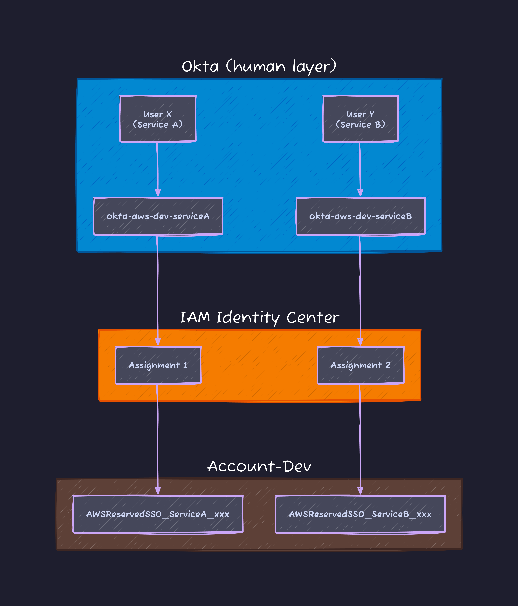

# Identity Center: the "Okta group explosion" trap inside a single AWS account

Was wiring up an Okta to IAM Identity Center to AWS Organizations setup and ran into a clean-looking idea that turned out to be wrong: keep one `developers` Okta group, then just stack multiple Assignments with different Permission Sets to get per-service permissions. Works perfectly across separate accounts. Breaks the moment two services share one account. Writing it down because it bit me for an afternoon.

## What an Assignment actually is

In IAM Identity Center (formerly AWS SSO), every access decision reduces to a 3-tuple:

`Assignment = (Principal, Target Account, Permission Set)`

- **Principal**: a user or, more commonly, an Okta group synchronised over SCIM (RFC 7644).
- **Target Account**: an AWS account ID under the Organization.
- **Permission Set**: a named bundle of AWS-managed, customer-managed, and/or inline policies, defined centrally.

When an Assignment is created, Identity Center provisions an IAM role inside the target account named `AWSReservedSSO_<PermissionSetName>_<random-suffix>`. Users don't sign in as themselves: they assume that generated role through the AWS access portal.

## Scenario A: separate accounts, one Okta group works

If Service A lives in Account-A and Service B in Account-B, a single `developers` group is fine. Map it to a `ServiceA-Policy` Permission Set on Account-A, and to a `ServiceB-Policy` Permission Set on Account-B. Each developer sees two tiles in the portal, but the blast radius is bounded by the account boundary.

```text
[ Okta IdP ]            [ Identity Center Assignments ]              [ AWS ]

                        +-------------------------------+
                        | Principal:  developers        |
 developers ----------> | Permission: ServiceA-Policy   | ----------> Account-A
 (single group)         | Account:    Account-A         |
                        +-------------------------------+

                        +-------------------------------+
                        | Principal:  developers        |
                        | Permission: ServiceB-Policy   | ----------> Account-B
                        | Account:    Account-B         |
                        +-------------------------------+
```

## Scenario B: shared account, the trick collapses

Put Service A and Service B in the same Account-Dev, with User X owning Service A and User Y owning Service B. Stack two Assignments (`developers` to ServiceA-Policy, `developers` to ServiceB-Policy) on Account-Dev and **both portal tiles show up for every group member**. There is no per-user filter inside an Assignment.

```text
[ Okta IdP ]                 [ Identity Center ]                    [ Account-Dev ]

 User X (Service A) \                                                Both tiles
                     -> developers -> Assignment(ServiceA-Policy) ->  visible to
 User Y (Service B) /  (group)     -> Assignment(ServiceB-Policy) ->  X and Y
```

To enforce per-user isolation purely through Assignments, you end up splitting the human layer: `okta-aws-dev-serviceA`, `okta-aws-dev-serviceB`, and one more Okta group per permission mutation. Every new microservice or role change triggers: create Okta group, wait for SCIM sync (default 40 minutes for Okta to IdC), bind via Identity Center. The IdP fills up with infrastructure-shaped groups that have nothing to do with org structure.



## Three exits, ranked by how I'd reach for them

**1. ABAC with session tags.** Keep one `developers` Okta group. Push a profile attribute (e.g. `Project: ServiceA`) through SAML / SCIM as a session tag, then gate access with `aws:PrincipalTag` vs `aws:ResourceTag`:

```json
{
  "Condition": {
    "StringEquals": {
      "aws:ResourceTag/Project": "${aws:PrincipalTag/Project}"
    }
  }
}
```

One Permission Set covers every project; new projects only need a tag, not a new group. Works for resource-tag-aware services (EC2, Lambda, S3 with `s3:ResourceTag` on the bucket, and most newer APIs).

**2. Trusted Identity Propagation (TIP).** The 2024 AWS-native answer for "fine-grained access inside a single account" on a growing list of services (Redshift, QuickSight, Athena, S3 Access Grants, Lake Formation, EMR). Instead of users assuming a shared SSO role, the user's IdC identity is propagated into the service, and authorisation is evaluated against the actual user, not the role. Permission Sets stay coarse; the service enforces per-user rules. If the workload service supports TIP, this is the cleanest answer.

**3. Account split.** If neither ABAC nor TIP fits (the service isn't tag-aware and doesn't support TIP), the multi-account playbook still wins: move Service A and Service B into separate accounts and you are back in Scenario A.
What I'd avoid: inflating the Okta directory with infra-shaped groups. Once the IdP starts mirroring AWS account structure, it stops being a human directory.

source: AWS IAM Identity Center user guide (`docs.aws.amazon.com/singlesignon/latest/userguide/`), ABAC with Identity Center (`/abac.html`), Trusted Identity Propagation overview (`/trustedidentitypropagation.html`); RFC 7644 (SCIM Protocol); verified against my own Okta to IdC test tenant on 2026-05-31.
