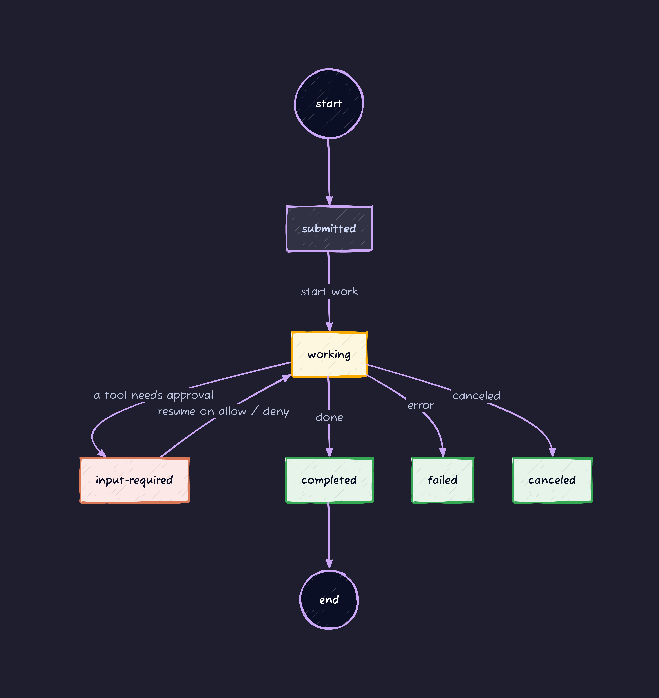
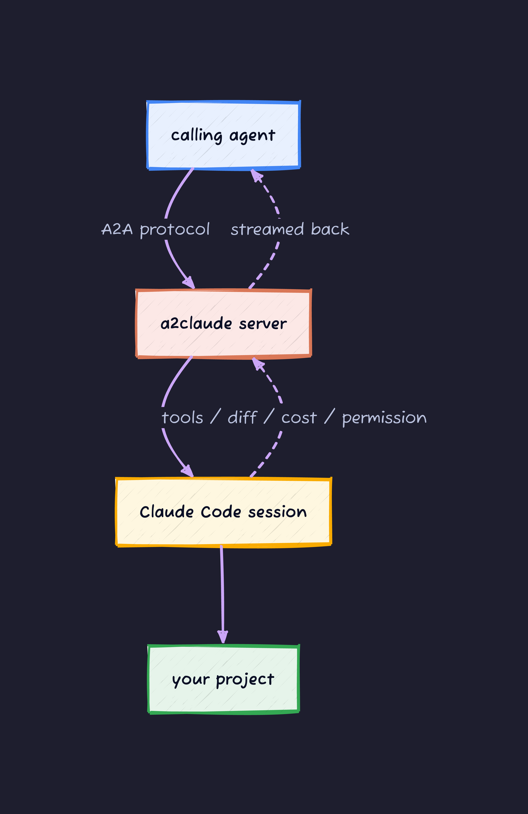
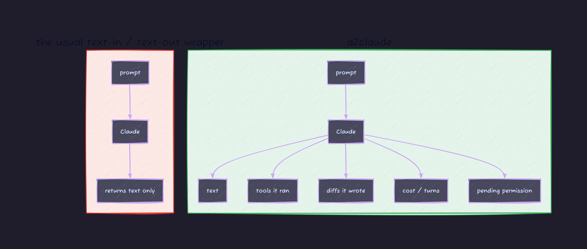
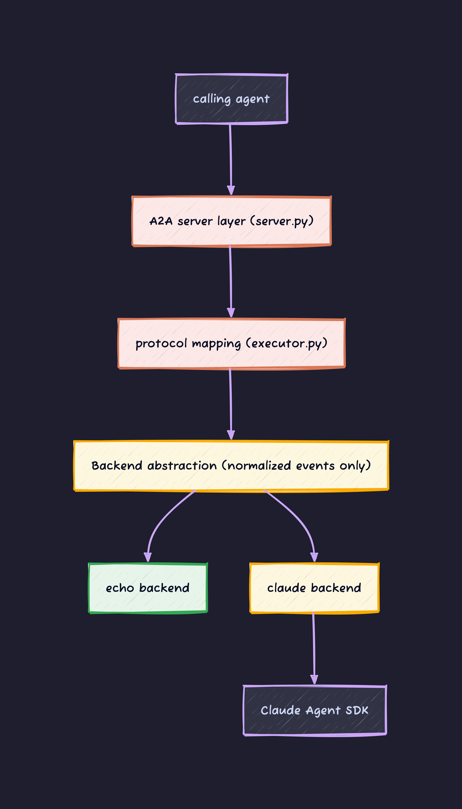
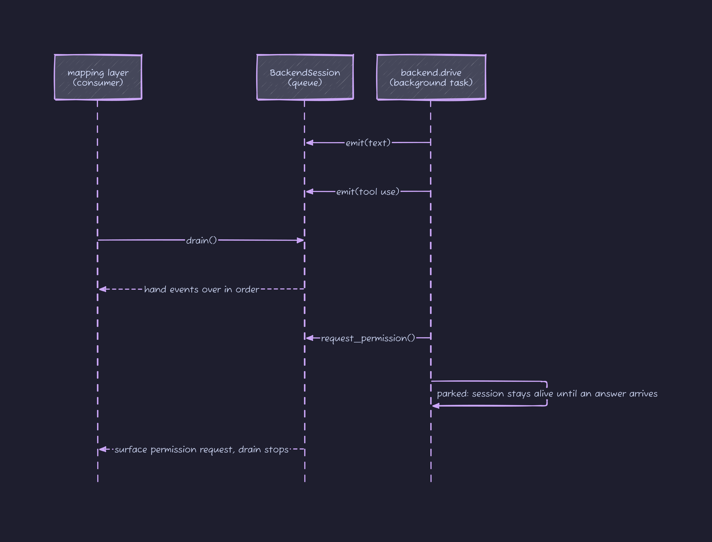
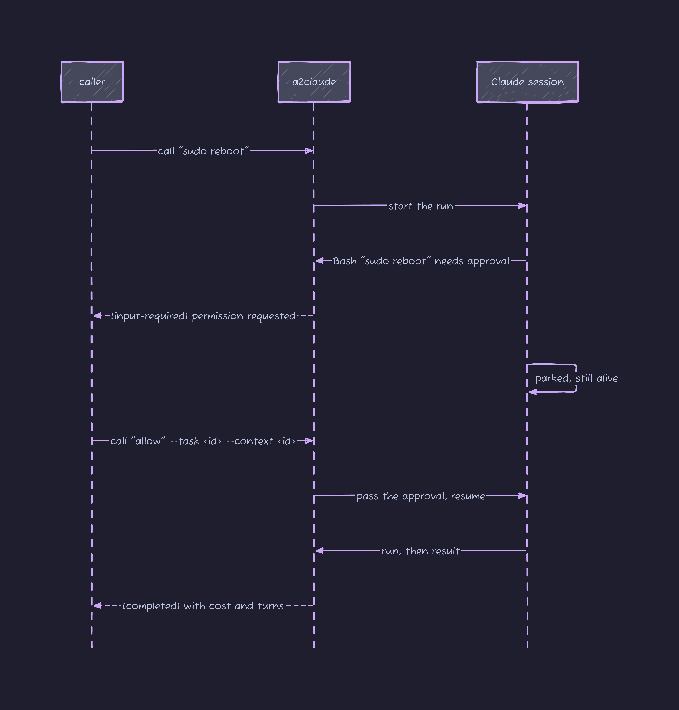
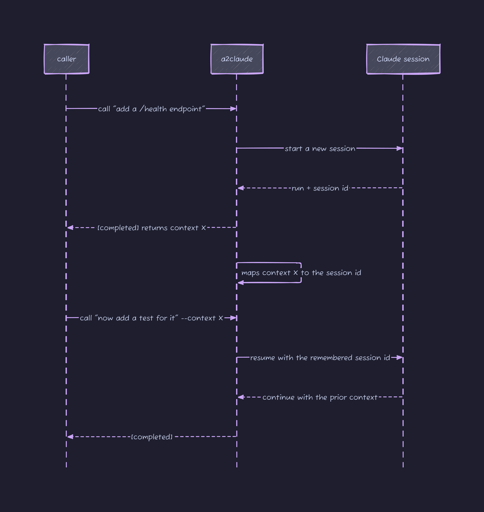

# Introduction

Running a single AI agent is starting to feel dated. You have an agent that researches, one that plans, one that writes code, each with a role, handing work to each other. When I tried to wire up a setup like that, I got stuck on one question: what do I use for the "writes code" slot?

I already had Claude Code. It actually runs tools, edits files, and runs tests for you. The catch is that Claude Code is built to be driven by a human sitting at a terminal. There is no built-in door for another agent to call it automatically.

So I wrote a small tool that exposes Claude Code as an **A2A protocol server**. It is called `a2claude`. Another agent sends "implement this feature" over A2A, a real Claude Code session runs against the project you pointed it at, and the result streams back. And what comes back is not a blob of text: it is structured information about which tools ran, which files changed and how, what it cost, and which actions need approval.

The repo is here: [github.com/kanywst/a2claude](https://github.com/kanywst/a2claude)

This article is written so that reading top to bottom takes you from knowing nothing about A2A or the internals of Claude Code to understanding exactly what a2claude bridges and how.

## Background 1: What A2A is

A2A (Agent2Agent) is a **communication standard for AI agents to talk to each other**. Google announced it in 2025, donated it to the Linux Foundation the same year, and it is now governed there under neutral stewardship (v1.0 landed in 2026). It rides on top of HTTP over one of JSON-RPC, gRPC, or REST (the spec requires all three to expose the same operations), and it standardizes the exchange where one agent asks another to do a job.

There are only four terms you need to hold onto.

- **Agent Card**: the business card that states what an agent can do. It lives at a fixed path, `/.well-known/agent-card.json`, and a caller reads it first to decide whether this agent can handle what it wants done.
- **Task**: one request. It carries state and moves like `submitted` (received) → `working` (in progress) → `completed` (done). Along the way it can also hit `input-required` (waiting on input) or `failed`.
- **Artifact**: the output of a Task. Generated text, files, and so on. It can be returned incrementally (streamed).
- **contextId**: the conversation handle. Send the next Task with the same contextId and it is treated as a continuation of the previous one.

The Task state transitions look like this. It pays to keep this in your head, because how a2claude uses these states matters later.



A2A has other states too, such as `rejected` (the agent declines the request), but the ones a2claude actually uses are in this diagram. The one in red, `input-required`, becomes the star of the second half.

The point is that A2A is a shared language between agents: it does not matter what an agent runs on the inside (Claude or some other LLM), as long as it honors the Agent Card and the Task exchange, the conversation works.

## Background 2: What Claude Code is

Claude Code is Anthropic's coding agent. It is not a chat that only returns prose. It also:

- runs commands with `Bash`
- reads and writes files with `Read` / `Edit` / `Write`
- **stops to ask for approval** before risky actions
- reports the cost and turn count of a run

In other words, it actually moves its hands. The thing to notice for this article is that when Claude Code runs, **a lot of information beyond text comes out**: which tool it called, which file it changed and how, what it cost. a2claude does not throw that away. It puts it on A2A.

## Background 3: Why a bridge is needed

A2A is the protocol for agents to talk. Claude Code is the powerful tool that actually writes code. The two do not line up. Claude Code has no A2A server door, and from the A2A world Claude Code is invisible.

So you need a translator in between. It takes an A2A Task, drives Claude Code, and translates the events Claude Code emits back into the language of A2A. That is what a2claude does.



## How this differs from the usual approach

Adapters that "wrap a coding agent in A2A" are not rare. But most of them **flatten both input and output to text**. You hand over a prompt and get text back. That erases everything that happened in between. From the calling agent's point of view, you cannot see whether a file was rewritten, what spent money, or whether an action needed approval.

a2claude keeps the structure that comes out of Claude Code and carries it onto A2A. The difference between the left and right of the diagram below is the whole reason this project exists.



## What maps to what

The heart of a2claude comes down to one mapping table: "what Claude Code emits" onto "which A2A surface it lands on". This table, which is also in the README, is the core of the design.

| What Claude Code emits | The A2A surface it lands on |
| --- | --- |
| Assistant text | A streamed artifact (`append` / `last_chunk`) |
| A tool call (Bash, Edit, ...) | A `working` status update |
| A file edit | A named artifact carrying the diff |
| Run result | Cost / turns / usage on the completion message |
| Session id | Mapped to the A2A `contextId` to resume next time |

This mapping is closed up in one place in the code (`executor.py`). That is what pays off in the next section.

## Architecture: the A2A layer does not know Claude directly

a2claude is split into layers. The single most important design decision is that **the layer doing the A2A translation never imports the SDK that drives Claude Code**.

In between sits an abstraction called a "backend". A backend's job is to drive Claude Code and emit **normalized events** (text, tool calls, file changes, permission requests, run results). The translation layer looks only at those events and maps them onto A2A. How Claude is invoked (through the SDK today, through the raw CLI later) is none of the translation layer's business.



Because of this split there are two backends.

- **`echo`**: no API key and no Claude install required. A dummy that just mirrors the input. It lets you exercise the server, the protocol mapping, and the CLI **end to end, offline**. It reproduces every path, including the permission round trip that comes up later.
- **`claude`**: drives the real Claude Code through the Claude Agent SDK.

Why is "the translation layer not knowing the SDK" worth it? Because testing gets easy. The `echo` backend alone can verify all of the A2A behavior. With no API key to call Claude, even in CI, you can check that the design has not broken.

## Inside: an event queue and "parking"

This is the most interesting part of a2claude. A backend's `drive` runs as a **background task** and pushes the events it produces onto a queue. The translation layer (the consumer) pulls them off in order with `drain`.

While things are flowing normally it is just a producer / consumer. The interesting case is when you hit a tool that needs approval. Claude Code stops and waits. At that point a2claude **parks the background task right at the permission request**, and pushes only a "please approve this" event onto the queue. `drain` returns that one event and then halts.



While it is halted, the Claude session does not die: it waits. Later, when the caller sends its answer, the parked task resumes and starts flowing again. This trick of "keeping the session alive across two separate calls" is what makes the next section's permission exchange possible.

## Permissions: do not auto-approve, do not silently skip

How you handle actions that need approval is the most nerve-wracking part of opening a coding agent up to someone else (another agent). A sloppy implementation either "auto-approves everything" or "silently skips anything that needs approval". Both are dangerous.

a2claude uses the **A2A `input-required` state**. This is not something a2claude invented: A2A defines it precisely for human-in-the-loop, where a human or the caller makes a decision mid-task. Per the spec, when a Task reaches `input-required` the processing stops there and control returns to the caller. a2claude rides directly on that.

When a tool that needs approval shows up, the Task stops at `input-required` and asks the caller "approve this action?". The caller sends its answer as a message **on the same Task**. `allow` (or `yes`, `approve`, `ok`) approves; anything else denies.

Thanks to the park from the previous section, the Claude session is still alive while stopped, so when the approval comes back it picks up **right where it left off**.



One more important point: **the server does not inherit the personal Claude settings of whoever runs it**. Your local Claude Code has a pre-approved tool allowlist ("this tool is always OK"), but the server does not load it. So when it acts on behalf of another agent, any action needing approval always routes back to the caller for a decision. Read-only actions that are already considered safe still run without a prompt, as before.

## Session continuity: remembering "the previous turn"

Claude Code holds a conversation session and can keep working with the prior context. a2claude **ties that Claude session id to the A2A contextId** and remembers it. Send the next Task with the same contextId and the same Claude conversation resumes.



"Add a `/health` endpoint" → "now add a test for it" goes through as one continuous piece of work, not two separate requests.

## Try it

From here on we actually run it. You need three things.

- Python 3.13 or newer
- [uv](https://docs.astral.sh/uv/)
- (only for the `claude` backend) the Claude Code CLI on your `PATH`

First clone and install dependencies.

```bash
git clone https://github.com/kanywst/a2claude
cd a2claude
uv sync
```

### First, offline (the echo backend)

The `echo` backend needs no API key and no Claude install. Running the whole path offline first puts your mind at ease. Start the server and call it from another mouth.

```bash
uv run a2claude serve --backend echo &
uv run a2claude call "fix the failing test"
```

What comes back looks like this. A Task and context id are assigned, and after the stream the completion metadata (cost and turn count) is attached.

```text
task 189b1c63-1a7b-4908-87c4-c8f3bba8f6b5
context 0b2a901e-2b6f-4c56-bba2-d0da546936e9

  · Echo
fix the failing test
[completed] $0.0 · 1 turns
```

### Point it at a real project (the claude backend)

Now the `claude` backend. Use `--cwd` to set the directory Claude Code works in.

```bash
uv run a2claude serve --backend claude --cwd /path/to/project
uv run a2claude call "add a /health endpoint" --url http://localhost:9100/
```

### Ask for a follow-up

Pass the `context` that came back from the previous turn and it becomes a continuation of the same conversation.

```bash
uv run a2claude call "now add a test for it" --context <context-id>
```

### Try the permission exchange

Send an action that needs approval and it stops at `input-required` and asks for an answer. The answer goes to the same Task.

```bash
uv run a2claude call "sudo reboot"
# ... [input-required] Permission requested for Bash: $ sudo reboot
#       reply: a2claude call "allow" --task <id> --context <id>
uv run a2claude call "allow" --task <id> --context <id>
```

The `echo` backend also asks for approval when the prompt contains `sudo`, so you can verify **just this exchange** without driving Claude.

### Peek at the Agent Card

This is the business card the other agent reads first.

```bash
uv run a2claude card
```

a2claude does not lump Claude Code's abilities into one "chat box". It lists them as **discrete skills** on the Agent Card: code generation, refactor, debug, review, test, and code explanation, six of them. The caller can aim a request, "this is a debug job", deliberately.

## Wrap-up

What a2claude does comes down to one mapping table: it maps the structured events Claude Code emits onto A2A's Task, Artifact, status, and contextId. It does not flatten them to text.

Three design points to single out:

1. **The translation layer does not know Claude's SDK.** With a backend abstraction in between, `echo` alone verifies the whole path offline, and swapping out how Claude is invoked later leaves the translation layer untouched.
2. **Permissions map to `input-required`.** Keeping a parked session alive across two calls means it never auto-approves and never silently skips. The decision always returns to the caller.
3. **contextId makes the conversation continuous.** Mapping the Claude session id to the A2A context remembers "the previous turn".

If you are looking for a "writes code" slot in a setup where agents hand work to each other, you can drop Claude Code straight in as a part. The code is small enough to read all of, so take a look, and if something is off, throw an Issue.

[github.com/kanywst/a2claude](https://github.com/kanywst/a2claude)
