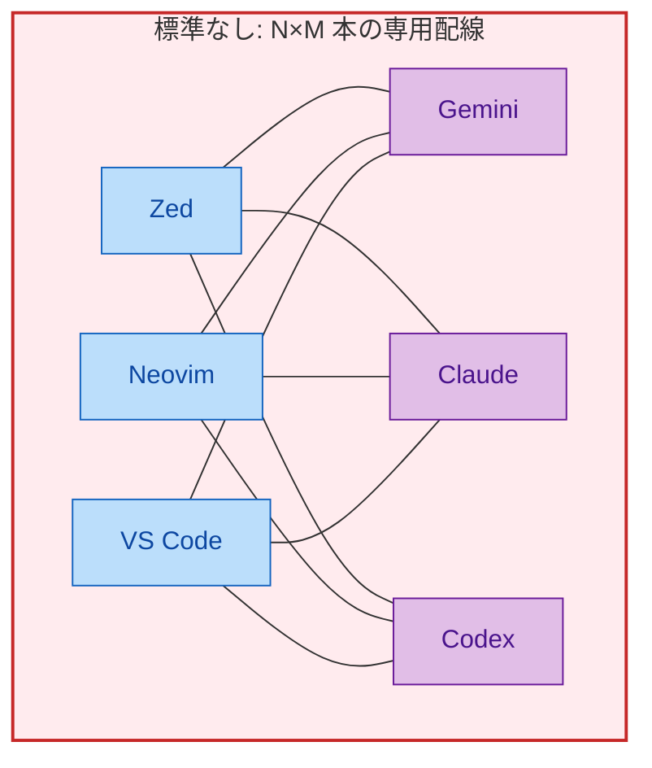
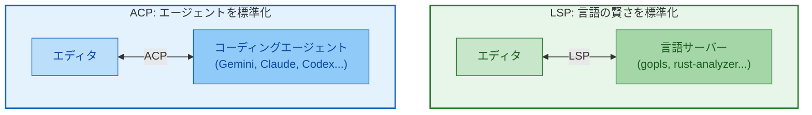
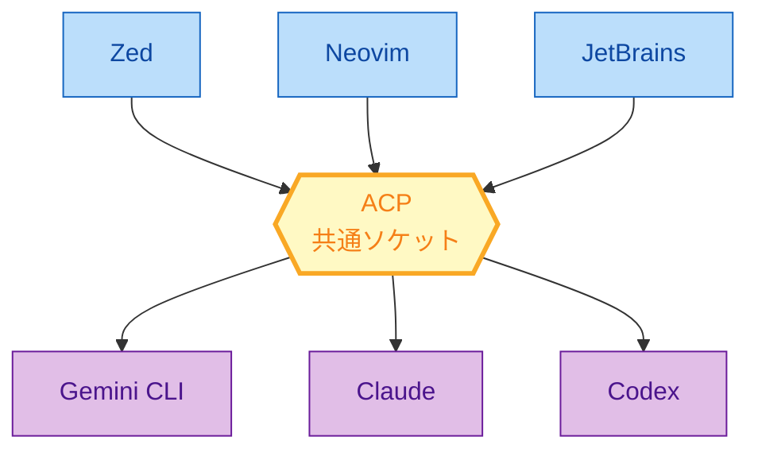
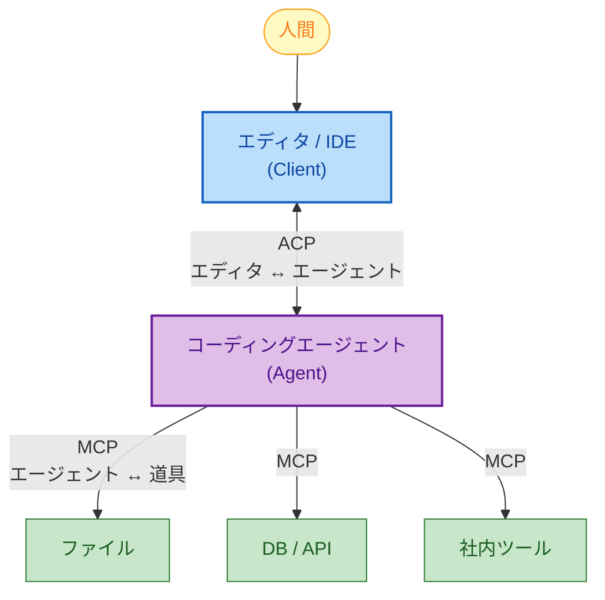
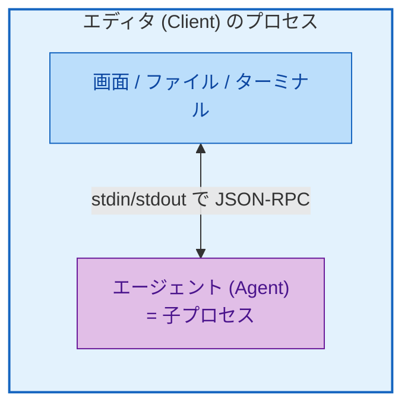
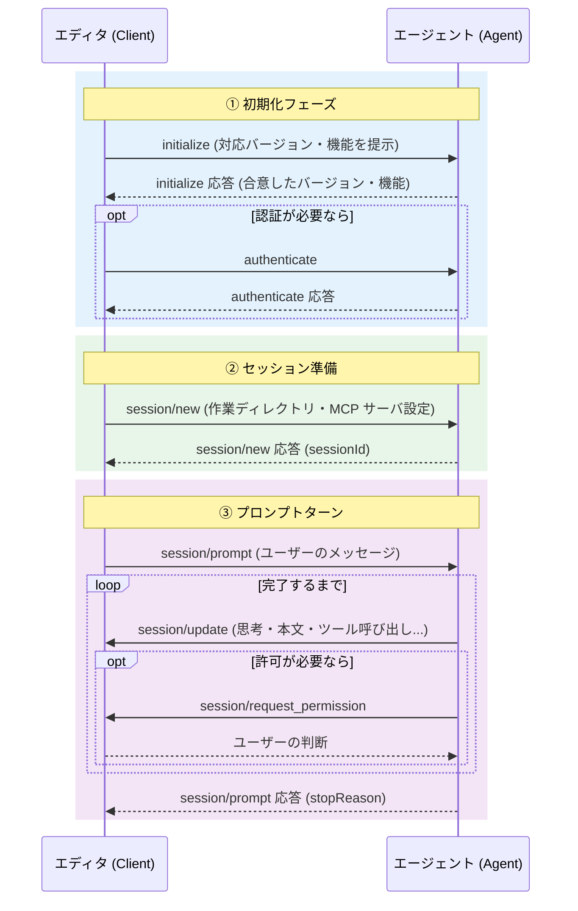
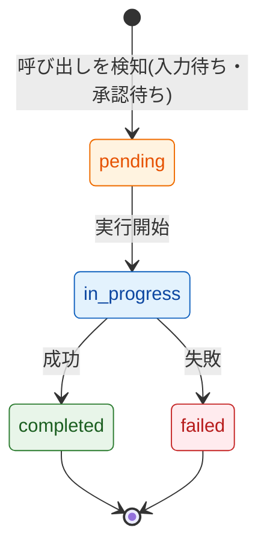
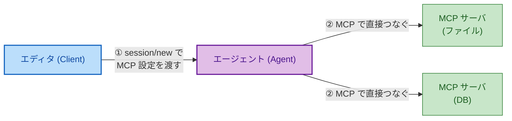
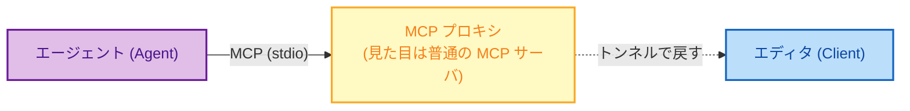

## きっかけ: エディタを変えるたびにエージェントの接続をやり直していた

去年から、コードを書くときにいわゆる「AI コーディングエージェント」を常用するようになった。Claude Code だったり、Google の Gemini CLI だったり、OpenAI の Codex CLI だったりする。どれも「指示を出すと、自分でファイルを読んで、直して、テストを流して、また直す」というループを勝手に回してくれるやつだ。

ここで地味に困ったことがあった。エージェントを乗り換えるたびに、エディタとの接続をゼロから作り直すことになる。あるエージェントは Zed の中にきれいに統合されているのに、別のエージェントはターミナルで別窓を開いて動かすしかない。差分(diff)がエディタ上に出るものもあれば、テキストがだらだら流れるだけのものもある。

「エディタ側とエージェント側で、話し方さえ決まっていればこんなことにならないのに」と思って調べていて見つけたのが **Agent Client Protocol(ACP)** だった。これは Zed という高速エディタを作っている Zed Industries が、Google の Gemini CLI チームと一緒に 2025 年 8 月末に公開した規格で、一言でいうと「**エディタとコーディングエージェントの共通の話し方**」を決めたものだ。

この記事は、その ACP を上から順番に読めば理解できるように書いた。前提知識はほとんど要らない。「AI にファイルを触らせて何か作らせたことがある」くらいの経験があれば十分ついてこられる。まず「何が問題だったのか」を絵にして、次に「ACP がその問題をどう解いたのか」を見て、最後に実際にやり取りされる JSON メッセージまで降りていく。

---

## 前提の整理: 「エディタ」と「コーディングエージェント」は別のプログラム

用語を先にそろえておく。ここが曖昧なまま進むと、後半のメッセージの向き(どっちがどっちに話しかけるか)で必ず混乱する。

- **エディタ / IDE**: 人間がコードを読み書きするための画面。VS Code、Zed、Neovim、JetBrains 系(IntelliJ など)、Emacs。ファイルを開いて、色を付けて、保存する。これが ACP でいう **Client(クライアント)** になる。
- **コーディングエージェント**: 生成 AI を使って、自分で判断しながらコードを書き換えていくプログラム。Gemini CLI、Claude、Codex、Goose など。「このバグ直して」と投げると、関連ファイルを探し、編集し、テストを走らせ、結果を見てまた直す、というループを自走する。これが ACP でいう **Agent(エージェント)** になる。

ここで押さえておきたいのは、この 2 つは **もともと別々に作られた別々のプログラム** だということ。エディタは「人間の操作を受け取って画面を描く」のが仕事で、エージェントは「AI にコードを書かせる」のが仕事。役割がまるで違う。だから両者をつなぐには、間に「決まった話し方」が必要になる。その「決まった話し方」を標準化したのが ACP だ。

では、そういう標準がなかったころは何が起きていたのか。ここを押さえると、ACP のありがたみが腹落ちする。

---

## 何が問題だったのか: N×M の組み合わせ地獄

標準がない世界を想像してみる。エディタが N 種類あって、つなぎたいエージェントが M 種類あるとする。

標準がないと、エディタとエージェントの **すべての組み合わせに専用の接続コードを書く** ことになる。Zed に Gemini をつなぐコード、Zed に Claude をつなぐコード、Neovim に Gemini をつなぐコード……と、掛け算で増えていく。これが N×M 本の配線だ。

しかもこの配線は「誰が書くのか」という押し付け合いになる。エディタ側が全エージェントに合わせるのも、エージェント側が全エディタの独自 API を実装するのも、どちらも現実的じゃない。結果として「このエディタはこのエージェントにしか対応していません」という囲い込みが生まれ、ユーザーは自由にツールを選べなくなる。



線が 9 本ある。エディタとエージェントがそれぞれ 10 種類になれば 100 本だ。新しいエージェントが 1 つ出るたびに、全エディタが対応作業をしないと使えない。これが「N×M の組み合わせ地獄」で、ACP が解こうとした問題そのものだ。

---

## ACP のアイデア: LSP が通った道をもう一度

この「N×M 地獄」、実はソフトウェアの世界で一度きれいに解かれたことがある。**LSP(Language Server Protocol)** だ。

ACP を理解する一番の近道は LSP との対比なので、知らない人向けに一段落だけ説明する。昔は、プログラミング言語ごとの賢い補完やエラー表示(「この変数は未定義」みたいなやつ)を、各エディタが各言語ぶん自前で実装していた。VS Code 用の Go 補完、Vim 用の Go 補完、VS Code 用の Rust 補完……と、これも N×M だった。

Microsoft が LSP でやったのは、「言語の賢さ」を **言語サーバー** という独立したプログラムに切り出して、エディタと言語サーバーの間の話し方を 1 つに決めたことだ。おかげで言語側は「LSP をしゃべるサーバー」を 1 個作ればすべてのエディタで動くし、エディタ側は「LSP クライアント」を 1 個実装すればすべての言語に対応できる。配線が N×M から N+M に減った。

ACP はこれの **コーディングエージェント版** だ。Zed の CEO の Nathan Sobo は発表時にこう言っている(意訳):

> LSP が「言語の賢さ」をモノリシックな IDE から切り離したのと同じように、ACP のゴールはエディタを変えずにエージェントを乗り換えられるようにすることだ。



つまり、中央に **共通ソケット** を 1 個置くという発想。エージェントは「ACP をしゃべるプログラム」を 1 個作れば、対応する全エディタで使える。エディタは「ACP クライアント」を 1 個実装すれば、対応する全エージェントを呼べる。9 本あった線が消えて、みんなが同じソケットに挿さる。



補足しておくと、ACP は Apache 2.0 ライセンスのオープンな規格で、最初の対応エディタは Zed(と Neovim 拡張)、最初の対応エージェントは Gemini CLI(参照実装)だった。Google の Gemini CLI チームが Zed を使っていて「もっと深く統合したい」と言い出したのが発端らしい。

---

## ACP はどの層の話なのか: MCP とは競合しない

ここで多くの人が引っかかるポイントを先につぶしておく。「AI エージェントの標準」といえば **MCP(Model Context Protocol)** を思い浮かべる人が多い。MCP は Anthropic が 2024 年に公開した規格で、ざっくり言うと「エージェントに外部の道具(ファイル、DB、API)を使わせるための共通の話し方」だ。用途が近そうに見えるので「ACP は MCP と何が違うの? どっちを使うの?」と混乱しやすい。

結論から言うと、**この 2 つは競合していない**。話している「層」が違う。エージェントが外の世界とやり取りする方向は 2 つあって、ACP と MCP はそれぞれ別の方向を担当している。



- **ACP は「上」の層**: 人間がいるエディタと、エージェントの間。「人間の指示を届け、エージェントの作業をリアルタイムに画面へ返す」ためのプロトコル。
- **MCP は「下」の層**: エージェントと、それが使う道具(ファイル、DB、外部 API)の間。「エージェントに道具を持たせる」ためのプロトコル。

だから 1 つのやり取りの中で両方が同時に使われる。エディタは ACP でエージェントに「このバグ直して」と伝え、エージェントは MCP で DB を覗いたりファイルを読んだりして作業する。ACP は MCP を置き換えるものじゃなく、**MCP の JSON 表現を積極的に再利用して作られている**(後で出てくる「コンテンツブロック」は MCP と同じ型)。上下できれいに役割分担している、と覚えておけばいい。

ついでにもう 1 つの紛らわしい規格 **A2A(Agent2Agent)** との違いも一言で。A2A は「対等なエージェント同士が横方向に協調する」ための規格で、ACP の「エディタがエージェントに作業を頼む」縦方向とは向きが違う。この記事では A2A には踏み込まないが、「ACP・MCP・A2A は競合ではなく担当が違う」とだけ押さえておけば混乱しない。

| 規格 | つなぐ相手 | 一言でいうと |
| --- | --- | --- |
| **ACP** | エディタ ↔ エージェント | 人間の道具(エディタ)にエージェントを挿す |
| **MCP** | エージェント ↔ 道具 | エージェントに道具を持たせる |
| **A2A** | エージェント ↔ エージェント | エージェント同士で仕事を渡し合う |
| **LSP** | エディタ ↔ 言語サーバー | エディタに言語の賢さを挿す(ACP の先輩) |

---

## 登場人物: Client(エディタ)と Agent(エージェント)、どっちがどっちを起動するか

ここから技術的な中身に入る。まず「誰が誰を起動して、どっち向きに話すのか」をはっきりさせる。ここを間違えると後のメッセージが全部逆に見える。

ACP には登場人物が 2 人しかいない。

- **Client(クライアント)= エディタ**。人間との窓口。画面を持っていて、ファイルやターミナルなどの環境を握っている。
- **Agent(エージェント)= コーディングエージェント**。生成 AI を使って自走するプログラム。

起動の順序が大事だ。**エディタ(Client)がエージェント(Agent)を子プロセスとして起動する**。ユーザーがエディタ上で「このエージェントに接続」と操作したタイミングで、エディタがエージェントのプログラムを立ち上げ、その標準入力・標準出力(stdin/stdout)を握る。



ここで名前のちょっとした引っかけがある。ネットワークの世界だと「サーバー」が先にいて「クライアント」が挿しに行くイメージだが、ACP では **エディタ(Client)のほうが親で、エージェント(Agent)が子プロセス** だ。「クライアントが親でサーバーっぽい側が子」という位置関係を先に飲み込んでおくと、この先ずっと楽になる。

そして通信は **双方向** だ。エディタ → エージェント方向だけじゃなく、エージェント → エディタ方向の呼び出しもある。たとえばエージェントが「このファイル書き換えていい?」と許可を求めるとき、エージェントのほうからエディタに問い合わせる。この双方向性が ACP の肝で、あとで何度も出てくる。

---

## 通信の土台: JSON-RPC 2.0 を stdin/stdout で

ACP のメッセージ形式は独自発明ではなく、**JSON-RPC 2.0** という枯れた規格をそのまま使っている。これも LSP と同じ選択だ。JSON-RPC には 2 種類のメッセージしかない。

- **メソッド(Method)**: リクエストを送って、結果(またはエラー)が返ってくる。往復するもの。`id` が付く。
- **通知(Notification)**: 一方通行で投げっぱなし。返事は来ない。`id` は付かない。

たとえばエディタがエージェントに「初期化して」と頼むメソッド呼び出しは、こんな JSON になる。

```json
{
  "jsonrpc": "2.0",
  "id": 0,
  "method": "initialize",
  "params": { "protocolVersion": 1 }
}
```

そして ACP は、この JSON-RPC の **通知** を多用して、エージェントの作業状況をリアルタイムにエディタへ流す。「今このファイルを読んでます」「テストを実行中です」といった細かい進捗が、返事の要らない通知としてどんどん飛んでくる。だから画面に作業がぬるぬる反映される。ローカルで動かす場合はこれを stdio(標準入出力)の上に載せる。リモート(クラウド上のエージェント)向けに HTTP や WebSocket も検討中だが、記事執筆時点の基本はローカルの stdio だ。

もう 1 つ地味だが重要な決め事。**プロトコル内のファイルパスはすべて絶対パス**でなければならない。行番号は 1 始まり。エディタとエージェントが別プロセスで、作業ディレクトリの前提を共有できないからだ。

---

## 接続の一生: initialize から stop reason まで

ここが記事の本体。エディタとエージェントがつながってから 1 回の応答が終わるまで、どんな順番でメッセージが飛ぶのかを通して見る。大きく 3 つのフェーズに分かれる。

1. **初期化フェーズ**: `initialize`(と必要なら認証)
2. **セッション準備**: `session/new`(または `session/load`)
3. **プロンプトターン**: `session/prompt` を投げて、応答が流れてきて、終わる

まず全体像を 1 枚で。色分けした 3 つの帯がそれぞれのフェーズだ。



これから 1 フェーズずつ、実際の JSON を見ながら降りていく。

### フェーズ① initialize: バージョンと「できること」をすり合わせる

つながって最初にやるのは握手だ。エディタが `initialize` を送り、「自分はプロトコルのバージョン 1 に対応、ファイルの読み書きとターミナルが使える」と自分の能力(capabilities)を伝える。

```json
{
  "jsonrpc": "2.0",
  "id": 0,
  "method": "initialize",
  "params": {
    "protocolVersion": 1,
    "clientCapabilities": {
      "fs": { "readTextFile": true, "writeTextFile": true },
      "terminal": true
    }
  }
}
```

エージェントは、合意したバージョンと **自分ができること** を返す。下の例だと「過去セッションの読み込みに対応」「プロンプトに画像・音声を含められる」「MCP サーバに HTTP でつなげる」と申告している。

```json
{
  "jsonrpc": "2.0",
  "id": 0,
  "result": {
    "protocolVersion": 1,
    "agentCapabilities": {
      "loadSession": true,
      "promptCapabilities": { "image": true, "audio": true },
      "mcpCapabilities": { "http": true }
    },
    "authMethods": []
  }
}
```

この capabilities のやり取りが効いてくる。ACP は「全機能を全員が実装しろ」という重い規格ではなく、「使える機能を最初に申告し合って、相手が対応していない機能は呼ばない」という作りになっている。だから小さなエージェントは最低限だけ実装すればいいし、リッチなエディタは対応しているエージェント相手だけ高度な機能を使う。バージョン番号(`protocolVersion`)は破壊的変更のときだけ上がる整数で、機能追加は capabilities 側で吸収する。この二段構えのおかげで、新機能が増えても既存の実装が壊れない。

認証が要るエージェント(クラウドのアカウントにひもづくものなど)は `authMethods` に方式を並べ、エディタが `authenticate` で 1 つ選ぶ。ローカルで動く多くのエージェントでは空でいい。

### フェーズ② session/new: 会話の入れ物を作る

握手が済んだら **セッション** を作る。セッションは 1 本の会話スレッドで、それぞれが独立した文脈・履歴・状態を持つ。1 本の接続の中で複数のセッションを同時に走らせられる(別々の考え事を並行でやれる)。

エディタは `session/new` に、作業ディレクトリ(`cwd`、絶対パス)と、エージェントに使わせたい **MCP サーバの設定** を渡す。ここが ACP と MCP の合流点で、あとで一節を割く。

```json
{
  "jsonrpc": "2.0",
  "id": 1,
  "method": "session/new",
  "params": {
    "cwd": "/home/user/project",
    "mcpServers": [
      { "name": "filesystem", "command": "/path/to/mcp-server", "args": ["--stdio"], "env": [] }
    ]
  }
}
```

エージェントは、この会話を指す **セッション ID** を返す。以後のやり取りは全部この ID を添えて行う。

```json
{ "jsonrpc": "2.0", "id": 1, "result": { "sessionId": "sess_abc123def456" } }
```

エージェントが `loadSession` 能力を持っていれば、`session/new` の代わりに `session/load` で過去の会話を復元できる。このとき面白いのは、エージェントが過去のやり取りを **`session/update` 通知として全部リプレイして** から応答を返すところ。エディタは初めて開いた会話でも、履歴を 1 メッセージずつ受け取って画面を組み立て直せる。エディタを再起動しても続きから話せる、という体験はこれで実現されている。

### フェーズ③ プロンプトターン: 1 回の応答が終わるまでのループ

いよいよ本番。ユーザーが何か指示すると、エディタは `session/prompt` を送る。中身は **コンテンツブロック** の配列で、テキストだけでなくファイルや画像も混ぜられる。下の例は「このコードの問題点を見て」というテキストに、対象ファイルの中身を添えている。

```json
{
  "jsonrpc": "2.0",
  "id": 2,
  "method": "session/prompt",
  "params": {
    "sessionId": "sess_abc123def456",
    "prompt": [
      { "type": "text", "text": "このコードの問題点を見てくれる?" },
      {
        "type": "resource",
        "resource": {
          "uri": "file:///home/user/project/main.py",
          "mimeType": "text/x-python",
          "text": "def process_data(items):\n    for item in items:\n        print(item)"
        }
      }
    ]
  }
}
```

ここから、エージェントが AI(言語モデル)に投げて、返ってきたものを **`session/update` 通知** でエディタに流す。この通知が ACP のリアルタイム感の正体で、いろんな種類がある。

たとえば「まず作業計画を立てました」という **プラン**。

```json
{
  "jsonrpc": "2.0",
  "method": "session/update",
  "params": {
    "sessionId": "sess_abc123def456",
    "update": {
      "sessionUpdate": "plan",
      "entries": [
        { "content": "構文エラーを確認", "priority": "high", "status": "pending" },
        { "content": "型の問題を洗い出す", "priority": "medium", "status": "pending" }
      ]
    }
  }
}
```

それから、AI が返した本文のテキスト(`agent_message_chunk`)。少しずつ届くので、画面には文章が流れるように出る。そして AI が「ツールを使いたい」と言えば、ツール呼び出し(`tool_call`)も通知で流れてくる。

このループが「AI が返す → ツールを使う → その結果をまた AI に渡す → AI がまた返す」と何周も回る。そして、これ以上ツールを呼ばずに AI が言い終えたら、エージェントは最初の `session/prompt` に対して **停止理由(stopReason)** を付けて応答し、ターンが終わる。

```json
{ "jsonrpc": "2.0", "id": 2, "result": { "stopReason": "end_turn" } }
```

停止理由にはいくつか種類がある。ここを見れば「なぜ止まったのか」がエディタ側で分かる。

| stopReason | 意味 |
| --- | --- |
| `end_turn` | AI が言い終わった(正常終了) |
| `max_tokens` | トークン上限に達した |
| `max_turn_requests` | 1 ターン内のモデル呼び出し回数の上限に達した |
| `refusal` | エージェントが続行を拒否した |
| `cancelled` | ユーザーが途中で中断した |

途中でユーザーが止めたくなったら、エディタは `session/cancel` 通知を投げる。エージェントは進行中の AI 呼び出しとツール実行を止めて、最終的に `cancelled` を返す。ここで規格が念を押しているのが、「中断はエラーじゃない」という点。ライブラリによっては処理を中断すると例外が飛んでエラー応答になりがちだが、それをエディタが「謎のエラー」として表示すると体験が悪い。だからエージェントは例外を握りつぶして、意味のある `cancelled` を返す責任を負う。細かいけれど、こういう UX への配慮が ACP の設計思想(UX ファースト)をよく表している。

---

## エージェントの「手」: ツール呼び出しとパーミッション

プロンプトターンの中で一番おもしろいのがツール呼び出しだ。AI が「ファイルを読む」「コマンドを実行する」といった外部操作をしたくなると、それを **ツール呼び出し** として要求する。エージェントはそれをエディタに通知して、画面にリアルタイムで出す。

ツール呼び出しには `kind`(種類)が付いていて、エディタはこれを見てアイコンや表示を切り替える。種類はこんな感じ。

- `read`(読む) / `edit`(編集) / `delete`(削除) / `move`(移動・改名)
- `search`(検索) / `execute`(コマンド実行) / `fetch`(外部データ取得)
- `think`(内部の思考・計画) / `other`(その他)

そして各ツール呼び出しは、状態(`status`)を持って進んでいく。ここも通知で刻々と更新される。



ここで **双方向通信** が効いてくる。危険な操作(ファイルの書き換え、コマンド実行)をする前に、エージェントは `session/request_permission` で **エディタに許可を求める**。これはエージェント → エディタ方向のメソッド呼び出しだ。

```json
{
  "jsonrpc": "2.0",
  "id": 5,
  "method": "session/request_permission",
  "params": {
    "sessionId": "sess_abc123def456",
    "toolCall": { "toolCallId": "call_001" },
    "options": [
      { "optionId": "allow-once", "name": "今回だけ許可", "kind": "allow_once" },
      { "optionId": "reject-once", "name": "拒否", "kind": "reject_once" }
    ]
  }
}
```

エディタは、ユーザーに聞くなり設定で自動判断するなりして、選んだ結果を返す。選択肢の `kind` には「今回だけ許可(`allow_once`)」「今後も許可(`allow_always`)」「今回だけ拒否(`reject_once`)」「今後も拒否(`reject_always`)」があり、エディタはこれを見て「毎回聞く/覚えておく」を実装できる。

この許可フローが、ACP の設計原則のひとつ「Trusted(信頼)」を支えている。ACP は 3 つの原則(MCP と型を共有する「MCP-friendly」、見せ方を重視する「UX-first」、そしてこの「Trusted」)で作られていて、Trusted の前提は「信頼できるモデルを、自分のエディタから使う」状況だ。エージェントはローカルのファイルや MCP サーバに触れるが、そのツール呼び出しの主導権はエディタ(＝ユーザー)側に残る。全自動で暴走させず、要所で人間に判断を返す。この「人間が輪の中にいる(human-in-the-loop)」設計が、コードを触らせる道具として現実的なんだと思う。

---

## エディタの機能を貸す: fs と terminal

ツールを実行するのはエージェント側だが、実行中にエージェントは **エディタの機能を借りられる**。代表が 2 つある。

**ファイルシステム(`fs/read_text_file` / `fs/write_text_file`)**。なぜエージェントが自前で `open()` せずにエディタに読ませるのか。理由は「**まだ保存していない編集中の状態**」まで含めて読めるからだ。ユーザーが画面で書きかけのファイルを、ディスクに保存する前でもエージェントが把握できる。逆に書き込みも、エディタ経由にすることでエディタ側が「エージェントがどのファイルをいじったか」を追跡できる。これはエディタが `fs` 能力を申告しているときだけ使える。

**ターミナル(`terminal/create` など)**。エージェントがビルドやテストのコマンドを、エディタの環境で実行できる。出力はリアルタイムでストリーミングされ、ツール呼び出しの中に埋め込んで「ライブのターミナル表示」として画面に出せる。プロセスを待つ、途中で kill する、といった制御もある。

どちらも「エージェントが勝手にやる」のではなく「エディタが能力を貸し、エディタがその様子を追える」形になっているのがポイントだ。

---

## MCP との合流点: エディタがエージェントに道具を配る

さっき「ACP は上の層、MCP は下の層」と言った。その 2 つが具体的にどう噛み合うかを見ておく。

思い出してほしいのが `session/new` の中にあった `mcpServers`。**エディタが握っている MCP サーバの設定を、セッション開始時にエージェントへ渡す**。エージェントはそれを受け取って、自分で各 MCP サーバに直接つなぎに行く。つまりエディタは「この道具たち使っていいよ」と設定だけ渡し、実際に道具を使うのはエージェント、という分業になる。



MCP サーバへの接続方法(トランスポート)は stdio が必須で、HTTP と SSE は capabilities で申告した場合だけ使える(SSE は MCP 側で非推奨になっているので、新しいエージェントは HTTP 推奨)。

ちょっと技巧的なのが「**エディタ自身が道具を提供したい**」ケース。たとえばエディタが持っている特別な機能を、AI にツールとして使わせたい。でも ACP と MCP を同じ 1 本の stdio 上で混ぜたくない。ここで ACP が示す解決策が、**エディタが小さな MCP プロキシを立てて、エージェントからのツール呼び出しをエディタ自身にトンネルで戻す** というもの。エージェントから見れば普通の stdio な MCP サーバに見えるが、その裏でエディタにつながっている。



こういう「既存の MCP の型をそのまま再利用して、車輪の再発明を避ける」姿勢が ACP 全体に通底している。プロンプトやツールの中身に使うコンテンツブロックの型も MCP と同じものを使っているので、MCP ツールの出力をそのままエディタに転送できる。

---

## UX ファーストの作り: plan / diff / follow-along

ACP は「ただメッセージを運べればいい」ではなく、コーディングエージェントを使うときの **見せ方(UX)** まで規格に含めているのが特徴だ。抽象的すぎず、でもエージェントの意図がちゃんと画面に出る、という絶妙なところを狙っている。具体例を挙げる。

- **プラン(plan)**: さっき見た「作業計画」を構造化して送れる。各項目に優先度(high/medium/low)と状態(pending/in_progress/completed)が付くので、エディタはチェックリストとして描ける。エージェントが今どこを進めているかが一目でわかる。
- **差分(diff)**: ファイルの書き換えを、旧テキストと新テキストのペアとして送れる。エディタは慣れた差分ビューで「AI がここをこう変えます」と見せられる。ベタなテキストで「この行をこう直しました」と説明されるより圧倒的に読みやすい。
- **フォローアロング(follow-along)**: ツール呼び出しが「今このファイルのこの行を触ってます」という位置(path と line)を報告できる。エディタはエージェントの作業に画面を追従させて、まるで肩越しに見ているように動きを追える。

ユーザー向けテキストの標準フォーマットが Markdown なのも同じ理由だ。HTML をレンダリングできないエディタでも、そこそこリッチな表現ができる落としどころとして Markdown を選んでいる。

---

## 2026 年時点のエコシステム: どこが対応しているか

規格は使われてこそ意味がある。ACP は 2025 年 8 月の公開からわりと速く広がった。記事執筆時点(2026 年前半)の状況をざっくり。

**エディタ / クライアント側**:

- **Zed**: 発案元。ネイティブ対応。
- **JetBrains**(IntelliJ など): 2025 年 10 月に Zed と共同で相互運用を発表し、AI Assistant 経由で対応。
- **Neovim**: CodeCompanion / avante.nvim など複数のプラグイン経由。
- **Emacs**: agent-shell.el 経由。
- **VS Code**: 拡張機能(ACP Client など)経由。
- そのほか Obsidian、Jupyter カーネル、モバイル、Slack/Telegram ブリッジまで、コミュニティ実装が幅広く出ている。

**エージェント側**:

- **Gemini CLI**: 最初の参照実装。
- **Claude**: Zed が提供する SDK アダプタ経由。
- **Codex CLI**: Zed のアダプタ経由。
- **GitHub Copilot CLI**: 2026 年 1 月末に ACP 対応が公開プレビュー入り。
- **Goose**(Block)、**OpenCode**、**Cursor**、**Qwen Code** など、CLI 系エージェントが続々対応。

さらに「対応エージェントを探して入れる」ための **ACP Registry**(公式レジストリ)も 2026 年に動き出していて、`curl` 一発で対応エージェントの一覧を取れる。作ったのは Zed と Google だが、そこに JetBrains や GitHub Copilot といった大手が乗ってきたことで、「エディタを人質にした囲い込み」への対抗軸として現実味が出てきた。

---

## まとめ

長くなったので、この記事の骨を一枚にまとめておく。

- **問題**: エディタ × コーディングエージェントの組み合わせが N×M で爆発し、囲い込みが起きていた。
- **解**: ACP が「エディタ ↔ エージェント」の共通の話し方を決めた。LSP が言語サーバーでやったことのエージェント版。
- **土台**: JSON-RPC 2.0 を stdio に載せる。エディタ(Client)がエージェント(Agent)を子プロセスで起動し、双方向で話す。
- **流れ**: `initialize`(能力すり合わせ)→ `session/new`(会話を作る)→ `session/prompt`(指示)→ `session/update` の通知が大量に流れる → `stopReason` で終わる。
- **層**: ACP は「エディタ ↔ エージェント」の上の層。MCP は「エージェント ↔ 道具」の下の層。競合せず、1 回のやり取りで両方使われる。
- **思想**: 危険な操作は許可を求め、差分やプランで見せる。UX と human-in-the-loop を規格に組み込んでいる。

もし普段コーディングエージェントを使っているなら、自分のエディタが ACP に対応しているか、あるいは使っているエージェントに ACP アダプタがあるかを一度見てみるといい。対応していれば、エディタを変えずにエージェントだけ乗り換える、という選択肢が現実になる。仕様の一次情報は [agentclientprotocol.com](https://agentclientprotocol.com/) と [GitHub リポジトリ](https://github.com/agentclientprotocol/agent-client-protocol) にあるので、この記事で地図ができたら、次はそこの JSON スキーマを眺めてみてほしい。
