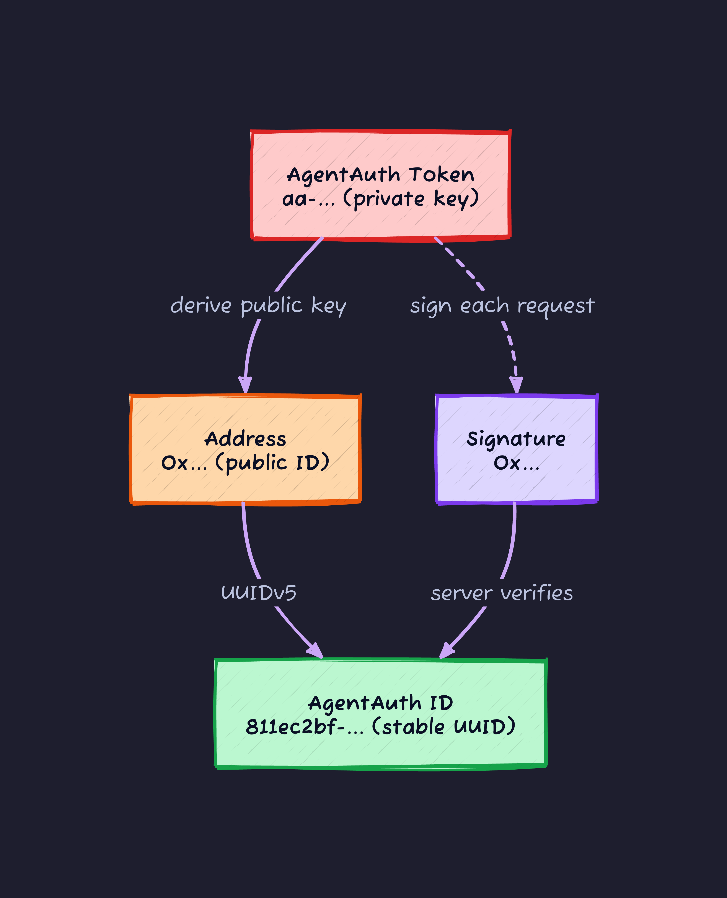
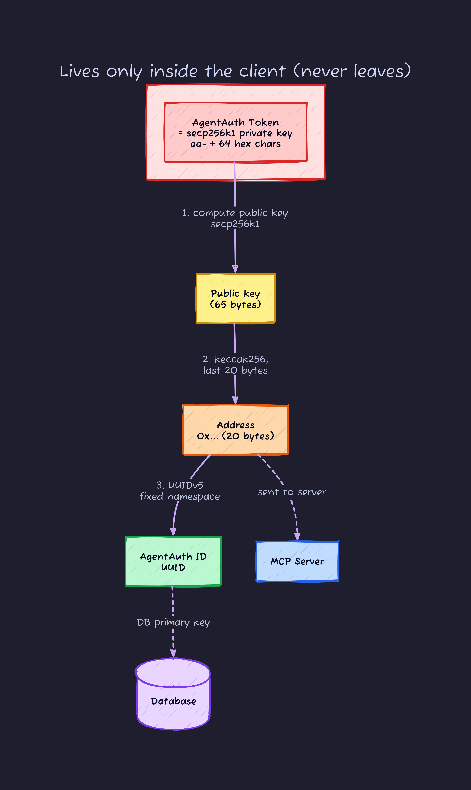
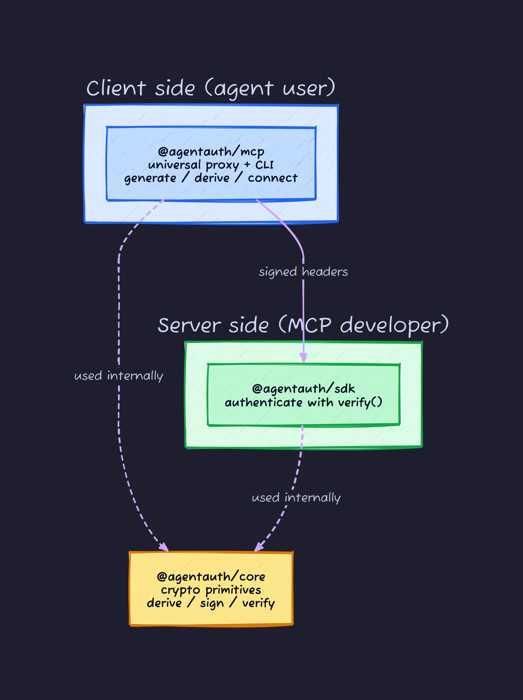

## The trigger: showing an agent a login screen makes no sense

Every time I write an MCP (Model Context Protocol) server, the same problem stops me. The agent that just sent this request: who is it, and how am I supposed to tell?

For a human-facing web service the answer is settled. Show a login form, take an email and password, hand back a session cookie. Or OAuth: redirect the browser to an IdP, show a consent screen, come back holding a token. Every one of these assumes a human is sitting in front of a screen.

An AI agent has no human sitting in front of anything. It fires tools at 3am on its own, and one user might run ten agents in parallel. "Click the consent screen" and "remember the password" both fall apart. Hand every agent the same API key instead, and now you cannot tell who did what.

[AgentAuth](https://github.com/agentauthco/agentauth) answers this with a fairly extreme move.

> All you need is one UUID. No login, no sessions, no extra infra.

My first reaction was "authenticating with a UUID? that is just an ID, isn't it?" But once I read the source, this is not "just an ID." It is an ID that can prove its own correctness. This article reads that mechanism down to the code.

Here is the whole picture in one diagram first. I will take it apart piece by piece afterward.



Only the `Token` is secret. The `Address` and `ID` are derived from it deterministically. By attaching a `Signature` to every request, the server can confirm that the real holder of that ID actually sent it. That is what "self-authenticating UUID" means.

## Background: identity and authentication are two different things

Before the mechanism, let me pin down one pair of terms. If this stays fuzzy, the interesting part of AgentAuth never lands.

- **Identity**: "who are you." Like a user ID or an employee number. It just has to distinguish people
- **Authentication**: "are you really you." Like a password or a fingerprint. It stops impersonation

In an ordinary system these two are built from separate machinery. Identity is "a user ID in the DB," authentication is "a password check." That is exactly why you need two steps: registration (create the identity) and login (authenticate).

AgentAuth's claim is **"you can fold these two into a single UUID."** Look at the UUID and you know who it is (identity), and if you attach a signature that only the holder of that UUID could produce, you also get authentication. Registration and login both disappear.

Why is that possible? The key is public-key cryptography. It comes up over and over from here on, so let me get the three minimum properties out of the way first. Skip ahead if you know them.

- **Keys come in pairs**: a "private key" and a "public key" are always born together. You hold the private key alone; the public key can be shown to anyone
- **One-way**: computing the public key from the private key is easy. The reverse (recovering the private key from the public key) is effectively impossible. Picture rolling down a hill versus climbing back up
- **Only the private key can sign, anyone can verify with the public key**: attach a "signature" to some data with the private key, and whoever holds the matching public key can confirm "the holder of this private key made this signature over this data." Someone without the private key cannot forge a valid signature

AgentAuth maps these three properties straight onto "identity (derive it one-way)" and "authentication (signature)." Let me walk through them in order.

## Core concept: Token to Address to ID, a one-way slope

AgentAuth has three values. They are easy to confuse, so let me pin their roles and "is it secret" in a table first.

| Name | Example | Contents | Secret? | Role |
| --- | --- | --- | --- | --- |
| AgentAuth Token | `aa-2337b9fa...bcb602` | secp256k1 private key (32 bytes) | **Yes** | The source of everything. Password-equivalent |
| Address | `0x99063225...58285ce` | Public address derived from the private key | No | Public-key material for verifying signatures |
| AgentAuth ID | `811ec2bf-b653-...dad7` | Stable UUID built from the Address | No | Identity usable as a DB primary key |

The point is that these three are derived "one-way" in the order **Token to Address to ID**. Going down the slope is cheap to compute, but going back up (recovering the Token from the ID) is cryptographically impossible.



Notice this: **only the Address and ID reach the server, the Token never leaves once.** You keep the private key in your own hand and show the other side only the public values derived from it. This pays off when it combines with the "signature" later.

Let me walk the three steps one at a time through the actual code ([`@agentauth/core`](https://github.com/agentauthco/agentauth/tree/main/packages/agentauth-core)).

### Steps 1 and 2: derive the Address from the Token

What `deriveAddress` does is, in fact, **exactly the same as Ethereum's address derivation.**

```typescript
export function deriveAddress(privateKey: string): string {
  // Strip "aa-" or "0x" down to the 32-byte private key
  const cleanPrivateKey = parsePrivateKey(privateKey);
  const privateKeyBytes = hexToBytes(cleanPrivateKey);

  // 1. Uncompressed public key from the private key (65 bytes: 0x04 + X(32) + Y(32))
  const publicKeyBytes = secp.getPublicKey(privateKeyBytes, false);

  // Drop the leading 0x04 to get the 64-byte coordinate pair
  const publicKeyCoords = publicKeyBytes.slice(1);

  // 2. keccak256, then take the "last 20 bytes"
  const addressBytes = keccak_256(publicKeyCoords).slice(-20);

  return '0x' + bytesToHex(addressBytes);
}
```

Compute the public key with `secp256k1` (an elliptic curve), hash it with `keccak256`, take the last 20 bytes. The resulting `0x...` is the same format as an Ethereum wallet address.

One thing not to misread: **there is not a single bit of blockchain involved.** No on-chain processing, no gas. It just reuses, at the crypto-library level, the well-aged recipe Ethereum has run for years to "derive an address from a private key." The implementation rides on the audited [`@noble/secp256k1`](https://github.com/paulmillr/noble-secp256k1) and `@noble/hashes`.

### Step 3: build a stable UUID from the Address

`generateId` is very short.

```typescript
const AGENTAUTH_NAMESPACE = '2f5a5c48-c283-4231-8975-9271fe11e86c';

export function generateId(address: string): string {
  return uuidv5(address, AGENTAUTH_NAMESPACE);
}
```

UUIDv5 builds a UUID deterministically by hashing "namespace + name" with SHA-1 (unlike the random UUIDv4, the same input always yields the same output). Here the name passed in is the Address.

`AGENTAUTH_NAMESPACE` is hardcoded as a **value that must never change.** The source comment spells it out.

> DO NOT CHANGE THIS UUID - EVER. (...) If you change this UUID, you will break all existing AgentAuth IDs.

Change the namespace and every agent's ID in the world becomes a different value. So this constant effectively defines "the AgentAuth standard itself." Hold the same Token and the same AgentAuth ID comes out, no matter who computes it or when. That determinism is the foundation for "a stable identity without a login."

### Why this removes registration

With that in hand, the reason registration disappears becomes clear.

An ordinary system needs a registration step because "the server assigns a user ID and records it in the DB." In AgentAuth the ID is derived mathematically from the private key, so **the client can settle its own ID without asking the server.** The server just `INSERT`s into the DB the first time it sees an ID, with no prior "account creation" flow.

## The heart of it: authenticating with a per-request signature

So far we have the identity (the ID). But the ID is public information. If someone knows your AgentAuth ID, can't they just claim it and fire off requests?

The trick that stops that is the **signature.** It attaches to the request a piece of proof that only the true holder of the AgentAuth ID, the one holding the Token, can produce.

### Making the signature (client side)

```typescript
export function signPayload(payload: object, privateKey: string): string {
  const messageString = JSON.stringify(payload);
  const messageHash = keccak_256(messageString);

  const cleanPrivateKey = parsePrivateKey(privateKey);
  const privateKeyBytes = hexToBytes(cleanPrivateKey);

  const signature = secp.sign(messageHash, privateKeyBytes);

  // EVM-standard signature format: 0x + r(32) + s(32) + recovery(1)
  const signatureHex =
    signature.toCompactHex() +
    signature.recovery.toString(16).padStart(2, '0');
  return `0x${signatureHex}`;
}
```

Hash the payload (JSON) with keccak256 and sign it with the private key. The output is `0x` plus a 65-byte signature. As noted below, the payload always carries a **timestamp.**

### Verifying the signature (server side)

The crux on the verify side is the "recover the public key from the signature" operation. Same idea as Ethereum's `ecrecover`: from the signature and the message, back-compute "the address corresponding to the private key that could have produced this signature."

```typescript
export function verifySignature(
  signature: string, payload: object, expectedAddress: string
): boolean {
  // ... pull r, s, recovery out of the signature ...

  const messageHash = keccak_256(JSON.stringify(payload));

  // Recover the public key from the signature (ecrecover-equivalent)
  const sig = new secp.Signature(BigInt('0x'+r), BigInt('0x'+s)).addRecoveryBit(recovery);
  const recoveredPublicKey = sig.recoverPublicKey(messageHash);

  // Convert the recovered public key into an address
  const addressBytes = keccak_256(recoveredPublicKey.toRawBytes(false).slice(1)).slice(-20);
  const recoveredAddress = '0x' + bytesToHex(addressBytes);

  // Does the "claimed address" match the "address recovered from the signature"?
  return recoveredAddress.toLowerCase() === expectedAddress.toLowerCase();
}
```

Put into words, it goes like this.

1. The client claims "I am Address `0x9906...`"
2. At the same time it attaches a signature over the payload
3. The server recovers "the address of whoever made this signature" from the signature
4. If the recovered address matches the claimed address, it is genuine

A third party without the private key cannot produce a signature that recovers to the right address in step 3. So "just knowing the ID" does not get you through. That is why authentication holds up even with a public ID.

### One full round trip of a request

`verify()` in `@agentauth/sdk` is the entry point on the server side. The request carries three HTTP headers.

| Header | Contents |
| --- | --- |
| `x-agentauth-address` | The claimed Address (`0x...`) |
| `x-agentauth-payload` | base64-encoded JSON, containing a `timestamp` |
| `x-agentauth-signature` | The signature over the payload (`0x...`) |

Following one exchange as a sequence looks like this. The color bands mark the client-side signing (red), the server-side verification (blue), success (green), and failure (gray).


The `verify()` code is those four steps written out directly.

```typescript
export function verify(request, options = {}): VerificationResult {
  const freshness = options.freshness ?? 60000; // default 60s

  const agentauth_address = headers['x-agentauth-address'];
  const signature        = headers['x-agentauth-signature'];
  const payloadB64       = headers['x-agentauth-payload'];
  if (!agentauth_address || !signature || !payloadB64) return { valid: false };

  // 1. Restore the payload
  const payload = JSON.parse(Buffer.from(payloadB64, 'base64').toString('utf-8'));

  // 2. Verify the signature (ecrecover, then compare Address)
  if (!verifySignature(signature, payload, agentauth_address)) return { valid: false };

  // 3. Freshness check on the timestamp (replay protection)
  if (Math.abs(Date.now() - new Date(payload.timestamp).getTime()) > freshness) {
    return { valid: false };
  }

  // 4. Generate the stable UUID and return it
  return { valid: true, agentauth_id: generateId(agentauth_address) };
}
```

What stands out is that the server completes verification **without holding any state at all** (no session, no recorded nonce). No DB lookup, no cache. It decides on the signature and the timestamp alone. That is why it gets called "zero infrastructure."

### What the 60-second timestamp is for

The constraint in step 3, that the `timestamp` be within 60 seconds, is replay-attack protection.

It stops an attacker who eavesdropped a signed request from re-sending it verbatim (replaying it) to impersonate. Because "when it was made" is part of what was signed, a signature older than 60 seconds cannot be reused. Instead of recording nonces on the server, it rejects by a time window. That is the trade-off with the stateless design, settled here with a "short window."

## Hands-on: run the derivation chain yourself

Theory alone does not stick, so let me run it locally. Hit `@agentauth/core` directly and confirm that Token to Address to ID derives deterministically.

```bash
mkdir agentauth-play && cd agentauth-play
npm init -y
npm pkg set type=module
npm install @agentauth/core
```

Write `play.mjs`.

```javascript
import {
  generateIdentity, deriveAddress, generateId,
  signPayload, verifySignature,
} from '@agentauth/core';

// 1. Generate a new agent identity
const id = generateIdentity();
console.log('Token  :', id.agentauth_token);   // aa-... (secret. this is the only thing that matters)
console.log('Address:', id.agentauth_address);  // 0x...
console.log('ID     :', id.agentauth_id);       // UUID

// 2. Determinism check: derive from the Token any number of times, same result
const addr2 = deriveAddress(id.agentauth_token);
const id2   = generateId(addr2);
console.log('re-derive matches:', id2 === id.agentauth_id); // true

// 3. Sign and verify
const payload = { timestamp: new Date().toISOString(), action: 'get-forecast' };
const sig = signPayload(payload, id.agentauth_token);
console.log('valid signature passes:', verifySignature(sig, payload, id.agentauth_address)); // true

// 4. Tamper with the payload by even one character and it fails
const tampered = { ...payload, action: 'delete-everything' };
console.log('tampering is rejected :', verifySignature(sig, tampered, id.agentauth_address)); // false
```

```bash
node play.mjs
```

Once `re-derive matches: true` shows up, you feel that the same ID always reproduces from the Token alone. `tampering is rejected: false` shows that the signature is bound to the payload. The server just has to trust the result of `verifySignature`.

### Wiring it into a server

On the MCP server side you call `verify()` from `@agentauth/sdk` in middleware or at the top of each tool. The official weather-server sample is the clearest example.

```typescript
import { verify as verifyAgentAuth } from "@agentauth/sdk";

// Attach an auth context in Express middleware
app.use(async (req, _res, next) => {
  const authResult = verifyAgentAuth({ headers: req.headers });
  if (authResult.valid) {
    // Authenticated: you have a stable UUID in hand
    req.auth = { clientId: authResult.agentauth_id, extra: { agentauth: authResult } };
  }
  // Do not reject the unauthenticated (let them through as anonymous)
  next();
});
```

Inside a tool you can change behavior based on "authenticated or not." The weather-server splits a free and premium tier exactly on the presence of this ID.

```typescript
server.tool("get-alerts", "Weather alerts (auth required)", { state: z.string().length(2) },
  async ({ state }) => {
    const auth = getAuthForCurrentRequest();
    if (!auth) {
      return { content: [{ type: "text", text: "🔒 This feature requires authentication" }] };
    }
    // Use auth.agentauth_id for billing, rate limiting, usage logging
    console.error(`✅ Agent ${auth.agentauth_id} accessed`);
    // ... return the real data ...
  }
);
```

Client-side config is just dropping the Token into the MCP client's config file. Write it once and you connect to any AgentAuth-aware remote MCP server with the same Token.

```json
{
  "mcpServers": {
    "weather": {
      "command": "agentauth-mcp",
      "args": ["connect", "https://example.com/mcp"],
      "env": { "AGENTAUTH_TOKEN": "aa-..." }
    }
  }
}
```

The [`agentauth-mcp` proxy](https://github.com/agentauthco/mcp-gateway) signs each request with the Token and attaches the three headers automatically. The Token itself never takes a step outside your machine.

## Package layout: who uses which

Putting the division of labor on one page looks like this.



- **`@agentauth/core`**: the crypto foundation. Just the derive / sign / verify functions. You normally do not touch it directly
- **`@agentauth/sdk`**: used by MCP server developers. You just call `verify({ headers })`
- **`@agentauth/mcp`**: the proxy-plus-CLI used by agent users. `generate` issues a Token, `connect` makes a signed connection. It now lives separately at [agentauthco/mcp-gateway](https://github.com/agentauthco/mcp-gateway)

## Where to use it and where not to: dividing the field with MCP's official OAuth 2.1

This is the most important part. Jump to "so I should use this for MCP auth" and you will crash. AgentAuth and MCP's official authorization **cover fundamentally different ground.**

The official MCP spec firmed up its authorization on an OAuth 2.1 base over the course of 2025. Worth tracing the flow.

- **2025-03**: put remote MCP server authorization on an OAuth 2.1 base. Introduced authorization-server metadata discovery (RFC 8414)
- **2025-06-18**: classified the MCP server clearly as an "OAuth 2.1 Resource Server." Made Protected Resource Metadata (RFC 9728), Resource Indicators (RFC 8707, binding a token's audience), and PKCE mandatory. Banned token passthrough (forwarding a received token straight to an upstream API as-is) and closed the confused-deputy hole where authority gets misused by mistake
- **2025-11-25 (the current latest)**: made PKCE require S256 when technically capable, and the `resource` parameter always mandatory. Promoted Client ID Metadata Documents (CIMD) to the recommended registration path, demoting the older Dynamic Client Registration (DCR) to a backward-compatible option

In other words, what the official MCP spec is solving is the **delegation** problem: "as a stand-in for the human Alice, an agent reaches a third-party resource (like GitHub) with narrowed scope." Consent screens, scopes, audience binding, IdP integration are the stars.

What AgentAuth provides is only **"who is this agent (identity) plus is it really them (authentication)."** No scopes, no consent, no delegation. Putting the positioning in a table:

| Dimension | AgentAuth | Official MCP OAuth 2.1 | Plain API key |
| --- | --- | --- | --- |
| Identity source | self-derived from a local key (no issuer) | issued by an authorization server | issued by the server |
| Backend | none (stateless verify) | authorization server + metadata endpoints | key store |
| Registration / login | none | DCR/CIMD + consent flow | manual issuance |
| Authorization (scopes) | **none** (identity only) | yes (scopes, audience binding, RBAC) | none |
| Human in the loop | not needed | needed (consent, redirect) | not needed |
| Credential lifetime | long-lived private key (password-equivalent) | short-lived scoped tokens | long-lived |
| Replay protection | signature + 60s time window | TLS + short-lived tokens | none |

The decision guide sorts out like this.

- **AgentAuth fits**: you control both ends (client and server) and want to "tell agents apart by a stable ID, block impersonation, but not run authorization infra." Usage tracking, free/paid gating, anonymous-but-consistent analytics
- **OAuth 2.1 is required**: calling third-party APIs on a user's behalf, narrowing scopes, taking consent, integrating with a corporate IdP. The moment delegation enters, this becomes mandatory

The two are not mutually exclusive, they compose. **Agent identity by AgentAuth, resource authorization by OAuth** is a stacking that holds up in principle. Read AgentAuth as "a self-sovereign API key that is also a verifiable, stable UUID" and you will not misplace it.

## Realities to know before adopting

The design is clean, but if you are weighing production, here is the honest part too.

- **Still very young**: `@agentauth/core` is at v0.1.1. First published June 2025, and quiet since. Monthly npm downloads are in the dozens per package, so a track record in the field is still ahead. Excellent as something to dissect for an interesting design, but not a "battle-aged standard"
- **The name collision is bad**: this space is flooded with "Agent Auth" style names. The AgentAuth at agentauth.co is a different thing from Dick Hardt's **AAuth**, from Better Auth's **Agent Auth plugin**, and from Microsoft Foundry's agent identity. Watch out when searching
- **The long-lived private key trade-off**: the Token is password-equivalent and long-lived. Leak it and the ID tied to that key is taken over wholesale. Be aware this runs in the opposite direction from the world of rotating short-lived tokens (WIF, ID-JAG)
- **Authorization is your own job**: "what it is allowed to do" sits outside AgentAuth. After making the ID a DB primary key, you still have to design permission management yourself

## Wrap-up

AgentAuth in one line is **"a UUID derived deterministically from a private key that can authenticate itself."** Stacking the mechanism from the bottom up, it connects like this.

1. The Token is a secp256k1 private key. From it you derive an Address Ethereum-style, then an AgentAuth ID via UUIDv5 (one-way)
2. The ID is public, but every request is signed with the private key, so it cannot be impersonated
3. The server recovers the Address from the signature and compares, plus rejects replays with a 60-second window. It holds no state at all
4. The result: a "stable identity plus authentication" with no registration, no login, no session DB

I think it is a clean fit of public-key crypto's "keep the private key in hand, show only public values" property onto agent authentication. But this is a tool for **authentication (authn)**, not **authorization (authz)**. Keep the line straight, that it does not compete with MCP's official OAuth 2.1 but covers different ground, and where it lands is clear.

If you want to get your hands on it, run the hands-on above with `npm install @agentauth/core` first, and see for yourself the determinism of Token to ID and signature verification rejecting tampering. Once that clicks, you are halfway to seeing what is interesting about this design.

Reference links:

- [AgentAuth repository](https://github.com/agentauthco/agentauth)
- [@agentauth/core source](https://github.com/agentauthco/agentauth/tree/main/packages/agentauth-core)
- [MCP Authorization spec (2025-06-18)](https://modelcontextprotocol.io/specification/2025-06-18/basic/authorization)
- [MCP Authorization spec (2025-11-25, current)](https://modelcontextprotocol.io/specification/2025-11-25/basic/authorization)
