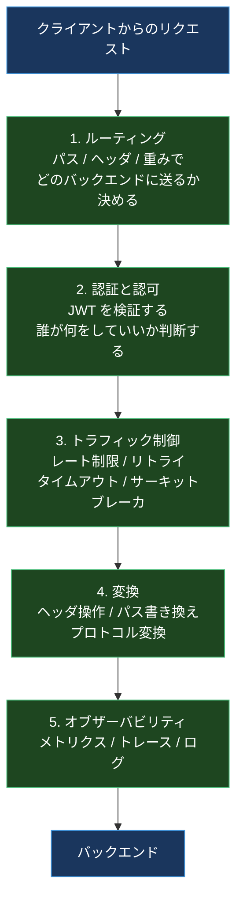
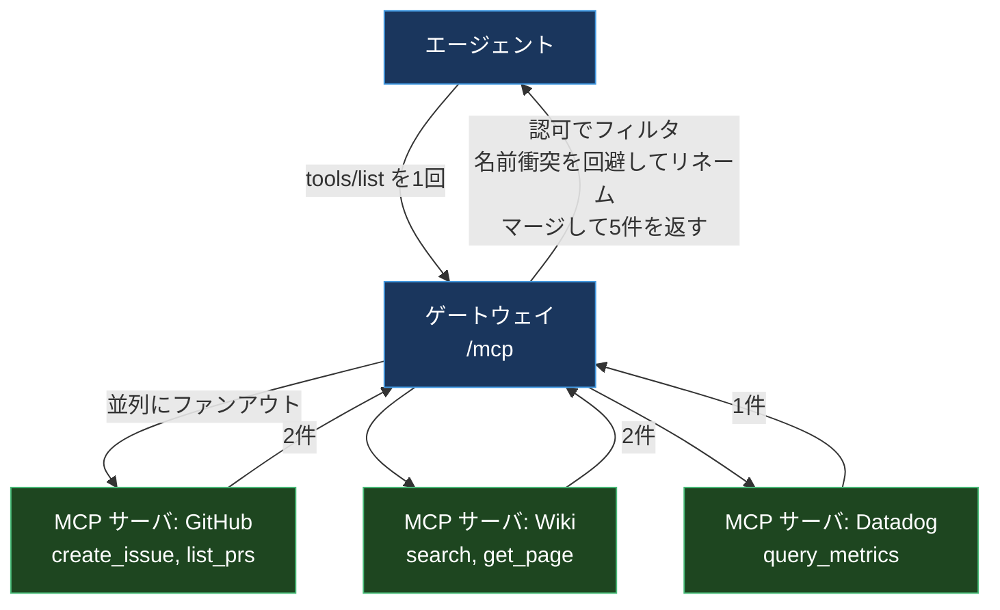
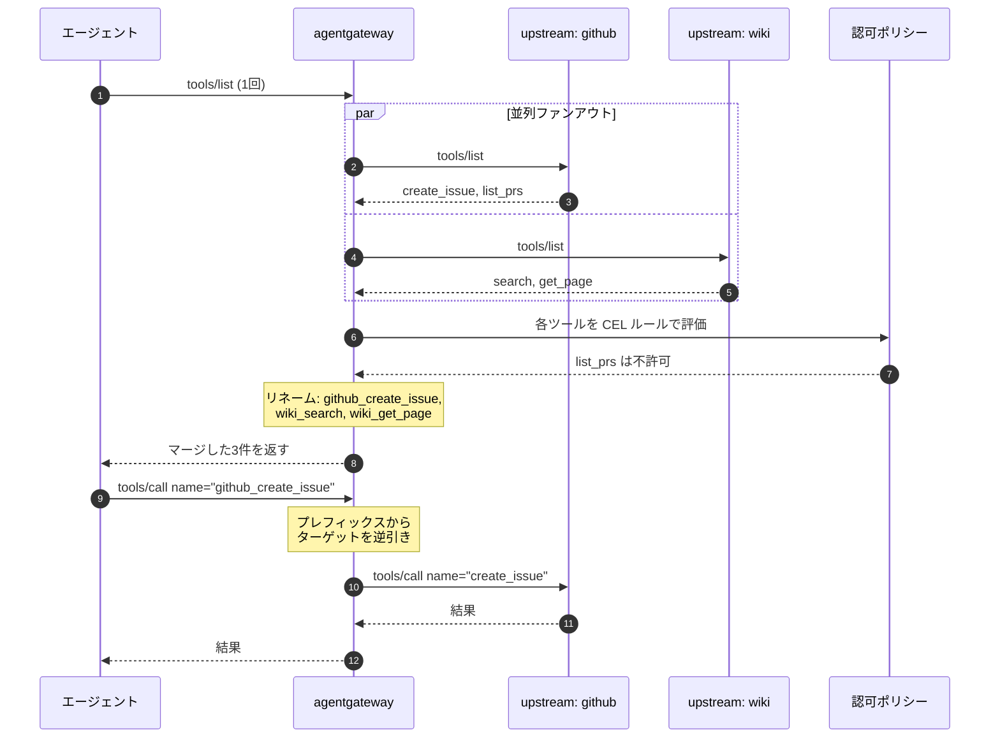
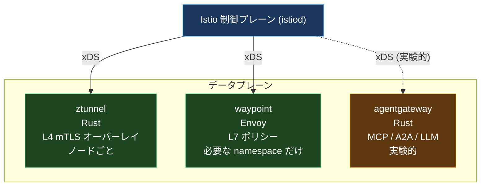

社内で MCP サーバが増えはじめたとき、最初に困るのは認可ではなく **数** だと思う。

GitHub 用、社内 Wiki 用、Datadog 用、BigQuery 用。それぞれチームが自分でサーバを立てる。エージェント側の設定ファイルには MCP サーバのエントリが10行並ぶ。認証方式はバラバラで、あるサーバは環境変数のトークン、あるサーバは OAuth。誰がどのツールを呼べるかの制御は、各サーバがそれぞれ好きなように実装している。

この形は既視感がある。マイクロサービスが増えたときと同じ構造だ。そして当時の答えは「間にプロキシを置いて、認証と認可とオブザーバビリティを一箇所に集める」だった。API ゲートウェイであり、サービスメッシュだった。

**agentgateway** は、その答えを AI トラフィックに対してやろうとしているプロジェクトだ。Solo.io が作って2025年8月に Linux Foundation に寄贈し、いまは Agentic AI Foundation (AAIF) の4番目のホストプロジェクトになっている。開発は速く、この記事を書いている2026年8月時点の最新は **v1.4.1 (2026-07-29)**。リリースは月に何本も出ている。

面白いのは、これを作ったのが **Envoy を3年運用して ztunnel を書いたチーム** だという点だ。Istio ambient のデータプレーンである ztunnel は Rust で書かれている。同じチームが、AI トラフィックのために Envoy を使わずにもう1つ Rust のプロキシを書いた。

この記事では、そこに至った理由と、agentgateway の中身を追う。プロキシやサービスメッシュを知らない前提から書くので、上から読める形にしてある。

## 前提1: ゲートウェイは何をする箱なのか

まず土台の整理から。L7 プロキシ (API ゲートウェイ、サービスメッシュのサイドカー、Ingress コントローラ) がやっていることは、だいたいこの5つに分類できる。



この5つを、アプリケーションごとに実装するのではなくインフラ層に集約する。それがゲートウェイの存在理由だ。Envoy はこれを HTTP / gRPC / TCP に対してやる箱として、事実上の標準になった。

## 前提2: AI トラフィックの何が従来と違うのか

では、MCP や LLM のトラフィックは何が違うのか。ここを押さえないと「Envoy でいいじゃん」で話が終わってしまう。

### 違い1: 意味のある情報がボディの中にある

MCP は JSON-RPC 2.0 を HTTP の上で運ぶ。リクエストは全部 `POST /mcp` に来て、何をしようとしているのかは **ボディの中の `method` フィールド** にある。

```json
{
  "jsonrpc": "2.0",
  "id": 1,
  "method": "tools/call",
  "params": {
    "name": "delete_customer",
    "arguments": { "id": "cust-12345" }
  }
}
```

Envoy が得意なのは「パスとヘッダを見てルーティングする」ことだ。ボディを見るには外部認可サービス (ext_authz) を呼ぶか、WASM フィルタや Lua を書くことになる。どちらも可能だが、ホットパスで JSON をパースする処理を毎回挟むことになる。

MCP の 2026-07-28 仕様が `Mcp-Method` / `Mcp-Name` ヘッダを必須化したのは、まさにこの問題への対応だ。ただ、それ以前の仕様で動くサーバも当分残る。

### 違い2: 1つのエンドポイントの裏に複数の「上流」がいる

普通のプロキシは「1つのルート → 1つ (または複数の同種インスタンス) のバックエンド」だ。MCP では、エージェントから見て1つのエンドポイントの裏に、**種類の違う複数の MCP サーバ** をぶら下げたい。

`tools/list` を呼んだら、GitHub サーバのツールと Wiki サーバのツールと Datadog サーバのツールが **1つのリストにまとまって** 返ってきてほしい。これは単なるロードバランシングではなく **ファンアウトとマージ** だ。



Envoy にこの「リクエストを複製して、レスポンスをマージして返す」プリミティブは無い。Envoy のフィルタチェーンは基本的に1リクエスト対1アップストリームのモデルで動いている。

### 違い3: LLM トラフィックは形が違う

LLM への呼び出しは、普通の HTTP API とは性質が違う。

| | 普通の API | LLM API |
| --- | --- | --- |
| レスポンス時間 | ミリ秒 | 秒から分 |
| レスポンス形式 | 一括 | SSE によるトークンストリーム |
| コストの単位 | リクエスト数 | **トークン数** |
| レート制限の単位 | req/s | **tokens/min** |
| フェイルオーバー | 同じ API の別インスタンス | **別ベンダの別 API** |

いちばん厄介なのが最後の2つ。「トークン数でレート制限する」には、ストリーミング中のレスポンスをパースしてトークンを数える必要がある。「OpenAI が落ちたら Anthropic に切り替える」には、リクエストとレスポンスのスキーマ変換が要る。どちらも従来のプロキシの語彙にはない。

## なぜ Envoy ではなかったのか

ここが本題だ。公式の説明と、そこから読み取れることを分けて書く。

### 公式の言い分

2026年6月4日の設計解説記事で、Solo.io はこう書いている。要旨は「Envoy がリバースプロキシとして不十分だとは言っていない」だ。

> AI システムをデプロイしている組織は、既存のインフラが特に対応するようには設計されていなかった、新しいカテゴリの運用上の問題に直面している。

挙げられている「AI 固有の関心事」はこれ。

- ツールとモデルのフェデレーション
- MCP プロトコルの取り扱い
- エージェントのアクセス統制
- AI ネイティブなオブザーバビリティとセキュリティポリシー

主張の核は技術的優位性ではなく **アーキテクチャの統一** だ。AI トラフィックと従来のトラフィックのために並行したインフラを維持すべきではない、という話になっている。

別の取材では、より踏み込んだ言い方も出ている。Envoy を土台にすることを検討したが、**A2A や MCP のようなモダンなエージェントプロトコルをサポートするには Envoy 自体の大規模な再アーキテクチャが必要** だと結論した、というものだ。

### 技術的に読むと

前提2で挙げた3つの違いを Envoy に載せようとすると、こうなる。

| やりたいこと | Envoy でのやり方 | 問題 |
| --- | --- | --- |
| ボディの `method` でルーティング | ext_authz / WASM / Lua フィルタ | ホットパスに外部呼び出しか JS/WASM 実行が入る |
| tools/list をファンアウトしてマージ | **プリミティブが無い** | フィルタモデルの外側。書くならコアに手を入れる |
| トークン数でレート制限 | ストリーミングレスポンスをパースするフィルタ | ステートフルなフィルタが要る |
| ベンダ間フェイルオーバー | リクエスト / レスポンス変換フィルタ | スキーマ変換をどこに書くのか |

2番目が特に効いている。**1リクエストを複数の上流に送って結果をマージする** のは、Envoy のフィルタチェーンとクラスタのモデルに素直に載らない。やるなら Envoy のコアに新しい概念を足すことになる。C++ の大規模なコードベースに、CNCF Graduated プロジェクトの互換性を保ちながら。

これは技術的な優劣ではなく、**変更コストの見積もり** の話だ。既存の巨大なプロジェクトに新しい抽象を入れるコストと、新しく書くコスト。ztunnel で Rust のプロキシを書いた経験があるチームなら、後者の見積もりが低く出るのは分かる。

とはいえ、この判断には代償もある。Envoy が10年かけて積んだもの (プロトコルの実装の堅牢さ、エッジケースの潰し込み、エコシステム、運用ノウハウ) は付いてこない。実際 Solo.io 自身は Envoy ベースの製品も持ち続けているし、Envoy AI Gateway という別のプロジェクトも存在する。**「AI ゲートウェイ = agentgateway 一択」ではない。**

## なぜ Rust なのか

理由は2つ挙げられている。

**1. 性能とメモリ安全性が譲れない。** プロキシは全トラフィックのホットパスに立つ。GC の停止時間はテールレイテンシに直撃するし、メモリ安全性のバグはそのまま RCE になる。

**2. ztunnel での実績。** Istio ambient のノードプロキシである ztunnel を Rust で書いた3年の経験がある。「高性能で低リソース消費のネットワークアプリケーション」で Rust が機能することを、自分たちで確認済みだった。

これは「Rust が Go や C++ より良いから」というより、「このチームは Rust で高性能プロキシを書いた実績があるから」に近い理由だと思う。技術選定として健全だ。

## アーキテクチャ

依存しているクレートを見ると、設計の意図が読める。非同期ランタイムに **Tokio**、HTTP に **Hyper**、gRPC に **Tonic**、ポリシー評価に **cel-rust**。Rust のネットワーク周りで枯れているものを素直に積んだ構成で、独自実装は最小限になっている。この上で HTTP / gRPC / MCP / A2A / LLM API を同じプロセスが捌く。

注目したいのが **xDS** を採用している点だ。xDS は Envoy が定義した、制御プレーンからデータプレーンに設定を配る gRPC のプロトコル群 (LDS / RDS / CDS / EDS など) で、いまは Envoy 以外にも広く使われている。ztunnel も xDS で設定を受け取る。

つまり agentgateway は **Envoy の実装は捨てたが、Envoy が作ったエコシステムの規約は捨てていない**。既存の xDS 制御プレーンの知見がそのまま効くし、Istio が制御プレーンとして agentgateway を駆動できるのもこれがあるからだ。

設計目標として掲げられているスケールは「数万のサービス、MCP サーバ、ルートが同時に動く」規模。ここも xDS の増分配信 (delta xDS) が前提になっている数字だと読める。

## 設定を読む

実際の設定ファイルを見ると、思想がよく分かる。基本の構造は4階層。

```yaml
binds:
  - port: 3000
    listeners:
      - routes:
          - policies:
              cors:
                allowOrigins: ["*"]
                allowHeaders: ["mcp-protocol-version", "content-type"]
              jwtAuth:
                issuer: agentgateway.dev
                audiences: [test.agentgateway.dev]
                jwks:
                  file: ./manifests/jwt/pub-key
              mcpAuthorization:
                rules:
                  - 'mcp.tool.name == "echo"'
                  - 'jwt.sub == "test-user" && mcp.tool.name == "add"'
                  - 'mcp.tool.name == "printEnv" && jwt.nested.key == "value"'
            backends:
              - mcp:
                  targets:
                    - name: everything
                      stdio:
                        cmd: npx
                        args: ["@modelcontextprotocol/server-everything"]
```

読み方はこう。

- **binds**: どのポートで待つか
- **listeners**: そのポートの上のリスナ
- **routes**: どのリクエストをどこに送るか。ここにポリシーが付く
- **backends**: 送り先。`mcp` / `ai` / `host` の3種類がある

`host` が普通のマイクロサービス、`ai` が LLM プロバイダ、`mcp` が MCP サーバ。同じ設定ファイルの語彙で3種類を扱えるのが「統一されたオペレーショナルサーフェス」の実体だ。

フル階層が面倒なケース向けに、トップレベルのショートカットもある。`mcp:` だけ書けば MCP ゲートウェイになり、`llm:` だけ書けばモデル中心のルーティングになる。設定の方言が2つあるので、ドキュメントを読むときは自分のバージョンがどちらかを確認したほうがいい。

### 認可: CEL で書く

いちばん実用的なのが `mcpAuthorization` だ。ルールは **CEL (Common Expression Language)** で書く。

```yaml
mcpAuthorization:
  rules:
    # 誰でも echo は呼べる
    - 'mcp.tool.name == "echo"'
    # test-user だけが add を呼べる
    - 'jwt.sub == "test-user" && mcp.tool.name == "add"'
    # 特定のクレームを持つ人だけが printEnv を呼べる
    - 'mcp.tool.name == "printEnv" && jwt.nested.key == "value"'
    # 特定のターゲットのツールだけ許可する
    - 'mcp.tool.target == "github" && jwt.groups.exists(g, g == "dev")'
```

利用できる変数は `jwt.*` (検証済みの JWT クレーム) と `mcp.tool.*` (ツール名、ターゲット名など)。`jwtAuth` か `mcpAuthentication` を一緒に設定しないと `jwt.*` が使えない点に注意。

そして、ここの挙動がよくできている。

> 呼ぶ権限がないツールとリソースは、**`tools/list` と `resources/list` のレスポンスから自動的に取り除かれる**。拒否されたツールへの直接呼び出しも拒否される。

つまりエージェントは、自分が呼べないツールの存在自体を知らない。LLM に見せるツール一覧が権限で絞られるので、「呼べないツールを LLM が選んでエラーになる」という無駄なターンが消える。エージェント特有の要求をよく理解した設計だと思う。

なお、バックエンドが MCP でない普通の HTTP ルートには `authorization` ポリシーを使う。文法は同じ CEL のリストだが、使える変数が HTTP リクエストの文脈になる。

## MCP 多重化の内部

`McpBackend` に複数のターゲットを書くと、**多重化 (multiplexing) モード** で動く。



やっていることを整理すると。

1. list 系のリクエスト (tools / prompts / resources) を **全上流に並列で投げる**
2. 返ってきたリストを **認可ポリシーでフィルタする**
3. 名前の衝突を避けるため **サーバ名でプレフィックスを付けてリネームする**
4. 1つのレスポンスに **マージする**

`tools/call` のときは逆で、プレフィックスからどの上流に送るかを決めて、名前を元に戻して転送する。

運用面での特徴もいくつかある。

- Kubernetes の **ラベルでサーバを追加できる**。設定変更なしに MCP サーバをメッシュに参加させられる
- ターゲットごとに認証 / トランスポート / ツールフィルタを個別に設定できる
- コネクションプーリング、ヘルスチェック、自動再接続がある
- 多重化には **streamable HTTP トランスポートが必須**。stdio では使えない

最後の制約は当然で、stdio はプロセス間の1対1のパイプなので多重化の余地がない。

## 性能

Solo.io が公開している数字はこれ。

| 指標 | 値 | 条件 |
| --- | --- | --- |
| スループット | 約 500k QPS | 512 コネクション |
| レイテンシ | P99 0.2ms 未満 | 30k QPS / 512 コネクション |

方法論としては John Howard の Gateway API benchmark v2 を参照している、とされている。

ただし、これは **ベンダ自身が公表した数字** で、独立した第三者の計測ではない。Envoy や nginx との直接比較の数値もこの記事には出ていない。ゲートウェイのベンチマークは設定次第でいくらでも変わるので、自分のワークロードで測るのが結局いちばん確実だ。

もうひとつ、この数字の読み方に注意がいる。500k QPS は **プレーンなプロキシとしての** 数字であって、MCP の多重化 (N 上流へのファンアウトとマージ) を含んだ数字ではない。ファンアウトあたりのレイテンシは公表されていない。多重化のワークロードでは、実効的な性能は上流の数と最も遅い上流に支配されるはずだ。

## Istio との関係

2026年3月の KubeCon Europe (アムステルダム) で、Istio が3つの発表をした。

1. **Ambient Multicluster がベータ**: サイドカーなしで複数クラスタをまたぐルーティング。共有ノードプロキシ (ztunnel) と waypoint プロキシの組み合わせで実現する
2. **Gateway API Inference Extension がベータ**: Gateway API の拡張として、ML 推論をメッシュのトラフィックフローに統合する。モデル最適化ルーティングを提供する
3. **agentgateway が Istio のデータプレーンとして実験的にサポート**

3番目がこの記事の文脈だ。



Istio のデータプレーンは、もともと「1種類のプロキシで全部やる」ものではなくなっている。ambient モードでは L4 を ztunnel (Rust)、L7 を waypoint (Envoy) が担当する。ここに「AI トラフィックは agentgateway」という3つめの選択肢が入る、という構図だ。

すべてが xDS で駆動されるので、制御プレーンから見れば同じ扱いができる。データプレーンを役割ごとに使い分ける方向に、Istio 全体が動いていると読める。

## Envoy AI Gateway との棲み分け

似た名前のプロジェクトに **Envoy AI Gateway** がある。こちらは Envoy Gateway の上に構築された、LLM プロバイダ向けのゲートウェイだ。

自分の理解で整理すると、こうなる。

| | Envoy AI Gateway | agentgateway |
| --- | --- | --- |
| ベース | Envoy Gateway (Envoy) | 独自 (Rust) |
| 主眼 | LLM プロバイダへのルーティング、トークン制御 | MCP / A2A / LLM を統一的に扱う |
| MCP 多重化 | 弱い | **中核機能** |
| Envoy の資産 | 全部使える | 使えない |
| API | Gateway API + 独自 CRD | Gateway API 準拠 + 独自設定 |
| 成熟度 | Envoy の実績を継承 | 若い。ただしリリース頻度は高い |

**LLM へのルーティングだけが要る** なら、Envoy AI Gateway のほうが素直だと思う。すでに Envoy Gateway を運用しているなら特に。

**MCP サーバを多数束ねて、ツール単位で認可したい** なら agentgateway になる。この機能を Envoy 系で実現しようとすると、結局自分でフィルタを書くことになる。

## どこで使うか、どこで使わないか

現時点での判断を書いておく。

**向いているケース**

- 社内に MCP サーバが複数あって、エージェント側の設定を1つにまとめたい
- ツール単位、パラメータ単位で認可を効かせたい (CEL のルールで書ける)
- LLM プロバイダを複数使っていて、フェイルオーバーやコスト管理を1箇所でやりたい
- すでに Istio ambient を運用していて、AI トラフィック用のデータプレーンを足したい

**向いていないケース**

- 従来の HTTP トラフィックだけを捌く。Envoy / nginx で十分
- A2A が主用途。MCP 多重化に比べて A2A のサポートは新しく、実戦投入の実績が薄い
- 管理 UI が要る。設定は YAML と xDS で、洗練された管理画面はない
- RBAC などのガバナンス機能に成熟度を求める。まだ育っている最中

## まとめ

- agentgateway は MCP / A2A / LLM と従来の HTTP / gRPC を1つの箱で扱うプロキシ。Solo.io が寄贈し、Linux Foundation / AAIF がホスト。最新は v1.4.1 (2026-07-29) で、MCP の 2026-07-28 仕様への追随も入っている
- Envoy を土台にしなかった理由の核心は「1リクエストを複数上流にファンアウトしてマージする」というモデルが Envoy のフィルタチェーンに載らないこと。公式は「AI 固有の関心事のため」という言い方をしている
- Rust を選んだのは ztunnel での実績。Tokio / Hyper / Tonic / cel-rust の上に載っている
- 実装は捨てたが **xDS は継承した**。Istio の制御プレーンから駆動できるのはこのおかげ
- 設定は binds / listeners / routes / backends の4階層。バックエンドは `mcp` / `ai` / `host` の3種類
- 認可は CEL。権限のないツールは `tools/list` から自動的に消えるので、LLM に見せる選択肢が権限で絞られる
- 性能はベンダ公称で 500k QPS、P99 0.2ms 未満。ただし多重化を含む数字ではないので自分で測るべき
- Istio ambient の実験的なデータプレーンとして統合が進んでいる

「Envoy を置き換えるプロキシが出てきた」という話ではないと思っている。データプレーンが役割ごとに分かれていく流れの一部で、L4 は ztunnel、L7 は Envoy、AI トラフィックは agentgateway、という分業になっていく。制御プレーンとプロトコル (xDS, Gateway API) が共通なので、その分業が成り立つ。

Envoy の10年が無駄になるわけではなく、Envoy が作った規約の上で次のデータプレーンが生えている、と読むのが正確なところだと思う。

## 参考

- [Designing agentgateway: A Unified High-Performance Gateway for AI and API Traffic](https://agentgateway.dev/blog/2026-06-04-designing-agentgateway-unified-gateway/)
- [agentgateway/agentgateway (GitHub)](https://github.com/agentgateway/agentgateway)
- [agentgateway releases](https://github.com/agentgateway/agentgateway/releases)
- [MCP authorization | agentgateway docs](https://agentgateway.dev/docs/standalone/latest/mcp/mcp-authz/)
- [agentgateway Joins AAIF as an Open Gateway for Agentic AI Infrastructure](https://aaif.io/blog/agentgateway-joins-aaif-as-an-open-gateway-for-agentic-ai-infrastructure)
- [Istio Brings Future Ready Service Mesh to the AI Era | CNCF](https://www.cncf.io/announcements/2026/03/25/istio-brings-future-ready-service-mesh-to-the-ai-era-with-new-ambient-multicluster-gateway-api-inference-extension-and-more/)
