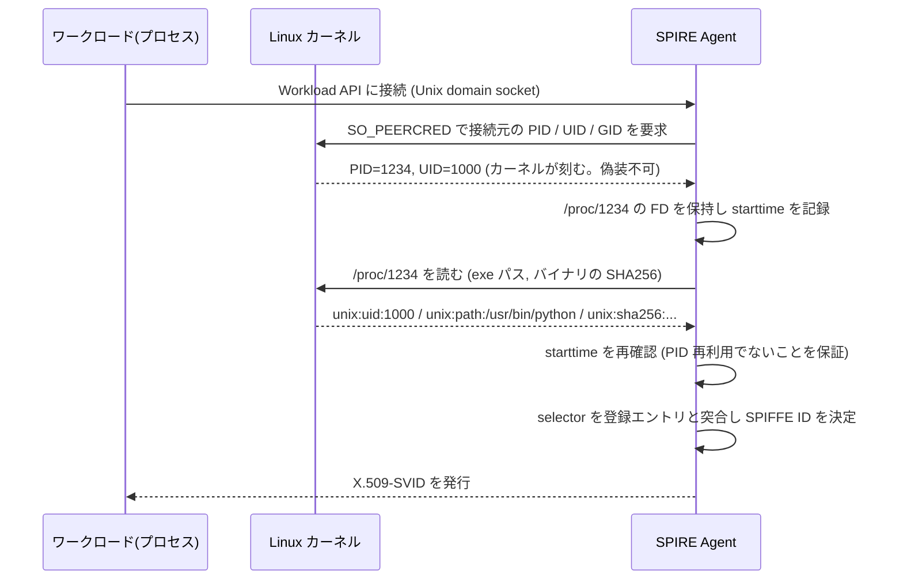
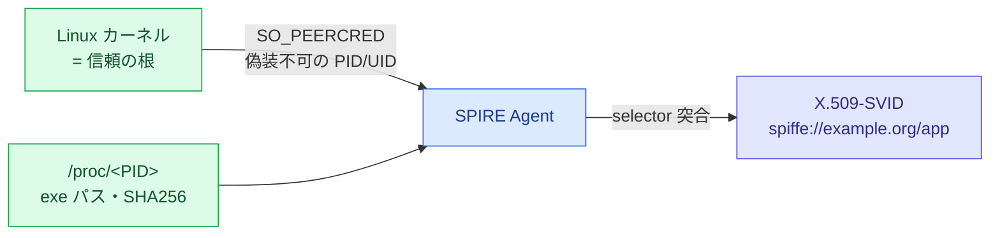
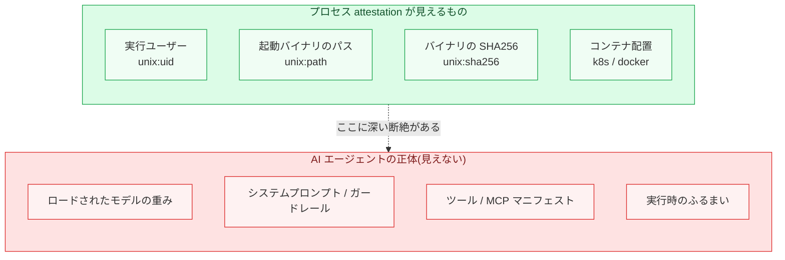
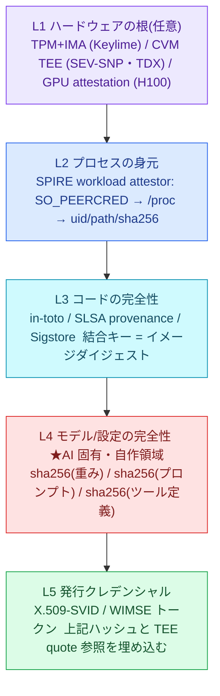
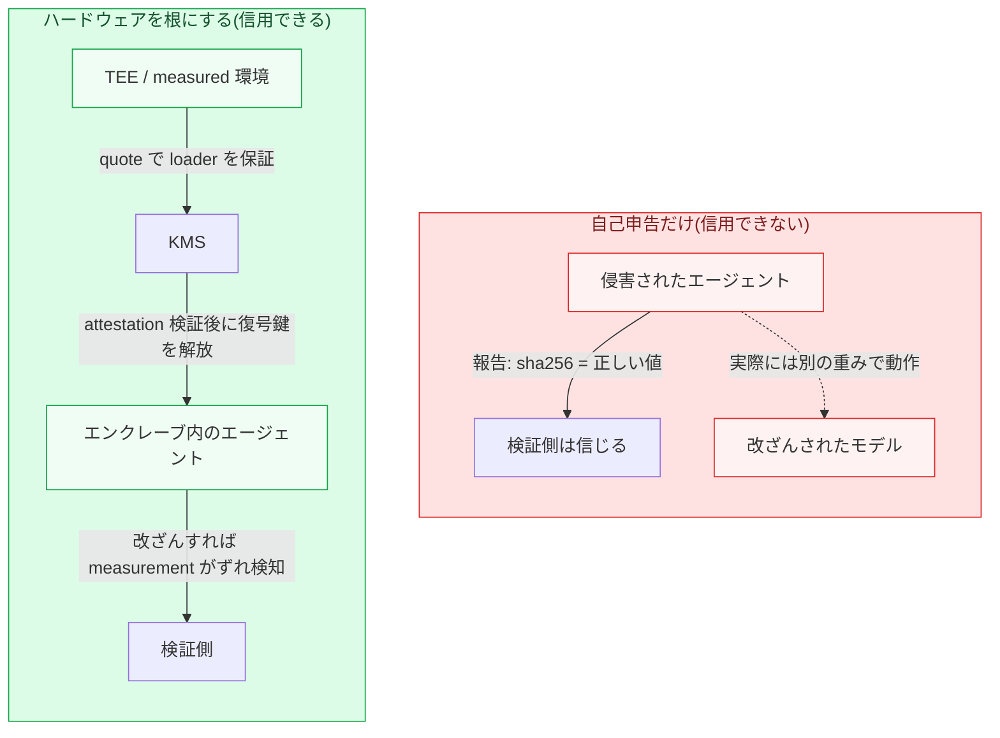
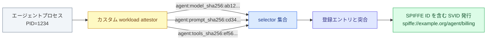

## はじめに: 「このエージェントは本物か」を手元で確かめたくなった

きっかけは単純な悩みだった。手元のマシンで動いている AI エージェントに、社内 API を叩く権限を渡そうとしたとき、「そもそもこのプロセスは本当に自分が意図したエージェントなのか」を確かめる方法が無いことに気づいた。API キーを環境変数に置けば動く。でもそのキーは、隣で立ち上がった別のプロセスにコピーされても同じように動いてしまう。

「事前に配った秘密」に頼らずに、プロセスの身元をローカルで証明する仕組みなら知っていた。SPIFFE/SPIRE の workload attestation だ。カーネルを信頼の根にして、「この UID のこのバイナリだ」と証明してくれる。じゃあこれをそのまま AI エージェントに使えばいいじゃないか、と思って設計を始めたら、決定的な穴にぶつかった。

**SPIRE がハッシュするのは、エージェントを起動した `python` バイナリであって、ロードされたモデルの重みでもシステムプロンプトでもツール定義でもない。** つまり、安全に調整されたモデルを動かしていても、脱獄済みの改造モデルを動かしていても、SPIRE から見た身元は完全に同一になる。

この記事は、その穴を埋めるための設計を、下から順に組み立てていく。話の順序はこうだ。

- そもそもアテステーションとは何か。認証(誰か)とどう違うのか
- SPIRE がローカルでプロセスの身元を証明する仕組み(なぜ事前共有シークレットが要らないのか)
- なぜそれが AI エージェントには構造的に足りないのか
- 足りない分を埋めるレイヤ構成と、その中で一番厄介な「自己申告問題」
- 2026 年時点で標準化はどこまで来ているのか
- SPIRE のカスタム attestor でエージェント固有の selector を出す実装スケッチ

前提知識は都度説明するので、SPIFFE を触ったことがなくても上から読めば追えるようにしてある。

## 用語をそろえる: 認証・クレデンシャル・アテステーション

まず言葉を固めておく。ここが曖昧だと後半が全部ぼやける。

身元まわりには 3 つの別々の問いがある。

- **識別子 (Identifier)**: 「自分は誰だと名乗るか」。SPIFFE では `spiffe://example.org/agent/billing` のような URI
- **クレデンシャル (Credential)**: 「その名乗りを裏づける、検証可能な持ち物」。X.509 証明書や JWT
- **アテステーション (Attestation)**: 「その識別子を名乗る資格が本当にあるという証拠の提示」。ここが今日の主役

順番が大事で、実際の流れは「まずアテステーションで属性を証明し、それを識別子に対応づけ、最後にクレデンシャルを発行する」となる。クレデンシャルが先にあるのではなく、証拠 (アテステーション) が先で、その結果としてクレデンシャルが出てくる。

「認証 (Authentication)」との違いはこう整理できる。認証は「提示されたクレデンシャルが正しいか」を確かめる行為。アテステーションはその一歩手前、「そもそもこのクレデンシャルを渡してよい相手なのか」を確かめる行為だ。パスワードやキーを配ってしまえば認証はできる。でもその「最初のキーをどうやって安全に渡すか」が解けていない。これがいわゆる **Secret Zero 問題** (最初の秘密をどう届けるかという鶏と卵) で、アテステーションはこの卵を割るための仕組みになる。

そして今回のテーマは「ローカルの」アテステーションだ。ネットワーク越しの相手ならまだ TLS やトークンで殴れるが、同じマシンの上で走っている別プロセスに対して「お前は本当に誰だ」を、事前に配った秘密なしで問い詰めるのは意外と難しい。ここで効いてくるのが SPIRE の設計思想になる。

## SPIRE のローカル workload attestation: 信頼の根はカーネル

SPIFFE は「Workload Identity」の標準仕様、SPIRE はその実装だ。ここでは同一マシン上でのプロセスの身元証明、つまり workload attestation の部分だけを取り出す。

肝は一言で言える。**SPIRE Agent はワークロードと事前共有シークレットを一切持たない。信頼の根はすべてカーネルに置いている。**

流れを追う。



各ステップを分解する。

### 1. 接続元をカーネルに聞く (SO_PEERCRED)

ワークロードは Unix domain socket 上の Workload API に接続する。ここに認証ハンドシェイクは無い。代わりに SPIRE Agent は、ソケットの接続時にカーネルが刻んだ **peer credential** を `SO_PEERCRED` (BSD 系なら `getpeereid`) で読み取る。これで接続してきたプロセスの PID / UID / GID がわかる。この値はワークロード側から偽装できない。カーネルがソケットに刻む事実だからだ。

### 2. /proc から属性 (selector) を抽出する

PID がわかったら、SPIRE Agent の `unix` workload attestor が `/proc/<PID>` を読んで属性を集める。SPIRE ではこの属性を **selector** と呼ぶ。

| selector                 | 意味                                              |
| ------------------------ | ------------------------------------------------- |
| `unix:uid` / `unix:gid`  | 実行ユーザー / グループ                           |
| `unix:supplementary_gid` | 補助グループ (`/proc/<PID>/status` の `Groups`)   |
| `unix:path`              | 起動バイナリのパス (`/proc/<PID>/exe` のリンク先) |
| `unix:sha256`            | そのバイナリの SHA256                             |

コンテナ環境では、`/proc/<PID>/cgroup` からコンテナ ID を割り出し、`k8s` や `docker` の attestor が名前空間・サービスアカウント・イメージ ID といったメタデータを足す。

### 3. PID 再利用への対策 (ここが地味に効いている)

素朴に「PID を読んで、後で `/proc/<PID>` を見る」だと競合が起きる。接続してきたプロセスが終了し、同じ PID を別のプロセスが引き継ぐと、なりすましが成立してしまうからだ。

SPIRE の `peertracker` はこう防ぐ。接続の瞬間に `/proc/<PID>` の **ファイルディスクリプタ (FD) を開いて握りっぱなし** にし、そのときの **プロセス起動時刻 (starttime)** を記録する。後で selector を取り出すとき、握った FD から読んだ starttime と、いま同じ PID にいるプロセスの starttime を突き合わせる。PID が使い回されていれば starttime がずれる (あるいは握った FD が読めなくなる) ので、なりすましを検知できる。

### 4. selector を登録エントリと突合して SVID を出す

集めた selector を、あらかじめ SPIRE Server に登録された「この selector の組ならこの SPIFFE ID」というエントリと突き合わせる。一致すれば、SPIFFE ID を SAN (Subject Alternative Name、証明書の「別名」拡張) の URI フィールドに埋めた **X.509-SVID** (SPIFFE Verifiable Identity Document、要するに SPIFFE 用の短命証明書) が発行される。



ここまでが SPIRE のローカル身元証明だ。事前共有シークレットゼロ、信頼の根はカーネル、PID 再利用にも耐える。よくできている。問題は、この仕組みが証明できる範囲の「天井」にある。

## なぜ AI エージェントには構造的に足りないのか

もう一度、SPIRE が最終的に手に入れる証明を言葉にすると「このバイナリを、この UID で、このコンテナ配置で動かしている」だ。汎用ワークロードならこれで十分なことも多い。だが AI エージェントの場合、**セキュリティ上重要な身元は、プロセスが exec した後にロードされるデータの側にある。**

`unix:sha256` がハッシュするのは、あくまで起動バイナリ (`/usr/bin/python3` やエージェントランタイム) だ。エージェントのふるまいを決める本体は、exec 後にファイルやネットワークから読み込まれる。だから `/proc` からは見えない。



具体的に見ていく。

- **モデルの重み**: `unix:path:/usr/bin/python` は、70B の安全調整済みモデルをロードしていても、脱獄済み fine-tune をロードしていても同じ値になる。重みは exec 後にファイルをメモリへ写像 (`mmap`) したり重みサーバーから取得したりするので、バイナリのハッシュはそれに対して不変だ
- **システムプロンプト / ガードレール**: 「何を拒否するか」を決める指示は、起動後に設定サービスから引かれる文字列であることが多い。`/proc/<PID>` には一切現れない
- **ツール / MCP マニフェスト**: エージェントが呼べるツール (ファイル・シェル・HTTP・決済) は実行時設定だ。同一バイナリでも爆発半径がまるで違う
- **実行時のふるまい**: コード・重み・プロンプトが同じでも、ふるまいは入力依存で非決定的だ。アテステーションはある一点のスナップショットにすぎず、「次に何をするか」は保証しない

これは SPIRE のバグではない。selector が OS から見えるプロセス属性で止まっているのは仕様どおりで、AI 的に重要な状態は、その attestor が観測できる OS の抽象化の上に乗っているという構造の話だ。だから解決の方向も決まる。**エージェントを attest したいなら、attestation をユーザー空間まで延長し、ロードされた重みや設定を「ワークロードの内側で」ハッシュして、そのハッシュをクレデンシャルに束ねるしかない。** カーネルの selector はそれを代わりにやってくれない。

## 足りない分を埋める: 5 層のアテステーション

というわけで、エージェントをローカルで attest するには層を積む。下 (シリコン) から上 (発行されるクレデンシャル) まで、各層が 1 つの主張を最終クレデンシャルに供給する形だ。



先に断っておくと、**この 5 層構成は公開された標準ではなく、既存の部品を束ねた設計提案だ**。各層の部品 (SPIRE / TEE / SLSA / TPM) はそれぞれ実在して裏も取れているが、「この順で積んでエージェントを attest する」という合成そのものは、どこかの仕様書に書いてあるわけではない。次の節で見る L4 のカスタム attestor も同様で、SPIRE に同梱されている機能ではなく、こう書けるはず、という提案になる。

各層を軽く説明する。前提を落とさないように、聞き慣れない用語はその場で補う。

### L1: ハードウェアの根 (任意だが最強)

一番下に、ハードウェアに根ざした証拠を置く選択肢がある。

- **TPM + measured boot + IMA**: TPM (Trusted Platform Module) はマザーボード上の耐タンパーなチップで、起動時の各段階のハッシュを PCR というレジスタに積む。Linux の **IMA** (Integrity Measurement Architecture) はアクセスされた各ファイルをハッシュして PCR 10 に延長する。CNCF の **Keylime** はこれをリモート検証する枠組みで、TPM に署名させた quote を検証側が定期的に取りに行く。重みや設定をファイルとして読むなら、IMA がそのハッシュを PCR に刻める
- **Confidential Computing (CVM = Confidential VM の TEE)**: TEE (Trusted Execution Environment、信頼実行環境) は、OS やハイパーバイザからも中身を覗けない隔離された実行領域のこと。AMD SEV-SNP や Intel TDX は VM のメモリを暗号化した TEE を作り、その上で「起動時イメージのハッシュ」に署名した attestation report を出す。検証側は「本物の TEE で、承認済みのソフトウェアが動いている」ことを暗号的に確かめられる
- **GPU attestation**: NVIDIA H100 以降は GPU 自体がハードウェア root of trust を持ち、ファームウェアやドライバの測定値に署名した report を出す。モデルの重みを守る文脈では、KMS (鍵管理サービス) が attestation を検証してから初めて重みの復号鍵をエンクレーブに解放する、という使い方になる

### L2: プロセスの身元 (SPIRE)

さっき詳しく見た層。SO_PEERCRED と `/proc` で「どのバイナリ・どの UID・どのコンテナ」を証明する。信頼の根はカーネル。

### L3: コードの完全性 (サプライチェーン)

エージェントが動かす「コードそのもの」が正しいビルドから来たことを、実行前に証明する層。

- **in-toto**: 署名付き主張のための封筒フォーマット。「主張の種類 + 対象 (アーティファクトのダイジェスト) + 中身」という形を取る
- **SLSA provenance**: in-toto の中身の一種で、「どのビルダーが・どのリポジトリの・どのコミットから・どの成果物を作ったか」を記録する
- **Sigstore**: 鍵を持たない署名。短命証明書を OIDC 身元に紐づけて発行し (Fulcio)、成果物に署名し (Cosign)、透明性ログに載せる (Rekor)

結合キーはコンテナイメージのダイジェストだ。SLSA/Sigstore が「このダイジェストは信頼できる」を配備時に保証し、SPIRE の `unix:sha256` や k8s の `imageID` selector が「動いているプロセスはそのイメージから来た」を保証する。両者はダイジェストで出会う。

### L4: モデル/設定の完全性 (ここが AI 固有・自作領域)

ここが本題の穴だ。ロードされた重み・システムプロンプト・ツール定義を、**ワークロードの内側で** ハッシュして、それを in-toto の主張として出す。`sha256(weights)` / `sha256(system_prompt)` / `sha256(tool_manifest)` を selector や主張に変える。既存の標準はここを埋めてくれないので、自分で書く部分になる。

### L5: 発行クレデンシャル

L2 の SPIFFE ID に、L4 のハッシュと、できれば L1 の quote 参照を埋め込んだ SVID / WIMSE トークンを発行する。これで「このプロセスは、この重みと、このプロンプトと、このツール定義を持ったエージェントだ」がクレデンシャルとして持ち運べるようになる。

## 一番厄介なのは L4 の「自己申告問題」

ここで立ち止まる必要がある。**L4 は本質的に自己申告だ。** ハッシュを計算して報告するのはワークロード自身のコードなので、そのコードが侵害されていたら、実際には別の重みを動かしながら「正しいハッシュ」を報告できてしまう。



つまり L4 (唯一 AI 固有の主張) は、その報告をしているコードを保証してくれる下の層 (L1 のハードウェア、あるいは L2 の改ざん検知環境) がどれだけ強いかにしか依存しない。ハードウェア TEE も measured 環境も無ければ、侵害されたエージェントはただ「正しいハッシュ」を口で言うだけだ。

これはまさに、フロンティアのラボが重みのアテステーションをプロセスの自己申告ではなく confidential computing の TEE に押し込んでいる理由でもある。Anthropic が 2025 年に出した「Confidential Inference via Trusted VMs」は、重みを封筒暗号化し、KMS がエンクレーブの attestation を検証してからでないと復号鍵を渡さない設計だ。しかも相互アテステーション (提供側は本物の TEE か検証してから鍵を出し、利用側は承認済みソフトウェアか検証してからデータを送る) を採り、「サービス提供者すら敵対的」という脅威モデルで組まれている。L4 を「エージェントの言い分を信じる」から「ハードウェアが loader を保証する」へ格上げする、というのがこの一手の意味だ。

各層の「壊れ方」も並べておく。どこか一箇所が強いだけでは足りず、束ねたクレデンシャルは一番弱い層の強度になる。

| 層                     | 証明するもの                  | 壊れ方                                                                                                                               |
| ---------------------- | ----------------------------- | ------------------------------------------------------------------------------------------------------------------------------------ |
| L1 TPM/IMA             | 起動 + ファイル測定           | IMA はファイルを開いた時点で測る。GPU 常駐のテンソルそのものは測れない。quote の鮮度を確認しないとリプレイされる                     |
| L1 CVM/GPU TEE         | 本物の attested ハードウェア  | H100 のメモリはアクセス制御であって完全暗号化ではない。RPC メタデータは平文。タイミング側チャネルが残る                              |
| L2 SPIRE               | どのバイナリ / UID / コンテナ | ハッシュするのは起動側バイナリで重みではない。cgroup v2 で `/proc/<PID>/cgroup` が `0::/` になりコンテナ attestor が壊れることがある |
| L3 SLSA/Sigstore       | イメージダイジェストの由来    | ビルドスクリプト自身が生成した provenance は嘘をつける。検証・強制するポリシーゲートが無いと無意味                                   |
| L4 モデル/設定ハッシュ | 何をロードしたか              | **ワークロードの自己申告。** 下の層が報告コードを改ざん検知できて初めて信用できる                                                    |
| L5 発行 SVID/トークン  | 束ねた身元                    | 短命クレデンシャルの盗難。束縛の強さは一番弱い下の層まで                                                                             |

## 標準化の現在地 (2025-2026): 命名は進んだが「中身の attestation」は空白

「じゃあ標準に従えばいいのでは」と思うところだが、2026 年時点の標準は、まさにこの L4 を埋めていない。

- **IETF WIMSE** (Workload Identity in Multi-System Environments): `wimse://` という識別子スキーム、クレデンシャルのフォーマット、HTTP Message Signatures によるワークロード間認証を定義する。アテステーション自体はアーキテクチャで扱うが、**プロトコル非依存に保たれていて (RATS = Remote Attestation procedureS, RFC 9334 に整合)、具体的なメカニズムは RATS 系ドラフトや SPIFFE/SPIRE に委ねられている**。そして肝心の **「エージェントが何であるか (どの重み・どのプロンプト・どのツールか)」を測る仕組みは、どのドラフトも定義していない**。SPIFFE の証明書は X509-SVID として互換だと明記されている
- **AIMS** (`draft-klrc-aiagent-auth`): 新プロトコルを作らず SPIFFE + WIMSE + OAuth 2.0 を合成する提案。アテステーションの「種類のカタログ」(TEE / バイナリハッシュ / K8s PSAT / provenance / 運用者の表明) は出てくるが、エージェントは opaque なワークロードのまま扱われる。ドラフト自身がこの gap を目的の一つに挙げている
- **dual-identity** (`draft-ni-wimse-ai-agent-identity`): エージェントの身元と、その所有者 (ユーザー / 組織) を両方束ねるクレデンシャル。「R&D の Alice の代理で動くエージェント X」を検証できるようにする。委譲の話で、中身の attestation ではない
- **MCP** (Model Context Protocol): 2025-11-25 版でリモートサーバーに OAuth 2.1 を必須化した (PKCE S256 必須、RFC 9728 / RFC 8707 も必須)。だが **アテステーションの話はゼロ**。トークンは委譲チェーンも provenance の束縛も持たず、多段 (orchestrator → specialist → tool) では最終ホップしか認証されない

整理するとこうなる。

| 区分               | 例                                                                                                              | 状態                           |
| ------------------ | --------------------------------------------------------------------------------------------------------------- | ------------------------------ |
| 存在し仕様化済み   | WIMSE の identifier / credential / HTTP signature、MCP の OAuth 2.1、NVIDIA/CoCo の confidential AI attestation | 実装が動いている               |
| 設計文書として存在 | AIMS、dual-identity、委譲チェーンの provenance                                                                  | まだ WG 前のドラフト           |
| 誇大 / 未標準      | エージェントの重みやガードレールがこれらの身元標準で attest される、という主張                                  | どの標準もモデルを測っていない |

要するに、身元標準が固めているのは **命名・クレデンシャル形式・委譲** であって、**「エージェントが何であるか」のアテステーションは相変わらず自作領域** だ。ここが今日の設計が既存標準の隙間を埋めにいっている理由になる。

## 実装スケッチ: SPIRE のカスタム attestor で「エージェント selector」を出す

では L4 を具体化する。SPIRE の workload attestor はプラグインとして差し込めるので、PID を受け取って selector を返すカスタム attestor を書けばいい。標準の `unix` attestor が `unix:sha256:<バイナリ>` で止まるのを、`agent:model_sha256:...` のようなエージェント固有 selector まで延ばすイメージだ。



概念的なコードで書くと、こういう形になる (SPIRE の WorkloadAttestor プラグインは PID を受け取って selector 群を返す)。

```go
// カスタム workload attestor プラグインの Attest
// (spire-plugin-sdk の実インターフェースに合わせている)
func (p *AgentAttestor) Attest(
    ctx context.Context,
    req *workloadattestorv1.AttestRequest,
) (*workloadattestorv1.AttestResponse, error) {
    // 1. req.Pid で接続元プロセスの PID が渡ってくる。そこから、
    //    エージェントが自己申告した manifest の場所を特定する。
    //    例: /proc/<PID>/root 経由でコンテナ内のファイルを読む、
    //        あるいはエージェントが起動時に書く attestation ソケットを読む。
    manifest, err := readAgentManifest(req.Pid)
    if err != nil {
        return nil, err
    }

    // 2. ロードされた重み・プロンプト・ツール定義のハッシュを取り出す。
    //    ここが「自己申告」の境界。下位層 (TEE / measured 環境) が
    //    この報告コードの完全性を保証していて初めて意味を持つ。
    //
    //    返すのは「値だけ」で、型 (type) は付けない。SPIRE Agent が
    //    このプラグイン名 (agent config で付けた "agent") を頭に付けて、
    //    最終的な selector "agent:model_sha256:..." を組み立てる。
    return &workloadattestorv1.AttestResponse{
        SelectorValues: []string{
            "model_sha256:" + manifest.ModelSHA256,
            "prompt_sha256:" + manifest.SystemPromptSHA256,
            "tools_sha256:" + manifest.ToolManifestSHA256,
        },
    }, nil
}
```

`AttestResponse.SelectorValues` が値だけの文字列配列で、型はプラグイン名から決まる、というのが SPIRE のプラグインモデルだ。標準の `unix` attestor が `uid:1000` を返すと Agent が `unix:uid:1000` に組み立てるのと同じ仕組みで、このプラグインを `agent` という名前で登録すれば `agent:model_sha256:...` になる。

登録エントリ側は、この selector の組を SPIFFE ID に対応づける。SPIRE の CLI で言えばこういう登録になる。

```bash
spire-server entry create \
  -spiffeID spiffe://example.org/agent/billing \
  -parentID spiffe://example.org/node \
  -selector agent:model_sha256:ab12... \
  -selector agent:prompt_sha256:cd34... \
  -selector agent:tools_sha256:ef56... \
  -selector unix:uid:1000
```

こうすると「承認された重み・プロンプト・ツール定義を持ち、かつ UID 1000 で動くプロセスだけが `billing` エージェントの SVID を受け取れる」という状態になる。改造モデルをロードした瞬間に `agent:model_sha256` がずれて selector が一致しなくなり、SVID が発行されない。

ただし何度でも戻ってくるが、この attestor が読む manifest は **エージェント自身が書いたもの** だ。だから前章の自己申告問題がそのまま残る。この設計が本当に意味を持つのは、下に L1 (TEE や IMA) を敷いて「報告コードそのものが改ざんされていない」を保証したときだけになる。逆に言えば、TEE をまだ導入できない段階でも、L2 の selector 一致 + L3 のイメージ署名検証と組み合わせておけば、「少なくとも承認済みイメージから起動し、自己申告のハッシュが一致するプロセス」までは絞れる。完璧ではないが、API キーを環境変数に置くよりは確実に強い。

## まとめ: どこから手をつけるか

長くなったので、地図として持ち帰ってほしい形にまとめる。

- **ローカルの身元証明のメカニズムそのもの (SO_PEERCRED / /proc / PID 再利用対策) は SPIRE で完成している。** 事前共有シークレット無し、信頼の根はカーネル。ここは飽和した領域で、車輪の再発明は要らない
- **だが SPIRE が証明できる天井は「どのバイナリ・どの UID・どのコンテナ」まで。** AI エージェントの正体 (重み・プロンプト・ツール定義・ふるまい) は exec 後にロードされるので、`/proc` からは原理的に見えない
- **足りない分は層で埋める。** L1 ハードウェア → L2 SPIRE → L3 サプライチェーン → L4 モデル/設定ハッシュ → L5 発行クレデンシャル。AI 固有なのは L4 だけで、そこは自作領域
- **L4 は本質的に自己申告なので、下の層 (TEE / measured 環境) が報告コードを保証しない限り、侵害されたエージェントは平然と嘘のハッシュを報告できる。** Anthropic の Confidential Inference が重みのアテステーションを TEE に押し込んでいるのはこの理由
- **2026 年の標準 (WIMSE / AIMS / MCP) は命名・クレデンシャル形式・委譲までしか固めていない。** 「エージェントが何であるか」の attestation は明示的に空白で、そこが自分で設計する余地になる

実際に今日から動かすなら、順番はこうだ。まず L2 (SPIRE の workload attestation) を入れて API キーを消す。ここは待つ理由がない。次に L3 (イメージ署名の検証を配備ゲートで強制) を足す。この 2 つだけでも、キーを環境変数に置く現状からは別次元に上がる。L4 のカスタム attestor は、自己申告問題を承知の上で「承認済みモデル以外は SVID を出さない」ゲートとして先行導入できる。そして本当に敵対的な提供者まで想定するなら、L1 の confidential computing に手を伸ばす。ここが一番コストが高いので、脅威モデルが要求してから入れればいい。

「このプロセスは本当に自分が意図したエージェントか」という最初の問いに、カーネルだけでは答えきれない。でも、どの層が何を保証して、どこから先が自己申告なのかを分けて考えられれば、少なくとも「何を信じていて、何を信じていないか」を自分の言葉で言えるようになる。アテステーションの設計とは、結局そのための地図づくりだ。

## 参考

- [SPIFFE.io](https://spiffe.io/)
- [SPIRE (GitHub)](https://github.com/spiffe/spire)
- [SPIRE unix workload attestor plugin](https://github.com/spiffe/spire/blob/main/doc/plugin_agent_workloadattestor_unix.md)
- [Linux man page: unix(7) - SO_PEERCRED](https://man7.org/linux/man-pages/man7/unix.7.html)
- [IETF WIMSE Working Group](https://datatracker.ietf.org/wg/wimse/about/)
- [draft-ni-wimse-ai-agent-identity](https://datatracker.ietf.org/doc/html/draft-ni-wimse-ai-agent-identity-02)
- [Anthropic: Confidential Inference via Trusted VMs](https://www.anthropic.com/research/confidential-inference-trusted-vms)
- [Keylime (TPM remote attestation)](https://keylime.dev/)
- [in-toto / SLSA / Sigstore](https://slsa.dev/)
