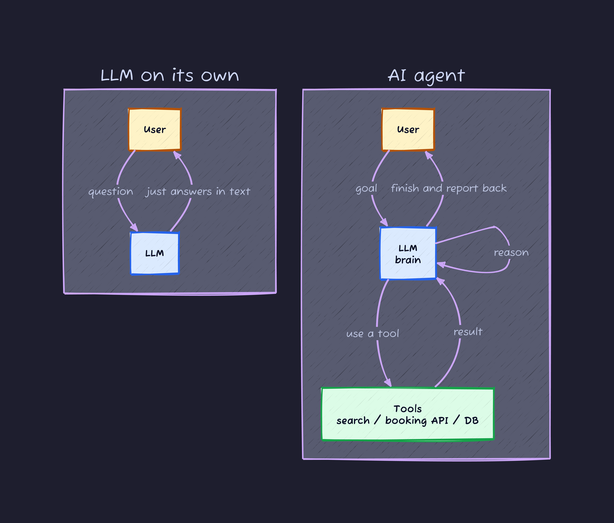
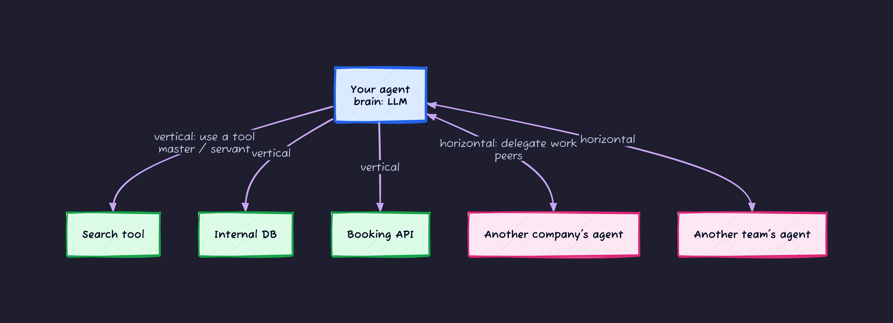
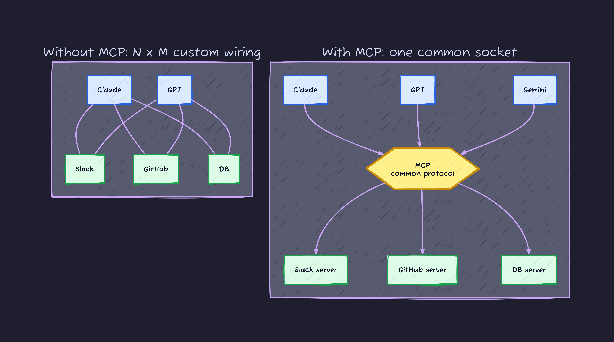
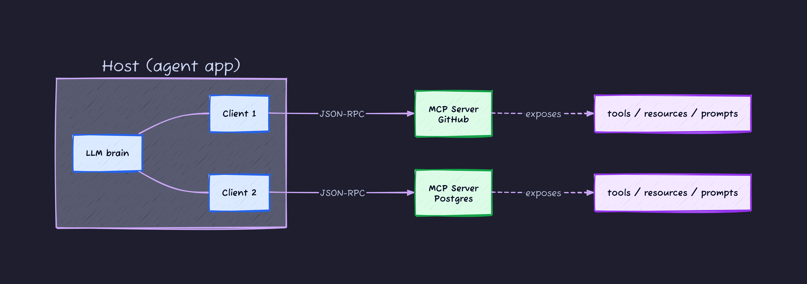
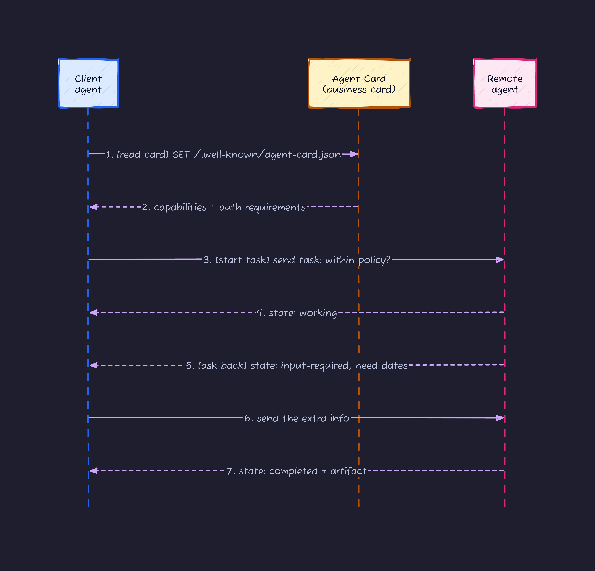
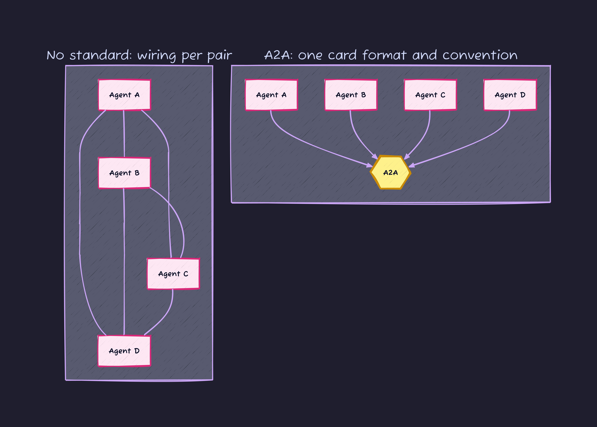
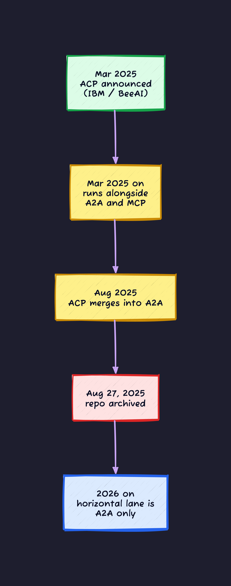
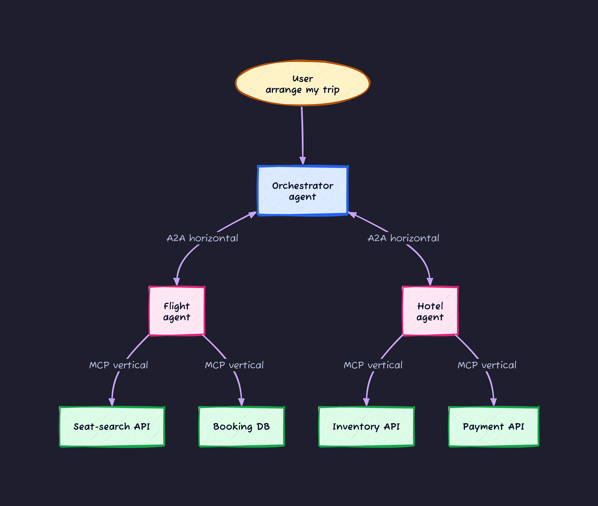
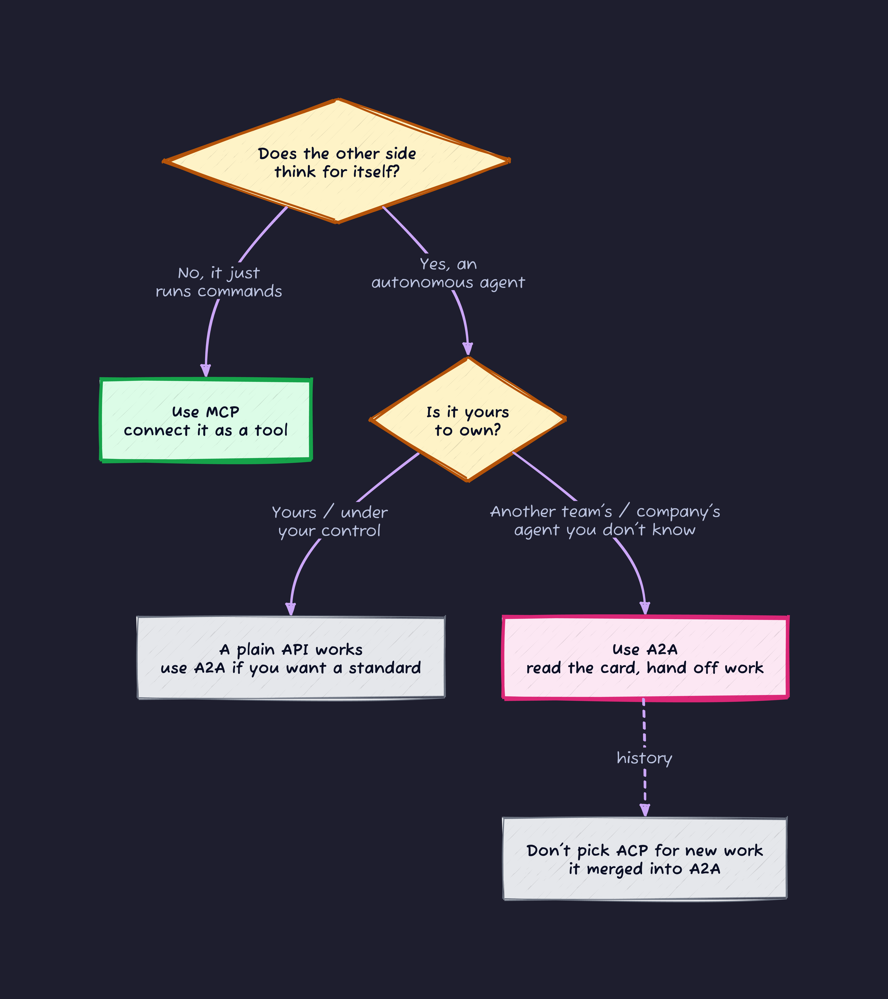

## How this started: I went looking for ACP and it was gone

I wanted to sort out the difference between MCP, ACP, and A2A. MCP I hear about constantly. A2A I knew by name. ACP I barely knew, so I opened its official repo (`github.com/i-am-bee/acp`).

Here is what greeted me at the top of the README:

> **ACP is now part of A2A under the Linux Foundation!**

The repo was archived on August 27, 2025 and set to read-only. In other words, ACP as a standalone protocol was over. It had been folded into A2A.

A lot of explainers written in the first half of 2025 are built around "pick the right one of MCP, ACP, and A2A." But in 2026 those three are not three equals. There are two pillars, MCP and A2A, and ACP is the history of something that flowed into one of them.

So in this post I am going to draw a map first: "an agent only reaches out in two directions." Then I will place MCP and A2A on that map, and only after that explain where ACP sat and where it went. Read it top to bottom and the loose terms should snap onto a single picture.

You need almost no background. If you have ever had an LLM call an API, you can follow this.

---

## Prereq 1: what actually makes something an "AI agent"

Before the protocols, let me line up the words. "LLM" and "AI agent" get used interchangeably, but they are not the same thing.

An **LLM on its own** is close to a function that takes text and returns text. Smart, but it cannot do anything by itself. It cannot browse the web, read a file, or run code. It just answers what you ask.

An **AI agent** uses that LLM as a brain, and works toward a goal: it decides for itself, picks up tools, and loops as many times as needed. Tell it "book me a flight for next week's Tokyo trip" and it searches for seats, compares prices, and hits the booking API. It drives that whole loop on its own.

The thing to hold onto: an agent is **a brain (the LLM) plus hands and feet (tools)**. The brain alone does nothing. How you wire up those hands and feet is where the first protocol shows up.

---

## Prereq 2: an agent only reaches out in two directions

When an agent talks to "the outside world," it really only goes in two directions. These two directions are the map this whole post hangs on.

1. **Downward, to use a tool** (the vertical direction): a search engine, a database, an internal API, the filesystem. Things the agent "uses" as its own hands and feet. There is a master/servant relationship.
2. **Sideways, to team up with another agent** (the horizontal direction): an agent built by another team, an agent at another company. A peer you "hand work to" as an equal.

These two directions are completely different in nature.

- **Vertical (a tool)**: the other side is just a function. You pass input, you get output. It does not think. It does what it is told.
- **Horizontal (an agent)**: the other side has a brain too. You hand over "what you want done" (the intent), and it figures out how on its own. Sometimes it takes several round trips.

This **vertical = MCP, horizontal = A2A** split is the standard way to carve things up as of 2026. And this is not someone's hot take: the A2A spec itself has an "A2A and MCP" section that frames MCP as how an agent uses a tool and A2A as how agents collaborate as peers, and calls them complementary, not competitors.

So let me take the two one at a time.

---

## MCP: the standard for the vertical direction (agent ↔ tool)

### The problem MCP solved: N×M wiring hell

MCP (Model Context Protocol) is an open protocol Anthropic published in November 2024. In one line, it is **a standard way to give an LLM tools**.

Why standardize at all? Picture a world without a standard. Say there are N kinds of LLM (Claude, GPT, Gemini, ...) and M tools you want to connect (Slack, GitHub, Postgres, ...). With no standard, you end up writing a custom connector for every pair. That is N×M wires.

MCP drops one **common socket** in the middle. The tool side builds an "MCP server" once and every LLM can use it. The LLM side implements an "MCP client" once and can reach every tool. The wiring drops to N+M.

Before USB, every device needed its own cable. USB standardized the socket. MCP is "the USB between an LLM and its tools."

### What is inside MCP: three roles and the primitives

MCP runs on top of JSON-RPC 2.0 (a plain convention for exchanging requests and responses as JSON) and keeps session state as it goes. There are three roles.

| Role   | What it does                                                                   |
| ------ | ------------------------------------------------------------------------------ |
| Host   | The app the user actually touches (Claude Desktop, an IDE, your own agent)     |
| Client | Lives inside the Host and holds a 1-to-1 connection to a single server         |
| Server | The side that provides tools and data (a Slack server, a DB server, and so on) |

A server exposes mainly three things (called primitives). Nail these down and MCP's shape comes into focus.

- **Tools**: "functions" the LLM can call. Like `create_issue(title, body)`: pass arguments, it does something and returns a result. The LLM calls these actively.
- **Resources**: "data" you let the LLM read. File contents, DB records, logs. Identified by a URI.
- **Prompts**: prepared "instruction templates." The user picks one to use.

There are two ways to connect (the transport): **stdio**, which launches the server as a local process and talks over standard in/out, and **Streamable HTTP**, which connects over HTTP. Local tools use the former, remote services the latter.

### Where MCP is now (2026)

MCP has not stood still. The spec gets updated often, and the latest as of 2026 is the **2025-11-25 revision**. Read the trend of the changes and the direction is clear.

- **2025-06-18 revision**: security took center stage. It formally classifies an MCP server as an OAuth 2.0 "resource server" and binds tokens to a specific server. It also added structured output (`structuredContent`) and **elicitation** (asking the user for more input mid-conversation).
- **2025-11-25 revision**: authorization got stronger still (OpenID Connect Discovery support, among others). It also added **tasks** (experimental) for tracking long-running work.

MCP started as "just connect the tools" and has been shifting its weight toward "who is allowed to use this tool" (authn and authz). Once tools include internal DBs and payment APIs, that is the natural progression.

---

## A2A: the standard for the horizontal direction (agent ↔ agent)

### Where MCP runs out of road

MCP connects the tools. But what if **the other side is not a tool, but another agent**?

Say your company's travel-booking agent wants to hand work to a partner's "flight-booking agent." Now the other side:

- has its own brain (an LLM); it is not a tool that executes your command one-to-one.
- given an **intent** like "lock in a flight to Osaka next week with a seat, under 30,000 yen," decides for itself which booking API to hit and how.
- does not finish in one round trip; it asks back, "that day is full, how about within three days either side?" (a multi-turn exchange).

The MCP "call a function once" model cannot express this. This is where A2A (Agent2Agent) comes in.

### How A2A came to be

A2A is a protocol Google announced in April 2025. What happened next moved fast.

- On June 23, 2025 it became a **formal project under the Linux Foundation** (backed by 100+ companies). That means it stopped being any one vendor's property and became a neutral standard.
- On March 12, 2026 it reached **v1.0.0**. A stable release.

A2A's goal is to let **opaque agents** built by different vendors and frameworks collaborate without touching each other's internal state or tools. An agent whose source you cannot `import`, running somewhere else, owned by someone else. And you can still hand it work.

### What is inside A2A: the Agent Card and the Task

The first thing to grasp in A2A is the **Agent Card** (the agent's business card). Each agent publishes it as JSON at `/.well-known/agent-card.json`, and it says:

- what it can do (skills and capabilities)
- where to connect (the endpoint)
- what auth you need to call it (Bearer token? mTLS?)

The caller reads this card first. It learns "what this thing can do and how to authenticate" at runtime, then sends the real request. No need to pre-build against the other side's API contract.

The unit of work is the **Task**. A task has a unique ID and moves through states (`submitted` → `working` → `input-required` → `completed`, and so on). Even slow work can proceed while you follow its state.

This "1) read the card, 2) send intent, 3) work it out in a back-and-forth" is A2A's basic rhythm. Compare it to MCP's "call a function once and get a result" and you can feel the difference in cadence.

### A2A is also about the N×N problem

A2A's real value, just like MCP's, is preventing combinatorial blowup.

Every company has agents and wants to hand work back and forth. With no standard, every pair needs its own connector. The more agents there are, the more the combinations explode (N×N). If everyone aligns on A2A's single card format and single calling convention, **you can hand work to an agent you have never met, with no prior arrangement**.

Same shape as USB-C. The technology itself is not new; the value is that **everyone agreed on the same socket**. Vendors have a motive here too: they do not want to expose raw APIs, but they will open up through an "agent" front door.

---

## Where ACP sat, and where it went

So far, two pillars: MCP (vertical) and A2A (horizontal). So where does the ACP from the opening fit?

### What ACP was

ACP (Agent Communication Protocol) is a protocol IBM Research announced in March 2025. It was built to drive BeeAI, an open-source agent platform (`i-am-bee`). Its purpose was nearly the same as A2A's **horizontal** lane: standardizing agent-to-agent communication.

There were small differences from A2A. ACP was REST-native and lightweight, and declared an agent's capabilities at build time (in contrast to A2A reading a card at runtime). But on the big picture, it was **a competing protocol aiming at the same "agent-to-agent" slot as A2A**.

### And then it merged into A2A

Two standards (A2A and ACP) in the horizontal lane leaves the field asking "which one do I align with?" When a standard splits, the whole benefit of a standard (everyone converging) evaporates.

So in August 2025 the call was made. The IBM/BeeAI team wound down ACP's independent development and announced they would **contribute its technology and know-how directly into A2A**.

- August 25-29, 2025: "ACP Joins Forces with A2A" is announced officially.
- August 27, 2025: `github.com/i-am-bee/acp` is archived (read-only). The README leads with "ACP is now part of A2A" and a pointer to a migration guide.
- BeeAI itself lives on, but its communication moves from ACP to **A2A** (with a migration guide provided).
- An IBM Research representative joined A2A's Technical Steering Committee, alongside Google, Microsoft, AWS, Cisco, and others.

So **in 2026, lining up ACP as a current, independent protocol next to MCP and A2A is not accurate**. The right read is historical: "the horizontal lane briefly split in two, then consolidated onto A2A." If you are building something new, pick A2A for the horizontal lane. There is no reason to adopt ACP today.

> Aside: the acronym "ACP" has another, unrelated meaning. The Cisco-led AGNTCY initiative uses "Agent Connect Protocol." It has nothing to do with IBM's Agent Communication Protocol, and online explainers sometimes conflate them. The ACP in this post always means the IBM/BeeAI one.

---

## The whole picture: who does what in a multi-agent system

So how do MCP and A2A live together inside one system? A concrete example is the fastest way to see it.

Picture a system that takes the request "arrange my whole business trip." The shape:

- **Orchestrator agent**: understands the request and parcels work out to specialist agents. The conductor.
- **Flight agent / Hotel agent**: the specialists. Each runs independently.
- Each agent uses external tools (a seat-search API, a booking DB) to do its own job.

Now draw the lines. **Between the conductor and the specialists (the sideways link) is A2A.** **Between each agent and its tools (the downward use) is MCP.** That maps straight onto the diagram.

The colors split the roles for you. **The horizontal links between the pink agents are A2A; the vertical links from an agent down to a green tool are MCP.** You cannot build this with only one of them. You need both the sideways collaboration and the downward tool use. Which is exactly why the official line, "MCP and A2A are complementary, not competitors," lands so cleanly in this picture.

---

## A cheat sheet and a decision flow

Let me compress everything down to something you can use while your hands are on the keyboard.

### Cheat sheet

| Angle            | MCP                               | A2A                               |
| ---------------- | --------------------------------- | --------------------------------- |
| Direction        | Vertical (agent → tool)           | Horizontal (agent ↔ agent)        |
| Other side       | A plain function (does not think) | An autonomous agent (has a brain) |
| What you pass    | A function call (arguments)       | An intent (what you want done)    |
| Interaction      | Usually call once, get a result   | Multi-turn, stateful work         |
| Discovery        | Connect via server config         | Read the Agent Card at runtime    |
| Origin / steward | Anthropic                         | Google → Linux Foundation         |
| Latest           | Spec revision 2025-11-25          | v1.0.0 (March 2026)               |
| One-liner        | "Give it a tool"                  | "Hand it a job"                   |

### Which one? A decision flow

When in doubt, ask first whether the thing you are connecting to is a "tool" or an "agent."

### How it breaks when you pick wrong

A design call is not just "pick the right one." Knowing how it breaks when you pick wrong makes you stronger.

- **Implementing a tool call over A2A**: you take on heavyweight machinery you do not need (fetching the card, task lifecycle management, async exchanges). It is overkill for a simple API call.
- **Forcing cross-company agent collaboration through MCP**: MCP assumes "the other side is a tool," so it cannot express peer multi-turn negotiation or the other side planning on its own. There are bridges that "wrap an A2A agent as an MCP tool and call it once," but treat that as the narrow case where it is fine to demote a peer to a tool.
- **Adopting ACP today**: the repo is archived and independent development has stopped. For the horizontal lane, lean on A2A.

---

## Bonus: AGNTCY sits above all this

MCP and A2A cover the broad strokes. But there is one more name worth dropping to finish the map: **AGNTCY**.

AGNTCY is an initiative led by Cisco and others, donated to the Linux Foundation in July 2025, aiming at an "Internet of Agents." It is not a single protocol but a layer of infrastructure that sits higher up.

- **Discovery**: a way to find agents, DNS-style.
- **Identity**: cryptographically verifiable agent IDs.
- **Messaging (SLIM)**: a low-latency, secure transport between agents.
- **Observability**: monitoring multi-agent workflows.

It is positioned to **interoperate with A2A and MCP rather than compete with them**. Think of MCP as "the socket to tools," A2A as "the socket between agents," and AGNTCY as "the city infrastructure that finds, connects, and monitors them all." You rarely touch it directly in day-to-day work, but knowing this layer exists gives you a clearer view of the whole ecosystem.

---

## Wrap-up: a map makes it less scary

This ran long, so let me close back on the first map.

- An agent reaches out in only **two directions: vertical (tools) and horizontal (agents)**.
- **Vertical = MCP** (Anthropic). The socket that gives an LLM tools. Collapses N×M wiring. Internals are host/client/server and tools/resources/prompts. Lately its weight has shifted toward authn and authz.
- **Horizontal = A2A** (Google → Linux Foundation, v1.0.0 in March 2026). The socket for handing work to an agent. Read the Agent Card, run the Task. Collapses N×N wiring.
- **ACP** was a second standard for the horizontal lane, but it merged into A2A in August 2025 and its repo is archived. In 2026 treat it as history; do not adopt it for new work.
- In one system MCP and A2A **coexist**: A2A for the sideways collaboration, MCP for the downward tool use. That is exactly why they are complementary.

The "pick one of three" framing written last year got re-sorted, in 2026, into "two pillars plus one that flowed in." Standards converge like this, splitting and consolidating, until they settle onto a single socket. The way USB-C did.

Next time you actually write an MCP server or an A2A agent, start by asking yourself: "am I drawing a vertical line right now, or a horizontal one?" That alone tells you, without hesitation, which protocol's docs to open.
