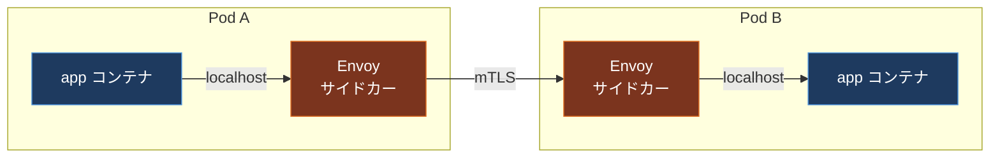
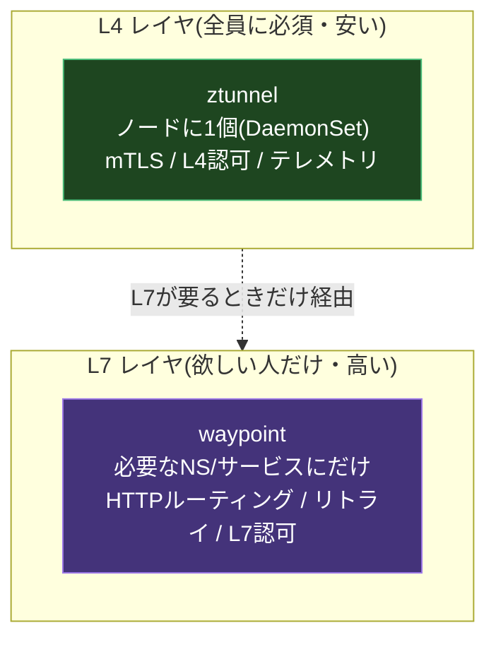
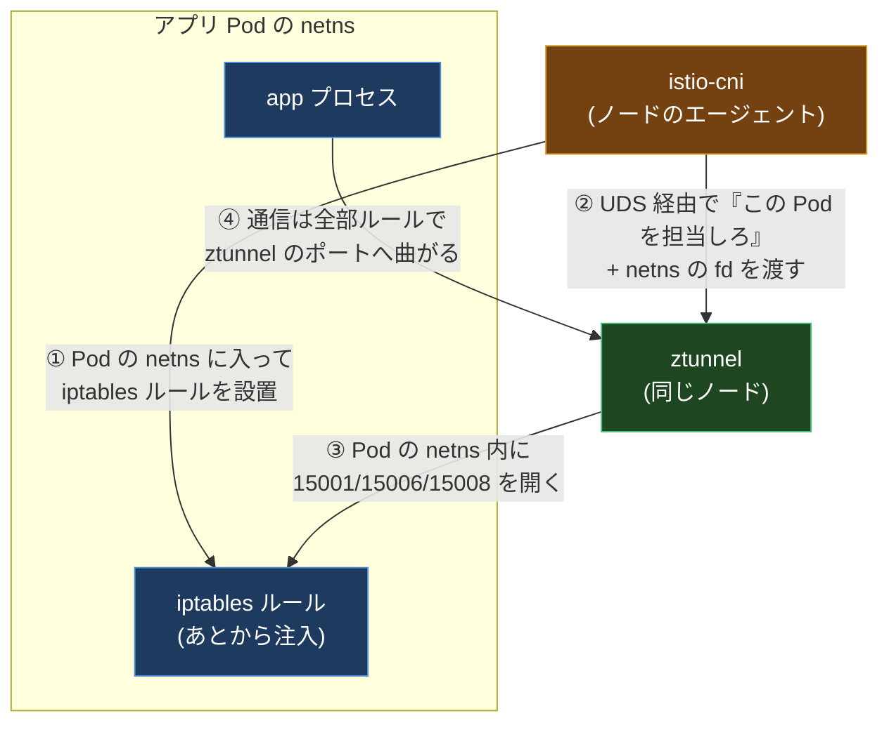
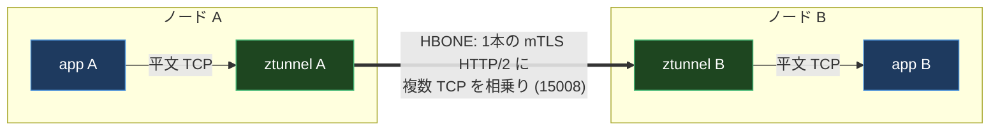
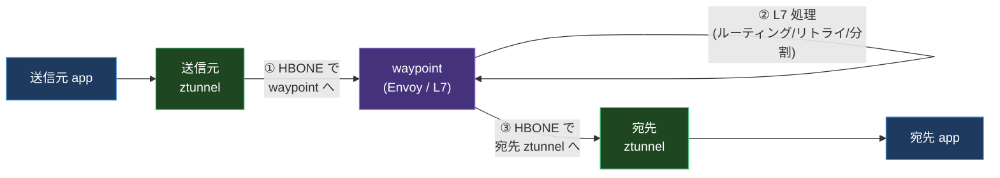

## Introduction

少し前に、ある Kubernetes クラスタのコストを眺めていて、しばらく固まった。

アプリの Pod が 400 個ほど動いていて、その全部に Istio のサイドカー(Envoy)が 1 個ずつ刺さっていた。つまり Envoy も 400 個。1 個あたり数十 MB のメモリと、それなりの CPU を常に食う。アプリ本体より sidecar のほうが太っている Pod すらあった。トラフィックがほとんど流れていない深夜でも、400 個の Envoy はメモリを握ったまま居座る。

「mesh が欲しいのは mTLS と可観測性とちょっとした L7 ルーティングだけなのに、なんでアプリと同じ数だけプロキシを増やして、その全部を太らせてるんだ?」

この素朴な不満に正面から答えたのが、Istio の **ambient mode(ambient mesh)** だ。2024 年 11 月の Istio 1.24 で GA(正式版)になり、ztunnel・waypoint・関連 API がすべて Stable 扱いになった。

ambient は「サイドカーを全部やめる」という、mesh の作り方そのものを変える提案だ。この記事では、なぜサイドカーが重かったのかという前提から始めて、ambient がデータプレーンをどう 2 つに割ったのか、パケットが Pod に入った瞬間に何が起きているのか(ここが一番おもしろい)、そして何を諦めたのかまでを、上から順に読めるように解剖していく。

---

## 0. 前提: そもそも「サイドカー mesh」とは何だったのか

ambient の話をする前に、ambient が置き換えようとしている「従来型」を 1 分でおさらいする。ここを共有しておかないと、ambient の何がうれしいのかが伝わらない。

service mesh の目的はシンプルだ。

- サービス間通信を **mTLS** で暗号化・認証したい(ゼロトラスト)
- リトライ・タイムアウト・カナリアなどの **L7 トラフィック制御** を、アプリのコードを触らずにやりたい
- すべての通信の **メトリクス・トレース** を自動で取りたい

これを実現する古典的なやり方が「サイドカープロキシ」だ。アプリの Pod の中に、もう 1 個 Envoy のコンテナを同居させる。アプリが出す通信・受ける通信を全部この Envoy に通し、Envoy が暗号化やルーティングを肩代わりする。アプリは「自分は localhost に喋っているだけ」と思っている。



この方式はよく動く。実際、何年も production を支えてきた。だが、規模が増えると次の 3 つが効いてくる。

1. **リソース税**: アプリ Pod 1 個ごとに Envoy が 1 個。Pod が 1000 個なら Envoy も 1000 個。メモリも CPU も Pod 数に比例して増える。しかも各 Envoy は「自分が将来さばくかもしれないピーク」を見越して余分に確保しがちで、過剰割り当てになりやすい。
2. **アップグレードの痛み**: Envoy(データプレーン)を更新するたびに、全アプリ Pod を再起動する必要がある。アプリのデプロイと mesh のメンテが密結合する。
3. **L7 への巻き込み**: サイドカーは常に L7(HTTP)まで全部パースする。mTLS だけ欲しいプレーンな TCP 通信にも、HTTP プロキシのフルコストがかかる。

ambient は、この 3 つを「データプレーンを 2 層に割る」ことで一気に崩しにいった。

---

## 1. Ambient の中心アイデア: データプレーンを L4 と L7 に割る

ambient の発想はこうだ。

> mesh が本当に全員に必要としているのは **mTLS + L4 の認可 + 基本テレメトリ** だけ。L7 のリッチな機能(HTTP ルーティング、リトライ、カナリア)は、実は一部のサービスしか使っていない。だったら、全員に配るべき安いレイヤと、欲しい人だけが足す高いレイヤを分離しよう。

そこで mesh のデータプレーンを 2 つのコンポーネントに割った。



|                       | サイドカー方式                     | ambient 方式                              |
| --------------------- | ---------------------------------- | ----------------------------------------- |
| プロキシの数          | アプリ Pod ごとに 1 個             | L4 はノードごとに 1 個、L7 は必要な分だけ |
| Pod への侵入          | アプリ Pod に Envoy コンテナを注入 | アプリ Pod は素のまま                     |
| プレーン TCP のコスト | 常に L7 フルパース                 | L4 だけで通す(安い)                       |
| アップグレード        | 全アプリ Pod を再起動              | ztunnel(DaemonSet)を入れ替えるだけ        |

この「L4 は全員にノード共有で安く、L7 は欲しい人にだけ」という分割が ambient のすべてだと言ってもいい。以下、この 2 つを順番に深掘りする。

---

## 2. ztunnel: ノードに 1 個の「ゼロトラスト・トンネル」

**ztunnel(zero-trust tunnel)** が L4 レイヤの主役だ。性質を箇条書きで押さえる。

- **Rust 製の軽量プロキシ**。Envoy ではない。L4(TCP)に機能を絞っているので小さく速い。
- **DaemonSet として各ノードに 1 個** だけ動く。アプリ Pod の中には入らない。
- やることは 3 つ: **SPIFFE 証明書による mTLS の確立**、**L4 認可(送信元 / 宛先の identity による許可・拒否)**、**HBONE トンネリング**(後述)。
- **L7 は一切やらない**。HTTP ヘッダもパスもリトライも知らない。ztunnel が理解するのは「TCP フロー」だけ。

ここで一番大事なポイントを先に言っておく。ztunnel はノード共有だが、**通信に乗せる identity は ztunnel 自身のものではなく、実際のワークロード(アプリの ServiceAccount)のもの** だ。

証明書の identity は Istio 標準の SPIFFE 形式で、

```text
spiffe://<trust domain>/ns/<namespace>/sa/<service account>
```

という形をしている。ノードに同居している複数のアプリ Pod は、それぞれ別の ServiceAccount を持つ。ztunnel は各 Pod のぶんの証明書を `istiod` の CA から受け取り、Pod A の通信には Pod A の identity を、Pod B の通信には Pod B の identity を使い分ける。「ノード共有プロキシなのに identity はワークロードごと」という、一見矛盾した芸当をやっているのがこのレイヤだ。

> SPIFFE / SPIRE がこの identity(SVID)をどう発行・検証するかは、別記事「SPIFFE/SPIRE Deep Dive」で掘っている。ambient の ztunnel はその SVID の消費者だと思えばいい。

---

## 3. パケットはどうやって ztunnel に吸い込まれるのか

ここが ambient の最大の山場だ。アプリ Pod の中には Envoy がいない。なのに、アプリが送受信する通信を全部 ztunnel に通さないといけない。**アプリのコードもマニフェストも変えずに、どうやって?**

答えは「Pod のネットワーク名前空間(netns)の中に、パケットを ztunnel へ曲げる iptables ルールを後から差し込む」だ。これをやるのが **istio-cni** というノード上のエージェント(これも DaemonSet)。

### 3-1. in-pod リダイレクトの仕掛け

流れはこうなっている。



1. istio-cni がアプリ Pod のネットワーク名前空間に入り込み、通信を曲げる iptables ルールを設置する。
2. istio-cni が **Unix ドメインソケット(UDS)** 経由で、ノードの ztunnel に「この Pod を担当してくれ」と伝える。このとき、Pod の netns を指す **Linux のファイルディスクリプタ(fd)** を一緒に渡す。
3. ztunnel はその fd を使って Pod の netns の中に入り、リスニングポート(15001 / 15006 / 15008)を開く。
4. 以降、アプリが出し入れする TCP は、設置済みの iptables ルールによって ztunnel のポートに吸い込まれる。

netns の fd を UDS で手渡しする、という低レベルな受け渡しがキモだ。これによって、ノードに 1 個の ztunnel が、複数の Pod それぞれの netns の内側にポートを生やせる。

### 3-2. 3 つのポートの役割

ztunnel が開く 3 つのポートには、それぞれ明確な担当がある。

| ポート | 名前              | 担当する通信                                       |
| ------ | ----------------- | -------------------------------------------------- |
| 15008  | HBONE socket      | HBONE(mTLS で暗号化されたトンネル)で入ってくる通信 |
| 15006  | inbound plaintext | 暗号化されていない平文の inbound 通信              |
| 15001  | outbound          | Pod から出ていく通信(ここから HBONE で包んで送る)  |

リダイレクトのルールを言葉にするとこうだ。

- **Pod に入ってくる TCP**: 宛先ポートが 15008 なら「HBONE で来た」とみなして 15008 へ。それ以外の平文なら 15006 へ。
- **Pod から出ていく TCP**: すべて 15001 に曲げ、ztunnel が HBONE で包んでから外に出す。

### 3-3. ループを防ぐ 0x539 マーク

ここで素朴な疑問が湧く。「ztunnel 自身が送り出すパケットも iptables ルールに引っかかって、また ztunnel に戻ってきたら無限ループでは?」

これを防ぐのが **接続マーク `0x539`** だ。ztunnel(など Istio のプロキシ)が送出するパケットには `0x539` のマークが付く。iptables ルールは「`0x539/0xfff` のマークが付いていない TCP だけを ztunnel に曲げる」という条件になっている。つまり、ztunnel が出したパケットはマーク済みなので二度と曲げられず、素通りして外に出る。マークの有無で「アプリ由来か、プロキシ由来か」を見分けているわけだ。

### 3-4. iptables ではなく eBPF でもいい

このリダイレクトは iptables でやるのが基本だが、**eBPF** で置き換えることもできる。やっていることは同じ「パケットを ztunnel のポートへ曲げる」だが、eBPF だとカーネルに iptables ルールを積むのではなく、カーネル内のフック(パケットが通る決まった地点)に小さなプログラムを直接アタッチして曲げる。iptables ルールやルーティングテーブルを几帳面に組み合わせる代わりに、やりたい挙動そのものをプログラムとして書いて貼れる、という柔軟さがある。

> eBPF が「カーネルを書き換えずに振る舞いを足す」仕組みであることは、別記事「eBPF: Cilium で体験する eBPF」で手を動かして確認できる。

---

## 4. HBONE: 1 本の mTLS トンネルに TCP を相乗りさせる

ztunnel どうしが通信を運ぶときに使うのが **HBONE(HTTP-Based Overlay Network Encapsulation)** だ。名前が厳ついが、中身は素直で、

> **HTTP/2 の `CONNECT` を使って張った 1 本の mTLS コネクションの中に、アプリの複数の TCP ストリームをまとめて流す**

という多重化トンネルだ。ポート 15008 を使う。



ポイントは identity の使い分けだ。HBONE トンネルを張るとき、**送信元の ztunnel は送信元ワークロードの identity** を、**宛先の ztunnel は宛先ワークロードの identity** を名乗る。だから「ノード共有プロキシなのに、L4 認可ポリシーをワークロード単位で正しく適用できる」。トンネルの両端で本物のワークロード identity が立っているからだ。

平文(HBONE ではない、宛先ポートが 15008 でない)で Pod に入ってきた通信は「inbound passthrough」という別経路で 15006 に流れる。mesh に入っていない外部からの素の TCP も、こうして受けられるようになっている。

---

## 5. waypoint: L7 が欲しいときだけ足す Envoy

ここまでが L4 の世界。ztunnel は TCP しか分からないので、次のような **L7 機能** は一切できない。

- HTTP のパス / ヘッダによるルーティング
- カナリア(トラフィックの重み付き分割)
- リトライ、タイムアウト、サーキットブレイク、レート制限、フォールトインジェクション
- HTTP メソッドやパス単位の細かい L7 認可

これらが欲しいサービスにだけ、**waypoint プロキシ(Envoy)** を足す。waypoint は名前空間ごと・サービスごと(あるいは複数名前空間)に配置でき、必要なところにだけ置けばいい。

### 5-1. waypoint を経由する通信の流れ

waypoint があると、通信経路はこう変わる。



1. 送信元の ztunnel は、xDS 設定から「この宛先サービスは waypoint 行き」と知っていて、宛先 ztunnel に直行せず waypoint への HBONE トンネルを張る。
2. waypoint(Envoy)が L7 処理(リトライ、トラフィック分割など)を行う。
3. 処理後、waypoint は別の HBONE トンネルで宛先の ztunnel に渡し、ztunnel が Pod に届ける。

重要なのは、**L7 が要らないサービスはこの寄り道を一切しない** ことだ。80% のサービスは ztunnel だけ(mTLS + SPIFFE identity + L4 ポリシー)で済ませ、本当に HTTP ルーティングやカナリアが要る 20% にだけ waypoint を置く、という運用ができる。これがサイドカー方式にあった「全員が常に L7 フルコストを払う」税を消す。

### 5-2. sandwich モデル

2025 年以降は、より分離を進めた **sandwich(サンドイッチ)モデル** もある。waypoint の前後に ztunnel を論理的に挟む形で、HBONE トンネルの管理は両側の ztunnel に任せ、waypoint は L7 処理とポリシーだけに専念する。waypoint を「ただの L7 関数」に近づける構成だ。

---

## 6. ポリシーはどのレイヤで効くのか

ambient ではポリシーの適用ポイントが 2 つに割れる。ここを混同すると「ポリシーを書いたのに効かない」が起きるので、表で固定しておく。

| ポリシー                 | 効くレイヤ | 例                                      |
| ------------------------ | ---------- | --------------------------------------- |
| L4 `AuthorizationPolicy` | ztunnel    | 「ServiceAccount X からの接続だけ許可」 |
| L7 `AuthorizationPolicy` | waypoint   | 「`GET /admin` は管理者だけ」           |

L4 の許可・拒否(送信元 identity・宛先・ポート単位)は ztunnel が処理する。一方、HTTP メソッドやパスを見る L7 認可は waypoint がいないと効かない。**L7 ポリシーを書いているのに waypoint を置いていない** と、そのルールはどこでも評価されずすり抜ける。これは ambient 導入で最もハマりやすい落とし穴だ。

> mesh の mTLS(`PeerAuthentication` の STRICT / PERMISSIVE)と `AuthorizationPolicy` が SPIFFE identity とどう噛み合うかは、このシリーズの別記事で正面から扱う予定。

---

## 7. 性能とコスト: 数字で見る「軽さ」

ambient が解こうとした一番の動機はコストだった。実際の数字を見る。

- Istio 1.24 の公式ベンチでは、**1,000 req/sec をさばく ztunnel 1 個が、約 0.06 vCPU・約 12 MB メモリ** で済む。これはサイドカー方式の 1 プロキシ比でおよそ **3 分の 1**。
- ノード共有なので、そもそもプロキシの個数が「Pod 数」から「ノード数」に変わる。Pod が 1000 個でもノードが 50 台なら ztunnel は 50 個。
- ユースケースによっては、過剰割り当てを含めたメッシュのオーバーヘッドが **90% 以上削減** できるケースもあるとされる。

数の削減(Pod 比 → ノード比)と、1 個あたりの軽さ(L4 限定 + Rust)が掛け算で効く。冒頭の「アプリより太ったサイドカーが 400 個」という状況が、まさにこの方式の解きたかった問題だ。

---

## 8. 何を諦めたのか: 制約とトレードオフ

ambient はいいことずくめではない。サイドカーから乗り換える前に知っておくべき制約がある。

- **`EnvoyFilter` が使えない**。サイドカー時代に Envoy を低レベルにカスタマイズするのに多用された `EnvoyFilter` API は ambient では非対応。拡張は **WebAssembly(Wasm)プラグイン** で行う必要がある。
- **L7 機能には waypoint の明示配置が必要**。「とりあえず mesh に入れれば L7 ポリシーも効く」ではない。前述の落とし穴。
- **マルチクラスタはより新しめ**。クラスタをまたぐ通信は **double HBONE**(外側 mTLS と内側 mTLS の二重トンネル)を east-west gateway(クラスタ間の東西通信を中継する専用の入口ゲートウェイ)経由で張る。east-west gateway が外側を終端して認証し、内側のトンネルで宛先 ztunnel に渡す。multi-cluster 対応は 1.27(2025 年 8 月)時点で alpha 相当の機能が入ってきた段階で、サイドカー方式ほど枯れてはいない。
- **新しい通信経路の理解コスト**。「Pod → 自ノード ztunnel → (waypoint) → 宛先ノード ztunnel → Pod」という経路は、トラブルシュートのとき頭の中のモデルを更新しておかないと追えない。15008(ztunnel 間 HBONE)や 15012(ztunnel ↔ istiod の設定・証明書)を NetworkPolicy で塞いでしまう事故もありがち。

---

## 9. Conclusion

ambient がやったのは、つきつめると **「データプレーンを、全員に必須の安い L4 と、欲しい人だけの高い L7 に割った」** という 1 行に尽きる。サイドカーは「1 個のプロキシに L4 も L7 も全部入り」だったのを、ambient は責務で 2 つに切り分けた。その結果、プロキシの個数も、1 個あたりのコストも、アップグレードの結合も、まとめて軽くなった。

サイドカーが間違いだったわけではない。長くよく動いてきた。ただ「mesh が欲しいものの大半は L4 で、L7 は一部」という現実に、データプレーンの形のほうを合わせにいったのが ambient だ。

手触りを掴むのに一番効くのは、`istioctl install --set profile=ambient` で入れたあと、サンプルアプリを 1 個デプロイして `kubectl get pod` を見ることだ。`READY` が `1/1` のままなのに(サイドカー方式なら `2/2` になる)、サービス間は mTLS で暗号化されている。「Pod の中に Envoy がいないのに mesh が効いている」という、サイドカーに慣れた目には一瞬バグに見える状態こそが ambient の正体だ。
