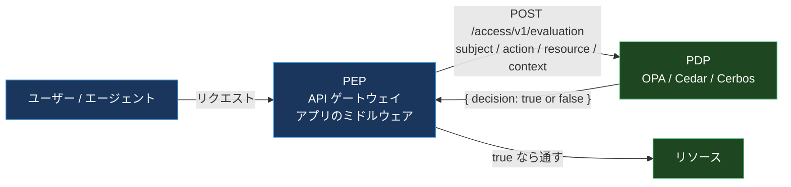
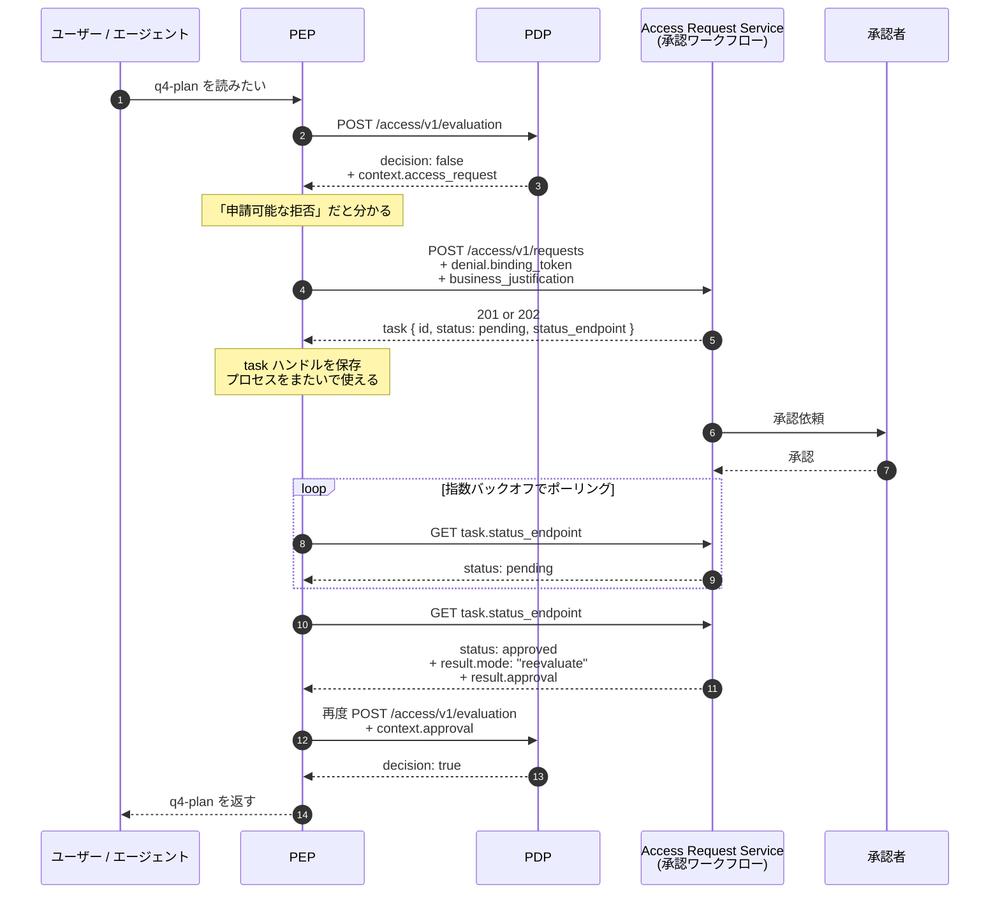
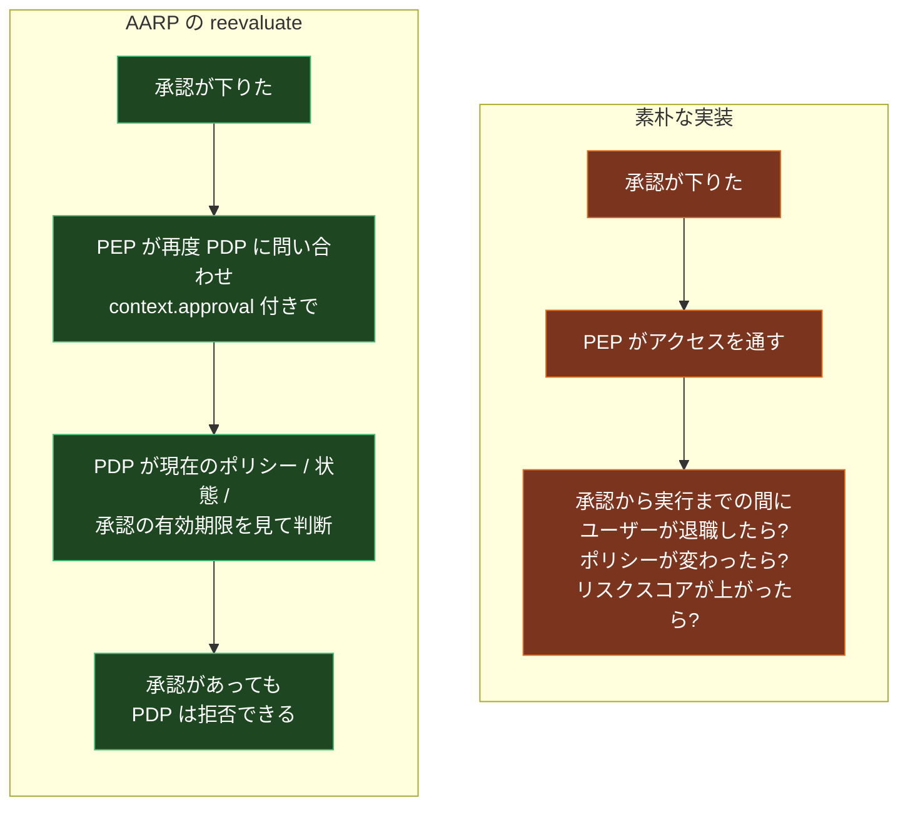
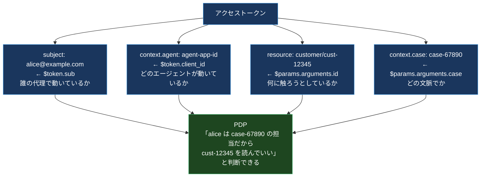
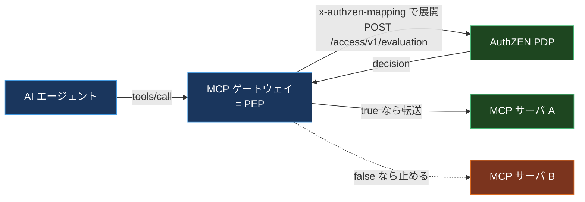
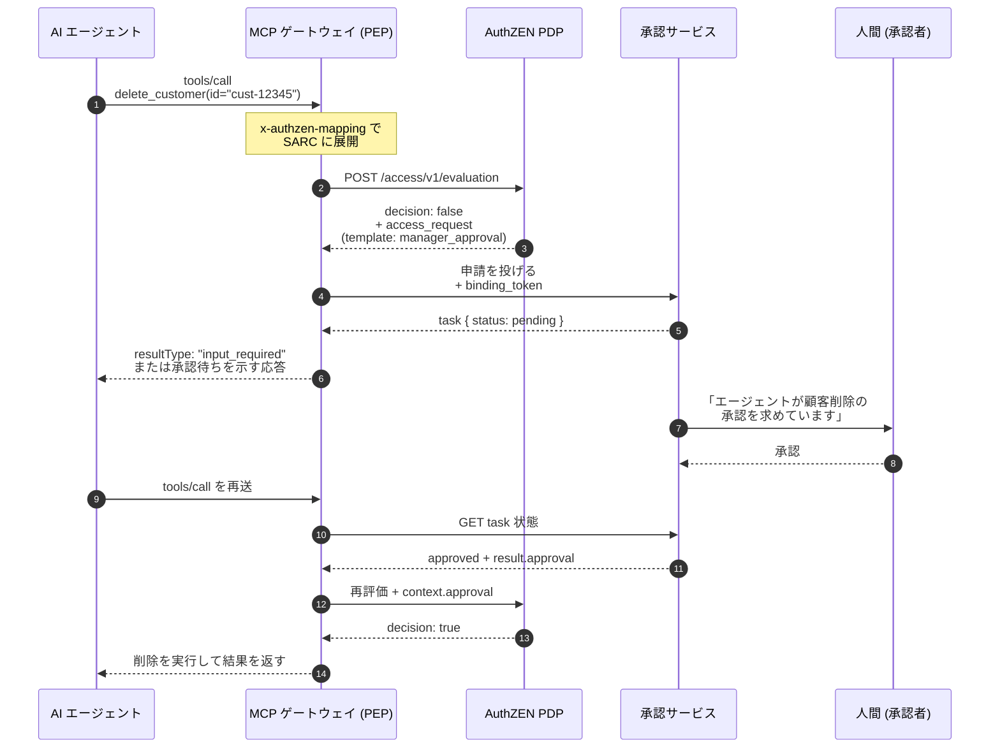

AuthZEN の Authorization API について記事を書き、OPA を AuthZEN 互換の PDP にするプラグインまで作った。仕様としてはよくできていると思っている。「この subject は、この resource に対して、この action をしていいか」を JSON で投げると `{"decision": true}` か `{"decision": false}` が返ってくる。シンプルで、実装しやすい。

ただ、実際に使っていて、ずっと引っかかっていたことがあった。

**`false` が返ってきたあと、ユーザーは何をすればいいのか。**

「権限がありません」と表示して終わり、というのが多くのシステムの答えだ。でも現実には、その後ろに「Slack で上司に頼む」「社内の申請システムでチケットを切る」「セキュリティチームに Jira を投げる」という人間のワークフローがぶら下がっている。認可 API はそこを一切知らない。`false` を返して、あとは知らんぷりをする。

AI エージェントが増えると、この問題が急に痛くなる。エージェントは人間より桁違いに多くの操作を試み、そのたびに `false` を受け取る。人間なら「ああ権限ないのか」で諦めるが、エージェントは諦め方を知らない。そして、そもそも「頼む相手」であるユーザーがその場にいないことも多い。

2026年、OpenID Foundation の AuthZEN Working Group が2本の Working Group Draft を承認した。**AARP** と **COAZ** だ。この2本は、まさにここを埋めにきている。

この記事では、AuthZEN を知らない前提から順に説明して、この2本が何を足したのかを追う。

## 前提1: AuthZEN Authorization API は何をする API なのか

まず土台から。

認可 (authorization) の実装でよく出てくるのが **PDP / PEP** という分け方だ。

- **PEP** (Policy Enforcement Point): 実際にアクセスを止めたり通したりする場所。API ゲートウェイ、アプリのミドルウェア、サービスメッシュのサイドカーなど
- **PDP** (Policy Decision Point): 「通していいか」を判断する場所。OPA、Cedar、Cerbos、SpiceDB など

この分離自体は昔からあるが、**PEP と PDP の間のプロトコルが標準化されていなかった**。OPA には OPA の API があり、Cedar には Cedar の形があり、SaaS ベンダはそれぞれ独自の API を持っていた。PDP を入れ替えると PEP を全部書き直すことになる。

AuthZEN Authorization API 1.0 は、この間を標準化した。リクエストは4つの要素からなる。頭文字を取って **SARC** と呼ばれる。

```json
{
  "subject":  { "type": "user",     "id": "alice@example.com" },
  "action":   { "name": "can_read" },
  "resource": { "type": "document", "id": "q4-plan" },
  "context":  { "ip": "10.0.0.1", "time": "2026-08-15T09:00:00Z" }
}
```

レスポンスはこれだけ。

```json
{ "decision": true }
```



きれいな設計だ。そして、この `decision` が boolean であることが、これから話す2つのドラフトの出発点になっている。

## 前提2: boolean で表せない状態がある

`decision: false` には、実は複数の意味が混ざっている。

| 実際の状況 | 現行 API での表現 |
| --- | --- |
| このユーザーには永遠に権限がない | `false` |
| ポリシー上は可能だが、上司の承認がまだ | `false` |
| ユーザーの同意がまだ取れていない | `false` |
| デバイスの attestation が古い | `false` |
| リスクスコアが高いので追加認証が要る | `false` |
| 申請理由の記入が必要 | `false` |

上の5つは「今はダメだが、何かをすれば通る」だ。1つめだけが「本当にダメ」。この区別が API から落ちている。

現実には、この区別はどこかで実装されている。ただし PDP の外側で、アプリごとに、独自の形で。エラーコードを見て分岐したり、`context` に非標準のフィールドを詰めたり。相互運用性はない。

**AARP (AuthZEN Access Request and Approval Profile)** は、ここを標準化する。

## AARP: 「拒否だが、申請可能」という状態

AARP の設計で真っ先に評価したいのは、**decision モデルを壊していない** ことだ。

> 拒否された decision は拒否のままであり、アクセスとして扱ってはならない。

`decision: false` は `false` のまま。「保留」という第3の値を導入したりしない。代わりに、`context` の中に **`access_request`** というオブジェクトを足す。これが「この拒否は申請可能ですよ」というマーカーになる。

### 拒否レスポンスの形

```json
{
  "decision": false,
  "context": {
    "access_request": {
      "endpoint": "https://pdp.example.com/access/v1/requests",
      "template": "manager_approval",
      "expires_at": "2026-04-30T20:25:00Z",
      "binding_token": "eyJhbGciOiJFUzI1NiIsImtpZCI6InBkcC0xIn0...",
      "form_url": "https://requests.example.com/forms/manager_approval",
      "request_schema_url": "https://requests.example.com/schemas/manager_approval.json",
      "display": {
        "title": "Request access",
        "description": "Manager approval required"
      }
    }
  }
}
```

各フィールドの役割はこうなる。

| フィールド | 役割 |
| --- | --- |
| `endpoint` | 申請を投げる先の URL |
| `template` | どのワークフローを使うかの識別子 |
| `expires_at` | この申請可能な状態がいつまで有効か |
| `binding_token` | この拒否が本物であることを示す、完全性保護された証明 |
| `form_url` | 人間に見せる申請フォームの URL |
| `request_schema_url` | 申請に必要な項目の JSON Schema |
| `display` | UI に出す文言 |

`binding_token` が入っているのが重要な設計だ。これがないと、PEP が勝手に「この拒否は申請可能だった」と偽って申請を投げられてしまう。PDP が署名したトークンを持って戻ってこさせることで、申請が実際の拒否に紐付いていることを保証する。

### 全体のフロー



### 申請の投げ方

```json
{
  "subject":  { "type": "user", "id": "alice@example.com" },
  "resource": { "type": "document", "id": "q4-plan" },
  "action":   { "name": "can_read" },
  "context":  { "business_justification": "Customer renewal review" },
  "requested_access": {
    "requested_until": "2026-05-01T00:15:00Z"
  },
  "denial": {
    "evaluation_id": "eval_01HX4Y2P8BQ4Y3F0V0K9D6Z7M1",
    "expires_at": "2026-04-30T20:25:00Z",
    "binding_token": "eyJhbGciOiJFUzI1NiIsImtpZCI6InBkcC0xIn0...",
    "template": "manager_approval"
  }
}
```

`denial` オブジェクトには `evaluation_id` か `binding_token` の **どちらか (または両方)** が必須。`expires_at` は必須で、拒否レスポンスの値をそのまま echo する。

`requested_access.requested_until` で「いつまでのアクセスが欲しいか」を指定できる。恒久的な権限付与ではなく、時限アクセスを標準で表現できるようになっている。

### task ハンドル

レスポンスはこう。

```json
{
  "task": {
    "id": "arq_01HX4Y3AJZ7Y56W2F9H8Q8C1V4",
    "status": "pending",
    "status_endpoint": "https://pdp.example.com/access/v1/requests/arq_01HX4Y3AJZ7Y56W2F9H8Q8C1V4",
    "expires_at": "2026-04-30T23:00:00Z",
    "links": {
      "cancel": "https://pdp.example.com/access/v1/requests/arq_01HX4Y3AJZ7Y56W2F9H8Q8C1V4/cancel"
    }
  }
}
```

HTTP ステータスは同期的に完了したら `201 Created`、非同期なら `202 Accepted`。

この `task` は **不透明でポータブルなハンドル** と定義されている。ここが実装上ありがたい。PEP は複数インスタンスで動いていて、プロセスは再起動する。task ハンドルさえ持ち回れば、どのインスタンスからでも状態を追える。

status の取りうる値はこうなっている。

| status | 意味 |
| --- | --- |
| `pending` | 承認待ち / 処理中 |
| `approved` | 承認された (ただしアクセス付与そのものではない) |
| `denied` | 承認ワークフローが却下した |
| `expired` | 期限切れ |
| `cancelled` | 申請者か承認者が取り下げた |
| `failed` | システムエラー |
| `partial` | 一括申請で結果が混在した |

`approved` が「アクセス付与ではない」と明記されているのが、次の話につながる。

### ポーリングとコールバック

ポーリングは **指数バックオフ + ジッタ** を使う。開始は数秒、上限は1分程度。`Retry-After` ヘッダがあればそれを優先する。`task.expires_at` を過ぎるか終端状態になるまで続ける。

コールバックも使える。申請時に `callback` を渡すと、完了時に POST が飛んでくる。

```json
{
  "callback": {
    "url": "https://pep.example.com/webhooks/access-request",
    "method": "POST"
  }
}
```

ただし、コールバックを使う場合でも **最終ステータスを一度取りに行くことが推奨** されている。強制可能な `result` を確実に取るためだ。

### `reevaluate`: PDP が最後まで権威であり続ける

ここが AARP の設計でいちばん好きなところだ。

承認が下りたあと、素朴に実装するなら「承認されたのだから通す」で終わりにしたくなる。AARP はそうしない。ベースプロファイルが定義する完了モードは **`reevaluate` の1つだけ**。

```json
{
  "result": {
    "mode": "reevaluate",
    "approval": {
      "id": "apr_01HX4Y8E2NE3Y2X7P0K4JE6WVJ",
      "approved_at": "2026-04-30T20:42:00Z",
      "approved_until": "2026-05-01T00:42:00Z",
      "state": "eyJhbGciOiJFUzI1NiIsImtpZCI6ImFycy0xIn0..."
    }
  }
}
```

PEP がやることは、**もう一度 AuthZEN の evaluation を投げる**。今度は `context.approval` にこの承認オブジェクトを載せて。



仕様は明確にこう書いている。

> PDP は承認に拘束されない。ポリシー、リスク、承認の有効期間がアクセスを許さなくなっていれば、依然として拒否してよい。

承認は「PDP の判断材料が1つ増えた」だけであって、「PDP を飛び越える許可証」ではない。認可の権威が enforcement の時点で PDP に残る。この不変条件を守るために、あえて「承認即許可」モードを定義していないのだと読める。

再評価で拒否された場合、理由が返る。

```json
{
  "decision": false,
  "context": {
    "next_action": "request",
    "reason": "approval_expired",
    "access_request": { "...": "..." }
  }
}
```

登録済みの reason は `approval_expired` / `out_of_scope` / `grant_pending` / `policy_denied` / `approval_unverifiable`。

### エラーコード

URN 形式の problem type で返る。

| URN | 意味 |
| --- | --- |
| `...:error:invalid_denial_binding` | binding が申請内容 (subject / resource / action / context) をカバーしていない |
| `...:error:duplicate_request` | 同じ `Idempotency-Key` で内容が違うリクエストが来た |
| `...:error:task_expired` | task がもう取得できない |
| `...:error:unknown_task` | task ID が存在しない |
| `...:error:invalid_task_state` | 現在の状態に対して不正な操作 (終端状態の task をキャンセルするなど) |

プレフィックスは `urn:openid:authzen:access-request`。

### AARP が定義しないもの

仕様が明示的に「定義しない」と言っているものが、設計思想をよく表している。

- ワークフローエンジン
- 承認ポリシー言語
- チケッティングシステム
- エンタイトルメントカタログ
- ユーザーインタフェース

つまり ServiceNow や Jira や社内の申請システムを置き換えにきていない。**それらと PDP の間のプロトコルだけ** を決めている。既存の承認フローの前段に AuthZEN を挟める、という設計になっている。

## COAZ: MCP のツール呼び出しをパラメータ単位で認可する

もう1本のドラフトに移る。こちらは AI エージェントの文脈にもっと直接的だ。

### 前提: OAuth のスコープでは粒度が足りない

MCP サーバは OAuth 2.1 のリソースサーバとして守られる。エージェントはアクセストークンを持ってきて、`tools/call` を投げる。

ここで OAuth が答えられるのは「このトークンは `customers:read` スコープを持っているか」までだ。答えられないのがこれ。

- `get_customer(id="cust-12345")` の **cust-12345 に対して** 権限があるか
- そのツールを呼んでいるのが **誰の代理としてか**
- 同じツールでも、引数によって許可/拒否を変えたい

さらに厄介なのが **confused deputy** の問題だ。エージェントは高い権限を持ったトークンで動いていることが多い。上位のレイヤでは「このエージェントは顧客 DB にアクセスしてよい」と意図した認可だったのに、下位のツール呼び出しレベルでは「本来アクセスすべきでない顧客のデータ」を取ってしまう。エージェントが混乱した代理人になる。

そしてもう1つ。**アクセストークンはエージェントに対して発行される**。エージェントは人間が不在の状態で自律的に動くこともあれば、human-in-the-loop で動くこともある。エージェントの identity が principal だとすると、**「誰の代理でこのツールを呼んでいるか」を表す標準的な方法がない**。

### COAZ の位置づけ

COAZ は "**C**ompatible with **O**penID **A**uth**Z**en" の略。実は2つの文書に分かれている。

| 文書 | 中身 |
| --- | --- |
| **COAZ Framework** | プロトコル非依存の汎用マッピング機構 |
| **COAZ-MCP Binding** | MCP の JSON-RPC を AuthZEN リクエストに落とす具体的なバインディング |

Framework の狙いはこうだ。新しい API やプロトコルが出てくるたびに、PEP のミドルウェアを手書きしていては追いつかない。だから「任意のプロトコルの情報モデルを AuthZEN リクエストに変換するマッピング記述」を標準化する。マッピングはリテラル定数と式で書き、式の既定言語は **CEL (Common Expression Language)** を使う。

MCP はその最初のバインディングにすぎない。次は gRPC かもしれないし、GraphQL かもしれない。

### COAZ-MCP の仕組み

MCP サーバは `tools/list` のレスポンスで、各ツールの `inputSchema` の中に **`x-authzen-mapping`** というオブジェクトを置く。

```json
{
  "tools": [
    {
      "name": "get_customer",
      "inputSchema": {
        "type": "object",
        "properties": {
          "id":   { "type": "string" },
          "case": { "type": "string" }
        },
        "x-authzen-mapping": {
          "evaluation": {
            "subject":  { "type": "identity", "id": "$token.sub" },
            "action":   { "name": "get_customer" },
            "resource": { "type": "customer", "id": "$params.arguments.id" },
            "context": {
              "agent": "$token.?client_id",
              "case":  "$params.arguments.case"
            }
          }
        }
      }
    }
  ]
}
```

`$token` はデコード済みの JWT クレーム、`$params` はリクエストのパラメータを指す。値は CEL 式として評価される。`$token.?client_id` の `?` は「あってもなくてもいい」を意味するオプショナル参照だ。

実際に `tools/call` が来ると、こう展開される。

引数が `{"id": "cust-12345", "case": "case-67890"}`、トークンの `sub` が `alice@example.com` の場合。

```json
{
  "subject":  { "type": "identity", "id": "alice@example.com" },
  "action":   { "name": "get_customer" },
  "resource": { "type": "customer", "id": "cust-12345" },
  "context": {
    "agent": "http://agentprovider.com/agent-app-id",
    "case": "case-67890"
  }
}
```

ここで重要なのは、**`subject` が人間 (alice) で、`agent` が context に落ちている** ことだ。



「人間の identity」と「エージェントの identity」が分離されて両方 PDP に届く。ポリシーは両方を見て判断できる。「alice は読めるが、alice の代理でも自律モードのエージェントには読ませない」といったポリシーが書ける。

### 設計上の配慮

COAZ-MCP は、既存の MCP エコシステムを壊さないように作られている。

- **完全に任意**。`x-authzen-mapping` を理解しないクライアント / サーバは単に無視する。JSON Schema の拡張フィールドなので、既存のバリデータも通る
- **細かい認可が不要なサーバは実装しなくていい**。シンプルなデプロイに複雑さを押し付けない
- **OAuth を置き換えない**。OAuth が認証と粗い認可 (スコープ) を担当し、COAZ がその下の細かい認可を担当する

MCP 側にも対応する提案が出ている。`tools/list` のツールオブジェクトに `coaz` フィールドを置いて「このサーバは AuthZEN 互換の認可をやります」と広告する SEP だ。

### PEP はどこに置くか

MCP サーバと MCP ゲートウェイが、自然な PEP になる。



ゲートウェイはリクエストを転送する前と、レスポンスを返す前に認可フィルタを実行する。

ここで仕様が明示的に注意を促しているのが **レイテンシ** だ。このフィルタは **すべての MCP リクエストのホットパスに乗る**。PDP への往復が毎回 50ms かかるなら、エージェントが100回ツールを呼ぶワークフローで5秒が認可に消える。

実装上の対策は、認可の世界では定番のものになる。

- PDP をサイドカーまたは同一プロセスに置く (OPA プラグイン方式が効くのはここ)
- ポリシーとデータを PDP にバンドルして、外部 I/O を排除する
- decision をキャッシュする。ただし、キャッシュキーに context を含めるのを忘れると事故になる

## AARP と COAZ を組み合わせるとどうなるか

この2本は独立したドラフトだが、組み合わせたときの絵が分かりやすい。



「エージェントが破壊的な操作をしようとしたら、人間の承認を挟む」という、いま多くのチームが独自実装しているワークフローが、**標準のプロトコルで書ける** ようになる。しかも承認が下りたあとも PDP が最終判断を握っている。

MCP の 2026-07-28 仕様が MRTR (`resultType: "input_required"`) を導入したことも、この形と相性がいい。「入力が足りない」の一種として「承認が足りない」を表現できる。

## 実装するときに気になっていること

まだ Working Group Draft の段階なので、確定ではない点も多い。自分が読んでいて引っかかったところを挙げておく。

**1. `binding_token` の検証責務が分かれている。** PDP が発行して、Access Request Service が検証する。この2つが別のベンダの製品だった場合、鍵の配布をどうするのか。PDP メタデータに JWKS を置く形になると思われるが、明示は薄い。

**2. `x-authzen-mapping` の CEL 式は誰が書くのか。** MCP サーバの実装者がツール定義に書くことになるが、これは実質的に「認可のためのデータモデルをサーバ実装者が設計する」ということだ。ポリシーを書くチームとサーバを書くチームが違う組織では、ここの調整が必要になる。

**3. CEL 式の評価がホットパスにいる。** `$params.arguments.id` くらいなら誤差だが、複雑な式を書けてしまう分、実装によっては性能問題になりうる。式の複雑度に上限を設けるべきかは仕様に書かれていない。

**4. `tools/list` を信頼していいのか。** マッピングを提供するのが MCP サーバ自身なので、悪意あるサーバは「全部通す」マッピングを書ける。ゲートウェイが PEP を担う構成なら、ゲートウェイ側でマッピングを上書き / 検証できる必要がある。

これらは仕様が固まる過程で潰れていくところだと思う。OpenID Foundation はレビューとコントリビューションを募集している段階だ。

## まとめ

2本のドラフトが足そうとしているものを整理するとこうなる。

| | 何を解く | 鍵になる概念 |
| --- | --- | --- |
| **AARP** | `false` のあとに何をすればいいか | 申請可能な拒否、task ハンドル、`reevaluate` |
| **COAZ** | ツール呼び出しをパラメータ単位で認可する | `x-authzen-mapping`、CEL、subject と agent の分離 |

そして両方に共通しているのが、**PDP を認可の権威として最後まで残す** という姿勢だ。AARP は承認が下りても PDP に再度聞きにいかせる。COAZ は「サーバが認可する」のではなく「サーバは認可に必要な情報の作り方を宣言し、判断は PDP がする」という形にしている。

エージェントが増えるほど、認可の判断回数は増える。判断ロジックが各サービスに散らばると手に負えなくなる。この2本は、その散らばりを防ぎながらエージェント特有の要求 (承認待ち、代理関係、パラメータ単位の粒度) を吸収しようとしている。

自分は OPA を AuthZEN PDP にするプラグインを書いているので、まずは AARP の `access_request` を返すところから手を付けてみるつもりだ。仕様が固まる前に実装してみると、だいたい仕様の穴が見つかる。

## 参考

- [AuthZEN Access Request and Approval Profile - Draft 1](https://openid.github.io/authzen/authzen-access-request-approval-profile-1_0.html)
- [OpenID Foundation advances authorization for the agent era with new AuthZEN Working Group Drafts](https://openid.net/openid-foundation-advances-authorization-for-the-agent-era-with-new-authzen-working-group-drafts/)
- [Getting Cozy with COAZ: Securing APIs and AI Agents with Standardized Authorization](https://openid.net/getting-cozy-with-coaz-securing-apis-and-ai-agents-with-standardized-authorization/)
- [AuthZEN at Identiverse 2026: authorization in the agent era](https://openid.net/authzen-at-identiverse-2026-authorization-in-the-agent-era/)
- [openid/authzen GitHub リポジトリ](https://github.com/openid/authzen)
- [SEP: COAZ - Parameter-Level Authorization Mapping for AuthZEN](https://github.com/modelcontextprotocol/ext-auth/issues/15)
