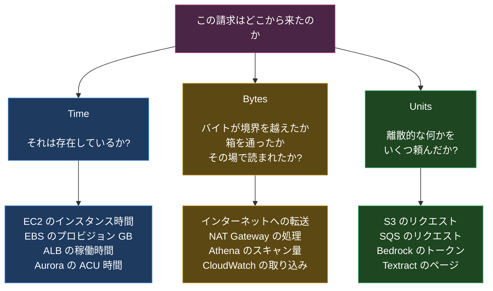
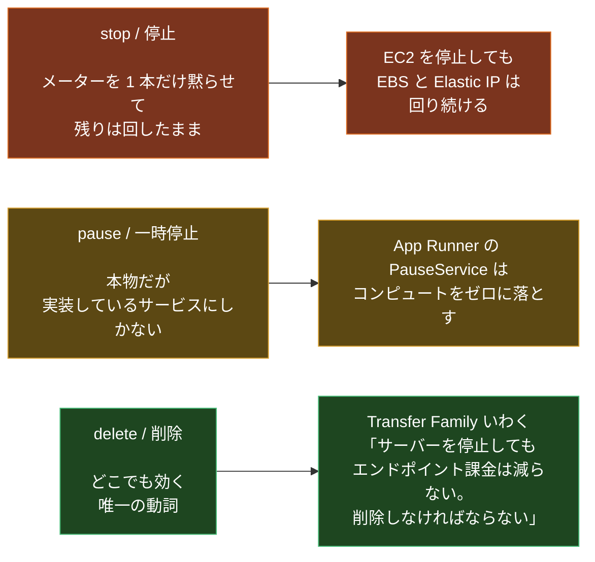
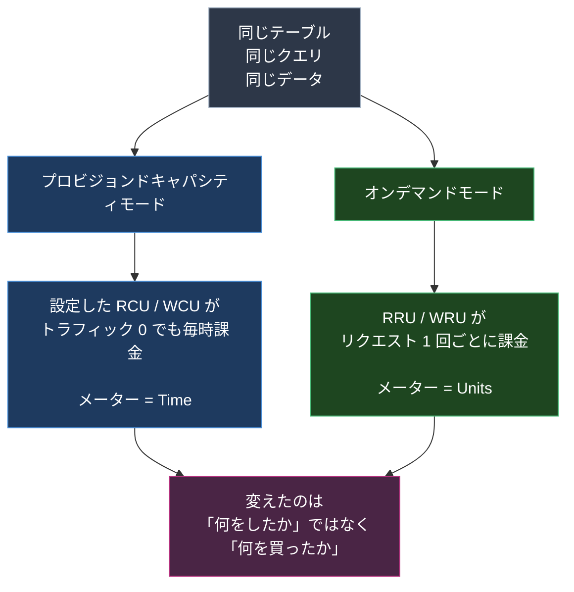
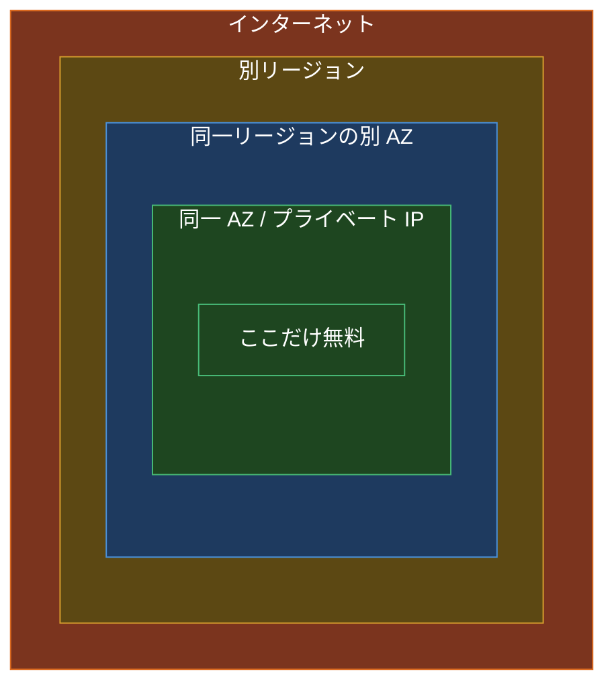
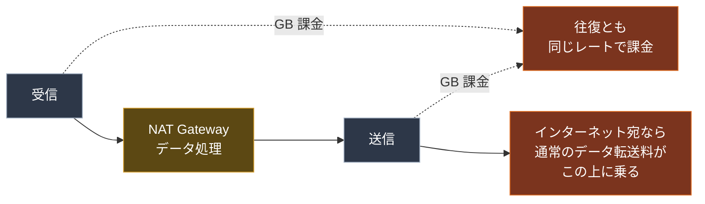
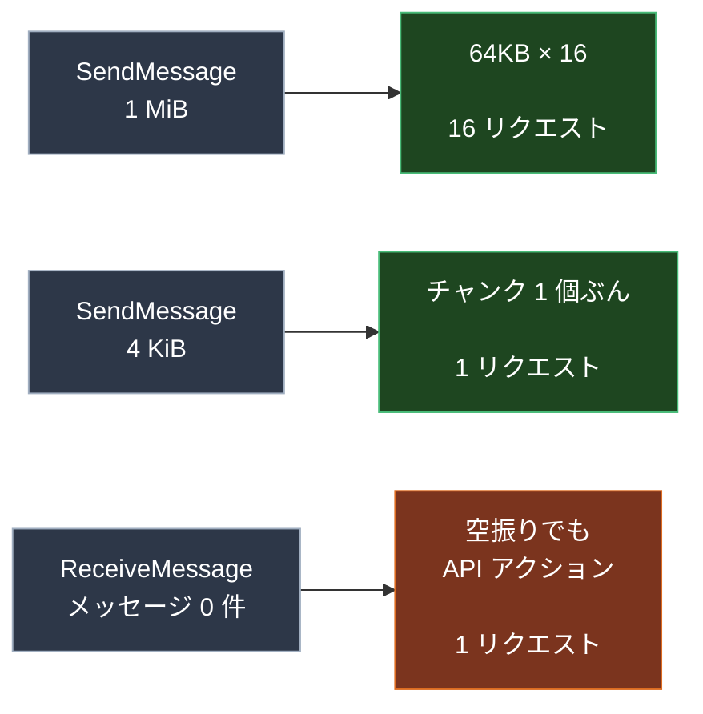
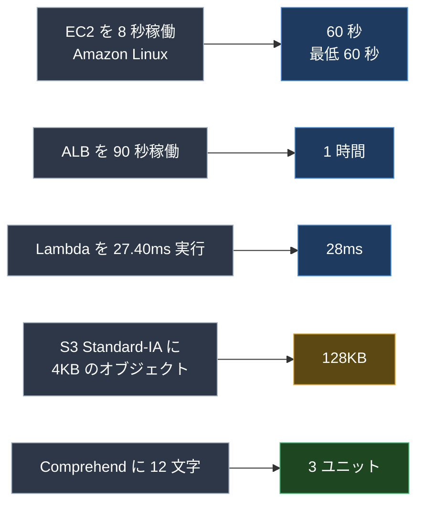

## Introduction

NAT Gateway の料金ページには、こう書いてある。時間あたりの料金と、処理したデータ 1GB あたりの料金。

これを読んで「1GB あたりの料金は外向きの通信にかかるんだな」と思ったなら、間違っている。NAT Gateway のデータ処理料は往復とも同じレートで課金される。「インバウンドは無料」というのは AWS のデータ転送のルールであって、NAT Gateway が自分のデータ処理料に適用しているルールではない。

自分はこれを、請求書を見て初めて知った。そして同じ形の勘違いを、そのあと別のサービスでも何度かやった。

原因は自分の不注意だけではないと思っている。AWS は料金をサービス単位でしか説明しない。だから新しいサービスを触るたびに、そのサービス固有の課金モデルを一から学ぶ気持ちになる。でも実際には、課金モデルは新しくない。同じ仕組みが、サービスごとの語彙で言い換えられているだけだ。

[AWS Bill Explained](https://aws-bill-explained.pages.dev/ja/) は、その言い換えを剥がすために作ったサイト。AWS のサービスを 1 つずつ、AWS 自身のページに当たりながら「どのメーターが回るのか」で分類し直した。今 253 サービス入っている。

この記事は、そのサイトの中身を上から順に説明する。請求書を真剣に読んだことがない人でも読めるように、まず「請求書の 1 行が何でできているか」から始める。

- サイト: <https://aws-bill-explained.pages.dev/ja/>
- リポジトリ: <https://github.com/kanywst/aws-bill-explained>

## 前提: 請求書の 1 行は何でできているか

先に用語を揃える。ここが分かっていないと以降の話が半分くらい滑る。

AWS の請求データを細かく見る場所は 2 つあって、これは別製品だ。

|            | Cost Explorer                        | Cost and Usage Report                  |
| ---------- | ------------------------------------ | -------------------------------------- |
| 置き場所   | コンソールと API                     | 自分の S3 バケットに届く CSV / Parquet |
| 粒度       | 既定で 14 か月分の日次・月次         | 時間単位・日次・月次の行               |
| 深さ       | 決まった次元でのフィルタとグループ化 | AWS が持つ全カラム。リソース ID を含む |
| 使いどころ | 「先週何が上がった?」                | 「どのバケットの、何時の、どの操作?」  |

どちらで見ても 1 行は同じ部品でできている。中心にあるのが usage type という文字列で、これが「どのメーターが回ったか」を表している。

`USW2-BoxUsage:m2.2xlarge` のような文字列は難読化されているわけではなくて、3 つの事実を 1 本に詰めただけだ。並びは固定されている。

```text
USW2 - BoxUsage : m2.2xlarge
 │        │          │
 │        │          └─ バリアント: そのメーターのどの種類か
 │        └──────────── ファミリ:   どのメーターか
 └───────────────────── リージョン: どこで回ったか

読み下すと「オレゴンで m2.2xlarge が動いていた時間」
```

リージョン接頭辞は短縮コードで、リージョン名から機械的には導出できない。全部覚える必要はなくて、引っかかりやすいものだけ知っていればいい。

| 短縮コード | リージョン                                         |
| ---------- | -------------------------------------------------- |
| `USE1`     | `us-east-1` バージニア北部                         |
| `USE2`     | `us-east-2` オハイオ                               |
| `USW2`     | `us-west-2` オレゴン                               |
| `EU`       | `eu-west-1` アイルランド。数字なし。一番古いコード |
| `EUC1`     | `eu-central-1` フランクフルト                      |
| `APN1`     | `ap-northeast-1` 東京                              |
| `APS1`     | `ap-southeast-1` シンガポール                      |
| `APS3`     | `ap-south-1` ムンバイ。`ap-southeast-3` ではない   |
| `APS4`     | `ap-southeast-3` ジャカルタ                        |

ここで一番使える復号ルールを 1 つ。接頭辞がない行は us-east-1 の行だ。バージニア北部だけは接頭辞が省略される仕様なので、`USE1-TimedStorage-ByteHrs` ではなく `TimedStorage-ByteHrs` と出る。素の `Requests-Tier1` を見て「リージョンに依存しないグローバルな何か」と思ってしまいがちだが、実体は一番使っているリージョンが名前を隠しているだけだったりする。

もう 1 つ。usage type と operation は別の列で、答える質問が違う。

- usage type は「どのメーターが回ったか」に答える。レートが紐づいているのはこっち。
- operation は「何をしてそれを回したか」に答える。だいたい API 名の形をしている。`RunInstances`、`PutObject`、`ListBucket`。

1 つの usage type に複数の operation がぶら下がるのが普通で、無関係な経路が同じメーターに合流するから。パブリック IPv4 が分かりやすい。

| operation                   | アドレスを握っているもの            |
| --------------------------- | ----------------------------------- |
| `RunInstances`              | VPC 内の EC2 のパブリック IPv4      |
| `AssociateAddressVPC`       | リソースに紐づいている Elastic IP   |
| `AllocateAddressVPC`        | 何にも紐づいていない遊休 Elastic IP |
| `DescribeNetworkInterfaces` | サービス管理のパブリック IPv4       |
| `CreateVpnConnection`       | Site-to-Site VPN のエンドポイント   |
| `CreateAccelerator`         | Global Accelerator                  |

レートも usage type も全部同じ。なのに打つべき手は 6 通り違う。usage type でグループ化すると「いくらか」が分かって、operation でグループ化すると「誰に話をしに行くか」が分かる。

ここまでが前提。

## 本題: メーターは 3 本しかない

AWS には数百の usage type がある。でも、そのすべてが回しているメーターは 3 本のうちどれかだ。



以降、青が Time、黄が Bytes、緑が Units で統一する。

サービスは、あるメーターを持っているか持っていないかのどちらかでしかない。料金ページを 1 枚ずつ読むかわりに、3 本のうちどれが回るかを聞けばいい。これが分かると、初めて触るサービスの料金ページが「勉強するもの」から「引くもの」に変わる。

この 3 本の名前は 2 回変わっている。どちらもデータセットのほうが名前を否定したので変えた。

| 旧名   | 新名  | 否定したメンバー                                                                                            |
| ------ | ----- | ----------------------------------------------------------------------------------------------------------- |
| Egress | Bytes | CloudWatch の取り込み、Firehose の受信、NAT Gateway の処理。どれも方向を見ずに GB を数える                  |
| Calls  | Units | SQS は 1MiB の呼び出しを 16 リクエストとして課金、Bedrock はトークン、Textract はページ、SES は宛先を数える |

Egress は方向の話であって、メーターの性質ではなかった。「インバウンドは無料」はデータ転送のルールで、バイトを数えるメーター全般のルールではない。冒頭の NAT Gateway はまさにこれで引っかかる。

Calls は「API オペレーションの回数。ペイロードのサイズや方向は関係ない」と定義していたが、その定義をメンバーの過半数が否定した。共通しているのは離散的な何かが数えられることで、リクエストはその一番よくある実例にすぎない。定義ではなかった。

ここから 1 本ずつ見ていく。

## Time は「動いているか」ではなく「存在しているか」

Time メーターが読んでいる条件は 1 つだけ。「それは存在しているか」。「それは何かしているか」ではない。リクエストが 1 件も来ていなくても、メーターにはそれを気にする理由がない。

仕組み自体は不思議でもない。何かをプロビジョンすると、AWS はその容量を確保して他の誰にも売らなくなる。その確保が商品であって、そこに仕事を投げるかどうかは別の行為だからだ。

この「存在しているだけで課金」を、AWS は一度も原則として書いていない。書かれるのは常にサービス単位の脚注で、しかも各サービスの語彙になる。エンドポイント、インデックス、サブネットの関連付け、プロビジョンドモデルユニット、最小 ACU。料金ページを 1 枚ずつ読むと脚注が 40 個集まる。中身は全部同じ脚注だ。

### 実際にいくらになるか

以下は us-east-1 のオンデマンドで、リクエスト 0 件の状態で発生する額。月額は 730 時間で計算した。レートはサイトのデータセットに紐づく AWS の料金ページを 2026 年 8 月上旬に引いたもので、AWS は普通に値付けを変えるので、判断に使うときは必ず自分で引き直してほしい。

| 何を置いたか                                   | リクエスト 0 件での月額 |
| ---------------------------------------------- | ----------------------- |
| Kendra GenAI Enterprise のインデックス         | 約 $234                 |
| Lambda のプロビジョンドコンカレンシー 1GB × 10 | 約 $110                 |
| Aurora Serverless v2 で最小 0.5 ACU            | 約 $44                  |
| デタッチされた gp3 500GB                       | $40                     |
| NAT Gateway                                    | 約 $33                  |
| ALB                                            | 約 $16                  |
| 放置された Elastic IP 1 個                     | 約 $3.65                |

Kendra の一文が一番明快で、AWS 自身が「インデックスを作成すると、そのインデックス内のストレージやクエリのキャパシティを一切使っていなくても課金が発生する」と書いている。止め方は「インデックスを削除する」。

SageMaker のリアルタイムエンドポイントも同じ形で、デベロッパーガイドは警告枠で「エンドポイントはリクエストを処理していなくても課金され続ける。すべての課金を止めるにはエンドポイントを削除しなければならない」と書く。停止ボタンは存在しない。

### stop と pause と delete は同義語ではない

ここが実務で一番効く。人が同義語だと思っていて、AWS が同義語だと思っていない動詞が 3 つある。



一番弱い stop に、みんな最初に手を伸ばす。MediaLive にいたっては遊休そのものに値段を付けていて、ユーザーガイドが「動いていないチャネルごとに idle channel charge がある」と明記している。

もう 1 つ。本当にゼロまで落ちるサービスは、ボタンではなく設定した下限でゼロになっている。Aurora Serverless v2 の `MinCapacity=0`、SageMaker 非同期推論の最小キャパシティ 0、10 分アイドルでゼロに落ちる OpenSearch の NextGen サーバーレスコレクション。同じサーバーレスでも classic のコレクションは 2 OCU が下限で落ちない。オフスイッチを探す前に、下限の設定項目を探すこと。

### 同じサービスの中でメーターが切り替わる

DynamoDB は 1 つのサービスに Time と Units の両方が入っている珍しい例で、メーターがサービスの属性ではなく買い方の属性だということがよく分かる。



見分け方のルールが 1 本出る。時間課金と回数課金を両方載せている料金ページは、モードによってメーターが変わる。

## Bytes は方向ではなく「どの境界を越えたか」

ほとんどの人は境界を 1 枚だと思っている。AWS の中か、インターネットか。想定外の転送課金はこのモデルから生まれる。実際にはリングが 4 枚あって、そのうち 3 枚は越えると金が出る。



リングは入れ子になっていて、それぞれが外向きにだけ関所になっている。内向きに落ちてくる分、つまり届くリクエストや外側から返ってくるレスポンスは、それ単体では課金されない。

| 越えるリング                   | 課金                                                         |
| ------------------------------ | ------------------------------------------------------------ |
| 同一 AZ 内をプライベート IP で | 無料                                                         |
| 同一リージョンの別 AZ へ       | GB 単位。各方向に課金                                        |
| 別リージョンへ                 | 送信元と宛先のペアごとに値付けされる。単一レートは存在しない |
| インターネットへ               | GB 単位。全サービス合算で月 100GB までは無料枠がある         |

設計で狙う価値があるのは一番内側のリングだ。1 枚外に出た瞬間に GB あたりの課金が始まって、しかも往復で発生する。おしゃべりなマルチ AZ のサービスメッシュが、気づいたら請求書の 1 行になっているのはこれが理由。

### 箱を通っただけでも Bytes は回る

ここが Egress という名前を捨てた理由そのもの。リングを越えていなくても、処理する箱を通っただけで GB 課金されるサービスがある。



同じ形なのが CloudWatch Logs の取り込み、Data Firehose の受信、Athena のスキャン量。Athena にいたってはバイトがどこにも動いていない。S3 に置いたまま読んだ量を数えている。だからこのメーターの正しい質問は「外に出たか」ではなく、「バイトが境界を越えたか、箱を通ったか、その場で読まれたか」になる。

| サービス      | 引っかかりどころ                                                                                                                     |
| ------------- | ------------------------------------------------------------------------------------------------------------------------------------ |
| NAT Gateway   | データ処理は往復とも課金。インターネット宛ならデータ転送料が別途上乗せ                                                               |
| Athena        | パーティショニングと列指向フォーマットが全て。キャンセルしたクエリもスキャン済みの分は課金。1 クエリ 10MB が下限                     |
| Data Firehose | Direct PUT は各レコードを 5KB 単位に切り上げ。1KB のレコード 100 万件が 5GB として課金される                                         |
| CloudFront    | AWS オリジンからエッジへのキャッシュ可能データは無料。POST や PUT のボディなどエッジからオリジンへ戻る通信はオリジン転送レートで課金 |
| S3            | Standard-IA は 128KB 未満のオブジェクトを 128KB に切り上げ、かつ 30 日保持。Glacier 系は 90 日、Deep Archive は 180 日               |

## Units は「リクエスト回数」ではない

3 本のうち一番直感が外れるのがこれ。コード側で数えた回数と、請求書側で数えられた個数が一致しない。

原因はチャンクにある。リクエスト単価は「リクエスト 1 回の値段」ではなく「ある大きさまでの仕事の値段」で、その大きさはサイズで決まっている。はみ出した分は、複数回呼んだのと同じ扱いになる。



3 番目が一番揉める。空振りのポーリングもれっきとした API アクションなので、普通に課金される。ロングポーリングにしていない ReceiveMessage のループは、何も返ってこなくても回した回数だけ請求される。

チャンクサイズはサービスごとにバラバラで、推測できる規則性はない。

| サービス                                    | チャンクサイズ                                                        |
| ------------------------------------------- | --------------------------------------------------------------------- |
| SQS                                         | 64KB                                                                  |
| SNS                                         | publish 側で 64KB、配信側でもう一度 64KB                              |
| EventBridge                                 | カスタムイベント 64KB。Schema Discovery だけ 8KB                      |
| API Gateway                                 | HTTP API は 512KB、WebSocket は 32KB。REST API だけ例外でサイズ無関係 |
| AppSync                                     | リアルタイムメッセージ 5KB、送受信の両方向                            |
| IoT Core                                    | 1 メッセージ 5KB                                                      |
| Kinesis Data Streams のプロビジョンドモード | PUT ペイロードユニット 25KB                                           |

ここから実用的なルールが 1 本出る。チャンク境界までの余白は無料で、1 バイトはみ出した瞬間に有料。IoT Core の 4KB publish と 5KB publish は同じ値段で、5.1KB になると倍になる。メッセージフォーマットを自分で握っているなら設計で効く非対称性だし、握っていないなら思い込む前に測るべき非対称性だ。

そして Units が数えるのはリクエストだけではない。

| サービス    | 数えているもの                                                                    |
| ----------- | --------------------------------------------------------------------------------- |
| Bedrock     | 入力トークンと出力トークン。キャッシュの読み書きは別メーター                      |
| Textract    | ページ。Forms と Tables と Queries を同時指定すると合算レートになり、単独より高い |
| SES         | 送信は宛先単位。50 アドレスへの 1 送信は 50 課金                                  |
| Polly       | 文字数                                                                            |
| EventBridge | 64KB チャンク                                                                     |

## 丸めは常に切り上げで、切り下げは 1 つもない

3 本に共通する横断ルールが 1 つある。AWS のメーターは実際の量をそのまま読まない。必ずどこかの単位に量子化された値を読んで、丸めは常に切り上げになる。



最低課金の理由は理不尽ではない。配置やイメージの取得やブートといった固定費を、それより短いかもしれない時間に按分している。ただし、課金対象が小さく短くなるほど、請求額に占める量子の分が実際に使った分を上回っていく。

一番きれいに言い切っているのは EC2 で「1 秒単位で課金され、最低 60 秒」。ただしこれが適用されるのは Amazon Linux、Windows、RHEL、Ubuntu、Ubuntu Pro で、SUSE Linux Enterprise Server は今も時間単位、端数の 1 時間は 1 時間として課金される。同じインスタンスタイプ、同じリージョン、同じ仕事。選んだ AMI だけで、量子が 1 秒になるか 3,600 秒になるかが決まる。

## 253 サービスを分類した結果

ここまでの基準で AWS のサービスを 1 つずつ当てていったのがサイトのデータセット。2026 年 8 月 8 日時点で 253 件、分類の確認日は 8 月 4 日から 8 日の間に収まっている。

| 回るメーター         | 件数 |
| -------------------- | ---- |
| Time のみ            | 46   |
| Time + Bytes         | 46   |
| Time + Units         | 46   |
| Time + Bytes + Units | 44   |
| 無料                 | 30   |
| Units のみ           | 25   |
| Bytes + Units        | 9    |
| Bytes のみ           | 7    |

メーター単位で数え直すと Time が 182 件で 72%、Units が 124 件で 49%、Bytes が 106 件で 42%。Time が圧倒的に多い。請求書の大半が、動かしたものではなく置きっぱなしにしたものでできているという体感と一致する。

そして 30 サービスはメーターを 1 本も回さない。ここを知っているかどうかで設計の自由度が変わるので、全部挙げておく。

IAM、IAM Identity Center、IAM Roles Anywhere、STS、Organizations、Resource Access Manager、License Manager、Control Tower、Trusted Advisor、Well-Architected Tool、Health Dashboard、Resource Explorer、Migration Hub、Application Discovery Service、App2Container、Schema Conversion Tool、Proton、Copilot CLI、CDK、SAM、CLI、Cloud9、CodeConnections、Batch、EC2 Auto Scaling、Elastic Beanstalk、IoT Events、Local Zones、Wavelength、Gateway VPC エンドポイント。

最後の Gateway VPC エンドポイントが実務では一番効く。S3 と DynamoDB へのアクセスをここに通すと NAT Gateway のデータ処理料をまるごと回避できて、エンドポイント自体は無料。冒頭の NAT Gateway に対する一番手っ取り早い答えがこれだった。

## データセットの作り方

このサイトの主張は「各分類は AWS の一次ページで裏付けられている」の 1 点なので、そこが崩れたら残りは全部無価値になる。だから編集ルールをテストではなくドメインモデルのコンストラクタに置いた。テストは既にコミットされた悪いレコードしか捕まえられないが、コンストラクタは悪いレコードを構築させない。

拒否するルールは 2 つ。

1 つ目、本文にドル建てレートを書いたら拒否する。レートは動くしリージョンでも違う。どのメーターが回るかは動かない。

```ts
// A rate in the prose goes stale silently; the meter it turns does not.
if (/\$\d/.test(text)) {
  throw new InvalidServiceError(id, `${field} quotes a dollar rate`);
}
```

2 つ目、出典が AWS 自身のドメイン以外なら拒否する。まとめブログを引いた瞬間に、このサイトは AWS の一次情報を読み直したものではなく、誰かの要約の要約になる。

```ts
export const AWS_SOURCE =
  /^https:\/\/(aws\.amazon\.com|docs\.aws\.amazon\.com|repost\.aws|pricing\.[a-z0-9-]+\.amazonaws\.com)\//;
```

もう 1 つ気をつけたのが「無料」と「分類できていない」の区別。メーターの集合が空なら無料と言いたくなるが、それはパーサーが知らないメーター名を捨てた結果の空かもしれない。無料だと言い切って実は課金される、というのがこのサイトが犯しうる一番高くつく間違いなので、空のメーター集合は `unclassified` フラグが立っていないときにだけ無料になる。分からないものは分からないと表示する。

## 自分の請求書に投げる 3 つの質問

まとめると、実務でやることはこれだけになる。

| 質問                                                             | 見るメーター | やること                                       |
| ---------------------------------------------------------------- | ------------ | ---------------------------------------------- |
| 一週間トラフィックを送らなかったら、それでも請求されるのはどれか | Time         | usage type の `-Hours` と `GB-Mo` を洗う       |
| そのバイトはどのリングを越えて、どの箱を通ったのか               | Bytes        | Gateway VPC エンドポイントで迂回できないか見る |
| コードが数えた回数と請求書が数えた個数は一致しているか           | Units        | ペイロードサイズと空振りポーリングを見る       |

1 つ目のリターンが一番大きい。使っていない開発環境のコピーの正体は、たいてい ALB と NAT Gateway とデタッチされた EBS だ。

見つけるための語彙も置いておく。料金ページや Cost Explorer の内訳で per hour、per month、provisioned、reserved、minimum、floor、capacity、association、endpoint、cluster、subscription を探す。usage type なら `-Hours`、`Usage`、`GB-Mo` で終わっているもの。

## おわりに

AWS の料金が難しく感じるのは、複雑だからではなくて、AWS が全サービスに共通する原則を一度も書かないからだと思っている。原則を書かずにサービス単位の脚注だけを配ると、読む側にはサービスの数だけ課金モデルがあるように見える。実際には脚注は同じ脚注で、メーターは 3 本しかない。

サイトには、この記事に入りきらなかったトピックが 12 本ある。境界、遊休、丸め、階層、コミットメント、ストレージクラス、無料利用枠、リージョン、アカウント単位の課金、請求書の読み方。全部に AWS の出典と確認日が付いている。

- サイト 日本語: <https://aws-bill-explained.pages.dev/ja/>
- サイト English: <https://aws-bill-explained.pages.dev/>
- リポジトリ: <https://github.com/kanywst/aws-bill-explained>

分類が間違っているサービスを見つけたら issue か PR がほしい。編集ルールに合わないレコードはビルドで落ちるので、合っているかどうかは手元で分かる。
