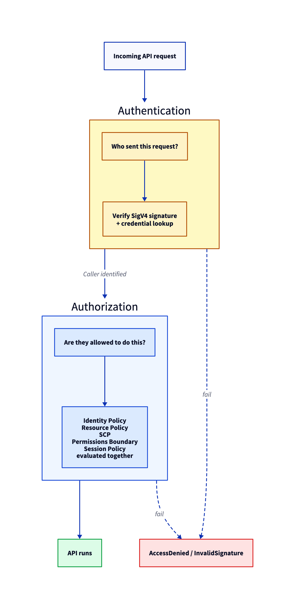
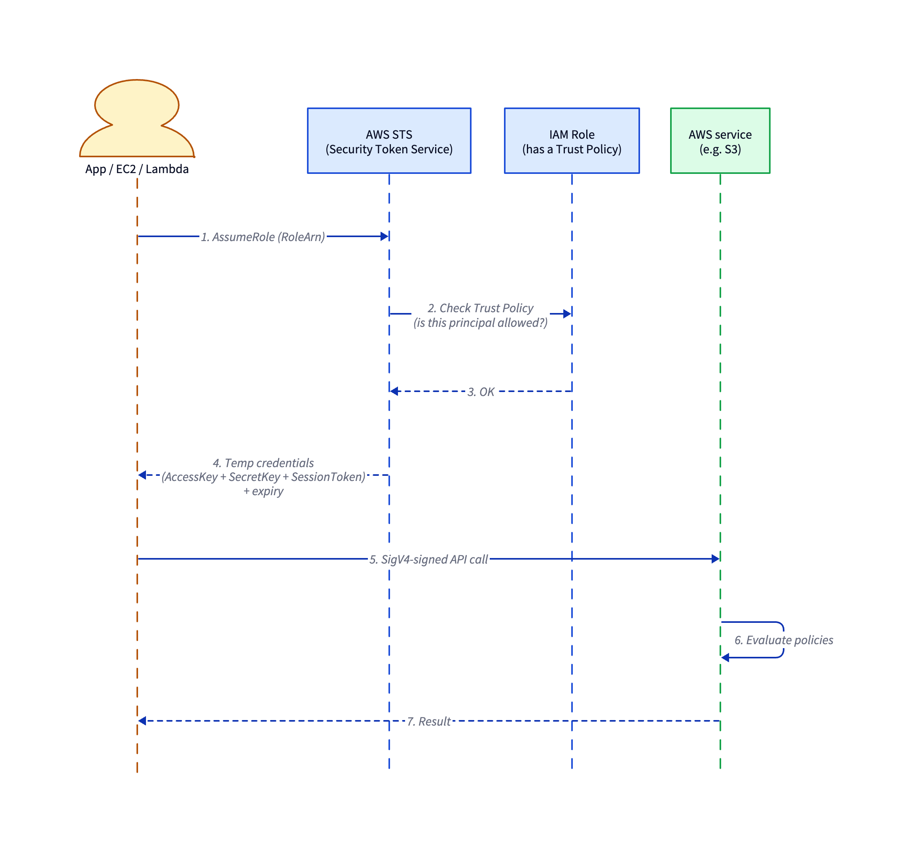
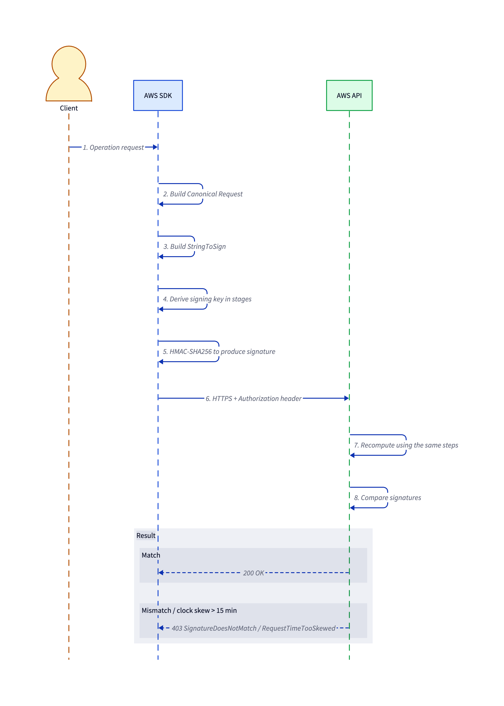
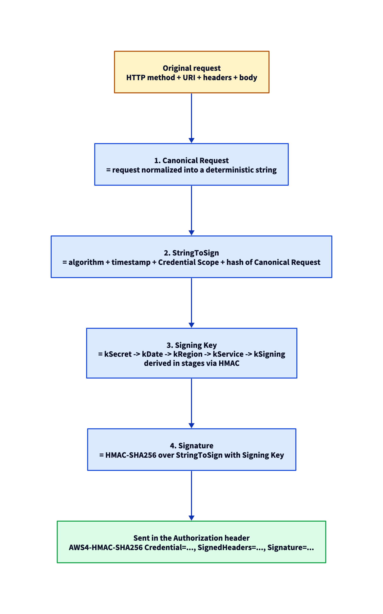
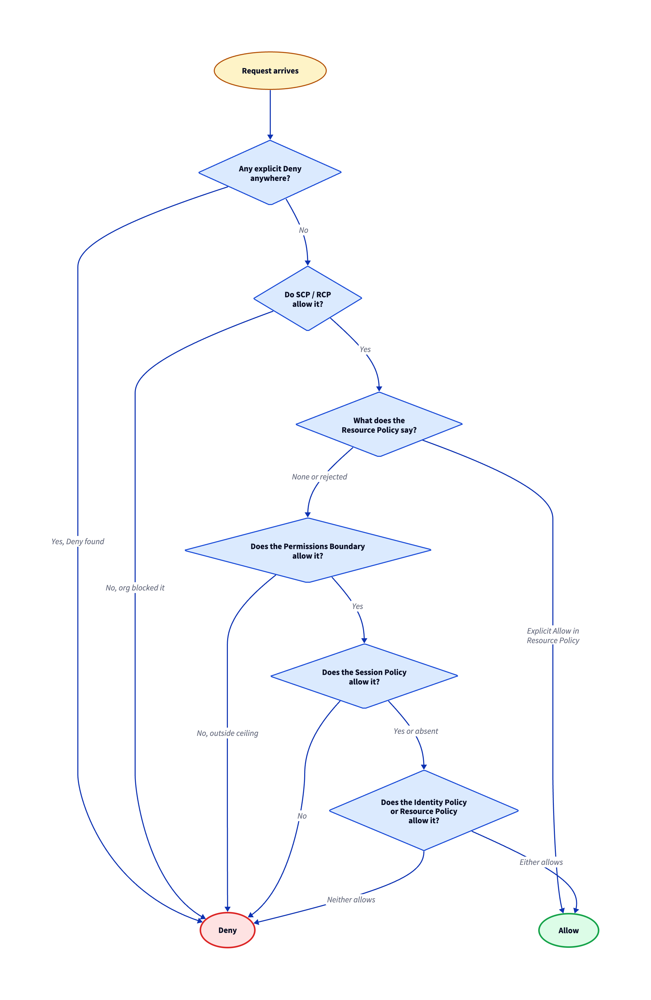
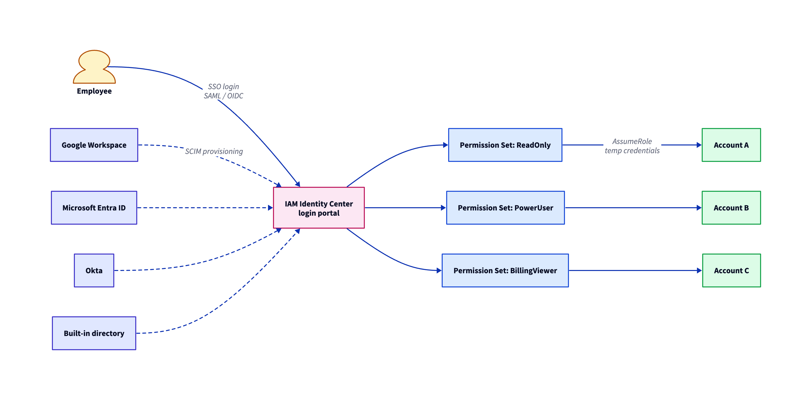

## Introduction

Every action on AWS goes through an HTTPS API, and **IAM (Identity and Access Management) sits in front of every single one of them**.

Once you actually run things on AWS, you notice IAM is where you get stuck. "It says AccessDenied." "The policy says Allow, why is it still rejected?" "I assumed the role but my credentials are still the old ones." The patterns are predictable.

This article takes IAM apart in the order auth happens: authentication, then authorization, then operations.

1. What IAM actually solves: authentication vs authorization
2. Principals: who is making the call
3. SigV4: how AWS verifies the caller is real
4. The six policy types and what each one does
5. The shape of a policy JSON
6. Policy evaluation: why Deny beats Allow
7. IAM Identity Center and short-lived credentials
8. The do / don't list

---

## 1. What IAM Solves: Authentication and Authorization

Start by separating authentication (AuthN) from authorization (AuthZ).



- **Authentication (AuthN)**: pins down "who are you". On AWS, the caller is **whoever owns the credentials that produced this SigV4 signature**.
- **Authorization (AuthZ)**: decides "can they do this". AWS answers it by **combining multiple policies** and evaluating them together.

The rest of the article follows that same order: AuthN first, then AuthZ.

---

## 2. Principals: Who Is Calling AWS

In AWS, the entity making a call is called a **Principal**. Anything that can execute against a resource.

| Type                   | Credential                                        | Authenticated by              | When to use                                                   |
| ---------------------- | ------------------------------------------------- | ----------------------------- | ------------------------------------------------------------- |
| **Root User**          | Account email + password                          | AWS itself                    | Almost never. Billing changes and a few special tasks only.   |
| **IAM User**           | Access key (long-lived) or password               | IAM                           | One per human or system. **Long-lived keys are a leak risk.** |
| **IAM Role**           | Short-lived credentials issued by STS             | AssumeRole                    | The default. Roles over Users in modern setups.               |
| **Federated Identity** | External IdP token, swapped for AWS creds via STS | Identity Center / SAML / OIDC | The modern way humans log in.                                 |

> **An IAM Group is not a principal**. It is just a container for attaching policies to a set of users. The group itself never authenticates and you cannot put it in the `Principal` field of a policy.

### Don't Use the Root User

Root has **god-mode on the whole account**. Only Root can change billing or close the account, and that is exactly why everything else should not be done as Root.

The AWS-recommended setup:

1. After creating the account, **set up MFA on Root immediately** (basically required now).
2. **Never create an access key for Root.**
3. For day-to-day work, log in through IAM Identity Center or assume an IAM Role.
4. Lock the Root credentials in a safe.

For MFA, **TOTP** (the 6-digit code from Google Authenticator, 1Password, etc.) works, but AWS recommends **FIDO2 / WebAuthn** passkeys or hardware keys like a YubiKey, because they resist phishing. AWS also recommends **registering at least two MFA methods on Root** so you don't get locked out if one is lost.

### Use IAM Roles Instead of IAM Users

The access keys on an IAM User (the ones that start with `AKIA...`) are **long-lived**. Once leaked, they stay valid until you rotate them. The stream of "committed an access key to GitHub, got abused within hours" stories isn't slowing down.

IAM Roles solve this by **handing out short-lived credentials via AssumeRole** that expire after 1 hour by default (12 hours max).

Three pieces to know before reading the diagram:

- **STS (Security Token Service)**: the AWS service that issues temporary credentials. `sts:AssumeRole` and friends call into this.
- **Trust Policy**: a policy attached to a Role that says **"who is allowed to assume this role"** (e.g. "only this specific IAM User", "only this GitHub Actions repo").
- **Temporary credentials**: a triple of `AccessKeyId`, `SecretAccessKey`, and `SessionToken`, with an expiry.



---

## 3. SigV4: How AWS Verifies a Request Is Real

Once we know who the principal is, the next question is whether they actually signed the request. That is what **SigV4 (Signature Version 4)** does.

A typical REST API sends something like `Authorization: Bearer <token>` on every call. AWS does not. It **never sends the Secret Key on the wire**. It sends a signature computed from the Secret Key, every time.

### The Big Picture



### What the 4 Steps Actually Do



Three things to internalize:

1. **The Secret Key never leaves your machine.** Only an HMAC derived from it goes on the wire.
2. **Clock skew will kill you.** The timestamp is baked into the signature scope. **If your laptop's clock is off, you get InvalidSignature immediately.** AWS tolerates roughly 15 minutes of skew.
3. **Signatures have a short validity window.** To shrink the replay window, API calls only accept signatures from the last 15 minutes.

In practice the SDK and CLI do all of this for you, so you almost never compute it by hand. But when you see "calling another region from inside Lambda fails with a signature error" or "every S3 call from this Docker container returns 403", the answer is almost always clock sync.

---

## 4. The Six Policy Types and Who Does What

Now for authorization. The reason AWS authorization feels complicated is that **six different policy types are evaluated together**.

| Policy                            | Attached to                             | Role                                           | How often used |
| --------------------------------- | --------------------------------------- | ---------------------------------------------- | -------------- |
| **Identity Policy**               | User / Group / Role                     | "What can this principal do?"                  | ★★★            |
| **Resource Policy**               | S3 bucket, KMS Key, SNS, etc.           | "Who can touch this resource?"                 | ★★★            |
| **SCP (Service Control Policy)**  | OU / Account (Organizations)            | Per-account ceiling (a guardrail)              | ★★             |
| **Permissions Boundary**          | User / Role                             | Per-principal ceiling                          | ★              |
| **Session Policy**                | Args to AssumeRole / GetFederationToken | Extra narrowing that only applies in a session | ★              |
| **RCP (Resource Control Policy)** | Organizations                           | Org-wide guardrail on resources                | Newer          |

The trick is to keep "ceiling" and "permission" separate in your head. **Identity Policy is the "what you may do" list. SCP and Permissions Boundary are the "the most you will ever be allowed to do" list.** No Allow anywhere means no access; a Deny in the ceiling kills it for sure.

---

## 5. The Shape of a Policy JSON

Every policy uses the same JSON structure, with five elements.

```json
{
  "Version": "2012-10-17",
  "Statement": [
    {
      "Sid": "AllowReadOnlyMyBucket",
      "Effect": "Allow",
      "Action": ["s3:GetObject", "s3:ListBucket"],
      "Resource": [
        "arn:aws:s3:::my-bucket",
        "arn:aws:s3:::my-bucket/*"
      ],
      "Condition": {
        "IpAddress": {
          "aws:SourceIp": ["203.0.113.0/24"]
        },
        "Bool": {
          "aws:MultiFactorAuthPresent": "true"
        }
      }
    }
  ]
}
```

What to focus on:

- **Effect**: only `Allow` or `Deny`. Default is `Deny` (if nothing says Allow, you get denied).
- **Action**: `s3:GetObject` style, in `<service prefix>:<API name>` form. Wildcards (`s3:*`, `s3:Get*`) work.
- **Resource**: the target, expressed as an **ARN (Amazon Resource Name)**, e.g. `arn:aws:s3:::my-bucket/*`.
- **Principal**: "who". Not needed in an Identity Policy because the attachment target is implied. **Required in a Resource Policy.**
- **Condition**: extra constraints like IP, MFA, tags, time, VPC endpoint, and so on.

### Condition Is Where Real IAM Lives

Once you start writing IAM seriously, you live inside `Condition`. The ones I reach for most:

| Key                          | What it does              | Example                               |
| ---------------------------- | ------------------------- | ------------------------------------- |
| `aws:SourceIp`               | Source IP                 | Allow only from the office IP block   |
| `aws:MultiFactorAuthPresent` | Did the caller use MFA?   | Require MFA                           |
| `aws:PrincipalTag/Team`      | Tag on the principal      | If Team = ml, allow only ml-bucket    |
| `s3:prefix`                  | Prefix being listed in S3 | A user can only `ls` their own folder |
| `aws:RequestedRegion`        | Target region             | Deny anything outside ap-northeast-1  |
| `aws:SecureTransport`        | HTTPS?                    | Block plaintext HTTP access to S3     |

---

## 6. Policy Evaluation: Deny Beats Allow

AWS evaluates the six policy types **in this order** to reach a final decision.



(Note: this is the simplified, same-account version. Cross-account access has extra rules, e.g. the Resource Policy Allow is required, but the picture above is enough to grasp the principle.)

### Three Iron Rules

1. **Default is Deny.** If nothing says Allow, the answer is no.
2. **An explicit Deny overrides an explicit Allow.** A single Deny anywhere ends the discussion.
3. **You need at least one Allow.** No Allow = denied.

Without these three, you cannot debug "the policy says Allow but I still get AccessDenied".

### Common "Why Am I Denied?" Patterns

| Symptom                                | Cause                                             |
| -------------------------------------- | ------------------------------------------------- |
| Identity Policy says Allow, still Deny | An SCP is blocking that service at the org level  |
| Can't access your own bucket           | The bucket policy names a different Principal     |
| Lost permissions after AssumeRole      | A Session Policy was passed as an argument        |
| Only some actions get Deny'd           | A Permissions Boundary is narrowing via wildcards |
| Denied in only one region              | An SCP or IAM Policy has a Region condition       |

### Why SCPs Are Powerful

An SCP (Service Control Policy) is an AWS Organizations feature that **caps what an OU or account is allowed to do**. Attach this SCP to a Sandbox OU and accounts under it cannot launch EC2 outside Tokyo.

```json
{
  "Version": "2012-10-17",
  "Statement": [
    {
      "Sid": "DenyOutsideTokyo",
      "Effect": "Deny",
      "Action": "ec2:RunInstances",
      "Resource": "*",
      "Condition": {
        "StringNotEquals": {
          "aws:RequestedRegion": "ap-northeast-1"
        }
      }
    }
  ]
}
```

Even if an IAM policy inside the account allows RunInstances in every region, **the SCP Deny wins**. That is what a guardrail buys you.

---

## 7. IAM Identity Center and Short-Lived Credentials

The era of humans logging in as IAM Users is over. The standard now is **IAM Identity Center** (formerly AWS SSO).



The points:

- The user logs in **once via the company IdP (Google / Okta / Entra)**, and **AssumeRole gives them short-lived credentials** into every AWS account under it.
- The contents of the role are defined as a **Permission Set**. Build a few of them ("ReadOnly is this, dev is that") and assign per user × account.
- **No access keys are ever issued**, so leak risk goes away structurally.
- `aws sso login` covers the CLI side, dropping a temp token in `~/.aws/sso/cache`.

### For EC2 / Lambda / GitHub Actions

Non-human callers (apps, CI) should also **not use long-lived keys**. The current playbook:

| Runtime             | Authentication                                        |
| ------------------- | ----------------------------------------------------- |
| EC2                 | Instance Profile (attach a Role directly)             |
| Lambda              | Execution Role                                        |
| ECS / EKS           | Task Role / IRSA / Pod Identity                       |
| GitHub Actions      | OIDC, then AssumeRoleWithWebIdentity into an AWS Role |
| GitLab CI           | Same as above                                         |
| External Kubernetes | IAM Roles for Service Accounts (IRSA)                 |

**GitHub Actions OIDC** is the strongest of the bunch: you can scope AssumeRole by repository or branch. Long-lived keys in GitHub Secrets become entirely unnecessary.

---

## 8. The Do / Don't List

Tying the theory back to practice.

**❌ Don't**

- Create an access key for the Root user
- Do day-to-day work as Root
- Commit IAM User long-lived keys to GitHub
- Hand out wildcards like `s3:*`
- Use `Principal: *` in a Resource Policy without a Condition
- Mix production and staging in the same account
- Skip MFA entirely

**✅ Do**

- Put MFA on Root and lock the credentials away
- Move humans onto SSO via IAM Identity Center
- Have GitHub Actions assume a Role via OIDC
- Cap developer permissions with a Permissions Boundary
- Set an org-wide guardrail with an SCP
- Apply least privilege and audit with IAM Access Analyzer
- Turn CloudTrail on in every account

Three of these are worth calling out:

1. **Treat long-lived access keys as something you will eliminate in the next few years.** Roles + STS + Identity Center can cover the same ground.
2. **Be suspicious of `*`.** Action `*`, Resource `*`, Principal `*`, no Condition: that combination is how incidents happen.
3. **CloudTrail and IAM Access Analyzer must be on.** If you can't reconstruct "who did what" after the fact, an incident becomes unsolvable.

---

## 9. Wrap-Up

- IAM handles both authentication (who?) and authorization (allowed to?).
- Principals come in four kinds: Root, User, Role, Federated. Groups are containers, not principals.
- AuthN uses SigV4: the Secret Key never leaves you, clock drift is fatal, signatures live for 15 minutes.
- There are six policy types (Identity / Resource / SCP / Permissions Boundary / Session / RCP) and they are all combined.
- Evaluation rules: default Deny, explicit Deny beats explicit Allow, you need at least one Allow.
- Modern best practice is Identity Center + Permission Sets + OIDC-based role assumption.
- Long-lived keys are game over once leaked. Replace them with Role + STS.

## References

- [Policy evaluation logic: AWS IAM](https://docs.aws.amazon.com/IAM/latest/UserGuide/reference_policies_evaluation-logic.html)
- [The difference between explicit and implicit denies](https://docs.aws.amazon.com/IAM/latest/UserGuide/reference_policies_evaluation-logic_AccessPolicyLanguage_Interplay.html)
- [AWS Signature Version 4 for API requests](https://docs.aws.amazon.com/IAM/latest/UserGuide/reference_sigv.html)
- [Troubleshoot Signature Version 4 signing](https://docs.aws.amazon.com/IAM/latest/UserGuide/reference_sigv-troubleshooting.html)
- [Root user best practices for your AWS account](https://docs.aws.amazon.com/IAM/latest/UserGuide/root-user-best-practices.html)
- [Service control policies (SCPs)](https://docs.aws.amazon.com/organizations/latest/userguide/orgs_manage_policies_scps.html)
- [Security best practices in IAM](https://docs.aws.amazon.com/IAM/latest/UserGuide/best-practices.html)
