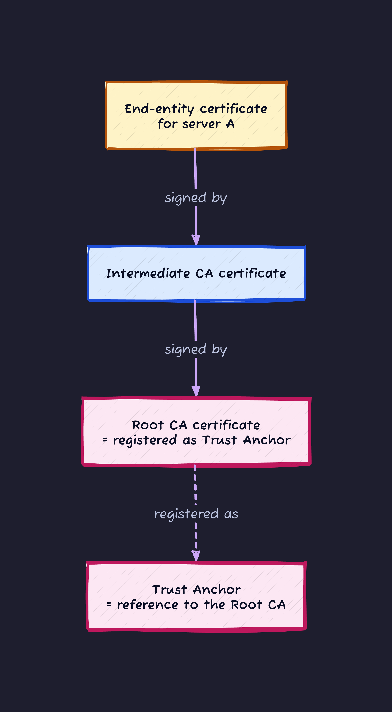
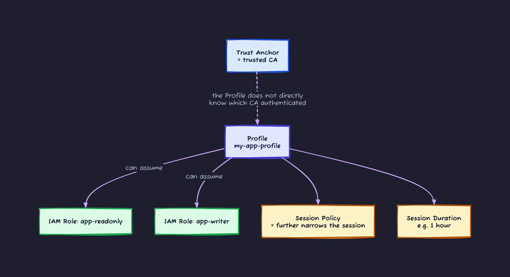

## Introduction

"I want to drop a file from an on-prem server into S3."
"I want to read DynamoDB from a Kubernetes pod sitting in my datacenter."
"I want to pull a secret from AWS Secrets Manager from an app in someone else's cloud."

Do this the naive way and you end up here:

1. Create an IAM User
2. Issue an access key (the `AKIA...` kind)
3. Paste it into `~/.aws/credentials`, env vars, or some on-prem Secrets Manager
4. Use it forever

This is where most production incidents start today. Long-lived access keys leak and stay leaked, rotation gets forgotten, and there is no record of who copied them where or when.

**AWS IAM Roles Anywhere** is the mechanism that hands IAM Role temporary credentials to **workloads outside AWS** without distributing any long-lived key. The key material is replaced by an **X.509 certificate**.

This article goes deep on Roles Anywhere.

---

## 1. Vocabulary you need first

Roles Anywhere sits on top of two things: IAM Role and PKI (the certificate world). If either is fuzzy you will get lost fast. The bare minimum below.

### IAM Role / STS / temporary credentials

| Term | What to remember |
| --- | --- |
| **IAM Role** | A box that says "who is allowed to take this permission on". It has two parts: a **Trust Policy** (who can assume it) and a **Permission Policy** (what the assumer can do) |
| **AssumeRole** | The act of taking on a Role. When it succeeds, you immediately get back a set of **temporary credentials** |
| **STS (Security Token Service)** | The AWS service that issues temporary credentials. The `sts:AssumeRole` family of APIs lands here |
| **Temporary credentials** | A three-piece set: `AccessKeyId` + `SecretAccessKey` + `SessionToken`. Default lifetime 1 hour, up to 12 hours via the Role config |

### X.509 certificate / CA / PKI

| Term | What to remember |
| --- | --- |
| **X.509 certificate** | A digital document where a CA signs "this public key belongs to this entity". The cert sitting in front of any HTTPS site is the same shape |
| **CA (Certificate Authority)** | The party that issues certificates. Trusting a CA's certificate means trusting every certificate it has ever issued |
| **Private CA** | A CA for closed environments such as inside a company. AWS sells a managed version called **AWS Private CA (formerly ACM PCA)** |
| **PKI (Public Key Infrastructure)** | The whole ecosystem of issuing, distributing, and revoking certificates |
| **Private key** | The key paired with the certificate. Digital signatures are made with it. **Never put it on the network** |

Roughly: Roles Anywhere is the mechanism that **makes `AssumeRole` callable using an X.509 certificate's private-key signature, instead of an IAM User's long-term key**.

---

## 2. The big picture and the three actors

Roles Anywhere has three specific concepts: **Trust Anchor / Profile / Role**. Pin them down visually first.


The three actors and their jobs:

| Concept | What it is | What it holds |
| --- | --- | --- |
| **Trust Anchor** | The declaration "I (this AWS account) trust this CA" | A reference to an AWS Private CA, or the PEM of an external CA |
| **Profile** | The declaration "for callers authenticated via this CA, which Roles can they use and with what session limits" | A list of allowed Role ARNs + session duration + optional Session Policy |
| **IAM Role** | The permission body that activates once assumed | Trust Policy (allowing the Roles Anywhere service principal) + Permission Policy |

Walking through each in order.

---

## 3. Trust Anchor: the root of trust

A Trust Anchor is the declaration **"this AWS account trusts this CA"**. When Roles Anywhere sees a certificate, it walks the chain to confirm the certificate was issued by this CA.



There are two ways to create a Trust Anchor.

### A. Use AWS Private CA (PCA) as the source

AWS Private CA (formerly ACM PCA) is AWS's managed paid CA. When creating a Trust Anchor you say "use this PCA", and every certificate issued by that PCA is trusted automatically.

PCA has two modes (Tokyo region reference pricing, varies by region):

- **General Purpose Mode**: **400 USD/month** plus per-certificate issuance fees. Full features (CRL publication, long-lived certs, freely issued via API). Capable as a replacement for an internal PKI
- **Short-Lived Certificate Mode**: **50 USD/month** plus per-certificate issuance fees. Only for certificates with **lifetime under 7 days**, no CRL publication. Optimised for the Roles Anywhere "issue short-lived certs frequently" usage pattern

Upside: issuance, revocation, and renewal automation lean on AWS. The AWS Private CA Issuer for `cert-manager` lets Kubernetes consume it.

Downside: **either mode bills a flat monthly fee just for having a CA stood up**. For verification or dev work, an external CA is cheaper.

### B. Upload an existing external CA

Upload a CA certificate in PEM and register it as a Trust Anchor. If you already have an internal PKI (HashiCorp Vault, smallstep `step-ca`, an OpenSSL-based homemade CA, etc.), the extra cost is zero.

```bash
aws rolesanywhere create-trust-anchor \
    --name "my-internal-ca" \
    --source '{
        "sourceType": "CERTIFICATE_BUNDLE",
        "sourceData": {
            "x509CertificateData": "-----BEGIN CERTIFICATE-----\nMIID...\n-----END CERTIFICATE-----"
        }
    }' \
    --enabled
```

With an external CA you own **revocation management (CRL updates)**. Covered in §8.

---

## 4. Profile: which Role, with what guardrails

A Profile is **"the usage rules for callers authenticated against a given Trust Anchor"**.



What goes into a Profile:

- **roleArns**: list of IAM Role ARNs that may be assumed
- **durationSeconds**: maximum session lifetime (900 to 43200 seconds, i.e. 15 minutes to 12 hours, capped by the Role's `MaxSessionDuration`)
- **sessionPolicy / managedPolicyArns**: extra policy that applies only to the session. "The Role's Permission Policy is X, but calls coming through this Profile are further narrowed to Y"

A Session Policy intersects with the Role's Permission Policy via **AND**. Even if the Role allows `s3:*`, narrowing the Session Policy to `s3:GetObject` means only `s3:GetObject` is effectively permitted.

---

## 5. The Role's Trust Policy: who is allowed to call

The Role itself is created the usual way, but its **Trust Policy** (the policy saying "who can Assume this Role") has a Roles Anywhere-specific shape:

```json
{
  "Version": "2012-10-17",
  "Statement": [
    {
      "Effect": "Allow",
      "Principal": {
        "Service": "rolesanywhere.amazonaws.com"
      },
      "Action": [
        "sts:AssumeRole",
        "sts:TagSession",
        "sts:SetSourceIdentity"
      ],
      "Condition": {
        "StringEquals": {
          "aws:PrincipalTag/x509Subject/CN": "server-a.example.com"
        },
        "ArnEquals": {
          "aws:SourceArn": "arn:aws:rolesanywhere:ap-northeast-1:123456789012:trust-anchor/abc-..."
        }
      }
    }
  ]
}
```

Key points:

- **The service principal is `rolesanywhere.amazonaws.com`**. Without this entry, AssumeRole via the Roles Anywhere CreateSession path will not work
- **Allowing `sts:TagSession`** lets the certificate's Subject / SAN / Issuer be injected as session tags (more on this below)
- Conditions like **`aws:PrincipalTag/x509Subject/CN`** let you **narrow down further based on the certificate contents**. Fine-grained control like "only certificates with CN `server-a.example.com` may assume this" is possible
- **`aws:SourceArn`** pins the call to a specific Trust Anchor, so a request coming from a Trust Anchor you did not expect is denied

### Session tags auto-populated from the certificate

A session created through CreateSession + AssumeRole automatically carries certificate attributes as tags. The common ones:

| Tag key | Content |
| --- | --- |
| `aws:PrincipalTag/x509Subject/CN` | Common Name of the certificate Subject |
| `aws:PrincipalTag/x509SAN/DNS` | DNS name in the Subject Alternative Name (SAN) |
| `aws:PrincipalTag/x509SAN/URI` | URI in SAN (e.g. a SPIFFE ID like `spiffe://example.com/ns/prod/sa/app`) |
| `aws:PrincipalTag/x509Issuer/CN` | CN of the issuing CA |
| `aws:PrincipalTag/x509Serial` | Certificate serial number |

A small bit of supplementary vocabulary:

- **SAN (Subject Alternative Name)**: an X.509 extension field that holds additional identifiers beyond Common Name, including multiple hostnames, IPs, or URIs
- **SPIFFE ID**: a URI-format workload identifier defined by the SPIFFE spec (`spiffe://...`). If your internal identity platform uses SPIFFE, dropping a SPIFFE ID into the SAN URI lets the AWS side reference it directly in a Condition

The upshot: **the Role's Permission Policy can also use `aws:PrincipalTag/x509Subject/CN` in its Conditions**. Patterns like "the `server-a.example.com` certificate can only write under the `prefix=server-a/*` portion of S3" become possible. That is **ABAC (Attribute Based Access Control)**: instead of carving permissions up by Role (RBAC-style), **principal attributes (tags) dynamically tighten what is allowed**.

---

## 6. The CreateSession flow

Tracing what actually happens from the client's first call until temporary credentials are in hand.


Key points:

- **A "SigV4 X.509 variant" sits on the SigV4 frame but signs with an X.509 private key**. Normal AWS APIs sign with `AWS4-HMAC-SHA256` (symmetric HMAC using the access key). `CreateSession` uses one of **`AWS4-X509-RSA-SHA256` / `AWS4-X509-ECDSA-SHA256` / `AWS4-X509-MLDSA`** (the last one is post-quantum, PQC-capable) depending on the key type. The Canonical Request construction is the same as SigV4. Only the final step is an asymmetric X.509 signature instead of HMAC
- **The private key never leaves the credential helper**. It does not go on the network
- The credentials handed back are **plain IAM temporary credentials**. The SDK sees nothing unusual. Subsequent S3 / DynamoDB calls go out as normal SigV4 (HMAC)

---

## 7. What is inside the credential helper

Hand-rolling the `CreateSession` signing on the client side is not realistic, so AWS ships an official binary called **`aws_signing_helper`** (repo: `aws/rolesanywhere-credential-helper`). That binary is the credential helper.

`aws_signing_helper` plugs into the AWS CLI / SDK `credential_process` spec. Drop this into `~/.aws/config` and both the CLI and any SDK transparently fetch credentials through Roles Anywhere:

```ini
[profile myapp]
credential_process = /usr/local/bin/aws_signing_helper credential-process \
    --certificate /etc/pki/server.pem \
    --private-key /etc/pki/server.key \
    --trust-anchor-arn arn:aws:rolesanywhere:ap-northeast-1:123456789012:trust-anchor/xxxx \
    --profile-arn       arn:aws:rolesanywhere:ap-northeast-1:123456789012:profile/yyyy \
    --role-arn          arn:aws:iam::123456789012:role/MyAppRole
```

A call like `aws s3 ls --profile myapp` triggers `credential_process`, which runs `aws_signing_helper`, which returns the JSON. The AWS CLI / SDK takes care of **automatic credential refresh**. No manual refresh needed.

### Where the private key lives

The choice of private-key storage sets the ceiling on your Roles Anywhere operational quality. `aws_signing_helper` supports the following backends. Leak resistance rises as you go down the table.

| Storage | Properties | Leak resistance |
| --- | --- | --- |
| **File** (`/etc/pki/server.key` etc.) | Easiest. Anyone with read access can `cat` it | Low |
| **OS keystore** (Windows Certificate Store / macOS Keychain) | Protected by OS access control | Medium |
| **PKCS#11 module** (HSM / smartcard) | Key stays inside the HSM, only signing operations are delegated | High |
| **TPM 2.0** (secure chip on the motherboard) | Key sealed into hardware, non-exportable | High |

In high-security environments, sealing the key into PKCS#11 (HSM) or TPM 2.0 so that **the key cannot be extracted at all** is the right move. `aws_signing_helper` exposes flags like `--cert-selector` and `--tpm-key-handle` to wire into these backends.

---

## 8. Revoking a certificate

You will eventually need to kill a compromised server's certificate immediately. Roles Anywhere supports **CRL (Certificate Revocation List)**.

### Importing a CRL

Generate a revocation list on the CA side and register it in Roles Anywhere as PEM.

```bash
aws rolesanywhere import-crl \
    --name "my-ca-crl" \
    --crl-data file://crl.pem \
    --trust-anchor-arn arn:aws:rolesanywhere:ap-northeast-1:123456789012:trust-anchor/xxxx \
    --enabled
```

Once registered, Roles Anywhere checks the CRL on every `CreateSession`. Calls from revoked certificates are rejected.

### Auto-integration with AWS Private CA

When the Trust Anchor source is PCA, calling `revoke-certificate` on the PCA causes the PCA to publish a CRL into S3 **within about 30 minutes**. The standard pattern is to catch that with Lambda and feed it to the `ImportCrl` API.


### Temporarily disabling the CRL check

When you need to disable it during incident response, `DisableCrl` flips the check off and `EnableCrl` turns it back on. In normal production, leave it on.

---

## 9. When it fits, and when it does not

Roles Anywhere is powerful but not for every case. The decision flow:


Takeaways:

- **Workloads running inside AWS do not need Roles Anywhere**. Instance Profile / Execution Role / Pod Identity are the natural choice
- **If your CI can speak OIDC, prefer OIDC**. GitHub Actions / GitLab CI / etc. emit OIDC officially. Roles Anywhere is unnecessary
- **If you cannot emit OIDC, you already have an X.509-based PKI, and the server is fully on-prem**, that is where Roles Anywhere shines

### Where Roles Anywhere is a poor fit

- "We do not have an internal PKI yet" cases: standing up a CA before introducing Roles Anywhere is much more work than Roles Anywhere itself. If there is an OIDC path, take that
- "Thousands of clients, each with its own certificate, CRL updated daily" cases: at this scale CRL propagation lag and other factors need real design work
- "Calling from inside a VPC" cases: anything inside a VPC is already inside AWS, so attaching a Role the normal way is enough

---

## 10. Pricing and limits

### Pricing

- **The IAM Roles Anywhere service itself is free**. No per-CreateSession request fees
- **AWS Private CA is the only billed component**. **400 USD/month** for General Purpose, **50 USD/month** for Short-Lived Certificate, plus per-certificate issuance fees
- Using an external CA (HashiCorp Vault / step-ca / homemade PKI etc.) avoids the PCA bill (you pay in operational effort instead)

### Main limits (from official Service Quotas, per Region)

| Item | Default | Increase request |
| --- | --- | --- |
| Trust Anchors per account | 50 | Allowed |
| Profiles per account | 250 | Allowed |
| Roles per Profile | 250 | **Not allowed** (hard limit) |
| Registered certificates per Trust Anchor | 2 | **Not allowed** (two slots, for rotation) |
| CRLs per Trust Anchor | 2 | **Not allowed** |
| **CreateSession rate** | **10 req/sec** | Allowed |
| Session lifetime | 15 minutes to 12 hours | Within the Role's `MaxSessionDuration` |

Note that **`CreateSession` is 10 req/sec**. A design that pulls short-lived credentials in volume will hit this per-Region rate. The basic pattern is to **cache credentials on the client side** and refresh just before expiration. `aws_signing_helper`'s `credential_process` does this automatically.

---

## 11. Don'ts and Do's

**❌ Don't**

- Drop the private key as a plaintext file readable by anyone
- Reuse one certificate across multiple servers (you lose the ability to tell which one leaked)
- Write a Trust Policy that trusts `rolesanywhere.amazonaws.com` alone, with no `aws:SourceArn` or certificate Conditions
- Skip CRL operations entirely (i.e. no way to invalidate a cert on compromise)
- Issue certificates with absurdly long lifetimes (e.g. 10 years)

**✅ Do**

- Seal the private key into **TPM 2.0 / HSM (PKCS#11) / OS keystore**
- One server, one certificate. Put a hostname or SPIFFE-ID-equivalent identifier in the Subject / SAN
- Issue **short-lived certificates** (e.g. 24 hours to a few days) with **automatic renewal**. `cert-manager` and `step-ca`'s auto-renew machinery is the standard pattern
- Put both `aws:SourceArn` (Trust Anchor) and `aws:PrincipalTag/x509Subject/CN` into the Role's Trust Policy
- Automate CRL ingestion and keep `DisableCrl` ready as an operations break-glass
- Use session tags (`aws:PrincipalTag/x509...`) to drive ABAC in the Role's Permission Policy

---

## 12. Wrap-up

- IAM Roles Anywhere hands IAM Role temporary credentials to workloads outside AWS without distributing long-lived keys
- It uses X.509 certificates as the key material, with the issuing CA registered as a Trust Anchor
- Three actors: Trust Anchor (the trusted CA) / Profile (which Role can be used) / Role (the actual permission)
- CreateSession is not plain SigV4. It uses a distinct flow signed with the certificate's private key, and the private key never goes on the network
- The official `aws_signing_helper` ships as a `credential_process` provider, so existing CLI and SDK code works as-is
- Seal the private key in TPM / HSM / OS keystore. A plain file on disk is an incident waiting to happen
- Revocation goes through CRL via `ImportCrl`. PCA-backed setups can auto-integrate via S3
- If you are inside AWS, Roles Anywhere is unnecessary. If CI can speak OIDC, OIDC wins. On-prem, multi-cloud, and existing-PKI worlds are where it actually fits
- The service itself is free. Only PCA costs money

## References

- [What is AWS Identity and Access Management Roles Anywhere?](https://docs.aws.amazon.com/rolesanywhere/latest/userguide/introduction.html)
- [The IAM Roles Anywhere trust model](https://docs.aws.amazon.com/rolesanywhere/latest/userguide/trust-model.html)
- [Get temporary security credentials from IAM Roles Anywhere](https://docs.aws.amazon.com/rolesanywhere/latest/userguide/credential-helper.html)
- [aws/rolesanywhere-credential-helper (GitHub)](https://github.com/aws/rolesanywhere-credential-helper)
- [Extend AWS IAM roles to workloads outside of AWS with IAM Roles Anywhere](https://aws.amazon.com/blogs/security/extend-aws-iam-roles-to-workloads-outside-of-aws-with-iam-roles-anywhere/)
- [Set up AWS Private Certificate Authority to issue certificates for use with IAM Roles Anywhere](https://aws.amazon.com/blogs/security/set-up-aws-private-certificate-authority-to-issue-certificates-for-use-with-iam-roles-anywhere/)
- [IAM Roles Anywhere credential helper now supports TPM 2.0](https://aws.amazon.com/about-aws/whats-new/2024/12/iam-roles-anywhere-credential-helper-tpm-2-0/)
- [Roles Here? Roles There? Roles Anywhere: Exploring the Security of AWS IAM Roles Anywhere (Unit 42)](https://unit42.paloaltonetworks.com/aws-roles-anywhere/)
