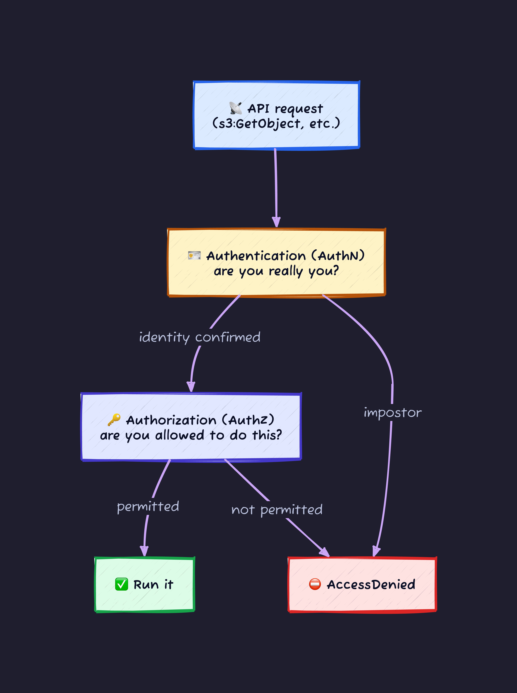
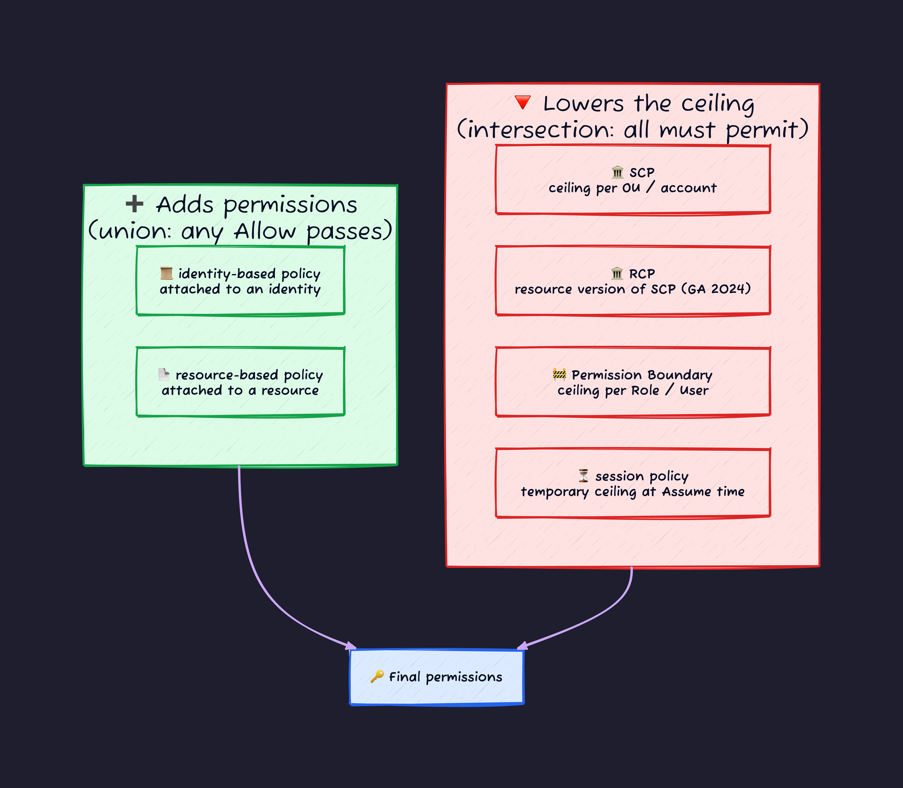
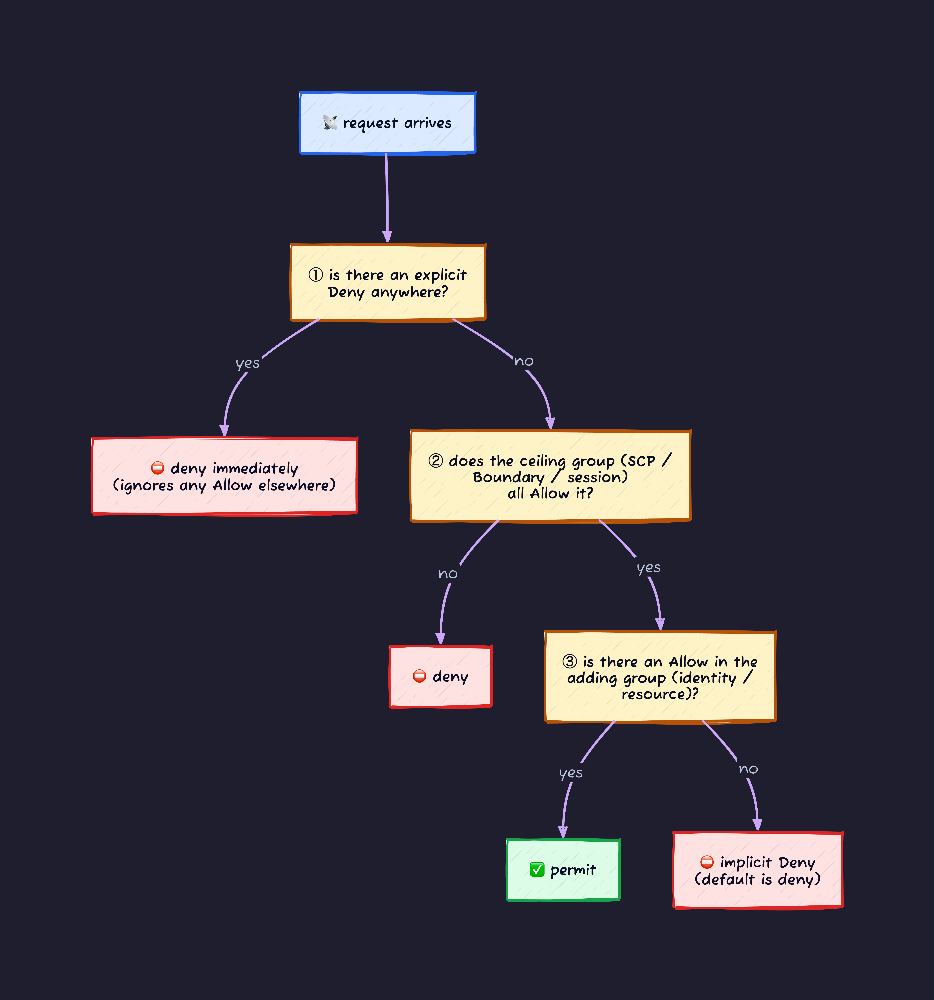
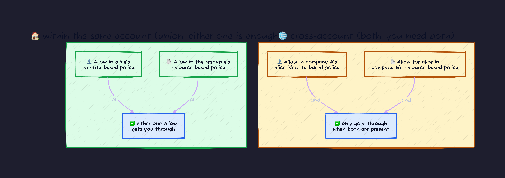
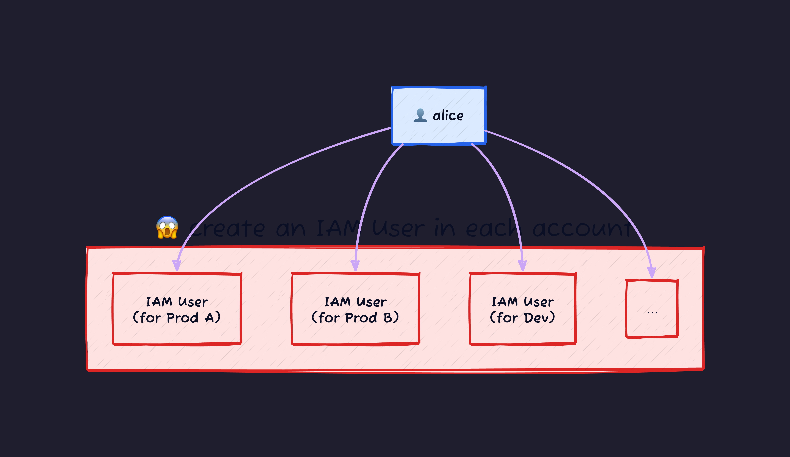
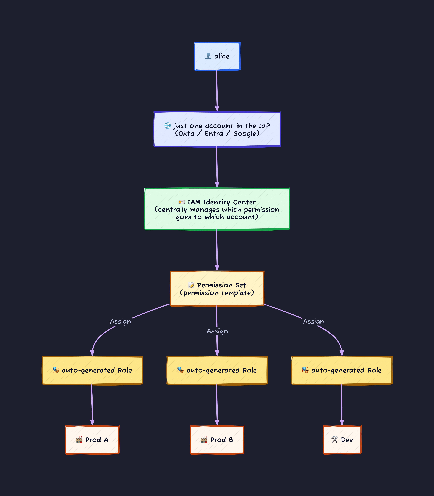

## Where it starts

The first thing that beats you up when you start using AWS is IAM. It got me too.

You see `AccessDenied`. You check the policy and `"Effect": "Allow"` is right there. Denied anyway. You `AssumeRole`, then run `aws sts get-caller-identity` and you are still the same old you, with the same permissions. There are two similar-looking JSON blobs called a trust policy and a permission policy, and you have no idea which one to write what in. Someone asks you the difference between a User and a Role, and you sort of know, but you cannot say it in one sentence.

What I eventually realized is this: **IAM is hard not because the mechanics are complex, but because it is a minefield of traps that go "same word, different thing" and "a handful of asymmetric rules that fight your intuition."** Each trap is the kind you understand instantly once someone explains it. The flip side: defuse them one at a time and IAM becomes shockingly obedient.

This is not a reference that covers every corner of IAM. It is the mines a beginner will definitely step on, broken apart by their true cause, and lined up so that reading top to bottom makes each one go "oh, that's all it was."

---

## 1. What problem is IAM actually solving

Before the traps, let me pin down in one line what IAM is for. If this drifts, everything after it goes blurry.

> **IAM decides who (authentication) can do what (authorization). Every operation in AWS is an HTTPS API call, and IAM stands in front of every single one of them.**

Clicking around in the console, running `aws s3 ls`, applying Terraform: under the hood they all become the same thing, an API request to AWS. For every one of those requests, IAM asks two questions.



- **Authentication (AuthN)**: from the signature on the request, confirm that "this caller really is alice." This is the world of signing (SigV4), and the place beginners get stuck is mostly what comes after it: authorization.
- **Authorization (AuthZ)**: for a confirmed caller, decide whether a policy exists that permits this operation. **Almost all of IAM's difficulty lives on this side.**

When I say "hard" in this article, I mean authorization, nearly every time. I will leave the math of signing to another article and focus here on how you write "who can do what" and how it gets evaluated.

---

## 2. Get the vocabulary straight

The number one reason IAM blows up on you is that **there are too many concepts with similar names.** So let me fix the names first. If a term shows up later that you do not recognize, come back here.

| Term                             | In one line                                                                                                                                                                                                                             |
| -------------------------------- | --------------------------------------------------------------------------------------------------------------------------------------------------------------------------------------------------------------------------------------- |
| **AWS account**                  | The container for resources and IAM. Identified by a 12-digit ID like `123456789012`, and it is also the billing unit. Users and Roles are created **inside** it and are invisible from other accounts. This becomes the key fact later |
| **Principal**                    | The subject of a request. The "who." A User, a Role, an AWS service, and so on                                                                                                                                                          |
| **IAM User**                     | A **permanent identity** you create inside an account, tied to a person or a machine. Holds a password or long-lived access keys                                                                                                        |
| **IAM Role**                     | A **role** that anyone (who meets the conditions) can temporarily become. Holds no long-lived keys, built around short-lived credentials                                                                                                |
| **IAM Group**                    | A container that bundles Users. Attach a policy to a Group and it applies to every member. A Group itself cannot log in                                                                                                                 |
| **IAM Policy**                   | JSON that says "what is allowed or denied." On its own it floats in the air; it only means something once you attach it to someone                                                                                                      |
| **AssumeRole**                   | The STS API that takes on a Role and hands back short-lived credentials. The central act of IAM                                                                                                                                         |
| **Short-lived credentials**      | The disposable keys you get back from `AssumeRole`, expiring in about an hour (a three-piece set: access key, secret, session token)                                                                                                    |
| **identity-based policy**        | A policy **attached to the identity side**: a User, Role, or Group. "What can this identity do?"                                                                                                                                        |
| **resource-based policy**        | A policy **attached to the resource side**, like an S3 bucket. "Who is this resource willing to let touch it?"                                                                                                                          |
| **trust policy**                 | A special resource-based policy attached to a Role. It writes only one thing: "who is allowed to Assume this Role?"                                                                                                                     |
| **SCP** (Service Control Policy) | An Organizations feature that spans multiple accounts. Attached to an OU (a folder that groups accounts) or to an account, it **lowers the ceiling** on permissions. Think of it as Deny-only                                           |
| **Permission Boundary**          | A ceiling attached to an individual User or Role. Where an SCP is the per-account version, this is per-identity                                                                                                                         |
| **STS** (Security Token Service) | The service that issues short-lived credentials. `AssumeRole` is its API                                                                                                                                                                |

The three pairs below are the especially confusing ones. This article defuses them one at a time.

- **User vs Role** (both are "identities" but their nature is the exact opposite)
- **identity-based policy vs trust policy** (a Role needs both)
- **same-account vs cross-account** (the same operation needs different things)

---

## 3. Difficulty 1: what is the difference between a User and a Role

The first mine. Both are "identities that can be a Principal," so beginners stall on "so which one am I supposed to use?" The difference boils down to **how the keys are held.** Here it is in a table.

|                  | IAM User                                  | IAM Role                                        |
| ---------------- | ----------------------------------------- | ----------------------------------------------- |
| Key lifetime     | Long-lived (valid until you revoke it)    | Short-lived (auto-expires in ~1 hour)           |
| Key owner        | The User keeps holding it                 | No owner. Borrowed fresh each time you use it   |
| Binding          | Pinned to a specific person or machine    | Anyone (who meets the conditions) can become it |
| Damage if leaked | Big (valid until you recreate it)         | Small (expires shortly)                         |
| Today's guidance | Avoid where possible (emergency / legacy) | **Default to this**                             |

In plain analogy:

- **User** = a photo ID badge. Pinned to one person; if lost, it can be abused until you reissue it.
- **Role** = a visitor pass you borrow at the front desk. Anyone (if allowed) can borrow it, and it goes invalid automatically at the end of the day.

Why is a Role the default now? Simple: **so you do not scatter long-lived keys all over the world.** Writing an access key into code, pushing it to GitHub, leaking it: that is the classic accident. So the goal is a world where only disposable, expiring keys are ever in circulation. That is why human logins, EC2, Lambda, CI/CD all converge on assuming a Role and taking short-lived credentials.

Let me defuse one behavior right here that every beginner trips on: the "**I assumed the Role but my permissions did not change**" one.

`AssumeRole` **does not rewrite your current credentials.** It only "hands back" a fresh set of short-lived credentials. You set those into an environment variable or a profile, and only then, starting with your next request, do you act as the Role. There is no magic switch at the instant you assume. The reason `aws sts get-caller-identity` returns the same old you is that you have not used the returned keys yet.

---

## 4. Difficulty 2: why does a Role carry two policies

This is the biggest climb in IAM. **A Role has two policies of different natures hanging off it.** And beginners conflate the two and always stall on "which one do I write what in?"

The reason is simple: **a Role is a split personality that is both an "identity" and a "resource" at the same time.** That duality maps directly onto the identity of the two policies.

| Policy                | Which face of the Role             | Question it answers           | Analogy                                          |
| --------------------- | ---------------------------------- | ----------------------------- | ------------------------------------------------ |
| **trust policy**      | The resource face (resource-based) | Who is allowed into this Role | The **front-door key** (who gets in)             |
| **permission policy** | The identity face (identity-based) | What you can do once inside   | The **list of things you may touch** in the room |

You need both. Neither works alone.

- No (or mismatched) trust policy → you cannot Assume at all. Stopped at the door.
- No permission policy → you can Assume, but you cannot touch anything in the room you entered. Empty permissions.

### Watch it across the Assume flow

Tracing where each of the two takes effect along the timeline organizes the whole thing at once.


- The door check (trust policy) takes effect **at the moment of Assume.**
- The contents check (permission policy) takes effect **after you assume, at the moment you actually hit the API.**

If you do not know about this two-stage structure, you read the error message wrong.

- `is not authorized to perform: sts:AssumeRole` → **stopped at the door.** Look at the trust policy, or the caller's own AssumeRole permission.
- Assume went through but `s3:GetObject` returns `AccessDenied` → **stopped at the contents.** Look at the permission policy.

### The trust policy is the more dangerous one

A permission policy that is too wide means "the person who got in does too much." A trust policy that is too wide means "people who should never have gotten in can get in." The latter is the more serious accident. Carelessly setting `Principal` to `"*"` (anyone) turns that Role into a privilege-escalation hole that any AWS account on Earth can Assume. The trust policy is less flashy than the permission policy, but it is the place to write more carefully.

---

## 5. Difficulty 3: there are too many policy types

So far we have seen three: identity-based, resource-based, and trust. AWS officially classifies policies into **seven types** (identity-based, resource-based, permission boundary, SCP, RCP, ACL, session). A beginner who sees that list loses heart on the spot.

You do not need to memorize all of them as equals. Two clarifications up front make it much lighter.

- **The trust policy is not a separate type.** It is a kind of resource-based policy, dedicated to the Assume door of a Role (the one from the last section). An ACL is also a relative of resource-based, and it is treated as legacy now, so do not use it for anything new. So in practice you only need to look at "identity side / resource side / ceiling family."
- The rest organize instantly once you **split them into two groups: things that add permissions, and things that lower the ceiling on permissions.**



(The trust policy is not in this diagram. As covered above, it is dedicated to the Assume door and plays a different role from the permission math we do here. SCP and RCP are ceilings that only show up if you use Organizations; a personal account has none.)

The clearest way to picture the two groups is addition and multiplication.

| Group             | Which ones                      | How they combine                                            | Intuition                                    |
| ----------------- | ------------------------------- | ----------------------------------------------------------- | -------------------------------------------- |
| The adding group  | identity-based / resource-based | **union (addition).** A single Allow anywhere permits it    | Pushes toward more permission                |
| The ceiling group | SCP / RCP / Boundary / session  | **intersection (multiplication).** Denied unless all permit | Pushes toward less. One veto and you are out |

The consequence here is the one beginners get caught on the most.

> **Writing an Allow into an SCP or a Permission Boundary does not add a single bit of permission.** These are a "ceiling," not a "permission." Actual permission is granted by the adding group (identity / resource). The ceiling group only "trims the part of the granted permission that goes over the ceiling."

So "I wrote Allow in the SCP but my usable permissions did not grow" is correct behavior. An SCP's Allow is nothing but setting a ceiling that says "you may permit up to here." Actual permission has to be granted separately, by something like an identity-based policy.

---

## 6. Difficulty 4: why do I get denied when I wrote Allow

"I clearly wrote `Allow` in the policy but I get `AccessDenied`." The most common way to get stuck in IAM. The cause is **the order of evaluation.** AWS looks at all policies in this order.



There are three iron rules to read off this diagram.

1. **The default is deny (implicit Deny).** Write nothing and you can do nothing. Permission is born only once you spell out at least one Allow.
2. **An explicit Deny beats everything.** If any one policy has a Deny, it is denied no questions asked, even with Allows lined up across every other policy. Evaluation stops there.
3. **The ceiling group is a "cutoff," not a "grant."** As covered last section, an operation the SCP / Boundary / session do not permit will not go through no matter how many Allows the identity-based policy has.

(This diagram is simplified for beginners. Strictly, a Permission Boundary does not constrain permissions that a resource-based policy grants directly to a Principal. A path explicitly permitted by name on the resource side can slip past the boundary ceiling. At first, forget this exception and just learn "the ceiling group is the overall ceiling.")

When you knock out the typical patterns of "I wrote Allow but got denied," the culprit is usually one of these.

- There is an **explicit Deny** somewhere (common in an SCP the org attached).
- You are hitting the **ceiling of an SCP or Permission Boundary** and are simply outside the limit.
- It is cross-account and the **other account has no permission** (next section).
- A `Condition` (an IP restriction, MFA required, and so on) is not satisfied, so that Allow never fires.

The presence of `Allow` is a necessary condition for permission, not a sufficient one. Suspecting "is there a Deny?" and "am I inside the ceiling?" first is the shortcut to debugging.

---

## 7. Difficulty 5: behavior changes between same-account and cross-account

This is the asymmetric rule you will never figure out unless someone tells you. **The exact same operation needs different things depending on whether the other side is the same account or a different account.**



To pin it in words:

- **Within the same account**: either the identity-based policy or the resource-based policy permits it, and you are through (union).
- **Cross-account**: company A's Allow on the identity side **and** company B's Allow on the resource side, **both** are required (missing either one and you are out).

Why is it like this? Cross-account is the act of "reaching for stuff in someone else's house," so it is natural to think both parties must consent: **the reaching side (your account permits it)** and **the reached side (their account permits it).** Within one account there is a single homeowner, so one side's consent is enough.

On top of this rides one more asymmetry. The "Role trust policy" from the earlier section also tangles with this same/cross distinction. To assume another company's Role cross-account, their trust policy must name your Principal, and you must have the `sts:AssumeRole` permission on your side: both sides must line up. This is why, when you "cannot assume the other party's Role," looking only at your own permissions often does not solve it.

---

## 8. Difficulty 6: why is "IAM Policy alone" not enough

The final climb. By now you might think "what I actually want is just 'who can do what,' so as long as I can write an IAM Policy, that is enough, right?" In reality this is the structural trap the field gets caught in the most.

The key is the fact we touched in the vocabulary section. **An IAM Policy floats in the air on its own; it only takes effect once you attach it to an "identity" (a User or a Role).** And **that identity can only exist inside one specific account.**

The instant you add accounts, this bares its fangs. Say a company splits into dev / staging / prod / sandbox and so on, ten accounts. Each account is an independent IAM space. To log alice into every account, the naive approach gives you this.



**IAM Users and long-lived access keys multiply by headcount times account count.** 10 accounts × 50 people = 500 Users and keys. What makes this hell:

- A flood of long-lived keys gets scattered (the leak surface is headcount times account count).
- MFA has to be set up on every one of them.
- When alice leaves, you go around deleting all ten. Forget even one and a hole stays open.
- To change permissions, you do every account by hand.

This very property of "identities being bound per account" is why IAM Policy alone cannot run a real organization. AWS provides the fix: use **IAM Identity Center.** This manages employee identities in one place and connects to your in-house **IdP** (Identity Provider: a base like Okta, Microsoft Entra, or Google Workspace that centrally manages employee accounts).



The crux of the mechanism comes down to two words.

- **Permission Set**: a **template** for permissions. Define `ReadOnly` or `Admin` once in the center and reuse it across multiple accounts. The contents are just a bundle of ordinary IAM Policies. You do not have to write from scratch; you can pick AWS-made **predefined** ones like `AdministratorAccess` / `PowerUserAccess` / `ReadOnlyAccess` as-is. Only when you need something fancy do you mix in a custom policy of your own.
- **Assignment**: the tuple of "which person (Group) / in which account / which Permission Set" to assign.

When you assign, Identity Center **grows an IAM Role inside that account automatically.** So the IAM constraint that "each account needs its own Role" has not changed. What changed is that **instead of creating that Role by hand, it gets handed out automatically from a central template.** And alice's identity is a single one in the IdP. On departure, disable that one in the IdP and she is shut out of every account at once.

To organize it:

|                          | IAM User with a policy attached directly | Identity Center + Permission Set              |
| ------------------------ | ---------------------------------------- | --------------------------------------------- |
| Where the identity lives | Scattered across each account            | Consolidated into one in the IdP              |
| Credentials              | Long-lived access keys                   | Short-lived (issued fresh by `aws sso login`) |
| On departure             | Delete the User in every account         | Disable one in the IdP                        |
| Changing permissions     | Every account by hand                    | Change the template / Assign centrally        |

### You see the difference when you get your hands dirty

This article mostly skips code, but this is the one place where lining up the actual commands makes the difference obvious at a glance. Let me do the same "alice uses two accounts, dev and prod" both ways.

The IAM User way makes the admin repeat the same work **as many times as there are accounts.**

```bash
# as the admin of the dev account
aws iam create-user --user-name alice
aws iam attach-user-policy --user-name alice \
  --policy-arn arn:aws:iam::aws:policy/PowerUserAccess
aws iam create-access-key --user-name alice   # long-lived keys come out -> hand them to alice

# do exactly the same thing again in the prod account (another set of keys)
```

On alice's side, she writes the **long-lived keys she received as-is** into `~/.aws/credentials` and uses them.

```ini
[dev]
aws_access_key_id = AKIA...DEV...
aws_secret_access_key = ...DEV...

[prod]
aws_access_key_id = AKIA...PROD...
aws_secret_access_key = ...PROD...
```

The Identity Center way, on the other hand, has no `create-user` and no `create-access-key`. alice configures once.

```bash
aws configure sso        # register the SSO URL once. log in via browser (MFA here)
                         # every account/permission you can reach is listed, and profiles are written automatically
aws sso login            # about once a day. short-lived credentials rain down
aws s3 ls --profile dev  # same login, just switch between dev and prod
aws s3 ls --profile prod
```

Look at `~/.aws/config` and the point is that **not a single key is written there.** All that is written is "which account, which Permission Set," and the actual keys are issued fresh and short-lived on every `aws sso login`. This is the decisive difference from the former, which parks long-lived keys in a file.

This is where the essence we pinned at the start pays off: "**every access in AWS ultimately converges on assuming a Role and taking short-lived credentials.**" Identity Center and Permission Sets are not a new authorization mechanism; they are nothing but **a connector that wires the human entrance to each account's Role AssumeRole.** What you hold at the end is the usual Role's short-lived credentials.

---

## 9. Summary: one mental model

Let me fold all the difficulty so far into a single picture. When IAM stops making sense, come back to this drawing.


Each difficulty in one line:

1. **User vs Role**: the difference is key lifetime. A User keeps a long-lived key; a Role borrows a short-lived one each time. A Role is the default now.
2. **Two policies**: a Role is a split personality, "identity" and "resource." The door (trust policy) and the contents (permission policy) answer different questions.
3. **Policy types**: officially there are seven, but split them into "the group that grants by adding" and "the group that lowers the ceiling by multiplying" and it organizes. An Allow in the ceiling group adds no permission.
4. **Evaluation order**: write nothing, denied. Deny beats everything. "I wrote Allow" is only a necessary condition for permission.
5. **Same vs cross**: same account, one side's Allow is enough. Different account, you need both sides' Allow.
6. **IAM Policy alone is not enough**: identities are bound to accounts. When accounts grow, use Identity Center to consolidate identities centrally and hand out Roles automatically.

IAM beats you up at first sight because there are so many concepts, but most of the difficulty is the kind that disappears once explained: "same word, different thing," and "a handful of asymmetric rules that fight intuition." Step on these six mines once and the next time you see `AccessDenied`, you will be able to narrow down the culprit in order.

Next time you get stuck, suspect first "is there a Deny?" and "am I inside the ceiling (SCP / Boundary)?" If that still does not explain it, then it is either the same/cross asymmetry or you are stopped at the trust policy door. Once you know where the mines are, IAM is not scary.
