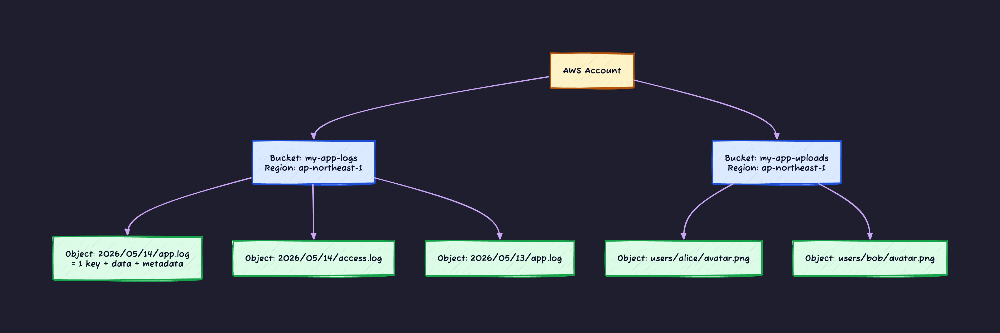
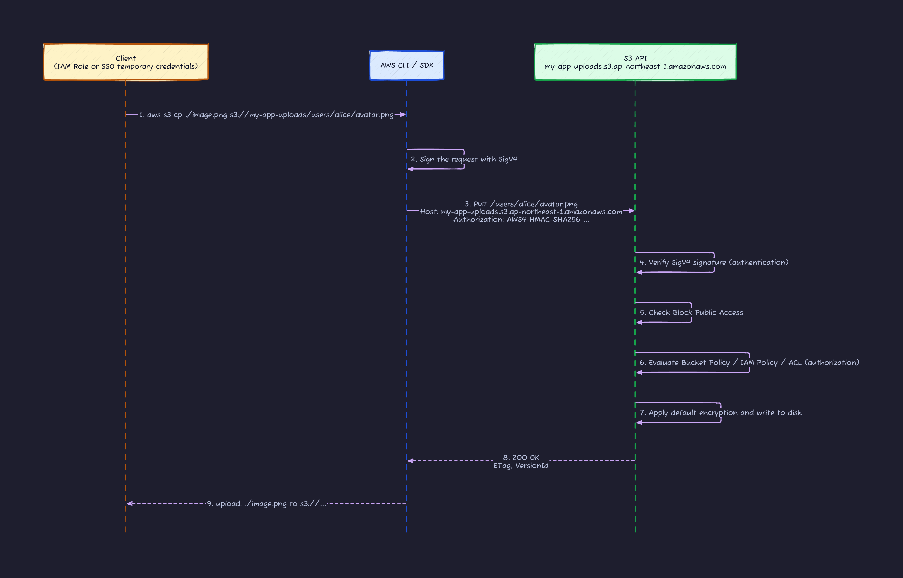
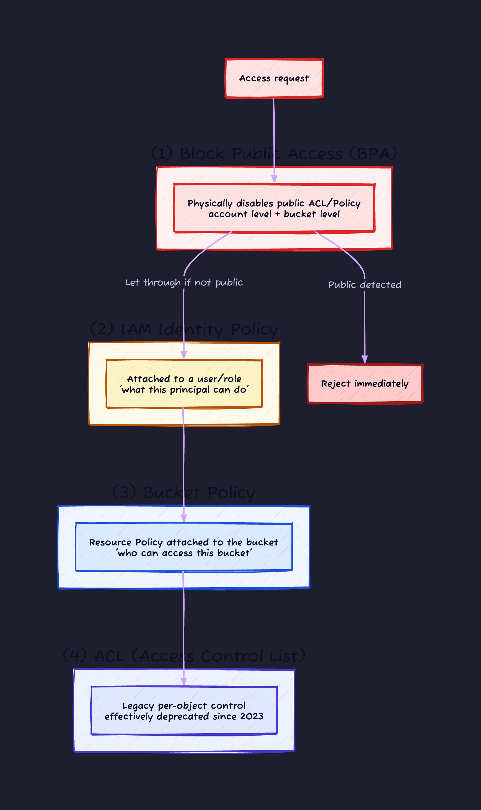
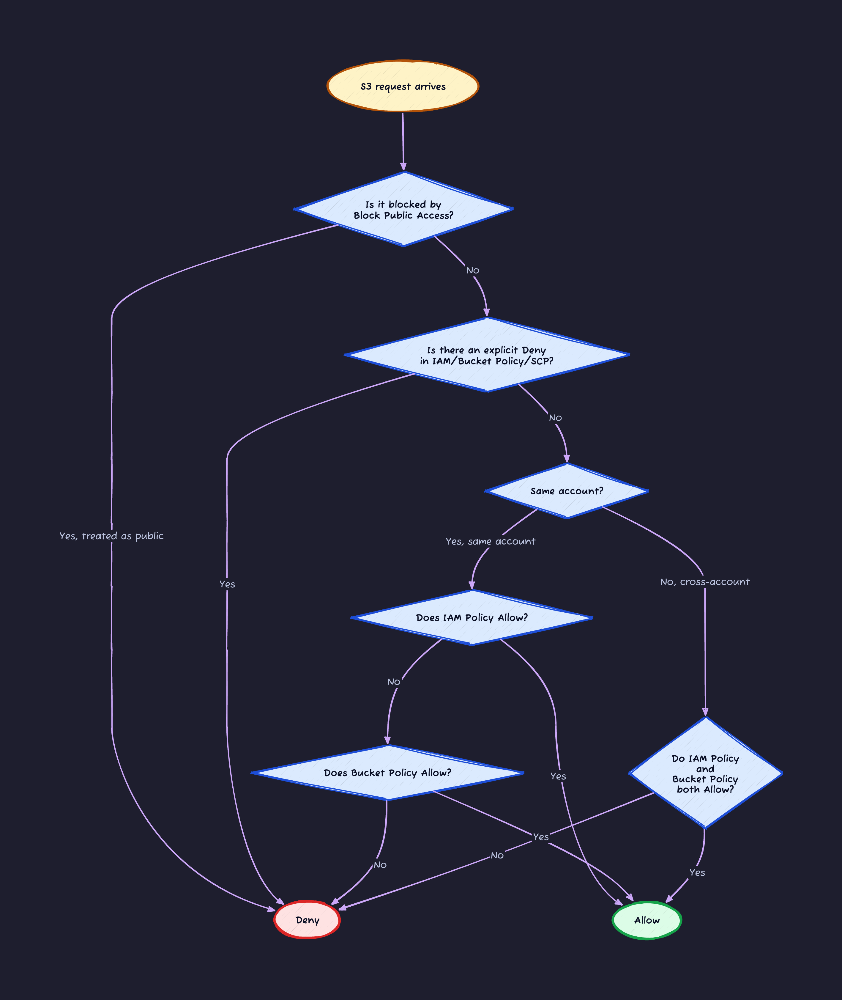
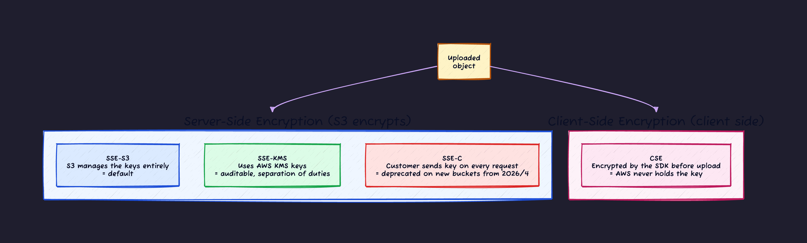
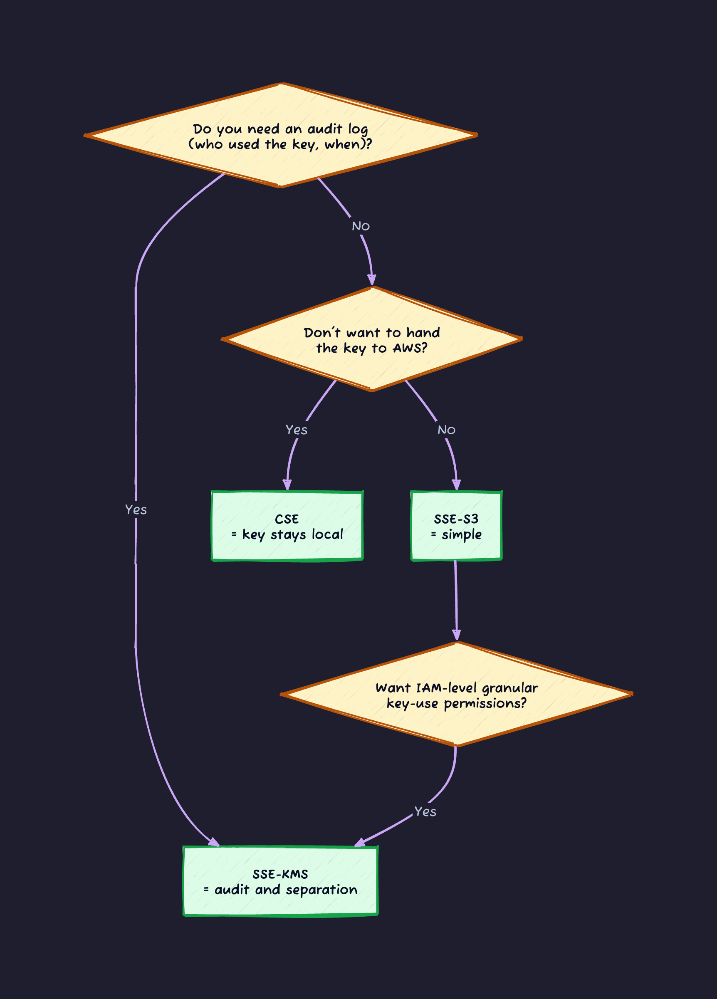
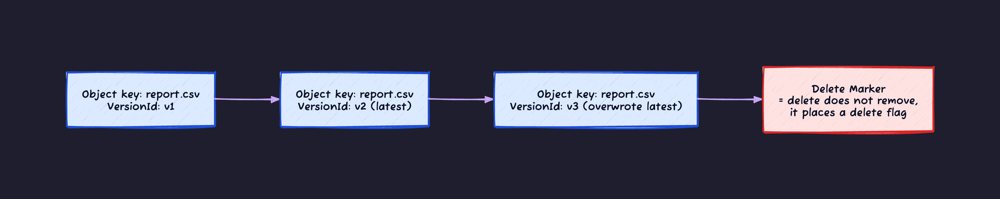

## Introduction

S3 (Simple Storage Service) is one of the oldest (launched in 2006) and most-used services in AWS. "Near-infinite storage where you can put and get files over an HTTPS API" sounds simple, but in real operation it keeps showing up in incident news because of the **complexity of its access control**.

Every year you see headlines like "S3 bucket left public, customer PII leaked." That isn't because S3 is broken. It's because **almost nobody fully understands all 4 kinds of access control**.

This article dissects S3 in the following order.

1. The S3 object model: the true structure of buckets, objects, and keys
2. Following a single round-trip: what happens inside S3 between receiving and returning
3. The 4 layers of access control: IAM / Bucket Policy / ACL / Block Public Access
4. The evaluation flowchart: who actually gets access in the end
5. The 4 forms of encryption: SSE-S3 / SSE-KMS / SSE-C / CSE
6. Features you lose by not knowing: Versioning / MFA Delete / Object Lock / Access Point
7. A list of configurations you must never use

---

## 1. The S3 Object Model

S3 is not a filesystem. It is **object storage**. This is the first source of confusion.

Object storage is a mechanism where data + a unique ID (the key) + metadata are bundled into one unit (an object) and **put and got from a flat namespace**. There is no directory hierarchy, no file permission bits, no blocks. If you think of it not as a "file" but as "an item retrievable by ID," it starts to make sense.



The key points.

- A **Bucket** is a "container" scoped to an account + Region. Its name is **globally unique across all of AWS**, so the name `my-app-logs` exists in exactly one place in the world.
- An **Object** is a single piece of data inside a bucket. It is identified by a **Key** like `2026/05/14/app.log`.
- The key "looks like" a file path, but **it is just a string**. The `/` is just a character. Directories do not exist.
- Each object consists of **data + metadata + (optional) tags**.
- A bucket is tied to a Region, but **only the bucket name namespace is global**.

### "Folders" Are an Illusion

When you click `2026/05/` in the S3 console and "see its contents," that is **just a prefix search on keys**, not a folder. To fetch the contents of `2026/05/14/app.log`, you do not need to first fetch a parent object called `2026/` or `2026/05/`.

If you do not know this, you end up doing things like uploading a 0-byte object named `2026/06/` because "I want to create an empty folder in S3," which is a console-driven misconception.

### Memorize the ARN Format

You always need this when pointing to S3 (or any AWS resource) from an IAM policy. ARN stands for **Amazon Resource Name** and is the scheme AWS uses to refer to any resource by a globally unique string. The base form is this.

```text
arn:partition:service:region:account-id:resource
       │        │       │        │          │
       │        │       │        │          └─ Resource ID (bucket name or object key)
       │        │       │        └────────── 12-digit AWS account number
       │        │       └─────────────────── Region (e.g. ap-northeast-1)
       │        └─────────────────────────── Service name (e.g. s3, ec2, iam)
       └──────────────────────────────────── Partition (usually aws, China is aws-cn)
```

S3 takes the special form of **leaving `region` and `account-id` blank** (which is why you see three consecutive colons `:::`), due to "globally unique bucket names" and a "Region-independent billing model."

| Target                             | ARN                                           |
| ---------------------------------- | --------------------------------------------- |
| The whole bucket                   | `arn:aws:s3:::my-app-logs`                    |
| All objects in the bucket          | `arn:aws:s3:::my-app-logs/*`                  |
| A specific object                  | `arn:aws:s3:::my-app-logs/2026/05/14/app.log` |
| Everything under a specific prefix | `arn:aws:s3:::my-app-logs/users/alice/*`      |

The key point is that **a bucket and its objects have different ARNs**. `s3:ListBucket` applies to the bucket ARN and `s3:GetObject` applies to the object ARN, so you need to write both to get listing and reading working together.

---

## 2. Following a Single Round-Trip

When a client runs `aws s3 cp ./image.png s3://my-app-uploads/users/alice/avatar.png`, what happens inside S3?



What you need to recognize here is that **the inputs S3 uses to decide authorization are all 4 of IAM / Bucket Policy / ACL / Block Public Access**. Looking at just one of them does not tell you the real permissions.

---

## 3. The 4 Layers of Access Control

This is the single biggest source of confusion in S3. Access control is decided by 4 layers simultaneously.



### Layer ①: Block Public Access (BPA)

The newest, strongest safety net, and **the first thing evaluated**.

Since April 2023, AWS has **enabled it by default on new buckets** and also disabled ACL by default. BPA consists of 4 switches.

| BPA setting             | What it does                                                  |
| ----------------------- | ------------------------------------------------------------- |
| `BlockPublicAcls`       | Prevent **newly attaching** a public ACL                      |
| `IgnorePublicAcls`      | **Ignore all** public ACLs (including existing ones)          |
| `BlockPublicPolicy`     | Prevent **attaching** a public bucket policy                  |
| `RestrictPublicBuckets` | **Completely block unauthenticated access** to public buckets |

**All 4 ON is the rule**. As long as you do this, "I accidentally made it public" incidents are almost entirely prevented.

You can also **enforce BPA at the Organizations level** (Organization-level BPA). Once set, individual accounts can no longer disable BPA themselves. If you use AWS at a company, turn this on without exception.

### Layer ②: IAM Identity Policy

The IAM policy type that is **attached to the operating side (user / role)**. It writes "what this principal can do."

```json
{
  "Version": "2012-10-17",
  "Statement": [
    {
      "Effect": "Allow",
      "Action": ["s3:GetObject"],
      "Resource": "arn:aws:s3:::my-app-uploads/users/${aws:username}/*"
    }
  ]
}
```

This is an IAM policy that says "you can only read the subfolder named after your own username." Dynamic variables like `${aws:username}` are useful.

### Layer ③: Bucket Policy

A Resource Policy attached to the **bucket side**. It writes "who can access this bucket."

```json
{
  "Version": "2012-10-17",
  "Statement": [
    {
      "Sid": "DenyInsecureTransport",
      "Effect": "Deny",
      "Principal": "*",
      "Action": "s3:*",
      "Resource": [
        "arn:aws:s3:::my-app-uploads",
        "arn:aws:s3:::my-app-uploads/*"
      ],
      "Condition": {
        "Bool": { "aws:SecureTransport": "false" }
      }
    },
    {
      "Sid": "AllowFromMyOrg",
      "Effect": "Allow",
      "Principal": "*",
      "Action": ["s3:GetObject", "s3:PutObject"],
      "Resource": "arn:aws:s3:::my-app-uploads/*",
      "Condition": {
        "StringEquals": {
          "aws:PrincipalOrgID": "o-abc1234567"
        }
      }
    }
  ]
}
```

Key points.

- **Denying HTTP (non-TLS) access** is a standard template.
- Adding `aws:PrincipalOrgID` to Condition lets you ensure **only people/Roles in your own AWS Organizations can access**. This is a structural defense that prevents public-exposure incidents.
- **Cross-account sharing is done with the bucket policy**. IAM alone will not allow cross-account.

### Layer ④: ACL (Access Control List)

The oldest access control in S3. Today, **you do not need to use it**.

- Since April 2023, **ACL is disabled by default on new buckets** (Object Ownership = "Bucket owner enforced").
- Some legacy integrations (such as CloudFront logs) still require it, but even then keep it minimal.
- For existing buckets too, **prefer disabling ACL** when possible.

A lot of "S3 public-exposure incidents" were caused by giving Read to the ACL's `AllUsers` group (= the entire internet). BPA + disabled ACL is the mechanism that closes that old wound.

---

## 4. Who Actually Gets Access: The Evaluation Flowchart

Given the 4 layers, here is the full flow of whether S3 lets a request through.



The principles to internalize.

1. **BPA wins everything**: if it judges the request as public, it is over.
2. **An explicit Deny wherever it appears wins**: if there is a Deny in IAM, Bucket Policy, or SCP, you are done.
3. **Same account: Allow from either IAM or Bucket Policy is enough** (OR).
4. **Cross-account: Allow is required in both IAM and Bucket Policy** (AND).

Cross-account sharing often gets stuck on point 4. When someone says "I can't access our bucket from a Role in another account," the first thing to check is **whether Allow is written on both sides**.

---

## 5. The 4 Forms of Encryption

As of 2026, **all objects in S3 are automatically encrypted** by default. That said, there are 4 variations on whose key does the encryption.



Their characteristics.

| Type        | Key management                     | Key-use log            | Recommendation | When to use                                                                                                     |
| ----------- | ---------------------------------- | ---------------------- | -------------- | --------------------------------------------------------------------------------------------------------------- |
| **SSE-S3**  | Fully managed by S3                | None                   | Standard       | You want forced encryption but want to avoid KMS cost and management                                            |
| **SSE-KMS** | AWS KMS (Customer Managed Key)     | Recorded in CloudTrail | ★★★            | Required when you need auditing, separation of duties, or compliance                                            |
| **SSE-C**   | Client sends a key on each request | None                   | ★              | Only for special cases where you cannot hand the key to AWS. Disabled by default on new buckets from April 2026 |
| **CSE**     | Fully managed by the client        | None                   | ★              | For ultra-high requirements where you cannot let AWS see plaintext at all                                       |

### How to Choose in Practice



If you do not want to think about it, pick **SSE-KMS with a Customer Managed Key (CMK)**. Key-use logs go into CloudTrail, KMS key policy lets you enforce "only this role can decrypt," and you can replicate keys to other Regions. The only downside is that the KMS API call charges slowly add up.

### Enforce Default Encryption on the Bucket

When you want to enforce encryption on new objects, set the bucket-level **Default encryption**.

```json
{
  "Rules": [
    {
      "ApplyServerSideEncryptionByDefault": {
        "SSEAlgorithm": "aws:kms",
        "KMSMasterKeyID": "arn:aws:kms:ap-northeast-1:123456789012:key/abc-..."
      },
      "BucketKeyEnabled": true
    }
  ]
}
```

`BucketKeyEnabled: true` dramatically reduces the number of KMS API calls and saves cost, so turn it on whenever you use KMS.

### Bucket Policy That Rejects "Unencrypted PUT"

Putting this in as a guardrail rescues you with default encryption even when someone misuses the SDK.

```json
{
  "Sid": "DenyUnEncryptedObjectUploads",
  "Effect": "Deny",
  "Principal": "*",
  "Action": "s3:PutObject",
  "Resource": "arn:aws:s3:::my-app-uploads/*",
  "Condition": {
    "StringNotEquals": {
      "s3:x-amz-server-side-encryption": "aws:kms"
    }
  }
}
```

---

## 6. Features You Lose by Not Knowing

Features that elevate S3 beyond "just an object store."

### Versioning and MFA Delete



- Turning **Versioning** on keeps older versions even when you overwrite the same key.
- Deletion just stacks a **Delete Marker**, leaving the actual data intact.
- Combining **MFA Delete** requires the Root account's MFA for permanent deletion. Even if ransomware encrypts your bucket, you can roll back from an older version.

### Object Lock

A WORM (Write Once Read Many) mode that disallows deletion and overwriting for a fixed period after a write.

- **Governance mode**: privileged users can still delete.
- **Compliance mode**: nobody (not even Root) can delete until expiry.

Use it for data that must not be deleted, such as legal records (SEC, FINRA, HIPAA).

### Access Point

A feature that "grows multiple purpose-specific entry points on a single bucket." For one bucket `company-data` you can create Access Points like `marketing-readonly` (only the marketing IAM can Get), `finance-readwrite` (the finance IAM can Get/Put), `public-cdn` (only via CloudFront), each with its own independent Access Point Policy.

Before your Bucket Policy bloats into something unreadable, splitting it into Access Points keeps things organized.

### Pre-signed URL

A feature that issues a short-lived signed URL. Handy when you want to **let an unauthenticated user temporarily download or upload**.

- Example: "let a customer download an invoice PDF for just 1 hour" → issue a Pre-signed URL and email it.
- The bucket stays completely closed via BPA. Per-request access is allowed by the URL's expiration and signature.

---

## 7. List of Configurations You Must Never Use

Given everything above, here are anti-patterns and best practices.

**❌ Do not do**

- Turn BPA OFF
- Grant Read to `AllUsers` / `AuthenticatedUsers` via ACL
- Use `Principal: *` in Bucket Policy without any Condition
- Store important data without Versioning
- Allow HTTP (non-TLS) access
- Embed long-lived IAM User credentials in an application
- Casually grab a globally unique bucket name and operate it with public settings

**✅ Do**

- All 4 BPA switches ON / enforced at the organization level
- Disable ACL (Object Ownership = Bucket owner enforced)
- Enforce `aws:SecureTransport` in Bucket Policy
- Fence in with `aws:PrincipalOrgID` in Bucket Policy
- Versioning + MFA Delete
- SSE-KMS + Bucket Key for both auditability and low cost
- Use Pre-signed URLs as a substitute for temporary public exposure
- For distribution, completely privatize the bucket with CloudFront + OAC

There is one operational pattern worth emphasizing especially.

> **"I want to expose this to the internet" does not mean "make the bucket public."**
>
> If you want to publish a static site or image distribution, keep the bucket fully private and serve it through a CDN with **CloudFront + OAC (Origin Access Control)**. This achieves "direct bucket access is blocked, only the CDN can fetch from it." There is zero need to disable BPA.

---

## Conclusion

- S3 is an object store of Bucket + Object + Key. Folders are an illusion, `/` is just a character.
- Bucket names are globally unique. The ARN of the bucket and of its objects are different.
- Access control has 4 layers: BPA / IAM / Bucket Policy / ACL.
- Evaluation principles: BPA wins everything, explicit Deny wins, same account is OR, cross-account is AND.
- Encryption comes in 4 flavors: SSE-S3 / SSE-KMS / SSE-C / CSE. Today, SSE-KMS + Bucket Key is the standard.
- All 4 BPA switches ON, ACL disabled, HTTPS enforced, scoped by `aws:PrincipalOrgID`: public-exposure incidents drop dramatically.
- For public distribution use CloudFront + OAC. For temporary sharing use Pre-signed URLs.

## References

- [Amazon S3 Block Public Access](https://aws.amazon.com/s3/features/block-public-access/)
- [Blocking public access to your Amazon S3 storage](https://docs.aws.amazon.com/AmazonS3/latest/userguide/access-control-block-public-access.html)
- [Examples of Amazon S3 bucket policies](https://docs.aws.amazon.com/AmazonS3/latest/userguide/example-bucket-policies.html)
- [Protecting data with server-side encryption](https://docs.aws.amazon.com/AmazonS3/latest/userguide/serv-side-encryption.html)
- [Advanced notice: Amazon S3 to disable SSE-C by default for new buckets in April 2026](https://aws.amazon.com/blogs/storage/advanced-notice-amazon-s3-to-disable-the-use-of-sse-c-encryption-by-default-for-all-new-buckets-and-select-existing-buckets-in-april-2026/)
