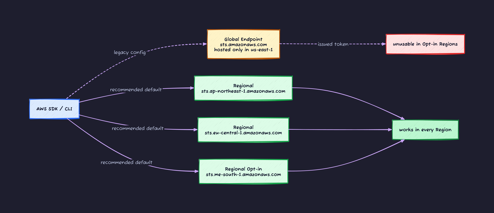
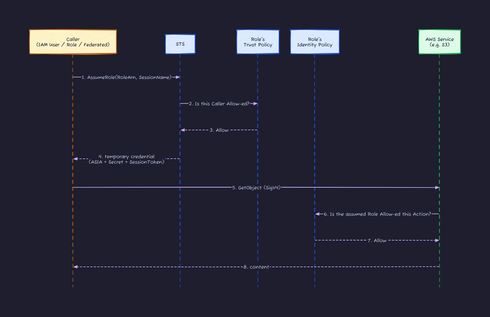
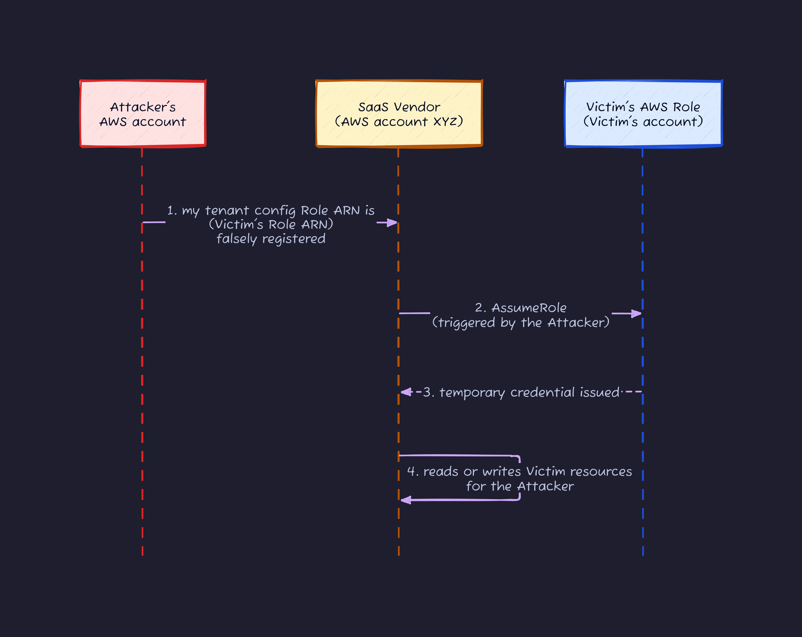
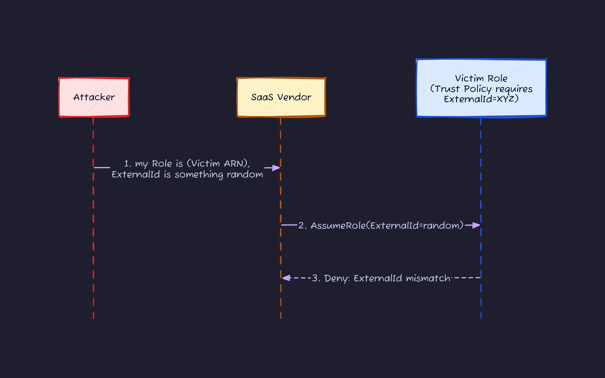
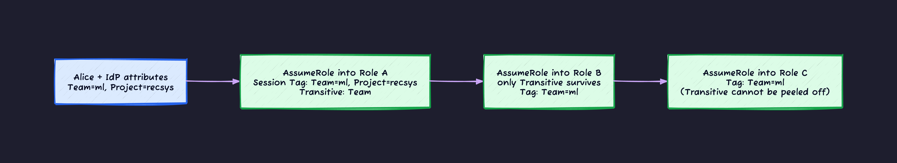
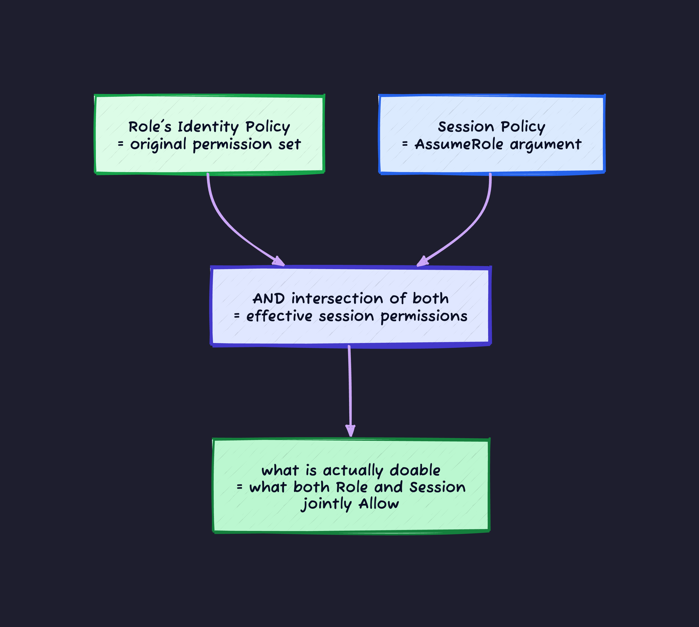
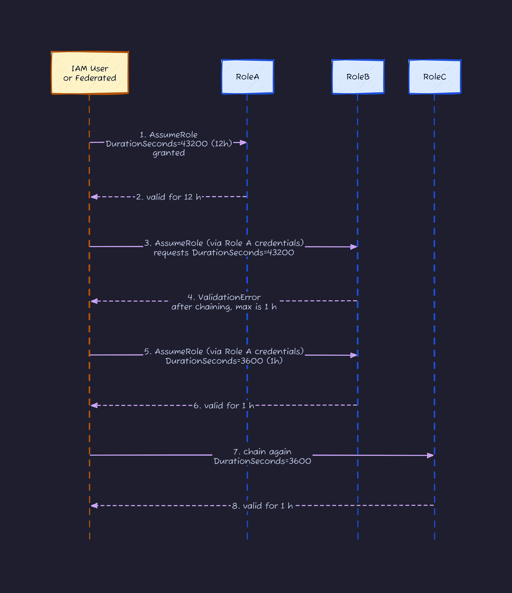
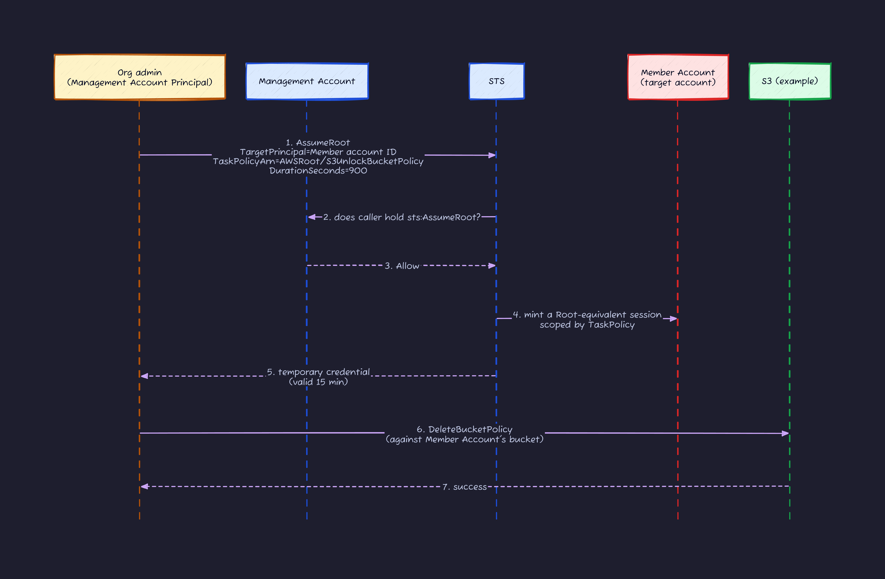

## Introduction

In [the previous IAM article](https://dev.to/kanywst/aws-iam-deep-dive-2b81), I argued you should drop long-lived IAM User keys (`AKIA...`) and lean on Role + STS. Back then I described STS as "the temporary credential issuer" in one line.

Then I kept tripping over AssumeRole edge cases in real work.

- "What is the actual difference between `AssumeRole`, `AssumeRoleWithSAML`, and `AssumeRoleWithWebIdentity`?"
- "A SaaS vendor told me to pass `ExternalId`. What is it for?"
- "CloudTrail keeps showing `assumed-role/XXX/session-yyy`. Where does the `session-yyy` part come from?"
- "I chained Role A to Role B and suddenly the session expires after 1 hour. Why?"
- "Where does `AssumeRoot` from 2024 re:Invent fit?"

STS is not a single API. It is a small universe: **6 separate issuance APIs plus Source Identity, External ID, Session Tag, and Session Policy**. This article opens all of it. Treat it as the sequel to the IAM piece.

Outline.

1. What STS actually does (including Global vs Regional)
2. The 3 fields of a temporary credential and how they ride on SigV4
3. The 6 STS APIs as a decision tree
4. Trust Policy vs Identity Policy (one more careful pass)
5. External ID: stopping the Confused Deputy
6. Source Identity: keeping the original human in CloudTrail
7. Session Tag and Transitive Tag: the engine behind ABAC
8. Session Policy: narrowing through AssumeRole arguments
9. Role Chaining: the 1-hour wall
10. DurationSeconds: 15 minutes to 12 hours
11. Wiring GitHub Actions OIDC (a quick look)
12. How it shows up in CloudTrail
13. AssumeRoot (2024): Centralized Root Access
14. Do this / avoid that

Foundations (IAM principals, policy evaluation order, SigV4) are covered in the previous article. Read that first if you skipped it.

---

## 1. What STS Does

STS (Security Token Service) is **the AWS service that issues temporary credentials**. One hostname, 8 APIs (6 for issuance, 2 helpers).

### Global and Regional both exist

The STS endpoint comes in 2 shapes.

| Form     | hostname                                                               | Physical location                    |
| -------- | ---------------------------------------------------------------------- | ------------------------------------ |
| Global   | `sts.amazonaws.com`                                                    | Hosted only in us-east-1             |
| Regional | `sts.<region>.amazonaws.com` (e.g. `sts.ap-northeast-1.amazonaws.com`) | Independently hosted in each Region  |

IAM itself (Users, Roles, Policy definitions) is Global, but **the issuance act is regionalized**. This is the central design point. The current official line: **use Regional**.

Why.

- **Latency**: Hitting a nearby Region endpoint is obviously faster.
- **Availability**: The Global endpoint is hosted only in us-east-1, so it goes down with us-east-1. Regional endpoints are independent per Region.
- **Token validity scope**: SessionTokens issued from a Regional endpoint are **valid in every Region**. Tokens issued from the Global endpoint only work in **default-enabled Regions (not Opt-in Regions)**. To use a newer Opt-in Region, you must issue from a Regional endpoint.

Around July 31, 2025, the SDK defaults for boto3 v1.40.0, PHP, C++, .NET, and Tools for PowerShell flipped to Regional (Global used to be the default). Go, Node, and Java were already Regional by default. Whatever SDK you are using without thinking about it is basically already Regional.



For the CLI, set `AWS_STS_REGIONAL_ENDPOINTS=regional` (or `sts_regional_endpoints = regional` in `~/.aws/config`) to make the choice explicit. New projects should standardize on Regional without thinking.

---

## 2. The 3 fields of a temporary credential

What STS hands you is **not a single "token" string**. It is a triple.

| Field               | Content                              | Property                                                                            |
| ------------------- | ------------------------------------ | ----------------------------------------------------------------------------------- |
| **AccessKeyId**     | 20 chars starting with `ASIA`        | Safe to expose (it rides on every request)                                          |
| **SecretAccessKey** | 40-char base64                       | Leak = compromise. HMAC key for SigV4                                               |
| **SessionToken**    | Hundreds to thousands of characters  | Leak = compromise. Without it the temporary credential is not accepted              |
| **Expiration**      | ISO8601 UTC timestamp                | One second past this and you re-fetch from STS                                      |

IAM User long-lived keys start with `AKIA...`. STS temporary credentials start with `ASIA...`. **The first 4 characters tell you long-lived vs temporary**. Remember this and your first triage on CloudTrail or `~/.aws/credentials` gets fast.

### SessionToken rides as an extra SigV4 header

With long-lived keys, SigV4 uses `AccessKeyId` and `SecretAccessKey`. With STS temporary credentials, you have to **add one more HTTP header**.

```http
POST / HTTP/1.1
Host: dynamodb.ap-northeast-1.amazonaws.com
X-Amz-Date: 20260517T120000Z
X-Amz-Security-Token: IQoJb3JpZ2luX2VjEM3...(continues for hundreds of chars)
Authorization: AWS4-HMAC-SHA256
  Credential=ASIAEXAMPLE/20260517/ap-northeast-1/dynamodb/aws4_request,
  SignedHeaders=host;x-amz-date;x-amz-security-token,
  Signature=abc123...
```

Points.

- **Put SessionToken in the `X-Amz-Security-Token` header**. AWS uses this to decide "this is not a long-lived IAM User key, it is an STS-issued temporary credential" and looks up validity and policy accordingly.
- Include `x-amz-security-token` in `SignedHeaders` so it is covered by the signature (tamper resistance).

SDKs handle all of this automatically, so you rarely write it by hand. But when "it works from a container via the SDK but `curl` returns 403," this header is almost always the cause.

---

## 3. STS APIs: a decision tree

STS has multiple similarly named APIs and people mix them up every time. Picture first.


One line per API.

| API                          | What it does                                                                                  | DurationSeconds max                            |
| ---------------------------- | --------------------------------------------------------------------------------------------- | ---------------------------------------------- |
| `AssumeRole`                 | Switch into an IAM Role in the same or another account                                        | Role's MaxSessionDuration (15 min to 12 h)     |
| `AssumeRoleWithSAML`         | Pass a SAML 2.0 IdP assertion and switch into a Role                                          | Same                                           |
| `AssumeRoleWithWebIdentity`  | Pass an OIDC IdP id_token and switch into a Role                                              | Same                                           |
| `AssumeRoot` (2024)          | From the Management Account, take Root-equivalent permissions on a Member Account for 15 min | **Fixed 15 min**                               |
| `GetSessionToken`            | IAM User long-lived key plus (optional) MFA, upgraded to a temporary credential               | 12 h (1 h when the caller is root)             |
| `GetFederationToken`         | IAM User long-lived key mints a temporary credential for another identity (federated user)   | 12 h (1 h when the caller is root)             |
| `DecodeAuthorizationMessage` | Expand the encoded AccessDenied message into something human-readable                         | (not an issuer)                                |
| `GetCallerIdentity`          | Returns "if I call AWS right now with these credentials, who am I?"                           | (not an issuer)                                |

Frequency in real work: **`AssumeRole` > `AssumeRoleWithWebIdentity` (CI) > `AssumeRoleWithSAML` (corporate IdP) > `DecodeAuthorizationMessage` (debugging)**. `GetSessionToken` and `GetFederationToken` are IAM User-era APIs. With Identity Center and OIDC unifying humans and CI, they barely show up anymore.

### Do not confuse `GetSessionToken` with `AssumeRole`

The name `GetSessionToken` suggests "the API that returns you a session token." It actually means **"take an IAM User's long-lived key and upgrade it to a temporary credential, optionally with MFA."** You gain no new permissions. You get the same permissions as the original IAM User, just with an Expiration and (if MFA was used) the `aws:MultiFactorAuthPresent` condition set.

The canonical use case is enforcing MFA via `aws:MultiFactorAuthPresent` in an IAM Policy condition.

```json
{
  "Effect": "Deny",
  "Action": "ec2:TerminateInstances",
  "Resource": "*",
  "Condition": {
    "BoolIfExists": { "aws:MultiFactorAuthPresent": "false" }
  }
}
```

When you run as an IAM User from the CLI, call `get-session-token --serial-number <MFA ARN> --token-code <6 digits>` to swap in a credential that carries the MFA condition. Save it as a separate profile in `~/.aws/credentials` and use that profile for everything sensitive.

### `GetFederationToken` is basically retired

`GetFederationToken` lets an IAM User long-lived key mint a temporary credential on behalf of someone else. It mattered when you stood up a custom corporate IdP server that held the IAM User key and minted credentials for authenticated employees.

That era is over. The same outcome ships via **Identity Center + Permission Set + SAML/OIDC**, without any long-lived IAM User key in the picture. New designs do not reach for `GetFederationToken`.

---

## 4. Trust Policy vs Identity Policy

"I have a few policies on this Role, but what is the Trust Policy?" is a recurring question. Roles carry **two kinds of policy** evaluated at different moments.

| Policy              | Where it lives                          | Evaluation moment                       | Question it answers                     |
| ------------------- | --------------------------------------- | --------------------------------------- | --------------------------------------- |
| **Trust Policy**    | The Role's `AssumeRolePolicyDocument`   | When `AssumeRole` is called             | "Who is allowed to assume this Role?"   |
| **Identity Policy** | Policies attached to the Role           | On each API call after assuming         | "What can the assumed Role do?"         |



Both are JSON policy documents with nearly identical syntax. The one difference: **whether you write `Principal`**.

- Trust Policy **requires `Principal`**. You explicitly say "from `arn:aws:iam::111:user/alice`," who can assume.
- Identity Policy has no `Principal`. The owner is the attached Role, no ambiguity.

Example: a Trust Policy that allows GitHub Actions OIDC federation.

```json
{
  "Version": "2012-10-17",
  "Statement": [{
    "Effect": "Allow",
    "Principal": {
      "Federated": "arn:aws:iam::111111111111:oidc-provider/token.actions.githubusercontent.com"
    },
    "Action": "sts:AssumeRoleWithWebIdentity",
    "Condition": {
      "StringEquals": {
        "token.actions.githubusercontent.com:aud": "sts.amazonaws.com"
      },
      "StringLike": {
        "token.actions.githubusercontent.com:sub": "repo:my-org/my-repo:ref:refs/heads/main"
      }
    }
  }]
}
```

The common mistake here: **writing `sts:AssumeRole` for the Action**. OIDC requires `sts:AssumeRoleWithWebIdentity`. SAML needs `sts:AssumeRoleWithSAML`. Plain role-switching needs `sts:AssumeRole`. Memorize this: **the API name you call equals the Action name in the Trust Policy**.

---

## 5. External ID: stopping the Confused Deputy

If a SaaS vendor has ever asked you to "add this ExternalId to your AWS Role's Trust Policy," that is the Confused Deputy defense.

### What is a Confused Deputy

An attack where "a third party (the Deputy) who legitimately holds permissions on your behalf" is tricked by a different attacker into exercising those permissions for someone other than you.



The Victim's Trust Policy only says "the Vendor's AWS account may assume this Role." The SaaS vendor's system mints AssumeRole calls on behalf of many customers. If the Vendor's tenant isolation is sloppy, the attacker registers "my tenant's Role ARN is (actually the Victim's Role ARN)" and the Vendor unwittingly assumes the Victim's Role.

### Close the hole with ExternalId

ExternalId is **"a value only the Victim knows, that the SaaS vendor must include when assuming the Victim's Role for that tenant."** The Victim writes it into the Trust Policy, the Vendor passes it via `--external-id`.



The Victim's Trust Policy looks like this.

```json
{
  "Version": "2012-10-17",
  "Statement": [{
    "Effect": "Allow",
    "Principal": { "AWS": "arn:aws:iam::SAAS_VENDOR_ACCOUNT:root" },
    "Action": "sts:AssumeRole",
    "Condition": {
      "StringEquals": {
        "sts:ExternalId": "ab8a3c7e-4d1f-4d9b-90e4-..."
      }
    }
  }]
}
```

ExternalId is **not a secret password**. The Vendor knows it. It is written in plain text in the Trust Policy. It is just **"a unique string the customer (the Victim) and the SaaS agreed on."** Its job is to make AWS re-validate the Vendor-internal tenant routing.

Vendor responsibilities.

- Generate a **distinct ExternalId per customer** (UUID recommended).
- Never pass customer A's ExternalId into customer B's AssumeRole. No internal swaps.
- Show ExternalId only to the customer it belongs to.

Customer (Victim) responsibilities.

- **Always** put the Vendor-supplied ExternalId into your Trust Policy's Condition.
- Treat "an external vendor Role with no ExternalId" as a design defect.

---

## 6. Source Identity: keep the real human in CloudTrail

When you assume a Role, CloudTrail shows `arn:aws:sts::123456789012:assumed-role/MyRole/SomeSessionName`. `SomeSessionName` is the required `--role-session-name` argument.

In day-to-day use this ends up as `bob-cli-session` or `1700000000` or whatever string someone threw in. **CloudTrail alone cannot tell you who actually called the API.**

Source Identity solves this.

### Properties of Source Identity

- Pass it at AssumeRole with `--source-identity bob@example.com`.
- **Once set, it is immutable for the session.** Cannot be tampered with.
- **Survives Role Chaining.** The value propagates to subsequent assumed Roles.
- It always appears at `userIdentity.sessionContext.sourceIdentity` in CloudTrail.

So stamping the "original human ID" at the first AssumeRole locks it in for the whole chain.


### Enforce it in the Trust Policy

Tighten the operation: refuse any AssumeRole that does not set Source Identity. Add this to the Role's Trust Policy.

```json
{
  "Version": "2012-10-17",
  "Statement": [
    {
      "Effect": "Allow",
      "Principal": { "AWS": "arn:aws:iam::111:root" },
      "Action": "sts:AssumeRole"
    },
    {
      "Effect": "Allow",
      "Principal": { "AWS": "arn:aws:iam::111:root" },
      "Action": "sts:SetSourceIdentity"
    },
    {
      "Effect": "Deny",
      "Principal": { "AWS": "arn:aws:iam::111:root" },
      "Action": "sts:AssumeRole",
      "Condition": {
        "StringEquals": { "sts:SourceIdentity": "" }
      }
    }
  ]
}
```

You need `sts:SetSourceIdentity` to be Allow-ed before SourceIdentity can be stamped. Stack a Deny that fires when the value is empty.

One trap: **to propagate Source Identity across Role Chain or Cross-account, you must write `sts:SetSourceIdentity` in two places**.

- The caller Principal's Identity Policy (the IAM User / Role making the call)
- The target Role's Trust Policy

Miss either and the chained AssumeRole fails.

In Identity Center environments, mapping `https://aws.amazon.com/SAML/Attributes/SourceIdentity` on the IdP side to the user's email gives you automatic Source Identity stamping on every Identity Center-mediated AssumeRole. That is the ideal setup.

---

## 7. Session Tag and Transitive Tag

Session Tags are key=value pairs passed at AssumeRole. They attach to the temporary credential and become available in policy Conditions as `aws:PrincipalTag/Team`. They are the engine that drives ABAC (attribute-based access control).

### Plain Session Tag

```bash
aws sts assume-role \
  --role-arn arn:aws:iam::111:role/DataEngineerRole \
  --role-session-name alice-session \
  --tags Key=Team,Value=ml Key=Project,Value=recsys
```

On the Role's Identity Policy side, use the tag.

```json
{
  "Effect": "Allow",
  "Action": "s3:GetObject",
  "Resource": "arn:aws:s3:::data-*",
  "Condition": {
    "StringEquals": {
      "aws:PrincipalTag/Team": "${s3:ResourceTag/Team}"
    }
  }
}
```

This says "Allow only when the principal's Team matches the bucket's Team." Instead of creating a Role per Team, **one Role with dynamic filtering by Tag**.

### Transitive Tag: carry across Role Chain

Plain Session Tags **disappear at the next AssumeRole**. After Role A to Role B, the tag on Role A's session does not appear on Role B's session.

`--transitive-tag-keys` makes a Tag **survive the chain**.

```bash
aws sts assume-role \
  --role-arn arn:aws:iam::111:role/RoleA \
  --role-session-name session1 \
  --tags Key=Team,Value=ml Key=Project,Value=recsys \
  --transitive-tag-keys Team
```

Now `aws:PrincipalTag/Team=ml` stays alive across Role A to Role B to Role C. `Project` drops at the first hop.



Transitive Tag also gives you a guarantee: **an attribute stamped upstream cannot be overwritten downstream**. Even if a downstream call to AssumeRole sets `--tags Team=admin` with the same key, the upstream Transitive Tag wins.

Same shape as Source Identity: **an attribute stamped at the upstream trust boundary survives intact downstream**. That is what makes ABAC trustworthy.

---

## 8. Session Policy: narrow at the call site

Session Policy is an **inline policy passed as an AssumeRole argument**. "Keep the Role's full permissions, but for this specific session, narrow further to just these." You are lowering the permission ceiling through the call argument.

```bash
aws sts assume-role \
  --role-arn arn:aws:iam::111:role/AdminRole \
  --role-session-name restricted-session \
  --policy '{
    "Version": "2012-10-17",
    "Statement": [{
      "Effect": "Allow",
      "Action": ["s3:GetObject"],
      "Resource": "arn:aws:s3:::reports/*"
    }]
  }'
```

Important rules.

- **Session Policy is AND (intersection) with the Role's Identity Policy.** It can only narrow, never widen.
- Even if the Role allows all of `s3:*`, a Session Policy restricted to `s3:GetObject` ends up at just `s3:GetObject`.
- Writing `ec2:*` in a Session Policy when the Role does not allow it grants nothing.



Use cases.

- **Ephemeral narrowing**: "I am inside Admin Role but for this 1 hour I only touch a specific S3 prefix." Self-imposed handcuffs.
- **Limited delegation to a SaaS**: when a SaaS Vendor assumes your Role, layer a Session Policy at the call site so the Vendor can only hit the minimum it actually needs.
- **Extra defense on cross-account**: even when a Role is open to assume from another account, the AssumeRole-side Session Policy enforces "what runs in our account is read-only."

You can pass up to 10 managed policy ARNs plus 1 inline policy (the inline one has a 2 KB cap).

---

## 9. Role Chaining: the 1-hour wall

Role Chaining means "use Role A's temporary credential to AssumeRole into Role B."



The trap: **once you chain, DurationSeconds is hard-capped at 1 hour (3600 s) for every hop after the first**. Even if the Role's MaxSessionDuration is 12 hours, a request beyond 1 hour is rejected.

If you leave `DurationSeconds` at the default (1 hour) you never see it. But "the first hop ran 12 hours fine, so the second should too" leads to Terraform / scripts breaking on `The requested DurationSeconds exceeds the 1 hour session limit for roles assumed by role chaining`.

The fix is simple: **do not chain**.

- Within an account: usually you can skip the relay Role and assume the target directly.
- Cross-account: reconsider whether the relay Role is actually needed. Moving to Identity Center removes the relay.
- When chaining is genuinely required (some delegated-admin patterns): write a refresh loop that re-assumes every hour.

---

## 10. DurationSeconds limits

`DurationSeconds` for `AssumeRole` and friends ranges from 900 (15 min) to 43200 (12 hours). What you actually get is the minimum of several limits.

| Constraint                            | Limit                                                  |
| ------------------------------------- | ------------------------------------------------------ |
| API spec maximum                      | 43200 s (12 h)                                         |
| Role's `MaxSessionDuration`           | 3600 to 43200 s (set when the Role is created)         |
| **Role Chaining (see section 9)**     | **3600 s (fixed)**                                     |
| `AssumeRoot` (2024)                   | **900 s (fixed)**                                      |
| `GetSessionToken` (IAM User)          | 129600 s (36 h). 3600 s when called by root            |
| `GetFederationToken` (IAM User)       | 43200 s (12 h). 3600 s when called by root             |

Effective limit is **API spec ∩ Role.MaxSessionDuration ∩ chain constraint**, take the minimum. "I asked for 43200 and got 3600 back" almost always means the Role's MaxSessionDuration is still at 1 hour, or you are chaining.

Check with `aws iam get-role --role-name MyRole` to see `MaxSessionDuration`.

---

## 11. GitHub Actions OIDC integration (a quick look)

The most popular use of `AssumeRoleWithWebIdentity` is GitHub Actions OIDC. It ends the era of putting long-lived keys (`AKIA...`) into GitHub Secrets.


Just the points.

- Register **`token.actions.githubusercontent.com` as an IAM OIDC Identity Provider** up front.
- In the receiving Role's Trust Policy, narrow the **`sub` StringLike condition** to **repository + branch**. Loose conditions like `repo:my-org/*` open the door for other repos in the org to assume.
- The workflow side just uses `aws-actions/configure-aws-credentials`.
- The reason the Job can get an id_token without long-lived secrets: GitHub's control plane injects a short-lived internal token (`ACTIONS_ID_TOKEN_REQUEST_TOKEN`) into env vars when the Runner starts. The long-lived secret exists on GitHub's side, not on yours. "Zero long-lived credentials" is a user-side statement, not a literal one (typical workload identity pattern).

After this, zero long-lived keys live in GitHub Secrets. This is a different path from Roles Anywhere, and for CI it is far easier.

---

## 12. How it shows up in CloudTrail

Once you have assumed a Role, CloudTrail's `userIdentity` block tells you "who is this calling as."

### `userIdentity` right after AssumeRole

```json
{
  "userIdentity": {
    "type": "AssumedRole",
    "principalId": "AROAEXAMPLEID:alice-session",
    "arn": "arn:aws:sts::123456789012:assumed-role/DataEngineerRole/alice-session",
    "accountId": "123456789012",
    "accessKeyId": "ASIAEXAMPLEKEY",
    "sessionContext": {
      "sessionIssuer": {
        "type": "Role",
        "principalId": "AROAEXAMPLEID",
        "arn": "arn:aws:iam::123456789012:role/DataEngineerRole",
        "accountId": "123456789012",
        "userName": "DataEngineerRole"
      },
      "attributes": {
        "creationDate": "2026-05-17T09:00:00Z",
        "mfaAuthenticated": "false"
      },
      "sourceIdentity": "alice@example.com"
    }
  }
}
```

Reading it.

- `type: "AssumedRole"` tells you "this call used a temporary credential."
- `arn` follows **`arn:aws:sts::ACCOUNT:assumed-role/ROLE_NAME/SESSION_NAME`**, an unusual format. Note the `sts::`, not the regular Role ARN (`arn:aws:iam::...`).
- `principalId` is `AROA...` (the Role ID) plus `:` plus the session name.
- `accessKeyId` starts with `ASIA...` (the temporary credential marker).
- **`sessionContext.sourceIdentity`** carries the Source Identity. Empty here means you cannot tell who, which is why stamping is worth enforcing.
- `sessionIssuer` is the Role this session came from. In a chain, the nearest Role.

### Athena: aggregate "by human"

If CloudTrail is landed in S3, this Athena query gives you "API calls per human."

```sql
SELECT
  COALESCE(useridentity.sessioncontext.sourceidentity, useridentity.arn) AS who,
  eventname,
  count(*) AS calls
FROM cloudtrail_logs
WHERE eventtime BETWEEN '2026-05-01' AND '2026-05-17'
GROUP BY 1, 2
ORDER BY calls DESC
LIMIT 100;
```

With Source Identity enforced, the first column is `alice@example.com`. Without it, you get a tasteless `arn:aws:sts::.../session-1700000000`.

This is the most concrete reason to enforce Source Identity: **audit aggregation becomes mechanical**.

---

## 13. AssumeRoot: the 2024 re:Invent addition

In November 2024, just before re:Invent, AWS released a new STS API: `AssumeRoot`. Its purpose: **"From the Management Account, take Root-equivalent permissions on a Member Account on behalf of that account."**

### Why it exists

Member Accounts in AWS Organizations all have a Root User. Some operations require the Root User. Examples.

- **Unsticking an S3 bucket whose Bucket Policy is Deny for every Principal**: no IAM permission can fix it, only Root.
- **Unsticking an SQS queue whose Queue Policy is Deny for every Principal**: same.
- **Resetting Root User MFA when lost**: only the Root itself can.
- **Deleting / enabling Root credentials**: same.

Doing these required logging into the Member Account's Root, and maintaining MFA and password-recovery email for every Root across the organization. **In organizations with hundreds of accounts, this was an incident factory.**

`AssumeRoot` fixes it. **From the Management Account (or the IAM delegated admin Account), take Root-equivalent permissions on a Member Account, narrowed to a specific task, for 15 minutes.**

### Flow



### Scoping via TaskPolicy

The key constraint of `AssumeRoot` is that **TaskPolicy is required**. You cannot mint a session that says "Root, anything goes." You must pick one of the AWS-managed task-scoped policies. Representative ones.

| Task Policy (managed)            | What it does                                              |
| ------------------------------- | --------------------------------------------------------- |
| `S3UnlockBucketPolicy`          | Read / Delete on S3 Bucket Policy                         |
| `SQSUnlockQueuePolicy`          | Read / Delete on SQS Queue Policy                         |
| `IAMDeleteRootUserCredentials`  | Delete the Member Account's Root credentials              |
| `IAMCreateRootUserPassword`     | Regenerate the Member Account's Root password (recovery)  |
| `IAMAuditRootUserCredentials`   | Read-only inspection of Root credential state             |

So you cannot "do anything because you are Root." You get a "Root session scoped to unlock S3 bucket policy" or "Root session scoped to unlock SQS queue policy." Roles are narrow by design, and audits stay readable.

### Prerequisites

Two Organizations-side settings are required to call `AssumeRoot`.

1. **Enable Centralized root access for member accounts** (Organizations console / API).
2. **Delete or disable each Member Account's Root credentials** (or use SCP to forbid direct Root login).

The caller's IAM Identity Policy needs `sts:AssumeRoot` Allow. Only the Management Account or a delegated admin account can hold it. You cannot grant it on a Member Account directly.

### Audit side

If your org has monitored only `ConsoleLogin` events for Root, take note. With Root credentials deleted, Root console logins stop happening, so **add `sts:AssumeRoot` to your monitored event set**. Vendors like Elastic Security Labs already publish detection rules for "rare user plus Member Account AssumeRoot."

---

## 14. Do this / avoid that

**Avoid**

- Reaching for the Global STS endpoint (`sts.amazonaws.com`) on a new project.
- Putting only `*` in Trust Policy's Principal without a Condition.
- Forgetting ExternalId on a Role for an external vendor.
- Stacking 3 or more Role Chain hops (the trust boundary blurs).
- Random session names with an empty Source Identity.
- Granting `AssumeRoot` to a Member Account Principal. Keep it on Management / delegated admin only.
- Maxing `DurationSeconds` to 12 hours everywhere. You lose the short-lived benefit.
- Continuing to use long-lived keys (`AKIA...`) without MFA.

**Do**

- Default to Regional STS endpoints.
- Require ExternalId on external vendor Roles.
- Route through Identity Center so SAML/OIDC stamps SourceIdentity automatically.
- Design Team / Project ABAC with Transitive Tags surviving the chain.
- Layer Session Policy at AssumeRole call sites: "this session only touches this bucket."
- Write a refresh loop aware of the 1-hour cap after Role Chain.
- Monitor `sts:AssumeRoot` in CloudTrail and route to Slack.
- Aggregate CloudTrail by `sourceIdentity` so "who did what" becomes mechanical.

---

## Conclusion

- STS is not a single function. It is 6 issuance APIs (`AssumeRole`, `AssumeRoleWithSAML`, `AssumeRoleWithWebIdentity`, `AssumeRoot`, `GetSessionToken`, `GetFederationToken`) plus helpers (`DecodeAuthorizationMessage`, `GetCallerIdentity`).
- Global and Regional both exist. New work picks Regional.
- A temporary credential is `ASIA...` + Secret + SessionToken, sent with `X-Amz-Security-Token` riding on SigV4.
- Trust Policy answers "who is allowed to assume." Identity Policy answers "what can the assumed Role do."
- ExternalId stops Confused Deputy through a value the customer and vendor agreed on, enforced in the Trust Policy.
- Source Identity carries the original human ID across the chain. Required for mechanical CloudTrail aggregation.
- Transitive Session Tag is the ABAC engine. Upstream stamping survives downstream.
- Session Policy is intersection at the call site. It narrows, never widens.
- DurationSeconds is hard-capped at 1 hour after Role Chaining.
- `AssumeRoot` from 2024 re:Invent is the core of Centralized Root Access. Take Member Root from Management for 15 minutes, scoped by TaskPolicy.

## References

- [AWS Security Token Service API Reference](https://docs.aws.amazon.com/STS/latest/APIReference/welcome.html)
- [AWS STS Regions and endpoints](https://docs.aws.amazon.com/IAM/latest/UserGuide/id_credentials_temp_region-endpoints.html)
- [AWS STS Regional endpoints (SDKs and Tools)](https://docs.aws.amazon.com/sdkref/latest/guide/feature-sts-regionalized-endpoints.html)
- [Updating AWS SDK defaults: STS endpoint and Retry Strategy](https://aws.amazon.com/blogs/developer/updating-aws-sdk-defaults-aws-sts-service-endpoint-and-retry-strategy/)
- [How to use external ID when granting access to your AWS resources to a third party](https://docs.aws.amazon.com/IAM/latest/UserGuide/id_roles_create_for-user_externalid.html)
- [The confused deputy problem](https://docs.aws.amazon.com/IAM/latest/UserGuide/confused-deputy.html)
- [Monitor and control actions taken with assumed roles (Source Identity)](https://docs.aws.amazon.com/IAM/latest/UserGuide/id_credentials_temp_control-access_monitor.html)
- [Pass session tags in AWS STS](https://docs.aws.amazon.com/IAM/latest/UserGuide/id_session-tags.html)
- [Session policies](https://docs.aws.amazon.com/IAM/latest/UserGuide/access_policies.html#policies_session)
- [AssumeRole API: DurationSeconds and role chaining](https://docs.aws.amazon.com/STS/latest/APIReference/API_AssumeRole.html)
- [AssumeRoot API reference](https://docs.aws.amazon.com/STS/latest/APIReference/API_AssumeRoot.html)
- [Perform a privileged task on an AWS Organizations member account](https://docs.aws.amazon.com/IAM/latest/UserGuide/id_root-user-privileged-task.html)
- [Secure root user access for member accounts in AWS Organizations](https://aws.amazon.com/blogs/security/secure-root-user-access-for-member-accounts-in-aws-organizations/)
- [Exploring AWS STS AssumeRoot (Elastic Security Labs)](https://www.elastic.co/security-labs/exploring-aws-sts-assumeroot)
- [Configuring OpenID Connect in Amazon Web Services (GitHub Docs)](https://docs.github.com/en/actions/deployment/security-hardening-your-deployments/configuring-openid-connect-in-amazon-web-services)
