## Introduction

VPC は AWS で最初に作る箱なのに、最後まで雰囲気で使い続けがちなサービスだ。デフォルト VPC でとりあえず EC2 を立ち上げて、Subnet の意味も Route Table の挙動もよくわからないまま 3 年が経つ、というのは珍しくない。

この記事は **VPC を「もう雰囲気で触らない」状態にする** ためのものだ。

---

## 1. VPC とは何か: ソフトウェア定義の仮想 NW

VPC (Virtual Private Cloud) を一言で言うと **「AWS の物理 NW の上に重ねた、自分専用の仮想 NW」**。SDN (Software Defined Networking) の典型例だ。

物理的にはアカウントごとに専用のスイッチを持っているわけではない。AWS のデータセンターには **Nitro System** という Hypervisor + 専用カードがあって、インスタンスから出ていくパケットには **VXLAN 風のオーバーレイヘッダ** が付き、AWS の物理 NW 上を流れる。受信側で剥がされて目的のインスタンスに届く。つまり VPC 同士は同じ物理線を共有しながら、ヘッダの違いで論理的に隔離されている。

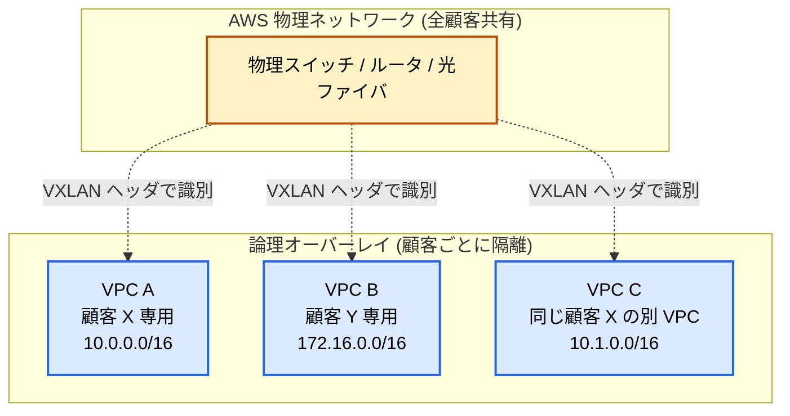

この事実から派生する大事な性質。

- **VPC は「論理的に隔離された L2 / L3 セグメント」** なので、別 VPC とは原則として通信できない (Peering や TGW を張らない限り)
- **CIDR は VPC 作成時に自分で決める**。同じ顧客の別 VPC とも、別顧客の VPC とも、CIDR が被っても物理的には問題ない (隔離されているから)。**ただし TGW / Peering で繋いだ瞬間に被ると死ぬ**
- **MAC アドレスやブロードキャストは仮想化されている**。OS から見ると普通の Ethernet に見えるが、実際は AWS が裏で全部書き換えている

### デフォルト VPC が隠している現実

AWS アカウントを作ると、各リージョンに自動で **デフォルト VPC** が用意される。`172.31.0.0/16` で、各 AZ に Public Subnet が 1 つずつ、IGW も付いてて、Route Table も設定済み。EC2 を「とりあえずポチ」するとここに入る。

便利だが、これは **教材としては有害**。「Public Subnet ってデフォルトでこうなってるんだ」 と勘違いすると、本番で自分で VPC を設計するときに同じ構成にしてしまい、本来 Private に入れるべき DB まで Public 側に置く事故が起きる。

本番用は **必ず自分で VPC を作る** こと。デフォルト VPC は検証用と割り切る。

---

## 2. 物理 NW との対比: なぜ Subnet は AZ をまたげないか

VPC を理解する上で最大の引っかかりがここ。**Subnet は 1 つの AZ に縛られる**。これは仕様であって、AWS の都合ではなく、L3 NW の根本に由来する制約だ。

物理データセンターを思い出す。Subnet (CIDR ブロック) は 1 つのブロードキャストドメイン、つまり 1 つの L2 セグメントに対応していた。VPC でも同じで、Subnet は 1 つの障害ドメイン (AZ) の中に閉じる。

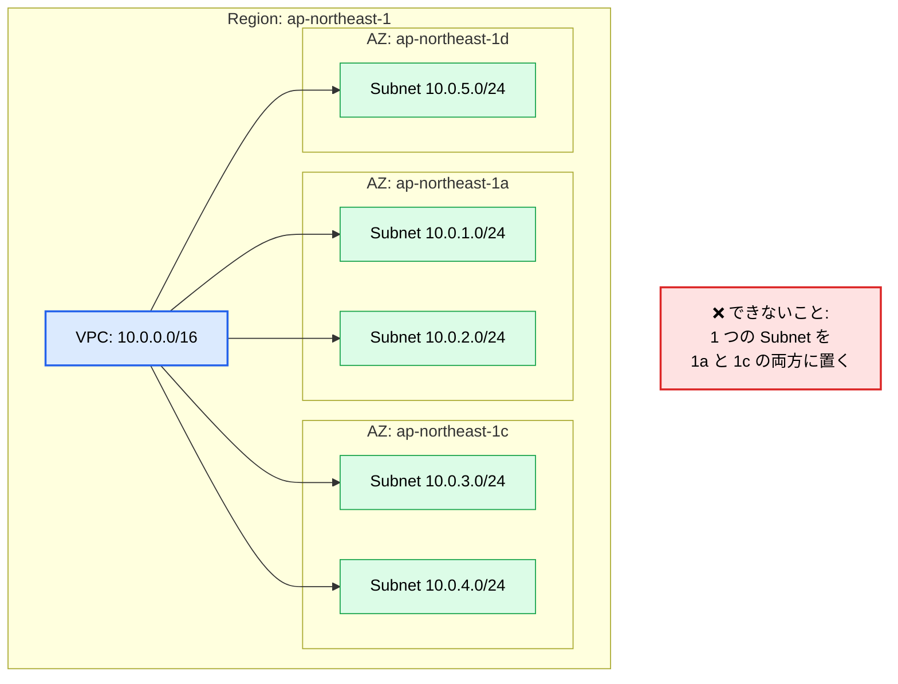

ここから出てくる本番設計の原則。

- **冗長化したいなら最低 2 AZ に Subnet を分ける**。RDS Multi-AZ も ALB も「2 つ以上の Subnet (異なる AZ)」を求める。
- **AZ ごとに `/24` を 2 つ (Public + Private)** が基本パターン。3 AZ で 6 つ Subnet、ここからスタート。
- **AZ 障害でも生き残る設計** をするなら、各 AZ の Subnet にそれぞれ NAT GW を置く (片方 AZ が落ちたとき、もう片方の NAT を共用していたら全滅する)。

### VPC は Region 単位、Region をまたげない

VPC そのものも 1 つの Region に閉じる。`ap-northeast-1` の VPC と `us-east-1` の VPC は別物。リージョン跨ぎで繋ぎたければ:

- **Inter-Region VPC Peering** (1 対 1)
- **Inter-Region Transit Gateway Peering** (Hub-Spoke)
- **PrivateLink Cross-Region** (2024 年 11 月から、12 月に対応 Region を 14 拡張)

このどれかが必要になる。

---

## 3. 構成要素の全体地図

VPC を構成する部品は十数個ある。よく出てくる主要なものを一枚に。

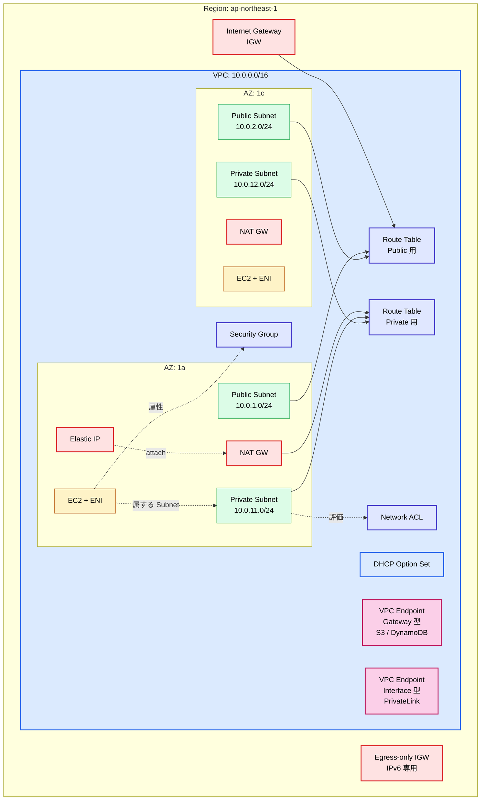

各要素の 1 行説明。

| 要素                   | 何者か                                                                            |
| ---------------------- | --------------------------------------------------------------------------------- |
| **VPC**                | 仮想 NW の外箱。CIDR を 1 つ以上持つ                                              |
| **Subnet**             | VPC を AZ ごとに切った CIDR ブロック                                              |
| **Route Table**        | Subnet ごとの "どの宛先はどこ経由" 表                                             |
| **Internet Gateway**   | VPC と Internet を繋ぐ唯一の "穴"。冗長化済み                                     |
| **NAT Gateway**        | Private Subnet から Internet 方向の通信を肩代わりするマネージド NAT               |
| **Egress-only IGW**    | IPv6 専用の "出るだけ" GW (IPv6 にはプライベートアドレスがないため)               |
| **ENI**                | 仮想 NIC。Instance に 1 個以上付く                                                |
| **Elastic IP (EIP)**   | アカウントに紐づく固定 Public IPv4。ENI / NAT GW に Attach する                   |
| **Security Group**     | ENI に付く Stateful なファイアウォール (Allow only)                               |
| **Network ACL (NACL)** | Subnet 境界の Stateless なファイアウォール (Allow + Deny)                         |
| **DHCP Option Set**    | DNS サーバや NTP の配布設定                                                       |
| **VPC Endpoint**       | VPC から AWS サービスや別 VPC のサービスに、Internet を経由せずアクセスする入り口 |

---

## 4. CIDR 設計: /16 を取る理由と被らせない作法

VPC を作るとき最初に決めるのが **CIDR ブロック**。これを後から大きく変更するのは事実上不可能 (追加はできるが、縮小・付け替えは Subnet ぶち抜きが必要)。

### 使うべき範囲: RFC 1918

VPC の CIDR は **RFC 1918 で定義されたプライベートアドレス空間** から取る。

| ブロック         | 範囲                               | サイズ |
| ---------------- | ---------------------------------- | ------ |
| `10.0.0.0/8`     | `10.0.0.0` 〜 `10.255.255.255`     | /8     |
| `172.16.0.0/12`  | `172.16.0.0` 〜 `172.31.255.255`   | /12    |
| `192.168.0.0/16` | `192.168.0.0` 〜 `192.168.255.255` | /16    |

VPC で指定できる CIDR サイズは **`/16` (65,536 IP) から `/28` (16 IP) の範囲**。本番用なら **`/16` 一択** で良い。理由:

1. Subnet 分割の余地が広い (`/24` を 256 個切れる)
2. 後から TGW で他 VPC と繋いだとき、被らない設計にしやすい
3. `/28` だと 11 IP しか使えない (AWS が `.0` `.1` `.2` `.3` `.255` を予約する)

### Subnet サイズの計算

各 Subnet からも AWS が **先頭 4 つ + 末尾 1 つ = 5 IP を予約** する。`/24` (256 IP) でも実際に使えるのは **251 IP**。

| Subnet 表記 | 全 IP 数 | 使える数 | 用途感                                     |
| ----------- | -------- | -------- | ------------------------------------------ |
| `/28`       | 16       | 11       | NAT GW / Endpoint 専用、小さい用途         |
| `/27`       | 32       | 27       | 軽い ALB Subnet                            |
| `/24`       | 256      | 251      | 標準的な Subnet サイズ                     |
| `/22`       | 1024     | 1019     | EKS の Pod 数が多いクラスタ用              |
| `/20`       | 4096     | 4091     | 大規模 EKS / SageMaker などの ENI 大量消費 |

EKS で Pod 数を確保したい場合、ENI ごとに secondary IP を消費するので **`/24` だとすぐ枯れる**。最初から `/22` 以上にしておくか、`100.64.0.0/10` (RFC 6598 の CGNAT 空間) を secondary CIDR として VPC に追加する手もある。

### 被らせない設計

実務でハマるのが「**全 VPC を `10.0.0.0/16` で作ってしまい、TGW で繋ぐとき全滅**」パターン。最初から組織全体での CIDR 割当ルールを決めておく。

```text
組織全体: 10.0.0.0/8 を使う
├── Prod アカウント
│   ├── ap-northeast-1: 10.0.0.0/16
│   ├── us-east-1:      10.1.0.0/16
│   └── eu-west-1:      10.2.0.0/16
├── Staging アカウント
│   ├── ap-northeast-1: 10.10.0.0/16
│   └── us-east-1:      10.11.0.0/16
└── Sandbox アカウント
    ├── ap-northeast-1: 10.100.0.0/16
    └── 各開発者:        10.100.X.0/24
```

このルール管理を手でやると必ず破綻する。**Amazon VPC IPAM** (IP Address Manager) を使うと、組織全体の IP プールを階層管理して、VPC 作成時に自動で空きを払い出してくれる (後述)。

---

## 5. Subnet の Public/Private は何で決まるか

VPC を触り始めて誰もが引っかかる罠。「Subnet を作るとき "Public" にチェックを入れる場所がないんだけど」。

**そのとおりで、Subnet 自体に Public / Private という属性はない**。Public / Private は **その Subnet の Route Table に IGW へのルートがあるかどうかで結果として決まる呼び方**でしかない。

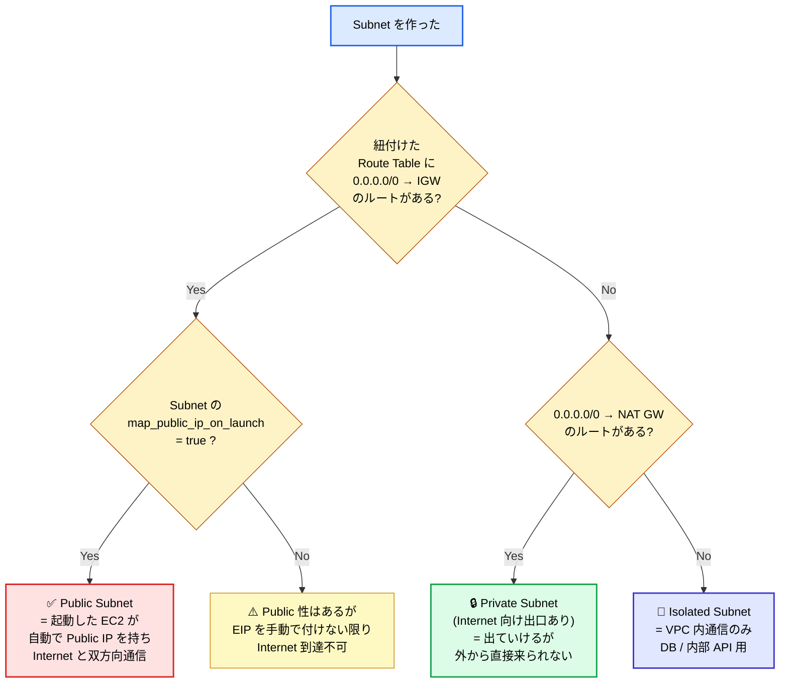

つまり 3 種類ある。

- **Public Subnet**: RT に IGW ルートあり。Web サーバや ALB を置く
- **Private Subnet**: RT に NAT GW ルートあり。アプリケーションサーバ、Lambda の VPC 接続先
- **Isolated Subnet**: RT に Internet 向けルートなし。DB、内部キャッシュ、絶対に外と話させたくないもの

### map_public_ip_on_launch の罠

Subnet には `MapPublicIpOnLaunch` という属性があって、これを `true` にすると、その Subnet に起動した EC2 は **自動で Public IPv4 が割り当てられる**。

デフォルト VPC の Subnet はこれが `true` になっている。だから「とりあえず EC2 を作ったら Public IP が付いてた」 という体験になる。

本番用 VPC ではこれを **基本 false にする**。Public IP が必要なケースは ALB / NAT GW / Bastion などに限られていて、自動付与に頼ると **本来 Private に置くべき DB アプリまで Public IP を持ってしまう** 事故が起きる。

なお、**2024 年 2 月から Public IPv4 は時間課金 ($0.005/h ≒ 月 $3.65)** になった。「使ってない EIP の課金」が「使ってる Public IP の課金」に拡張された形で、Public IP を雑に配ると地味に効いてくる。

---

## 6. Route Table の Longest Prefix Match

Route Table の挙動は **Longest Prefix Match (最長一致)**。複数のルートに合致する場合、より長い (= より具体的な) prefix が勝つ。

例。

```text
10.0.0.0/16   → local        (VPC 内、変更不可)
10.0.5.0/24   → vgw-xxx      (一部だけ VPN 経由)
0.0.0.0/0     → igw-xxx      (それ以外は Internet)
```

宛先 `10.0.5.42` 宛のパケットは、`/24` が `/16` より長いので **VPN 経由** が選ばれる。宛先 `10.0.7.5` は `/16` 一致だけなので local。宛先 `8.8.8.8` はどれにも当たらないので `0.0.0.0/0` で IGW へ。

### local ルートは特別

`10.0.0.0/16 → local` という行は **VPC 作成時に自動で入り、削除も変更もできない**。これがあるおかげで Subnet 同士が無条件に通信できる (NW 経路としては。SG / NACL では止められる)。

### Subnet Route Table と Main Route Table

VPC を作ると自動で「**Main Route Table**」が 1 つできる。Subnet を作った直後はこれが暗黙に紐付く。明示的に別の Route Table を Subnet に紐付ければそちらが使われる。

実務では **Main は触らず、Public 用 RT と Private 用 RT を別に作る** のが定石。Main をデフォルトで Private 構成にしておけば、新規 Subnet が事故で Internet 露出することを防げる。

### Gateway Route Table

IGW にも Route Table を関連付けられる ("Edge Association")。Internet 側から VPC に入ってきたパケットを **特定の ENI (例: Network Firewall) に強制的に通す** 用途に使う。社内 PII を扱う環境で IDS / IPS / WAF を必ず通したいときに重宝する。

---

## 7. Security Group vs NACL 完全比較

VPC のファイアウォールは 2 層構成。**Security Group (SG)** と **Network ACL (NACL)**。両方とも Allow / Deny を書ける NW フィルタだが、性質が根本的に違う。

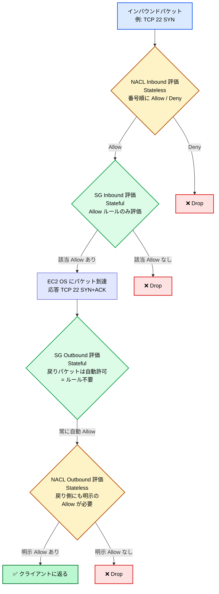

数字で比較するとこう。

| 項目           | Security Group                                | Network ACL                                                      |
| -------------- | --------------------------------------------- | ---------------------------------------------------------------- |
| 取り付け先     | **ENI (≒ Instance)**                          | **Subnet**                                                       |
| 性質           | **Stateful** (戻りパケット自動許可)           | **Stateless** (戻り側も明示ルールが必要)                         |
| ルール種別     | **Allow のみ**                                | **Allow + Deny**                                                 |
| 評価順         | すべてのルールを評価し、いずれか Allow なら可 | **ルール番号の昇順、最初に該当した方が確定**                     |
| デフォルト動作 | 既存 SG: in 全 Deny / out 全 Allow            | デフォルト NACL: in/out 全 Allow                                 |
| ルール数上限   | SG あたり 60 (in/out 各)                      | NACL あたり 20 (in/out 各、引き上げ可)                           |
| 参照可能       | 他 SG ID / Prefix List / CIDR                 | **CIDR のみ**                                                    |
| ログ           | VPC Flow Logs で許否観察                      | 同上                                                             |
| 主な使い分け   | アプリ単位の許可制御 (Web SG が DB SG を許可) | Subnet 全体に対する **明示 Deny** (特定 IP を全力で拒否したい時) |

### SG の核心: Stateful

SG は接続を覚えている。Inbound で TCP 22 SYN を Allow したら、その応答 (SYN+ACK) は Outbound ルールが何も無くても自動で通る。**戻り側のルールを書く必要がない**。これが圧倒的に楽。

実務では SG は **ID 同士の参照** が決め手。

```text
Web-SG:
  Inbound: 0.0.0.0/0 から TCP 443 Allow

App-SG:
  Inbound: Web-SG から TCP 8080 Allow

DB-SG:
  Inbound: App-SG から TCP 5432 Allow
```

これで Web → App → DB という階層が成立する。CIDR を一切書かずに、SG ID を参照するだけで階層 NW が組める。

### NACL の核心: Stateless

NACL は接続を覚えない。Inbound で TCP 22 を許可しても、応答パケットの **Outbound ルールも明示で必要**。具体的には **エフェメラルポート範囲** (Linux なら `32768-60999`) を Allow しないと SSH すら成立しない。

```text
Inbound:
  100: TCP 22         from 0.0.0.0/0  ALLOW
  *  : ALL            from 0.0.0.0/0  DENY

Outbound:
  100: TCP 32768-65535 to 0.0.0.0/0  ALLOW  ← これがないと応答が返らない
  *  : ALL             to 0.0.0.0/0  DENY
```

NACL を厳密化したいなら、ステートフルなフィルタは SG に任せて、NACL は **「ブラックリスト」用途** (特定 IP ブロックを全力 Deny) に限定するのが運用上ラク。

### 評価の順番

パケット 1 つの流れで言うと:

1. NACL inbound (Subnet 境界)
2. SG inbound (ENI)
3. OS で処理
4. SG outbound (Stateful なので戻りは自動)
5. NACL outbound (Subnet 境界、これも明示必要)

**どっちか片方でも Deny したら通らない**。両方 Allow が必要。

---

## 8. ENI と Instance の関係

ENI (Elastic Network Interface) は **仮想 NIC**。EC2 Instance に最低 1 個 (Primary ENI) が必ず付き、Instance Type に応じて **追加 ENI を複数付けられる**。

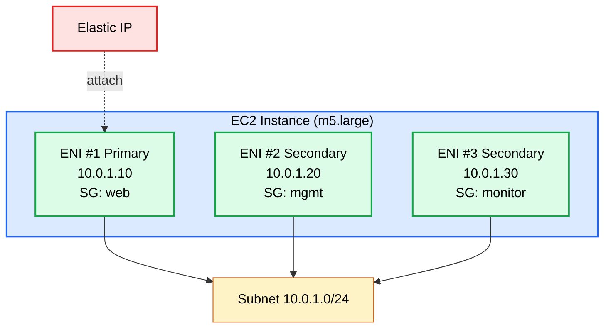

押さえどころ。

- **ENI ごとに別々の SG を付けられる**。1 つの Instance に「外向き ENI (web SG)」と「管理用 ENI (mgmt SG)」を分けるパターンが取れる
- **ENI ごとに secondary IP を複数持てる**。EKS の Pod IP はこの仕組みで Node に割り当てている (VPC CNI が ENI 経由で複数 IP を払い出す)
- **ENI 単体で Detach / 別 Instance に Attach 可能**。古典的 HA で「IP を引き継ぐ」 用途
- ENI は EIP / Public IPv4 / IPv6 / DNS 名・MAC アドレスを保持する **NW 状態の本体**
- Instance を Terminate しても、Detach した ENI は残せる

「Instance に IP がある」 と思いがちだが、**Instance には IP は無く、ENI が IP を持つ**。Instance はその ENI に紐付いているだけ、という見方をするとマネージドサービスの挙動 (NAT GW も Lambda も RDS も ENI を生やす) が腑に落ちる。

---

## 9. NAT Gateway / NAT Instance / Egress-only IGW

Private Subnet から Internet 方向に通信を出したい (`apt update` したい、外部 API を叩きたい) ときに必要なのが NAT。3 種類ある。

| 種類                | 何者か                                                  | 帯域                     | 冗長性                  | 料金 (us-east-1)                              |
| ------------------- | ------------------------------------------------------- | ------------------------ | ----------------------- | --------------------------------------------- |
| **NAT Gateway**     | AWS マネージド NAT                                      | 最大 100 Gbps (Scale 後) | AZ 内 HA、AZ 跨ぎは別途 | **$0.045/h + $0.045/GB 処理**                 |
| **NAT Instance**    | NAT を自前で動かす EC2                                  | Instance Type 次第       | 自前で組む              | EC2 課金のみ (小さい用途なら NAT GW より安い) |
| **Egress-only IGW** | **IPv6 専用** の "出るだけ" GW (返りは通すが入りはダメ) | 制限なし                 | 完全マネージド          | **無料**                                      |

### NAT Gateway: 速いが高い

NAT GW は **作って Route Table に `0.0.0.0/0 → nat-xxx` を書けば終わり**。Zonal リソースなので、HA を組むなら **各 AZ に 1 つずつ**置く。

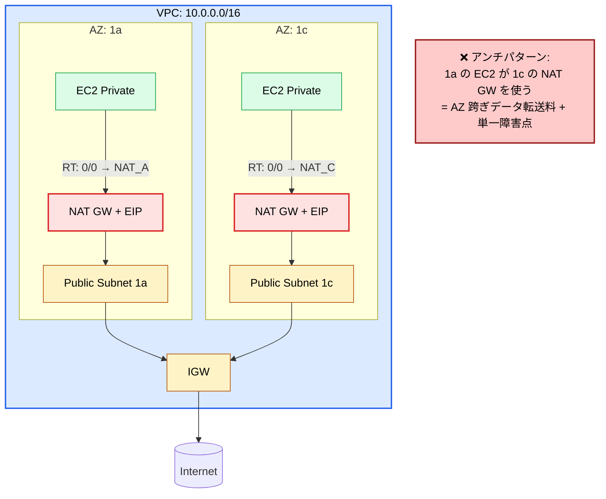

**$0.045/h は時間で 24h × 30 日 = 約 $33/月**。さらに **データ処理料金 $0.045/GB**。Web アプリで毎日 100 GB ぐらい上り下りするなら、月に $135 のデータ処理料が乗る。「Private Subnet に置いた Lambda が S3 を毎日 1 TB 読む」 みたいな使い方をすると、**NAT GW の料金が S3 ストレージの数倍になる** ことすらある。これは VPC Endpoint で回避する (次章)。

### Regional NAT Gateway (2025 年 11 月新機能)

2025 年 11 月に **Regional NAT Gateway** が GA。1 つのリソースとして作成すれば、**AWS が自動で各 AZ に NAT を展開・縮退してくれる** (automatic モード)。Route Table は 1 個でよく、AZ ごとに別 NAT を運用する手間が減る。GovCloud / 中国を除く全 Region で利用可能。

料金は **AZ ごとに $0.045/h が発生する** (なので AZ 3 個なら結局 $0.135/h)。「マネジメントの手間 vs 料金」 のトレードオフで、運用負荷を減らしたいなら Regional、コスト最適化したいなら従来の AZ 別 NAT を維持。

### NAT Instance はもう原則使わない

NAT Instance は VPC 黎明期の選択肢で、t3.nano に専用 AMI を入れて NAT を動かす。今でも **超低トラフィック (帯域 Mbps 単位)** ならコスト面で勝てるが、HA 設計 / Source/Dest Check 無効化 / SG 管理が面倒で、コスト差を吸収できない。**特別な理由がない限り NAT GW**。

### Egress-only IGW: IPv6 の世界

IPv6 にはプライベートアドレス空間 (RFC 1918 相当) がなく、AWS が VPC に割り当てる IPv6 はすべてグローバル。これだと「Private Subnet から外には出たいが、外から入って来られたくない」 が NAT 無しでは実現できない。

そのために用意されているのが **Egress-only IGW**。IPv6 専用で、Stateful に「出るパケットは通すが、外発の入りは弾く」 動作をする。**完全無料**。

```text
Route Table (IPv6 Private 用):
  ::/0  →  eigw-xxx
```

---

## 10. VPC Endpoint: Gateway vs Interface

「Private Subnet の Lambda から S3 を読む」とき、何が起きるか。

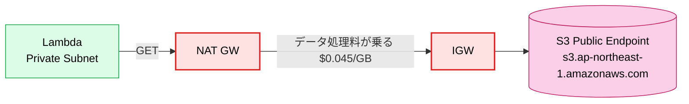

S3 は Public Endpoint で公開されているので、Private Subnet からは **NAT GW を経由して Internet に出てから S3 に届く**。100 GB 読むと NAT GW のデータ処理料 $4.5 + Egress 料がかかる。S3 と AWS の内部 NW で繋がっているのに、わざわざ Internet を一周する **無駄な構成**。

これを回避するのが **VPC Endpoint**。**「VPC から AWS サービスや別 VPC のサービスへ、Internet を経由せず直結する入り口」**。2 種類ある。

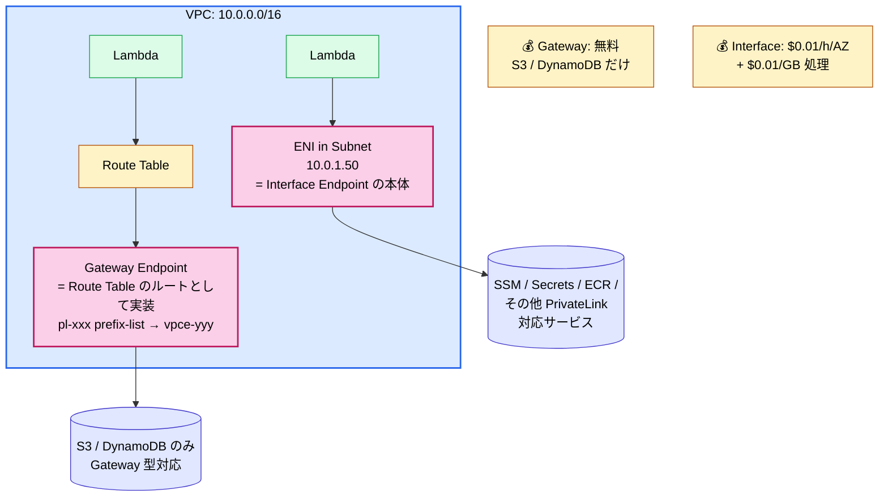

### Gateway Endpoint (S3 / DynamoDB 専用)

実体は **Route Table のルート**。 `Prefix List ID (pl-xxx) → Endpoint ID (vpce-yyy)` という形で書かれて、宛先 IP が S3 / DynamoDB の Public Endpoint だった場合に AWS 内部 NW で直接送る。

- **完全無料**
- ENI を作らない (RT エントリだけ)
- 対応サービス: **S3 と DynamoDB のみ**
- 同一 Region 内のみ (Cross-Region 不可)

S3 / DynamoDB を Private Subnet から使うなら **必ず Gateway Endpoint を作る**。これだけで NAT GW のデータ処理料が消える。

### Interface Endpoint (PrivateLink)

実体は **Subnet 内に作られる ENI**。 例えば SSM Endpoint を作ると、各 AZ の Subnet に ENI が 1 個ずつ生え、Private DNS で `ssm.ap-northeast-1.amazonaws.com` がその ENI の IP を返すようになる。

- **時間課金 $0.01/h/AZ + データ処理 $0.01/GB**
- AZ 3 つで作ると **$0.03/h ≒ 月 $22** が固定で出る
- 対応サービスは数十個 (SSM, Secrets Manager, KMS, ECR, STS, Lambda, etc.)
- 自分で作った VPC 内サービスを別アカウントに **PrivateLink で公開** することもできる (Service Provider 側で NLB + Endpoint Service を作る)

Interface Endpoint は **時間課金が常に発生する**ので、使ってないのに作りっぱなしだと地味に効く。「とりあえず全部の AWS サービスの Endpoint を作っとく」 をやると 1 VPC で月 $300+ になる。本当に Private Subnet から使うサービスに絞ること。

### コスト比較: 100 GB を S3 から取る場合

| 経路                      | 月額試算                       |
| ------------------------- | ------------------------------ |
| **NAT GW 経由**           | NAT GW $33 + 処理 $4.5 = $37.5 |
| **Gateway Endpoint 経由** | **$0** (Endpoint 自体無料)     |

**S3 / DynamoDB を Private Subnet から使うなら Gateway Endpoint は必須**。設定 1 分でこれだけ効くので、やらない理由がない。

---

## 11. VPC Peering vs Transit Gateway

VPC 同士を繋ぐ手段は主に 2 つ。**VPC Peering** と **Transit Gateway (TGW)**。

### VPC Peering: 1 対 1

VPC Peering は **2 つの VPC を 1 対 1 で直結**する。同一アカウント・別アカウント・別 Region すべて対応 (Inter-Region Peering)。

**致命的な制約: Transitive (推移的) 通信ができない**。A-B と B-C で Peering を張っても、A から C に通信は行かない。3 VPC を相互通信させたいなら **3 本** の Peering が要る。N 個の VPC を全結合するなら `N×(N-1)/2` 本。10 個で 45 本。狂気。

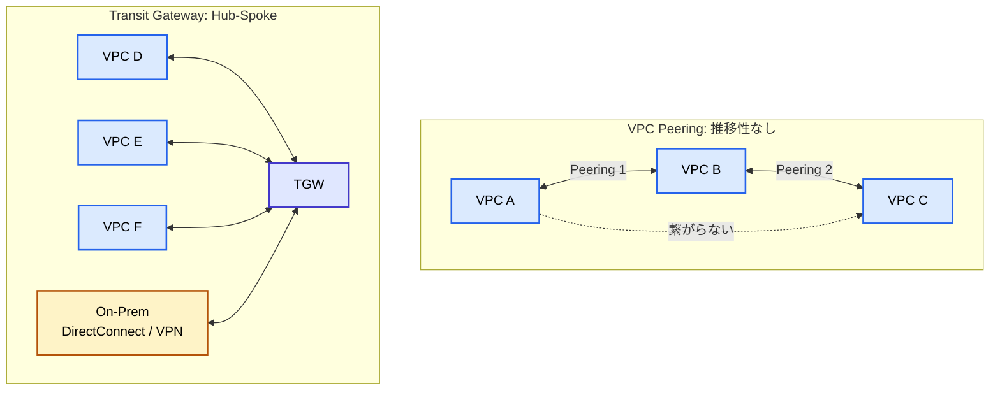

### Transit Gateway: Hub-Spoke

TGW は **VPC ハブ**。VPC を TGW に Attach するだけで、TGW 経由で他の Attach 済み VPC と通信できる。Direct Connect / VPN もハブ。

- **N 個の VPC で N 本の Attach** だけで全結合 (Route Table 設計次第)
- **Cross-Region TGW Peering** で複数 Region をハブで繋げる
- **Route Table を複数持てる**ので、「Prod VPC からは Shared VPC のみ見える」 みたいな分離ができる
- **転送する全データに料金がかかる** ($0.02/GB)
- VPC Attachment ごとに **$0.05/h**

### 使い分け

| 状況                                              | 推奨                                |
| ------------------------------------------------- | ----------------------------------- |
| VPC 数が 2 〜 3 個、固定的                        | **VPC Peering**                     |
| VPC 数が 5 個以上、増減する                       | **Transit Gateway**                 |
| オンプレ / Direct Connect / VPN もまとめたい      | **Transit Gateway**                 |
| 別 Region と繋ぎたい (シンプル接続)               | Inter-Region Peering or TGW Peering |
| Application 層 (HTTP) で繋ぎたい、IP の重複は許容 | **VPC Lattice** (後述)              |

「最初は Peering で良いが、3 個目を作ろうとした瞬間に TGW を真剣に検討する」 が判断基準。VPC Peering で 5 VPC 全結合 (= 10 本) を運用してる現場、だいたい不幸になっている。

---

## 12. 2024 〜 2026 年のアップデート

VPC は枯れたサービスに見えて、2026 年現在もアップデートが活発。押さえておくべきものを 4 つ。

### IPAM (IP Address Manager)

組織横断で IP プールを階層管理するサービス。2021 年 re:Invent 登場、2026 年現在は **VPC 作成時の自動払い出し** と **使用率の可視化**が安定運用に欠かせない。

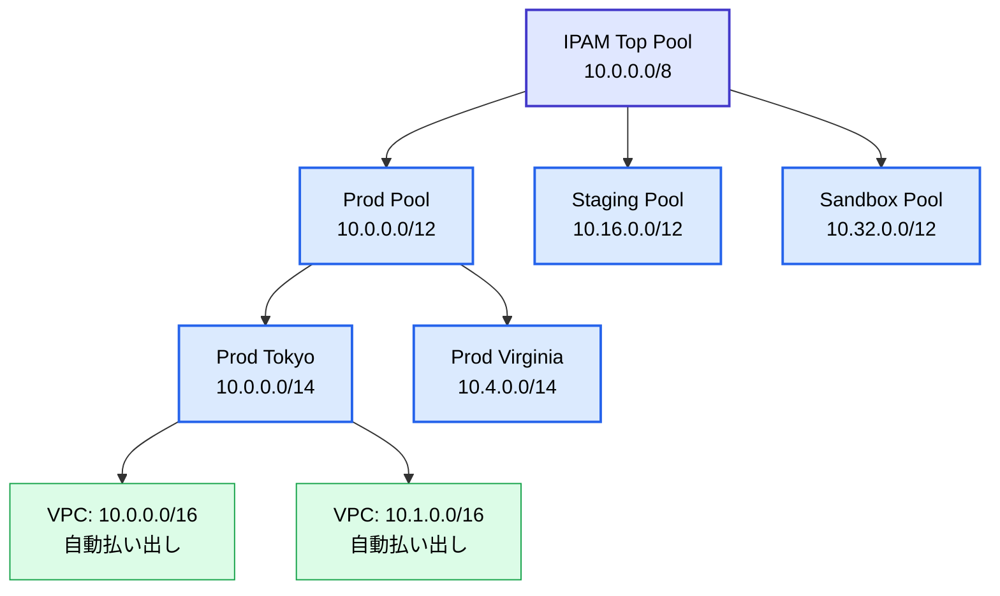

2025 年 10 月に **Prefix List Resolver (PLR)** が追加されて、IPAM が把握している IP 情報を Security Group や Route Table の Prefix List に自動同期できるようになった。2026 年 1 月には **RDS / ALB の Public IPv4 割り当てポリシー** にも IPAM が拡張。要は **「VPC だけでなく VPC 内の主要リソースの IP まで IPAM が一元管理する」**方向に進んでいる。

### VPC Lattice

2023 年 3 月 GA。2024 年 9 月から App Mesh の新規受付が停止され、**App Mesh は 2026 年 9 月 30 日で完全終了**。EKS からの移行先として AWS が公式に VPC Lattice を推奨している (ECS は ECS Service Connect も選択肢)。

VPC Lattice は **Layer 7 のアプリケーションネットワーキング**。VPC や Account を跨いで「サービス」同士を HTTP / gRPC レベルで繋ぐ。

- **IP の重複を気にしない** (NAT を裏で持っている)
- **IAM 認証で Service-to-Service AuthN/AuthZ**
- **Weighted Routing (Blue/Green、Canary)**
- **PrivateLink の集約パターン** にも使える (中央集約 Endpoint を Lattice 経由で配布)

「TGW でフラットに繋ぐより、サービス単位で接続を制御したい」 マイクロサービス向け。2026 年は **EKS / Lambda / EC2 / Fargate を横断する標準** として推されている。

### Regional NAT Gateway

前述。2025 年新機能。AZ 跨ぎを AWS が裏で吸収して 1 つの論理 NAT として扱う。多 VPC 環境で運用負荷を下げたいときに。

### Public IPv4 課金 (2024 年 2 月開始)

「使ってる Public IPv4」 にも時間課金 $0.005/h が乗るようになった。**IPv6 への移行圧力** と読むのが正しい。本番設計では **IPv6 を最初から有効化** しておくのが現代的。Egress-only IGW は無料、ALB / NLB は IPv6 対応、ECS / Lambda も IPv6 で通信できる。

### PrivateLink Cross-Region (2024 年 11 月開始)

PrivateLink がリージョン跨ぎに対応 (2024 年 11 月初期 7 Region、12 月に 14 Region 追加)。**Inter-Region Peering や TGW Peering を組まずに、別 Region の AWS マネージドサービスを Private に呼べる**。Multi-Region 設計の運用負荷を大幅に下げる。

---

## 13. 料金の罠

VPC 自体は無料。だが「VPC 周辺の部品」がよくお金を吸う。代表的なところ。

```mermaid
graph TB
    Free[✅ 無料<br/>VPC / Subnet / RT / SG / NACL<br/>Internet Gateway<br/>Egress-only IGW<br/>Gateway Endpoint S3/DDB<br/>BYOIP]

    Hourly[💰 時間課金 (使ってないのに課金)<br/>NAT Gateway $0.045/h/AZ<br/>Interface Endpoint $0.01/h/AZ<br/>Public IPv4 $0.005/h<br/>Unattached EIP $0.005/h<br/>Transit Gateway Attachment $0.05/h]

    Data[💰 データ処理料 (使った分だけ)<br/>NAT GW $0.045/GB<br/>Interface Endpoint $0.01/GB<br/>TGW $0.02/GB<br/>VPC Peering Inter-Region: 通常の Egress 料金<br/>AZ 跨ぎ転送 $0.01/GB IN+OUT]

    Out[💰 外向き Egress 料金<br/>Internet 向け最大 $0.09/GB<br/>(階段制で大量なら下がる)]

    classDef free fill:#dcfce7,stroke:#16a34a,color:#000,stroke-width:2px
    classDef warn fill:#fef3c7,stroke:#b45309,color:#000,stroke-width:2px
    classDef hot fill:#fee2e2,stroke:#dc2626,color:#000,stroke-width:2px
    class Free free
    class Hourly,Data warn
    class Out hot
```

罠ベスト 5。

1. **使ってない EIP の課金**: アタッチされてない EIP は **$0.005/h ≒ 月 $3.65**。10 個放置すれば月 $36。
2. **Interface Endpoint を全部作る**: 1 個 3 AZ で月 $22。20 個作って月 $440。本当に Private Subnet から使うものに絞る。
3. **NAT GW を AZ 跨ぎで共用**: 例えば 1a の EC2 が 1c の NAT GW を使うと、**AZ 跨ぎ転送料 $0.01/GB (in+out で $0.02)** が乗る。各 AZ に NAT を置けば局所通信になって安い。
4. **S3 を NAT GW 経由で読む**: Gateway Endpoint を作るだけで $0/GB。やらないと $0.045/GB。
5. **不要な Public IPv4**: 自動付与が ON のままで、ALB / NAT / Bastion 以外の Instance にも付いてる。月 $3.65/個 × Instance 数。

---

## 14. まとめ

- VPC は **物理 NW の上に重ねたソフトウェア定義の仮想 NW** (オーバーレイ)
- Subnet は **1 AZ に縛られる**: 冗長化は複数 Subnet を異なる AZ に
- Subnet の Public / Private は **Route Table のルートで結果として決まる** (属性ではない)
- Security Group は **Stateful + Allow only + ENI 単位**、NACL は **Stateless + Allow/Deny + Subnet 単位**
- ENI が IP の本体、Instance は ENI に紐付くだけ
- Private から Internet は **NAT GW (IPv4) / Egress-only IGW (IPv6)**
- S3 / DynamoDB は **必ず Gateway Endpoint** (無料、NAT GW 料が消える)
- VPC 同士は Peering (1 対 1、非推移) / TGW (Hub-Spoke、拡張可能)
- 2024 〜 2026 年の動向: **Public IPv4 課金 (2024/02)、PrivateLink Cross-Region (2024/11)、Regional NAT GW (2025/11)、IPAM Prefix List Resolver (2025/10)、IPAM RDS/ALB ポリシー (2026/01)、VPC Lattice (2023/03 GA, App Mesh は 2026/09 終了)**
- 料金は **NAT GW、Interface Endpoint、Public IPv4、EIP、TGW Attachment** の時間課金に注意

VPC 設計は「最初に決めて、後から直せない」 ことが多い (CIDR、Subnet 構成、IPAM 階層)。雰囲気で `/16` を取らず、**組織全体での IP 設計とアカウント分割を IPAM に書いてから VPC を作る** 順番がベスト。
