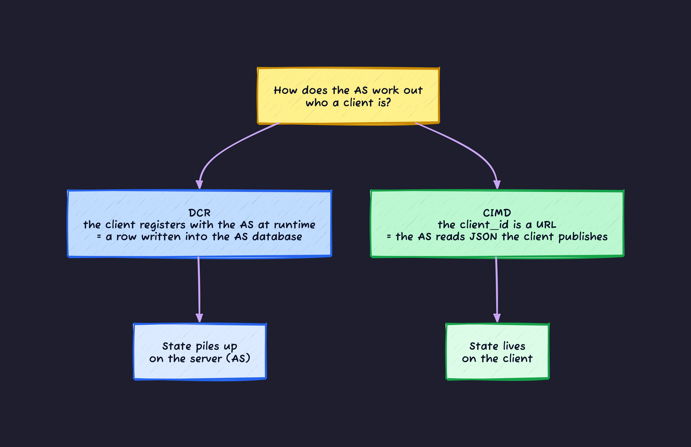
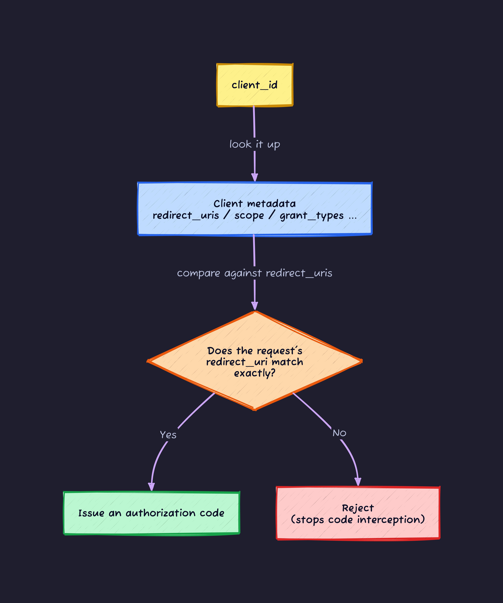
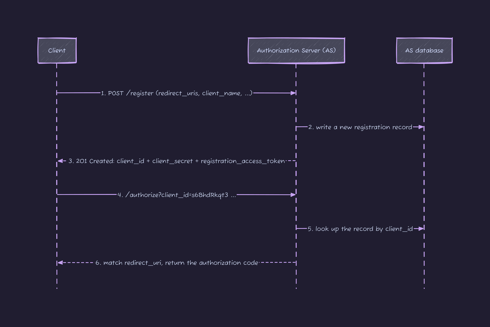
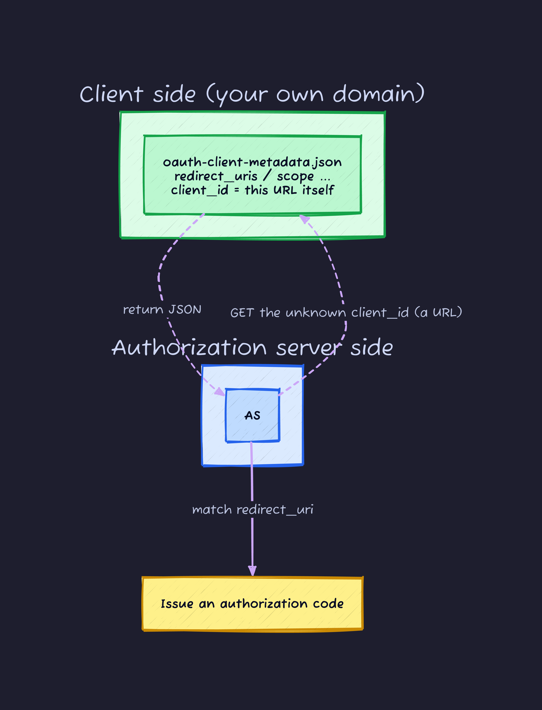
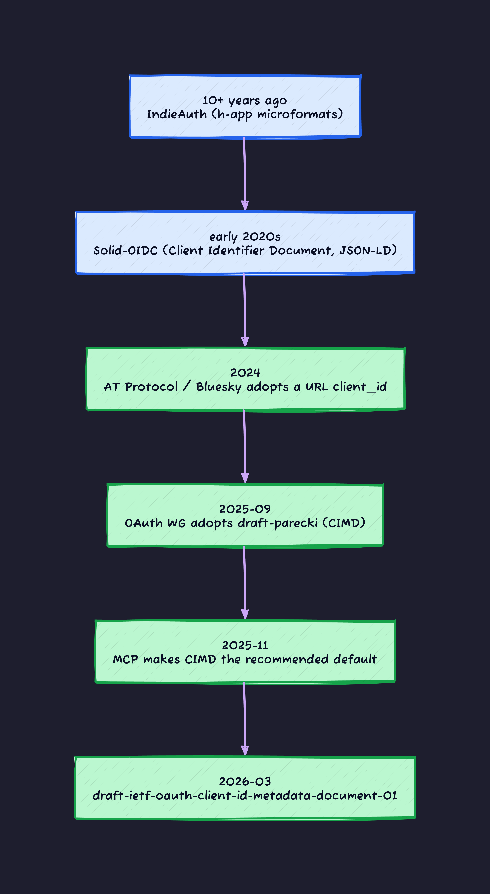
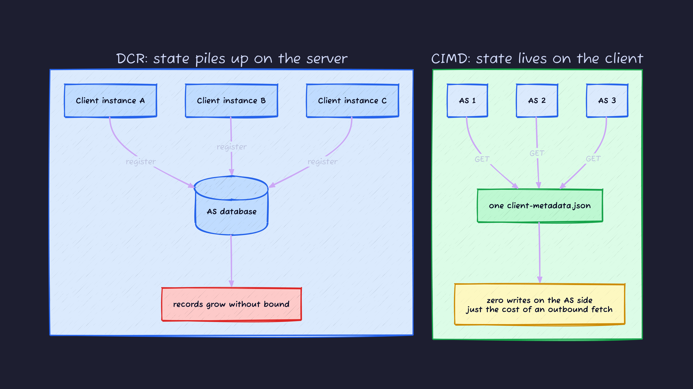
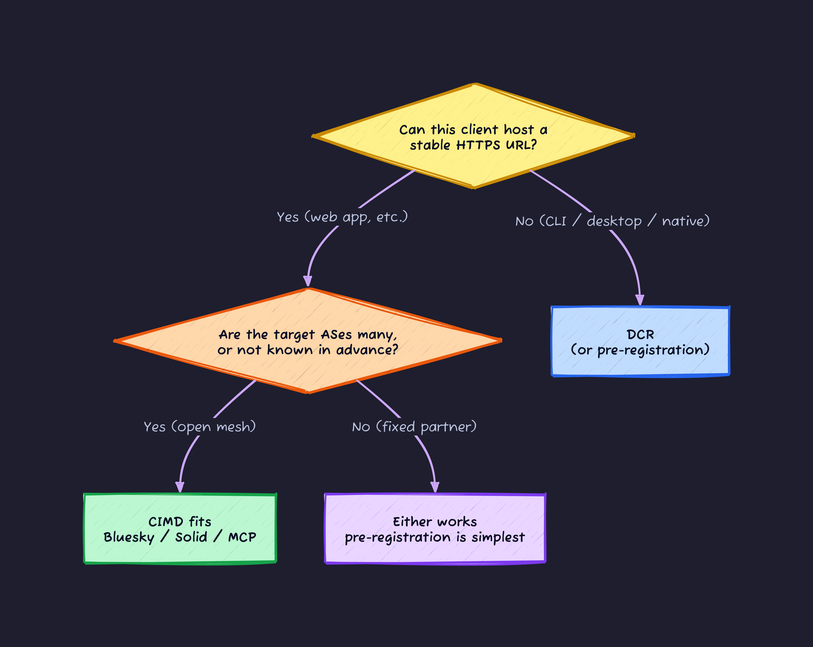

## The "who is this client?" problem

In OAuth, the part that bites you is often not user authentication but **client authentication**.

An OAuth authorization flow has three parties: the **user** who owns the resource, the **authorization server (AS)** that guards it, and the **client** (the app) that wants to act on the user's behalf. The user proves who they are at a login screen. The client cannot do that on its own. Unless the AS already knows something about the client, it has no way to check whether the app sending this request is really the app it claims to be.

That is why OAuth has always had a **client registration** step. The app developer registers in the AS's dashboard ("this is my app, here is where it redirects") and gets back an identifier called a `client_id`. The client attaches that `client_id` to its authorization requests, and the AS recognizes "ah, that registered app."

The problem is that **the world where pre-registration is even possible is shrinking**.

- **Bluesky / AT Protocol**: a user's data lives on one of countless servers (PDSes) scattered across the network. A client app cannot know in advance which server it will talk to, so registering with all of them is out of the question.
- **MCP (Model Context Protocol)**: an AI agent connects to arbitrary MCP servers. There are countless servers and the set keeps growing.
- **Fediverse (Mastodon and friends)**: thousands of self-hosted instances, any of which might be the counterparty.

In these "open meshes with no single AS," the classic pre-registration model falls apart. Two mechanisms emerged in response.

1. **DCR (Dynamic Client Registration, RFC 7591)**: the client registers itself with the AS at runtime. A record gets written into the AS's database.
2. **CIMD (Client ID Metadata Document)**: the `client_id` *is* an **HTTPS URL**. The AS goes and reads that URL. Nothing is written on the AS side.

This article lays the two out so you can read top to bottom and follow the reasoning. We start from the basics of OAuth client registration, walk through how DCR works and where it hurts, and then see what CIMD's "URL = client_id" idea actually solves.



---

## Background: what client_id and redirect_uri are for

Before comparing CIMD and DCR, it helps to be clear on why `client_id` exists at all. If that is fuzzy, the rest of the comparison goes fuzzy too.

In the OAuth 2.0 authorization code flow, the browser sends a request like this to the AS's authorization endpoint.

```text
GET /authorize?response_type=code
  &client_id=s6BhdRkqt3
  &redirect_uri=https://app.example.com/callback
  &scope=read
  &state=xyz HTTP/1.1
Host: as.example.com
```

Two things matter here.

- **`client_id`**: the identifier for which client this is. The AS uses it to look up the registration.
- **`redirect_uri`**: the URL the authorization code is returned to. The AS always checks this against **the URL registered ahead of time, requiring an exact match**.

The `redirect_uri` check is decisive because if an attacker could swap it freely, they could have the issued authorization code delivered to their own server. So **"how does the AS learn the legitimate redirect_uri tied to a `client_id`"** is the real job of client registration.

DCR and CIMD are both answers to that same question, "how do you establish the mapping from `client_id` to the legitimate redirect_uri (and the rest of the metadata)," approached from different angles.



Read "DCR or CIMD" as a difference in **where the `client_id` to metadata arrow is stored, and who supplies it**.

---

## The classic approach: Dynamic Client Registration (DCR, RFC 7591)

### How it works

DCR is standardized in [RFC 7591](https://www.rfc-editor.org/rfc/rfc7591). The idea is simple: **take the registration a human used to do in a dashboard and automate it over an API**.

The client POSTs JSON to the AS's **registration endpoint**.

```text
POST /register HTTP/1.1
Content-Type: application/json
Host: as.example.com

{
  "redirect_uris": ["https://app.example.org/callback"],
  "client_name": "My Example Client",
  "token_endpoint_auth_method": "client_secret_basic",
  "logo_uri": "https://app.example.org/logo.png",
  "jwks_uri": "https://app.example.org/keys.jwks"
}
```

The AS takes this, **creates a new registration record in its own database**, and hands back a `client_id` (and, for confidential clients, a `client_secret`).

```text
HTTP/1.1 201 Created
Content-Type: application/json

{
  "client_id": "s6BhdRkqt3",
  "client_secret": "cf136dc3c1fc93f31185e5885805d",
  "client_id_issued_at": 2893256800,
  "client_secret_expires_at": 2893276800,
  "redirect_uris": ["https://app.example.org/callback"],
  "grant_types": ["authorization_code", "refresh_token"],
  "token_endpoint_auth_method": "client_secret_basic"
}
```

From here the client uses its issued `client_id` to run authorization flows as usual. Updating or deleting the registration is handled by the sibling spec [RFC 7592](https://www.rfc-editor.org/rfc/rfc7592.html) (the management protocol). RFC 7592 also returns a `registration_access_token` and a `registration_client_uri` at registration time, and the client uses those two to GET / PUT / DELETE its own record.



### Where DCR hurts

DCR works well when a client can hold a one-to-one relationship with an AS. The trouble starts when you drop it into one of the open meshes from the intro.

- **State explosion**: one record per client instance, per counterparty server. The same app on Windows and macOS becomes two records; a hundred thousand users becomes a hundred thousand records. The AS database grows without bound.
- **Garbage registrations accumulate**: records used once, or belonging to apps that no longer exist, never get garbage-collected. Revocation is mostly manual.
- **Registration endpoint abuse and DoS**: open registration (anyone can register) lets an attacker mint records en masse. Preventing that needs an **initial access token** or a **software statement** (`software_statement`, a signed JWT) to gate registration, which reintroduces the "hand something out in advance" coordination and takes away much of the appeal of being dynamic.
- **Weak client-identity assurance**: DCR itself does not verify that the app is who it says it is. Both `client_name` and `logo_uri` are self-asserted. That is fertile ground for consent phishing on the authorization screen.

In short, DCR assumes you **write state on the server side**, and the cost and lifecycle of that state break down in an open world.

---

## A different idea: Client ID Metadata Document (CIMD)

### The core idea: make client_id a URL

CIMD's idea fits in one line.

> **Make the `client_id` the HTTPS URL where the metadata JSON lives.**

So it looks like this.

```text
client_id = https://app.example.com/oauth-client-metadata.json
```

The client does not pre-register. Instead it puts its metadata (the same `redirect_uris` and so on it used to POST under RFC 7591) into a JSON file and **hosts it at a URL it controls**. In the authorization request it passes that whole URL as the `client_id`.

When the AS receives a `client_id` it has never seen, it **goes and reads that URL** to obtain the metadata. Nothing is written on the AS side. All the state lives in the document the client publishes.



A database write became "GET a URL once." That is the whole shape of CIMD.

### Where this idea came from

"Use a URL as an identifier" is not new. The decentralized web has leaned on it for over a decade. The CIMD draft itself explicitly credits **IndieAuth, Solid-OIDC, and OpenID Federation** as prior art.

- **IndieAuth** (IndieWeb): has identified clients by URL for 10+ years. It first fetched the `client_id` URL and read HTML microformats (`h-app`), then moved to JSON metadata.
- **Solid-OIDC** (Tim Berners-Lee's Solid project): puts a Client Identifier Document, in JSON-LD, at a client-controlled URL. This is the **direct ancestor** of CIMD.
- **AT Protocol / Bluesky**: adopted URL-based `client_id` in its OAuth profile in 2024, explicitly citing the draft (draft-parecki).
- **MCP (Model Context Protocol)**: in the 2025-11-25 spec, made **CIMD the recommended default (`SHOULD`)** and demoted DCR to `MAY`. That is what accelerated the IETF discussion.

The authors are **Aaron Parecki (Okta)** and **Emelia Smith**. Smith comes from the fediverse side, and the fediverse motivation ("an app connects to whatever self-hosted server it finds") is part of CIMD's background. Note that Mastodon itself still uses the DCR-style `POST /api/v1/apps` and has not shipped CIMD.



---

## CIMD mechanics in detail

From here I follow the normative text of [draft-ietf-oauth-client-id-metadata-document](https://datatracker.ietf.org/doc/draft-ietf-oauth-client-id-metadata-document/) (latest is -01, published March 2026 as of June 2026).

### 1. Rules for the client_id URL

The URL you use as `client_id` has constraints (draft Section 3).

- **Must use the `https` scheme** (`http` is not allowed).
- **Must contain a path component** (e.g. `/oauth-client-metadata.json`). A host-only URL is not allowed.
- Must not contain single-dot or double-dot path segments.
- **Must not contain a fragment** (`#...`).
- Must not contain a username or password (`user:pass@`).
- A query string is discouraged but allowed. A port is allowed.

Short, stable URLs are recommended.

### 2. The self-reference rule (the anti-impersonation linchpin)

The document **must contain a `client_id` property whose value matches the document URL by simple string comparison** (Section 4.1). It must also be served with HTTP **200 OK**.

```json
{
  "client_id": "https://app.example.com/oauth-client-metadata.json",
  "...": "..."
}
```

This "the URL and the document's `client_id` agree" is the backbone of CIMD's security. Why? Because **only whoever controls a domain can put content on it**. So the only party that can claim a `client_id` of `https://app.example.com/...` is the party that actually controls `app.example.com`. If an attacker spoofs `https://app.example.com/...` as a `client_id`, fetching that URL returns the real document, the contents do not match, and it gets rejected. **Domain control is the proof of identity.**

### 3. Fields you can put in the document

The metadata vocabulary is **the same as RFC 7591 (DCR) client metadata**: `redirect_uris`, `scope`, `grant_types`, `response_types`, `client_name`, `client_uri`, `logo_uri`, `jwks` / `jwks_uri`, and so on. Think "take what you used to POST under DCR and publish it as a file."

There are forbidden fields, though.

- `client_secret` and `client_secret_expires_at` (the document is public, so you cannot put a secret in it).
- The `token_endpoint_auth_method` values `client_secret_post` / `client_secret_basic` / `client_secret_jwt` (no authentication based on a shared symmetric secret).

### 4. How the AS fetches

- The AS **should (SHOULD)** fetch the URL indicated by the `client_id`.
- It **must not (MUST NOT)** automatically follow HTTP redirects while fetching. This closes off SSRF via a redirect to an internal IP (more below).
- It may cache (MAY). It should respect HTTP cache headers (SHOULD). It **must not (MUST NOT)** cache error responses. The cache key is the URL.

### 5. redirect_uri validation

The AS must require redirect URIs to be registered (MUST), and must require the request's `redirect_uri` to be **an exact match of one of the `redirect_uris` in the document** (MUST, Section 4.5). The AS may additionally constrain `redirect_uris` to the domain of `client_id` / `client_uri` (Section 6.1). The "exact redirect_uri match" from the background section is doing its work here too.

### 6. Public clients, and going confidential

Because the document is public, a CIMD client is fundamentally a **public client**. It cannot hold a `client_secret`.

If you still want to behave as a confidential client, you **publish a public key in the metadata (`jwks` / `jwks_uri`) and authenticate with `private_key_jwt` (asymmetric)** (Section 6.2). The private key never appears in the public document, so it works out safely. Bluesky's confidential clients use exactly this (ES256 + `private_key_jwt`).


---

## DCR vs CIMD, head to head

Here is the mechanics so far in a table. The thing to watch is the symmetry between **"where the state lives"** and **"what infrastructure burden it puts on the AS."**

| Axis                | CIMD                                                                                 | DCR (RFC 7591 / 7592)                                                        |
| ------------------- | ------------------------------------------------------------------------------------ | ---------------------------------------------------------------------------- |
| Where state lives   | JSON at a client-hosted URL                                                          | A row in the AS database                                                     |
| What `client_id` is | The HTTPS URL itself                                                                 | An opaque string minted by the AS                                            |
| Basis of trust      | **Domain control** + exact redirect_uri match                                        | An AS-issued record (optionally a software statement / initial access token) |
| AS infra burden     | **Outbound HTTP** (fetch + cache)                                                    | **Write storage** + lifecycle management                                     |
| Secrets             | None by default (public client). Confidential via `private_key_jwt` + published JWKS | Can issue a `client_secret` (confidential client)                            |
| Revocation          | Take down / change the document + cache expiry                                       | DELETE the registration record (RFC 7592)                                    |
| Rotation            | Edit the document (swap the JWKS, etc.)                                              | AS-driven secret / token rotation                                            |
| Portability         | One document serves every AS and every instance                                      | One registration per (instance x AS)                                         |
| Main failure mode   | **Availability coupling** (document host down means no auth) + an **SSRF** surface   | DB bloat, garbage records, endpoint DoS                                      |

The difference in one line:

> **CIMD trades "the AS needs write storage" for "the AS needs outbound HTTP."**

DCR accumulates state on the server. CIMD puts state on the client and the AS reads it. Neither is strictly better; it is a choice of **which cost you can pay, or want to pay.**



---

## Security: SSRF takes center stage

CIMD's biggest risk is **SSRF (Server-Side Request Forgery)**, because **the AS sends an outbound request to a URL the attacker chose**. The `client_id` is fully attacker-controlled. Point it at an internal metadata endpoint like `client_id=http://169.254.169.254/...` and the AS will fetch it. That is the textbook SSRF setup, verbatim.

The draft pins down SSRF defenses quite strictly (Section 6.5 and others). On the way from the individual draft to the WG draft, many of these were upgraded from SHOULD to MUST.

- **Block special-use IPs (MUST)**: the AS must validate that the `client_id` URL does not resolve to a special-use address from [RFC 6890](https://www.rfc-editor.org/rfc/rfc6890) (private IPs, loopback, link-local, etc.) (Section 6.5). The only exception is when the AS itself runs on loopback and the resolved address matches that same loopback interface. Note the strength split: declining to fetch *other* URLs written inside the document is SHOULD NOT, not MUST.
- **Do not follow redirects (MUST NOT)**: no automatic following of HTTP redirects while fetching. This blocks SSRF / DNS rebinding via a redirect like `https://evil.example/` to `http://169.254.169.254/`.
- **`https` only**: non-https schemes raise SSRF risk, which is one more reason for the https-only rule.
- **Response size limit (DoS defense)**: against returning a huge document to exhaust AS memory, set an upper bound (recommended around 5 KB).
- **Content-Type / status checks**: confirm 200 OK and JSON. AT Protocol requires a "hardened HTTP client."


There are other concerns beyond SSRF.

- **Mutable metadata and impersonation (Section 6.3)**: the document is under the client's control and can change at any time. If `redirect_uris`, `jwks`, or `scope` change, the AS should consider revoking tokens or consent. And if **the URL passes to a new owner (a recycled domain), that new owner inherits the client identity wholesale**. That is an operational landmine.
- **Consent-screen phishing (Section 6.4)**: `client_name` and `logo_uri` are attacker-settable, unverified values. So the AS should **also display the hostname of the `client_id`** on the consent screen (SHOULD). AT Protocol likewise warns plainly that rich metadata is unverified and that you should only render it for allowlisted, trusted clients.

For contrast, the DCR-side security concerns:

- **Protect the registration endpoint**: open registration invites DoS and garbage records. Gate it with an initial access token or a software statement.
- **`registration_access_token` is high value**: it can read, update, and delete the registration record. Leak it and an attacker can rewrite `redirect_uris`. Treat it as a secret.
- **`client_secret` leakage**: risk at rest and in transit. CIMD sidesteps this structurally because (as a public client) it holds no secret at all.

---

## Concrete examples

### CIMD: an AT Protocol (Bluesky) confidential client

The JSON you host at `https://app.example.com/oauth-client-metadata.json`.

```json
{
  "client_id": "https://app.example.com/oauth-client-metadata.json",
  "application_type": "web",
  "client_name": "Example Client",
  "client_uri": "https://app.example.com",
  "redirect_uris": ["https://app.example.com/callback"],
  "response_types": ["code"],
  "grant_types": ["authorization_code", "refresh_token"],
  "scope": "atproto transition:generic",
  "token_endpoint_auth_method": "private_key_jwt",
  "token_endpoint_auth_signing_alg": "ES256",
  "dpop_bound_access_tokens": true,
  "jwks": {
    "keys": [
      { "kty": "EC", "crv": "P-256", "x": "...", "y": "...", "kid": "key-1", "alg": "ES256" }
    ]
  }
}
```

A public client sets `token_endpoint_auth_method` to `"none"` and drops `jwks`. AT Protocol additionally requires **DPoP** and **PAR**. DPoP binds the access token to the client's key so a stolen token cannot be replayed ([RFC 9449](https://www.rfc-editor.org/rfc/rfc9449)); PAR pushes the authorization request parameters to the AS over a back channel in advance, preventing front-channel URL tampering ([RFC 9126](https://www.rfc-editor.org/rfc/rfc9126)). Neither is required by CIMD; they are extra safety Bluesky layers on top.

### DCR: the RFC 7591 request and response

The DCR shape is what we saw earlier: POST, receive a `client_id` / `client_secret`. It helps to see the same metadata vocabulary (`redirect_uris`, `grant_types`, `jwks_uri`, ...) showing up as "JSON you publish" in CIMD and as "the body you POST and the record you get back" in DCR.

### How it differs from IndieAuth

Even within the "URL as client_id, fetch it" family, IndieAuth differs in the details.

- IndieAuth in its older mode reads HTML microformats (the newer mode uses RFC 7591 JSON). CIMD uses the RFC 7591 JSON vocabulary from the start.
- IndieAuth requires the stricter rule that **`client_uri` be a prefix of `client_id`**. CIMD uses the simpler "the URL and the document's `client_id` match exactly" rule, plus an optional domain constraint.

---

## IETF status, and how the two end up splitting the work

### Status

CIMD is a **WG-adopted Internet-Draft**; the latest is -01 (2026-03-02). The -01 document header declares **Intended Status: Standards Track**, so it is aiming for the standards track (though it is not yet published as an RFC). It is not folded into the OAuth 2.1 core spec; it is moving as a **separate extension draft**.

### Open questions

Points actively discussed on the draft's mailing list and issue tracker.

- **SSRF** has been the biggest driver of revisions: special-use IPs moved to MUST, redirect-following to MUST NOT, the 5 KB limit was added. Feature requests like "allow non-public `client_id`s" were rejected as too SSRF-risky.
- **Identity for non-web clients**: domain binding works for web apps (a domain backed by TLS / a CA) but not for desktop / CLI / native clients that cannot host a stable URL and use localhost or custom-scheme redirects. The critics' consensus is that CIMD solves **registration** but not fully the **client-trust / identity** problem. Complements such as signed software statements and **platform attestation (Attestation-Based Client Authentication)** are starting to be referenced as things that work with both CIMD and DCR.
- **Mutable, client-controlled metadata** and **ecosystem-wide upgrade friction** (Emelia Smith's point that you can hardly update a CIMD until every AS in the ecosystem has upgraded).

### MCP makes the split clearest

In the 2025-11-25 spec, MCP made CIMD the recommended default, but **it deprioritized DCR rather than deprecating it**. The reasons DCR survives are exactly the answer to how the two split the work.

- Clients that cannot host a public document (desktop / CLI / IDE / internal agents) cannot do CIMD, so they need DCR.
- DCR is an **enforcement point** where an organization can apply policy at registration time (dynamic but not open: managed onboarding).



---

## Wrap-up

- OAuth client registration ultimately comes down to one problem: **how do you establish the mapping from `client_id` to a legitimate redirect_uri / metadata.**
- **DCR (RFC 7591)** establishes it by **writing into the AS database**. It works for one-to-one relationships, but in an open mesh it breaks down through state explosion, garbage records, and endpoint abuse.
- **CIMD** makes the `client_id` an **HTTPS URL** and has the AS **go read it**. State lives in the document the client publishes, and domain control becomes the proof of identity.
- The two are a symmetric trade-off: **"the AS needs write storage" versus "the AS needs outbound HTTP."** CIMD's price is SSRF and availability coupling, and the draft pins down SSRF defenses at the MUST level.
- It grew up in the decentralized-social world of Bluesky / Solid / IndieAuth, and **MCP making it the default pushed it into the mainstream**. But DCR stays for clients that cannot host a URL, and the two split the work.

The `client_id` stops being a string and becomes a URL. That one shift in framing is what makes client authentication work in "the world where you cannot pre-register." If your product is the side that connects out into an open mesh, CIMD is going to be hard to ignore before long.

### Further reading

- [draft-ietf-oauth-client-id-metadata-document (IETF datatracker)](https://datatracker.ietf.org/doc/draft-ietf-oauth-client-id-metadata-document/)
- [RFC 7591: OAuth 2.0 Dynamic Client Registration](https://www.rfc-editor.org/rfc/rfc7591)
- [RFC 7592: Dynamic Client Registration Management Protocol](https://www.rfc-editor.org/rfc/rfc7592.html)
- [AT Protocol OAuth spec](https://atproto.com/specs/oauth)
- [Solid-OIDC spec](https://solid.github.io/solid-oidc/)
- [IndieAuth spec](https://indieauth.spec.indieweb.org/)
- [MCP Authorization spec (2025-11-25)](https://modelcontextprotocol.io/specification/2025-11-25/basic/authorization)
- [Aaron Parecki: Client ID Metadata Document Adopted by the OAuth Working Group](https://aaronparecki.com/2025/10/08/4/cimd)
