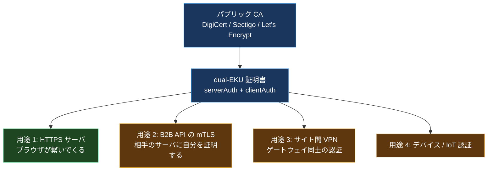
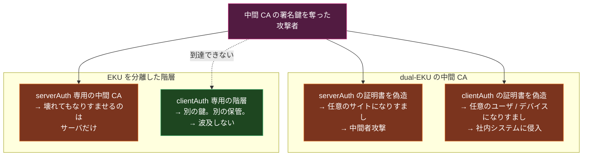
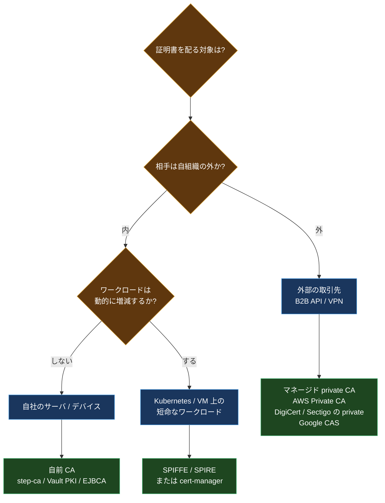
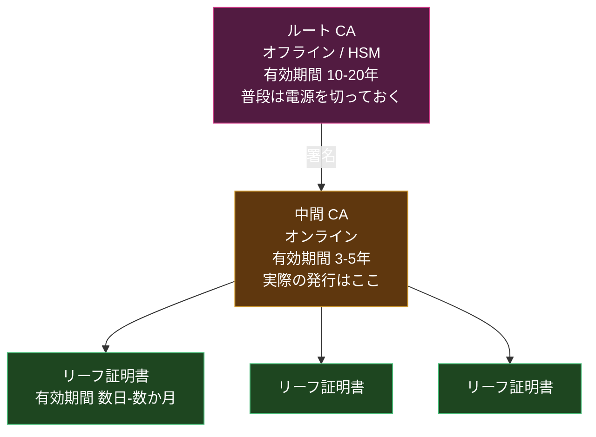
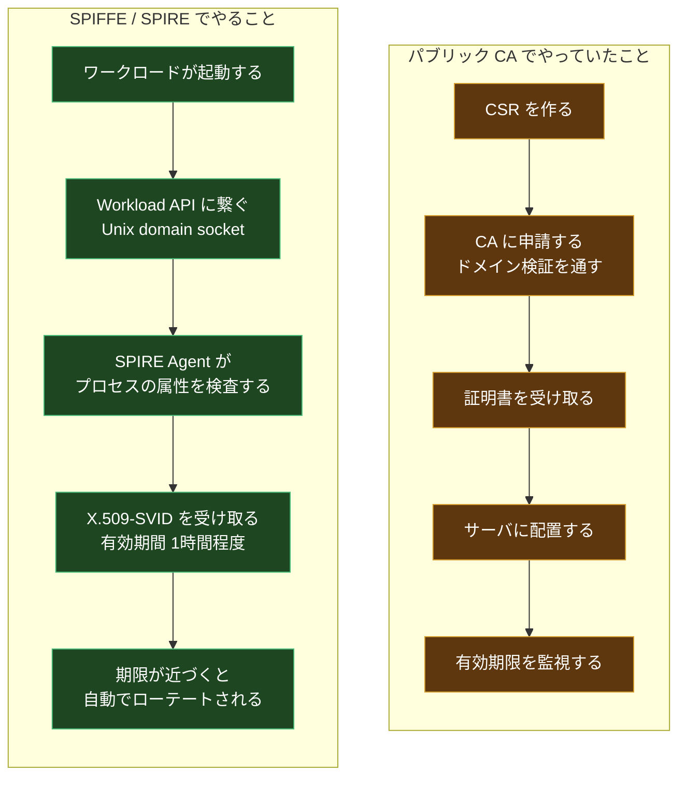

証明書の有効期間が47日になる話は、以前べつの記事で詳しく書いた。CA/Browser Forum の Ballot SC-081v3 が決めた段階的な短縮で、2026年3月15日から200日、2027年3月から100日、2029年3月15日から47日になる。

同じ時期にもう1つ、別の変更が進んでいる。**パブリック TLS 証明書から `clientAuth` EKU が消える**。こちらの方が影響が具体的で、対処に時間がかかる。

ここで最初に潰しておきたい誤解がある。ネット上の解説記事の多くが、この EKU 除去も SC-081 が決めたことにしている。**違う。** SC-081v3 が扱っているのは有効期間と検証データの再利用期間だけだ。EKU 除去を強制しているのは CA/Browser Forum の Baseline Requirements ではなく、**Chrome Root Program のポリシー** になる。

決定的なのは Chrome Root Program Policy v1.8 の §1.3.2 で、**2027年3月15日以降に発行されるサブスクライバ証明書は `id-kp-serverAuth` のみを含まなければならない**、と定めている。Chrome のルートストアに残りたい CA は従うしかないので、事実上すべてのパブリック CA に効く。DigiCert 自身も、この変更の根拠として CA/B の ballot ではなく「Google Chrome Root Program の要件」を挙げている。

自分もこれを SC-081 の一部だと思い込んで書きかけた。出典を辿ると、いくつもの CA ベンダのブログが同じ混同をしている。

「うちは Web サイトの HTTPS にしか使ってないから関係ない」なら、実際に関係ない。ただ、B2B の API 連携で mTLS をやっている、サイト間 VPN でクライアント証明書を配っている、デバイス認証に証明書を使っている、そういう構成があるなら、これは期限付きの移行タスクだ。

この記事は、EKU とは何かというところから始めて、なぜ削られるのか、そして移行先をどう選ぶのかまでを一気に書く。

## 前提1: EKU とは何か

X.509 証明書には、**この証明書は何に使っていいか** を宣言する拡張フィールドがある。それが **Extended Key Usage (EKU)** だ。RFC 5280 で定義されている。

値は OID (オブジェクト識別子) で表される。よく使うのはこのあたり。

| OID | 名前 | 意味 |
| --- | --- | --- |
| `1.3.6.1.5.5.7.3.1` | `serverAuth` | TLS サーバとして自分を証明する |
| `1.3.6.1.5.5.7.3.2` | `clientAuth` | TLS クライアントとして自分を証明する |
| `1.3.6.1.5.5.7.3.3` | `codeSigning` | コード署名 |
| `1.3.6.1.5.5.7.3.4` | `emailProtection` | S/MIME |
| `1.3.6.1.5.5.7.3.8` | `timeStamping` | タイムスタンプ |

手元の証明書で確認するならこう。

```bash
openssl x509 -in cert.pem -noout -ext extendedKeyUsage
```

出力はこうなる。

```text
X509v3 Extended Key Usage:
    TLS Web Server Authentication, TLS Web Client Authentication
```

この2つが両方入っているものを **dual-EKU 証明書** と呼ぶ。長らく、パブリック CA が発行する TLS 証明書のデフォルトがこれだった。

## 前提2: なぜ dual-EKU が普通だったのか

歴史的な経緯がある。

1990年代、クライアント認証は「あったらいいね」程度の機能だった。CA は「TLS 用の証明書」を1種類だけ売って、サーバにもクライアントにも使えるようにしておくのが親切だと考えた。実際、テンプレートに両方入れておけば顧客が困らない。

その結果、2020年代になっても、パブリック CA から取った証明書がそのままクライアント認証に使えるようになっていた。そして多くの組織が、それを前提に構成を組んだ。



緑が本来の用途で、黄色が「使えるから使っていた」用途だ。この黄色の部分が、これから使えなくなる。

## 何が決まったのか

決定内容を整理するとこうなる。

1. パブリック CA は、`clientAuth` EKU を含む TLS サーバ証明書を発行してはならない
2. `serverAuth` と `clientAuth` の両方を持つ中間 CA で、パブリックに信頼されたルートに連なるものは **退役させる**
3. クライアント認証用の証明書が必要な組織は、**専用の PKI 階層** から取らなければならない。それはブラウザのルートストアに入っているパブリック CA の階層であってはならない

3 番目の書き方が重要だ。「パブリック CA から取るな」ではなく「**パブリックに信頼された階層から取るな**」と言っている。CA ベンダから private PKI サービスを買うのは問題ない。ブラウザが信頼するルートに繋がっていなければいい。

### 2つの期限を混ぜない

ここで日付が2種類あって、混同されやすい。**中間 CA の期限**と**リーフ証明書の期限**は別物だ。

| 対象 | 期限 | 根拠 |
| --- | --- | --- |
| CCADB に新規開示される中間 CA | 2026年6月15日 | この日以降に開示するものは `serverAuth` のみ。dual-EKU の中間 CA は新規に作れない |
| リーフ証明書 | **2027年3月15日** | Chrome Root Program Policy v1.8 §1.3.2 |

リーフ側の期限は一度後ろ倒しされている。Chrome Root Program Policy **v1.6 では2026年6月15日**だったものが、**v1.8 で2027年3月15日に緩和**された。2026年6月15日という数字を挙げている解説記事は、v1.6 時点の情報のまま更新されていないか、中間 CA の期限と混ざっている可能性がある。

### CA ごとの実際の日付

ポリシーの期限より、自分が使っている CA がいつ止めるかの方が実務では効く。

| CA | デフォルトから除外 | 完全に選べなくなる |
| --- | --- | --- |
| SSL.com | 2025年9月15日 | - |
| Sectigo | 2025年9月15日 | **2026年5月15日** |
| DigiCert | 2025年10月1日 | **2027年3月1日** |
| Google Trust Services | 2025年11月10日 (Phase 1) | **2026年4月13日** (Phase 2 で CSR を全拒否) |
| Let's Encrypt | 2026年2月11日 | **2026年7月8日** |
| IdenTrust | - | 2027年2月1日以降発行分は非対応 |

DigiCert は2027年3月1日まで **明示的にオプトインすれば** `clientAuth` 付きを取れる。逆に Google Trust Services は2026年4月にすでに全拒否に入っている。**同じ「2026年」でも CA によって半年以上ずれる**ので、公式アナウンスで確認するしかない。

すでに発行済みの証明書は有効期限まで使える。ただし、更新した瞬間に `clientAuth` が消える。そして更新は思ったより早く来る。2026年3月15日以降、パブリック証明書の最大有効期間は200日だ。つまり **2026年中にほぼすべての証明書が1回は更新を迎える**。「まだ有効期限が来ていないから大丈夫」という猶予は、実質的にない。

## なぜ削るのか

ルートプログラム (Chrome, Apple, Mozilla, Microsoft) 側の理屈はこうだ。

**クライアント認証は本質的に内部のセキュリティ機能である。** 誰を信頼するか、どの粒度で権限を分けるか、いつ失効させるかは、その組織の都合で決まる。柔軟性と細かい制御が要る。

対してパブリック CA は、ブラウザのルートプログラムの規則に従って動く。ドメイン検証の方法、有効期間、失効の要件、監査。これらは組織の都合と無関係に、外部のポリシー変更で変わる。

| | パブリック CA が想定していること | クライアント認証が必要とすること |
| --- | --- | --- |
| 相手 | 誰か分からない。世界中のブラウザ | 分かっている。取引先か自社のデバイス |
| 信頼の決め方 | 共通のアンカーが要る | 自分たちで決めたい |
| 検証する対象 | ドメインの所有 | 組織 / 役割 / デバイス |
| ポリシーの主導権 | ルートプログラム | 自組織 |

主導権の行が本質だ。クライアント認証の失効条件を、外部のポリシー変更に握られていること自体がおかしかった。

もうひとつ、攻撃面の話もある。**dual-EKU の中間 CA は、侵害されたときの被害範囲が2倍になる。**



ルートプログラムが長年進めてきた「用途ごとに階層を分ける」方針の延長線上にある話で、これ単体で見れば筋は通っている。

自分としては、この理屈には納得している。パブリック CA でクライアント認証をやっていたのは、単に「そこにあったから」であって、設計判断ではなかった。

## 影響を受ける構成の見分け方

まずは棚卸しから。すべてはここから始まる。

### 手元の証明書を確認する

```bash
# EKU を確認する
openssl x509 -in client.pem -noout -ext extendedKeyUsage

# 発行元がパブリック CA かどうかを見る
openssl x509 -in client.pem -noout -issuer

# チェーン全体を見る
openssl crl2pkcs7 -nocrl -certfile fullchain.pem \
  | openssl pkcs7 -print_certs -noout
```

### サーバに繋いで確認する

相手がクライアント証明書を要求してくるかどうかは、ハンドシェイクを見れば分かる。

```bash
openssl s_client -connect api.partner.example.com:443 -showcerts 2>&1 \
  | grep -A5 "Acceptable client certificate CA names"
```

ここに CA 名が並んでいたら、その接続は mTLS だ。並んでいる CA がパブリック CA なら、それは移行対象になる。

### 一括で洗い出す

証明書が置いてありそうな場所を舐める簡単なスクリプト。

```bash
#!/usr/bin/env bash
# clientAuth EKU を持つ証明書を探す
find /etc/ssl /etc/pki /opt -name '*.pem' -o -name '*.crt' 2>/dev/null \
| while read -r f; do
    eku=$(openssl x509 -in "$f" -noout -ext extendedKeyUsage 2>/dev/null)
    if echo "$eku" | grep -q "Web Client Authentication"; then
      issuer=$(openssl x509 -in "$f" -noout -issuer 2>/dev/null)
      echo "FOUND: $f"
      echo "  $issuer"
    fi
  done
```

Kubernetes なら Secret を舐める。

```bash
kubectl get secrets -A -o json \
| jq -r '.items[] | select(.type=="kubernetes.io/tls")
         | "\(.metadata.namespace)/\(.metadata.name)"'
```

こういう作業をやってみると、だいたい「誰も存在を知らなかった証明書」が2, 3本出てくる。棚卸しは早めにやったほうがいい。

### 典型的な影響パターン

| 構成 | 影響 |
| --- | --- |
| Web サイトの HTTPS のみ | **なし** |
| B2B API の mTLS (相手にパブリック証明書を提示) | **あり**。更新時に壊れる |
| サイト間 VPN のゲートウェイ認証 | **あり** |
| デバイス / IoT の証明書認証 | **あり** |
| 社内で自前 CA を使っている | なし (もともとパブリックではない) |
| Kubernetes 内部の mTLS | なし (cluster CA を使っている) |
| Istio / Linkerd の mTLS | なし (SPIFFE ベースの内部 CA) |

サービスメッシュや Kubernetes の内部通信は、もともとパブリック CA を使っていないので影響を受けない。これは偶然ではなく、**内部通信の認証にパブリック CA を使うのは元々おかしかった** という話でもある。

## 移行先をどう選ぶか

移行先は「private PKI」の一言で片付くが、その中に複数の選択肢がある。判断軸を整理する。



### 選択肢1: マネージド private CA

**向いているケース**: 外部の取引先とやりとりする mTLS。監査要件が厳しい。CA 運用の人員を割きたくない。

DigiCert, Sectigo, GlobalSign などは private PKI のサービスを持っている。AWS なら AWS Private CA、GCP なら Certificate Authority Service。

メリットは運用の楽さと、既存の CA ベンダとの契約をそのまま使える点。パブリック証明書からの移行なら、同じベンダの private 製品に切り替えるのがいちばん摩擦が少ない。

デメリットはコスト。AWS Private CA は CA 1つあたり月額が発生する。証明書の発行数が少ないと単価が高くつく。

**外部の取引先が絡む場合、いちばん面倒なのは技術ではなく調整だ。** 相手のトラストストアに自分たちの CA 証明書を入れてもらう必要がある。これは相手の変更管理プロセスに乗る話で、数か月かかることもある。だから移行の中でここを最初に着手すべきになる。

### 選択肢2: 自前 CA

**向いているケース**: 社内のサーバやデバイス。数がそれなりにある。ACME で自動化したい。

- **step-ca** (Smallstep): ACME をサポートする軽量な CA。設定が素直で、小〜中規模ならこれが第一候補になる
- **HashiCorp Vault PKI**: すでに Vault を使っているなら統合が自然。短命証明書の発行に強い
- **EJBCA**: エンタープライズ向け。監査要件が厳しいならここ

自前 CA でいちばん考えるべきなのは **ルート鍵の保護** だ。HSM に置くのか、オフラインのマシンに置くのか。中間 CA を挟んで、ルートは普段オフラインにしておくのが定石になる。



### 選択肢3: SPIFFE / SPIRE

**向いているケース**: Kubernetes や VM の上で動くワークロードが、動的に増えたり減ったりする。

ここが個人的にはいちばん面白い選択肢だと思っている。

SPIFFE は「ワークロードに identity を配る」ための標準で、その実装が SPIRE。ワークロードは自分が誰であるかを **証明する秘密を持たずに** 起動して、SPIRE Agent がプロセスの属性 (Kubernetes の ServiceAccount、プロセスの UID、コンテナイメージのハッシュなど) を見て身元を判定し、X.509-SVID を渡す。

X.509-SVID は普通の X.509 証明書だ。SAN に `spiffe://example.org/ns/prod/sa/api` のような URI が入っていて、EKU には **`serverAuth` と `clientAuth` の両方** が入る。もちろんパブリック CA ではないので、今回の規制の対象外。



面白いのは、**この移行が結果的に短命化への対応も兼ねる** ことだ。SPIRE のデフォルトの SVID 有効期間は1時間。47日どころではない。証明書のローテーションが完全に自動化されている構成に移ってしまえば、CA/Browser Forum が何日にしようと関係なくなる。

デメリットは学習コストと運用の複雑さ。SPIRE Server / Agent を運用する必要があるし、trust domain の設計、attestation の設計、federation の設計を全部やることになる。「取引先とのB2B mTLS 1本」のために SPIRE を入れるのは明らかに過剰だ。

### 選択肢の比較

| | マネージド private CA | 自前 CA (step-ca / Vault) | SPIFFE / SPIRE |
| --- | --- | --- | --- |
| 導入の速さ | 速い | 中 | 遅い |
| 運用コスト | 低 (お金はかかる) | 中 | 高 |
| 金銭コスト | 高 | 低 | 低 |
| 自動更新 | ACME 対応なら可 | ACME で可 | 標準で数時間ごと |
| 外部取引先との相互運用 | やりやすい | 可能 | 難しい (federation が要る) |
| 動的なワークロード | 弱い | 中 | 強い |
| identity の粒度 | ドメイン / 組織 | 自由 | ワークロード単位 |

現実的には **併用** になることが多いと思う。外部との mTLS はマネージド private CA、内部のワークロードは SPIRE、という分け方だ。

## 移行の順番

期限が近いものから逆算する。

**フェーズ1: 棚卸し (今すぐ)**

- `clientAuth` を使っている証明書を全部洗い出す
- 発行元がパブリック CA かどうかを判定する
- それぞれの用途と、相手方 (トラストストアを持っている側) を特定する
- CBOM (Cryptographic Bill of Materials) の形でまとめておくと後が楽

**フェーズ2: 外部が絡むものから着手 (2026年内)**

- 取引先に「CA を切り替える」と通知する
- 相手のトラストストアに新しい CA を追加してもらう
- 両方の CA を信頼する期間を作って、切り替える
- ここに数か月かかるので最優先

**フェーズ3: 内部のものを移行 (2027年前半まで)**

- 自社内で完結するものは自分たちのペースで進められる
- ここで SPIFFE / SPIRE を検討する価値がある

**フェーズ4: 自動化の完成**

- ACME なり SPIRE なりで、更新に人手が入らない状態にする
- ここまでやっておくと、2029年の47日も、その先のポスト量子暗号への移行も、同じ仕組みで乗り切れる

最後の点を補足しておく。「6週間ごとに全証明書をローテートできるチームは、ポスト量子暗号への移行もできるチームだ」という言い方をよく見る。NIST が2024年8月に FIPS 203 (ML-KEM) / 204 (ML-DSA) / 205 (SLH-DSA) を出して、いずれ証明書の署名アルゴリズムを総入れ替えする日が来る。そのとき必要になるのは「全証明書を短期間で入れ替える能力」で、それはいま作っているものと同じだ。

短命化も EKU 分離も、単体では面倒なだけの変更に見える。ただ、どちらも「証明書のライフサイクルを自動化しろ」という同じ方向を指している。

## まとめ

- `clientAuth` EKU の除去を決めたのは CA/B Forum の SC-081 ではなく **Chrome Root Program Policy v1.8 §1.3.2**。多くの解説記事が混同している
- リーフ証明書の期限は **2027年3月15日** (v1.6 の2026年6月15日から緩和済み)。2026年6月15日は CCADB に新規開示する中間 CA の期限
- CA ごとの停止時期は半年以上ばらつく。Google Trust Services は2026年4月に全拒否済み、DigiCert は2027年3月まではオプトイン可能
- 影響するのは B2B の mTLS、サイト間 VPN、デバイス認証。Web サイトの HTTPS だけなら影響なし
- 200日ルールにより2026年中にほぼ全証明書が1回更新されるので、「期限まで猶予がある」は成り立たない
- 移行先は private PKI。外部取引先向けはマネージド private CA、内部の動的ワークロードは SPIFFE / SPIRE が候補
- 外部が絡む移行は相手のトラストストア更新が必要で数か月かかる。ここから着手する
- 最終的なゴールは「証明書ローテーションの完全自動化」で、これは 2029年の47日にもポスト量子移行にも効く

まず `openssl x509 -noout -ext extendedKeyUsage` を手元の証明書で1回叩いてみるところから始めるといい。`TLS Web Client Authentication` が出てきて、その issuer がパブリック CA だったら、その証明書には期限がある。

## 参考

一次情報を先に置く。ベンダのブログは日付が古いまま更新されていないことがある。

- [Chrome Root Program Policy §1.3.2 Promote use of dedicated TLS server authentication PKI hierarchies](https://googlechrome.github.io/chromerootprogram/#132-promote-use-of-dedicated-tls-server-authentication-pki-hierarchies)
- [Removing the client authentication EKU from public TLS certificates | DigiCert](https://knowledge.digicert.com/alerts/sunsetting-client-authentication-eku-from-digicert-public-tls-certificates)
- [Client Authentication Certificates (clientAuth) Deprecation | Google Trust Services](https://developers.google.com/public-key-infrastructure/updates/may2025-clientauth)
- [TLS client authentication changes 2026 | Sectigo](https://www.sectigo.com/blog/tls-client-authentication-public-ca-end-2026)
- [Sunsetting the ClientAuth EKU | RSAC Conference](https://www.rsaconference.com/library/blog/sunsetting-the-clientauth-eku-what-why-and-how-to-prepare)
- [RFC 5280: Internet X.509 Public Key Infrastructure Certificate and CRL Profile](https://datatracker.ietf.org/doc/html/rfc5280)
- [SPIFFE X509-SVID Specification](https://spiffe.io/docs/latest/spiffe-specs/x509-svid/)
