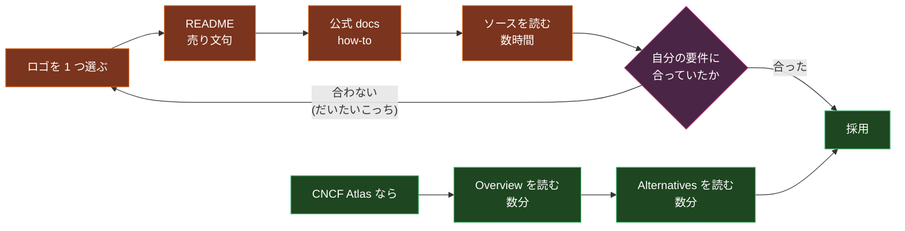
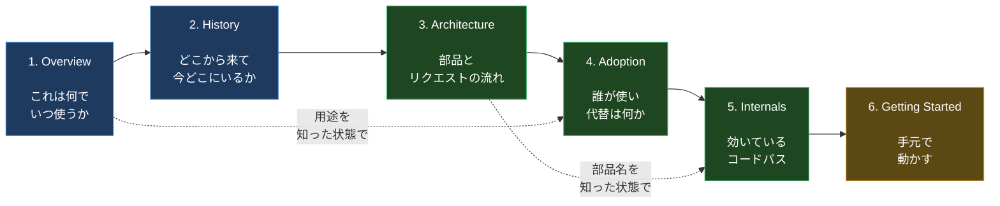
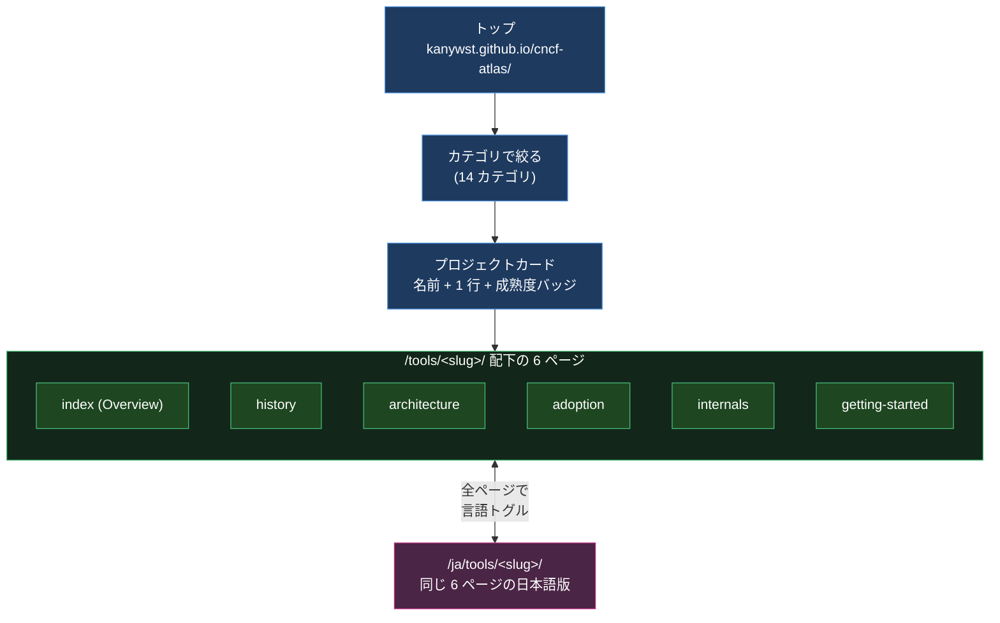
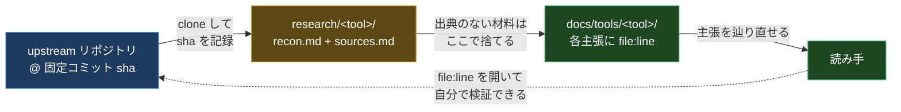
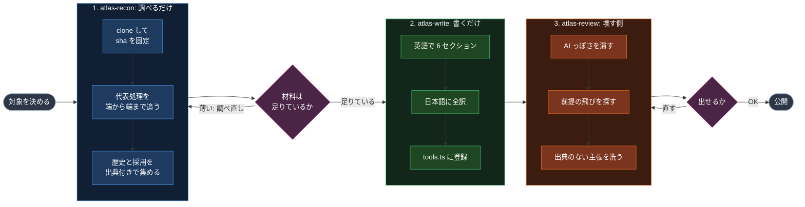
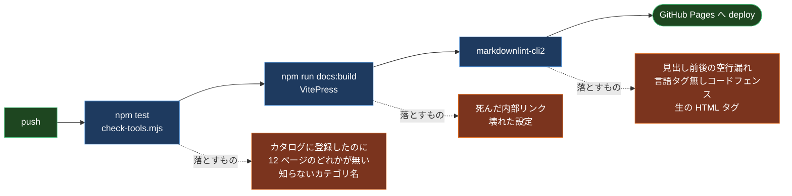

Kubernetes クラスタに Secret を外から流し込みたくなって、CNCF landscape を開いた。

Secret やセキュリティまわりのロゴが並んでいる。External Secrets Operator、Bank-Vaults、cert-manager、Kyverno、Falco。どれも名前は聞いたことがある。で、この中のどれが自分のやりたいことをやってくれるのか。

ロゴをクリックすると GitHub に飛ぶ。README を読む。README は「何ができるか」を売り込んでくるけれど、「どう動いているのか」「自分のスタックに合うのか」「似た 3 つのうちどれを選ぶべきか」は書いていない。公式ドキュメントに行く。今度は「使う人」向けの how-to しかない。仕方なくソースを開く。ここで数時間が溶ける。

そして候補は 1 つではないので、これを次のロゴでもう一度やる。

[CNCF Atlas](https://kanywst.github.io/cncf-atlas/) は、この時間を他の人が払わなくて済むようにするために作った。CNCF のプロジェクトを 1 つずつ、実際のリポジトリをクローンしてコミットを固定して、ソースを読んで、毎回同じ 6 つのセクションに書き起こしたドキュメントサイト。今のところ 115 プロジェクト、日本語と英語の両方で入っている。

この記事は、CNCF Atlas が何なのか、どう使うのか、そして「115 本ものドキュメントをどうやって品質を落とさずに書いたのか」を上から順に説明していく。CNCF って何、というところから始めるので、Kubernetes を触り始めたばかりでも読めるはず。

- サイト: <https://kanywst.github.io/cncf-atlas/>
- リポジトリ: <https://github.com/kanywst/cncf-atlas>

## 前提: CNCF と landscape と「成熟度」

まず用語を揃える。ここが分かっていないと、以降の話が半分くらい滑る。

**CNCF (Cloud Native Computing Foundation)** は、Kubernetes をはじめとするクラウドネイティブ系 OSS をホストしている非営利団体。Linux Foundation の傘下にある。プロジェクトを CNCF に「寄贈 (donate)」すると、商標や資金やガバナンスを CNCF が引き受けてくれて、特定の 1 社に依存しない運営になる。

**CNCF landscape** は、そのエコシステム全体を 1 枚に敷き詰めた図。カテゴリごとにロゴがグリッド状に並んでいる。CNCF がホストしているプロジェクトだけでなく、周辺の商用製品まで載っているので、初見だと本当に「壁」に見える。

**成熟度 (maturity)** は、CNCF ホストのプロジェクトに付く 3 段階のラベル。プロジェクトがどれくらい「枯れて」いるかを表す。

| 成熟度 | 意味 | 例 |
| --- | --- | --- |
| Graduated | 卒業。プロダクションで広く使われ、ガバナンスもセキュリティ監査も通っている | Kubernetes, etcd, Envoy, Cilium |
| Incubating | 育成中。実運用の採用実績はあるが、まだ卒業基準は満たしていない | Keycloak, OpenFGA, Backstage |
| Sandbox | 実験段階。CNCF に入ったばかりで、これから伸びるかは分からない | Cozystack, Dalec, container2wasm |

Archived (開発が止まった) というラベルもある。CNCF Atlas ではこれに加えて、CNCF ホストではないが同じ文脈で使われるプロジェクト (Authelia など) に `Independent` を付けている。

大事なのは、**この成熟度は動く**ということ。Knative は 2022 年 3 月に Incubating で CNCF に入り、2025 年 9 月に Graduated へ上がった。HAMi は 2024 年 8 月に CNCF 入りして、つい先日 (2026 年 7 月 2 日) に Incubating へ上がったばかり。「あの記事を読んだ時とラベルが違う」がすぐ起きる世界なので、成熟度を書くドキュメントは、いつ時点の話なのかを言わないと無意味になる。

CNCF がホストするプロジェクトの総数は 200 個超。CNCF Atlas はバックログとして `data/cncf-projects.json` に **226 個** (Graduated 36 / Incubating 37 / Sandbox 153) を持っている。これは 2026 年 6 月 21 日時点のスナップショットで、上に書いた HAMi の昇格はもう反映されていない。

一次情報は <https://www.cncf.io/projects/> にあって、この記事を書いている 2026 年 7 月 11 日時点で Graduated は 36 個。以降に出てくる数字は、すべてこの日に実物を数えたもの。

## 何が問題なのか

landscape はカタログとしては正しい。「Secret 管理にはこれだけの選択肢があります」という一覧性は、たしかにある。

問題は、そこから先の解像度が一切ないこと。ロゴが伝えるのは「存在」だけで、「中で何が起きているのか」は公式ドキュメントにも書いていない。公式ドキュメントは使う人向けに書かれているから、内部構造は意図的に隠される。知りたければソースを読むしかない。

しかも、その調査は**候補の数だけ繰り返すことになる**。ここが本当の痛みで、コストは足し算ではなく掛け算で効いてくる。



上の輪をまわるたびに数時間が消える。しかも 1 周してやっと「これは違った」と分かる。5 候補あれば 5 周する。自分は実際にその周回を何度もやっていたので、「1 回払った分を、次の人が払わなくていい形で書き残す」ことにした。それが CNCF Atlas。

## CNCF Atlas がやること

1 プロジェクトにつき、**必ず同じ 6 つのセクション**を書く。順番も固定。上から読むと理解が積み上がるように並べてある。



色は読む目的で分けてある。青の 2 つは「知る」、緑の 3 つは「深く踏み込む」、黄色の最後は「手を動かす」。

そして点線が大事なところ。Internals (5) は Architecture (3) で部品の名前を覚えている前提で書かれるし、Adoption (4) は Overview (1) で用途を掴んでいる前提で書かれる。だから前のページを読んでいれば次のページで詰まらない。逆に、いきなり Internals から開くと、知らない部品名だらけで進めない。

各セクションが答える問いを表にするとこう。

| セクション | 答える問い | 具体的に載っているもの |
| --- | --- | --- |
| Overview | これは何か。いつ使うか | 1 段落の定義、カテゴリ、成熟度、言語、ライセンス、基準コミット |
| History | どこから来たか | 起源、寄贈と卒業の年月、大きな書き換え。全部に出典 URL |
| Architecture | どう組み立てられているか | コンポーネント一覧、代表的なリクエストの端から端まで、設計判断 |
| Adoption & Ecosystem | 誰が本番で使っているか | 出典付きの採用企業、周辺プロジェクト、代替の実際の違い |
| Internals | コードのどこが効いているか | ディレクトリ地図、中核データ構造、追う価値のあるコードパス |
| Getting Started | 手元でどう動かすか | 前提、インストール、最初の 1 構成、動作確認 |

英語がデフォルトで、全ページに日本語版がある。要約ではなく全訳で、`file:line` の参照も出典も同じものが入っている。

## サイトの歩き方

サイトの構造はシンプルで、カテゴリで絞って、プロジェクトを選んで、6 ページを上から読む。それだけ。



URL は完全に規則的なので、慣れたら直接叩ける。`spire` の Internals が読みたければ `/cncf-atlas/tools/spire/internals`、日本語なら `/cncf-atlas/ja/tools/spire/internals`。

カテゴリは landscape をそのままなぞるのではなく、実際に書いた範囲に合わせて 14 個に絞ってある。

| カテゴリ | 収録数 | カテゴリ | 収録数 |
| --- | --- | --- | --- |
| Orchestration & Scheduling | 18 | Storage & Database | 8 |
| Identity & Policy | 14 | Observability | 8 |
| App Definition & GitOps | 12 | Supply Chain | 6 |
| Security & Compliance | 11 | API Gateway | 5 |
| Runtime | 9 | Messaging & Streaming | 4 |
| Developer Tools | 9 | Chaos Engineering | 2 |
| Service Mesh & Networking | 8 | Container Registry | 1 |

## 実際のページはこうなっている

抽象的な説明が続いたので、実物を見せる。SPIRE (Pod の中で動くアプリに、短命の証明書を自動で配る仕組み。SPIFFE という仕様の参照実装) の Overview の冒頭はこう始まる。

```markdown
# SPIRE

> SPIRE は共有ブートストラップシークレットなしで、短命の暗号学的アイデンティティ
> (X509-SVID と JWT-SVID) をワークロードに発行する。SPIFFE 仕様の参照実装。

- **カテゴリ**: Identity & Policy
- **CNCF 成熟度**: Graduated
- **言語**: Go (`go 1.26.4`、`go.mod:3`)
- **ライセンス**: Apache-2.0 (`LICENSE:1-3`)
- **リポジトリ**: [spiffe/spire](https://github.com/spiffe/spire)
- **ドキュメント基準コミット**: `73215a39` (タグ `v1.15.1` の近傍、2026-06-22)
```

言語もライセンスも、`go.mod:3` や `LICENSE:1-3` という形で「どのファイルの何行目にそう書いてあるか」を添えてある。そして一番下の**基準コミット**。このページに書いてあることは、`73215a39` という 1 つのコミットに対して検証されている。3 か月後にリポジトリが変わっていても、少なくとも「いつ時点の話か」は分かる。

Internals はもっと踏み込む。ここは用語が要るので先に 3 つだけ。**ワークロード**は証明書を欲しがっている側のプロセス、さっき言った「Pod の中のアプリ」のこと。**SVID** は SPIRE がそのワークロードに配る身分証 (X.509 証明書か JWT)。**attestation** は「お前は本当にそのワークロードか」を、カーネルが知っている情報 (プロセスの UID、どの Pod に属するか) から確かめる手続き。

その上で、SPIRE の Internals から抜くとこう。

> Workload API の `FetchX509SVID` ハンドラ (`pkg/agent/endpoints/workload/handler.go:251`) はストリーミング RPC で、リクエストボディは空、クレデンシャルも一切載っていない。アイデンティティは全て attestation から導出される。`Attest` は各 workload attestor プラグインを別 goroutine で回して selector をマージする (`pkg/agent/attestor/workload/workload.go:55-87`)。

つまり「証明書をください」と頼む側は、パスワードもトークンも何ひとつ提示しない。それでも身元が確定する。ここが SPIRE の肝なのだが、ドキュメントを読んでいるだけでは腹落ちしない。ハンドラの第 1 引数が `_ *workload.X509SVIDRequest` と、変数名すら付けずに捨てられているのを見て、はじめて「本当に何も見ていない」と分かる。

Internals には毎回 **「Things that surprised me」(意外だったこと)** というセクションを置いている。ソースを読まないと絶対に出てこない話を、ここに集める。

etcd の例。前提として、etcd は書き込みのたびに **revision** という通し番号を増やしていき、古い revision を捨てる操作を **compaction** と呼ぶ。実データは **bbolt** という組み込みキーバリューストアに置かれている。その上で、ページにはこう書いた。

> バックエンドはユーザーのキーを一切保存していない。bbolt は revision だけをキーにしていて、「あるキーが今どの revision を指しているか」を知っているのはインメモリの `treeIndex` だけ (`server/storage/mvcc/kvstore_txn.go:259-260`)。だから再起動時にインデックスをバックエンドから再構築する必要があるし、履歴つき watch と compaction が安く済むのもこれが理由。

「etcd を再起動すると起動が遅い」も「古い履歴を watch できる」も、この 1 つの設計から出てくる。ソースを読むまで、この 2 つが同じ理由だとは思っていなかった。

Cilium の例。Cilium はパケット処理を **eBPF** (カーネルの中で動かせる小さなプログラム) で行う。eBPF プログラムはコンパイルすると **ELF** というバイナリ形式になり、それをカーネルにロードして使う。素朴に考えると Pod ごとに設定が違うのだからコンパイルも Pod ごとに必要そうだが、実際は違った。

> Cilium は eBPF を endpoint ごとにコンパイルし直さない。設定ハッシュごとに ELF を 1 つコンパイルしてキャッシュし、それを複製して、ロードの直前に endpoint 固有の値だけ差し替える (`pkg/datapath/loader/cache.go`)。

Pod が 1000 個立ち上がっても、コンパイラ (clang) は 1000 回は動かない。この手の話が、数時間ソースを読んで得られるものの正体で、README にも公式ドキュメントにも書いていない。

## なぜこの内容を信用していいのか

ドキュメントサイトは、いくらでも「それっぽい嘘」を書ける。生成 AI を使って書くなら、なおさら。

CNCF Atlas はリポジトリの `CLAUDE.md` に「絶対に譲らないルール」を書いてあって、書く側 (人でも AI でも) はそれに縛られる。ルールは 4 つ。



この輪が閉じているのがポイント。読み手はページに書いてある `file:line` と基準コミットを持って upstream に戻れる。戻って違っていたら、それはこちらのバグだ。

具体的なルールはこの 4 つ。

1. **ソースを読んで書く。要約しない。** Architecture と Internals は、固定したコミットの実コードから書く。構造に関する主張は必ず `file:line` を指す。読んでいないなら書かない。
2. **採用事例を捏造しない。** 企業名を出すなら、ADOPTERS ファイル、CNCF のケーススタディ、公開された登壇、エンジニアリングブログのいずれかを出典に付ける。出典がなければ載せない。
3. **コミットを固定する。** sha を `research/<tool>/` と Overview と Internals に記録する。Internals の主張はそのコミットに対してのみ有効、と明示する。
4. **日本語は全訳で、要約ではない。** 英語が正典。ただし日本語版も同じ 6 セクション、同じ事実、同じ `file:line` を持つ。

3 番目が地味に効く。「Cilium の datapath はこうです」と書いてあるドキュメントは世の中に無数にあるが、それが v1.9 の話なのか v1.19 の話なのかが書いていない。それだと検証できないので、時間が経つとただのノイズになる。

## どうやって 115 本も書いたのか

全部 Claude Code に書かせている。ただし「プロジェクト名を渡したら記事が出てくる」ようなやり方ではまともなものは出てこない。1 発でやらせると、ソースを読まずに README の言い換えを吐く。それは landscape のロゴと情報量が変わらない。

なので、**工程を 3 つに割って、間に人間のレビューを挟む**構造にした。各工程は Claude Code のスキル (`.claude/skills/` に置いた `SKILL.md`) として定義してある。



図で見ると、**人間の判断 (紫のひし形) が 2 か所しかない**のが分かる。裏を返すと、そこ以外は機械に任せてよい形まで工程を割った、ということでもある。

工程を割る理由は 1 つで、**「調べる」と「書く」を同時にやらせると、書きたい文に合わせて事実を作り始めるから**。調べる工程では `docs/` を触ることを禁止していて、書く工程では新規に調査することを禁止している。書く側は、調べる側が集めた材料 (`recon.md`) にないことは書けない。材料が薄ければ、そこで止まって調べ直しになる。

### 1. atlas-recon: 材料を集める

やるのはこれだけ。ページは 1 行も書かない。

- upstream を `research/<tool>/src/` にクローンして (このディレクトリは gitignore してある)、`git rev-parse HEAD` と直近のタグを記録する
- README、CONTRIBUTING、ADOPTERS、ガバナンス文書を読む。言語、ビルド手順、モジュール構成を掴む
- **代表的な処理を 1 本、端から端まで追う。** 各ホップの `file:line` を控える。Cilium なら CNI ADD から `CreateEndpoint`、`Regenerate`、`regenerateBPF`、`ReloadDatapath` まで
- 歴史と採用事例を、1 主張 1 出典 URL で `sources.md` に貯める
- カテゴリと成熟度を確定させる

`research/<tool>/` の中身は 3 ファイル。

| ファイル | 中身 |
| --- | --- |
| `recon.md` | 調査の本体。アーキテクチャ、内部構造、歴史、採用の材料 |
| `sources.md` | 主張と出典 URL の対応表 |
| `status.md` | どこまで進んだかのチェックリスト |

`status.md` は実際こういう見た目になる。

```markdown
# status: cilium

- [x] recon 完了 @ commit `fe36ad62130243ba43159521bd384ef56d0918f0`
- [x] sources 整理
- [ ] write: en 6 セクション
- [ ] write: ja 6 セクション
- [ ] tools.ts に登録
- [ ] `npm run docs:build` グリーン
```

### 2. atlas-write: 材料を記事にする

前提条件が 2 つあって、`recon.md` と `sources.md` が埋まっていること、sha が記録されていること。どちらか欠けていたら、この工程は開始せずに止まる。

やることは、雛形 (`templates/tool-doc/en/`) を `docs/tools/<slug>/` にコピーして `{...}` のプレースホルダを全部埋め、日本語に全訳して、`docs/.vitepress/tools.ts` に 1 行足すこと。

この `tools.ts` の 1 行が単一の真実になっていて、ここに追加するとサイドバーとトップページのカタログが同時に更新される。

```ts
{
  slug: 'cilium',
  name: 'Cilium',
  tagline: 'eBPF-based networking, security, and observability for Kubernetes, with policy written against workload identity.',
  taglineJa: 'Kubernetes 向けの eBPF ベースのネットワーキング・セキュリティ・可観測性。ポリシーはワークロードの identity に対して書く。',
  category: 'Service Mesh & Networking',
  maturity: 'Graduated',
},
```

### 3. atlas-review: 新入りの目で読み直す

書いた本人 (AI) が読むと通ってしまうので、別の工程として「壊す側」を用意した。見るのは 4 点。

**AI っぽい文章を潰す。** 具体的にリストにしてある。em dash (`—`) を使わない。「X であって Y ではない」という対比を中身なしに使わない。3 つ並べるリズム (「速く、単純で、信頼できる」) をやらない。「注目すべきは」「今日の landscape において」のような前置き。見出しを言い換えただけの文。情報のない形容詞。最初のパスは `rg -n "—" docs/tools/<slug>` で機械的に潰せるが、残りは読むしかない。

**上から読めるか。** 各ページを順に読んで、「前のページまでしか読んでいない人」が詰まる箇所を探す。CRD、reconcile ループ、admission webhook といった用語を、初出で説明せずに使っていたらそこで止める。

**主張に裏があるか。** Architecture と Internals の主張が `file:line` を指しているか。採用企業に出典が付いているか。

**ビルドとテストと lint が通るか。** ここは機械が見る。

## 壊れないようにする仕掛け

115 プロジェクトぶんのページがあると、手で整合性を保つのは無理になる。CI で 3 つのゲートを置いている。



一番効いているのが 1 つめの `scripts/check-tools.mjs`。やっているのは「`tools.ts` に登録されている全エントリについて、6 セクション × 2 言語 = 12 ファイルがディスク上に存在するか」と「カテゴリが `CATEGORY_ORDER` にあるか」の確認だけ。それだけなのだが、これがないと「カタログには出るのにクリックすると 404」が普通に起きる。

```bash
$ npm test
check-tools: 115 tool(s) registered, all pages present, categories valid
```

TypeScript をインポートせずに正規表現で `tools.ts` をパースしているのが少し手抜きだが、CI の依存を増やさずに済んでいる。

2 つめの `docs:build` は VitePress の本番ビルドで、これが内部リンク切れを落としてくれる。6 ページが相互リンクしているので、ファイル名を 1 つ変えると即座に落ちる。

3 つめは markdownlint。生の HTML タグを禁止しているせいで、トップページのカタログ UI は Markdown からコンポーネントを呼び出せない。そこは VitePress のテーマのレイアウトスロット (`home-features-after` など) から注入していて、`.md` は全部素の Markdown のままにしてある。

## 今どこまで来たか

数字で言うとこう。

| 項目 | 数 |
| --- | --- |
| 収録プロジェクト | 115 |
| うち Graduated | 36 |
| うち Incubating | 38 |
| うち Sandbox | 35 |
| うち Independent (CNCF 外) | 6 |
| カテゴリ | 14 |
| 1 プロジェクトあたりのページ | 12 (6 セクション × 2 言語) |
| `docs/` 配下の Markdown | 1,492 ファイル、約 76,900 行 |

一番言いたいのはこれ。**CNCF の Graduated プロジェクトは 36 個あって、その 36 個すべてに deep-dive がある。** Kubernetes、etcd、Envoy、Cilium、Istio、Prometheus、SPIFFE、SPIRE、Argo CD、Helm、containerd、TUF、in-toto。全部読める。

Sandbox はまだ遠くて、153 個中 35 個。数が多いうえに、そもそも読むべきコードが薄いプロジェクトも混ざっている。全部埋めるのが正しいのかは、まだ決めていない。

技術スタックは VitePress (Markdown からドキュメントサイトを作る静的サイトジェネレータ) と自作テーマで、GitHub Pages にデプロイしている。図は `vitepress-plugin-mermaid` を入れてあるので、`.md` に Mermaid をそのまま書ける。

## 使ってほしい形

3 通りある。

**1. 何かを選ぶ前に読む。** カテゴリで絞って、候補の Overview と Adoption だけ読む。Adoption の「Alternatives」には、都合よく弱く書いた比較対象ではなく、実際の違いを書いてある。そこで大体決まる。

**2. 中身を知りたくなったら Internals に行く。** `file:line` が全部付いているので、そのままエディタで upstream を開いて追える。「Things that surprised me」だけ拾い読みするのも面白いと思う。

**3. 足りないプロジェクトを教えてもらう。** バックログ 226 件は `data/cncf-projects.json` に入っていて、`scripts/seed-cncf-issues.mjs` が 1 件 1 issue として起票済み。「これが読みたい」があれば issue で言ってほしい。

内容の間違いを見つけたときは、基準コミットと `file:line` が書いてあるので、指摘がそのまま検証可能な形になる。そこも含めて設計した。

## まとめ

CNCF landscape はロゴの壁で、プロジェクトが存在することしか教えてくれない。CNCF Atlas は、その壁の裏側を 1 つずつ開けて、毎回同じ 6 セクションで書き起こしたもの。

- ソースを読んで書く。読んでいないことは書かない
- コミットを固定して、`file:line` で主張を辿れるようにする
- 採用事例には出典を付ける。無ければ載せない
- 日本語は全訳。要約にしない

これを 115 プロジェクトぶん維持するために、調べる工程と書く工程を分けて、その後ろに「新入りの目で読み直す」工程と CI の 3 ゲートを置いた。書く側が事実を作れない構造にするのが、結局いちばん効いている。

自分で数時間かけてソースを読む前に、まずここを覗いてみてほしい。

- サイト: <https://kanywst.github.io/cncf-atlas/>
- リポジトリ: <https://github.com/kanywst/cncf-atlas>
- 日本語トップ: <https://kanywst.github.io/cncf-atlas/ja/>
