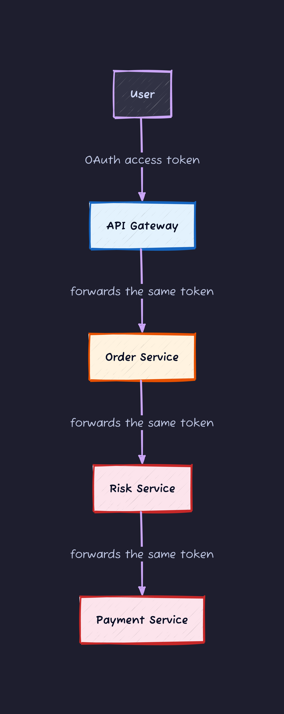
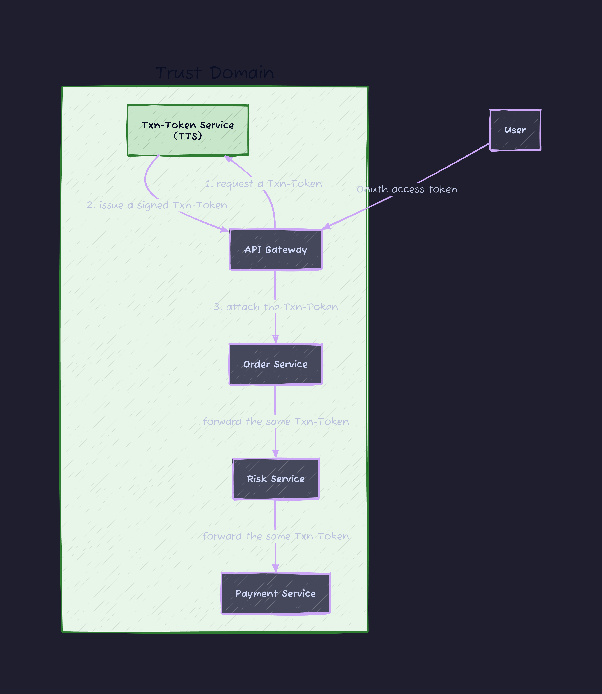
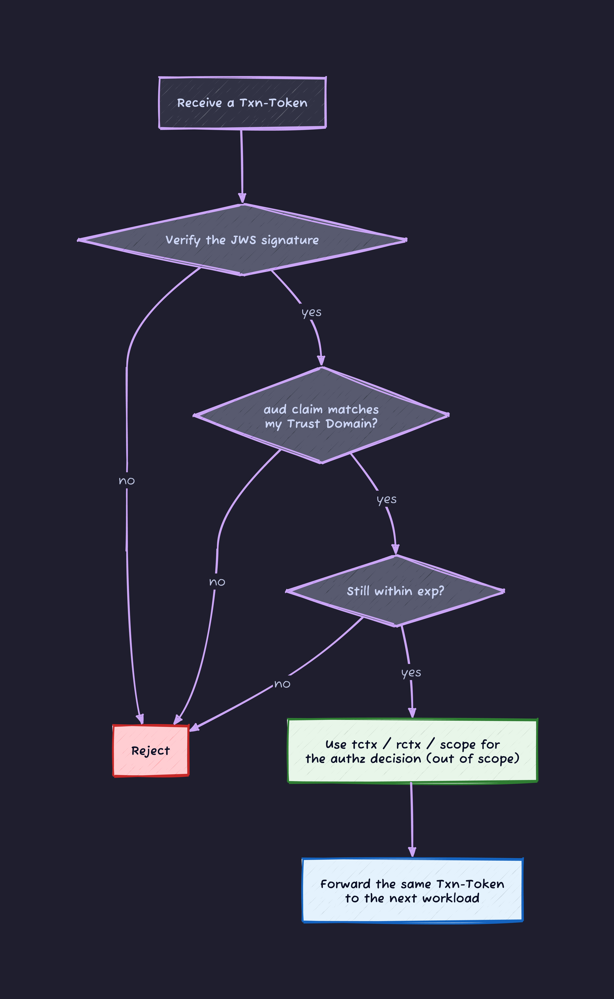
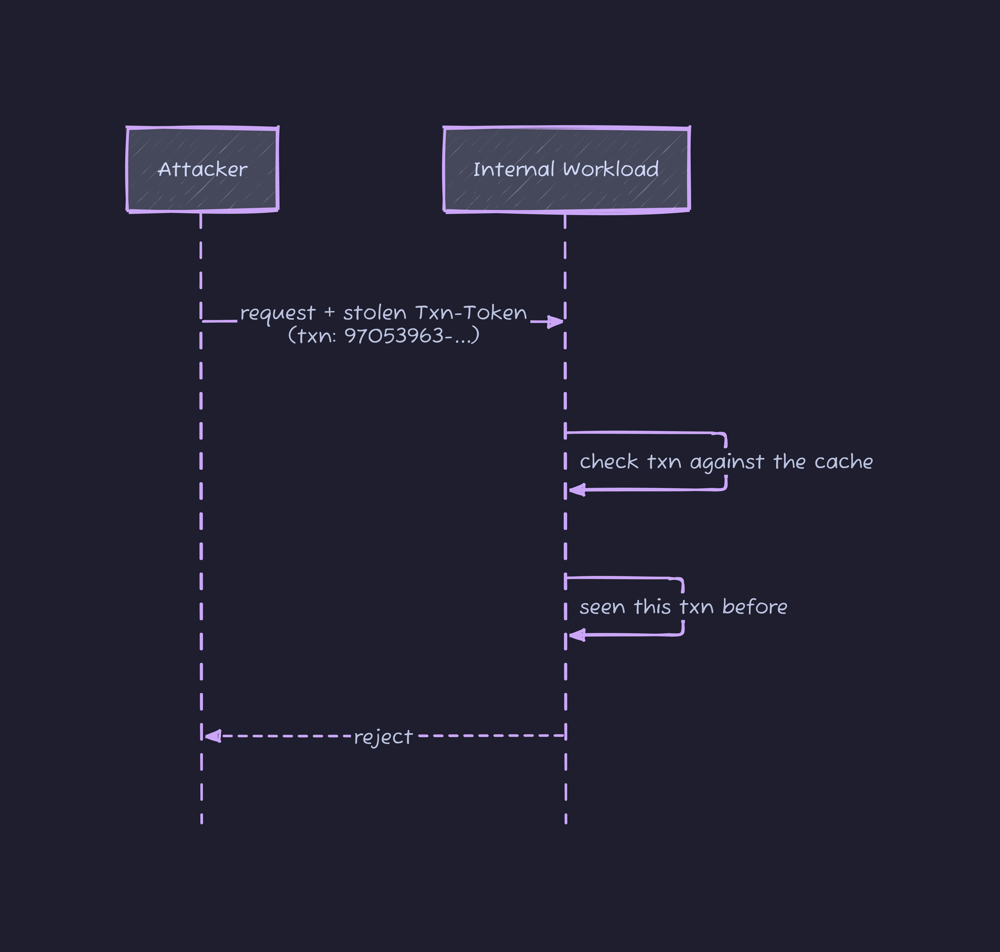
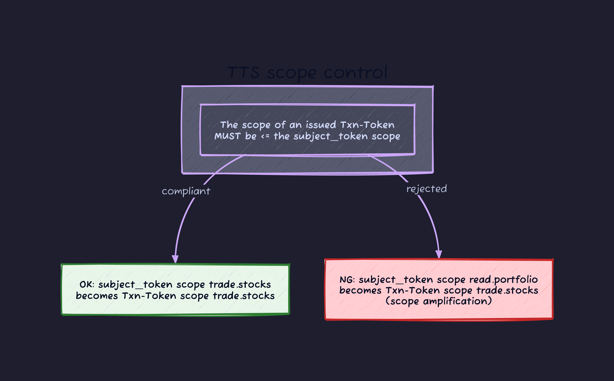
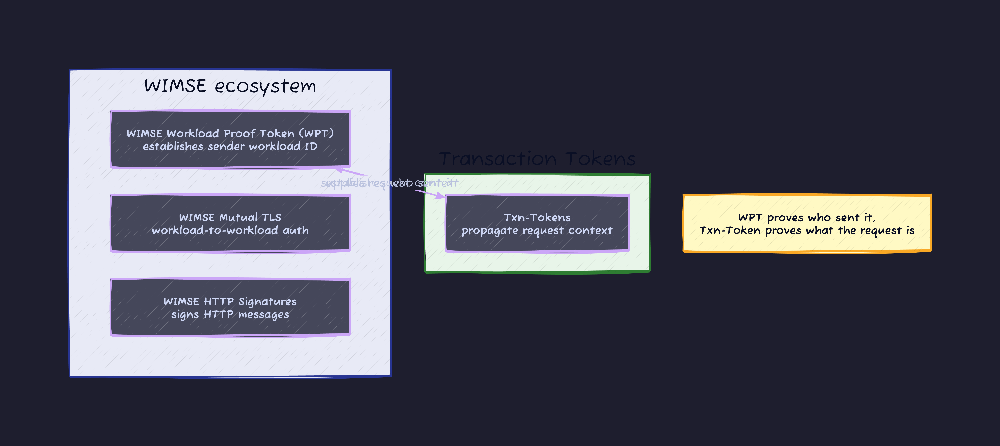

# Introduction

A modern system processes a single request across many cooperating microservices. A user clicks "Buy" on a trading site, and behind that one click the API gateway, the order service, the risk service, the payment service, and the notification service all fire in a chain.

That chain hides a basic question.

**"What happens if you take the user's OAuth access token that arrived at the first API gateway, and keep forwarding it as-is to every internal service?"**



Plenty goes wrong.

- **You are leaking an external token into the internals.** If that access token leaks, every internal service is exposed.
- **You lose track of who started the request.** The risk service cannot tell whether this call came through the user's gateway or whether someone is hitting it directly.
- **Any service can impersonate another.** Once the internal network is breached, a malicious workload can pretend to be a legitimate request and call other services.
- **Token theft.** Steal the OAuth token flowing internally and you can reach external resources too.

**Transaction Tokens (Txn-Tokens)** are the answer to all of this.

---

## What Transaction Tokens are

**draft-ietf-oauth-transaction-tokens-08** (Txn-Tokens for short) is a spec moving through the IETF OAuth WG. As of June 2026 the latest version is Draft 08, and it has entered **WG Last Call (WGLC)**, the final stage of the working group's process. The authors are engineers from CrowdStrike, Practical Identity, and Defakto Security, and the spec grew out of running microservices at real scale.

In one sentence:

> **A Txn-Token is a short-lived JWT that tells every workload inside a Trust Domain, in a tamper-proof way, who a request was started for and what it was started to do.**



The contrast:

| Axis                 | Forwarding the OAuth access token as-is                | Using Txn-Tokens                                |
| :------------------- | :----------------------------------------------------- | :---------------------------------------------- |
| **Leak risk**        | an externally-facing token flows through the internals | only an internal, short-lived token flows       |
| **Context**          | lost along the way                                     | every workload can verify the same context      |
| **Tamper detection** | none                                                   | the TTS signature makes it tamper-proof         |
| **Impersonation**    | hard to stop                                           | the TTS only issues for legitimate transactions |
| **Blast radius**     | unbounded                                              | narrowed by tight scopes                        |

---

## Terminology first

Before reading the spec, nail down the terms that are specific to Txn-Tokens.

| Term                        | Meaning                                                                                                                  |
| :-------------------------- | :----------------------------------------------------------------------------------------------------------------------- |
| **Trust Domain**            | A set of systems under a common security policy. This is the boundary where a Txn-Token is valid.                        |
| **External Endpoint**       | The entry point into a Trust Domain (an API gateway and the like), where external tokens arrive.                         |
| **Workload**                | A unit of execution: a container, a microservice, a managed database.                                                    |
| **Call Chain**              | The sequence of workloads invoked one after another for a single transaction.                                            |
| **TTS (Txn-Token Service)** | The special service inside a Trust Domain that issues Txn-Tokens.                                                        |
| **Txn-Token**               | A short-lived, signed JWT holding user ID, workload ID, and authorization context, flowing through the whole Call Chain. |

A **Trust Domain** is a group of systems that share a common security policy and controls. Two or more workloads on a physically or virtually isolated network form one Trust Domain, and access to a workload is restricted to its published interfaces only.

The **TTS** is the single special service inside a Trust Domain that issues Txn-Tokens. "Logically one" means you can run multiple instances for availability, as long as they are unified under one trust policy.

---

## What kind of JWT a Txn-Token is

A Txn-Token is just a signed JWT (JSON Web Token) carrying a specific set of claims.

### JWT header

```json
{
  "typ": "txntoken+jwt",
  "alg": "RS256",
  "kid": "identifier-to-key"
}
```

The `typ` of `txntoken+jwt` marks this token as a Txn-Token. That media type also gets registered with IANA.

### JWT body claims

| Claim    | Required | Meaning                                                                         |
| :------- | :------- | :------------------------------------------------------------------------------ |
| `iat`    | yes      | issued-at time                                                                  |
| `aud`    | yes      | Trust Domain identifier (unusable outside this domain)                          |
| `exp`    | yes      | expiry                                                                          |
| `txn`    | yes      | transaction-unique ID (per RFC 8417 Section 2.2)                                |
| `sub`    | yes      | the subject of the transaction (a user or workload identifier)                  |
| `scope`  | yes      | the purpose and permission range of this transaction (per RFC 8693 Section 4.2) |
| `req_wl` | yes      | identifier of the workload that requested the Txn-Token                         |
| `iss`    | no       | issuer (omit when the signing key is already known)                             |
| `rctx`   | no       | requester environment context (source IP, auth method, ...)                     |
| `tctx`   | no       | transaction context (values that stay constant across the Call Chain)           |

The two that matter most are `tctx` (Transaction Context) and `rctx` (Requester Context).

#### tctx (Transaction Context)

Holds the parts of the transaction that **do not change** across the call chain. The TTS sets this as authoritative data, and services read it to make authorization decisions.

```json
"tctx": {
  "action": "BUY",
  "ticker": "MSFT",
  "quantity": "100",
  "customer_type": {
    "geo": "US",
    "level": "VIP"
  }
}
```

#### rctx (Requester Context)

Holds the **environment** of the request: the source IP, auth method, and so on of the original caller.

```json
"rctx": {
  "req_ip": "69.151.72.123",
  "authn": "urn:ietf:rfc:6749"
}
```

### A real Txn-Token (the stock-trade case)

```json
{
  "iat": 1686536226,
  "aud": "trust-domain.example",
  "exp": 1686536586,
  "txn": "97053963-771d-49cc-a4e3-20aad399c312",
  "sub": "d084sdrt234fsaw34tr23t",
  "req_wl": "apigateway.trust-domain.example",
  "rctx": {
    "req_ip": "69.151.72.123",
    "authn": "urn:ietf:rfc:6749"
  },
  "scope": "trade.stocks",
  "tctx": {
    "action": "BUY",
    "ticker": "MSFT",
    "quantity": "100",
    "customer_type": {
      "geo": "US",
      "level": "VIP"
    }
  }
}
```

Notice `exp` is `iat` + 360 seconds (6 minutes). **A Txn-Token must be short-lived.** Set it to a few minutes at most.

---

## The basic flow: handling an external request

Let's walk through how Transaction Tokens get used, with a sequence diagram.

### Basic flow (external request)


The key part is **step 3, the call chain.** The Txn-Token is **forwarded unchanged** between internal services. You must not modify it. Because each service verifies the signature independently, every one of them can confirm that the TTS authorized this transaction.

### When the request starts internally

An external API call is not the only way a transaction begins. A scheduler, a batch job, or any internal workload can kick off a transaction on its own.


With no external OAuth token in hand, the workload generates a **Self-Signed JWT** and presents it to the TTS. The TTS verifies it, confirms the request comes from a legitimate workload, and then issues a Txn-Token.

---

## The Txn-Token Service (TTS) in detail

The TTS is the heart of the spec. It is implemented as a profile of RFC 8693 (OAuth 2.0 Token Exchange). Token Exchange is the OAuth extension for "trade a token you already hold for a new token with a different purpose or scope," using `grant_type=urn:ietf:params:oauth:grant-type:token-exchange`. The TTS rides on that mechanism to convert an OAuth access token (or the Self-Signed JWT above) into a Txn-Token.

### Request to the TTS (Token Exchange)

```http
POST /txn-token-service/token_endpoint HTTP/1.1
Host: txn-token-service.trust-domain.example
Content-Type: application/x-www-form-urlencoded

grant_type=urn:ietf:params:oauth:grant-type:token-exchange
&requested_token_type=urn:ietf:params:oauth:token-type:txn_token
&audience=http://trust-domain.example
&scope=trade.stocks
&subject_token=eyJhbGciOiJFUzI1NiIsImtpZCI...
&subject_token_type=urn:ietf:params:oauth:token-type:access_token
&request_context={"req_ip":"69.151.72.123","authn":"urn:ietf:rfc:6749"}
&request_details={"action":"BUY","ticker":"MSFT","quantity":"100"}
```

What each parameter means:

| Parameter              | Required | Description                                                            |
| :--------------------- | :------- | :--------------------------------------------------------------------- |
| `grant_type`           | yes      | the fixed Token Exchange value from RFC 8693                           |
| `requested_token_type` | yes      | set to the `txn_token` URN                                             |
| `audience`             | yes      | the Trust Domain identifier                                            |
| `scope`                | yes      | the purpose and permission of this transaction (keep it tight)         |
| `subject_token`        | yes      | a token proving the subject (OAuth access token, Self-Signed JWT, ...) |
| `subject_token_type`   | yes      | a URI naming the subject_token type                                    |
| `request_context`      | no       | request environment (IP, ...); lands in rctx                           |
| `request_details`      | no       | request details (the action, ...); used to build tctx                  |

### Kinds of subject_token

The TTS accepts several kinds of subject_token.

| subject_token        | `subject_token_type` URI                         | Typical use                              |
| :------------------- | :----------------------------------------------- | :--------------------------------------- |
| OAuth access token   | `urn:ietf:params:oauth:token-type:access_token`  | common at an external endpoint           |
| ID token (OIDC)      | `urn:ietf:params:oauth:token-type:id_token`      | a subject already authenticated via OIDC |
| SAML assertion       | `urn:ietf:params:oauth:token-type:saml2`         | SAML-based authentication                |
| Self-Signed JWT      | `urn:ietf:params:oauth:token-type:self_signed`   | sign-and-present for internal triggers   |
| Unsigned JSON object | `urn:ietf:params:oauth:token-type:unsigned_json` | the simplest internal trigger            |

Beyond the token types defined in RFC 8693, you can use `self_signed` / `unsigned_json` for internal triggers, plus any custom URN the parties agree on.

**Note**: a Refresh Token must not be used as a `subject_token`. Txn-Tokens are never minted from a Refresh Token.

### The TTS processing flow


### Response from the TTS

```http
HTTP/1.1 200 OK
Content-Type: application/json
Cache-Control: no-store

{
  "token_type": "N_A",
  "issued_token_type": "urn:ietf:params:oauth:token-type:txn_token",
  "access_token": "eyJCI6IjllciJ9...Qedw6rx"
}
```

The `token_type` of `N_A` matters. A Txn-Token is not a bearer token you present as-is. It is an internal-only carrier of authorization context, so per RFC 8693 the TTS returns `N_A`.

---

## Using the Txn-Token: internal service-to-service calls

### Carrying it in an HTTP header

A workload puts the Txn-Token in a dedicated HTTP header called `Txn-Token` and passes it to the next workload.

```http
POST /api/check-risk HTTP/1.1
Host: risk-service.trust-domain.example
Content-Type: application/json
Txn-Token: eyJhbGciOiJSUzI1NiIsInR5cCI6InR4bnRva2VuK2p3dCJ9...
Authorization: Bearer <workload-own-access-token>

{
  "order_id": "ord-12345"
}
```

**Important**: do not put the Txn-Token in the `Authorization` header (the spec says `MUST NOT`, Section 13). The thing to notice is that `Txn-Token` and `Authorization` sit side by side in the example above. That is not a mistake, it is the intended shape: two layers run at once inside one request.

- `Authorization`: carries the calling workload's own authentication, plus **coarse service-to-service authorization** (is this service allowed to call this API).
- `Txn-Token`: carries who and what the request was started **for, and to do** (user ID, the action, and other fine-grained immutable context).

The `Authorization` header may already be in use for some other purpose, so piggy-backing the Txn-Token on it would collide. That is why it gets its own `Txn-Token` header.

### Verification on the receiving workload



At this point, **you must not modify the Txn-Token.** Forward it exactly as received. Passing the TTS-signed token along idempotently is what keeps the context consistent across the whole call chain.

---

## Pairing it with workload authentication

Public-key based mutual authentication with the TTS is recommended.

- **mTLS (RFC 8705)**: mutual TLS certificates so the workload and the TTS authenticate each other
- **SPIFFE / SPIRE**: the workload identity standard, proven with an SVID
- **WIMSE Mutual TLS** (draft-ietf-wimse-mutual-tls)
- **WIMSE HTTP Signatures** (draft-ietf-wimse-http-signature)
- **WIMSE Workload Proof Token** (draft-ietf-wimse-wpt)
- **Client Authentication JWT (RFC 7523)**

The TTS authenticates to the workload and the workload authenticates to the TTS (mutual). If the workload does not authenticate the TTS, it risks leaking its OAuth access token to a rogue TTS.

---

## Lifetime and replay defense

### Designing the lifetime

The design principle is simple: a Txn-Token only needs to live as long as the request takes to process. The spec spells it out: the lifetime `MUST be kept short` (on the order of minutes or less). Even for a long-running batch, you do not make the Txn-Token long-lived. You re-issue a fresh short-lived Txn-Token per transaction. And if the presented `subject_token` has already expired, the TTS must not issue a Txn-Token.

### Replay detection via the txn claim

The `txn` claim is a transaction-unique UUID. A workload that caches `txn` values briefly can **detect reuse of the same Txn-Token, that is, a replay attack.**



The catch: this is hard when multiple instances share no state. In practice you combine a short lifetime with correlating `txn` in the logs.

---

## Security considerations

### Never embed an access token inside a Txn-Token

Putting the original OAuth access token inside a Txn-Token is strictly forbidden. If the access token is still valid after the Txn-Token expires, an attacker can crack open the Txn-Token, pull out the access token, and use it to reach external resources.

### A Txn-Token is not an authentication credential

A Txn-Token does not prove a workload's identity. It is a carrier of authorization context. A workload still needs a separate mechanism (mTLS and the like) to authenticate itself to the TTS.

### Prevent scope amplification



### Never log a raw Txn-Token

Do not write a complete Txn-Token to your logs: it becomes replay material. Log one of:

- only a hash of the Txn-Token (for correlation)
- **or** the payload with the JWS signature stripped

Be extra careful when PII is involved.

---

## How Txn-Tokens relate to WIMSE

WIMSE (Workload Identity in Multi-System Environments) is the IETF WG standardizing workload identity and workload-to-workload authentication for microservice environments.



WIMSE and Txn-Tokens complement each other. WIMSE WPT establishes a workload's own identity, and Txn-Tokens supply the context of the request that workload is processing. Used together, they give you the authentication and authorization model a zero-trust microservice architecture wants.

---

## Identity Chaining vs Txn-Tokens

A related spec is **draft-ietf-oauth-identity-chaining**. Both aim to propagate request context, but they target different problems. Identity Chaining propagates user identity **across Trust Domains** (cross-domain federation), while Transaction Tokens propagate the full request context **within a single Trust Domain** (consistency inside the call chain).

| Axis                | Identity Chaining                    | Transaction Tokens                              |
| :------------------ | :----------------------------------- | :---------------------------------------------- |
| **Scope of use**    | between Trust Domains (cross-domain) | within a Trust Domain (same domain)             |
| **Main goal**       | access a resource in another domain  | keep context consistent across the call chain   |
| **Token basis**     | RFC 8693 + RFC 7523 combined         | a profile of RFC 8693                           |
| **Context carried** | mainly user identity                 | user identity + action + environment, all of it |

---

## Wrap-up

The problems inside microservices were these: external tokens circulating through the internals, request context lost along the way, impersonation you cannot detect. Txn-Tokens solve them by converting the external token into an internal-only Txn-Token, keeping one consistent context across the call chain, blocking tampering and impersonation with the TTS signature, and shrinking the blast radius with short lifetimes and tight scopes.

The benefits, summarized:

1. **Short-lived + per-transaction binding** → lower replay risk
2. **Tight scope** → limits lateral movement
3. **TTS signature** → blocks tampering inside the call chain
4. **Independent verification at each workload** → rejects unauthorized direct calls
5. **Only workloads with the right permission can obtain one** → contains the impact of a compromised service

The spec is at Draft 08 and in WG Last Call, the final stretch before becoming an RFC. Standardization is moving ahead with WIMSE integration in view. If you are serious about applying zero trust to your microservices, this is one of the specs to track now.

---

## References

- [draft-ietf-oauth-transaction-tokens-08](https://datatracker.ietf.org/doc/draft-ietf-oauth-transaction-tokens/)
- [RFC 8693 - OAuth 2.0 Token Exchange](https://datatracker.ietf.org/doc/html/rfc8693)
- [RFC 7519 - JSON Web Token (JWT)](https://datatracker.ietf.org/doc/html/rfc7519)
- [RFC 8417 - Security Event Token (SET)](https://datatracker.ietf.org/doc/html/rfc8417)
- [draft-ietf-wimse-arch - WIMSE Architecture](https://datatracker.ietf.org/doc/draft-ietf-wimse-arch/)
