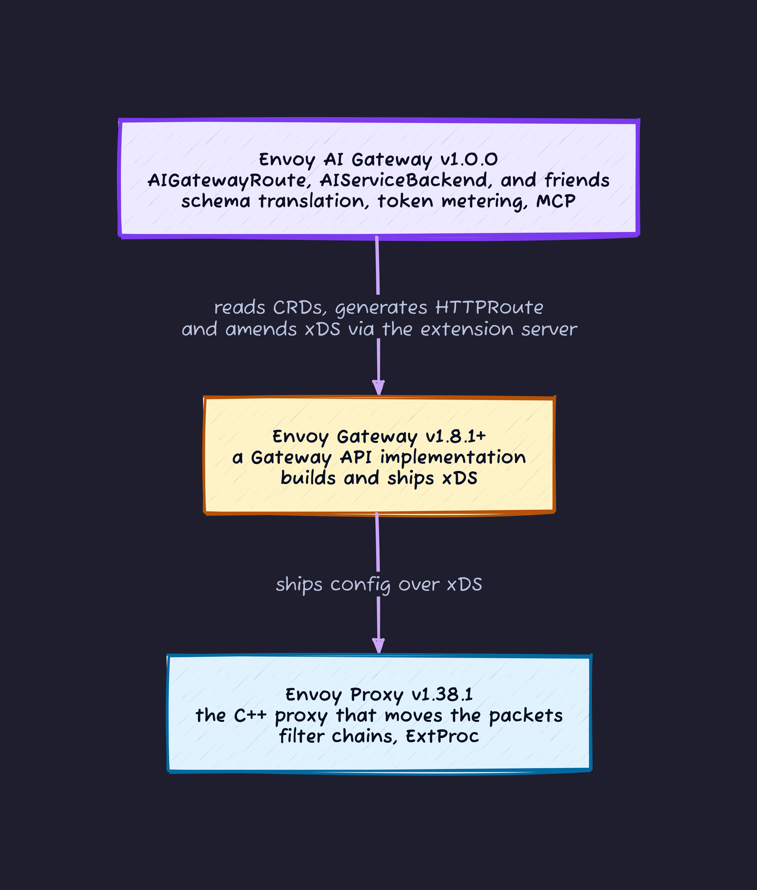
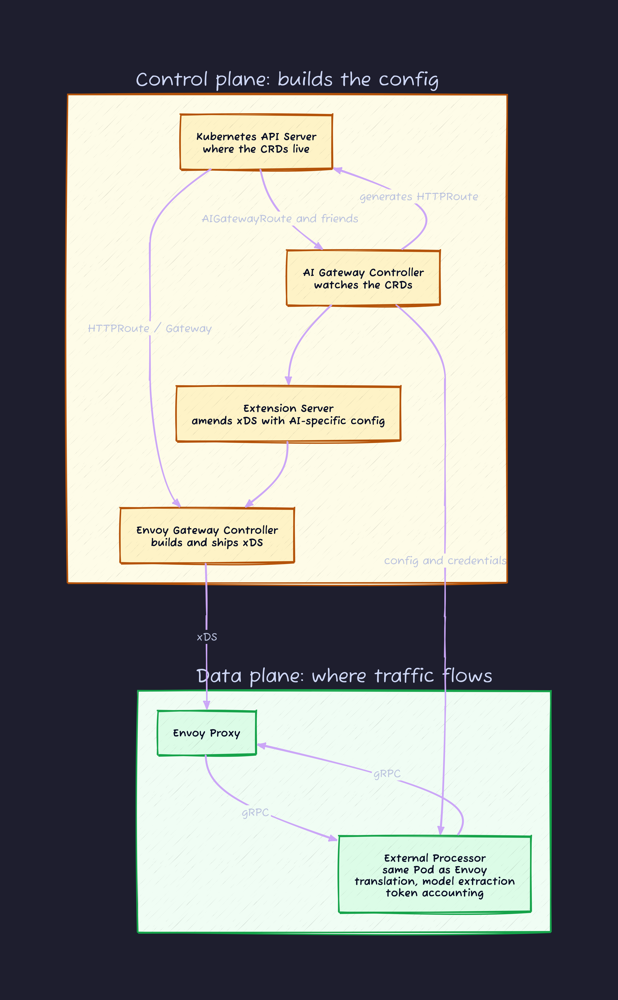
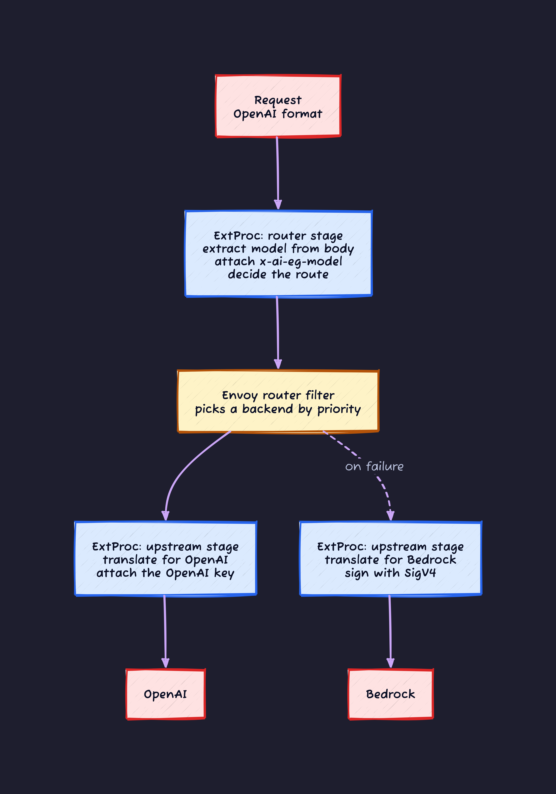
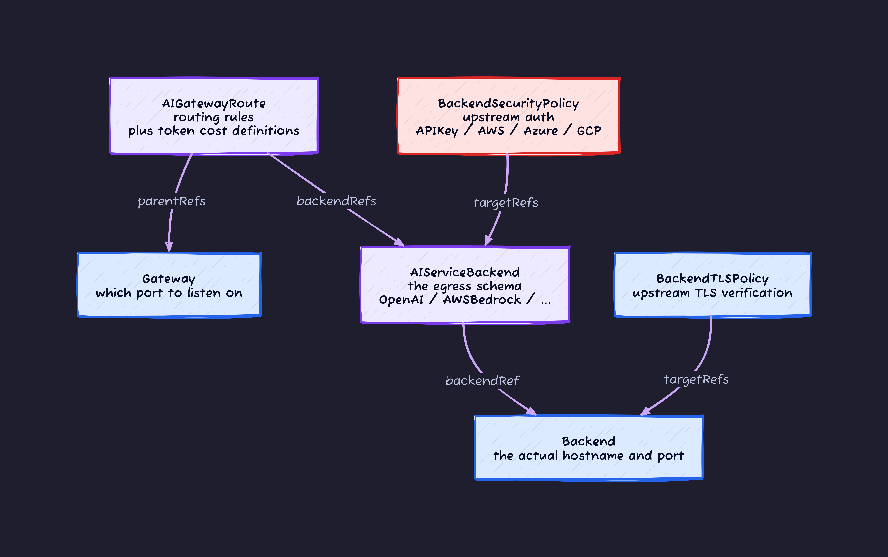
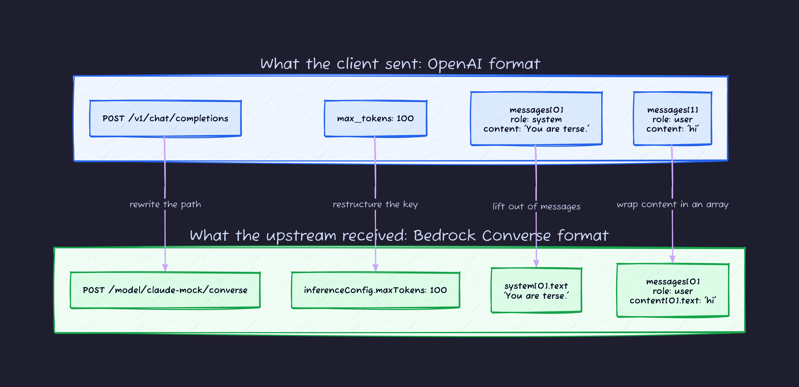
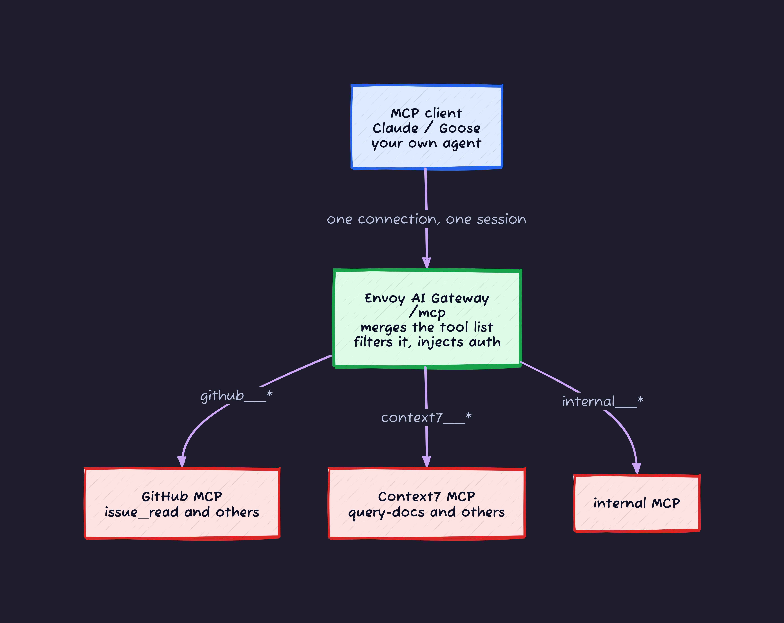

## The day we ended up with three places to call an LLM

It started with OpenAI. Then someone pointed out that Bedrock had a cheaper model for one of our workloads, so Bedrock got added. Then a team wanted to use the vLLM instance running on our own GPUs, and that made three.

At that point the codebase looked like this:

- Service A called the OpenAI SDK directly
- Service B hit `bedrock-runtime` through boto3
- Service C talked to vLLM with a hand-rolled HTTP client
- Three API keys lived in three separate Secrets, each with its own rotation procedure
- Nobody could answer "how many tokens did each team burn last month?"

Every one of those code paths does the same thing: send text, get text back. And yet we had three SDKs, three retry policies, three auth schemes, three sets of instrumentation. That is not an application problem. It is the absence of a front door. The HTTP world solved this fifteen years ago with API gateways, and the same thing is happening again with LLM traffic.

[Envoy AI Gateway](https://aigateway.envoyproxy.io/) is the project filling that gap, and it hit v1.0 GA on June 23, 2026.

This article builds up in order: **start with local execution that uses no Kubernetes whatsoever**, then look at real schema translation, fallback, MCP, and only at the end move to Kubernetes. Read it top to bottom and you can follow along with your hands on the keyboard.

Every command and every output below came from an actual run. The environment was macOS on arm64, Go 1.26.5, aigw v1.0.0, kind v0.32.0, Envoy Gateway v1.8.1, and Envoy AI Gateway v1.0.0.

---

## 0. How to read this

| Sections | Content | What you need |
| --- | --- | --- |
| 1 - 2 | What an AI gateway is, and where it sits in the Envoy family | Nothing |
| 3 - 4 | Architecture and the CRDs | Nothing |
| 5 | Get it running | Go or Docker |
| 6 | Watch schema translation happen | Same |
| 7 | Fallback and model name virtualization | Same |
| 8 | MCP gateway | Same, plus Node.js |
| 9 | Move it to Kubernetes | kind / kubectl / helm |
| 10 - 12 | Token limits, production features, when to adopt | Nothing |

**Sections 5 through 8 need neither Kubernetes nor a cloud API key.** Everything happens against mock servers running on localhost. If you are short on time, those four sections alone are worth it.

---

## 1. What makes an "AI gateway" different from a normal API gateway

"Can't you just put nginx or Envoy in front of the LLM?" is a reasonable instinct, and it is about 70 percent right. The other 30 percent is why a dedicated product exists.

### 1-1. The same operation has three different shapes

OpenAI, Anthropic, and Bedrock all support "one round trip of chat," and all three want a different path, a different body, and return a different response shape.

```text
OpenAI      POST /v1/chat/completions   {"model":..., "messages":[...], "max_tokens":N}
Anthropic   POST /v1/messages           {"model":..., "messages":[...], "max_tokens":N, "system":"..."}
Bedrock     POST /model/<id>/converse   {"messages":[{"role":..,"content":[{"text":..}]}],
                                         "system":[{"text":..}],
                                         "inferenceConfig":{"maxTokens":N}}
```

`max_tokens` becomes `inferenceConfig.maxTokens`. The system prompt gets pulled out of `messages` and turned into its own top-level array. A normal reverse proxy can rewrite paths and headers, but **restructuring a JSON body** is outside its job description.

This is the least glamorous and most valuable thing an AI gateway does. Section 6 shows it happening for real.

### 1-2. Requests are the wrong unit for billing

For a normal API, "100 requests per second" is a fine limit. For an LLM it barely means anything. A 10-token request and a 100,000-token request both count as 1. The cost differs by four orders of magnitude.

Worse, **you do not know the consumption until the response comes back**. At request time the output token count does not exist yet. You need a pay-later model: approve first, bill afterward. That is a different premise than any rate limiter was built on.

### 1-3. Responses stream for a long time

An SSE connection stays open for tens of seconds to several minutes. Default timeouts, buffer sizes, whether a retry is even safe. All of it drifts from HTTP API common sense.

Here are those three problems in one picture. On the left, every application carries its own translation, key management, and instrumentation. On the right, that moves into the gateway.


The reduction in lines matters less than the fact that **capabilities disappeared from the application boxes**. Getting API keys out of applications is the single biggest operational win.

---

## 2. Where this sits in the Envoy family

Three products with confusingly similar names stack on top of each other, so let me sort that out first.



- **Envoy Proxy** carries the data. On its own it needs either a config file or xDS.
- **Envoy Gateway** is the management layer that reads Kubernetes Gateway API resources and turns them into Envoy config.
- **Envoy AI Gateway** adds AI-specific CRDs on top and reaches into xDS through an Envoy Gateway extension point called the *extension server*.

Envoy AI Gateway does not **replace** Envoy Gateway. It sits on top. If you already run Envoy Gateway you can bolt this on, but the flip side is that Envoy Gateway concepts become prerequisites.

If you have never touched Gateway API, these four are enough to follow along.

| Resource | Role |
| --- | --- |
| `GatewayClass` | Which implementation to use. The `ingressClass` equivalent |
| `Gateway` | Which port to listen on |
| `HTTPRoute` | How to route |
| `Backend` | Target hostname and port. An Envoy Gateway specific CRD |

Think of it as the standard Kubernetes API group that succeeded Ingress.

---

## 3. Architecture

### 3-1. Control plane and data plane



**None of the AI-specific logic lives inside Envoy itself.** All of it is pushed out into an external process called ExtProc.

Since that term just appeared for the first time, here is what it means. ExtProc is a stock Envoy HTTP filter that streams request and response headers and bodies to an external process over gRPC, and then **applies whatever that external process rewrote back into Envoy**. Envoy AI Gateway implements its side in Go. That means no C++ to write, and no coupling to Envoy's own release cycle.

### 3-2. Why ExtProc is wired in twice

ExtProc sits in two places: **in front of the router filter** and **at the upstream filter position**. This is the design decision that pays off the most, so it is worth explaining before you see the effect.

Later in this article you will configure "if the primary provider fails, fall back to a different one." In Envoy, that retry happens **after** the router filter, at the upstream level. Here is the problem: if the primary is OpenAI and the fallback is Bedrock, then **the moment you fail over, both the body translation and the auth header have to change**. Translating once, before the router, would be too early.



Splitting it in two exists to preserve an obvious ordering rule: translate only after the destination is known.

### 3-3. The life of a request


Two things to take away.

First, `x-ai-eg-model` is **not a header the client sets**. The gateway extracts it from the `model` field in the body and attaches it itself. Your routing rules match on that header.

Second, *dynamic metadata*. This is a named scratch area Envoy keeps per request, used to pass values between filters. ExtProc writes token counts there, and the rate limiter downstream reads them. Section 10 puts it to work.

---

## 4. The CRDs worth memorizing



| Resource | Role |
| --- | --- |
| `AIGatewayRoute` | The unified API as clients see it. Picks a backend by header match. **Generates an `HTTPRoute` with the same name** |
| `AIServiceBackend` | One upstream. `schema` declares what format that upstream speaks, which decides the translation target |
| `BackendSecurityPolicy` | Upstream auth. API keys, plus short-lived tokens fetched from AWS STS, Entra ID, or GCP STS |
| `Backend` | Hostname and port. An Envoy Gateway resource, not AI-specific |
| `MCPRoute` | Aggregates MCP servers. Section 8 |
| `QuotaPolicy` | Cumulative token budgets. Section 10 |
| `GatewayConfig` | Per-Gateway ExtProc settings |

One thing trips people up here. In v1.0, `AIGatewayRoute` has **no** `schema` field. The input schema is **determined by the request path**: `/v1/chat/completions` means OpenAI format, `/anthropic/v1/messages` means Anthropic format. The only thing you declare is the egress side, `AIServiceBackend.schema`.

At v1.0 GA, `AIGatewayRoute`, `AIServiceBackend`, `BackendSecurityPolicy`, `GatewayConfig`, and `MCPRoute` all became stable at `v1beta1`. The maintainers state plainly that they will not break these APIs short of a critical security issue. `QuotaPolicy` is still `v1alpha1` and sits outside that promise.

---

## 5. Hands-on: run it without Kubernetes

Envoy AI Gateway ships a CLI called `aigw` that stands up a gateway locally **with neither Kubernetes nor Docker**, eating exactly the same CRD YAML. It is good for learning and for validating config before you ship it. Linux and macOS only.

### 5-1. Install aigw

If you have Go, this is the fastest path.

```bash
go install github.com/envoyproxy/ai-gateway/cmd/aigw@v1.0.0
export PATH=$PATH:$(go env GOPATH)/bin
```

Docker works too.

```bash
docker run --rm -p 1975:1975 -e OPENAI_API_KEY=$OPENAI_API_KEY \
  envoyproxy/ai-gateway-cli run
```

Prebuilt binaries are on [GitHub Releases](https://github.com/envoyproxy/ai-gateway/releases). The whole subcommand surface is this:

```text
  version                Show version.
  run [<path>]           Run the AI Gateway locally for given configuration.
  healthcheck            Docker HEALTHCHECK command.
  download-envoy         Download Envoy binary for the Envoy Gateway default version.
```

On first start, `aigw run` fetches the Envoy binary for you. On my machine that put Envoy 1.38.1 under `~/.local/share/aigw/`, about 97MB. Later runs reuse it.

One gotcha: if you installed via `go install`, `aigw version` prints `dev` because the build info never got stamped in. Use a release binary or the Docker image if you need to confirm the version.

### 5-2. Stand up a mock LLM to talk to

Burning real OpenAI credit for this would be wasteful, so here is a server that returns an OpenAI-compatible response and nothing else, written against the Python standard library. Zero dependencies.

```python
#!/usr/bin/env python3
"""Minimal OpenAI-compatible mock upstream, for testing aigw locally."""
import json
import time
from http.server import BaseHTTPRequestHandler, HTTPServer


class Handler(BaseHTTPRequestHandler):
    def log_message(self, fmt, *args):
        print("upstream <- %s %s" % (self.command, self.path), flush=True)

    def do_POST(self):
        n = int(self.headers.get("content-length", 0))
        body = json.loads(self.rfile.read(n) or b"{}")
        # observe what the gateway injected on the way in
        print("authorization=%r" % self.headers.get("authorization"), flush=True)
        print("model=%r" % body.get("model"), flush=True)
        self._json({
            "id": "chatcmpl-mock",
            "object": "chat.completion",
            "created": int(time.time()),
            "model": body.get("model", "mock-gpt"),
            "choices": [{"index": 0, "finish_reason": "stop",
                         "message": {"role": "assistant", "content": "I'll be back."}}],
            "usage": {"prompt_tokens": 11, "completion_tokens": 5, "total_tokens": 16},
        })

    def _json(self, obj, code=200):
        raw = json.dumps(obj).encode()
        self.send_response(code)
        self.send_header("content-type", "application/json")
        self.send_header("content-length", str(len(raw)))
        self.end_headers()
        self.wfile.write(raw)


HTTPServer(("127.0.0.1", 11434), Handler).serve_forever()
```

Save it as `mockllm.py` and start it. Port 11434 matches Ollama's default, so if you already run Ollama you can point at that instead of the mock.

```bash
python3 mockllm.py &
```

### 5-3. Start it with no config file

`aigw run` generates its own config from environment variables. If any of `OPENAI_API_KEY`, `AZURE_OPENAI_API_KEY`, or `ANTHROPIC_API_KEY` is set, no config file is needed. Override `OPENAI_BASE_URL` to aim it at the mock or at Ollama.

```bash
OPENAI_BASE_URL=http://localhost:11434/v1 OPENAI_API_KEY=unused aigw run
```

```text
AI Gateway External Processor is ready
Envoy AI Gateway listening on http://localhost:1975 (admin http://localhost:52816) after 6.3s
```

First start took 6.3 seconds including the Envoy download. Later starts took 1.4 seconds.

The `admin` port in that log line is **Envoy's own admin port**, and it changes on every start. The aigw admin endpoint you will use shortly is a different thing, fixed at **1064**.

### 5-4. Send a request

```bash
curl -s -H "Content-Type: application/json" -XPOST \
  http://localhost:1975/v1/chat/completions \
  -d '{"model":"mock-gpt","messages":[{"role":"user","content":"Say this is a test!"}]}'
```

```json
{"id": "chatcmpl-mock", "object": "chat.completion", "model": "mock-gpt", "choices": [{"index": 0, "finish_reason": "stop", "message": {"role": "assistant", "content": "I'll be back."}}], "usage": {"prompt_tokens": 11, "completion_tokens": 5, "total_tokens": 16}}
```

That worked. The interesting part is on the mock side.

```text
authorization='Bearer unused'
model='mock-gpt'
upstream <- POST /v1/chat/completions
```

The curl command sent no `Authorization` header at all, yet the upstream received `Bearer unused`. **The gateway injected `OPENAI_API_KEY`.** That is "get keys out of the application" made concrete, and on Kubernetes `BackendSecurityPolicy` fills the same role.

### 5-5. Tokens are already being counted

The aigw admin port at 1064 serves Prometheus-format metrics.

```bash
curl -s http://localhost:1064/health
curl -s http://localhost:1064/metrics | grep -E 'gen_ai.*(_sum|_count)\{'
```

```text
OK
gen_ai_client_token_usage_sum{gen_ai_operation_name="chat",gen_ai_provider_name="openai",gen_ai_request_model="mock-gpt",gen_ai_token_type="input"} 11
gen_ai_client_token_usage_sum{...,gen_ai_token_type="output"} 5
gen_ai_server_request_duration_seconds_sum{...} 0.010359625
```

The `prompt_tokens: 11` and `completion_tokens: 5` the mock returned landed straight in the metrics. Names and labels follow the [OpenTelemetry GenAI semantic conventions](https://opentelemetry.io/docs/specs/semconv/attributes-registry/gen-ai/), so dashboards can stay vendor neutral.

Note that `gen_ai_client_token_usage` is exported as a **histogram**, not a counter. Use `_sum` for total tokens and `_count` for request counts.

| Metric | What it tells you |
| --- | --- |
| `gen_ai.client.token.usage` | Token consumption. `gen_ai.token.type` splits input from output |
| `gen_ai.server.request.duration` | End-to-end request latency |
| `gen_ai.server.time_to_first_token` | Time to the first token. Perceived responsiveness |
| `gen_ai.server.time_per_output_token` | Inter-token latency. Generation speed |

For LLMs, how fast something feels is usually decided by time to first token rather than total latency, so getting that out of the box matters.

---

## 6. Hands-on: watch schema translation happen

Section 1 claimed that restructuring JSON is the least glamorous and most valuable thing here. Time to see it.

The setup: **stand up a mock that expects requests in Bedrock Converse format**, then **send it OpenAI format from the client**. Print the raw body the upstream received and the gateway's work is right there on screen.

### 6-1. A mock that speaks Bedrock

```python
#!/usr/bin/env python3
"""AWS Bedrock Converse format mock upstream.
   Prints whatever the gateway translated the request into."""
import json
import sys
from http.server import BaseHTTPRequestHandler, HTTPServer


class Handler(BaseHTTPRequestHandler):
    def log_message(self, fmt, *args):
        pass

    def do_POST(self):
        n = int(self.headers.get("content-length", 0))
        raw = self.rfile.read(n)
        print("=== path the upstream received ===", flush=True)
        print(self.path, flush=True)
        print("=== body the upstream received ===", flush=True)
        print(json.dumps(json.loads(raw or b"{}"), indent=2), flush=True)

        # respond in Bedrock Converse format
        resp = {
            "output": {"message": {"role": "assistant",
                                   "content": [{"text": "I'll be back."}]}},
            "stopReason": "end_turn",
            "usage": {"inputTokens": 11, "outputTokens": 5, "totalTokens": 16},
        }
        body = json.dumps(resp).encode()
        self.send_response(200)
        self.send_header("content-type", "application/json")
        self.send_header("content-length", str(len(body)))
        self.end_headers()
        self.wfile.write(body)


HTTPServer(("127.0.0.1", 11600), Handler).serve_forever()
```

### 6-2. Set the egress schema to AWSBedrock

The config is short. Set `schema.name` on the `AIServiceBackend` to `AWSBedrock` and that is it.

```yaml
apiVersion: aigateway.envoyproxy.io/v1beta1
kind: AIServiceBackend
metadata:
  name: bedrock-mock
  namespace: default
spec:
  schema:
    name: AWSBedrock
  backendRef:
    name: bedrock-mock
    kind: Backend
    group: gateway.envoyproxy.io
---
apiVersion: gateway.envoyproxy.io/v1alpha1
kind: Backend
metadata:
  name: bedrock-mock
  namespace: default
spec:
  endpoints:
    - fqdn:
        hostname: localhost
        port: 11600
```

Add the same `GatewayClass`, `Gateway`, and `AIGatewayRoute` used in section 7, then start it with `aigw run translate.yaml`.

### 6-3. Send OpenAI format

```bash
curl -s -XPOST http://localhost:1975/v1/chat/completions \
  -H 'content-type: application/json' \
  -d '{"model":"claude-mock","max_tokens":100,
       "messages":[{"role":"system","content":"You are terse."},
                   {"role":"user","content":"hi"}]}'
```

This is what the upstream received.

```text
=== path the upstream received ===
/model/claude-mock/converse
=== body the upstream received ===
{
  "inferenceConfig": {
    "maxTokens": 100
  },
  "messages": [
    {
      "content": [
        {
          "text": "hi"
        }
      ],
      "role": "user"
    }
  ],
  "system": [
    {
      "text": "You are terse."
    }
  ]
}
```

Three separate things happened.



The third one, peeling the system prompt out of the `messages` array and relocating it into a standalone `system` array, is exactly the kind of thing you cannot express in reverse proxy configuration.

### 6-4. The return trip gets translated too

The mock replies in Bedrock format. This is what reached the client.

```json
{
    "choices": [
        {
            "finish_reason": "stop",
            "index": 0,
            "message": { "content": "I'll be back.", "role": "assistant" }
        }
    ],
    "model": "claude-mock",
    "object": "chat.completion",
    "usage": { "prompt_tokens": 11, "completion_tokens": 5, "total_tokens": 16 }
}
```

`output.message.content[0].text` became `choices[0].message.content`, and `usage.inputTokens` became `usage.prompt_tokens`. An OpenAI SDK will consume this unmodified.

### 6-5. Where I got stuck: `Anthropic` is not a valid translation target

My first attempt wrote the mock in Anthropic Messages format and set `schema.name: Anthropic`. It returned 500, with this in the log.

```text
level=ERROR msg="error processing request message"
  error="... failed to create translator for backend ...: unsupported API schema: backend={Anthropic  v1}"
```

Digging into it, the cause was not what I assumed. It is not that the translation is impossible. **That combination simply is not registered in a switch.** The error comes from here, in `internal/endpointspec/endpointspec.go`.

```go
// ChatCompletionsEndpointSpec.GetTranslator
switch schema.Name {
case filterapi.APISchemaOpenAI:        ...
case filterapi.APISchemaAWSBedrock:    ...
case filterapi.APISchemaAWSAnthropic:  ...
case filterapi.APISchemaAzureOpenAI:   ...
case filterapi.APISchemaGCPVertexAI:   ...
case filterapi.APISchemaGCPAnthropic:  ...
default:
    return nil, fmt.Errorf("unsupported API schema: backend=%s", schema)
}
```

There is no `case` for `APISchemaAnthropic`. That is the whole story.

The body translation from OpenAI format to Anthropic Messages format **exists and works today**. Both `openai_awsanthropic.go` and `openai_gcpanthropic.go` call the same `buildAnthropicParams(openAIReq, ...)`, and what that returns is `*anthropic.MessageNewParams`, the struct from Anthropic's official Go SDK. What is missing is the branch for "when the destination is api.anthropic.com," which would differ only by setting the path to `/v1/messages` and skipping the `anthropic_version` injection.

By contrast, the switch for requests entering through `/anthropic/v1/messages` has all five filled in.

```go
// MessagesEndpointSpec.GetTranslator
case APISchemaGCPAnthropic / APISchemaAWSAnthropic / APISchemaAnthropic
   / APISchemaOpenAI / APISchemaAWSBedrock
```

You can accept Anthropic format and emit to an OpenAI backend. Only the reverse direction has a hole in it.

In practice this is what it means:

| Where your Claude lives | Usable from an OpenAI-format client? |
| --- | --- |
| On Bedrock (`AWSAnthropic`) | Yes |
| On Vertex AI (`GCPAnthropic`) | Yes |
| Direct contract with Anthropic (`Anthropic`) | **No.** You have to receive on `/anthropic/v1/messages` |

The most straightforward setup is the least convenient one. This is a v1.0.0 observation and a later version may well close the gap.

Also worth clearing up: `AWSAnthropic` and `Anthropic` are not two routes to the same place. **They are the same model bought from different vendors.** api.anthropic.com does not accept IAM credentials, and Bedrock does not accept an Anthropic API key. Which one you write is not a preference, it is dictated by where your Claude actually lives.

| | `Anthropic` | `AWSAnthropic` | `AWSBedrock` |
| --- | --- | --- | --- |
| Destination | api.anthropic.com | Bedrock | Bedrock |
| Path | `/v1/messages` | `/model/<id>/invoke` | `/model/<id>/converse` |
| Body | Anthropic native | Anthropic native plus `anthropic_version` | Converse's shared format |
| Auth | `AnthropicAPIKey` | `AWSCredentials` | `AWSCredentials` |

`AWSAnthropic` and `AWSBedrock` both target Bedrock, but the former uses InvokeModel and drops the Anthropic body into a Bedrock envelope untouched, while the latter repacks everything into Converse, the format shared across all Bedrock models. Pick Converse if you want to swap between Claude and Llama with one request shape. Pick InvokeModel if you want Anthropic-specific structures to pass through intact.

So `schema` is decided by three things, not one: the shape of the upstream API, **which vendor you bought from**, and **whether that pairing with your ingress path is implemented**. These are the eight values defined at v1.0.0.

```text
OpenAI  AzureOpenAI  AWSBedrock  AWSAnthropic
Anthropic  GCPVertexAI  GCPAnthropic  Cohere
```

---

## 7. Hands-on: fallback and model name virtualization

What you actually want in production is "fail over to another provider when the primary dies" and "keep the model name fixed as far as the application is concerned." Here is both.

### 7-1. Stand up an upstream that fails

```python
#!/usr/bin/env python3
"""An upstream that always returns 503, for testing fallback."""
from http.server import BaseHTTPRequestHandler, HTTPServer


class Handler(BaseHTTPRequestHandler):
    def log_message(self, fmt, *args):
        print("primary(broken) <- %s %s" % (self.command, self.path), flush=True)

    def do_POST(self):
        self.rfile.read(int(self.headers.get("content-length", 0)))
        body = b'{"error":{"message":"upstream is down"}}'
        self.send_response(503)
        self.send_header("content-type", "application/json")
        self.send_header("content-length", str(len(body)))
        self.end_headers()
        self.wfile.write(body)


HTTPServer(("127.0.0.1", 11500), Handler).serve_forever()
```

Port 11500 is the broken primary. Port 11434 from section 5 is the healthy fallback.

### 7-2. Write the config

Save this as `aigw-config.yaml`. It is exactly the same CRD YAML you would use on Kubernetes, and you could `kubectl apply` it as is.

```yaml
apiVersion: gateway.networking.k8s.io/v1
kind: GatewayClass
metadata:
  name: aigw-run
spec:
  controllerName: gateway.envoyproxy.io/gatewayclass-controller
---
apiVersion: gateway.networking.k8s.io/v1
kind: Gateway
metadata:
  name: aigw-run
  namespace: default
spec:
  gatewayClassName: aigw-run
  listeners:
    - name: http
      protocol: HTTP
      port: 1975
---
apiVersion: aigateway.envoyproxy.io/v1beta1
kind: AIGatewayRoute
metadata:
  name: aigw-run
  namespace: default
spec:
  parentRefs:
    - name: aigw-run
      kind: Gateway
      group: gateway.networking.k8s.io
  rules:
    # the client only ever knows the invented model name "team-chat"
    - matches:
        - headers:
            - type: Exact
              name: x-ai-eg-model
              value: team-chat
      backendRefs:
        - name: primary
          priority: 0
          modelNameOverride: broken-model
        - name: secondary
          priority: 1
          modelNameOverride: mock-gpt
  llmRequestCosts:
    - metadataKey: llm_input_token
      type: InputToken
    - metadataKey: llm_output_token
      type: OutputToken
---
apiVersion: aigateway.envoyproxy.io/v1beta1
kind: AIServiceBackend
metadata:
  name: primary
  namespace: default
spec:
  schema:
    name: OpenAI
  backendRef:
    name: primary
    kind: Backend
    group: gateway.envoyproxy.io
---
apiVersion: gateway.envoyproxy.io/v1alpha1
kind: Backend
metadata:
  name: primary
  namespace: default
spec:
  endpoints:
    - fqdn:
        hostname: localhost
        port: 11500
---
apiVersion: aigateway.envoyproxy.io/v1beta1
kind: AIServiceBackend
metadata:
  name: secondary
  namespace: default
spec:
  schema:
    name: OpenAI
  backendRef:
    name: secondary
    kind: Backend
    group: gateway.envoyproxy.io
---
apiVersion: gateway.envoyproxy.io/v1alpha1
kind: Backend
metadata:
  name: secondary
  namespace: default
spec:
  endpoints:
    - fqdn:
        hostname: localhost
        port: 11434
---
apiVersion: gateway.envoyproxy.io/v1alpha1
kind: BackendTrafficPolicy
metadata:
  name: fallback
  namespace: default
spec:
  targetRefs:
    # an HTTPRoute is generated with the same name as the AIGatewayRoute, so aim at that
    - group: gateway.networking.k8s.io
      kind: HTTPRoute
      name: aigw-run
  retry:
    numRetries: 2
    # only one attempt per priority, so it drops to the next one immediately
    numAttemptsPerPriority: 1
    perRetry:
      backOff:
        baseInterval: 100ms
        maxInterval: 1s
      timeout: 30s
    retryOn:
      httpStatusCodes:
        - 503
      triggers:
        - connect-failure
        - retriable-status-codes
```

Three parts are worth reading closely.

`priority` is lowest-wins, so `0` is the intended target and anything from `1` up is a fallback.

`modelNameOverride` rewrites the `team-chat` the client sent into a different name right before it goes upstream. The same Claude Sonnet is called `anthropic.claude-sonnet-4-20250514-v1:0` on Bedrock and `claude-sonnet-4@20250514` on Vertex AI. This is the feature that keeps that difference from leaking into your application.

`BackendTrafficPolicy` targets not the `AIGatewayRoute` but the **`HTTPRoute` generated from it**, which carries the same name. Section 9 shows that generated object for real.

### 7-3. Run it

```bash
aigw run aigw-config.yaml
```

```bash
curl -s -w '\nHTTP %{http_code} in %{time_total}s\n' \
  -H "Content-Type: application/json" -XPOST \
  http://localhost:1975/v1/chat/completions \
  -d '{"model":"team-chat","messages":[{"role":"user","content":"hi"}]}'
```

```text
{"id": "chatcmpl-mock", ..., "message": {"role": "assistant", "content": "I'll be back."}}
HTTP 200 in 0.113045s
```

The client got a 200. The logs on both upstreams show what happened behind it.

```text
=== primary(broken) ===
primary(broken) <- POST /v1/chat/completions

=== secondary ===
model='mock-gpt'
upstream <- POST /v1/chat/completions
```

One attempt against the primary, a 503, then a switch to the secondary. And the model name the secondary received is **`mock-gpt`**, not `team-chat`, so `modelNameOverride` is doing its job. Of the 113ms total, 100ms is the `baseInterval` backoff we configured.

### 7-4. The metrics keep a record of the virtualization

```text
gen_ai_client_token_usage_sum{gen_ai_original_model="team-chat",gen_ai_request_model="mock-gpt",gen_ai_response_model="mock-gpt",gen_ai_token_type="input"} 11
```

`gen_ai_original_model` and `gen_ai_request_model` sit side by side as separate labels. **You can trace both what the application asked for and which model actually served it.** Without that, investigating the blast radius of a provider migration is hopeless.

### 7-5. Send a model that is not in any route

```bash
curl -s -w '\nHTTP %{http_code}\n' -XPOST http://localhost:1975/v1/chat/completions \
  -H 'content-type: application/json' -d '{"model":"nope","messages":[]}'
```

```text
No matching route found. It is likely because the model specified in your request is not configured in the Gateway.
HTTP 404
```

**Models are allowlisted.** Anything not written into an `AIGatewayRoute` does not get through. That prevents someone accidentally hammering an expensive model, at the cost of needing a config change to adopt a new one. Build that into your operational process.

### 7-6. Where I got stuck: forgetting `retriable-status-codes`

My first `retryOn` looked like this, and fallback silently did nothing.

```yaml
    retryOn:
      httpStatusCodes:
        - 503
      triggers:
        - connect-failure
        - reset
```

It says `httpStatusCodes: [503]` right there, and yet a 503 does not trigger a retry. This is Envoy behavior: **unless `triggers` contains `retriable-status-codes`, the `httpStatusCodes` list is never evaluated at all**. `httpStatusCodes` defines *which codes count as retriable*, and "retry on retriable codes" is a separate trigger you have to switch on.

This is Envoy in general rather than anything specific to Envoy AI Gateway, but it is the easiest trap to fall into when wiring up fallback.

---

## 8. Hands-on: use it as an MCP gateway

Since v0.4, Envoy AI Gateway also works as a gateway for the [Model Context Protocol](https://modelcontextprotocol.io/). It looks like a separate topic from LLM traffic, but the shape of the problem is identical. Connect an agent to five MCP servers and you have five sets of credentials scattered around and no record of which tools got called.



Name collisions between tools are avoided with **a prefix derived from the backend name**.

### 8-1. Try it against a public MCP server that needs no auth

You can pass config inline with `--mcp-json`. The format is the same `mcpServers` shape Claude Desktop and VS Code use.

```bash
aigw run --mcp-json '{"mcpServers":{"deepwiki":{"type":"http","url":"https://mcp.deepwiki.com/mcp"}}}'
```

Pull the tool list with the MCP Inspector in CLI mode.

```bash
npx --yes @modelcontextprotocol/inspector@0.16.8 \
  --cli http://localhost:1975/mcp --method tools/list
```

```text
"name": "deepwiki__ask_question",
"name": "deepwiki__read_wiki_contents",
"name": "deepwiki__read_wiki_structure",
```

Upstream, DeepWiki publishes these as `ask_question` and so on. Through the gateway they come back with **`deepwiki__` prepended**. Add more backends and the names still will not collide.

Now call one.

```bash
npx --yes @modelcontextprotocol/inspector@0.16.8 \
  --cli http://localhost:1975/mcp \
  --method tools/call \
  --tool-name deepwiki__read_wiki_structure \
  --tool-arg repoName=envoyproxy/ai-gateway
```

```text
Available pages for envoyproxy/ai-gateway:
- 1 Overview
  - 1.1 Key Concepts
  - 1.2 Architecture Overview
- 2 System Architecture
...
```

The prefix got stripped and the call landed on the right backend.

### 8-2. Narrow the tool list

`--mcp-config` reads the same thing from a file. Headers support environment variable interpolation with `${VAR}`.

```json
{
  "mcpServers": {
    "context7": {
      "type": "http",
      "url": "https://mcp.context7.com/mcp"
    },
    "github": {
      "type": "http",
      "url": "https://api.githubcopilot.com/mcp/readonly",
      "headers": {
        "Authorization": "Bearer ${GITHUB_ACCESS_TOKEN}"
      },
      "includeTools": ["issue_read", "list_issues"]
    }
  }
}
```

`includeTools` is the useful one. **You get to decide, at the gateway, which tools an agent can even see.** The GitHub MCP server has write operations too, but here only two read operations are exposed. As a defense against prompt injection, simply not showing an agent the dangerous tools has an unusually good ratio of effect to implementation cost.

On Kubernetes the same thing goes in an `MCPRoute`.

```yaml
apiVersion: aigateway.envoyproxy.io/v1beta1
kind: MCPRoute
metadata:
  name: mcp-route
  namespace: default
spec:
  parentRefs:
    - name: aigw-run
      kind: Gateway
      group: gateway.networking.k8s.io
  path: "/mcp"
  backendRefs:
    - name: github
      kind: Backend
      group: gateway.envoyproxy.io
      path: "/mcp/x/issues/readonly"
      toolSelector:
        includeRegex:
          - .*issues?.*
      securityPolicy:
        apiKey:
          secretRef:
            name: github-token
```

`toolSelector` takes exactly one of `include` or `includeRegex`. You cannot set both. Omit it entirely and every tool is exposed.

Going further, `securityPolicy.oauth` terminates the MCP spec's OAuth flow at the gateway and lets you evaluate JWT claims and scopes with CEL expressions to authorize individual tools.

---

## 9. Move it to Kubernetes

Once it makes sense locally, take it to a cluster. The YAML from section 7 carries over almost unchanged.

### 9-1. Prerequisites

You need **Kubernetes 1.32 or newer**. That is the requirement most likely to disqualify an existing cluster. Beyond that, kubectl, helm, and curl.

Locally, kind is fine.

```bash
kind create cluster --name aigw
```

Install Envoy Gateway with the AI Gateway values applied.

```bash
helm upgrade -i eg oci://docker.io/envoyproxy/gateway-helm \
  --version v1.8.1 \
  --namespace envoy-gateway-system \
  --create-namespace \
  -f https://raw.githubusercontent.com/envoyproxy/ai-gateway/main/manifests/envoy-gateway-values.yaml

kubectl wait --timeout=5m -n envoy-gateway-system \
  deployment/envoy-gateway --for=condition=Available
```

If Envoy Gateway is already installed, the extension server will not be enabled without these values. The project recommends reinstalling from a clean slate.

### 9-2. AI Gateway itself

The CRDs and the controller ship as separate charts.

```bash
helm upgrade -i aieg-crd oci://docker.io/envoyproxy/ai-gateway-crds-helm \
  --version v1.0.0 --namespace envoy-ai-gateway-system --create-namespace

helm upgrade -i aieg oci://docker.io/envoyproxy/ai-gateway-helm \
  --version v1.0.0 --namespace envoy-ai-gateway-system --create-namespace

kubectl wait --timeout=5m -n envoy-ai-gateway-system \
  deployment/ai-gateway-controller --for=condition=Available
```

Splitting the CRDs into their own chart started in v1.0, so upgrading from anything older requires a transfer of ownership.

```bash
helm upgrade -i aieg-crd oci://docker.io/envoyproxy/ai-gateway-crds-helm \
  --version v1.0.0 --namespace envoy-ai-gateway-system --take-ownership
```

On a kind node with 2 vCPU and 4GB, everything up to this point took a little over five minutes.

```text
NAMESPACE                 NAME                                     READY   STATUS
envoy-ai-gateway-system   ai-gateway-controller-7d76dd5b85-vqgsf   1/1     Running
envoy-gateway-system      envoy-gateway-f97c95b-5s2q9              1/1     Running
```

### 9-3. Get traffic flowing

The official sample works as is.

```bash
kubectl apply -f https://raw.githubusercontent.com/envoyproxy/ai-gateway/main/examples/basic/basic.yaml

kubectl wait pods --timeout=4m \
  -l gateway.envoyproxy.io/owning-gateway-name=envoy-ai-gateway-basic \
  -n envoy-gateway-system --for=condition=Ready
```

```bash
export ENVOY_SERVICE=$(kubectl get svc -n envoy-gateway-system \
  --selector=gateway.envoyproxy.io/owning-gateway-namespace=default,gateway.envoyproxy.io/owning-gateway-name=envoy-ai-gateway-basic \
  -o jsonpath='{.items[0].metadata.name}')

kubectl port-forward -n envoy-gateway-system svc/$ENVOY_SERVICE 8080:80
```

```bash
curl -s -H "Content-Type: application/json" \
  -d '{"model":"some-cool-self-hosted-model","messages":[{"role":"system","content":"Hi."}]}' \
  http://localhost:8080/v1/chat/completions
```

```json
{"choices": [{"index": 0,"message": {"role": "assistant","content": "I'm king of the world!"},"finish_reason": "stop"}],"usage": {"prompt_tokens": 1,"completion_tokens": 100,"total_tokens": 300}}
```

Traffic flows. As a side note, the official docs show the expected response as `"I'll be back."`, but the v1.0.0 test upstream image actually returns `"I'm king of the world!"`. It is a hardcoded string either way, so it does not matter.

### 9-4. Look at what got generated

This is the part most worth inspecting on the Kubernetes side. Applying a single `AIGatewayRoute` grew several resources behind your back.

```bash
kubectl get httproute,httproutefilter -A
```

```text
NAMESPACE   NAME                                                    AGE
default     httproute.../envoy-ai-gateway-basic                     5m
default     httproutefilter.../ai-eg-host-rewrite-envoy-ai-gateway-basic               5m
default     httproutefilter.../ai-eg-route-not-found-response-envoy-ai-gateway-basic   5m
```

There is **an `HTTPRoute` with the same name as the `AIGatewayRoute`**. That is what section 7 pointed `BackendTrafficPolicy` at. The contents tell you more.

```yaml
spec:
  rules:
  - backendRefs:
    - group: gateway.envoyproxy.io
      kind: Backend
      name: envoy-ai-gateway-basic-testupstream
      weight: 1
    filters:
    - extensionRef:
        kind: HTTPRouteFilter
        name: ai-eg-host-rewrite-envoy-ai-gateway-basic
      type: ExtensionRef
    matches:
    - headers:
      - name: x-ai-eg-model
        type: Exact
        value: some-cool-self-hosted-model
      path:
        type: PathPrefix
        value: /
    timeouts:
      request: 60s
  - filters:
    - extensionRef:
        kind: HTTPRouteFilter
        name: ai-eg-route-not-found-response-envoy-ai-gateway-basic
      type: ExtensionRef
    matches:
    - path:
        type: PathPrefix
        value: /
    name: route-not-found
```

Below the rule I wrote, **a catch-all rule named `route-not-found` has been appended automatically**. That is the origin of the 404 message from section 7-5.

Because of that insertion, a single `AIGatewayRoute` can hold at most **15 rules**. Gateway API caps `HTTPRoute.spec.rules` at 16, and one slot is reserved for the catch-all. Need more than that and you split the `AIGatewayRoute` and attach both to the same Gateway.

You can also see that the default request timeout is 60 seconds. That is short for long generations, so you will end up raising it on the `AIGatewayRoute`.

### 9-5. ExtProc arrives as a native sidecar

Look at the Gateway Pod and the container layout is slightly unusual.

```bash
kubectl get pod -n envoy-gateway-system <gateway-pod> \
  -o jsonpath='{range .spec.initContainers[*]}INIT {.name} {.restartPolicy}{"\n"}{end}'
```

```text
INIT ai-gateway-extproc Always
```

ExtProc is not injected into the normal `containers` list. It goes into `initContainers` with `restartPolicy: Always`, making it a **native sidecar**. That is the Kubernetes 1.29 feature where, unlike a conventional sidecar, startup ordering is guaranteed and the container comes up before the main one. If ExtProc is not there the instant Envoy starts, every request returns 500, so this shape is required.

```text
containers:      envoy (envoyproxy/envoy:distroless-v1.38.1)
                 shutdown-manager (envoyproxy/gateway:v1.8.1)
initContainers:  ai-gateway-extproc (envoyproxy/ai-gateway-extproc:v1.0.0)  restartPolicy: Always
```

### 9-6. Connect to the real OpenAI

```bash
curl -O https://raw.githubusercontent.com/envoyproxy/ai-gateway/main/examples/basic/openai.yaml
```

Replace `apiKey: OPENAI_API_KEY` with your own key and apply. Two things matter.

```yaml
apiVersion: aigateway.envoyproxy.io/v1beta1
kind: BackendSecurityPolicy
metadata:
  name: envoy-ai-gateway-basic-openai-apikey
  namespace: default
spec:
  targetRefs:
    - group: aigateway.envoyproxy.io
      kind: AIServiceBackend
      name: envoy-ai-gateway-basic-openai
  type: APIKey
  apiKey:
    secretRef:
      name: envoy-ai-gateway-basic-openai-apikey
---
apiVersion: gateway.networking.k8s.io/v1alpha3
kind: BackendTLSPolicy
metadata:
  name: envoy-ai-gateway-basic-openai-tls
  namespace: default
spec:
  targetRefs:
    - group: "gateway.envoyproxy.io"
      kind: Backend
      name: envoy-ai-gateway-basic-openai
  validation:
    wellKnownCACertificates: "System"
    hostname: api.openai.com
```

`BackendSecurityPolicy` is the Kubernetes version of the key injection from section 5. Update the Secret and it takes effect within seconds, with no Pod restart.

`BackendTLSPolicy` is mandatory for any external HTTPS upstream. Forget it and Envoy tries to speak plaintext to port 443 and fails.

### 9-7. Raise the buffer limit

`basic.yaml` contains one unglamorous setting you will always need in production.

```yaml
apiVersion: gateway.envoyproxy.io/v1alpha1
kind: ClientTrafficPolicy
metadata:
  name: client-buffer-limit
spec:
  targetRefs:
    - group: gateway.networking.k8s.io
      kind: Gateway
      name: envoy-ai-gateway-basic
  connection:
    bufferLimit: 50Mi
```

Envoy Gateway's default buffer limit is **32KiB**, which is nowhere near enough for LLM requests. Base64 an image into the body or send a long conversation history and it gets rejected. The sample raises it to 50MiB. It is easy to forget, so put it in from the start.

### 9-8. When you do not want API keys in Secrets

`BackendSecurityPolicy` supports **automatic short-lived credential retrieval** for the major clouds.

| Provider | Mechanism |
| --- | --- |
| AWS Bedrock | OIDC federated with AWS STS to issue temporary credentials |
| Azure OpenAI | Short-lived access tokens from Entra ID |
| GCP Vertex AI | Google STS via Workload Identity Federation |
| OpenAI and others | API key stored in a Secret |

Providers without an OIDC story, OpenAI among them, cannot escape key management. But you can at least stop distributing those keys per application. Confine them to the gateway and both the blast radius of a rotation and the number of audit points collapse to one.

---

## 10. Token-based rate limiting and quotas

Time to look at the pay-later model from section 1-2 in real YAML. This part needs Redis, so it is not something `aigw run` can demonstrate.

### 10-1. How it works


Two ideas carry this.

**Set the request-time cost to zero.** With `cost.request.number: 0` the gateway checks that budget remains without spending any. The real consumption is charged after the response arrives.

**Dynamic metadata is the handoff point.** ExtProc writes into a namespace called `io.envoy.ai_gateway`, and `BackendTrafficPolicy` reads from it. **That namespace is fixed** and cannot be changed. Typo it and rate limiting quietly stops working.

### 10-2. Configuration

First, declare on the `AIGatewayRoute` what to pull out of the response and which key to store it under.

```yaml
  llmRequestCosts:
    - metadataKey: llm_input_token
      type: InputToken
    - metadataKey: llm_cached_input_token
      type: CachedInputToken
    - metadataKey: llm_output_token
      type: OutputToken
    - metadataKey: llm_total_token
      type: TotalToken
```

Then consume those keys from a `BackendTrafficPolicy`.

```yaml
apiVersion: gateway.envoyproxy.io/v1alpha1
kind: BackendTrafficPolicy
metadata:
  name: token-ratelimit
  namespace: default
spec:
  targetRefs:
    - name: envoy-ai-gateway-token-ratelimit
      kind: Gateway
      group: gateway.networking.k8s.io
  rateLimit:
    type: Global
    global:
      rules:
        - clientSelectors:
            - headers:
                # a separate budget per distinct x-tenant-id value
                - name: x-tenant-id
                  type: Distinct
          limit:
            requests: 10000
            unit: Hour
          cost:
            request:
              from: Number
              number: 0
            response:
              from: Metadata
              metadata:
                namespace: io.envoy.ai_gateway
                key: llm_input_token
```

The field is named `limit.requests`, but because `cost` comes from metadata this is effectively "10,000 **tokens** per hour." To give input, output, and total their own budgets, repeat the same rule shape with a different `key`.

`type: Distinct` means one bucket per header value, which is how you get per-tenant or per-user limits in a single line. Swap in `x-ai-eg-model` if you want per-model limits instead.

### 10-3. Rate limiting versus quotas

There is a separate CRD called `QuotaPolicy` that is easy to confuse with this. The API landed in v0.6 and it only started actually enforcing anything in v0.7. It is still `v1alpha1` and outside the v1.0 stability guarantee.

| | Usage-based rate limiting | QuotaPolicy |
| --- | --- | --- |
| What it controls | **Rate.** Consumption pace per unit time | **Cumulative budget.** Total spend over a window |
| Typical use | Stop a runaway batch from crowding everyone out | "This team gets one million tokens a month" |
| Where you write it | `BackendTrafficPolicy` | `QuotaPolicy` |
| What it attaches to | Gateway or HTTPRoute | `AIServiceBackend` |

`QuotaPolicy` can hold a budget per model, and CEL lets you weight token types differently.

```yaml
perModelQuotas:
  - modelName: gpt-4
    quota:
      # cached input counts as one tenth, output counts sixfold
      costExpression: "input_tokens + cached_input_tokens / 10u + output_tokens * 6u"
      defaultBucket:
        limit: 10000
        duration: "1h"
```

One trap. The `modelName` in `perModelQuotas` must match the `modelNameOverride` on the `AIGatewayRoute`, or the quota is **silently ignored**. No error, no warning. If you set `modelNameOverride: mock-gpt` in section 7, write `mock-gpt` on the quota side too.

---

## 11. Features that matter in production

An inventory, including things this article has not touched.

| Feature | Why you want it | What implements it |
| --- | --- | --- |
| Schema translation | Clients only ever speak OpenAI format | Request path plus `AIServiceBackend.schema` |
| Provider fallback | Automatic evacuation to another provider during an outage | `priority` plus `BackendTrafficPolicy.retry` |
| Model name virtualization | Naming differences between providers never reach the app | `modelNameOverride` |
| Upstream auth | Keys leave the application. Short-lived tokens on the clouds | `BackendSecurityPolicy` |
| Token limits and quotas | Stop runaways on both rate and cumulative spend | `BackendTrafficPolicy` / `QuotaPolicy` |
| Observability | Metrics, traces, and logs following the OTel GenAI conventions | Prometheus / OTLP |
| MCP gateway | Aggregating MCP servers, filtering tools, OAuth | `MCPRoute` |
| InferencePool integration | Smarter routing to self-hosted vLLM on your own GPUs | Gateway API Inference Extension |

The set of supported endpoints has grown a lot since v0.1.

```text
POST /v1/chat/completions             POST /v1/embeddings
POST /v1/completions                  POST /v1/images/generations
POST /v1/responses                    POST /v1/audio/transcriptions
POST /v1/responses/input_tokens       POST /v1/audio/translations
POST /anthropic/v1/messages           POST /cohere/v2/rerank
POST /anthropic/v1/messages/count_tokens
GET  /v1/models
```

Because `/anthropic/v1/messages` is there, **an application written against the Anthropic SDK can go through the gateway unchanged**. The ingress is not locked to OpenAI format.

InferencePool deserves a mention. If you own GPUs and run a fleet of vLLM replicas, plain round-robin is close to the worst possible choice. Sending a request to the node whose KV cache already holds the conversation is fast, and round-robin will happily throw it at a node that misses. The Endpoint Picker from Gateway API Inference Extension routes based on which replica currently holds the conversation. Envoy AI Gateway has supported Inference Extension v1.0 since v0.4, and an `AIGatewayRoute` can reference an `InferencePool`. If you self-host, look into this.

---

## 12. Deciding whether to adopt it

### Worth it

With two or more providers, translation and fallback alone pay for the thing. If you need to attribute spend, instrumenting every application by hand instead is not realistic. And if you already run Envoy Gateway, the marginal cost is mostly the operational knowledge.

### Be careful

With one provider and one application, using the SDK directly is faster. A gateway is one more hop and pure liability.

If you are not on Kubernetes, `aigw run` works standalone, but rate limiting and quotas assume Redis and Envoy Gateway's rate limit service. The full feature set is Kubernetes-only.

If your cluster is below 1.32, this becomes a cluster upgrade conversation first.

### Know the failure modes up front

| Failure mode | Symptom | Fix |
| --- | --- | --- |
| Buffer limit left at 32KiB | Long prompts or image payloads get rejected | Raise `bufferLimit` via `ClientTrafficPolicy` |
| Missing `retriable-status-codes` | Fallback silently does nothing | Always include it in `triggers` |
| Unimplemented `schema` pairing | 500 with `unsupported API schema` | Check the ingress path and egress `schema` as a pair |
| `modelNameOverride` and `QuotaPolicy.modelName` disagree | The quota is ignored with no error | Make the names match |
| Typo in the dynamic metadata namespace | Rate limiting quietly stops working | `io.envoy.ai_gateway` is fixed |
| Default 60 second timeout | Long generations get cut off midway | Raise `timeouts` on the `AIGatewayRoute` |
| Model missing from any route | 404 | Fold new model adoption into your process |
| Gateway becomes a SPOF | All LLM traffic stops | Multiple replicas, PDB, regional redundancy |

That last one is not something to wave away. Routing every application's LLM calls through one place means that when it goes down, everything goes down. Whether the observability and governance you get back is worth that depends on the size of your organization.

### Version notes

v0.6 shipped two breaking changes. `AIGatewayRoute.spec.filterConfig` was removed and moved to `GatewayConfig`, and the version-as-prefix behavior on `VersionedAPISchema` was dropped in favor of `prefix`. Copying YAML out of older blog posts will bite you.

---

## Wrapping up

The thing I most want to leave you with is that **you can try all of this with `aigw run` before you ever stand up Kubernetes**.

Sections 5 through 8 of this article did not even use Docker. A machine with Go and the Python standard library was enough to watch key injection, schema translation, fallback, model name virtualization, and MCP aggregation all happen for real. And because the config YAML is byte-for-byte the same CRDs Kubernetes uses, it carries straight over to a cluster.

The difference in how fast things click is substantial. Write a mock server, run `aigw run` against it, and go from there.
