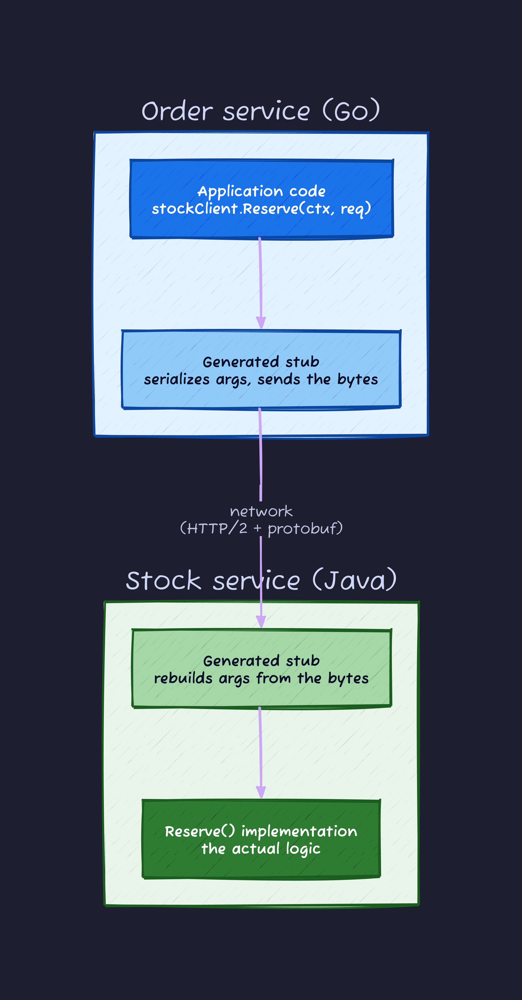
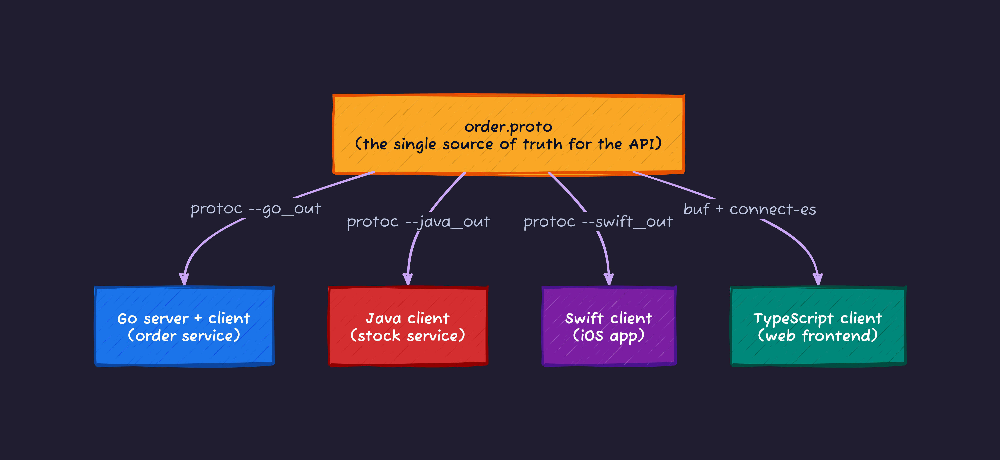
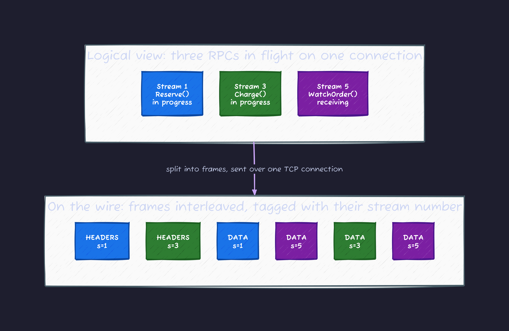
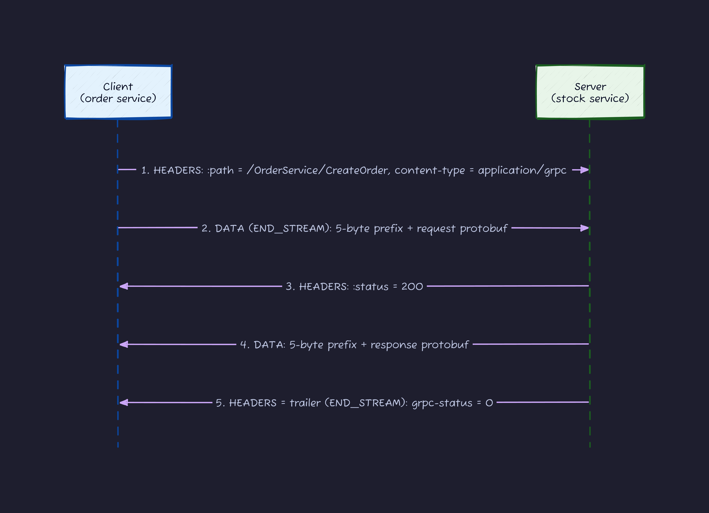
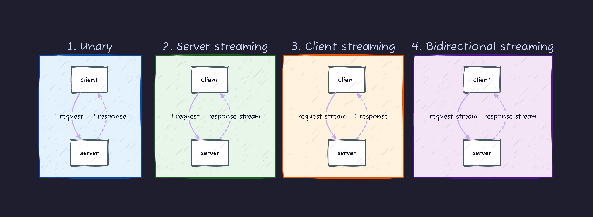
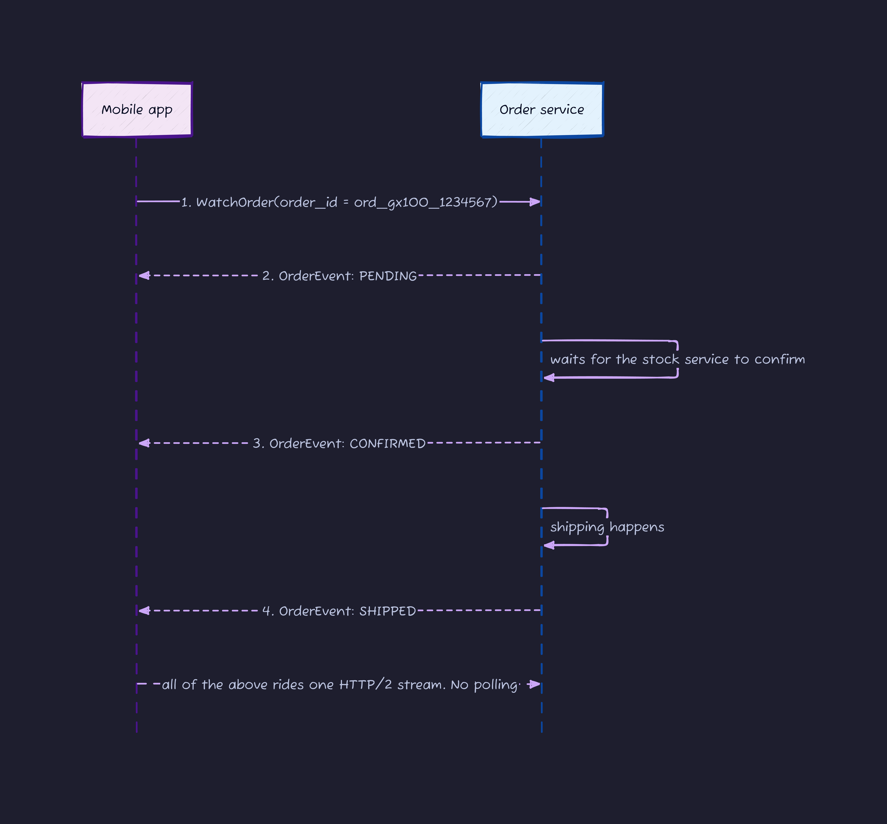
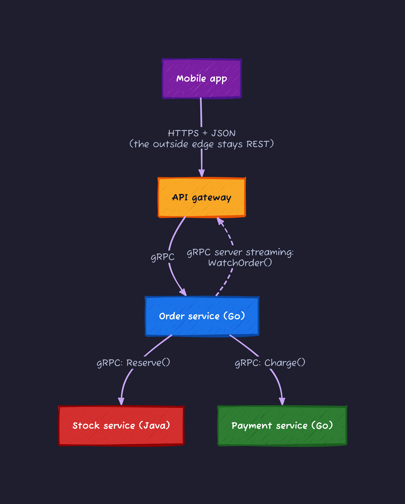
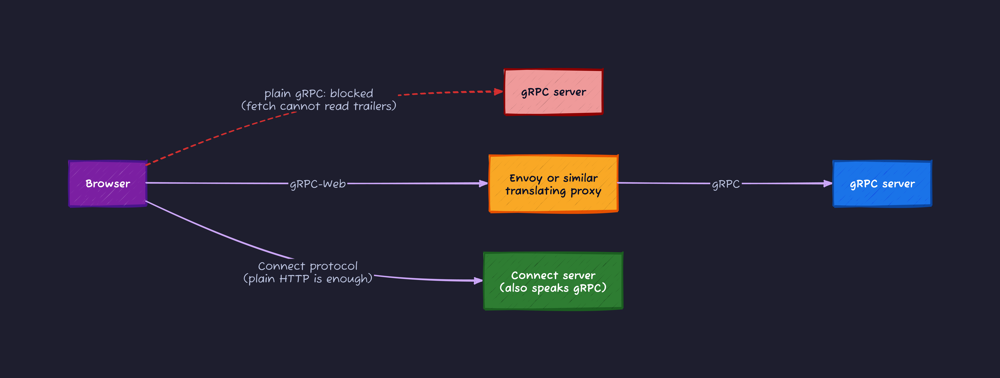
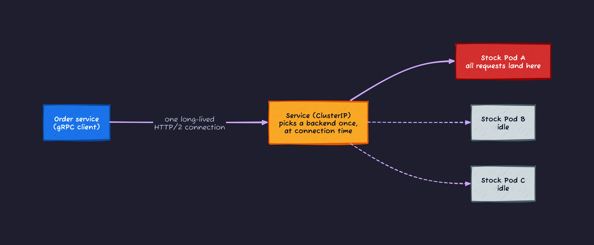

# Introduction

While writing my xDS post (the one about istiod shipping protobuf to Envoy over a gRPC stream), I noticed something uncomfortable. I use gRPC every day. And if someone had asked me "so what is gRPC, exactly", I would have said "HTTP/2" and "Protocol Buffers" and then run out of sentences.

So I stopped and rebuilt my understanding from the ground floor. This post walks through it in order, and every term gets explained at the spot where it first appears. The only assumption is that you have written an HTTP API that returns JSON at some point.

1. What RPC means (the "RPC" in gRPC)
2. The two parts that make up gRPC: Protocol Buffers and HTTP/2
3. The four communication patterns
4. Running it locally and measuring everything (Go)
5. Adoption stories: what each company was migrating away from
6. Weak points, and when to pick gRPC over REST

One running example carries the whole post: **gadgefre**, a fictional flea-market app for used gadgets. It has exactly four characters, and they show up in every diagram.

- The mobile app (what the user touches)
- The order service (accepts orders)
- The stock service (tracks inventory)
- The payment service (moves money)

## RPC: network calls dressed up as function calls

Before gRPC, RPC. Remote Procedure Call means exactly what the name says: **calling code that runs on another machine, written as if it were a local function call**.

Think about what calling a REST API looks like in code. You build a URL, pick an HTTP method, encode a JSON body, parse the JSON response, branch on the status code. The thing you wanted was "reserve 2 units of this item", and most of the code is transport logistics.

RPC hides all of that. The order service just writes this:

```go
// The stock service runs on another machine, but this reads like a local call
res, err := stockClient.Reserve(ctx, &pb.ReserveRequest{ItemId: "gx100", Quantity: 2})
```

Here is what actually happens underneath:



The interesting box is the **stub**. A stub is the code that does the transport logistics for you (serialize, send, receive, deserialize), and **nobody writes it by hand. A tool generates it.** The diagram has the order service in Go and the stock service in Java on purpose: stubs are generated per language, so the caller and callee do not need to agree on one.

RPC itself is an old idea with plenty of implementations (Java RMI, Thrift, JSON-RPC). gRPC is the modern one, open sourced by Google in 2015. Internally Google had been running an RPC system called Stubby for over a decade, handling on the order of tens of billions of calls per second across its datacenters, and gRPC is the rebuild of that system on open standards. In 2017 it moved to the CNCF (the same foundation as Kubernetes), where it lives today as an Incubating project with a release roughly every six weeks.

## Part 1: Protocol Buffers (what gets sent)

gRPC is two parts glued together. **What gets sent** is decided by Protocol Buffers (protobuf for short). **How it travels** is decided by HTTP/2. Protobuf first.

Protobuf has two jobs:

1. **An IDL (interface definition language)**: you describe the shape of your API in a plain-text `.proto` file
2. **A serialization format**: it turns data into a binary blob smaller than JSON

### Protobuf as an IDL

Here is the gadgefre order service API as a `.proto` file. This one file is the spine of the whole post; the hands-on later uses it unchanged.

```protobuf
syntax = "proto3";

package gadgefre.order.v1;

service OrderService {
  // Unary: create one order
  rpc CreateOrder(CreateOrderRequest) returns (CreateOrderResponse);
  // Server streaming: push order status changes as they happen
  rpc WatchOrder(WatchOrderRequest) returns (stream OrderEvent);
}

message CreateOrderRequest {
  string item_id  = 1;
  int32  quantity = 2;
  int64  user_id  = 3;
}

message CreateOrderResponse {
  string      order_id  = 1;
  OrderStatus status    = 2;
  int64       total_yen = 3;
}

message WatchOrderRequest {
  string order_id = 1;
}

message OrderEvent {
  string      order_id = 1;
  OrderStatus status   = 2;
}

enum OrderStatus {
  ORDER_STATUS_UNSPECIFIED = 0;
  ORDER_STATUS_PENDING     = 1;
  ORDER_STATUS_CONFIRMED   = 2;
  ORDER_STATUS_SHIPPED     = 3;
}
```

Three things to know when reading it:

- The `service` block is the list of callable functions, each in the form `rpc Name(Input) returns (Output)`
- The `message` blocks are the input/output types. The `= 1`, `= 2` are **field numbers**: on the wire, these numbers stand in for the field names (that is where the size savings come from)
- The first enum value being `_UNSPECIFIED = 0` is a protobuf convention. In proto3 there is no way to tell "field was never set" apart from "field was set to value 0", so value 0 is reserved to mean "not specified"

Feed this file to the `protoc` compiler and it generates stubs for whatever languages you need:



This diagram is the benefit that adopting companies bring up first. The API definition lives in one `.proto` file, and every language's client and server code is generated from it mechanically. Two chronic problems ("the docs drifted from the implementation" and "we hand-write a client per language") disappear structurally. Mercari, which shows up in the adoption section, keeps every service's `.proto` in a single repository and has CI regenerate the Go, Python, Java, and Node.js code on merge.

### Protobuf as a serialization format

The second job is binary serialization. I serialized the same payload as protobuf and as JSON and measured (the measurement code appears in the hands-on):

```text
protobuf: 24 bytes  0a 11 6f 72 64 5f 67 78 31 30 30 5f 31 32 33 34 35 36 37 10 01 18 e8 4d
json:     81 bytes  {"order_id":"ord_gx100_1234567","status":"ORDER_STATUS_PENDING","total_yen":9960}
```

Same content, **24 bytes of protobuf versus 81 bytes of JSON**, a 3.4x difference. The bytes are worth reading because they show how the trick works:

- `0a` says "field number 1, length-delimited type". That is `order_id`. The 8-character string `"order_id"` appears nowhere in the payload
- `11` is length 17, and the next 17 bytes are the ASCII of `ord_gx100_1234567`
- `10 01` is field 2 (status) set to 1 (PENDING). One byte, not the enum name as a string
- `18 e8 4d` is field 3 (total_yen) set to 9960, encoded as a varint (variable-length integer) in 2 bytes

The field names, quotes, and braces that JSON re-sends on every single message simply do not exist in protobuf, because the field numbers are pinned in the `.proto`. When your services exchange tens of thousands of messages per second, that difference is bandwidth and parsing CPU, paid continuously.

There is a cost: the payload is binary, so you cannot `curl` it and read it with your eyes. The weak points section deals with that, tooling included.

## Part 2: HTTP/2 (how it travels)

gRPC runs on HTTP/2 as its transport. If your mental model of HTTP/2 is "HTTP/1.1 but faster", gRPC's design decisions look arbitrary, so this section takes its time. HTTP/1.1 and HTTP/2 share the same **semantics** (methods, headers, status codes) but differ completely in **architecture**: how those semantics are laid out as bytes on a connection.

### HTTP/1.1's architecture: text letters, one at a time

An HTTP/1.1 request is plain text separated by newlines:

```text
POST /reserve HTTP/1.1
Host: stock.gadgefre.internal
Content-Type: application/json
Content-Length: 32

{"item_id":"gx100","quantity":2}
```

The smallest unit in this protocol is the whole message. Text streams in top to bottom, and the receiver has no way to tell "which request does this line belong to", so **one TCP connection can carry only one request at a time**. Want parallelism, open more connections. That is literally what browsers have done for decades: about six connections per host.

For service-to-service traffic this hurts. The order service constantly wants to ask the stock service and the payment service things at the same time, and every extra connection costs a TCP handshake plus a TLS negotiation (several round trips) to establish.

### HTTP/2's architecture: binary frames interleaved on one connection

HTTP/2 rebuilt exactly this part. Messages are chopped into **frames**, small binary boxes, and every frame is tagged with the number of the **stream** (the logical conversation) it belongs to. The receiver sorts frames by stream number and reassembles. Result: **one TCP connection carries many conversations at once**. That is multiplexing.



The colors line up between the two halves: collect only the blue frames and you have reassembled stream 1, only the purple ones and you have stream 5. That picture is most of what HTTP/2 is. Frames come in a handful of types, and these are the ones gRPC traffic actually consists of:

| Frame | Role | How gRPC uses it |
| --- | --- | --- |
| HEADERS | Carries a block of headers | Opens an RPC (method name etc.) and closes it (the trailer, see below) |
| DATA | Carries body bytes | The protobuf messages |
| SETTINGS | Connection parameter exchange | Both sides send it right after connecting |
| WINDOW_UPDATE | Flow control (receive buffer space) | Backpressure for streaming |
| PING | Liveness check | Keepalive |
| RST_STREAM | Kill one stream only | RPC cancellation, deadline exceeded |
| GOAWAY | Announce connection shutdown | Graceful shutdown |

Look at RST_STREAM and WINDOW_UPDATE for a moment. "Cancel one RPC out of the hundred in flight" and "slow down only the stream whose receiver is falling behind" are operations **built into the protocol layer**. On HTTP/1.1 your only lever is killing the whole connection. The reason cancellation and flow control behave consistently across every gRPC language is not heroic framework code. It is that HTTP/2 is shaped like this.

Headers got an upgrade too: they travel compressed with HPACK. A header sent once gets an entry in a per-connection dictionary, and from then on it is a one-or-two-byte index. Nobody re-sends the string `content-type: application/grpc` ten thousand times.

One more mechanism matters later: the **trailer**. HTTP/2 lets a peer send **one more HEADERS frame after the body**, closing the message with headers at the end. That tail block is the trailer, and it exists to carry "here is how things turned out" information that is only known after the body finished. For a stream that pushed gigabytes before failing, a status in the leading headers is physically impossible; the end of the message is the only honest place. gRPC puts the RPC's outcome there. And this trailer is the entire reason for the "browser wall" coming up in the weak points section.

### How gRPC maps onto HTTP/2

Here is the full assignment of gRPC concepts to HTTP/2 machinery:

| gRPC concept | What it is on HTTP/2 |
| --- | --- |
| One RPC | One stream |
| Method selection | The `:path` header (e.g. `/gadgefre.order.v1.OrderService/CreateOrder`) |
| A request/response message | "5-byte prefix + protobuf" inside DATA frames |
| RPC outcome | `grpc-status` in the trailer (0 means OK) |
| Deadline | The `grpc-timeout` header |
| The four patterns (next section) | Just how many DATA frames flow in each direction |
| A channel (the client-side connection object) | One or more TCP connections plus SETTINGS/PING bookkeeping |

And the frame-by-frame shape of a single unary RPC:



That is the theory. Whether it is true gets checked at the end of the hands-on, where I capture the actual frames off a live connection.

In case you are wondering about HTTP/3: as of June 2026, ecosystem-wide HTTP/3 support is still at the [official proposal stage (G2)](https://github.com/grpc/proposal/blob/master/G2-http3-protocol.md), with grpc-dotnet running a trial implementation. Production gRPC traffic today is overwhelmingly HTTP/2.

## The four communication patterns

A REST API has essentially one shape: one request, one response. gRPC gives you four. As the mapping table said, they are not four mechanisms; they differ only in how many DATA frames each side sends on the one stream.



Mapped onto gadgefre:

| Pattern | In the proto | gadgefre use case |
| --- | --- | --- |
| Unary | `rpc CreateOrder(Req) returns (Res)` | Creating an order. Every ordinary API call |
| Server streaming | `rpc WatchOrder(Req) returns (stream Event)` | Live order status. Push the moment it ships |
| Client streaming | `rpc UploadPhotos(stream Chunk) returns (Res)` | Photo upload in chunks, one result at the end |
| Bidirectional | `rpc Chat(stream Msg) returns (stream Msg)` | Buyer-seller chat |

The only syntax involved is where you put the `stream` keyword. Here is `WatchOrder` (server streaming) over time:



Doing this with REST means the client polls with GET every few seconds, or you bolt on a separate WebSocket layer. In gRPC you write the word `stream` in the proto and the generated stubs, flow control, and all four languages' implementations come with it. This is one of the reasons ABEMA (more on them later) picked gRPC for a latency-sensitive video service.

## The big picture so far

All the parts are on the table, so here is gadgefre in one diagram:



There is a design decision buried in this diagram, and nearly every adopter made the same one: **the outside edge (phones, browsers) speaks REST/JSON, and only the service-to-service interior speaks gRPC**. Mercari, ABEMA, and Netflix all look like this. The reasons are the browser problem explained in the weak points section, plus the fact that external developers expect REST. Lining up the case studies makes the pattern obvious: gRPC spread as **the tool for service-to-service traffic**, not as a REST replacement.

## Hands-on: run it and measure it

Time to touch it. Environment: Apple Silicon Mac, Go 1.26.4, libprotoc 35.0, grpc-go v1.81.1, grpcurl 1.9.3. The proto is the `order.proto` from earlier, unchanged.

### 1. Generate the code

```bash
brew install protobuf protoc-gen-go protoc-gen-go-grpc grpcurl

mkdir grpc-demo && cd grpc-demo
go mod init example.com/gadgefre
# save the proto from above as proto/order.proto, then:
protoc --go_out=. --go_opt=module=example.com/gadgefre \
       --go-grpc_out=. --go-grpc_opt=module=example.com/gadgefre \
       proto/order.proto
```

Two files appear under `gen/orderpb/`: `order.pb.go` holds the message types (structs plus serialization), `order_grpc.pb.go` holds the service stubs (client and server interfaces). Open them and you can see that the "stub" from the first diagram is just ordinary Go code.

### 2. The server

```go
package main

import (
    "context"
    "fmt"
    "log"
    "net"
    "time"

    "google.golang.org/grpc"
    "google.golang.org/grpc/reflection"

    pb "example.com/gadgefre/gen/orderpb"
)

type orderServer struct {
    pb.UnimplementedOrderServiceServer
}

func (s *orderServer) CreateOrder(ctx context.Context, req *pb.CreateOrderRequest) (*pb.CreateOrderResponse, error) {
    return &pb.CreateOrderResponse{
        OrderId:  fmt.Sprintf("ord_%s_%d", req.ItemId, req.UserId),
        Status:   pb.OrderStatus_ORDER_STATUS_PENDING,
        TotalYen: 4980 * int64(req.Quantity),
    }, nil
}

func (s *orderServer) WatchOrder(req *pb.WatchOrderRequest, stream grpc.ServerStreamingServer[pb.OrderEvent]) error {
    statuses := []pb.OrderStatus{
        pb.OrderStatus_ORDER_STATUS_PENDING,
        pb.OrderStatus_ORDER_STATUS_CONFIRMED,
        pb.OrderStatus_ORDER_STATUS_SHIPPED,
    }
    for _, st := range statuses {
        if err := stream.Send(&pb.OrderEvent{OrderId: req.OrderId, Status: st}); err != nil {
            return err
        }
        time.Sleep(300 * time.Millisecond)
    }
    return nil
}

func main() {
    lis, err := net.Listen("tcp", ":50061")
    if err != nil {
        log.Fatal(err)
    }
    s := grpc.NewServer()
    pb.RegisterOrderServiceServer(s, &orderServer{})
    reflection.Register(s)
    log.Println("listening on :50061")
    log.Fatal(s.Serve(lis))
}
```

Notice what is missing: not one line of HTTP/2 handling or serialization. Only logic. `reflection.Register(s)` is for grpcurl later; it lets the server tell clients "here is the proto I implement". (The port is 50061 because something on my machine was already squatting on 50051, which is the conventional one.)

### 3. The client, and real numbers

The client side is just calls on the generated stub. The relevant excerpt:

```go
conn, _ := grpc.NewClient("localhost:50061", grpc.WithTransportCredentials(insecure.NewCredentials()))
c := pb.NewOrderServiceClient(conn)

res, _ := c.CreateOrder(ctx, &pb.CreateOrderRequest{ItemId: "gx100", Quantity: 2, UserId: 1234567})

stream, _ := c.WatchOrder(ctx, &pb.WatchOrderRequest{OrderId: res.OrderId})
for {
    ev, err := stream.Recv()
    if err == io.EOF {
        break
    }
    fmt.Printf("WatchOrder  -> %s is now %s\n", ev.OrderId, ev.Status)
}
```

Output, including a latency loop I added at the end (10000 unary calls on a warmed-up connection, sorted, percentiles taken):

```text
CreateOrder -> order_id=ord_gx100_1234567 status=ORDER_STATUS_PENDING total_yen=9960
WatchOrder  -> ord_gx100_1234567 is now ORDER_STATUS_PENDING
WatchOrder  -> ord_gx100_1234567 is now ORDER_STATUS_CONFIRMED
WatchOrder  -> ord_gx100_1234567 is now ORDER_STATUS_SHIPPED
unary x10000: p50=50.334µs p99=165.667µs
```

Localhost, sure, but that includes serialization and HTTP/2 framing both ways: **p50 of 50 microseconds per call**. Worth keeping as a gut number for how light the RPC machinery itself is.

### 4. Debugging with grpcurl

This is the answer to "binary means no curl". With reflection enabled on the server, grpcurl fetches the proto and does the JSON conversion for you:

```bash
$ grpcurl -plaintext localhost:50061 list
gadgefre.order.v1.OrderService
grpc.reflection.v1.ServerReflection

$ grpcurl -plaintext -d '{"item_id":"gx100","quantity":2,"user_id":1234567}' \
    localhost:50061 gadgefre.order.v1.OrderService/CreateOrder
{
  "orderId": "ord_gx100_1234567",
  "status": "ORDER_STATUS_PENDING",
  "totalYen": "9960"
}
```

Small thing that trips everyone up once: `"totalYen": "9960"` is a string, and that is by spec. Protobuf's JSON mapping always renders int64 as a JSON string, because JavaScript's Number cannot represent 64-bit integers exactly.

### 5. Looking at the actual HTTP/2 frames

Time to check Part 2's diagrams against reality. I wrote an 80-line proxy that sits between client and server, passes every byte through untouched, and feeds a copy into `golang.org/x/net/http2`'s Framer to log what it sees (listens on 50071, forwards to 50061). The whole trick is this:

```go
framer := http2.NewFramer(io.Discard, r) // r carries the raw connection bytes
framer.ReadMetaHeaders = hpack.NewDecoder(4096, nil)
for {
    f, err := framer.ReadFrame()
    if err != nil {
        return
    }
    // f is a *http2.MetaHeadersFrame, *http2.DataFrame, etc. Log by type
}
```

Every frame from one `CreateOrder` call through that proxy (connection setup SETTINGS, keepalive PING, and flow-control WINDOW_UPDATE omitted):

```text
[client→server] HEADERS stream=1 END_STREAM=false
         :method=POST
         :scheme=http
         :path=/gadgefre.order.v1.OrderService/CreateOrder
         :authority=localhost:50071
         content-type=application/grpc
         user-agent=grpc-go/1.81.1
         te=trailers
[client→server] DATA stream=1 len=18 END_STREAM=true
         00 00 00 00 0d 0a 05 67 78 31 30 30 10 02 18 87 ad 4b
[server→client] HEADERS stream=1 END_STREAM=false
         :status=200
         content-type=application/grpc
[server→client] DATA stream=1 len=29 END_STREAM=false
         00 00 00 00 18 0a 11 6f 72 64 5f 67 78 31 30 30 5f 31 32 33 34 35 36 37 10 01 18 e8 4d
[server→client] HEADERS (trailer) stream=1 END_STREAM=true
         grpc-status=0
         grpc-message=
```

What to look at:

- The order matches Part 2's sequence diagram exactly: HEADERS, DATA, then HEADERS, DATA, trailer coming back
- The first 5 bytes of the request DATA, `00 00 00 00 0d`, are the "5-byte prefix" in the flesh. Byte one is the compression flag (0 = uncompressed), the next four are the message length (0x0d = 13). The remaining 13 bytes are the `CreateOrderRequest` protobuf: `0a 05 67 78 31 30 30` reads "field 1, length 5, gx100"
- The 24 protobuf bytes inside the response DATA are byte-for-byte identical to the hex dump from the size measurement section
- `te=trailers` in the request headers is the client declaring "I can receive trailers". A browser's fetch API cannot make that declaration (this becomes the next section)
- `grpc-status=0` in the final trailer means the RPC succeeded. Note that it is a different thing from `:status=200`

That last point has operational teeth. A failing gRPC call still carries HTTP `:status=200`; only `grpc-status` in the trailer changes. If your L7 access logs equate 200 with healthy, you are blind to every gRPC error. Monitor on `grpc-status`.

## Adoption: what was each company escaping from?

Now that the machine is understood, the users. A bare list of logos teaches nothing, so the axis here is **what they ran before, and what hurt**.

| Company | Before | What decided it |
| --- | --- | --- |
| Google | In-house Stubby | gRPC is Stubby's open rebuild; everything internal is RPC |
| Netflix | In-house HTTP/1.1 stack (Ribbon) | Cost of maintaining their own; new Java services start on gRPC |
| Spotify | In-house RPC (Hermes) | "The community caught up and surpassed us" |
| Dropbox | In-house RPC frameworks | Could keep existing protobufs; HTTP/2 multiplexing and streaming |
| Uber | Server-Sent Events over HTTP/1.1 (push) | Bidirectional streaming, cross-language stubs, QUIC interop |
| Salesforce | JSON/REST | `.proto` as a fixed contract between teams |
| Mercari / Merpay | (greenfield) | Standardized on gRPC while splitting into microservices |
| ABEMA | (greenfield) | Low latency, fit with GCP + Kubernetes + Go |
| Ikyu | REST | Speed; built a parallel REST fallback and never needed it |

A few worth unpacking.

**Netflix** ran service-to-service traffic on its own HTTP/1.1-based stack (Ribbon and friends, parts of it open sourced) until around 2015, then moved to gRPC when the maintenance bill came due. Today a large share of their internal traffic is gRPC, and new Java development starts gRPC-first. The interesting bit: the driver was not speed. It was **wanting to stop maintaining a bespoke RPC framework**.

**Spotify** is the same story with different names: their in-house Hermes got replaced by gRPC plus Envoy. Their engineer Dave Zolotusky summarized the whole industry arc in one line: they had built their own tools because nothing handled their scale, "but then the community kind of caught up and surpassed us." Every company that went microservices early, around 2015, eventually faced that decision, and nearly all of them landed on gRPC.

**Dropbox** documented its migration in detail as [Courier](https://dropbox.tech/infrastructure/courier-dropbox-migration-to-grpc): hundreds of services in multiple languages exchanging millions of requests per second. Two details stand out. They picked gRPC partly because **they could carry their existing protobuf definitions over unchanged**, and Courier itself is not a new protocol; it is gRPC wired into their existing auth, service discovery, and tracing. Their closing lesson applies to any migration: it takes longer than the development itself, and it is only finished after the cleanup.

**Uber** is the streaming showcase. Their mobile push platform (internally called RAMEN) originally delivered updates over Server-Sent Events on HTTP/1.1; [they rebuilt it on gRPC bidirectional streaming](https://www.uber.com/blog/ubers-next-gen-push-platform-on-grpc/), citing the standardized cross-language implementations and the ability to ride Cronet's QUIC sessions on mobile. If your mental image of gRPC is "internal microservice plumbing", Uber pushing to phones over it is the counterexample.

**Mercari / Merpay** (Japan's largest C2C marketplace and its payments arm) is the best-documented case in the Japanese-language sphere, and the operational details translate well. When they split the monolith to scale the org toward 1000 engineers, they standardized inter-service traffic on gRPC:

- Every microservice's `.proto` lives in one repository; CI generates the Go, Python, Java, and Node.js code on merge
- API design debates happen on `.proto` pull requests, so interfaces get reviewed before implementation starts
- They went further and built [gRPC Federation](https://engineering.mercari.com/blog/entry/20241204-developing-bff-using-grpc-federation/), an OSS tool that generates an entire BFF (the aggregation layer in front of mobile clients) from options written in the proto

**ABEMA** (a Japanese streaming TV service) launched in 2016 on GCP + Kubernetes + Go + gRPC, with roughly 40 microservices talking gRPC to each other. Video is latency-sensitive, and protobuf's encode/decode speed and density were the deciding factors. For external APIs they use grpc-gateway (a tool that generates a REST proxy from the proto), making them a clean example of "gRPC inside, REST outside" done by code generation.

Squeeze the cases and four patterns fall out. If you are deciding whether gRPC belongs in your stack, it comes down to whether these apply:

1. **Too many teams to keep inter-service contracts as verbal agreements** (Salesforce, Mercari)
2. **An in-house RPC layer you are tired of maintaining** (Netflix, Spotify, Dropbox)
3. **Clients needed in several languages, none hand-written** (everyone)
4. **Real-time or latency requirements that polling cannot meet** (Uber's push platform, ABEMA)

## Weak points, with fixes

It has been a friendly story so far, so here are the traps, honestly. Each comes with a workaround.

### Weak point 1: browsers cannot speak it

Remember the trailer, explained in Part 2 and caught on the wire in the hands-on (the final HEADERS frame carrying `grpc-status`). gRPC reports the outcome of every RPC there, and **the browser fetch API cannot read trailers**. The `te=trailers` declaration visible in the frame capture is one a browser will never send. So plain gRPC from browser JavaScript is off the table.



Three families of workarounds:

- **gRPC-Web**: a browser-safe variant of the protocol; a proxy (typically Envoy) translates to real gRPC. Longest track record
- **grpc-gateway**: generates a REST/JSON API from the proto and runs it as a proxy (the ABEMA approach)
- **Connect RPC**: the newer option, from Buf, accepted into the CNCF in 2024. One server speaks gRPC, gRPC-Web, and plain HTTP+JSON on the same port, so the translating proxy disappears entirely. Browsers call it with ordinary fetch

Starting fresh today and wanting protobuf types in the browser, I would look at Connect first. Deleting a proxy tier from your architecture is a big operational win.

Trailers are awkward even outside browsers, by the way. When Cloudflare added gRPC support to their edge in 2020, a large chunk of [the work](https://blog.cloudflare.com/road-to-grpc/) was that their NGINX-based proxies barely supported HTTP trailers and their origin-facing connections were HTTP/1.1. If a CDN had to build a new proxy platform for this, your middleboxes deserve a look too: every hop between client and server must speak HTTP/2 and pass trailers through.

### Weak point 2: load balancing skews on Kubernetes

This is the trap people hit in production. HTTP/2's greatest strength, one long-lived connection reused for everything, collides head-on with how Kubernetes load balances by default. A Service (ClusterIP) picks a backend **once, at connection time**. A long-lived gRPC connection therefore glues itself to whichever Pod it first landed on, and every subsequent request rides that connection to the same Pod.



The symptom: you scale the stock service to 3 Pods and one Pod melts while two idle. The fix is always some layer that picks a backend **per request instead of per connection**, and there are three:

- **A service mesh / L7 proxy**: Istio or Linkerd sidecars (Envoy) balance per request. If you already run a mesh, you get this for free
- **Client-side load balancing**: built into grpc-go and friends; point it at a headless Service (`clusterIP: None`) so the client sees every Pod IP, connects to all, and round-robins
- **xDS**: the client gets routing info straight from a control plane, speaking the same protocol Envoy does (proxyless gRPC). Datadog runs this setup

### Weak point 3: humans cannot read it without tools

It is binary; tcpdump and curl show you noise. The baseline fix is what the hands-on did: **reflection on the server, grpcurl in your hand**. Postman supports gRPC if you want a GUI, and there is also [Evans](https://engineering.mercari.com/blog/entry/grpc_and_evans/), a REPL-style client that came out of Mercari. If you are rolling gRPC out to a team, make "reflection enabled on every server, at least outside production" a written rule early. It pays off weekly.

### Weak point 4: schema evolution needs discipline

Field numbers are the binary compatibility contract, so **a number, once used, can never change meaning or be recycled**. Deleting a field means writing `reserved 4;` to leave a tombstone. Discipline like this should be enforced by a linter, not by memory: `buf breaking` checks "does this change break wire compatibility" in CI. Starting with buf instead of raw protoc saves you the incident later.

## The decision table

To wrap up the design guidance. "Everything becomes gRPC" is not the lesson; the adopters' own architecture (gRPC inside, REST outside) says so.

| Situation | Pick | Why |
| --- | --- | --- |
| Internal service-to-service | gRPC | Typed contracts, performance, stubs in every language |
| Public API for arbitrary consumers | REST + OpenAPI | curl-ability, ecosystem reach |
| Typed contracts in browser/mobile | Connect or gRPC-Web | Plain gRPC dies on the trailer problem |
| Real-time server-to-client push | gRPC server streaming | No polling; one `stream` keyword in the proto |
| Internal, but consumers only speak curl | gRPC + grpc-gateway | Generate the REST facade from the proto |

And the tools that appeared along the way:

| Tool | Job |
| --- | --- |
| `protoc` + `protoc-gen-go` etc. | Generate per-language stubs from `.proto` |
| `buf` | Modern protoc frontend; linting and breaking-change checks |
| `grpcurl` | curl for gRPC, pairs with server reflection |
| `Evans` | Interactive REPL gRPC client |
| `grpc-gateway` | Generate a REST proxy from the proto |
| Connect RPC | gRPC-compatible framework family with native browser support |

## Conclusion

The question that started this post ("so what is gRPC, exactly") now has a one-sentence answer I can stand behind: **a framework that generates every language's communication code from a contract written in a `.proto` file, and carries the messages as protobuf over HTTP/2 streams**.

Two things stuck with me from running it. First, how short the distance is from writing a proto to a working client. Second, the weight of the machinery: p50 of 50µs per call, and a wire format where I could account for every single byte. On the flip side, the browser wall and the Kubernetes balancing skew are both "trivial if you know, an outage if you don't" traps, so if you take one section into a migration meeting, take the weak points.

If you want the next layer up, my xDS deep dive is the same story from the service mesh side: istiod pushing protobuf to Envoy over one long-lived gRPC stream.
