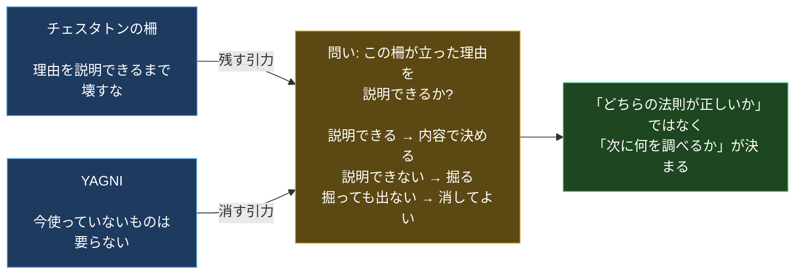
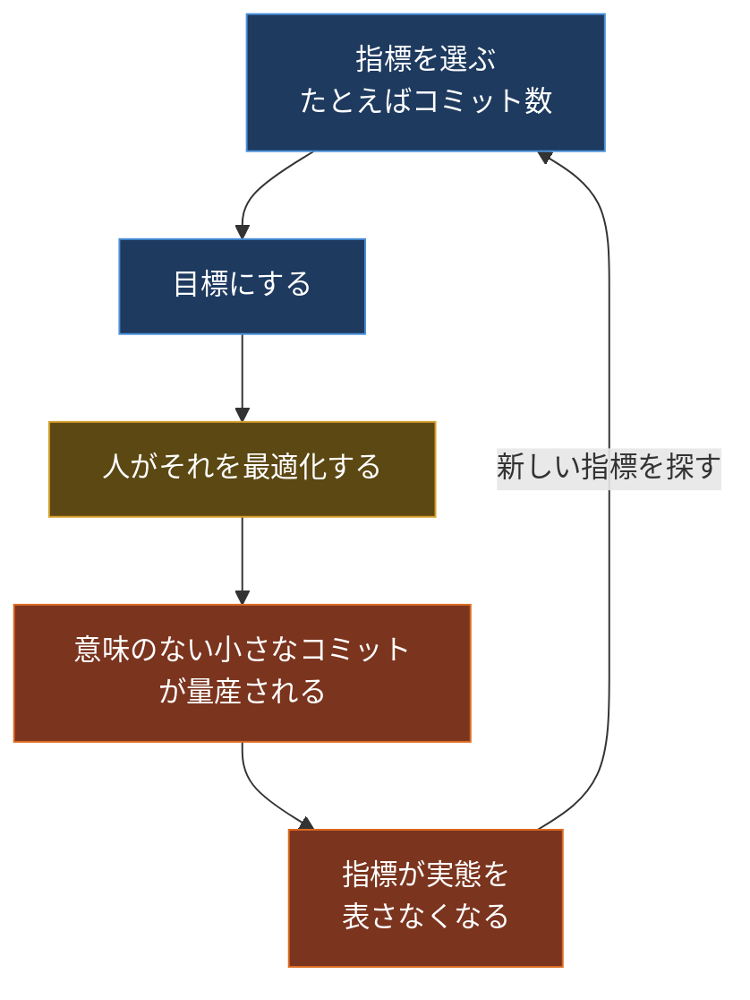
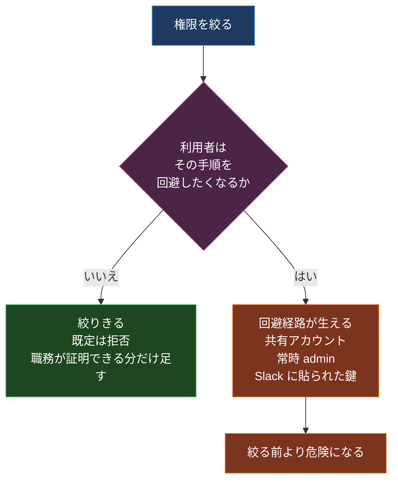

設計レビューで、誰も使っていなさそうな分岐を消す PR を出したことがある。

レビュアーの 1 人が「YAGNI、使ってないなら消していい」と書いた。別の 1 人が「チェスタトンの柵。なぜそこに立ったか説明できるまで壊すな」と書いた。

どちらも正しい。実在する原則で、本にも載っていて、状況によってはどちらも正解になる。にもかかわらず、この議論はそこから進まなかった。進むはずがない。片方は「消す側の引力」の名前で、もう片方は「残す側の引力」の名前だからだ。名前を言い合っても、どちらの引力が今この状況で強いのかは決まらない。

エンジニアリング法則のまとめは山ほどある。自分も何度も読んだ。読むと賢くなった気がして、実際の判断は楽にならなかった。理由が上の光景だと気づいたので [Hammurabi](https://kanywst.github.io/hammurabi/) を作った。法則を 1 つ載せるたびに、その法則を引き倒す側の原則を必ず横に置く。この編集ルールだけで構成した法典サイトで、今 56 条入っている。

この記事は、なぜそのルールにしたのか、そのルールで書くと何が変わるのかを上から順に説明する。「エンジニアリング法則って何?」から始めるので、この手のリストを読んだことがなくても大丈夫。

- サイト: <https://kanywst.github.io/hammurabi/>
- リポジトリ: <https://github.com/kanywst/hammurabi>

## 前提: ここで言う「法則」とは何か

先に言葉を揃える。ここを曖昧にしたまま進むと以降が全部滑る。

物理の法則と、ここで言う法則は別物だ。

| | 物理法則 | エンジニアリング法則 |
| --- | --- | --- |
| 何を主張するか | 例外なくこうなる | だいたいこうなりがち |
| 反証のしかた | 1 つの反例で崩れる | 反例があっても崩れない |
| 使い方 | 計算に代入する | 状況の見取り図として使う |
| 間違った使い方 | ほぼ起きない | 規則として振りかざす |

コンウェイの法則は「ソフトウェアの構造は組織図の写し鏡になる」と言うが、鏡になっていない組織はいくらでもある。それでも法則は死なない。傾向を言っているからだ。つまりこれらは法則というより経験則で、正しいかどうかではなく「いつ効いて、いつ効かないか」で扱うべきものになる。

ここから扱い方が 1 つ決まる。傾向には必ず逆側の傾向がある。片側だけ知っているのは、地図の左半分だけ持って歩いているのと同じだ。

## 法則リストが壊れる 3 つの壊れ方

自分が読んできたまとめ記事は、だいたい次のどれかで壊れていた。

**教条化。** 冒頭の YAGNI とチェスタトンの柵がこれ。法則を規則として使うと、反対向きの規則を持ってきた人と衝突して、そこから先に進めなくなる。

**事後正当化。** これがたちが悪い。マイクロサービスに割りたい人が「コンウェイの法則があるから」と言い、モノリスに戻したい人が「ガルの法則があるから」と言う。どちらも結論が先にあって、法則は後から貼った装飾になっている。しかも装飾には権威があるので、反論するには法則そのものを否定しないといけなくなる。

**出典ロンダリング。** 「コンウェイの法則」で検索して出てくる記事の大半は、別のまとめ記事を引いている。原典は 1968 年 4 月号の *Datamation* に載った Melvin E. Conway の "How Do Committees Invent?" で、そこを読むと元の主張は「組織構造を写す」という一般論ではなく、システムを設計する組織は自分たちのコミュニケーション構造の複製を作らざるを得ない、というもう少し限定された話だと分かる。原典が消えると、法則は「みんなが言っているから正しい」だけの何かに劣化する。

## 解: 5 つのフィールドを全条に強制する

3 つに個別に対処するのではなく、書式で潰した。1 条につき必ず 5 つのフィールドを埋める。埋まらないものは条文にしない。

| フィールド | 中身 | 潰している壊れ方 |
| --- | --- | --- |
| 概念 | 一言で言うと何の話か | 「なんとなく良さそう」で終わるのを防ぐ |
| メカニズム | なぜそうなるのか。人間の脳の話か、系の構造の話か | 事後正当化。機構が説明できないなら、その場面では効いていない |
| 対立概念 | この法則を引き倒す側の原則 | 教条化 |
| 判断の指針 | 明日そのまま使える行動 | 「読んで終わり」 |
| 出典 | 原典の著者・書名・年。まとめ記事は不可 | 出典ロンダリング |

このうち対立概念が主役で、残り 4 つはそれを支えている。理由はさっき書いたとおりで、経験則は観測された傾向であって守るべき規則ではないから。傾向を規則として使うと、逆向きの傾向を持ってきた人との間で決着がつかなくなる。

対立概念を横に置くと、議論の形が変わる。



冒頭のレビューは、この形にすると争点が移る。「YAGNI かチェスタトンか」ではなく「この分岐がなぜ書かれたか、誰か説明できるか」になる。説明できる人がいれば残すか消すかはその内容で決まるし、git blame とコミットメッセージと Slack を掘って出てこないなら、それはもう柵の理由が失われているので消していい。答えが出るのではなく、次にやる調査が決まる。これが対立概念を置く実利。

ここから実例を 4 つ見ていく。

## 実例 1: テスラーの複雑性保存則 ↔ 誠実なレイヤリング

対立概念の効き方が一番わかりやすいのがこれ。

法則のほうは、あらゆるシステムには取り除けない本質的複雑性があり、それは消えるのではなく移動するだけ、と言う。


対立概念は、誠実なレイヤリングと明示的なトレードオフ。

判断の指針はこう。「シンプルな API」が綺麗すぎると感じたら、いま自分が消した複雑性を誰が吸収したのかを問う。答えられないなら、簡素化したのではなく転嫁しただけだ。

この形にしておくと、法則が批判の道具ではなくレビューの質問に化ける。「抽象化しすぎでは」という感想は反論しにくいが、「この抽象化が隠した複雑性は、障害時に誰が見るんですか」は答えるか答えられないかのどちらかになる。

出典は Larry Tesler。Xerox PARC を経て Apple にいた頃に Law of Conservation of Complexity として提示したもので、1984 年前後とされる。

## 実例 2: グッドハートの法則 ↔ バランスト・スコアカード

法則のほうは、ある指標が目標になるとそれは良い指標ではなくなる、と言う。



ここで多くの人が止まる。「指標はダメ」という虚無に着地して、じゃあ何を見るのかが残らない。対立概念があると、そこで止まらない。

対立概念はバランスト・スコアカード。単一指標ではなく、互いに引っ張り合う複数の指標を同時に見る。デプロイ頻度だけを見れば品質が落ちるし、変更失敗率だけを見ればデプロイが止まる。両方置くと、片方だけの最適化が成立しなくなる。

出典で 1 つ面白いことが起きる。Charles Goodhart が *Problems of Monetary Management* を書いたのは 1975 年。ただし現代でよく引かれる「指標が目標になると良い指標でなくなる」という定式化は Goodhart 本人の原文ではなく、Marilyn Strathern が 1997 年に書いた形のほうだ。有名な言い回しが本人の言葉ではない、というのは法則界隈ではかなり起きる。

## 実例 3: 最小権限の原則 ↔ 心理的受容性

セキュリティの原則は特に教条化しやすいので、対立概念の価値が高い。

法則のほうは、厳密に必要な以上の権限を与えられた要素は、あらゆるバグ・侵害・事故の被害範囲を広げる、と言う。対立概念は心理的受容性で、利用者が回避してしまうほどの過剰な制限は自らを敗北させる、と言う。



この 2 つは同じ 1 本の論文から来ている。Saltzer と Schroeder の *The Protection of Information in Computer Systems* は 8 つの設計原則を並べていて、least privilege も psychological acceptability もその中にある。原典は最初から対で書いていた。後世のまとめが片方だけを持ち出して、もう片方を落としてきただけだった。

出典まで戻ると、対立概念は自分で考えた反論ではなく、元からそこにあったものだったりする。出典フィールドを必須にしている理由の半分はこれ。

## 実例 4: 通常事故理論 ↔ 高信頼性組織

対立概念が反対意見ではなく、態度の解毒剤になっている例。

法則のほうは、相互作用的に複雑で密結合な系では、独立した小さな故障が設計者の予見しない形で相互作用し、運用者が介入するより速く伝播する、と言う。だから事故は不運ではなく構造の性質になる。

これを単体で受け取ると「どうせ事故は起きる」という宿命論になる。それは間違った受け取り方で、対立概念がそこを止める。高信頼性組織の研究が示しているのは、文化と余裕と疎結合が宿命論に測定可能な形で勝つ、ということだ。

判断の指針はこう。バッファ、タイムアウト、隔壁、サーキットブレーカで結合を緩めて、複雑さを削る。安全連動装置を足すのはその後。連動装置自体もまた相互作用を増やすので。

出典は Charles Perrow の *Normal Accidents: Living with High-Risk Technologies*、1984 年。

## 対立ペアの一覧

56 条ぶん全部は載らないので、実務で出番が多いものを抜き出す。

| 法則 | 対立概念 |
| --- | --- |
| チェスタトンの柵 | YAGNI |
| ガルの法則。複雑な系は単純な系から進化する | MVP |
| コンウェイの法則 | 逆コンウェイ戦略 |
| ハイラムの法則。十分な利用者がいれば全挙動が誰かの依存対象になる | カオスエンジニアリング |
| ポステルの法則。寛容に受け取り厳格に送る | 内部エラーに限ってフェイルファスト |
| グッドハートの法則 | バランスト・スコアカード |
| リンディ効果 | ハイプサイクル分析 |
| サンクコストの誤謬 | ゼロベース予算 |
| カーゴ・カルト・エンジニアリング | 第一原理思考 |
| リーキー・アブストラクション | T 型スキル |
| 生存者バイアス | 失敗学とポストモーテム文化 |
| 劣っている方が勝つ | The Right Thing |
| 早すぎる最適化 | プロファイル優先。Make It Work → Right → Fast の順 |
| CAP 定理 | PACELC と調整可能な一貫性 |
| 二人の将軍問題 | べき等性、結果整合性、確認付き再送 |
| スケールの裾野 | 冗長化には代償がある。中央値が体感を決める場面で裾野を追わない |
| ケルクホフスの原理 | 多層防御。秘匿は薄い一層としてなら許される |
| デメテルの法則 | 教条より実用。厳格な適用は転送メソッドの肥大を招く |
| ジェヴォンズのパラドックス | 反動に上限を設ける。割当、上限、価格シグナル |
| 通常事故理論 | 高信頼性組織 |

眺めていると、右の列が単なる反対語ではないことが分かると思う。左が「何が起きがちか」で、右が「それを承知のうえで何をするか」になっている。2 つ並べて初めて 1 つの判断材料になる。

## 56 条の内訳

法則は 12 のカテゴリに分かれている。

| カテゴリ | 条数 |
| --- | --- |
| 組織 | 9 |
| システム | 8 |
| 認知 | 7 |
| 安全工学 | 5 |
| 性能 | 5 |
| 保守性 | 5 |
| 分散システム | 5 |
| インセンティブ | 3 |
| 意思決定 | 3 |
| セキュリティ | 2 |
| ヒューマンインタフェース | 2 |
| 見積り | 2 |

組織と認知で 16 条、全体の 3 割近くになる。集めてみるまで気づかなかったが、エンジニアリングの失敗として記録されてきたものの多くは、技術ではなく人間と組織の話だった。分散システムとセキュリティを足しても 7 条しかない。

## 現場での使い方

読んで終わりにしないための手順は 3 つ。

1. 誰かが法則を出したら、その場で対立概念も出す。「YAGNI ですね。反対側はチェスタトンの柵です」で足りる。
2. メカニズムが今の状況に当てはまるか確認する。人間の脳の話なのか、系の構造の話なのか。今それが起きているのか。
3. 判断の指針を次のアクションに変える。結論ではなく、次にやる調査を決める。

飛ばしがちなのは 2 番目。メカニズムが説明できないなら、その法則は今この場面では効いていない。たとえばブルックスの法則、遅れているプロジェクトに人を足すとさらに遅れるというやつのメカニズムは「新規メンバーのオンボーディングと、増えたコミュニケーションパスのコスト」なので、完全に独立した別モジュールに人を足す場合には効かない。名前だけで却下すると、この区別が消える。

## 出典のルール

コントリビュートを受けるときの唯一の厳しい条件がここ。出典は原典を引く。要約したブログを引かない。

| 法則 | 原典 |
| --- | --- |
| 逸脱の常態化 | Diane Vaughan, *The Challenger Launch Decision*, 1996 |
| チェスタトンの柵 | G. K. Chesterton, *The Thing*, 1929 |
| コンウェイの法則 | Melvin E. Conway, *How Do Committees Invent?*, Datamation 1968 年 4 月号 |
| ガルの法則 | John Gall, *Systemantics*, 1975 |
| ダニング・クルーガー効果 | Justin Kruger & David Dunning, *Unskilled and Unaware of It*, JPSP 1999 |
| 知識の呪い | Camerer, Loewenstein & Weber, Journal of Political Economy 1989 |
| スイスチーズモデル | James Reason, *Human Error*, Cambridge University Press 1990 |
| 最小権限の原則 | Saltzer & Schroeder, Proceedings of the IEEE 1975 |
| ケルクホフスの原理 | Auguste Kerckhoffs, *La cryptographie militaire*, 1883 |
| ジェヴォンズのパラドックス | William Stanley Jevons, *The Coal Question*, 1865 |
| 通常事故理論 | Charles Perrow, *Normal Accidents*, Basic Books 1984 |

原典まで戻ると、流通している要約と食い違うことがそこそこある。この記事だけでも 2 つ出てきた。グッドハートの有名な言い回しは Goodhart 本人ではなく Strathern のもので、最小権限とその対立概念は Saltzer と Schroeder が同じ論文で対にして書いていた。よく聞く形と元の主張がずれるのは、例外ではなく通常運転だと思っておいたほうがいい。

## サイトのほう

法典として読めるサイトも置いてある。序と結に挟まれた「§ 01」からの条文形式で、実際のハンムラビ法典のフォーマットを踏襲した。全文検索、カテゴリ絞り込み、条文ごとのパーマリンクのコピーが付いている。

```bash
git clone https://github.com/kanywst/hammurabi
cd hammurabi/website
npm install
npm run dev
```

条文の本体は `content/en.md` と `translations/jp.md` に 5 フィールド構造で入っていて、サイトが読むのは短縮形の配列。コントリビュートするときは 3 つとも触ることになる。

## おわりに

法則を集めること自体に価値があるとは、正直あまり思っていない。この手のリストはもう十分ある。

価値があるとしたら、片方だけ手に持って現場に出るのをやめることのほうだ。YAGNI しか知らない人はコードを消しすぎるし、チェスタトンの柵しか知らない人は何も消せなくなる。両方持っていて初めて、「で、この柵は誰が立てたんだ」という、次にやることが決まる質問にたどり着く。

56 条ぶん、その対を全部埋めた。足りない法則、対立概念が弱い条文、原典が怪しい出典を見つけたら issue か PR がほしい。条件は 1 つだけで、概念とメカニズムと対立概念と判断の指針と出典の 5 つが埋まっていること。出典は原典の著者・書名・年まで書く。要約したブログは受け付けない。

- サイト: <https://kanywst.github.io/hammurabi/>
- リポジトリ: <https://github.com/kanywst/hammurabi>
