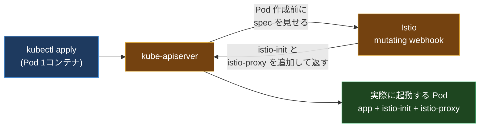
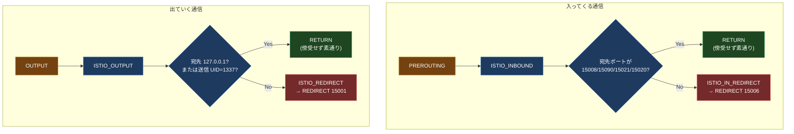

## はじめに

Istio を初めて触ったとき、一番「気持ち悪い」と思ったのはここだった。

アプリのコードは何も変えていない。`http://other-service:8080` に普通に HTTP リクエストを投げているだけ。なのに、その通信はいつのまにか mTLS で暗号化され、相手の証明書が検証され、メトリクスが取られ、リトライまでかかっている。アプリは「自分は素の HTTP を喋っているだけ」と信じきっている。

「アプリを無改造のまま、通信だけ横から全部すり替える」。これは魔法ではなく、Linux のネットワーク名前空間と iptables を使った、かなり泥臭い力技でできている。この記事は、その種明かしを Pod の中に降りて最後まで追うものだ。

前提知識(netns と iptables の最低限)から積むので、ネットワークが専門でなくても上から読めば追えるようにする。なお、この「サイドカー注入 + iptables 傍受」のコストを嫌って生まれたのが ambient mode で、それはこのシリーズの別記事「Ambient Mesh 徹底解剖」で扱っている。この記事を読むと、ambient がなぜ別の傍受方式を選んだのかも腑に落ちるはずだ。

---

## 0. 前提: netns と iptables の NAT テーブル

種明かしの前に、道具を 2 つだけ用意する。ここが分かっていないと後半が全部おまじないに見えてしまう。

### ネットワーク名前空間(netns)

Kubernetes の Pod は、中のコンテナ全部で **1 つのネットワーク名前空間(netns)** を共有している。netns は「独立した 1 個のネットワークスタック」で、専用の `eth0`、専用のルーティングテーブル、そして **専用の iptables ルール** を持つ。

ここが効いてくる。**Pod の netns に仕込んだ iptables ルールは、その Pod の中の全コンテナに効くが、Pod の外(ホストや他の Pod)には一切影響しない。** だから Istio は、Pod ごとに独立して通信を曲げられる。

### iptables の NAT テーブルと REDIRECT

iptables にはいくつかのテーブルがあるが、今回使うのは **NAT テーブル**。パケットが通る要所に「フック」があり、そこにルールを引っ掛けられる。今回の主役は 2 つ。

- **PREROUTING**: 外から **入ってくる** パケットが最初に通る場所
- **OUTPUT**: このホスト(netns)から **出ていく** パケットが通る場所

そして REDIRECT という「ターゲット(行き先)」がある。これは **「このパケットの宛先を、同じマシンの localhost の別ポートに強制的に書き換える」** 動作だ。たとえば「8080 宛てのパケットを 15006 に REDIRECT」すると、アプリは 8080 に送ったつもりなのに、実際は localhost:15006 で待っている Envoy に届く。アプリはこの書き換えに気づかない。

この「PREROUTING / OUTPUT というフック」と「REDIRECT というすり替え」の 2 つが、サイドカー傍受のすべての部品だ。あとはこれをどう組むか、という話になる。

---

## 1. サイドカー注入: 誰が Envoy を Pod に入れたのか

そもそも、アプリの Pod に Envoy コンテナが入っているのはなぜか。あなたは Deployment にそんなコンテナを書いていない。

入れているのは **mutating admission webhook** だ。Kubernetes には「API サーバが Pod を作る直前に、外部の Webhook にマニフェストを見せて書き換えさせる」仕組みがある。Istio はこの Webhook を登録していて、`istio-injection=enabled` ラベルの付いた名前空間に Pod が作られると、API サーバが Istio の Webhook を呼ぶ。Webhook は Pod の spec に 2 つのコンテナを足して返す。



足される 2 つはこれだ。

- **istio-init**(initContainer): アプリより先に動いて iptables ルールを仕込み、すぐ終了する。この記事の主役。
- **istio-proxy**(通常コンテナ): Envoy 本体。仕込まれたルールによって通信を受け取る。

つまり「アプリは無改造」は正確には嘘で、**Pod の spec が裏で書き換えられている**。アプリの Docker イメージは無改造、というのが正しい。

---

## 2. istio-init: iptables を仕込む使い捨ての初期化コンテナ

`istio-init` は initContainer なので、アプリコンテナより先に、1 回だけ動いて終わる。仕事はただ 1 つ、**Pod の netns に iptables ルールを設置すること** だ。Envoy 本体ではなく、この使い捨てコンテナがルール設置を担う。

そのために高い権限が要る。securityContext で **`NET_ADMIN` と `NET_RAW`** の capability を持つ。これがないと iptables を書き換えられない(この事実は後半のセキュリティの話で効いてくる)。

istio-init は中で `istio-iptables` というコマンドを、だいたいこういう引数で叩く。

```yaml
initContainers:
  - name: istio-init
    image: docker.io/istio/proxyv2
    command:
      - istio-iptables
    args:
      - -p
      - "15001"          # outbound を REDIRECT する先(Envoy outbound listener)
      - -z
      - "15006"          # inbound を REDIRECT する先(Envoy inbound listener)
      - -u
      - "1337"           # この UID の通信は傍受しない(= Envoy 自身)
      - -m
      - REDIRECT         # 傍受の方式
      - -i
      - '*'              # 傍受対象の宛先 IP レンジ(全部)
      - -b
      - '*'              # 傍受対象の inbound ポート(全部)
      - -d
      - "15090,15021,15020"  # inbound で傍受から除外するポート
    securityContext:
      capabilities:
        add: ["NET_ADMIN", "NET_RAW"]
```

引数の `-p 15001`(outbound 先)、`-z 15006`(inbound 先)、`-u 1337`(Envoy の UID)あたりを覚えておくと、次の章のチェーンが読める。

---

## 3. 4 つのチェーン: パケットを Envoy に曲げる配線

`istio-iptables` は NAT テーブルに **4 つのカスタムチェーン** を作り、PREROUTING と OUTPUT に引っ掛ける。

| チェーン | 役割 |
| --- | --- |
| ISTIO_INBOUND | PREROUTING から呼ばれる入口。除外ポートを振り分ける |
| ISTIO_IN_REDIRECT | inbound を 15006 に REDIRECT する終端 |
| ISTIO_OUTPUT | OUTPUT から呼ばれる入口。ループ防止の判定をする |
| ISTIO_REDIRECT | outbound を 15001 に REDIRECT する終端 |

全体像を 1 枚にするとこうなる。



### 3-1. inbound のパス(入ってくる通信)

他の Pod から自分宛てに届いたパケットは、まず PREROUTING を通り、ISTIO_INBOUND に飛ぶ。

```text
-A PREROUTING -p tcp -j ISTIO_INBOUND
-A ISTIO_INBOUND -p tcp --dport 15008 -j RETURN
-A ISTIO_INBOUND -p tcp --dport 15090 -j RETURN
-A ISTIO_INBOUND -p tcp --dport 15021 -j RETURN
-A ISTIO_INBOUND -p tcp --dport 15020 -j RETURN
-A ISTIO_INBOUND -p tcp -j ISTIO_IN_REDIRECT
-A ISTIO_IN_REDIRECT -p tcp -j REDIRECT --to-ports 15006
```

最初の 4 行が肝で、**Istio 自身が使うポート(15008 の HBONE、15090 の Envoy stats、15021 のヘルスチェック、15020 のマージ済みメトリクス)は RETURN で素通り** させる。これらまで Envoy に曲げると、Prometheus のスクレイプや kubelet のヘルスチェックが届かなくなって壊れるからだ。それ以外の通信は全部 ISTIO_IN_REDIRECT で **15006(Envoy の inbound listener)** に書き換えられる。

### 3-2. outbound のパス(出ていく通信)

アプリが他サービスに送る通信は OUTPUT を通り、ISTIO_OUTPUT に飛ぶ。ここには「曲げてはいけないもの」を弾く判定が入る。

```text
-A OUTPUT -p tcp -j ISTIO_OUTPUT
-A ISTIO_OUTPUT -d 127.0.0.1/32 -j RETURN          # localhost 宛ては素通り
-A ISTIO_OUTPUT -m owner --uid-owner 1337 -j RETURN # Envoy 自身の通信は素通り
-A ISTIO_OUTPUT -j ISTIO_REDIRECT
-A ISTIO_REDIRECT -p tcp -j REDIRECT --to-ports 15001
```

localhost 宛て(アプリが自分のサイドカーと喋るなど)は曲げない。次の `--uid-owner 1337` が次章の主役だ。それ以外は全部 **15001(Envoy の outbound listener)** に曲がる。Envoy はここで受けて、ルーティング・mTLS をかけてから本当の宛先に送り出す。

---

## 4. UID 1337: 無限ループを防ぐ 1 行

ここまでで素朴な疑問が出る。

> アプリの outbound を全部 15001 の Envoy に曲げた。Envoy はそれを受けて本当の宛先に送り出す。でもその Envoy の送信も OUTPUT を通るから、また 15001 に曲がって、自分自身にループするのでは?

その通りで、何もしないと無限ループする。これを断ち切るのが、さっきの 1 行だ。

```text
-A ISTIO_OUTPUT -m owner --uid-owner 1337 -j RETURN
```

**Envoy(istio-proxy)は UID 1337 で動いている。** iptables は「送信元プロセスの所有 UID」を見られるので、UID 1337 から出た通信は「これは Envoy 自身だ」と判断して RETURN(傍受せず素通り)する。アプリ(UID 1337 以外)の通信だけが曲げられる。マークではなく「誰が送ったか(UID)」で本物の通信と Envoy の再送を見分けているわけだ。


ここから実用上の重要な帰結が 1 つ出る。**自分のアプリを UID 1337 で動かしてはいけない。** もしアプリが 1337 で動くと、その通信は「Envoy のものだ」と誤判定されて傍受されず、mTLS もポリシーもすり抜けてしまう。地味だが本番でハマる落とし穴だ。

---

## 5. ポート早見表

Istio の `15xxx` ポートは数が多くて混乱しやすいので、ここで一覧にしておく。

| ポート | 用途 | 傍受されるか |
| --- | --- | --- |
| 15000 | Envoy admin インターフェース | (内部) |
| 15001 | Envoy outbound listener | outbound はここに曲がる |
| 15006 | Envoy inbound listener | inbound はここに曲がる |
| 15008 | HBONE(ambient で使用) | 除外(RETURN) |
| 15020 | マージ済みメトリクス + ヘルス | 除外(RETURN) |
| 15021 | ヘルスチェック | 除外(RETURN) |
| 15053 | DNS プロキシ(有効時) | (内部) |
| 15090 | Envoy Prometheus stats | 除外(RETURN) |

除外ポートが「Kubernetes や監視が Envoy を介さず直接触る必要がある口」だ、と理解しておくと表が暗記対象でなくなる。Prometheus のスクレイプは Envoy を通さず 15090 / 15020 に直接届く必要があるから除外されている。

---

## 6. ハンズオン: 実際に Pod の中の iptables を覗く

理屈を読んだら、実物を見るのが一番速い。kind と Istio があれば再現できる。

```bash
# kind クラスタを作る
kind create cluster --name istio-iptables

# Istio を最小プロファイルで入れる
istioctl install --set profile=minimal -y

# default 名前空間に自動注入を有効化
kubectl label namespace default istio-injection=enabled

# サンプルアプリを 1 個デプロイ
kubectl create deployment sleep --image=curlimages/curl -- sleep infinity

# Pod が 2/2(app + istio-proxy)で上がるのを確認
kubectl get pod -l app=sleep
```

`READY` が `2/2` になっていれば、サイドカーが注入されている。では実際の iptables ルールを覗く。一番確実なのは **istio-init のログを読む** ことだ。istio-init は仕込んだルールをそのまま標準出力にダンプしてから終了するので、ログにこの記事で読んだチェーンが全部出る。

```bash
# istio-init が設置した iptables ルールをログから読む(最も確実)
kubectl logs deploy/sleep -c istio-init
```

ここで、`ISTIO_INBOUND` / `ISTIO_OUTPUT` / `ISTIO_REDIRECT ... --to-ports 15001` / `--uid-owner 1337 -j RETURN` といった行が、そのまま並んでいるのが見えるはずだ。図で追ったものが実物として目の前に出てくる瞬間が、この記事のハイライトだ。

稼働中の Pod 側で直接見たい場合は、istio-proxy コンテナ越しに iptables を叩く手もある。ただし istio-proxy は UID 1337・`NET_ADMIN` なしで動くため、環境によっては `Permission denied` で弾かれる。その場合は上のログ方式を使う。

```bash
# 権限があれば現在の NAT テーブルを表示(弾かれたら istio-init ログを使う)
kubectl exec deploy/sleep -c istio-proxy -- iptables -t nat -S 2>/dev/null \
  || echo "権限が無いので kubectl logs ... -c istio-init を見る"
```

確認できたら片付ける。

```bash
kind delete cluster --name istio-iptables
```

---

## 7. セキュリティの注意: 傍受はバイパスできる

この仕組みを理解すると、セキュリティ上の含みも見えてくる。iptables ルールは **Pod の netns の中** にある。ということは、その netns の中で `NET_ADMIN` を持つコンテナは、**自分でルールを書き換えて Envoy をバイパスできる**。

具体的には、侵入された(あるいは悪意のある)アプリコンテナが `CAP_NET_ADMIN` を持っていると、ISTIO_OUTPUT のルールを消すなどして、Envoy を経由しない素の通信を出せてしまう。mTLS も `AuthorizationPolicy` もすり抜ける。

ここから言える運用上の原則は 2 つ。

- アプリコンテナに不要な `NET_ADMIN` / `NET_RAW` を絶対に渡さない。
- mesh のポリシーを「絶対の境界」とみなさない。サイドカー傍受は協力的なワークロードを前提にした仕組みであって、敵対的なコンテナを閉じ込める牢屋ではない。

> Kubernetes 側の権限を起点にした攻撃の組み立ては、別記事「Kubernetes Pentest Methodology」で扱っている。サイドカーのバイパスもこの文脈の 1 ピースだ。

---

## 8. なぜ ambient は別の方式を選んだのか

ここまで読むと、ambient mode(サイドカーレス)の設計判断が裏側から見える。

サイドカー方式は「Pod ごとに Envoy を 1 個入れて、UID 1337 でループを切る」。ambient はサイドカーを置かないので、ループ防止に UID は使えない(Pod の中に曲げる先の Envoy がいない)。代わりに ambient は、

- **istio-cni** が Pod の netns に in-pod リダイレクトのルールを仕込み、
- ノード共有の **ztunnel** に対して、UDS 経由で **netns のファイルディスクリプタを手渡し** し、
- ループ防止には UID ではなく **接続マーク `0x539`** を使う。

「Pod の netns に iptables を仕込んで通信を曲げる」という背骨は同じだが、曲げる先が「Pod 内の Envoy」から「ノード共有の ztunnel」に変わり、ループ判定が「UID」から「マーク」に変わった。この差が、サイドカー税(Pod 数ぶんの Envoy)を消すための工夫そのものだ。詳しくは「Ambient Mesh 徹底解剖」を参照。

---

## 9. まとめ

魔法だと思っていたものは、

1. Webhook がサイドカーを Pod に注入し、
2. initContainer が Pod の netns に iptables ルールを仕込み、
3. PREROUTING / OUTPUT で全 TCP を Envoy の 15006 / 15001 に REDIRECT し、
4. UID 1337 でループを切る、

という 4 段の積み重ねだった。一度この配線が頭に入ると、「なぜこのポートは塞ぐと壊れるのか」「なぜアプリを 1337 で動かしてはいけないのか」「なぜ mesh のポリシーは万能の境界ではないのか」が全部つながって見える。

実感する一番の近道は、6 章のハンズオンで `iptables -t nat -S` を実際に叩き、`--uid-owner 1337 -j RETURN` の 1 行を指さしてみることだ。この 1 行を消したら何が起きるか(無限ループ)を頭の中で再生できれば、この記事は自分のものになっている。Istio のトラブルでハマったときも、まずこの配線を覗けば、「なぜか通信が Envoy を通らない / 通りすぎる」の大半はここで説明がつく。

---

## 参考リンク

- [Jimmy Song / Understanding Sidecar Injection, Traffic Intercepting & Routing in Istio](https://jimmysong.io/en/blog/sidecar-injection-iptables-and-traffic-routing/)
- [Tetrate / Traffic types and iptables rules in Istio sidecar explained](https://tetrate.io/blog/traffic-types-and-iptables-rules-in-istio-sidecar-explained)
- [Istio / Ztunnel traffic redirection(ambient の比較用)](https://istio.io/latest/docs/ambient/architecture/traffic-redirection/)
- [DSecurity / istio-security-restrictions-bypass](https://github.com/DSecurity/istio-security-restrictions-bypass)
