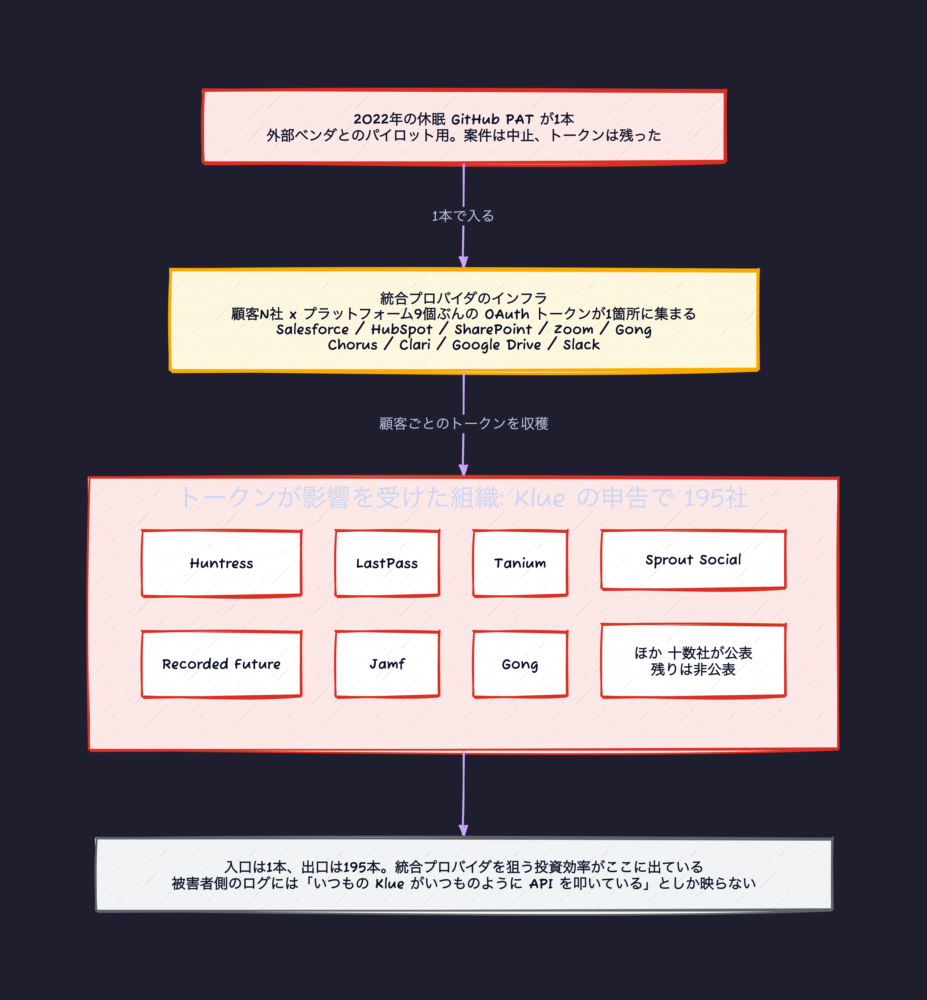

侵害の記事を読むとき、僕はいつも「根本原因」の欄を最初に見る。だいたいはゼロデイでも高度な攻撃でもない。

2026年6月の Klue の件は、その典型だった。根本原因はこれだ。

**2022年に、外部ベンダとのパイロット案件のために発行された GitHub の Personal Access Token が1つ。ビルド成果物が本番に出ることはなかった。トークンは消されなかった。4年間、Klue の GitHub 環境にアクセスできる状態で残っていた。**

2026年6月11日、攻撃者がそれを使って Klue の GitHub 環境に入った。

そこからが厄介だ。Klue の事後報告によれば、攻撃者はソースコードを落とし、別の Personal Access Token を入手し、そこから見つかった認証情報がまだ生きているかを1つずつ試した。「静かに動き、検知されないまま」と書かれている。

最終的に到達したのが、Klue が顧客各社から預かっていた OAuth トークンだった。

Salesforce、HubSpot、SharePoint、Zoom、Gong、Chorus、Clari、Google Drive、Slack。9つのプラットフォームのトークンが対象になった。

この記事では、この事故の構造を分解する。「クレデンシャルを消しましょう」で終わらせずに、統合プロバイダというものが構造的に持っている危うさと、実際に使える検出クエリ、そして爆発半径を縮める具体的な手まで書く。

## タイムライン

| 日付 | 出来事 |
| --- | --- |
| 2022年 | 外部ベンダとのパイロット案件のために GitHub Personal Access Token を発行。成果物は本番に出ず、トークンは残る |
| **2026-06-11** | 攻撃者がその休眠 PAT で Klue の GitHub 環境に認証。ソースを取得し、別の PAT と追加の認証情報を収集 |
| 同日 | 顧客の OAuth トークンを収穫するコード更新を投入。リモートからのコマンド実行経路も確立 |
| | (このとき、期限切れのたびにアクセストークンを作り直せる長寿命の鍵であるリフレッシュトークンも対象になったと見られる。後で効いてくる) |
| **2026-06-12** | Klue が統合インフラの一部で不正な活動を検知 |
| その後 | 攻撃者は被害各社の Klue 統合サービスアカウントに認証し、OAuth トークンを生成、**約24時間**にわたって Salesforce REST API に自動化された Python スクリプトを投げ続ける (ReliaQuest の追跡) |
| **2026-06-17** | Salesforce が Klue Battlecards 統合を無効化 |
| 2026-06-18 | 被害が公表されはじめる |
| 2026-06-19 | 攻撃者がリークサイトに Klue を掲載 |

Klue は影響を受けたクレデンシャルとトークンを失効させ、統合を無効化し、不正なコードを除去し、CrowdStrike をインシデントレスポンスに入れ、法執行機関に通報した。Klue プラットフォーム内に保存された顧客コンテンツ自体には影響がない、としている。

Klue は顧客に対し、トークンが影響を受けた組織は **195社**と伝えている。このうち自ら公表したのは十数社で、Huntress、Recorded Future、Jamf、Tanium、Gong、Sprout Social、LastPass などが名前を出している。

## 「Salesforce の脆弱性ではない」は正しい

Salesforce の声明はこうだ。

> 問題は Klue のアプリ接続に限定されており、**Salesforce プラットフォームの脆弱性に起因するものではない**

これは責任逃れではなく、技術的に正確な記述だと思う。

攻撃者がやったことは、**正規に発行された OAuth トークンで、正規の API を、正規の権限の範囲内で呼んだ**だけだ。認証は成功している。認可も成功している。どちらも設計どおりに動いた。

OAuth の脅威モデルは「トークンを持っている者は、そのトークンの権限を行使できる」を前提にしている。その前提の下では、これは仕様どおりの挙動になる。

問題はプロトコルではなく、トークンがどこに集まっているかだ。

## 統合プロバイダはトークンのハブになる

ここが構造の話になる。

Klue は競合インテリジェンスの SaaS で、「Battlecards」という製品が各社の CRM や通話記録やドキュメントからデータを引いてくる。そのために、**顧客ごとに、9つのプラットフォームぶんの OAuth トークンを預かる**。

顧客が100社いれば、Klue のインフラには最大 100 × 9 = 900 のトークンが集まる。

これは Klue の設計が悪いのではない。統合をやる以上、そうなる。SaaS 連携とは、他人の権限を預かって代理で行使することだからだ。

結果として何が起きるか。

- 1社を破ると N 社が抜ける。攻撃者にとって、統合プロバイダは投資効率が桁違いに良い標的になる
- 被害者は自分のログを見ても分からない。Salesforce 側から見れば、いつもの Klue が、いつものように API を叩いているだけ
- 信頼の連鎖が可視化されていない。「うちは Salesforce を使っている」は把握していても、「うちの Salesforce トークンを何社が持っているか」を即答できる組織は少ない



## これは初めてではない

同じ形の攻撃が、1年のあいだに3回起きている。

| 時期 | 対象 | 形 |
| --- | --- | --- |
| 2025年8月 | Salesloft / Drift | 統合プロバイダを侵害 → 顧客の Salesforce トークンを収穫 |
| 2025年11月 | Gainsight | 同上 |
| **2026年6月** | **Klue** | 同上。休眠クレデンシャル経由 |

Cloud Security Alliance は2026年7月16日のリサーチノートで、これらを ShinyHunters 系の1つのキャンペーンの弧として整理している。Microsoft も2026年7月13日に防御ガイダンスを出した。

そこで指摘されている検出上の問題が、この攻撃の核心を突いている。

> 正規の統合トークンを通じた一括クエリは、**通常の統合の挙動と区別がつかない**

区別がつかないのは、**本当に同じものだから**だ。同じトークン、同じ API、同じアプリ名。違うのは意図だけで、意図はログに出ない。

## それでも、見えたはずの兆候はあった

「区別がつかない」は完全な真実ではない。Datadog Security Labs が公開した検出ガイダンスを読むと、**行動としては十分に浮いていた**ことが分かる。

いちばん驚いたのがこれだ。攻撃者が使っていた User-Agent。

```text
Python-urllib/3.12
Python-urllib/3.14
```

Python の標準ライブラリのデフォルト値のままだ。Salesforce の公式 SDK でも、Klue の本番アプリでもない。偽装の努力が一切ない。

それでも約24時間気づかれなかった。つまり、多くの組織は connected app のトラフィックの User-Agent を見ていない。

他の行動指標も、単体では地味だが組み合わせると明確に浮く。

- 多数のオブジェクトにまたがる read の急増。攻撃者が触ったのは Opportunity、Case、Task、Lead、Contact、Account、User、Contract、Event、Campaign。統合が普段触るのは、そのうち数個のはず
- 失敗した API リクエストの急増が、成功したクエリと同時に起きる。攻撃者は何が取れるか手探りするので、失敗が混ざる。正規の統合は失敗しない
- `QueryMore` の多用。Salesforce の1リクエスト2000件制限を越えるためのコマンドで、一括吸い出しの署名になる
- 例外メッセージ `fault=-1; common.exception.ApiException: exceeded 100000 distinct who/what's`。10万件の閾値に当たっている

IP も公開されている。`138.226.246[.]94` / `212.86.125[.]24` / `213.111.148[.]90` / `94.154.32[.]160`。

### 実際に投げられるクエリ

Datadog が挙げている検出パターンを引く。Salesforce のイベントログを取り込んでいれば、そのまま使える形だ。

```text
event_name:ApiTotalUsage connected_app_name:* api_family:REST
  api_client_category:EXTERNAL_APPLICATION api_resource:*v59.0/query/*
```

```text
event_name:RestApi connected_app_id:* method:GET
  uri:/services/data/v59.0/query* message:Query*
```

```text
event_name:ApiEvent api_type:"REST" operation:Query* connected_app_id:*
```

特定のアプリに絞るなら `application:"Klue Battlecards"` (LoginEvent) や `connected_app_name:"Klue Battlecards"` を使う。OAuth リフレッシュトークンでのログインだけ見たいなら `login_sub_type:oauthrefreshtoken` (Login) または `login_sub_type:"OAuth Refresh Token"` (LoginEvent)。

これは Klue に限った話ではない。今つながっている全ての connected app に対して、同じ形の可視化を作れるかどうかが問われている。

## 何が爆発半径を縮めたか

「クレデンシャルの棚卸しをしましょう」は正しいが、それだけでは足りない。侵入は起きるものとして、被害を小さくする手を4つ挙げる。

### 1. 休眠クレデンシャルに有効期限を強制する

根本原因はここだった。**「作ったが使わなかった」クレデンシャルが4年生き残る**構造が問題で、人間の規律で解くのは無理だ。

必要なのは仕組みのほうだ。

- 発行時に有効期限を必須にする。無期限を作れなくする
- 最終使用日時を記録して、N日使われていないものを自動で無効化する
- 「試作用」「検証用」のクレデンシャルは、発行時点で短い期限を強制する

最終使用日時が取れないクレデンシャルの仕組みは、それ自体が欠陥だと思ってよい。棚卸しができないからだ。

### 2. リフレッシュトークンの寿命を意識する

ここは推測が混じるので分けて書く。Klue の声明は「OAuth トークン」としか言っておらず、リフレッシュトークンが含まれていたと明言してはいない。ただし復旧手順としてリフレッシュトークンの失効が語られており、攻撃者は実際に被害各社のサービスアカウントに認証して新しくトークンを生成している。含まれていたと考えるのが自然だ。

含まれていた場合、これが効く。アクセストークンだけなら数十分で失効するが、リフレッシュトークンがあれば攻撃者は自分でアクセストークンを作り直せる。

リフレッシュトークンには本来これらが要る。

- rotation (使うたびに新しいものに置き換わり、古いものは無効になる)
- 再利用検知 (無効化済みの古いトークンが使われたら、そのファミリー全体を失効させる。トークンが盗まれた明確な証拠になる)
- 絶対的な有効期限

なお IETF OAuth WG には `draft-ietf-oauth-refresh-token-expiration` という文書があり、この領域を扱っている。

### 3. スコープを狭める、そしてユーザーに選ばせる

統合アプリは、たいてい「将来使うかもしれない」権限までまとめて要求する。ユーザーは全部承認するか、諦めるかの二択になる。

ここに動きがあった。Cloudflare が2026年8月20日に optional scopes を導入している。

問題の立て方が的確だ。従来はクライアントが要求した権限を、ユーザーが同意画面でさらに狭めることができなかった。全部承認するか拒否するかの all-or-nothing。

optional scopes では、クライアント側が特定のスコープを optional として設定でき、ユーザーが同意画面でそれを外せる。外されたスコープは発行されるアクセストークンに含まれない。

Cloudflare 自身が MCP サーバを例に挙げているのが今っぽい。「MCP サーバは、エージェントが理論上使いうるという理由で広い権限セットを要求しがちだが、ほとんどのユーザーはエージェントにそこまでの権限を持たせたくない」。

開発者側の含意も明記されている。認可コードを交換したあと、要求した全スコープが承認されたと仮定せず、実際に付与されたスコープ集合を確認しなければならない。

Klue の文脈に引き直すと、9つのプラットフォームすべてに広い権限を渡す必要が本当にあったのか、という問いになる。Battlecards が Salesforce から Opportunity を読むだけなら、Contract も Campaign も User も要らない。

### 4. トークンに宛先を持たせる

これは長期の話だが、方向としては効く。今回のトークンは、盗んだ者が誰でも使える bearer トークンだった。

- DPoP (RFC 9449) や mTLS バインディング (RFC 8705): トークンを鍵に縛る。鍵がなければ盗んだトークンは使えない
- audience 制限: そのトークンがどのリソースサーバ向けかを明示し、他所では通らないようにする

エージェント関連の仕様が、そろってこの方向を向いているのは偶然ではない。

MCP (LLM にツールを繋ぐプロトコル) の2026-07-28 仕様は、サーバが自分宛でないトークンを受け取って他所へ中継することを禁じた。同じく MCP のエンタープライズ向け認可拡張は、発行されるアクセストークンが「どのサーバ向けか」を明示し、他のサーバでは通らないようにすることを必須にしている。ワークロードに ID を配る標準である SPIFFE も、2026年7月に取り込んだ新しいトークン形式で、鍵を持っていることの証明を必須にし、持っているだけで使える提示を禁止した。


## 実務のチェックリスト

自分のところで確認するなら、この順に見る。

**統合を使う側 (被害者になりうる側)。**

1. 自社のデータにアクセスできる connected app / OAuth アプリを全部列挙できるか。即答できないなら、そこがスタート地点
2. 各アプリが実際に使っているスコープと、承認されているスコープの差分を取る。差が大きいものから削る
3. connected app ごとの API 呼び出しをベースライン化する。触るオブジェクトの種類、時間帯、量、User-Agent。今回のように `Python-urllib/3.12` が来たら弾けるように
4. 統合の失効手順を事前に用意して、一度試しておく。事故の当日に手順を書くことになる状況を避ける
5. ベンダのインシデント通知の連絡先を把握しておく

統合を提供する側 (Klue の立場)。

1. 発行済みクレデンシャルの棚卸し。最終使用日時が取れないものがあれば、それを取れるようにするのが先
2. 顧客のトークンの保管場所を1つに絞り、そこへのアクセスを監査する。アプリケーションコードから直接読めるなら、コードを1行変えれば全部抜ける (今回起きたのはこれだ)
3. コードのデプロイ経路を、顧客トークンへのアクセス経路から分離する。今回の攻撃は「コードを送り込む」→「トークンを読む」の2段だった。ここが繋がっていることが被害を決めた
4. 顧客にスコープを選ばせる。optional scopes のような仕組みを用意する

3番目は特に強調したい。バックエンドに侵入されたことと、全顧客のトークンが抜かれたことの間には、本来もう1枚あるべきだった。

## まとめ

- 根本原因は、2022年に外部ベンダとのパイロット用に発行され、案件終了後も消されなかった GitHub Personal Access Token 1つ。4年間、Klue の GitHub 環境にアクセスできる状態で残っていた
- 攻撃者は2026年6月11日にそれで GitHub 環境に入り、ソースと別の PAT と追加の認証情報を集めたうえで、**顧客の OAuth トークンを収穫するコードを送り込んだ**。Salesforce / HubSpot / SharePoint / Zoom / Gong / Chorus / Clari / Google Drive / Slack の9つが対象
- Salesforce に脆弱性はないという声明は技術的に正確。正規のトークンで正規の API を正規の権限内で呼ばれている。プロトコルではなく、トークンが集まる場所の問題
- 統合プロバイダは構造的にトークンのハブになる。顧客N社 × プラットフォームM個のトークンが1箇所に集まる。統合をやる以上そうなる
- 同じ形の攻撃は1年で3回目。Salesloft/Drift (2025-08)、Gainsight (2025-11)、Klue (2026-06)
- 検出は「不可能」ではなかった。User-Agent は `Python-urllib/3.12` のまま。10種類のオブジェクトへの read 急増、失敗リクエストの混在、`QueryMore` の多用、10万件の例外。それでも約24時間走り続けた
- 爆発半径を縮める手は4つ。休眠クレデンシャルへの期限強制と最終使用日時の記録 / リフレッシュトークンの rotation と再利用検知 / スコープの絞り込みと optional scopes (Cloudflare が2026-08-20 に導入) / DPoP や audience 制限で bearer をやめる
- 提供側で最も重要なのは、コードのデプロイ経路と顧客トークンへのアクセス経路を分離すること。今回この2つが繋がっていたことが被害を決めた

「クレデンシャルの棚卸しをしましょう」は毎回言われて、毎回やりきれない。やりきれないことを前提にすると、次に効くのは最終使用日時が取れる仕組みを作ることだと思う。棚卸しは人間の規律の問題ではなく、データがあるかどうかの問題だからだ。4年間使われていないクレデンシャルが一覧で出てくるなら、消すのは簡単だ。

_最終確認: 2026-09-04_
