## はじめに: 「kubectl apply」の裏側を説明できるか

Kubernetes を数年触ってきて、Pod も Deployment も Service も普通に書ける。でもあるとき後輩に「`kubectl apply -f deploy.yaml` を叩いた瞬間から、Pod が実際に動き出すまでの間に何が起きてるんですか」と聞かれて、言葉に詰まった。

「えーと、API Server に送られて、まあいい感じにスケジュールされて…」

これはよくない。宣言的だなんだと言っておきながら、その宣言が**どのゲートを、どの順番で通過して、誰が実体化するのか**を自分の言葉で説明できていなかった。

この記事は、その反省から書いた「Kubernetes 再入門」だ。ただの入門ではなく、**1 本の API リクエストの一生**を背骨にして、途中にある認証・認可・Admission という 3 つのセキュリティゲートを丁寧に開けていく。そのうえで、なぜ Kubernetes の上に無数のプラットフォームが立つようになったのか、どんな OSS があり、どんな企業がどう使い、2026 年時点で何が熱いのかまで一気に整理する。

筆者の興味がセキュリティと認証・認可に寄っているので、そこは特に濃く書く。上から順に読めば、`kubectl apply` の裏側を自分の言葉で説明できるようになっているはずだ。

> このシリーズ (Kubernetes Fundamental) には Kubelet の内部実装、Networking (Service / EndpointSlice)、OCI Runtime vs CRI といった個別コンポーネントの深掘り記事もある (右のシリーズ一覧を参照)。この記事は「全体の地図」を描く役割なので、深掘りはそちらに任せて、ここでは**つながり**を重視する。

---

## 1. 大前提: Kubernetes は「状態を保つ API」である

最初に、一番大事な世界観を共有しておきたい。ここがブレると以降の話が全部ぼやける。

多くの人は Kubernetes を「コンテナオーケストレーター」と説明する。間違いではないが、実装を理解するうえではこう捉えたほうがいい。

**Kubernetes とは、「あるべき状態(desired state)を受け取って保存し、現実(actual state)をそこに近づけ続ける API サーバと、その周りで働くループの集合」である。**

命令的(imperative)ではなく宣言的(declarative)、というのはこういう意味だ。

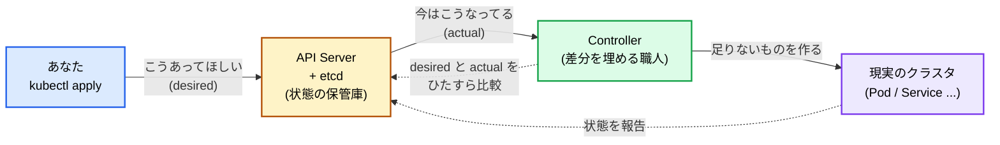

ポイントは 3 つ。

- **あなたは「命令」しない。「あるべき姿」を登録するだけ**。「Pod を起動しろ」ではなく「この Deployment はレプリカ 3 であるべき」と宣言する。
- **API Server は状態の唯一の窓口**。すべての読み書きはここを通り、実体は etcd に保存される。コンポーネント同士は直接おしゃべりしない。全部 API Server 経由だ。
- **Controller が現実を desired に寄せ続ける**。Pod が 1 個死んでレプリカが 2 になったら、Controller が「3 であるべきなのに 2 だ」と気づいて 1 個作る。この「気づいて埋める」を延々やるのが Reconcile ループ(後述)。

この「API + Reconcile ループ」という骨格を掴んでおくと、この後の話が全部ここに接続できる。認証も認可も Admission も「API Server という窓口を守るゲート」の話だし、Scheduler も Kubelet も「Reconcile ループの一種」だからだ。

---

## 2. リクエストの一生: kubectl apply が Pod になるまで

では本題。`kubectl apply -f deploy.yaml` を叩いた瞬間から Pod が動くまでを、1 本の流れとして追う。まずは全体像を頭に入れてほしい。

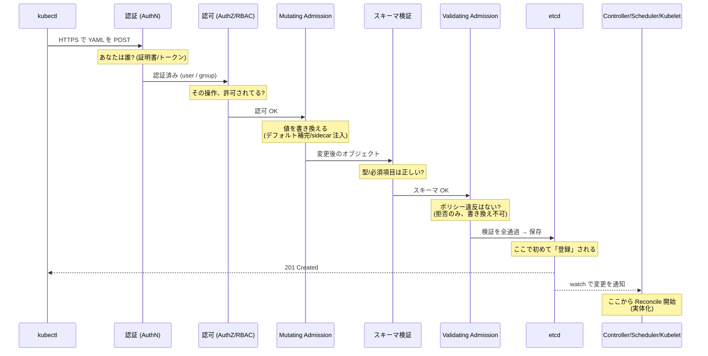

この図の**縦の並びがそのまま順番**だ。ここを押さえるのが今日の肝。よくある誤解は「検証(バリデーション)が最初」だと思うこと。違う。**まず「誰か」を確かめ(認証)、次に「やっていいか」を確かめ(認可)、それから中身をいじり(Mutating)、型を見て(スキーマ)、最後にポリシー違反を弾く(Validating)**。この順番には理由がある。認証されていない相手のリクエストの中身を検証しても意味がないし、認可で弾ける相手にコストの高い Admission を走らせるのは無駄だからだ。

実装レベルでは、この一連が全部同じ場所にあるわけではない。**認証と認可は HTTP のハンドラチェーン**(`DefaultBuildHandlerChain`)のフィルタとして実装され、リクエストはまず認証フィルタ、次に認可フィルタを通過する。一方 **Admission はもっと内側**で、REST ストレージ層(`create` / `update` ハンドラ)がオブジェクトを保存する直前に呼ばれる。つまり「認証・認可という門番」を抜けてから「受付カウンター(Admission)」に進む二層構造になっている。順番の意味は同じで、外側で相手を確定・許可してから、内側で中身を審査する。

以降、各ゲートを 1 つずつ開けていく。

---

## 3. ゲート 1: 認証 (Authentication)「あなたは誰か」

最初のゲートは認証だ。API Server は「このリクエストの送り主は誰か」を確定させる。ここで確定するのは **ユーザー名とグループ**、それだけ。「何をしていいか」はまだ一切判断しない。

重要な前提: **Kubernetes には「ユーザー」というリソースが存在しない**。`kubectl get users` はできない。人間のユーザーはクラスタ外の何か(証明書の発行元、OIDC プロバイダ)を信頼して受け入れる。一方、クラスタ内のワークロードのための ID は `ServiceAccount` という形で存在する。この非対称性が Kubernetes 認証の出発点だ。

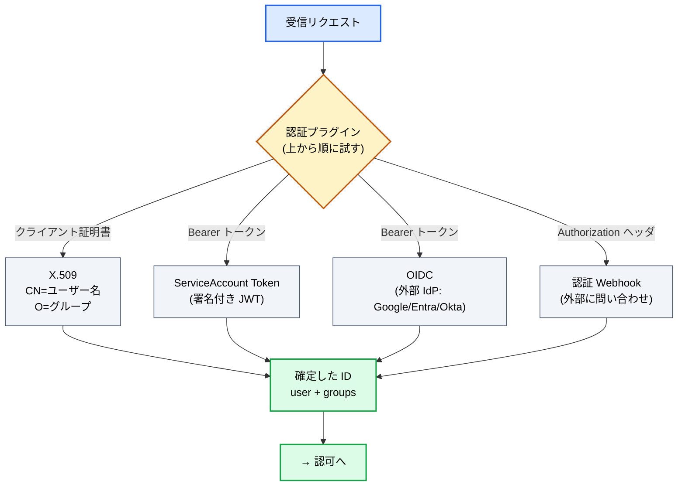

### 主な認証方式

- **X.509 クライアント証明書**: `kubeadm` で作った素のクラスタで人間が使う定番。証明書の `CN`(Common Name)がユーザー名、`O`(Organization)がグループになる。`kubectl` の kubeconfig に埋まっているのはたいていこれ。**弱点は失効(revoke)が難しいこと**。証明書は発行したら有効期限まで有効で、Kubernetes 側に失効リストの仕組みがない。漏れたら CA ごと作り直すしかない。だから本番の人間向けには推奨されない。
- **ServiceAccount トークン**: クラスタ内のワークロード(Pod)向けの ID。API Server が署名した JWT で、Pod に自動でマウントされる。詳細は次節。
- **OIDC(OpenID Connect)**: 本番で人間を認証する現代的な正解。Google / Microsoft Entra ID / Okta / Keycloak などの外部 IdP が発行した ID トークンを検証する。**Kubernetes 側はユーザーを持たず、IdP に委譲する**。失効も MFA も IdP 側の仕組みに乗れる。
- **認証 Webhook**: 上記で足りないとき、任意の外部サービスにトークン検証を投げる。マネージド Kubernetes(EKS / GKE / AKS)がクラウド IAM と統合するのに使われている。

### ServiceAccount トークンの進化: ここがセキュリティの分岐点

ワークロードの ID は Kubernetes セキュリティの核心なので、少し深掘りする。かつての ServiceAccount トークンには深刻な問題があった。

**昔(〜v1.21 のデフォルト)** の Secret ベーストークンは、こういう代物だった。

- **無期限**。一度発行されたら永久に有効。
- **失効不能**。SA を消してもトークンは生き続ける。
- **audience(宛先)無指定**。どのサービスにでも使い回せる。
- Secret として etcd に平文同然で保存され、`get secrets` 権限があれば誰でも読める。

これは攻撃者にとって最高の獲物だった。Pod に侵入してトークンを 1 個抜けば、恒久的なクラスタアクセスが手に入る。

**今(Bound ServiceAccount Token / Projected Volume)** は、上の 4 つの弱点がすべて裏返った。無期限 → 有効期限あり、失効不能 → Pod が消えれば無効、audience なし → 宛先を限定、etcd 常駐 → メモリ上。

言葉で 4 点並べても頭に残らないので、**トークンがどう発行され、どう使われるか**を追ってみる。ここが「Pod の ID がクラウドの権限に化ける」認証連鎖の実物だ。

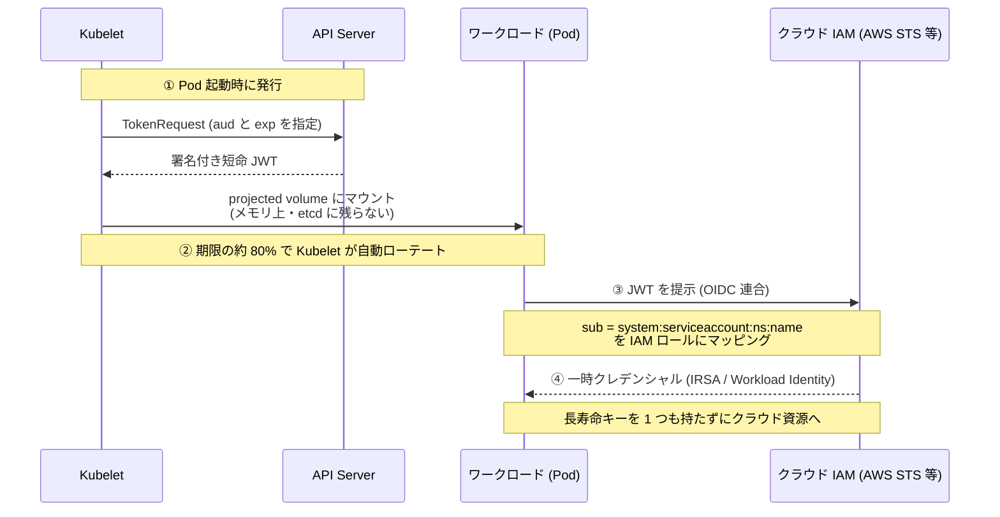

ポイントは、Kubelet が `TokenRequest` API で発行する短命トークンには `aud`(宛先)と `exp`(期限)が入り、Pod が消えれば束縛先(bound)も無効になること。そしてこの JWT は OIDC 準拠なので、外部のクラウド IAM がそれを検証して**一時クレデンシャルに交換**できる。AWS IRSA / EKS Pod Identity、GKE Workload Identity はまさにこれで、「Pod の SA トークン」を「クラウドの一時権限」に化けさせている。**長寿命なアクセスキーを Pod に埋め込まなくていい**というのが、この仕組み最大の価値だ。認証・認可に興味があるなら、この JWT 交換の連鎖は必見。

---

## 4. ゲート 2: 認可 (Authorization)「その操作、やっていいか」

認証で「誰か」が確定した。次は認可、「その誰かは、この操作をやっていいか」を判断する。

Kubernetes の認可は複数のモジュールを順に評価する。**どれか 1 つでも `allow` を返せば通過、全部が態度を保留(no opinion)なら拒否**。明示的な `deny` は即時拒否だ。

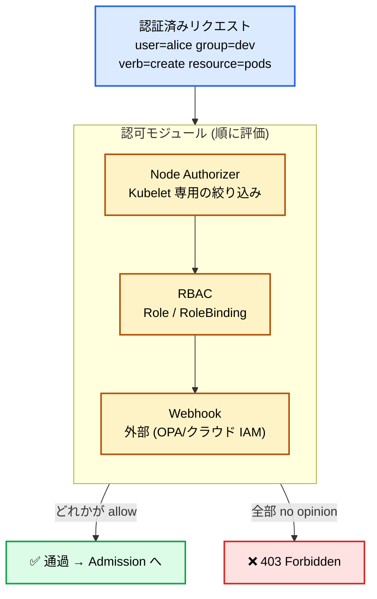

### RBAC: 4 つのオブジェクトだけ理解すればいい

本番でほぼ必ず使うのが RBAC(Role-Based Access Control)だ。登場人物は 4 つしかない。

| オブジェクト | 役割 | スコープ |
| --- | --- | --- |
| `Role` | 「何に対して何ができるか」の許可の束 | 1 つの Namespace 内 |
| `ClusterRole` | 同上だが、クラスタ全体 or 全 Namespace 横断 | クラスタ全体 |
| `RoleBinding` | Role/ClusterRole を「誰に」割り当てる | 1 つの Namespace 内 |
| `ClusterRoleBinding` | ClusterRole を「誰に」割り当てる | クラスタ全体 |

RBAC の設計思想は 2 つ覚えておけばいい。

- **許可のみ(allow-only)、拒否ルールがない**。「これは禁止」を書く方法はない。デフォルト全拒否で、必要な許可を足していく。だから権限が過剰になりがちで、**最小権限の設計はあなたの責任**になる。
- **Verb × Resource の掛け算**。「`get` を `pods` に」「`create` を `deployments` に」という粒度。ワイルドカード(`*`)は便利だが危険で、`verbs: ["*"]` や `resources: ["*"]` は監査で真っ先に指摘される。

具体例を見よう。「dev Namespace で Pod を読めるが、消せない」ロール。

```yaml
apiVersion: rbac.authorization.k8s.io/v1
kind: Role
metadata:
  namespace: dev
  name: pod-reader
rules:
  - apiGroups: [""]          # "" は core グループ
    resources: ["pods"]
    verbs: ["get", "list", "watch"]   # delete は含まない
---
apiVersion: rbac.authorization.k8s.io/v1
kind: RoleBinding
metadata:
  namespace: dev
  name: alice-can-read-pods
subjects:
  - kind: User
    name: alice           # 認証で確定した user 名と一致させる
    apiGroup: rbac.authorization.k8s.io
roleRef:
  kind: Role
  name: pod-reader
  apiGroup: rbac.authorization.k8s.io
```

`subjects` の `name: alice` は、**ゲート 1 の認証で確定したユーザー名と文字列一致**する必要がある。ここで認証と認可がつながる。証明書の `CN=alice` なり OIDC の `sub` なりが `alice` にマップされていて初めて、この RoleBinding が効く。

### その他の認可モジュール

- **Node Authorizer**: Kubelet が API Server に対してできることを、その Node 上の Pod に関係するものだけに絞る特殊モジュール。Node が乗っ取られても被害を局所化する。
- **Webhook**: 認可の判断を外部に委譲する。ここに **OPA や クラウド IAM** を挿すと、RBAC では表現しきれない条件付きポリシー(「本番 Namespace には金曜デプロイ禁止」等)を実装できる。
- **ABAC**: 属性ベース。ファイルにポリシーを書く古い方式で、更新に API Server 再起動が要るため今はほぼ使われない。

### 2026 のトレンド: Structured Authentication / Authorization Config

ここ最近の大きな変化として、認証と認可の設定が**フラグの羅列から構造化された設定ファイルへ**移行している。この節の具体的な KEP・バージョンは後半の「2026 トレンド」でまとめて扱う。

---

## 5. ゲート 3: Admission Control「中身に手を入れる / ポリシーで弾く」

認証・認可を通ったリクエストは、最後に Admission Control(受付管理)を通る。ここは 2 段構えだ。

1. **Mutating Admission(書き換え)**: オブジェクトの中身を**変更**できる。デフォルト値の補完、サイドカーの自動注入(Istio の Envoy 注入はこれ)、ラベル付与など。
2. **スキーマ検証**: 型や必須フィールドが正しいかの構造的なチェック(ユーザーは直接いじれない組み込み処理)。
3. **Validating Admission(検証)**: オブジェクトを**変更せず**、ポリシー違反なら**拒否だけ**する。

**Mutating が先、Validating が後**なのは理にかなっている。先に全部の書き換えを済ませてから、最終形をポリシーで審査するからだ。順番が逆だと、検証を通った後に書き換えが入って違反状態になりうる。

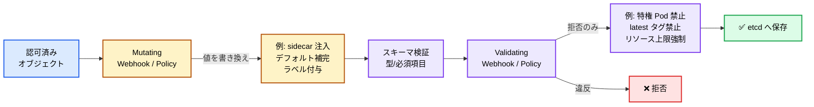

### Webhook から CEL ポリシーへ

従来、独自の Admission ロジックは **Admission Webhook**(外部の HTTP サーバ)で実装するのが定番だった。OPA/Gatekeeper や Kyverno がまさにこれだ。強力だが弱点がある。

- 外部サーバが**単一障害点**になる。Webhook が落ちると(failurePolicy 次第で)クラスタ全体の書き込みが止まる。
- ネットワークホップのぶんレイテンシが乗る。
- 運用対象(証明書、可用性)が増える。

そこで登場したのが **ValidatingAdmissionPolicy (VAP)**。ポリシーを **CEL(Common Expression Language)** の式で書き、**API Server 内部で評価する**。外部サーバ不要、単一障害点なし、速い。

```yaml
# 例: :latest タグのイメージを拒否する CEL ポリシー
apiVersion: admissionregistration.k8s.io/v1
kind: ValidatingAdmissionPolicy
metadata:
  name: "no-latest-tag"
spec:
  matchConstraints:
    resourceRules:
      - apiGroups: ["apps"]
        apiVersions: ["v1"]
        operations: ["CREATE", "UPDATE"]
        resources: ["deployments"]
  validations:
    - expression: >-
        object.spec.template.spec.containers.all(c,
          !c.image.endsWith(':latest'))
      message: ":latest タグは禁止されています"
```

VAP は書き換えができない検証専用だったが、その後 **書き換え版(Mutating 側の CEL ポリシー)** も追加され、「Webhook を CEL で置き換える」流れが本格化している。詳しいバージョン・KEP 番号は後半で扱う。Pod Security Admission(特権 Pod を Namespace ラベルで一括制御する組み込み機構)も、この Validating の系譜にある。

---

## 6. etcd 保存後: Reconcile ループが実体化する

3 つのゲートを全通過したオブジェクトは、ようやく **etcd に保存**される。ここで `kubectl` には `201 Created` が返る。だが**この時点ではまだ何も動いていない**。保存されたのは「あるべき姿」の記録だけだ。

ここから先が Kubernetes の真骨頂、**Reconcile(調整)ループ**だ。各種 Controller が API Server を `watch` していて、「新しい Deployment が登録された」という変更通知を受け取ると動き出す。

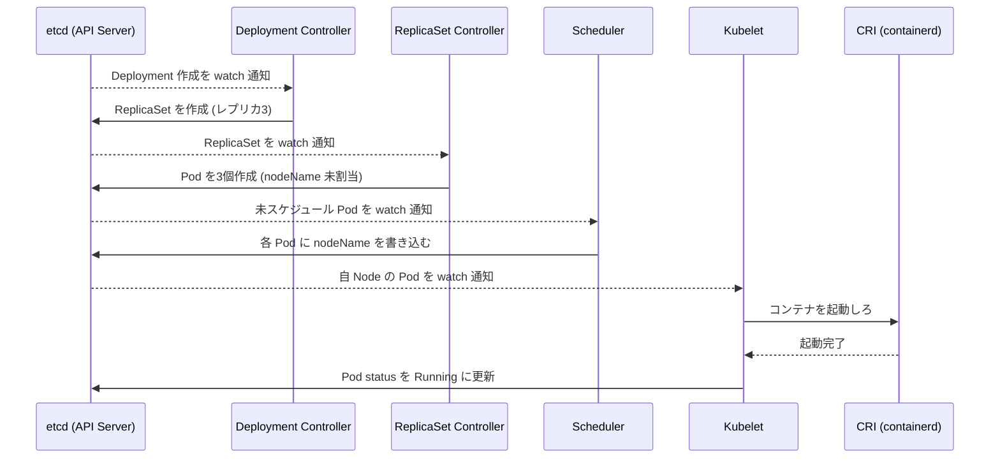

注目すべきは、**誰も直接命令していない**ことだ。Deployment Controller は Scheduler に「スケジュールしろ」とは言わない。ただ etcd に ReplicaSet を書くだけ。それを見た別の Controller が反応する。**全員が API Server を見て、自分の担当分を淡々と埋める**。この疎結合が Kubernetes の拡張性と堅牢性の源泉だ。

このオーナー関係は `ownerReferences` として記録され、こういう連鎖になる。

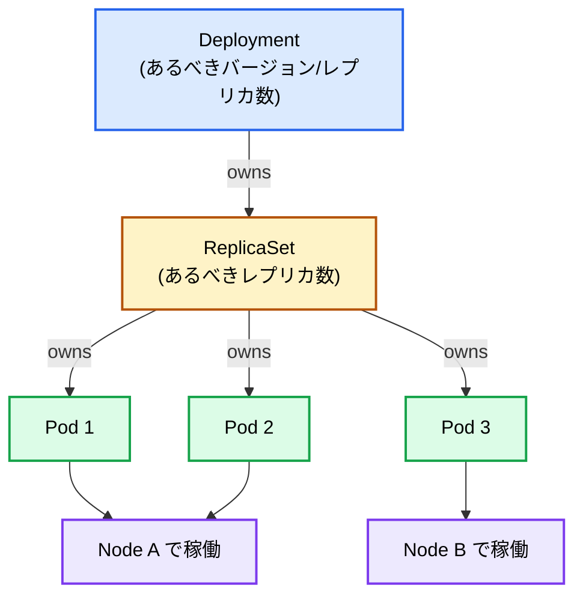

なぜ Deployment → ReplicaSet → Pod と 2 段挟むのか。**ローリングアップデートのため**だ。デプロイ更新時、Deployment は新しい ReplicaSet を作り、新旧 2 つの ReplicaSet のレプリカ数を少しずつずらして(新を増やし旧を減らして)無停止で切り替える。ロールバックは古い ReplicaSet をまた増やすだけ。この「世代」を持つために中間層がいる。

Scheduler から先、Kubelet が CRI 経由でコンテナを起こす部分は、このシリーズの Kubelet 記事と OCI Runtime vs CRI 記事で深掘りしているので、ここでは「Reconcile ループの末端でコンテナが物理的に起動する」とだけ押さえておけばいい。

---

## 7. リソースの地図: 主要リソースを役割で分類する

ここまでで「リクエストの一生」は追えた。次はもう少し引いて、Kubernetes にどんなリソースがあり、どう分類できるかを地図にする。丸暗記ではなく、**役割ごとの箱**で捉えるのが理解の近道だ。

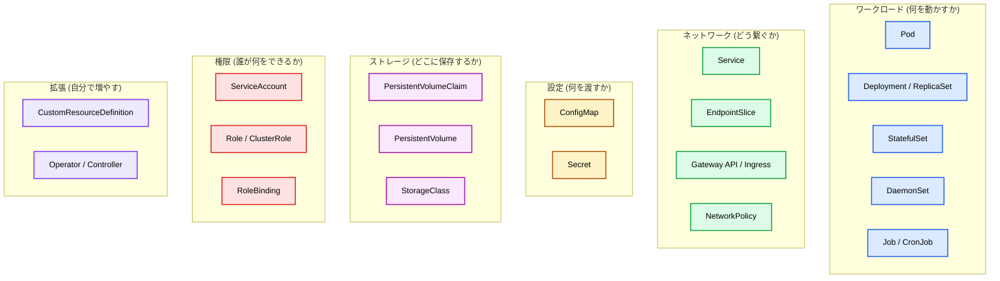

どのリソースも、これまで説明した**同じ API とゲートと Reconcile ループ**の上に乗っている。Service を作れば EndpointSlice Controller が反応し、PVC を作れば CSI が PV をプロビジョニングする。全部同じ骨格の応用だ。

特に注目してほしいのは右下の **拡張(CRD / Operator)** の箱だ。ここが「なぜ Kubernetes の上に無数のプラットフォームが立つのか」の答えになっている。次章で掘る。

---

## 8. なぜ Kubernetes の上にプラットフォームが立つのか

Kubernetes が「単なるコンテナ管理ツール」を超えて、**プラットフォームを作るためのプラットフォーム**になった理由。それが CRD と Operator パターンだ。

### 仕組み: あなたも API を生やせる

`CustomResourceDefinition`(CRD)を登録すると、**あなた独自のリソース種別**が API Server に生える。`kind: Database` でも `kind: Certificate` でも `kind: KafkaCluster` でも作れる。しかも、組み込みリソースと**まったく同じ**扱いになる。同じ `kubectl` で操作でき、同じ認証・認可・Admission を通り、同じように etcd に保存され、同じように `watch` できる。

そこに、あなたが書いた **Operator(= その CRD 専用の Controller)** を組み合わせる。Operator は自作リソースを watch して、Reconcile ループを回す。「`Database` が登録されたら、実際に PostgreSQL の StatefulSet と Service と Secret を作り、バックアップを仕込み、フェイルオーバーする」といった**運用知識をコード化**できる。

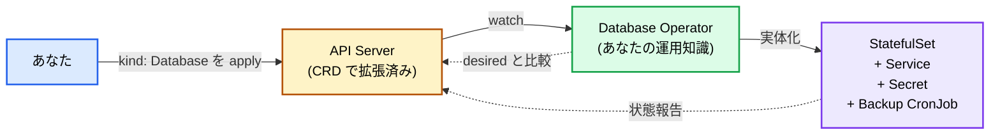

### なぜこれが「そってる(みんな乗ってる)」のか

Kubernetes をアプリの土台に選ぶと、**タダで付いてくるもの**があまりに多い。プラットフォームを一から作るなら自前で用意しないといけない機能が、最初から揃っている。

- **宣言的 API と保管庫**(API Server + etcd): 自前で REST API も DB もいらない。
- **Reconcile ループの枠組み**(controller-runtime): 「あるべき状態に寄せ続ける」を書く土台がある。
- **認証・認可・Admission**: セキュリティの入口が最初からある。
- **watch / informer**: 変更通知の仕組みがタダ。
- **エコシステム**: 監視・ネットワーク・ストレージのプラグインが揃っている。

つまり「分散システムの面倒な土台」を Kubernetes が肩代わりしてくれる。だから DB もサーバーレスも CI/CD も VM 管理も ML パイプラインも、**とりあえず Kubernetes の CRD + Operator として実装する**のが 2020 年代の定石になった。「Kubernetes は新しい Linux(= 共通の実行基盤)だ」と言われるのはこの意味だ。

### この上に立つ代表的なプラットフォーム

実際に「Kubernetes の上に立つプラットフォーム」は、この CRD + Operator パターンの応用でできている。カテゴリ別に代表例を挙げる。

| やりたいこと | プラットフォーム | 何を CRD にしたか |
| --- | --- | --- |
| サーバーレス (関数/自動スケール) | Knative, OpenFaaS | `Service` を「0 からスケールする関数」に |
| VM を Pod のように扱う | KubeVirt | `VirtualMachine` を CRD 化。Pod と VM を同じ API で |
| ML パイプライン | Kubeflow | `Notebook` / `TrainJob` などを CRD 化 |
| クラウド資源を宣言的に | Crossplane | AWS/GCP の RDS や S3 を `kind: Database` として |
| DB 運用の自動化 | CloudNativePG, Vitess | `Cluster` を CRD 化し、バックアップ/フェイルオーバー自動化 |
| クラスタ自体を宣言的に作る | Cluster API | `Cluster` / `Machine` を CRD 化 |
| 強いマルチテナント分離 | vCluster | 仮想クラスタを CRD で |

特に象徴的なのが **Crossplane** だ。2025 年に v2 が出て、「社内向けの独自プラットフォーム API を Kubernetes の上に作る」ためのフレームワークとして定着した。開発者は `kind: PostgreSQLInstance` を apply するだけで、裏で Crossplane が実際の AWS RDS をプロビジョニングする。**Kubernetes が「クラウドの統一コントロールプレーン」になった**わけだ。

そして 2026 年、この流れは AI に飲み込まれている。CNCF は「あらゆる AI プラットフォームが Kubernetes に収束している(The great migration)」と表現していて、GPU スケジューリングや分散推論の基盤としても、まず Kubernetes の CRD + Operator に乗せるのが定石になった。後半のトレンド節で詳しく触れる。

---

## 9. エコシステム OSS 早見表 (2026)

Kubernetes 単体では素の基盤にすぎない。実運用は周辺 OSS の組み合わせで成り立つ。カテゴリ別に、2026 年時点で押さえるべきものを CNCF の成熟度つきで整理する(Graduated = 卒業、Incubating = 育成中)。

| カテゴリ | 代表 OSS | メモ |
| --- | --- | --- |
| 通信の入口 (Gateway) | Gateway API, Envoy Gateway | Ingress は機能凍結。**Gateway API (v1.5) が事実上の後継**。Ingress-NGINX は引退表明済み |
| サービスメッシュ | Istio (Graduated), Linkerd (Graduated), Cilium (Graduated) | Istio は **Ambient (サイドカーレス) が GA**。ztunnel が L4 の mTLS(相互 TLS 認証)を担う |
| ネットワーク (CNI) | Cilium, Calico | Cilium は eBPF ベースで NetworkPolicy と可観測性まで |
| 監視・可観測性 | Prometheus (Graduated), OpenTelemetry (Graduated), Grafana | OTel が計装の標準に |
| ポリシー (Admission) | Kyverno, OPA/Gatekeeper | **Kyverno は 2026-03 に卒業**。今は CEL ベース |
| GitOps (デプロイ) | Argo CD (Graduated), Flux (Graduated) | 「git を正とする」宣言的デプロイ |
| 証明書 | cert-manager (Graduated) | TLS 証明書の自動発行・更新 |
| シークレット | External Secrets (Incubating) | 外部の Vault/クラウド KMS と同期 |
| ランタイムセキュリティ | Falco (Graduated) | 異常な syscall を検知 |
| 脆弱性スキャン | Trivy | イメージ/IaC/SBOM をスキャン |
| ワークロード ID | SPIFFE / SPIRE (Graduated) | 短命・証明付きの mTLS ID (SVID) |
| 署名・供給網 | Sigstore (Graduated) | keyless 署名 (Cosign / Fulcio / Rekor) |

セキュリティに寄せて読むなら、下 5 つ(SPIFFE/SPIRE, Sigstore, Falco, Trivy, cert-manager)がゼロトラストと供給網セキュリティの中核だ。認証・認可の話とまっすぐつながる。

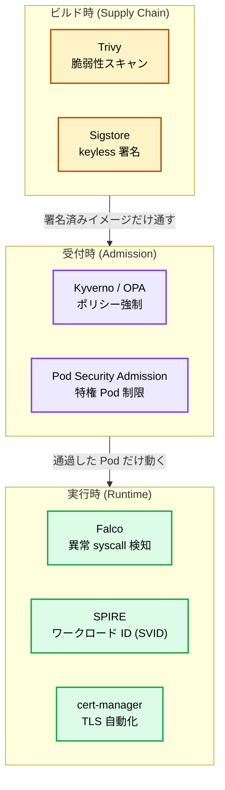

「ビルド時に署名 → 受付時にポリシーで検証 → 実行時に監視」という 3 段の守りが、これまで見てきた **Admission ゲートと Reconcile ループの上に自然に乗る**。セキュリティ製品も特別な仕組みではなく、コア API の拡張点にプラグインしているだけ、という見え方になる。

---

## 10. 企業事例: どれくらいの規模で使われているか

抽象論だけだと実感がわかないので、公開されている大規模事例を数字で見る。

- **OpenAI**: 単一クラスタを **7,500 ノード**まで拡張(利用中 IP 約 20 万)。ML 学習ジョブは NVLink / GPUDirect のために 1 ノードを丸ごと占有することも多い。コントロールプレーンは Azure、ノードは自社データセンターというハイブリッド構成。あるチームでは実験規模が 10 倍になった。
- **Spotify**: 月間 2 億超のユーザー。最大級のサービスは合計で毎秒 **1,000 万リクエスト**。自作オーケストレーター "Helios" から移行し、ビンパッキング(空いたノードに Pod を無駄なく詰める配置)で **CPU 利用率が 2〜3 倍**改善。新サービスの立ち上げが約 1 時間から数分〜数秒に短縮。
- **Zalando**: 欧州の EC。AWS 上で Kubernetes を自律チーム制で運用。
- **Kyverno 採用企業(公表)**: Bloomberg, Coinbase, Deutsche Telekom, LinkedIn, Spotify, Vodafone, Wayfair。ポリシー as コードが大企業の標準運用になっている証左。

共通するのは、**「サーバを管理する」から「あるべき状態を宣言する」へ運用モデルが変わった**ことで、利用率・立ち上げ速度・チームの自律性が伸びている点だ。これまで見てきた「宣言的 API + Reconcile」がそのまま効いている。

---

## 11. 2026 年のトレンドと最近の KEP (セキュリティ重点)

最後に、2026 年時点で何が動いているかを、筆者の興味に寄せてセキュリティ・認証認可を中心に整理する。執筆時点の最新安定版は **v1.36 "Haru"**(2026-04-22 リリース)。

### 11-1. Admission が「Webhook」から「CEL ポリシー」へ

セクション 5 で触れた流れが本格化した。外部 Webhook サーバの単一障害点・レイテンシ問題を、API Server 内蔵の CEL 評価で解消する動きだ。

| 機能 | KEP | GA |
| --- | --- | --- |
| ValidatingAdmissionPolicy (検証) | KEP-3488 | v1.30 |
| MutatingAdmissionPolicy (書き換え) | KEP-3962 | **v1.36** |

これで **検証も書き換えも Webhook なしで書ける**ようになった。OPA/Gatekeeper や Kyverno も内部を CEL ベースに寄せていて、「Admission ロジックは CEL で API Server 内」が新しい標準になりつつある。

### 11-2. 認証・認可の設定が「フラグ」から「構造化ファイル」へ

長年 `--oidc-issuer-url` のようなフラグ地獄だった認証・認可の設定が、宣言的な設定ファイルに置き換わった。

| 機能 | KEP | GA | 何が嬉しいか |
| --- | --- | --- | --- |
| Structured Authentication Config | KEP-3331 | v1.35 | **複数 OIDC 発行者**を同時に、CEL でクレーム変換・検証、ホットリロード |
| Structured Authorization Config | KEP-3221 | v1.32 | 複数 Authorizer を**順序付きチェーン**に、Webhook ごとに CEL の match 条件と明示 Deny |

特に Structured Authentication Config は大きい。従来の OIDC 設定は「発行者 1 つだけ」という致命的な制約があった。マルチテナントで複数の IdP を受け入れたいとき詰んでいたのが、これで解ける。認証・認可に興味があるなら、まずここを触るのがおすすめ。

### 11-3. ServiceAccount トークンの締め上げ

セクション 3 で見た Bound Token 化(KEP-1205, v1.22 GA)に続いて、レガシートークンの掃除が進んでいる。

- **レガシー Secret トークンの自動クリーンアップ**(KEP-2799, v1.30 GA): 1 年間未使用のトークンを無効化し、その後削除する。「無期限トークンが etcd に残り続ける」問題を運用で潰す。
- **イメージ Pull への SA トークン利用**(KEP-4412, v1.34 beta): プライベートレジストリからの pull 認証に、長寿命な imagePullSecret ではなく短命 SA トークンを使えるようにする。認証情報の寿命をさらに縮める方向。

方向性は一貫していて、**「長寿命クレデンシャルを短命・束縛付き・失効可能に置き換える」**。これは SPIFFE/SPIRE や Sigstore の keyless と同じ思想で、クラウドネイティブ全体のトレンドだ。

### 11-4. 隔離を強くする: User Namespaces

- **User Namespaces**(KEP-127, `hostUsers: false`, v1.36 GA): コンテナ内の root(UID 0)をホストの非特権 UID にマッピングする。コンテナ脱出が起きても、ホストでは無権限ユーザーにしかならない。長年 alpha だったこの機能がついに GA になり、**多層防御の標準装備**になりつつある。

### 11-5. AI ワークロードが基盤を作り替えている

2026 年の KubeCon(NA 2025 Atlanta / EU 2026 Amsterdam)で支配的だったテーマが「Cloud-native から AI-native へ」だ。セキュリティの話ではないが、基盤そのものが変わるので触れておく。

- **DRA(Dynamic Resource Allocation)**(KEP-4381, v1.34 GA): GPU など特殊デバイスを、トポロジを意識して宣言的に割り当てる仕組み。CNCF の新しい「Kubernetes AI Conformance」でも前提とされ、GPU スケジューリングの標準基盤になった。
- **LeaderWorkerSet / Gang Scheduling**(KEP-4671): 1 台に載らない巨大 LLM を複数ノードに跨がって推論する「リーダー+ワーカー」構成のための新プリミティブ。
- **Agentic ops**: AI が「チャット補助」から「スケール変更・ロールバック・インシデント起票などの操作を実際に行う」段階へ。多くが MCP 経由で LLM をクラスタツールに繋ぐ形で、**新しい認可・ガバナンスの課題**を生んでいる。ここは認証認可の次のフロンティアだ。

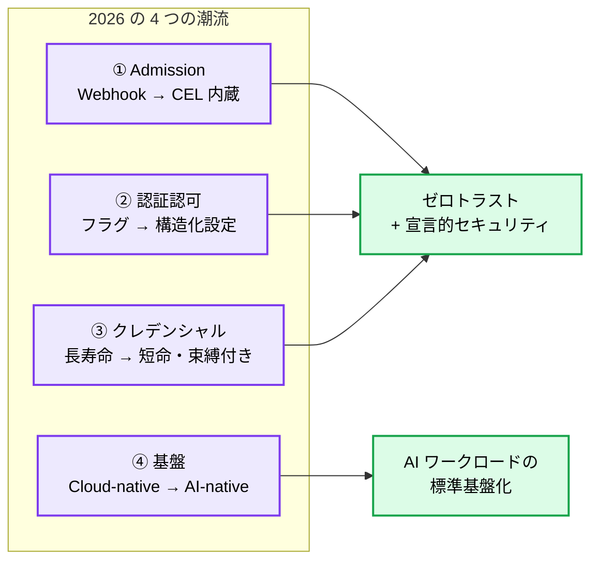

---

## 12. まとめ: この 1 本で繋がったこと

長かったので、背骨だけ振り返る。

1. **Kubernetes は「あるべき状態を保つ API + Reconcile ループ」**。命令ではなく宣言。
2. `kubectl apply` は、**認証 → 認可 → Mutating Admission → スキーマ検証 → Validating Admission → etcd** という順のゲートを通る。この順番には理由がある。
3. etcd に保存されてからが本番。**Controller / Scheduler / Kubelet が誰にも命令されず、API Server を見て淡々と実体化する**(Reconcile)。
4. **CRD + Operator** で誰でも API を生やせる。これが「Kubernetes の上に無数のプラットフォームが立つ」理由。
5. 周辺 OSS(SPIFFE/SPIRE, Sigstore, Kyverno, Falco...)は、この**同じゲートと Reconcile の上に**セキュリティを積む。
6. 2026 の潮流は「Admission の CEL 内蔵化」「認証認可の構造化設定」「クレデンシャルの短命化」「AI-native 基盤化」。

セキュリティ観点の早見表を最後に置いておく。

| ゲート | 守るもの | 2026 の要点 |
| --- | --- | --- |
| 認証 (AuthN) | 「誰か」 | 人間は OIDC / 構造化認証設定、ワークロードは Bound SA Token |
| 認可 (AuthZ) | 「やっていいか」 | RBAC が主役、構造化認可設定で多段化 + CEL |
| Admission | 「中身とポリシー」 | Webhook から CEL (VAP / MAP) へ |
| 実行時 | 「動いた後」 | Pod Security Admission, User Namespaces, Falco |

`kubectl apply` の裏側を、もう自分の言葉で説明できるはずだ。次に何か新しいリソースや CRD に出会っても、「これは同じ API とゲートと Reconcile の上に乗っているだけ」と捉えれば、怖くない。

もし深掘りしたくなったら、このシリーズの Kubelet / Networking / OCI Runtime vs CRI の記事、そしてセキュリティ寄りなら Kubernetes Pentest / OPA & kube-mgmt の記事へどうぞ。次はあなたが `ValidatingAdmissionPolicy` を 1 個書いてみるところから始めるのがいい。
