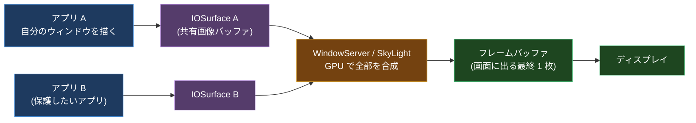
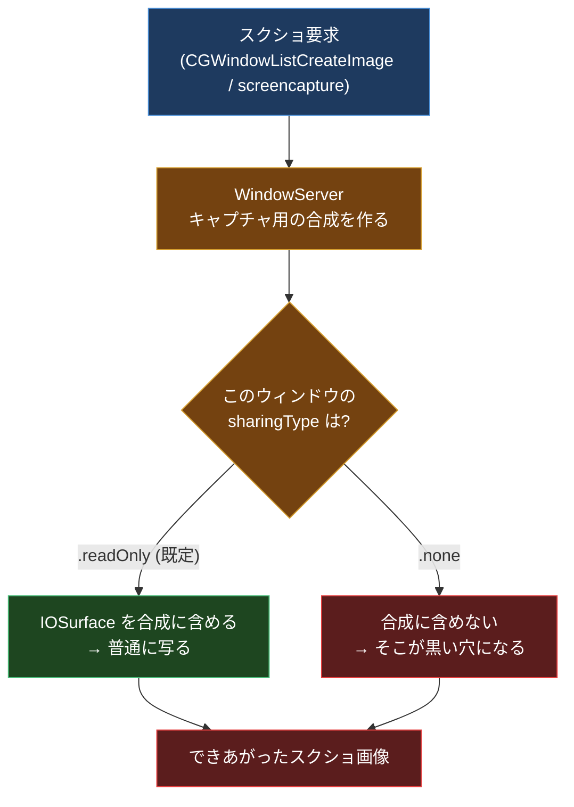
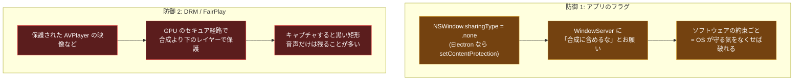
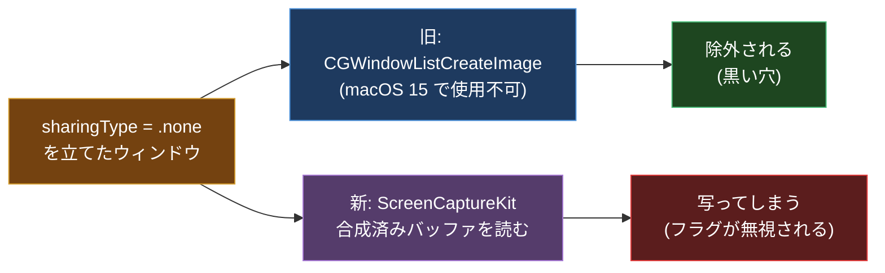
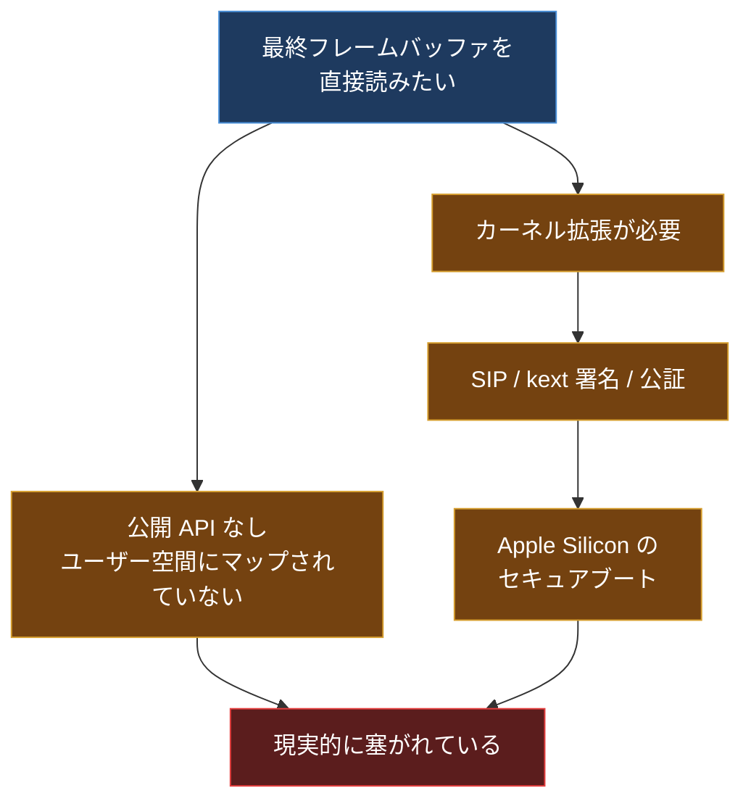
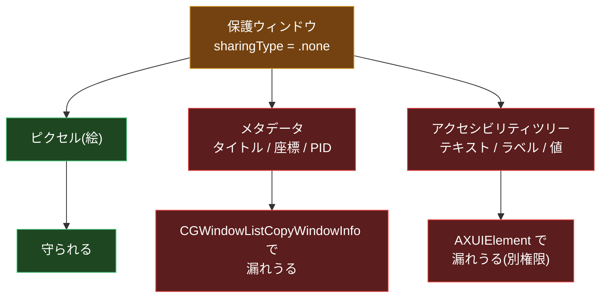
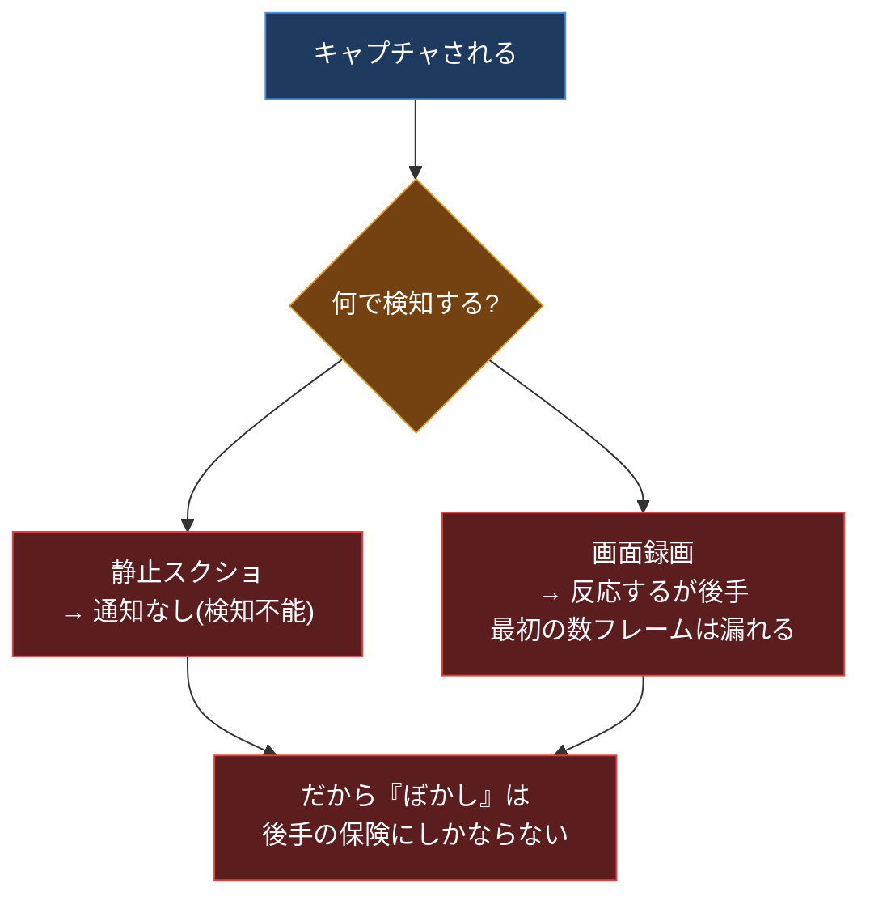
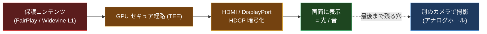
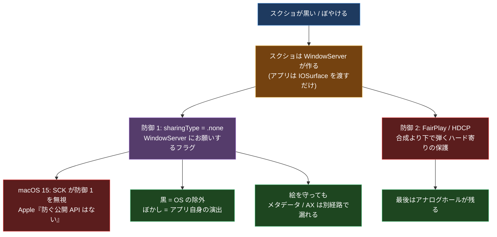

## はじめに

スクショを撮ったら、中身が真っ黒だった。あるいは、全体がぼやけて何も判別できない画像が保存された。動画配信アプリでも、一部のネイティブアプリでも、これに出くわしたことがある人は多いと思う。

最初に気持ち悪いと思ったのはここだ。**スクショ自体は成功している**。ファイルはちゃんと保存される。サイズもある。なのに、特定のウィンドウの中身だけが抜け落ちている。アプリは自分の絵を画面に描けているのに、キャプチャした画像にはそれが乗らない。誰が、どのタイミングで、そのピクセルを消しているのか。

この記事は、その種明かしを macOS の画面合成パイプラインまで降りて追うものだ。結論を先に言うと、macOS の「スクショ防止」には**全く別系統の 2 つの仕組み**があって、これを混同すると一生理解できない。1 つはアプリが立てる 1 個のフラグ、もう 1 つは DRM とハードウェアの世界の話だ。そして、調べていくと面白い事実に行き着く。**Apple は「スクショを防ぐ公開 API は存在しない」と公式に言い切っている**し、macOS 15 (Sequoia) ではそのフラグの前提がひっくり返ってさえいる。

前提知識(そもそもスクショは誰が作っているのか)から積むので、Cocoa や GPU が専門でなくても上から読めば追えるようにする。最後に、自分のウィンドウで挙動を確かめる Swift コードも置く。他人の保護を破る話ではなく、**防御側を自分で作って観測する**話だ。

> この記事は Apple 公式ドキュメント・Apple Developer Forums(DTS エンジニアの回答含む)・Electron / Tauri の公式ドキュメントと issue を一次情報として裏取りしている。Apple のリリースノートに明記がなく、フォーラムや issue 由来の挙動には「※フォーラム由来」と明記する。macOS のバージョンで結果が変わる箇所が多いので、最後の検証コードで自分の環境を必ず確かめてほしい。

---

## 0. 前提: スクショは「誰が」作っているのか

種明かしの前に、道具を 1 つ用意する。**1 枚のスクショ画像が完成するまでに、誰が何を持っているか**だ。ここが分かっていないと、後半の「どこで弾かれるか」が全部おまじないに見える。

macOS では、各アプリは自分のウィンドウを直接画面に描いているわけではない。流れはこうだ。

1. アプリは自分のウィンドウの中身を描いて、その結果を **IOSurface** という「プロセス間で共有できる画像バッファ」に入れる。
2. その IOSurface を **WindowServer**(内部の新しいフレームワーク名は SkyLight)というシステムプロセスに渡す。
3. WindowServer が、全アプリの全ウィンドウの IOSurface を **GPU 上で 1 枚に合成(コンポジット)** する。重なり順、影、半透明、背景ぼかしを全部ここで処理する。
4. 合成された 1 枚が **フレームバッファ** に書かれ、ディスプレイがそれを表示する。



ここで一番大事な事実はこれだ。**アプリ自身はスクショを作らない。** スクショを作るのは、アプリではなく WindowServer 側だ。スクショ API は WindowServer に「いまの画面(または特定ウィンドウ)を 1 枚ちょうだい」とお願いする。

つまり、**保護したいアプリにできることは「WindowServer に、自分のピクセルをキャプチャ用の絵に含めないでくれ」とお願いすること**だけだ。アプリが自力でスクショ画像を黒く塗りつぶしているわけではない。この「お願いする」という構造が、これから出てくる全部の鍵になる。

---

## 1. キャプチャ API は誰が、どうやって絵をもらうのか

スクショや画面録画を作る側の API も見ておく。macOS には世代がある。

- **`CGWindowListCreateImage`**(旧世代): 「このウィンドウの絵を 1 枚ください」と同期的に WindowServer に頼む昔の API。`screencapture` コマンドや古い録画もこの系統。**macOS 14 で deprecated、macOS 15.0 で完全に使用不可(obsoleted)** になった。15 の SDK でビルドすると `'CGWindowListCreateImage' is unavailable: obsoleted in macOS 15.0 - Please use ScreenCaptureKit instead.` というエラーになる。
- **ScreenCaptureKit (SCK)**(新世代、macOS 12.3+): 現行の正式ルート。`SCStream` で連続フレームを、`SCScreenshotManager.captureImage` で 1 枚を取る。どちらも IOSurface ベースで効率がよい。
- メタデータ専用: `CGWindowListCopyWindowInfo` は**ピクセルではなくウィンドウの一覧・タイトル・座標・所有 PID** を返す。これは今も deprecated になっていない(後半で効いてくる)。

新世代の ScreenCaptureKit はだいたいこういう部品でできている。

| 部品 | 役割 |
| --- | --- |
| `SCShareableContent` | キャプチャ可能なディスプレイ / ウィンドウ / アプリの一覧 |
| `SCDisplay` / `SCWindow` / `SCRunningApplication` | 一覧に出てくる個々の対象 |
| `SCContentFilter` | 何を撮るか / 何を除外するかの指定 |
| `SCStream` | 連続フレーム(録画)の取得 |
| `SCScreenshotManager.captureImage` | 1 枚の静止画(旧 `CGWindowListCreateImage` の代替) |
| Screen Recording (TCC) 権限 | これがないとそもそも撮れない |

ポイントは、**どの API も最終的には WindowServer から絵をもらう**ということ。アプリが直接ディスプレイのフレームバッファを読むわけではない。だから「キャプチャを止める関所」は、必ず WindowServer とキャプチャ API のあいだのどこかにある。

---

## 2. 防御その 1: `NSWindow.sharingType = .none` という 1 個のフラグ

ここからが本題。アプリが「俺のウィンドウをキャプチャに含めるな」とお願いする一番素直な方法が、AppKit の `NSWindow.sharingType` だ。これは列挙型(`NSWindow.SharingType` / Obj-C では `NSWindowSharingType`)で、値は 3 つ。

| Swift | Obj-C | 生値 | 意味 |
| --- | --- | --- | --- |
| `.none` | `NSWindowSharingNone` | 0 | 他プロセスからウィンドウ内容を読めない |
| `.readOnly` | `NSWindowSharingReadOnly` | 1 | 他プロセスは読めるが書けない(既定値) |
| `.readWrite` | `NSWindowSharingReadWrite` | 2 | 読み書き両方(古くから非推奨) |

**既定値は `.readOnly`**。だから普通のウィンドウは録画にもスクショにも普通に写る。ここを `.none` に変えると、(昔の世代では)そのウィンドウがキャプチャから除外された。コードはたった 1 行だ。

```swift
window.sharingType = .none
```

たったこれだけで、`CGWindowListCreateImage` 系のスクショからウィンドウが消える。アプリが画像を黒塗りしているのではなく、**WindowServer がキャプチャ用の合成を作るときに、このフラグの立ったウィンドウの IOSurface を混ぜない**。だから結果として、そこだけ穴が空いた(黒い)絵になる。

ただし、昔から AppKit のヘッダにはこういう警告が書かれていた。

> `.none` にするとキャプチャされなくなる代わりに、そのウィンドウは「いくつかのシステムサービスに参加できなくなる」ので注意して使え。

つまり「キャプチャに出さない」は「OS の他の便利機能からも切り離される」と表裏一体だった、ということ。

---

## 3. どこで弾かれているのか(関所の位置)

`.none` を立てたとき、スクショが黒くなる理由を関所の位置で見る。旧世代の流れはこうだ。



重要なのは、**関所は WindowServer 側にある**こと。スクショを撮るアプリ(あなたの `screencapture`)のコードをどういじっても、WindowServer がそのウィンドウを合成に入れない以上、絵は手に入らない。そして WindowServer は SIP(System Integrity Protection)に守られたシステムプロセスなので、外からコードを注入してこの判断を書き換える、という手も塞がれている。

「ユーザー空間の正規ルートでは原理上撮れない」というのは、この構造から来ている。アプリでもキャプチャ側でもなく、**両者の上に立つ WindowServer が判定者**だからだ。

---

## 4. 混同するな: 全く別系統の 2 つの防御

ここで一番大事な整理をする。ネット上の議論が混乱しているのは、**性質の違う 2 つの仕組みを 1 つだと思っている**からだ。



違いを表で押さえる。

| 観点 | 防御 1: `sharingType` フラグ | 防御 2: FairPlay / DRM |
| --- | --- | --- |
| 誰が立てるか | 普通のアプリが 1 行で | コンテンツ配信側 + Apple の経路 |
| どこで弾くか | WindowServer の合成段 | GPU のセキュア経路(合成より下) |
| キャプチャ結果 | 穴(黒)になる | 黒い矩形、音声は残ることが多い |
| 強度 | ソフトの約束ごと(後述の逆転あり) | ハードウェア寄りで堅い |
| 例 | パスワード系アプリ、機密表示 | Netflix / Apple TV+ などの配信映像 |

防御 2(DRM)が堅いのは、関所が WindowServer の合成より**さらに下**にあるからだ。保護された映像フレームは、そもそも普通の合成パイプラインに乗らない GPU のセキュアな経路を通る。だから配信映像のスクショは、いまの macOS でも変わらず黒い矩形になる。一方、防御 1 は次の章で見るとおり、前提が崩れる場面がある。

---

## 5. macOS 15 で起きた逆転と、Apple の公式回答

ここが今いちばん面白いところ。**防御 1 の `sharingType = .none` は、新世代の ScreenCaptureKit では効かなくなった**という報告が、macOS 15 (Sequoia) で複数上がっている。

理由として説明されているのはこうだ。`CGWindowListCreateImage`(旧世代)は `sharingType` を見てウィンドウを除外していた。だが ScreenCaptureKit は、**WindowServer が全ウィンドウを 1 枚に合成したフレームバッファをそのまま読む**設計で、「フラグやウィンドウレベルに関係なく」全部が乗った絵を取ってくる。結果として、`.none` を立てても SCK で撮ると中身が写ってしまう。Electron の `setContentProtection`(内部的にこのフラグを使う)も同じく効かなくなった。



そして決定的なのが、Apple 自身の回答だ。Apple Developer Forums で「`sharingType` を `.none` にしても ScreenCaptureKit のキャプチャに出てしまう(macOS 15.4+)」と質問した開発者に対し、Apple の DTS(Developer Technical Support)エンジニアがこう答えている。

> At this time there are no public APIs for preventing screen capture.
> (現時点で、スクリーンキャプチャを防ぐ公開 API は存在しない。)

そして「必要なら Feedback Assistant で機能要望を出してくれ」と続く。Electron の公式ドキュメントも、いまや `setContentProtection` の説明にこの注意書きを載せている。

> Unfortunately, due to an intentional change in macOS, newer Mac applications that use ScreenCaptureKit will capture your window despite `win.setContentProtection(true)`.

ここから言えるのは、**防御 1 はもともと「ソフトの約束ごと」でしかなかった**ということ。OS のキャプチャ実装が変われば、約束は守られなくなる。本当に堅いのは、約束ではなくハードウェアで弾く防御 2 のほうだ。これが、配信アプリが黒くなり続ける一方で、パスワードマネージャが「確実なスクショ防止」を実装できずにいる理由でもある。

> ※「SCK が単一の合成バッファを読むから `sharingType` を無視する」という**仕組みの説明**は、Tauri issue #14200 や Electron のドキュメント・コミュニティ由来であって、Apple がその言葉で公式に述べたものではない。Apple が公式に述べているのは「防ぐ公開 API はない」という結論のほう。また、ストリーム構成によって挙動が変わるという報告もある(SCK のサンプルアプリでは除外されるが QuickTime では写る、など)。

### ついでの注意: macOS 15 の録画許可プロンプト

macOS 15 では、画面録画を使うアプリに対して**定期的に許可を再確認するプロンプト**が出るようになった(当初ベータでは週次、反発を受けて製品版ではおおむね月次程度に緩和)。これは「ユーザーに録画の同意を取り直す」仕組みで、ここまで話してきた「アプリが自分を守る」`sharingType` とは**別物**だ。混同しないこと。

---

## 6. なぜ「最終フレームバッファを直接読む」が難しいのか

「WindowServer が合成した最終フレームバッファには、保護ウィンドウも含めた全部の絵が乗っているはずだ。じゃあそこを直接読めば全部撮れるのでは?」と考えるのは自然だ。実際、SCK が効いてしまうのはまさにこの理屈による。だが、**自分でその最終フレームバッファを読む**のは別の難しさがある。

- 表示される絵は **GPU のメモリ** から直接出力されていて、そのメモリは普通のユーザー空間プロセスにマップされていない。
- 公開された、権限なしで使える「ディスプレイのスキャンアウトバッファを読む API」は存在しない。キャプチャは必ず WindowServer 経由の正規 API に仲介される(だからこそ TCC 権限や DRM 除外をそこで強制できる)。
- Apple Silicon は **ユニファイドメモリ**(CPU と GPU が同じ RAM を共有)だが、それでも表示用バッファに勝手に触れるわけではない。
- もっと下、カーネルレベルで GPU やディスプレイのメモリに触ろうとすると、**SIP**、**kext の署名・公証**、Apple Silicon の固められたブート/セキュリティモデルに阻まれる。



要するに、「合成済みの絵はどこかに必ず存在する」は正しいが、**そこに正規ルート以外で触る手段が現代の Mac ではほぼ残っていない**。SCK のように OS が用意したルートが偶然フラグを無視してくれる、というのはあっても、自前でフレームバッファを掴むのは別次元の壁になる。

---

## 7. 漏れる情報: ピクセルは守れても「意味」は別経路

ここで、冒頭の「ぼやけた画像なのにタイトル文字だけ読めた」現象につながる話をする。`sharingType` が支配しているのは **ピクセルの共有** であって、**それ以外の情報ではない**。

- **ウィンドウのメタデータ**: `CGWindowListCopyWindowInfo` は deprecated になっておらず、保護ウィンドウについても**一覧・タイトル・座標・所有 PID** を返す。つまり、絵は撮れなくてもウィンドウの存在・タイトル・位置は漏れうる。
- **アクセシビリティツリー**: `AXUIElement` の API は別サブシステムで、**Accessibility の TCC 権限**で守られていて、`sharingType` とは無関係。`sharingType = .none` がアクセシビリティツリーを抑制する、という挙動は Apple のドキュメントに書かれていない。つまり、ピクセルキャプチャから守られたウィンドウでも、Accessibility 権限を持つアプリにはテキストやラベルや値が見えうる。



> ※「メタデータやアクセシビリティが `.none` でも漏れる」は、各 API の権限スコープが別であることからの推論で、Apple が 1 文で保証しているわけではない。ただし「`sharingType` がアクセシビリティに効く」という記述がどこにも無いこと自体が、この推論を支えている。

ピクセルだけ守ってメタデータや AX を放置していると、こういう部分的な漏れが起きる。これは破る側のテクニックというより、**防御設計の穴**の話だ。守る側を作るなら、ここを自分で点検すべきポイントになる。

---

## 8. なぜ「黒」ではなく「ぼやける」のか

冒頭の例で気になるのが、**真っ黒ではなく「ぼやけた」**という点だ。ここは結構大事な区別がある。

**OS レベルの除外(`sharingType = .none` や iOS の secure layer)が作るのは「黒」または「空白」であって、「ぼかし」ではない。** ぼかしは OS が勝手にかけてくれる効果ではなく、**アプリが自分で描いている**と考えるのが基本だ。つまり、ぼやけたスクショが撮れたなら、そのアプリは「キャプチャされそうな状況」を検知して、自分の中身をぼかしたプレースホルダに描き替えている可能性が高い。

ここで macOS の意地悪な事実が効いてくる。**macOS には「自分が今キャプチャされているか」をきれいに知る公開 API がない。**

- `NSWindow.isCaptured` は **存在しない**。それは iOS / UIKit の `UIScreen.isCaptured` であって、AppKit にはない(よくある勘違い)。
- `NSWindow.occlusionState` / `windowDidChangeOcclusionState` は「他ウィンドウに隠れて見えているか」という**可視性**を返すだけで、キャプチャの有無とは無関係。録画中でも前面にあれば `.visible` のまま。
- 静止スクショ(Shift-Cmd-4 など)に対しては、そもそも**何の通知も飛ばない**。録画に対しては反応する手段もあるが、**最初の数フレームが撮られた後**にしか分からない(Apple Developer Forums の実測報告)。Teams のような共有アプリでは通知が来ないこともある。



ということは、ぼやけたスクショの正体はだいたいこのどれかになる。

- **(a) アプリが何らかのトリガ(フォーカス喪失・隠蔽検知など)で中身をぼかしに差し替えている**。それをキャプチャが忠実に写しているだけ。一番ありがち。
- **(b) アプリが常時ぼかしを表示し、本物はキャプチャ非対象の経路でだけ見せている**。ただしこの「非対象経路」は普通は黒を作るので、純粋なぼかしにはなりにくい。
- **(c) OS が録画検知でぼかす公開機能**。これは存在しない。そういう主張は疑ってよい。

そして「ぼやけてるのにタイトル文字だけくっきり」だったなら、第 7 章の話と合わさって筋が通る。アプリは**メインの中身レイヤーだけをぼかしに差し替え、タイトルラベルは差し替え忘れている**(あるいは別レイヤーなのでぼかしの対象外)。ピクセル保護とぼかし差し替えの両方に、レイヤー単位の穴がある、というわけだ。

> 余談だが、Shift-Cmd-5 のスクショ UI は `screencaptureui` というシステムデーモンが担当していて、撮った画像を一旦 `/var/folders/.../T/TemporaryItems/NSIRD_screencaptureui_XXXX/` のような一時フォルダに書き出してから保存先に移す。Trash に空の `NSIRD_screencaptureui_*` が出てくることがあるのはこの後始末で、マルウェアではない。

iOS 側の「黒」の作り方も触れておくと有名なテクニックがある。`UITextField.isSecureTextEntry = true` のフィールドは、中身がキャプチャ対象外の secure layer に描かれる。そこへ自分のビューを潜り込ませると、**ピクセルがキャプチャから抜ける(=黒くなる)**。`ScreenShieldKit` などの OSS は CALayer の非公開フラグ `disableUpdateMask` を使って同じことをやる。いずれも**結果は黒であってぼかしではない**。ぼかしはあくまでアプリの演出だ、というのがここでの結論。

---

## 9. DRM・HDCP・アナログホール

防御 2 の世界も見ておく。配信映像のような「本気の保護」は、ソフトのフラグではなくここに乗っている。

- **HDCP**(High-bandwidth Digital Content Protection): HDMI / DisplayPort などのケーブル上で映像を暗号化する仕組み。受け側と暗号ハンドシェイクが成立しないと映像が出ない(または品質が落ちる)。macOS は Apple Music / TV アプリ / QuickTime / Safari の FairPlay 再生でこれを使う。
- クライアント側の公開シグナルは `AVPlayerItem.outputObscuredDueToInsufficientExternalProtection`(読み取り専用 `BOOL`、KVO 可)。非 HDCP な外部ディスプレイにつないだ時などに `true` になり、プレイヤーは出力を隠す。なお `AVPlayer` に公開の `requiresHDCP` プロパティは無く、HDCP の強制レベルはサーバ側(FairPlay の鍵応答や HLS の属性)で決まる。
- **third-party の限界**: Apple は HDCP を engage/検知する API を非 Apple アプリに公開していない。だから自作プレイヤーは、Apple 純正が動く外部ディスプレイ構成でも HDCP エラーになることがある。

DRM のスクショが黒くなるかどうかは、実は**保護の強度レベル**で変わる。Web の DRM(EME 経由の Widevine など)を例にとると分かりやすい。

| レベル | 復号と描画の場所 | スクショ結果 |
| --- | --- | --- |
| L1 | 鍵・復号・ピクセルすべて TEE(セキュア領域) | 黒(HD/4K はこれが必須) |
| L2 | 鍵はハードウェア、復号ピクセルは通常メモリに出うる | 環境次第 |
| L3 | 全部ソフトウェア(デスクトップ Chrome など)、~480/720p 上限 | **低解像度なら撮れてしまうことがある** |

ここがよく誤解される。**「DRM = 必ず黒」ではない。** ハードウェアのセキュア経路(L1)が効いて初めて黒くなる。デスクトップブラウザのソフトウェア再生(L3)はピクセルが守られておらず、低画質ならスクショが成功することがある。「ブラウザだとなぜか撮れた」はだいたいこれだ。

そして最後に残るのが**アナログホール**。どんなデジタル保護をかけても、最終的に映像は光、音は空気の振動になる。それを別のカメラやマイクで撮り直すことはどうやっても防げない。HDCP はデジタルのケーブル経路を固めるだけで、この最後の穴は塞げない。



身も蓋もないが、**保護の強度がいくら上がっても、アナログホールだけは原理的に閉じない**。逆に言えば、防御を設計する側がアナログホールまで塞ごうとするのは筋が悪い、ということでもある。

---

## 10. 他の OS はどうやっているか(比較)

macOS だけ見ていると「ウィンドウ単位のキャプチャ保護は脆い」と思いがちだが、他の OS と比べると macOS の現状はむしろ**例外的に緩い**。同じ「アプリがフラグを立てる → コンポジタが除外する」という構図でも、どの捕捉経路まで守られるかが OS で違う。

| OS / 環境 | API・フラグ | キャプチャ結果 | 現代の捕捉経路で守られるか |
| --- | --- | --- | --- |
| macOS | `NSWindow.sharingType = .none` | 旧経路は黒、SCK は素通り | **守られない**(macOS 15+ で SCK が無視) |
| Windows | `SetWindowDisplayAffinity(WDA_EXCLUDEFROMCAPTURE)` | 完全に非表示(黒い矩形すら出ない) | **守られる**(Graphics Capture API でも除外) |
| Android | `WindowManager.LayoutParams.FLAG_SECURE` | 黒/空白、Recents や非セキュア出力からも除外 | **守られる** |
| Web | フラグではなく DRM(EME + CDM) | L1 は黒、L3 は撮れることも | コンテンツ経路次第 |

押さえどころ。

- **Windows が一番堅い**。`WDA_EXCLUDEFROMCAPTURE`(値 `0x11`、Windows 10 version 2004 で追加)は、DWM が**現代の Graphics Capture API に対しても**ウィンドウを除外する。`WDA_MONITOR`(黒い矩形は残る)より強く、対象ウィンドウは録画に**1 ピクセルも出ない**。古い Windows では自動的に `WDA_MONITOR` 相当に落ちる。
- **macOS は逆に、現代の経路(SCK)で守られない**。同じことを Electron の `setContentProtection` で書いても、Windows では `WDA_EXCLUDEFROMCAPTURE` にマップされて効くが、macOS では `sharingType=.none` にマップされて macOS 15+ では効かない。**1 個の API が OS によって強さが真逆**になる、というのが面白い。
- **Android の `FLAG_SECURE`** は SurfaceFlinger(コンポジタ)が強制し、スクショ・録画・Recents サムネ・ミラーリングまで止める。ただし Android 自身のドキュメントも「セキュリティ機能ではない」と明言している。
- ただし Microsoft も Android も、ドキュメントで**「これは DRM やセキュリティ保証ではない」**とはっきり書いている。どの OS でも、守れるのは「キャプチャ画像への写り込み」だけで、アナログホール・アクセシビリティ・元データそのものは守れない。

つまり**共通構造は全 OS で同じ**(アプリがフラグ → コンポジタが除外)で、違うのは「どの捕捉 API までコンポジタが面倒を見るか」だけ。macOS はそのカバー範囲が現状いちばん狭い、というのが客観的な評価になる。

---

## 11. 自分のウィンドウで確かめる(検証コード)

ここまでの話を、**自分が作ったウィンドウ相手に**手で確かめる。他人の保護を破るのではなく、防御側と観測側を両方自分で持てば、得られる知見は対象が何であっても変わらない。これがいちばん安全で、いちばん学べる。

### 被験側: `sharingType = .none` のウィンドウを立てる

まず「守られる側」を作る。SwiftUI なら、ウィンドウが出た後に `NSWindow` を捕まえてフラグを立てるのが手軽だ。

```swift
import SwiftUI
import AppKit

@main
struct ProtectedDemoApp: App {
    var body: some Scene {
        WindowGroup {
            ContentView()
                .frame(width: 400, height: 200)
                .background(WindowConfigurator())
        }
    }
}

struct ContentView: View {
    var body: some View {
        Text("SECRET-12345")
            .font(.system(size: 40, weight: .bold, design: .monospaced))
            .padding()
    }
}

// 出てきた NSWindow を捕まえて sharingType を切り替える
struct WindowConfigurator: NSViewRepresentable {
    func makeNSView(context: Context) -> NSView {
        let v = NSView()
        DispatchQueue.main.async {
            if let win = v.window {
                win.sharingType = .none   // ← ここが防御の本体
                win.title = "Protected Window"
            }
        }
        return v
    }
    func updateNSView(_ nsView: NSView, context: Context) {}
}
```

これを起動した状態で、まず OS 標準のスクショ(Shift-Cmd-4 など、旧経路寄り)を撮ってみる。`SECRET-12345` が黒く欠けるか、写ってしまうか。**macOS のバージョンで結果が変わる**のがこの記事の山場なので、自分の環境で確かめてほしい。

### 観測側: ScreenCaptureKit で撮ってみる

次に「撮る側」を SCK で書いて、同じウィンドウを撮る。ここで `sharingType = .none` が無視されるか(= 中身が写るか)を見る。

```swift
import ScreenCaptureKit
import AppKit

// 注意: Screen Recording の TCC 権限が要る。
// 初回実行時にシステム設定で許可してから再実行する。
func captureProtectedWindow(titleContains: String) async throws {
    let content = try await SCShareableContent.current

    // タイトルで被験ウィンドウを探す(メタデータは保護されないので名前で引ける)
    guard let target = content.windows.first(where: {
        ($0.title ?? "").contains(titleContains)
    }) else {
        print("対象ウィンドウが見つからない")
        return
    }

    // メタデータが漏れることの確認: 絵が撮れなくてもここは取れる
    print("見つけた: title=\(target.title ?? "nil") "
        + "frame=\(target.frame) app=\(target.owningApplication?.applicationName ?? "?")")

    let filter = SCContentFilter(desktopIndependentWindow: target)
    let config = SCStreamConfiguration()
    config.width = Int(target.frame.width)
    config.height = Int(target.frame.height)

    // 1 枚だけ撮る(macOS 14+)
    let image = try await SCScreenshotManager.captureImage(
        contentFilter: filter, configuration: config)

    // ファイルに保存して、SECRET-12345 が写っているか目視する
    let rep = NSBitmapImageRep(cgImage: image)
    if let png = rep.representation(using: .png, properties: [:]) {
        let url = URL(fileURLWithPath: "/tmp/sck-capture.png")
        try png.write(to: url)
        print("保存: \(url.path)")
    }
}
```

この 2 本を回すと、次の 3 つが同時に観測できる。

1. 旧経路のスクショで `.none` が効くか(欠けるか)。
2. ScreenCaptureKit で `.none` が無視されるか(写るか)。※フォーラム報告の再現確認。
3. 絵が撮れても撮れなくても、`SCWindow.title` や `frame` といった**メタデータは取れてしまう**こと。

得られるのは「macOS で原理上できること / できないことの境界」を**自分の資産の中で**実測した結果になる。対象が自作ウィンドウなので、法的にもクリーンだ。

---

## 12. 法律の話(短く、正確に)

技術が分かると「他人の保護されたコンテンツでも試したくなる」が、ここは線を引いておく。一般論として、**他人の商用コンテンツの技術的保護を回避する行為**は規制対象になりうる。

- **米国 DMCA §1201**: アクセス制御の回避(§1201(a))と、保護回避ツールの提供(§1201(b))を禁止。**実際の著作権侵害が無くても「鍵を破る行為」自体が違法になりうる**のが特徴。リバースエンジニアリング(f)、暗号研究(g)、セキュリティテスト(j)などの例外と、3 年ごとの一時的例外指定がある。
- **日本**: 2 つの法律に分かれている。**著作権法**が「技術的保護手段」(コピーコントロール寄り)を、**不正競争防止法**が「技術的制限手段」(アクセスコントロール寄り)を扱う。後者は 2018 年改正で回避ツールの提供などへ範囲が広がった。米国が §1201 に一本化しているのに対し、日本は 2 法に分かれているのが構造的な違い。

これは法的助言ではなく一般的な背景だ。**自作アプリの保護機構を研究する、自分が権利を持つ画面を撮る、アクセシビリティ用途、認可されたペネトレ対象**、といった範囲なら問題にならない。第 11 章の検証はすべてこの範囲に収まるように作ってある。

---

## まとめ

上から読んできた流れを 1 枚にする。



要点はこれだけだ。

1. **スクショを作るのはアプリではなく WindowServer**。だからアプリにできるのは「お願い」だけ。
2. **防御は 2 系統**。`sharingType` フラグ(ソフトの約束)と、FairPlay/HDCP(ハード寄りで堅い)。混同しない。
3. **フラグは約束でしかない**。macOS 15 で ScreenCaptureKit が無視し、Apple 自身が「防ぐ公開 API はない」と明言している。本当に堅いのは合成より下で弾く DRM のほう(ただし L1 のときだけ黒)。
4. **「黒」と「ぼかし」は別物**。黒は OS の除外、ぼかしはアプリ自身の演出。macOS には「撮られているか」を知る公開 API がないので、ぼかしは後手の保険にしかならない。
5. **ピクセルを守ってもメタデータと AX は別経路**。冒頭の「タイトルだけ漏れた」はこれ。
6. **他 OS と比べると macOS のカバー範囲は今いちばん狭い**。Windows の `WDA_EXCLUDEFROMCAPTURE` は現代の捕捉経路でも効く。
7. **アナログホールは原理的に閉じない**。

防御を理解する一番の近道は、攻める側ではなく**守る側を自分で実装して、それを自分で観測すること**だ。第 11 章のコードを動かして、自分の macOS で `.none` が効くのか効かないのかを、まず自分の目で確かめてほしい。
