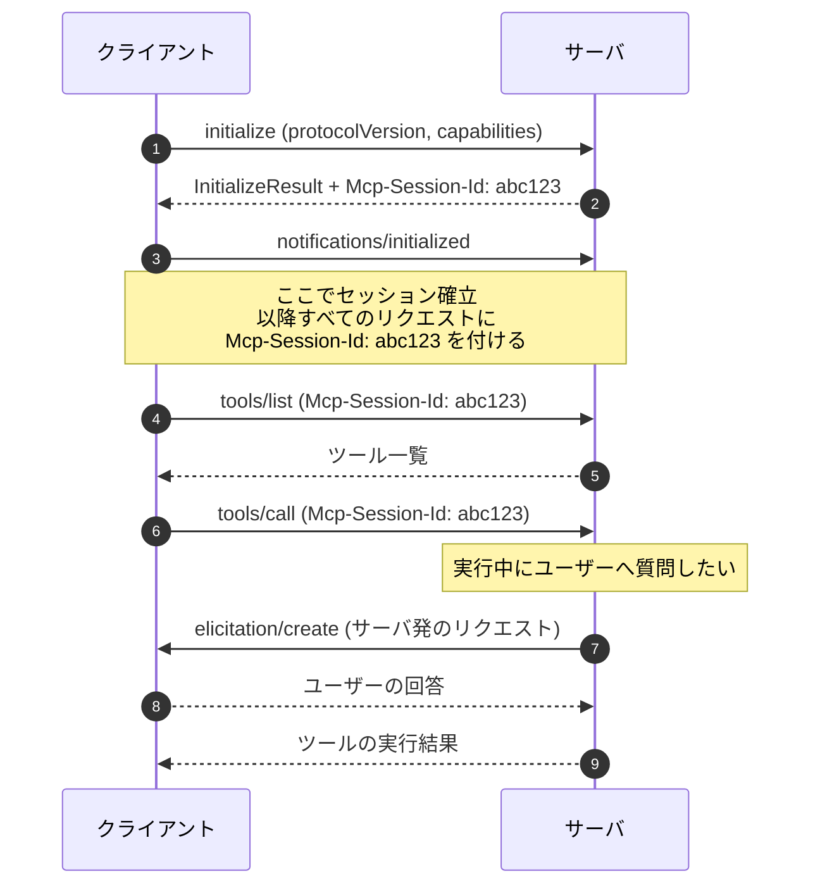
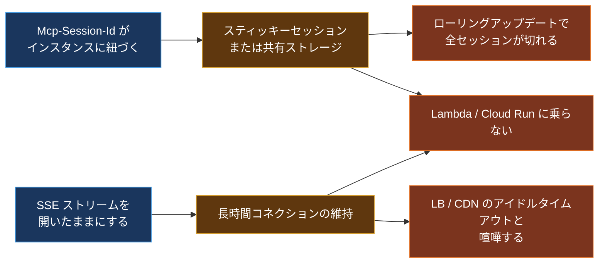
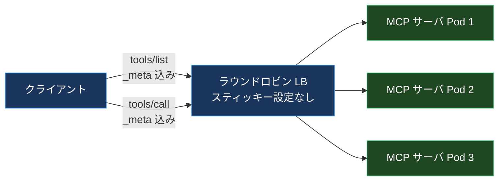
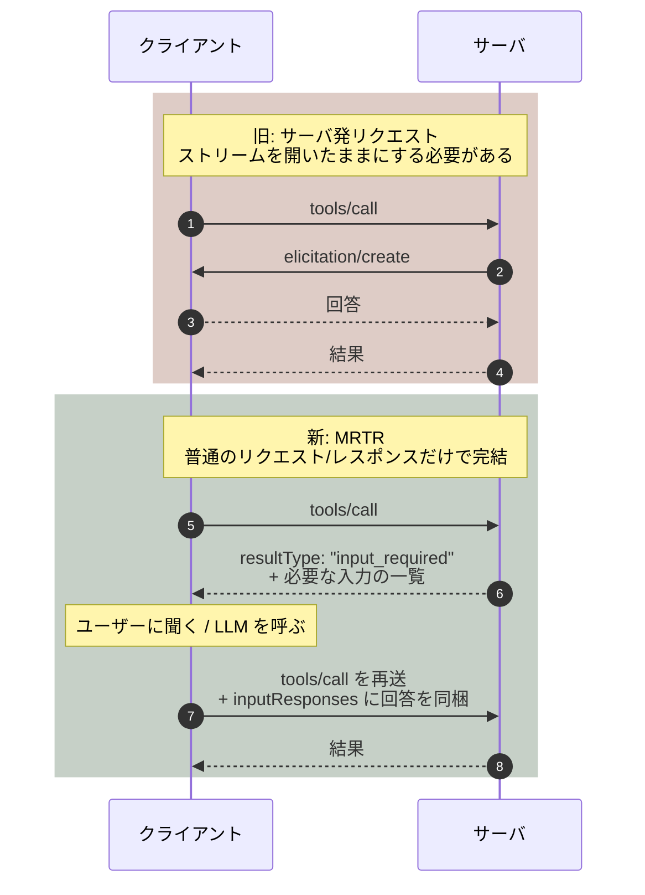
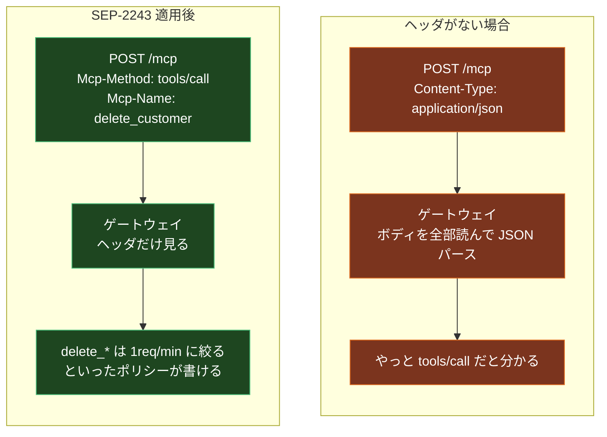
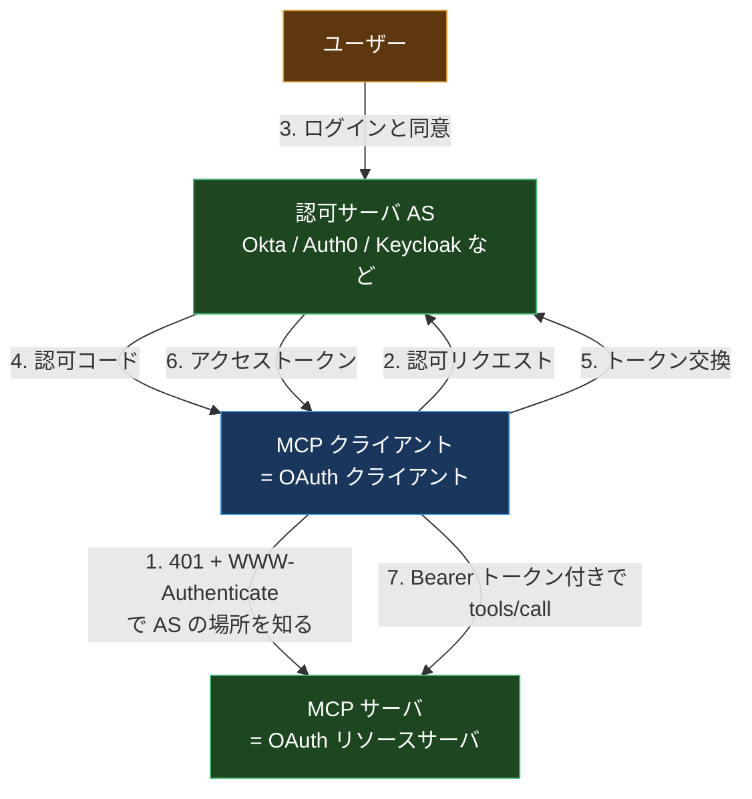
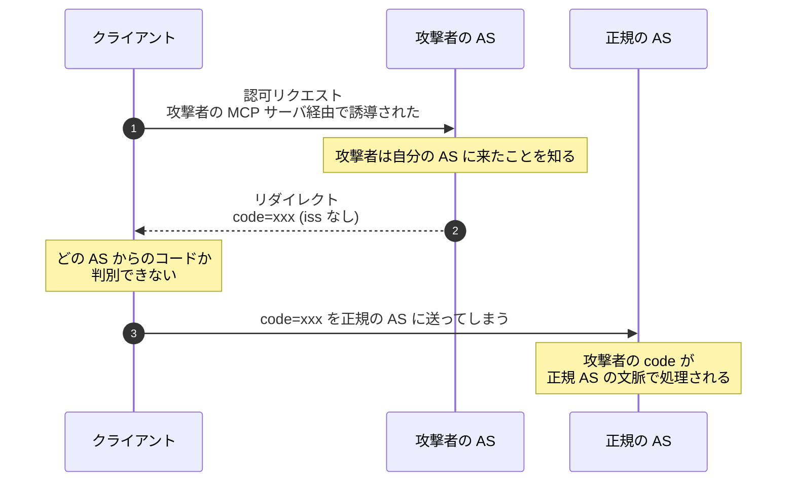
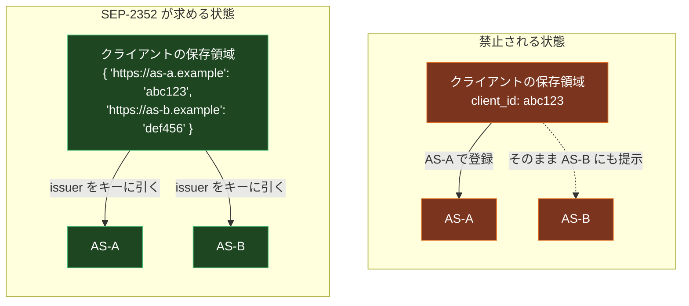
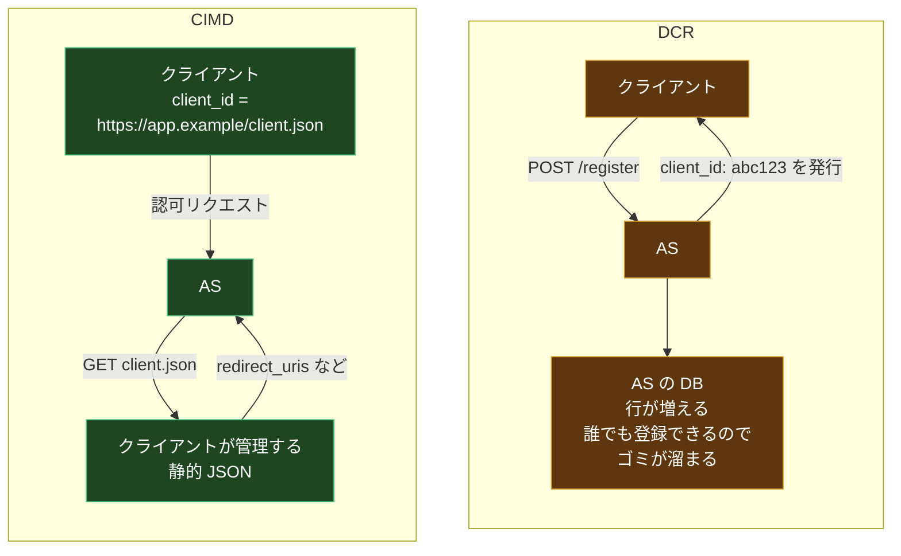

MCP サーバを本番に置こうとして、最初につまずくのはたいていここだ。

Pod を2つに増やしてロードバランサの後ろに置く。ローカルでは完璧に動いていたクライアントが、いきなり `Session not found` を返しはじめる。ログを見ると、`initialize` を処理したのは Pod A なのに、次の `tools/call` が Pod B に飛んでいる。

対処法は昔から決まっていた。スティッキーセッションを有効にする。あるいは Redis にセッションを外出しする。どちらも「MCP のためだけに」インフラ側の設定を1つ増やす作業で、やるたびに「なんでチャットの API サーバがこんなことになってるんだ」と思っていた。

2026年7月28日にリリースされた MCP の新しい仕様は、この問題を根本から消しにきた。`initialize` ハンドシェイクも `Mcp-Session-Id` ヘッダも、仕様から削除された。リード メンテナの David Soria Parra は「認可を追加して以来、おそらく最大の変更」と表現している。「MCP を MCP たらしめていたものの多くが消えた」とも。

そして同じリリースで、認可まわりも6本の SEP でまとめて作り直された。こちらの変更は地味だが、エンタープライズで MCP サーバを公開するなら避けて通れない。

この記事は、MCP をまだ触ったことがない人でも上から読めるように書く。まず旧仕様が何をしていたのかを整理して、それが運用で何を強いていたのかを見て、そのうえで新仕様が何をどう置き換えたのかを追う。

## 前提1: MCP とは何を運ぶプロトコルなのか

MCP (Model Context Protocol) は、LLM アプリケーションと外部のツール / データを繋ぐためのプロトコルだ。Anthropic が2024年11月に公開し、いまは Linux Foundation 傘下の Agentic AI Foundation (AAIF) がホストしている。

登場人物は3つ。

- **ホスト**: Claude Desktop や IDE など、ユーザーが触るアプリ
- **クライアント**: ホストの中にいて、MCP サーバと1対1で喋る部分
- **サーバ**: 実際のツール (ファイル読み書き、GitHub API、社内 DB など) を提供する側

やりとりは JSON-RPC 2.0 で行われる。クライアントが `tools/list` を投げるとサーバが使えるツールの一覧を返し、`tools/call` を投げるとサーバがツールを実行して結果を返す。これだけなら普通の RPC で、何も難しくない。

問題は、MCP がそれ以上のことをやろうとしていた点にある。

## 前提2: 旧仕様の「ステートフル」は何を指していたのか

2025-11-25 版までの MCP には、明確な「セッション」の概念があった。

ポイントは2つある。

1つめは **`Mcp-Session-Id`**。`initialize` を処理したサーバインスタンスがセッション ID を発行し、以降のリクエストはその ID を持って戻ってこないといけない。つまり **セッション ID とサーバインスタンスが暗黙に結びついている**。冒頭のロードバランサ問題はここから来ていた。

2つめは **サーバ発のリクエスト**。上の図の 8 番、`elicitation/create` に注目してほしい。これはサーバがクライアントに向かって投げるリクエストで、「ツールを実行する途中でユーザーに確認を取りたい」といった用途に使う。似たものに `sampling/createMessage` (サーバがクライアント側の LLM を呼ぶ) と `roots/list` (サーバがクライアントのファイルシステム境界を尋ねる) があった。

サーバからクライアントへリクエストを投げるには、**双方向に開いたままの通信路**が必要になる。MCP はこれを Streamable HTTP の中で SSE ストリームを張りっぱなしにすることで実現していた。

この2つを合わせると、こういう構造になる。

左が仕様の要求、真ん中がそれを満たすために強いられる作業、右が実際に踏む地雷。**仕様の2行が、インフラ側の設定を3つ増やしていた。**

「開いたままのストリーム」が問題の中心にいる。これがあるせいで、MCP サーバは普通の HTTP API として扱えなかった。

## 2026-07-28 で何が消えたか

新仕様は、この構造を丸ごと捨てた。

- **SEP-2575 / SEP-2567**: `initialize` / `notifications/initialized` の交換と `Mcp-Session-Id` ヘッダを削除
- 各リクエストは **自己記述的** になった。プロトコルバージョン、クライアント識別子、ケイパビリティを `_meta` フィールドに載せて毎回運ぶ
- ケイパビリティの発見は `server/discover` という **任意の** RPC に置き換わった。必須ではない

結果として、MCP サーバは「普通のラウンドロビン LB の後ろに置ける、共有ストレージ不要の HTTP サーバ」になった。

「アプリケーションレベルの状態は持てなくなったのか」というと、そうではない。ツールが返す **明示的なハンドル** を使えばいい。たとえばファイルを開くツールが `{"handle": "fh_abc"}` を返し、次の読み込みツールが `{"handle": "fh_abc", "offset": 0}` を受け取る。状態はプロトコル層ではなくアプリケーション層に置く、という整理になった。

これは REST が20年前に通った道とまったく同じ議論で、MCP がようやくそこに追いついた、と読むこともできる。

## サーバ発のリクエストはどうなったのか (MRTR)

セッションと開きっぱなしのストリームを消すと、「ツール実行中にユーザーへ質問する」ができなくなる。ここを埋めるのが **SEP-2322: Multi Round-Trip Requests (MRTR)** だ。

考え方は単純で、**サーバが要求を出すのではなく、サーバが「まだ足りない」と答える**。

サーバは「入力が要る」と一度返して接続を切る。クライアントは自分の都合で回答を集めて、同じ呼び出しを回答つきで **やり直す**。サーバ側は各リクエストが独立しているので、途中で別インスタンスに飛んでも構わない。

代償として、クライアント側の実装は少し複雑になる。`tools/call` の戻り値が「結果」か「入力要求」かを分岐しないといけない。ただ、これは OAuth の認可フローでずっとやってきたことと本質的に同じ形だ。

## ゲートウェイのためのヘッダルーティング

**SEP-2243** は、Streamable HTTP のリクエストに `Mcp-Method` と `Mcp-Name` という HTTP ヘッダを必須で載せることを決めた。

なぜこれが要るのか。JSON-RPC のメソッド名はボディの中にある。つまり、間に立つゲートウェイやレート リミッタや WAF は、**ボディをパースしないとそのリクエストが何なのか分からない**。

ツール名までヘッダに出るので、「この特定のツールだけ認可を厳しくする」「破壊的なツールだけ別のレート制限をかける」がインフラ層で書けるようになる。MCP ゲートウェイを作る側にとっては、これがいちばん大きい変更かもしれない。

## list 結果のキャッシュ

**SEP-2549** は `tools/list` / `prompts/list` / `resources/list` / `resources/read` のレスポンスに `ttlMs` と `cacheScope` を追加した。

ステートレス化すると、クライアントは接続のたびにツール一覧を取り直したくなる。それが毎回100個のツール定義を運ぶと無駄が大きい。サーバが「この一覧は5分間キャッシュしていい」と宣言できるようにして、その無駄を消す。`cacheScope` はキャッシュの共有範囲 (ユーザー単位か、グローバルか) を示す。

ステートレス化とセットで入っている理由がはっきりしている変更だ。

## ここからが認可の話: 6本の SEP に共通するテーマ

認可まわりの変更は6本の SEP にまたがっている。バラバラに見えるが、共通のテーマがひとつある。**バインディング**だ。

- レスポンスを issuer に縛る
- クレデンシャルを issuer に縛る
- クライアントが自分の種別を宣言する

順番に見ていく。その前に、MCP の認可モデルを1枚で整理しておく。

### 前提: MCP における OAuth の役割分担

2025-06-18 版以降、MCP サーバは **OAuth 2.1 のリソースサーバ** として位置づけられている。認可サーバ (AS) は別にいて、MCP サーバは自分でトークンを発行しない。

MCP サーバは RFC 9728 (Protected Resource Metadata) を使って「自分を守っている AS はこれです」と `/.well-known/oauth-protected-resource` で公開する。クライアントはそれを読んで AS に向かう。

この構造は正しいのだが、**AS が複数関わったときの挙動が曖昧だった**。6本の SEP の半分は、この曖昧さを潰しにいっている。

### SEP-2468: `iss` の検証を必須にする (RFC 9207)

OAuth には **mix-up attack** という古典的な攻撃がある。クライアントが複数の AS を扱えるとき、攻撃者が「正規の AS からのレスポンス」に見せかけて、認可コードを別の AS に持ち込ませる攻撃だ。

RFC 9207 (OAuth 2.0 Authorization Server Issuer Identification) の答えは単純で、**認可レスポンスに `iss` パラメータを必ず載せる**。クライアントは認可コードを交換する前に、`iss` が自分が投げた先の AS の issuer と一致するか検証する。一致しなければ捨てる。

SEP-2468 はこれを MCP で必須にした。AS は `iss` を返さなければならず、クライアントはコード交換の前に検証しなければならない。

### SEP-2352: クレデンシャルを発行元の issuer に縛る

これがいちばん実装に効く変更だと思う。

旧仕様では、クライアントが AS-A で動的登録して得た `client_id` を、うっかり AS-B に提示することができた。AS-B の寛容さによっては、それが通ってしまうこともあった。認証システムとして、これは持ちたくない性質だ。

SEP-2352 が要求するのはこう。

- クライアントは **AS ごとに別々の登録状態を持つ**
- 登録済みクレデンシャルは **発行した AS の issuer 値をキーにして保存する**
- 別の AS に対して再利用してはならない
- リソースが AS-A から AS-B に移った場合は、**再登録する**。古いクレデンシャルを流用しない
- AS が食い違ったらクライアントはエラーにする

実装への影響は素直で、クレデンシャルの保存を「1個のフィールド」から「issuer をキーにしたマップ」に変えることになる。

### SEP-837: `application_type` を宣言する

動的登録のとき、クライアントは OpenID Connect の `application_type` (`web` または `native`) を宣言することになった。

なぜかというと、デスクトップアプリや CLI は `http://localhost:8080/callback` のような **localhost リダイレクト URI** を使う。多くの AS は `application_type: web` を前提に「localhost は危ないので拒否」する実装になっていて、ネイティブアプリが登録できないという事故が起きていた。`application_type: native` と宣言すれば、AS は localhost を正しく許容できる。

地味だが、MCP クライアントの多くがデスクトップアプリであることを考えると効く変更だ。

### 残りの3本

- **SEP-2207**: リフレッシュトークンの扱いを明文化した。旧仕様では「使っていいのか、どう回すのか」が書かれていなかった
- **SEP-2350**: スコープの積み上げ (scope accumulation)。同じ AS に対して追加のスコープを要求していく流れを定義した
- **SEP-2351**: `.well-known` によるディスカバリの整理

### DCR から CIMD へ

そして、認可まわりで運用にいちばん響くのがこれ。**Dynamic Client Registration (DCR, RFC 7591) が正式に非推奨になり、Client ID Metadata Document (CIMD) が推奨経路になった。**

2つの違いを一言で言うと、こうなる。

| | DCR (RFC 7591) | CIMD |
| --- | --- | --- |
| `client_id` の正体 | AS が発行する不透明な文字列 | クライアントが管理する **URL** |
| 登録の実体 | AS の DB に行が1つ増える | AS がその URL を取りに行って JSON を読む |
| 事前登録 | 必要 (API 叩く) | 不要 |
| AS を変えたとき | 再登録が必要 (SEP-2352) | **そのまま使える** |
| AS 側の負担 | 登録エンドポイントとレコード管理 | HTTP GET と SSRF 対策 |
| スパム登録 | 起きる (誰でも登録できる) | 起きない (レコードが増えない) |

CIMD では `client_id` が `https://myapp.example.com/oauth-client.json` のような URL になる。AS はその URL を GET して、返ってきた JSON メタデータ (`redirect_uris`, `client_name` など) を読む。

MCP がこちらに寄せた理由は、クライアントの数と性質にある。MCP クライアントは「世界中の個人が動かすデスクトップアプリ」で、しかもユーザーが接続する MCP サーバは無数にある。DCR だと、1人のユーザーが10個の MCP サーバに繋ぐと10回登録が走り、AS 側にはゴミが溜まりつづける。CIMD なら `client_id` は URL 1つで、どの AS に対しても同じものが使える。SEP-2352 が DCR クレデンシャルに issuer バインディングを課したのと対照的に、**CIMD の `client_id` はポータブル**というのがきれいな対比になっている。

DCR も後方互換のために残るが、非推奨だ。新仕様には正式な非推奨ポリシーが入っていて、Active → Deprecated → Removed のライフサイクルと、**削除までの最低12か月**が保証される。

CIMD 自体の詳細は別の記事で書いたので、そちらも参照してほしい。ここでは「MCP が公式にこちらへ寄せた」という事実が重要だ。

## 拡張フレームワークと非推奨リスト

もうひとつの構造変更が、**拡張フレームワーク**の正式化だ。

Tasks (長時間実行される処理のハンドル) は実験的なコア機能から `io.modelcontextprotocol/tasks` という拡張に移された (SEP-2663)。ポーリング型の `tasks/get` と新しい `tasks/update` を持つ。`tasks/list` は削除された。セッションがないと「誰のタスク一覧か」を安全にスコープできないからだ。

非推奨になったもの。

| 対象 | SEP | 理由 | 猶予 |
| --- | --- | --- | --- |
| Roots | SEP-2577 | サーバ発リクエストに依存 | 最低12か月 |
| Sampling | SEP-2577 | 同上 | 最低12か月 |
| Logging | SEP-2577 | ストリームに依存 | 最低12か月 |
| HTTP+SSE トランスポート | - | 旧トランスポート | 1年 |
| DCR | - | CIMD に移行 | 将来のバージョンで削除 |

Roots / Sampling / Logging はどれも「サーバがクライアントに何かを要求する」形をしていて、ストリームがない世界では成立しない。MRTR で代替できるものは MRTR に寄せる、という整理になっている。

変更通知は `subscriptions/listen` ストリームに移り、クライアントが種別ごとに **明示的にオプトイン** する形になった。

## 移行チェックリスト

自分が MCP サーバとクライアントを両方持っていたときに実際に確認した項目を、そのまま並べておく。

**サーバ側**

- [ ] `initialize` ハンドラを消す。代わりに `server/discover` を任意で実装する
- [ ] `Mcp-Session-Id` の発行と検証を消す。セッションストアも消す
- [ ] セッションに載せていた状態を、ツールが返す明示的なハンドルに移す
- [ ] `elicitation/create` / `sampling/createMessage` を使っていたら MRTR (`resultType: "input_required"`) に書き換える
- [ ] レスポンスに `Mcp-Method` / `Mcp-Name` ヘッダを載せる (受け側の要件も確認する)
- [ ] `tools/list` に `ttlMs` / `cacheScope` を付ける
- [ ] `/.well-known/oauth-protected-resource` の内容を再確認する

**クライアント側**

- [ ] クレデンシャル保存を issuer キーのマップに変える (SEP-2352)
- [ ] 認可コード交換の前に `iss` を検証する (SEP-2468)
- [ ] 動的登録に `application_type` を載せる (SEP-837)
- [ ] 可能なら CIMD に移行する。`client_id` を URL にして静的 JSON を公開する
- [ ] `tools/call` の戻り値で `resultType: "input_required"` を分岐する
- [ ] Roots / Sampling / Logging に依存していたら代替を検討する

**インフラ側**

- [ ] スティッキーセッション設定を外せるか確認する
- [ ] SSE のアイドルタイムアウト対策 (keepalive など) を外せるか確認する
- [ ] `Mcp-Method` ヘッダを使ったルーティング / レート制限を設計しなおす

Tier 1 SDK (TypeScript, Python, Go, C#) は公開日に 2026-07-28 対応版が出ている。Rust SDK は Tier 2 でベータ。

## 互換性の注意点

ひとつ現実的な警告を書いておく。この仕様は **後方互換ではない**。

2026-07-28 版のサーバは、それ以前のクライアントと動かない可能性がある。逆も同じだ。`initialize` を投げてくるクライアントに対してサーバが 400 を返せば、そこで終わる。

現実的な移行パスは3つ。

1. サーバがバージョンを見分けて両対応する (旧クライアントには旧仕様で応答する)
2. エンドポイントを分ける (`/mcp` と `/mcp/v2` など)
3. クライアントと一緒に一斉に上げる (社内利用ならこれが早い)

公開 MCP サーバを運用しているなら 1 か 2 を選ぶことになる。旧トランスポートの非推奨猶予が1年あるので、時間はある。

## まとめ

この仕様変更を一言でまとめると、**MCP が「特別なプロトコル」であることをやめた**、になる。

- セッションを捨てて、普通の HTTP API になった
- サーバ発リクエストを捨てて、普通のリクエスト/レスポンスになった
- ボディの中に隠れていたメタデータをヘッダに出して、普通のゲートウェイで扱えるようにした
- 認可を OAuth 2.1 / OIDC の実運用に合わせて、issuer バインディングを徹底した
- クライアント登録を DCR から CIMD に寄せて、AS 側に状態を持たせるのをやめた

最後の項目以外は、全部「状態をどこに置くか」の話に還元できる。プロトコル層から状態を追い出して、必要なものはアプリケーション層かクライアント側に置く。2年の運用で得た結論が、この形だったということだと思う。

自分が運用している MCP サーバがあるなら、まず `Mcp-Session-Id` を grep するところから始めるといい。それが1件も出てこないなら、移行はかなり楽になる。

## 参考

- [The 2026-07-28 Specification | Model Context Protocol Blog](https://blog.modelcontextprotocol.io/posts/2026-07-28/)
- [SEP-2352: Clarify authorization server binding and migration](https://github.com/modelcontextprotocol/modelcontextprotocol/pull/2352)
- [RFC 9207: OAuth 2.0 Authorization Server Issuer Identification](https://datatracker.ietf.org/doc/html/rfc9207)
- [RFC 9728: OAuth 2.0 Protected Resource Metadata](https://datatracker.ietf.org/doc/html/rfc9728)
- [MCP's Auth Hardening: What the Six New OAuth SEPs Fix | Tigera](https://www.tigera.io/blog/mcps-auth-hardening-what-the-six-new-oauth-seps-fix-and-what-they-still-dont/)
- [CIMD is the Future of MCP Client Registration | Auth0](https://auth0.com/blog/cimd-vs-dcr-mcp-registration/)
