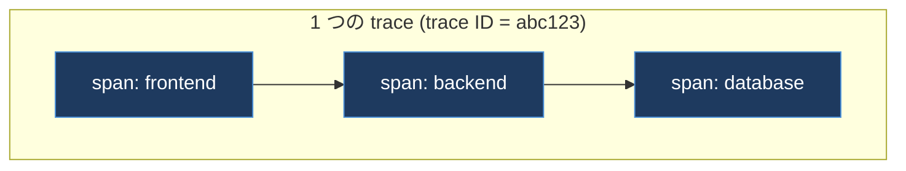
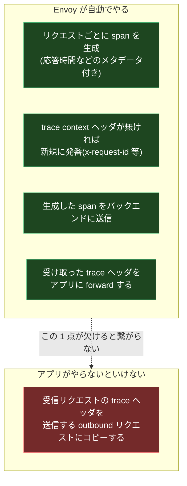
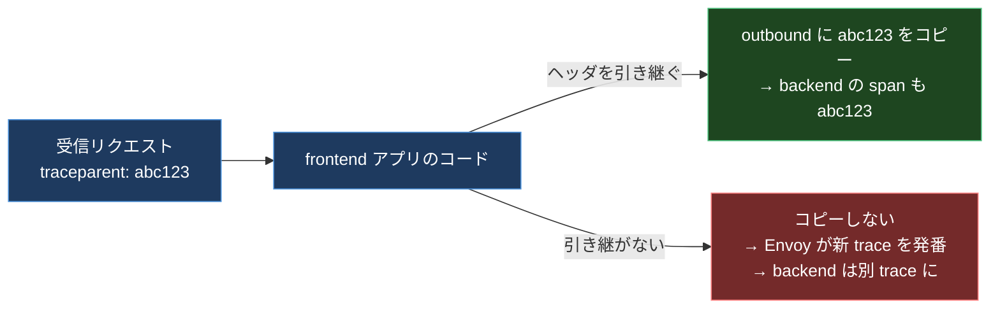
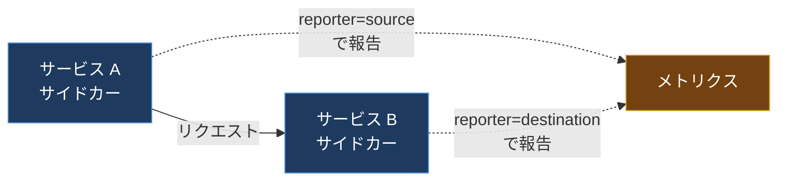

## はじめに

トレースバックエンド(Jaeger)を立てて、Istio のトレーシングを有効にして、「これで全リクエストの経路が 1 本の線で見えるぞ」と意気込んで画面を開いたら、出てきたのは **ぶつ切りの単発スパンの山** だった。

`frontend` のスパンが 1 個。`backend` のスパンが 1 個。`database` のスパンが 1 個。でも、それぞれ別の trace ID を持っていて、繋がっていない。1 本のリクエストが 3 サービスを通った、という当たり前の経路が、3 個の無関係なトレースとしてバラバラに記録されていた。

「mesh を入れれば分散トレーシングは自動」というのは、半分本当で半分嘘だ。**mesh は各ホップで span を作ってはくれるが、それを 1 本の trace に縫い合わせるには、アプリ側の協力が要る。** ここを知らないと、立派なトレースバックエンドが「単発スパン生成器」になる。

この記事は、まず「なぜ mesh だけでは繋がらないのか」を仕組みから解体し、何をすれば繋がるのかを示す。そして後半では、トレースとは対照的に **完全自動で手に入るメトリクス**(ゴールデンシグナル)に話を移し、そこにも潜む `reporter` ラベルの罠まで踏む。Prometheus の基礎は別記事「Prometheus Deep Dive」で扱っているので、ここでは mesh がメトリクスをどう出すかに集中する。

---

## 0. 前提: 分散トレーシングの最小知識

道具を 1 つだけ。分散トレーシングは、1 本のリクエストが複数サービスを通る経路を可視化する技術だ。用語は 2 つ覚えれば足りる。

- **trace**: 1 本のリクエスト全体。一意の **trace ID** を持つ。
- **span**: その trace の中の 1 区間(あるサービスでの処理)。span は親 span を指すことで、入れ子のツリーになる。



肝は **「全 span が同じ trace ID を共有し、親子関係(parent span ID)を持つ」** こと。これが揃って初めて、バラバラの span が 1 本のツリーに組み上がる。逆に言えば、trace ID が途中で変わったり、親の情報が伝わらなかったりすると、ツリーは組めずバラける。冒頭の「ぶつ切り」は、まさにこれが起きていた。

この「trace ID と親 span ID をリクエストに添えて運ぶ情報」を **trace context** と呼び、HTTP では特定のヘッダで運ばれる。

---

## 1. mesh が自動でやること、やらないこと

ここが誤解の発生源だ。Envoy サイドカーは、通過する全リクエストについて自動で span を作る。だが、それだけでは trace は繋がらない。線引きをはっきりさせる。



Envoy は、

- リクエストごとに span を作り(応答時間などを記録)、
- trace context ヘッダが無ければ新規に発番し、
- span をトレーシングバックエンドに送り、
- 受け取った trace ヘッダを **アプリに渡す(forward する)**。

ここまで全部自動だ。では何が足りないのか。**Envoy は、アプリが受け取ったヘッダを「アプリが新しく出す outbound リクエスト」にコピーすることはできない。** それはアプリのコードの内側で起きることで、サイドカーの外からは手が届かない。

---

## 2. なぜ繋がらないのか: コピーできるのはアプリだけ

具体的に追う。`frontend` が `backend` を呼ぶ場面を考える。



`frontend` のサイドカーは、受信リクエストに付いていた `traceparent: abc123` を `frontend` アプリに渡す。ここで `frontend` のコードが、`backend` を呼ぶときにこの `abc123` を **明示的にコピーして付け直せば**、`backend` 側のサイドカーは「これは abc123 の続きだ」と分かり、同じ trace に繋がる。

だが、`frontend` のコードがこのコピーをサボると、`backend` 行きのリクエストには trace ヘッダが無い。すると `backend` のサイドカーは「ヘッダが無いから新規だ」と判断して **新しい trace ID を発番** する。結果、`frontend` と `backend` は別々の trace になり、線が切れる。冒頭のぶつ切りはこれだった。

ここが分散トレーシングの一番反直感的なところだ。**サイドカーは通信の経路上にいるのに、アプリのリクエスト処理の「文脈」までは知らない。** 「この outbound は、さっき受けた inbound の延長だ」という因果関係は、アプリのコードだけが知っている。だからアプリが教えてやるしかない。

---

## 3. 何を伝播すればいいのか

伝播すべきは trace context ヘッダだ。Istio が扱う主なフォーマットは 2 系統ある。

- **W3C Trace Context**(標準): `traceparent`、`tracestate`
- **B3**(Zipkin 系): `x-b3-traceid`、`x-b3-spanid`、`x-b3-parentspanid`、`x-b3-sampled`、`x-b3-flags`(と単一ヘッダ版 `b3`)

加えて、Envoy 内部の相関 ID である **`x-request-id`** も伝播するとログとトレースが揃う。

どれを使うかは、入ってきたリクエストにどのフォーマットが付いていたかで Envoy が決める。B3 で来たら B3、W3C で来たら W3C。両方あればプロバイダ設定次第。だから一番安全なのは **全部まとめて転送する** ことだ。上流・下流がどのフォーマットでも、取りこぼさない。

転送すべきヘッダの代表セット:

```text
# W3C
traceparent
tracestate
# B3(マルチヘッダ + 単一ヘッダ)
x-b3-traceid
x-b3-spanid
x-b3-parentspanid
x-b3-sampled
x-b3-flags
b3
# Envoy の相関 ID
x-request-id
```

Istio のサンプルアプリ Bookinfo の `productpage` は、これに加えて `x-ot-span-context` や各種ベンダ固有ヘッダ(Datadog 系など)まで転送している。実装としては、Web フレームワークのミドルウェアで「受信リクエストからこれらのヘッダを抜き出し、HTTP クライアントの全 outbound に付け直す」処理を 1 箇所に書くのが定石だ。OpenTelemetry の自動計装ライブラリを入れると、この伝播を肩代わりしてくれる(その場合アプリは明示的なコピーから解放される)。

---

## 4. 伝播が壊れる典型パターン

「ヘッダを転送するコードは書いた」のに繋がらない、というときの犯人はだいたいこの 2 つだ。

- **非同期フロー(メッセージキュー)**: HTTP のヘッダ転送だけ書いても、キューを越えると HTTP ヘッダは消える。trace context を **メッセージのペイロードに直列化して載せ**、consumer 側で取り出して復元しないと、そこで線が切れる。プロデューサとコンシューマで trace が分断するのは大半がこれ。
- **ヘッダを除去する HTTP クライアント**: ライブラリやフレームワークによっては、非標準ヘッダ(`x-b3-*` など)をデフォルトで落とす。`set` したつもりのヘッダが実際に送信されているか、必ず実物で確認する。

---

## 5. ここで対照的なもの: メトリクスは完全自動

トレースは「アプリの改修(ヘッダ伝播)」が要る、というのが前半の結論だった。ところが **メトリクスはまったく逆で、アプリ無改修で全部出る**。サイドカーが通過する全リクエストを観測して、勝手にカウントし、ヒストグラムに積む。ここがトレースとメトリクスの決定的な非対称性だ。

なぜメトリクスは自動でいいのか。メトリクスは「このサービスへのリクエスト数・エラー率・レイテンシ」という **各ホップ単体で完結する集計** だからだ。トレースのように「複数ホップを跨ぐ因果」を要求しないので、サイドカー 1 個の観測だけで意味を成す。だから mesh のメトリクスは、入れた瞬間から価値が出る一番おいしい部分だ。

---

## 6. ゴールデンシグナルと Istio 標準メトリクス

何を見ればいいか。指針は Google SRE 本の **4 つのゴールデンシグナル** だ。

| シグナル | 意味 | Istio で取れるか |
| --- | --- | --- |
| Traffic(流量) | どれだけ来ているか | `istio_requests_total` から直接 |
| Errors(エラー) | どれだけ失敗しているか | `istio_requests_total` の `response_code` で |
| Latency(遅延) | どれだけ時間がかかるか | `istio_request_duration_milliseconds` から |
| Saturation(飽和) | リソースをどれだけ使い切っているか | Istio 単体では不足。K8s のリソースメトリクスと併用 |

中心になるメトリクスは 2 つだけ覚えればいい。

- **`istio_requests_total`**: リクエストごとに増える **カウンタ**。`source` / `destination` / `response_code` などのラベルが付く。
- **`istio_request_duration_milliseconds`**: リクエストの所要時間の **分布(ヒストグラム)**。`histogram_quantile()` で P50 / P95 / P99 を出せる。

この 2 つで、ゴールデンシグナルのうち 3 つ(Traffic / Errors / Latency)が直接カバーできる。Saturation だけは「CPU / メモリをどれだけ使っているか」という話なので、mesh のメトリクスではなく Kubernetes のリソースメトリクスを組み合わせる必要がある。

---

## 7. `reporter` ラベルの罠: 同じ通信が 2 回報告される

ここで mesh 特有の地雷を踏む。同じ 1 本の通信が、**2 つの Envoy から二重に報告される。**

サービス A → サービス B の通信は、A のサイドカー(送信側)と B のサイドカー(受信側)の両方が観測している。だから両方がメトリクスを出す。これを区別するのが **`reporter` ラベル** で、値は `source`(送信側視点)か `destination`(受信側視点)。



これを知らずに `istio_requests_total` をそのまま `sum()` すると、**ほぼすべての通信を 2 倍に数える**。「リクエスト数が実際の倍ある」という謎の数字に悩むのは、たいていこれだ。

対策はシンプルで、**クエリで `reporter` を固定する**。サーバ側(受け取った側)の視点で見たいなら `reporter="destination"` を付ける。RED(Rate / Errors / Duration)の代表クエリはこうなる。

```text
# Rate(流量)
sum(rate(istio_requests_total{destination_service_name="reviews",reporter="destination"}[5m]))

# Errors(エラー率の分子)
sum(rate(istio_requests_total{destination_service_name="reviews",reporter="destination",response_code=~"5.."}[5m]))

# Duration(P99 レイテンシ)
histogram_quantile(0.99,
  sum(rate(istio_request_duration_milliseconds_bucket{destination_service_name="reviews",reporter="destination"}[5m]))
  by (le))
```

`reporter` を固定するだけで、二重計上が消えて数字が現実と合う。これは mesh のメトリクスを触り始めて最初に覚えるべき作法だ。

---

## 8. 平均で隠れるもの: 暗黙のエラーと遅延の分離

最後に、メトリクスの「見方」で 2 つ。これを外すと、ダッシュボードが緑なのに障害、という事態になる。

**(1) レイテンシは平均でなく分布で見る**。平均 50ms でも、P99 が 5 秒なら 1% のユーザは地獄を見ている。`histogram_quantile()` で P95 / P99 を見るのが必須。冒頭の「1 台だけ遅い」障害(別記事「Service Mesh のレジリエンス徹底解剖」参照)も、平均では埋もれて P99 で初めて立ち上がる。

**(2) 暗黙のエラー(遅い 200)を拾う**。ユーザから見れば、30 秒かかった `200 OK` は実質エラーだ。`response_code=~"5.."` だけ見ていると、この「成功扱いの失敗」を見逃す。`istio_request_duration_milliseconds_bucket` を使って「SLO 閾値(例: 500ms)を超えたリクエストの割合」を出すと、ステータスコード上は成功でも遅すぎるものを拾える。

加えて SRE 本は **成功のレイテンシとエラーのレイテンシを分けて見ろ** と言う。エラーは速いことが多い(即座の 500 は成功応答より速い)ので、混ぜると平均レイテンシが不当に良く見えてしまう。`response_code` でフィルタして、成功だけのレイテンシ分布を別に持つのが正しい。

> こうして集めたメトリクスを長期保存・横断クエリしたくなったら、別記事「Thanos Deep Dive」が次の一歩になる。Prometheus 単体の保持期間とカーディナリティの限界を超える話だ。

---

## 9. まとめ

mesh の可観測性は「トレース」と「メトリクス」で性質が正反対だ、というのがこの記事の芯だ。**トレースは span 生成までは自動だが、1 本に繋ぐにはアプリのヘッダ伝播が要る**(怠ると単発スパンの山)。**メトリクスはアプリ無改修で自動だが、`reporter` を固定しないと二重計上し、平均で見ると遅い 200 を見逃す**。

「mesh を入れれば可観測性が手に入る」は、メトリクスについてはほぼ本当(自動で RED が揃う)、トレースについては嘘(アプリの協力が要る)。この非対称性を最初に押さえておけば、「Jaeger を入れたのにトレースが繋がらない」で何時間も溶かすことはなくなる。トレースが切れていたら、まずアプリのヘッダ伝播を疑う。メトリクスの数字が倍なら、まず `reporter` を疑う。

腑に落とすには、Bookinfo の `productpage` のソースで trace ヘッダがどう転送されているかを 1 度読み、自分のサービスで `x-request-id` を 1 本のリクエストで端から端まで追うのが速い。サイドカーが何を渡してきて、自分のコードが何を渡し直しているのか。その受け渡しの境界が見えた瞬間に、可観測性は「ツールを入れる」話から「文脈を運ぶ」設計の話に変わる。

---

## 参考リンク

- [Istio / Distributed Tracing FAQ](https://istio.io/latest/about/faq/distributed-tracing/)
- [Istio / Distributed Tracing Overview](https://istio.io/latest/docs/tasks/observability/distributed-tracing/overview/)
- [Istio / Standard Metrics](https://istio.io/latest/docs/reference/config/metrics/)
- [Tetrate / Key Metrics to Monitor the Istio Data Plane](https://tetrate.io/blog/key-metrics-to-monitor-the-istio-data-plane)
- [Google SRE Book / Monitoring Distributed Systems(Four Golden Signals)](https://sre.google/sre-book/monitoring-distributed-systems/)
