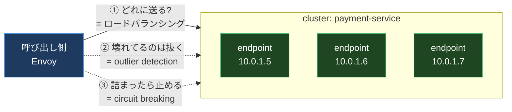
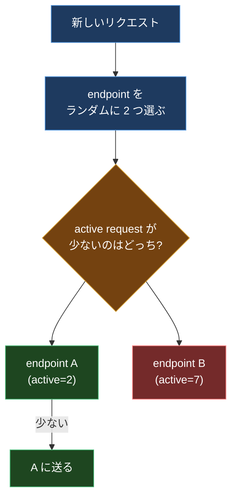
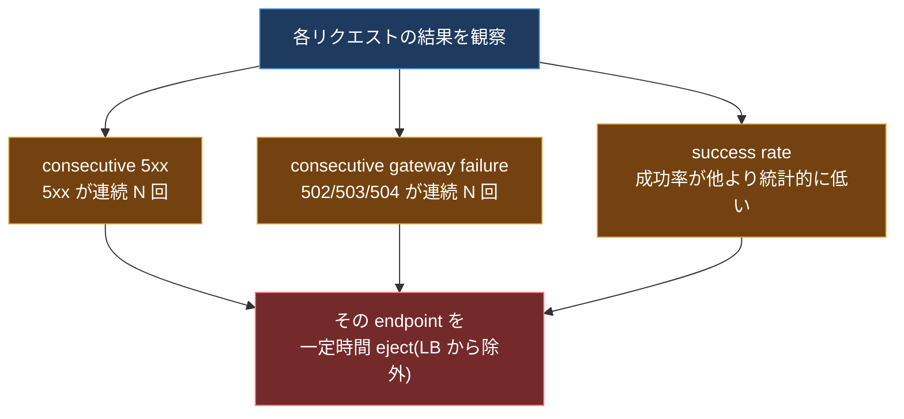
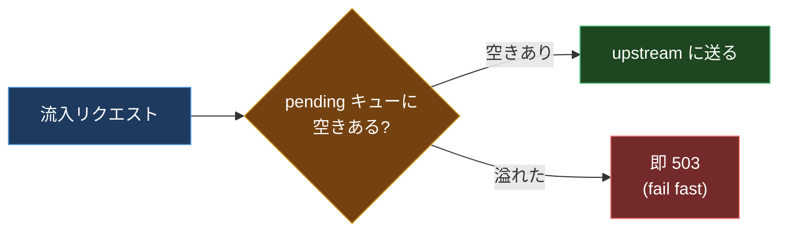
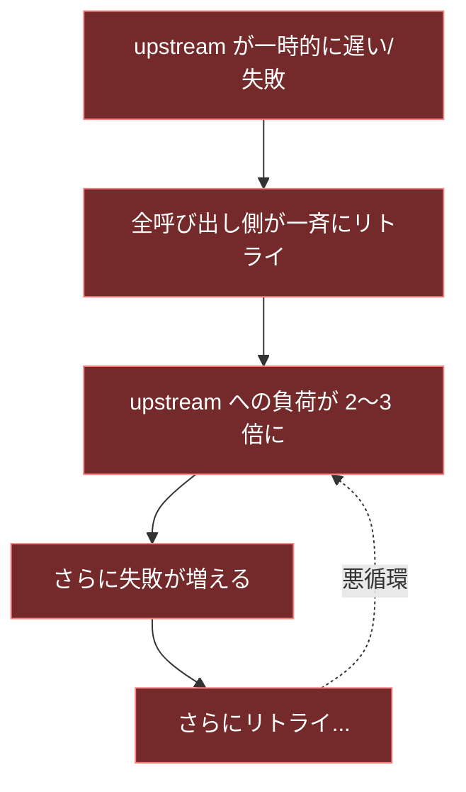

## はじめに

一番きつかった障害は、サービスが「落ちた」やつではなかった。1 台だけ「遅くなった」やつだ。

10 台のインスタンスのうち 1 台が、GC か何かで応答に 5 秒かかるようになった。残り 9 台は元気。普通のラウンドロビンは、その遅い 1 台にも平等にリクエストを配り続ける。呼び出し側はタイムアウトしてリトライする。リトライ分の負荷がさらに全体に乗る。やがて呼び出し側のスレッドが遅い応答待ちで埋まり、健全な 9 台への通信まで詰まる。たった 1 台の遅延が、リトライと枯渇を経由してサービス全体を巻き込んだ。

このとき欲しかったのは、こういう振る舞いだった。

- 遅い 1 台を **勝手に検知して送るのをやめる**
- リトライが **雪だるま式に増えないよう上限を効かせる**
- 詰まりかけたら **さっさと失敗させて呼び出し側を解放する**

これらは全部、アプリのコードに散らばせるとバグの温床になる。mesh のデータプレーン(Envoy)に寄せれば、設定 1 枚で全サービスに一貫して効く。この記事は、その「トラフィック制御の層」を上から順に解剖する。ロードバランシング、outlier detection、circuit breaking、retry、fault injection の 5 つを、それぞれ「何を選べて、基準は何で、間違えるとどう壊れるか」まで踏み込む。

xDS がこれらの設定をどう配るかは別記事で扱っているので、ここでは **配られた設定の中身が何を起こすか** に集中する。

---

## 0. 前提: Envoy の「cluster」という単位

レジリエンスの話は全部、Envoy の **cluster** という単位に乗る。cluster は「論理的な 1 つの宛先サービス」で、その中に複数の **endpoint(実インスタンスの IP:port)** がぶら下がる。



これから話す機能は、全部この cluster に対する設定だと思えばいい。「どの endpoint に送るか(LB)」「どの endpoint を一時的に外すか(outlier detection)」「cluster 全体への流量をどこで止めるか(circuit breaking)」という 3 つの問いに対応する。

---

## 1. ロードバランシング: どの endpoint に送るか

### 1-1. ラウンドロビンの限界

一番素朴なのは round robin(順番に配る)だ。endpoint が全部同じ性能で、全リクエストが同じ重さなら、これで十分釣り合う。

崩れるのは、冒頭の「1 台だけ遅い」ケースだ。round robin は応答の速さを見ないので、遅い 1 台にも 10 分の 1 を配り続ける。遅い台に送られたリクエストは長時間居座り、呼び出し側のリソースを食いつぶす。round robin は「全 endpoint が等価」という前提が崩れた瞬間に弱い。

### 1-2. Least Request(P2C): 実質これが基本

Envoy のおすすめは **least request**。名前のとおり「いま処理中のリクエスト(active request)が一番少ない endpoint に送る」。遅い台はリクエストが捌けず active が積み上がるので、自動的に選ばれにくくなる。

ここで賢いのが、全 endpoint をスキャンして最小を探す(O(N))ことはしない点だ。代わりに **P2C(Power of Two Choices)** を使う。



ランダムに 2 つだけ選んで、active が少ない方に送る。たったこれだけで、全スキャンに「ほぼ匹敵する」均し効果が出ることが理論的に示されている(Mitzenmacher の結果)。1 個ランダムに選ぶだけだと運悪く混んだ台に当たるが、2 つ見て良い方を取るだけで偏りが激減する。「2 つ見る」が効率と品質の最高のバランス点になっている。

P2C には嬉しい性質がある。**cluster で最も active が多い台は、新規リクエストを二度と受け取らない。** 他の台と同じ水準に下がるまで自然にドレイン(排出)される。冒頭の遅い 1 台が、勝手に蛇口を絞られていくイメージだ。

endpoint ごとに重み(weight)が違う場合は、重み付きモードに切り替わり、選択時に動的に重みを計算する。

```text
有効な重み = load_balancing_weight / (active_requests + 1)
```

weight 2 の台が active 4 件なら、有効重みは 2 / (4 + 1) = 0.4。混んでいる台ほど分母が増えて選ばれにくくなる。ただしこのモードは P2C と違い、台が完全にゼロまでドレインすることはない(分子が残るため)。定常状態の釣り合いは良いが、急な偏りへの追従は P2C ほど速くない、というトレードオフがある。

> 補足: least request は「**active リクエスト数**」を見るのであって、レイテンシ(EWMA など)を直接見るわけではない。「遅い台」は active が積もることで間接的に避けられる、という仕組み。

### 1-3. ハッシュ系: ring hash と Maglev

「同じユーザーは毎回同じ台に送りたい」(セッション固定、キャッシュ局所性)場合は、active 数ではなく **リクエストの属性(ユーザー ID やヘッダ)をハッシュして送り先を決める** ハッシュ系を使う。これには「ハッシュするキーを指定するルーティング」が前提になる。代表が 2 つ。

**ring hash(ketama / 一貫性ハッシュ)**: 全 endpoint を円(リング)上にハッシュで配置し、リクエストのキーをハッシュして時計回りに一番近い endpoint に送る。最大の利点は **台が増減しても影響を受けるのは全体の約 1/N だけ** という点。10 台中 1 台抜けても、再配置されるのはざっくり 1 割で、残り 9 割のキーは行き先が変わらない。キャッシュを温存したいときに効く。各台はリング上に「重みに比例した回数」配置され、最小リングサイズが大きいほど分布が滑らかになる。

**Maglev**: 同じく一貫性ハッシュだが、固定サイズのルックアップテーブルを使う。ring hash と比べてテーブル構築が約 10 倍、台の選択が約 5 倍速い(256K エントリの大きなリング比)。代わりに、台が変わったときに移動するキーが ring hash の約 2 倍多い(乱れがやや大きい)。table_size を増やすと乱れは抑えられる。**速度を取るなら Maglev、台の増減に対する安定性を取るなら ring hash**、という棲み分けになる。

| LB ポリシー | いつ使う | 注意 |
| --- | --- | --- |
| round robin | 全台が等価で短時間リクエスト | 遅い台を避けられない |
| least request (P2C) | 迷ったらこれ。遅い台を自然に回避 | active 数ベース(レイテンシ直接ではない) |
| ring hash | セッション固定 / キャッシュ局所性 | ハッシュキーの指定が必要 |
| Maglev | ring hash と同目的で速度優先 | 台増減時の乱れが ring hash の約 2 倍 |

---

## 2. Outlier Detection: 壊れた endpoint を自動で抜く

LB で「混んでる台」は避けられても、「5xx を返し続ける壊れた台」は別の話だ。これを検知して一時的に LB 対象から外すのが **outlier detection**。これはリクエストの結果を見て判断する **パッシブヘルスチェック** で、Envoy が能動的に ping を打つ active health check とは別物(併用もできる)。

検知の軸はいくつかある。



- **consecutive 5xx**(`consecutive_5xx`、デフォルト 5): 5xx が連続したら eject。ここでの 5xx は実際の 5xx 応答に加え、接続失敗やリセットなど HTTP ルータが 5xx 相当とみなす事象も含む。これは即時(inline)に判定される。
- **consecutive gateway failure**: 502 / 503 / 504 が連続したら eject。ゲートウェイ系のエラーに絞った版。
- **success rate**: cluster 全体の成功率を集計し、**平均から `stdev_factor`(例: 1.9)標準偏差ぶん下回る** 台を eject。これは一定間隔(interval)で走る。連続失敗の閾値には引っかからないが、じわじわ劣化している台を捕まえられる。

### 2-1. eject の安全弁とランプアップ

outlier detection は強力だが、効きすぎると危ない。全台がたまたま 5xx を返した瞬間に全部 eject したら、cluster が空になってサービス全断する。これを防ぐ仕組みが入っている。

- **`max_ejection_percent`**: eject できる台数の上限(%)。これを超えると、条件を満たしても eject しない。「最低でもこれだけは残す」という安全弁。
- **`base_ejection_time`**(例: 30s): eject される時間。繰り返し eject される台は、この時間が伸びていく(問題が続く台ほど長く隔離される)。
- **`enforcing_consecutive_5xx`**(デフォルト 100): outlier 判定が出ても「実際に eject する確率(%)」。これを 100 未満にすると、検知はするが eject はたまにしかしない、という **段階導入** ができる。本番にいきなり入れて誤爆させないために、まず低い値で様子を見るのが定石。
- **`success_rate_minimum_hosts`**(デフォルト 5): success rate 検知を動かすのに必要な最小ホスト数。台数が少ないと統計が当てにならないので、これ未満では success rate 判定をしない。

設定例を 1 つ置く。

```yaml
outlier_detection:
  consecutive_5xx: 5
  interval: 10s
  base_ejection_time: 30s
  max_ejection_percent: 50          # 半分までしか抜かない安全弁
  enforcing_consecutive_5xx: 100
  enforcing_success_rate: 100
  success_rate_minimum_hosts: 3
  success_rate_request_volume: 100
  success_rate_stdev_factor: 1900   # 1.9 標準偏差(1000 倍表記)
```

冒頭の「遅い 1 台」がやがて 5xx やタイムアウトを返し始めたら、この設定なら 5 連続失敗で 30 秒隔離される。隔離中に回復すれば自動で戻る。人間が夜中に起きて手で外す必要がなくなる。

---

## 3. Circuit Breaking: 雪崩を止める流量の堰

outlier detection が「壊れた台を抜く」なら、circuit breaking は **「cluster 全体への流量が一定を超えたら、それ以上の負荷をかけない」** という堰だ。過負荷を呼び出し側に押し戻すことで、連鎖崩壊(cascading failure)を防ぐ。

主な閾値はこれだ(cluster 単位)。

| パラメータ | 意味 | デフォルト |
| --- | --- | --- |
| `max_connections` | cluster への最大コネクション数 | |
| `max_pending_requests` | キューで待てる最大リクエスト数 | 1024 |
| `max_requests` | cluster への最大並行リクエスト数 | 1024 |
| `max_retries` | cluster への最大並行リトライ数 | 3 |

肝は `max_pending_requests` の振る舞いだ。**待ち行列が溢れたリクエストは、待たされずに即 503 で失敗する(fail fast)。**



「即失敗が優しさ」というのが直感に反するかもしれない。だが、過負荷の upstream に向かってリクエストを延々キューに溜めると、呼び出し側のメモリとスレッドが待ち行列で埋まり、呼び出し側まで巻き込まれる。早く 503 を返して呼び出し側を解放すれば、呼び出し側はフォールバック(キャッシュを返す、機能を縮退するなど)に移れる。**遅い成功より速い失敗のほうが、システム全体としては生き残れる。**

pending キューのサイズ感の目安として、バースト性のあるトラフィックでは `max_connections` の 1〜2 倍あたりが経験則とされる。

---

## 4. Retry: 諸刃の剣をどう御すか

リトライは「一時的な失敗」を救う。だが、これが冒頭の障害を悪化させた張本人でもある。みんなが一斉にリトライすると、弱った upstream に **元の何倍もの負荷** が乗る。これが retry storm(リトライストーム)だ。



これを御す鍵が **retry budget** だ。`max_retries`(並行リトライ数の静的上限)を使う代わりに、リトライ量を「いま流れているリクエスト量に対する割合」で縛る。

> 同時リトライ数の上限 =(active リクエスト + pending リクエスト)× `budget_percent`

`budget_percent` のデフォルトは 20%。active が 100 件なら、同時リトライは 25 件まで(設定 25% の例)。**散発的な失敗のリトライは許すが、全体のリトライ量は決して爆発しない。** トラフィックが増えれば許容リトライ量も比例して増えるので、静的な数値より自然にスケールする。Envoy 公式も、静的な `max_retries` より retry budget を推奨している。もし静的にやるなら、リトライこそ積極的に circuit break しろ、というのが指針だ。

リトライ設計の原則を 3 つに畳むと、

1. **リトライにこそ上限を**(retry budget)。本体のリクエストより、リトライの暴走のほうが危ない。
2. **何でもリトライしない**。べき等でない操作(課金など)をリトライすると二重実行になる。リトライ可能な条件(`x-envoy-retry-on` で 5xx や connect-failure に限定)を明示する。
3. **バックオフを入れる**。即座の一斉リトライではなく、指数バックオフ + ジッタで時間をばらす。

---

## 5. Fault Injection: わざと壊して確かめる

ここまでの仕組みは「壊れたときに守る」ものだった。だが、**本当に守れるかは、壊してみないと分からない。** Envoy には HTTP fault filter があり、意図的に障害を注入できる。

- **delay**: 指定した割合のリクエストに固定の遅延を入れる。「冒頭の遅い 1 台」を再現できる。
- **abort**: 指定した割合のリクエストを指定の HTTP ステータス(503 など)で即座に失敗させる。

これを使うと、たとえば「payment-service の 10% に 5 秒の遅延を注入して、circuit breaker と outlier detection がちゃんと効いて、呼び出し側がフォールバックに移れるか」を本番に近い環境で検証できる。レジリエンス設定は **書いた時点では絵に描いた餅** で、fault injection で壊して初めて「効いている」と言える。カオスエンジニアリングの最小の入り口がこれだ。

---

## 6. 組み合わせの設計判断

5 つの機能を、いつ・何のために使うかで整理する。

| 守りたいもの | 使う機能 | 設定の勘所 |
| --- | --- | --- |
| 遅い台に送りたくない | least request (P2C) | 迷ったら round robin より P2C |
| 同じユーザーを同じ台に | ring hash / Maglev | 速度なら Maglev、安定なら ring hash |
| 壊れた台を自動で隔離 | outlier detection | まず `enforcing_*` を低くして段階導入、`max_ejection_percent` で全断を防ぐ |
| 過負荷の連鎖を止める | circuit breaking | pending 溢れは fail fast。遅い成功より速い失敗 |
| リトライの暴走を防ぐ | retry budget | 静的 `max_retries` より割合制。べき等性に注意 |
| 設定が本当に効くか | fault injection | delay / abort で壊して検証してから本番投入 |

worked example として、冒頭の障害にこのセットを当てるとこうなる。

1. **least request** で、遅くなった 1 台は active が積もり、新規が自然に減る。
2. それでも 5xx / タイムアウトを返し始めたら、**outlier detection** が 5 連続失敗で 30 秒隔離。`max_ejection_percent: 50` で全断は防ぐ。
3. 呼び出し側が一斉リトライしても、**retry budget 20%** でリトライ総量が頭打ち。retry storm が起きない。
4. それでも流入が過大なら、**circuit breaking** の pending 上限で溢れたぶんを即 503 にして呼び出し側を解放、フォールバックへ。
5. この一連が本当に動くかを、リリース前に **fault injection** の delay で再現して確認しておく。

冒頭で「たった 1 台の遅延が全体を巻き込んだ」障害は、この 5 層がかみ合っていれば「1 台が静かに隔離されて終わり」になる。

---

## 7. まとめ

mesh の価値は mTLS や可観測性だけではない。むしろ **「壊れ方を設計できる」** ことが本丸だ。アプリのあちこちに散らばっていたタイムアウト・リトライ・フォールバックのロジックを、Envoy の cluster という 1 つの単位に寄せ、設定として一貫して効かせられる。

押さえるべきは、それぞれの機能が「どんな壊れ方に効くか」と「効かせすぎるとどう逆に壊れるか」の両面だ。outlier detection は効きすぎれば全断を招くし、リトライは救いにも雪崩にもなる。だからこそ、安全弁(`max_ejection_percent`)・段階導入(`enforcing_*`)・割合制(retry budget)・検証(fault injection)がセットで用意されている。

この 5 層は、Istio では `DestinationRule` の `trafficPolicy.outlierDetection` / `connectionPool`(circuit breaking)/ `loadBalancer` と、`VirtualService` の `fault` に、この記事で読んだ Envoy 設定がそのままマッピングされている。だから検証は意外と安く済む。`fault` で 1 台に delay を注入し、隔離が起きる瞬間をアクセスログで眺める。緑のダッシュボードの裏で「1 台が静かに eject されて戻ってくる」のが見えたら、レジリエンスは絵に描いた餅から自分の道具に変わっている。壊して確かめるまでは、どの設定も効いている保証はない。

---

## 参考リンク

- [Envoy / Outlier detection](https://www.envoyproxy.io/docs/envoy/latest/intro/arch_overview/upstream/outlier)
- [Envoy / Supported load balancers](https://www.envoyproxy.io/docs/envoy/latest/intro/arch_overview/upstream/load_balancing/load_balancers)
- [Envoy / Circuit breaking](https://www.envoyproxy.io/docs/envoy/latest/intro/arch_overview/upstream/circuit_breaking)
- [Envoy / Circuit breakers (proto)](https://www.envoyproxy.io/docs/envoy/latest/api-v3/config/cluster/v3/circuit_breaker.proto)
- [Red Hat / Microservices Patterns with Envoy: Circuit Breaking](https://www.redhat.com/en/blog/microservices-patterns-envoy-part-i)
