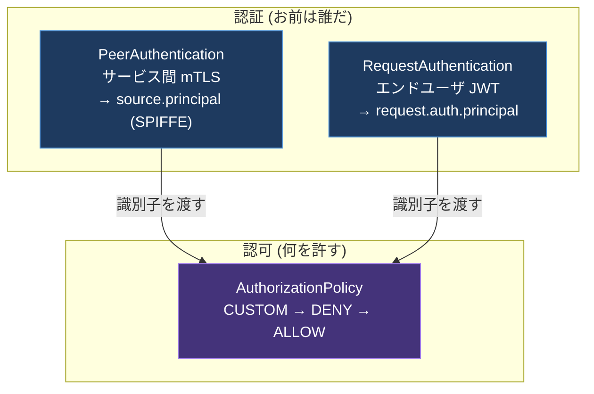
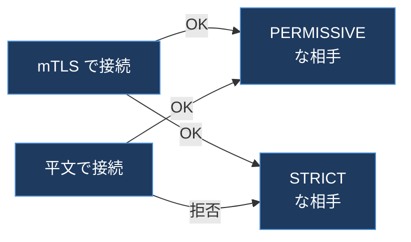
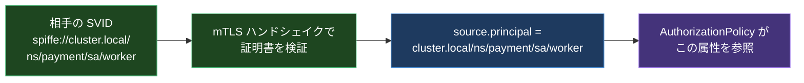
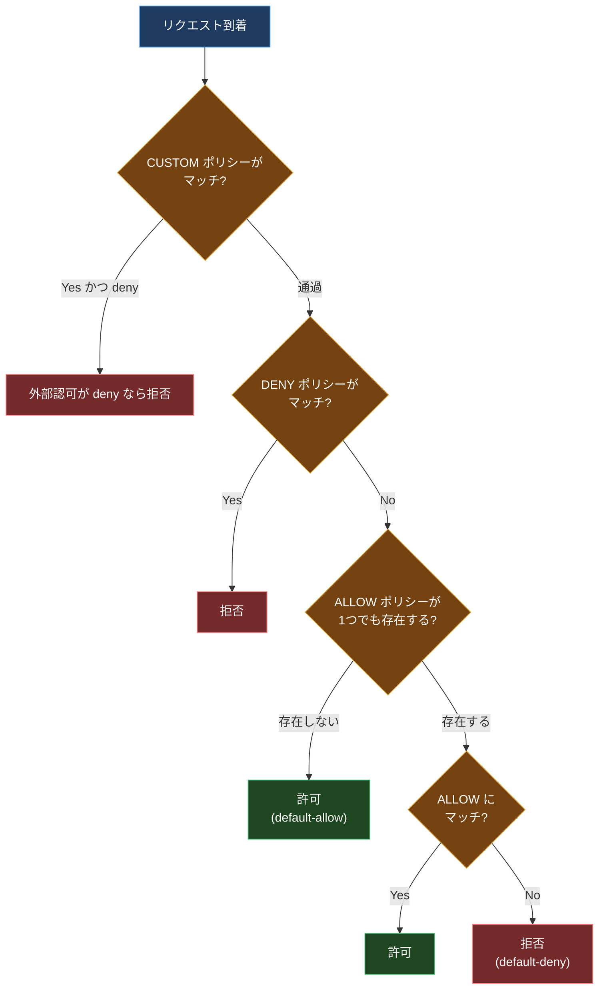
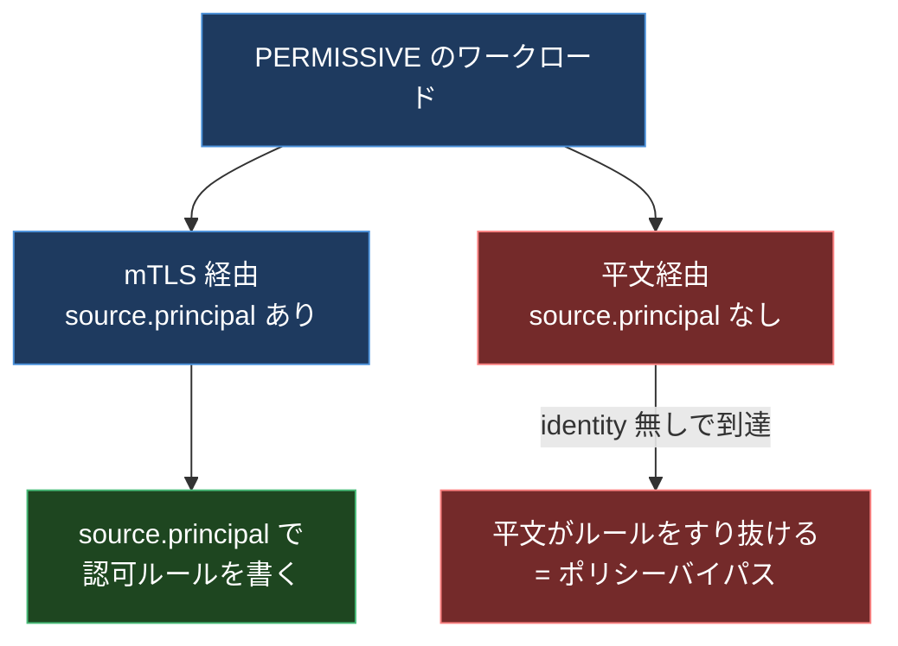

## はじめに

SPIFFE/SPIRE を追ったとき、ワークロードに `spiffe://cluster.local/ns/payment/sa/worker` みたいな ID が配られて、それが X.509 証明書(SVID)に焼かれて mTLS で検証される、ところまでは腑に落ちた。

でも、ずっと宙ぶらりんだった問いがある。**その `spiffe://...` という文字列は、結局どこで「許可・拒否」の判断に使われるのか?** ID を配っただけでは、誰が誰を呼んでいいかは決まらない。「ID を持っている」と「その ID に何を許す」はまったく別のレイヤの話だ。

Istio はこの橋渡しを 3 つのリソースでやっている。この記事は、SPIFFE 記事で配った ID が、`PeerAuthentication` で mTLS に乗り、`source.principal` という属性に化けて、`AuthorizationPolicy` のルールに刺さるまでの一本道を追う。ついでに、ここには初見で必ず踏む地雷がいくつもあるので、それも先に踏んで地図にしておく。

> ID そのもの(SVID の発行・検証)は別記事「SPIFFE/SPIRE Deep Dive」を、認可モデル一般(RBAC/ABAC/ReBAC や Zanzibar)は別記事を参照。この記事は「mesh が配った ID と、認可ルールをどう接続するか」に絞る。

---

## 0. 前提: 認証 2 種 + 認可 1 種

まず登場人物を分ける。セキュリティの話は「認証(AuthN: お前は誰だ)」と「認可(AuthZ: お前に何を許す)」を混ぜると一気に分からなくなる。Istio は 3 つのリソースを、この軸できれいに分けている。



| リソース | 役割 | 生み出す識別子 |
| --- | --- | --- |
| PeerAuthentication | サービス間の mTLS(誰が呼んでいるか) | `source.principal`(SPIFFE) |
| RequestAuthentication | エンドユーザの JWT 検証(誰が使っているか) | `request.auth.principal` |
| AuthorizationPolicy | アクセス制御(許可・拒否) | 上の 2 つを消費する |

ポイントは、**認証リソースは「誰か」を確定して属性に詰めるだけ** で、許可・拒否は一切しないこと。許可・拒否は AuthorizationPolicy が一手に引き受ける。この分業を頭に入れて、順番に見ていく。

---

## 1. PeerAuthentication: サービスの ID は mTLS から来る

`PeerAuthentication` は「このワークロードは mTLS をどう扱うか」を決める。モードは 4 つ。

- **PERMISSIVE**(インストール時のデフォルト): mTLS で来たら mTLS として、平文で来たら平文として、両方受ける。
- **STRICT**: mTLS のみ受ける。平文は拒否。
- **DISABLE**: mTLS を使わない(平文のまま)。
- **UNSET**: 上位(メッシュ / 名前空間)の設定を継承。

なぜデフォルトが「ガバガバに見える」PERMISSIVE なのか。これは **段階移行のため** だ。既存のクラスタにいきなり STRICT を入れると、まだサイドカーが入っていない平文のワークロードからの通信が全部切れて障害になる。PERMISSIVE なら、サイドカーを入れた相手とは自動で mTLS になり、まだの相手とは平文で繋がり続ける。全ワークロードの移行が終わってから STRICT に締める、という運びを許す設計だ。



ここで決定的に重要な制約がある。**SPIFFE の ID を持てるのは、Envoy サイドカー(または ambient の ztunnel)が通信を仲介しているワークロードだけ。** 素の Pod は SVID を持たないので mTLS で名乗れない。「ID で認可する」の土台は、まず mesh に入っていることなのだ。

---

## 2. ID が `source.principal` に化ける瞬間

ここが宙ぶらりんだった問いの答えだ。mTLS のハンドシェイクで相手の SVID(`spiffe://cluster.local/ns/payment/sa/worker`)を検証したあと、**Istio はその SPIFFE 識別子を `source.principal` という属性に詰める。**



同じように、RequestAuthentication が検証した JWT の発行者・サブジェクトは `request.auth.principal` に入る。つまり、

- `source.principal` ← サービスの SPIFFE ID(PeerAuthentication / mTLS 由来)
- `request.auth.principal` ← エンドユーザの JWT 由来

この 2 つの属性こそが、SPIFFE 記事で配った ID と、次に書く認可ルールをつなぐ「のりしろ」だ。SVID という証明書の中の文字列が、ポリシー言語で参照できる変数に化ける。これが見えなかったから宙ぶらりんだったわけだ。

---

## 3. AuthorizationPolicy: CUSTOM → DENY → ALLOW

許可・拒否を決めるのが `AuthorizationPolicy`。アクションは主に **CUSTOM / DENY / ALLOW**(と、後述の AUDIT)。同じワークロードに複数種類が刺さっているとき、評価順は固定だ。



順に言うと、

1. **CUSTOM** がマッチして外部認可(外部の authz サーバ)が deny を返したら拒否。
2. **DENY** がマッチしたら拒否。
3. ワークロードに **ALLOW ポリシーが 1 つも無ければ、全部許可**(default-allow)。
4. ALLOW のどれかにマッチしたら許可。
5. どれにもマッチしなければ拒否(default-deny)。

### 3-1. 最大の罠: 「最初の 1 個の ALLOW」で挙動が反転する

ステップ 3 と 4 をよく見てほしい。**ALLOW ポリシーが 1 個も無いうちは「全許可」だが、ALLOW を 1 個でも足した瞬間、そのワークロードは「default-deny(マッチした分だけ許可)」に切り替わる。**

これが初見で必ず踏む地雷だ。「サービス A からの通信を許可したい」と思って ALLOW を 1 個書くと、それまで通っていた **A 以外の全通信が一斉に拒否され始める**。ALLOW は「これを足す」ではなく「これ以外を締める」という効果を持つ。この反転を知らないと、ポリシー 1 枚で予想外の全断を起こす。

DENY を使うときは、HTTP 属性を使う場合は特に **必ずポート単位にスコープを切る** ことも推奨されている(TCP ポートで HTTP 属性のポリシーが意図せず広く効くのを防ぐため)。

### 3-2. AUDIT は許可・拒否を変えない

アクションにはもう 1 つ **AUDIT** がある。これは紛らわしいが、**許可・拒否には一切影響しない**。「このリクエストをログに残すか」を決めるだけで、許可・拒否は CUSTOM / DENY / ALLOW だけで決まる。しかも AUDIT は **対応プラグインを別途有効にしないと何も起きない**(プラグインが無ければ監査されない)。「AUDIT を書いたのにブロックされない」のは仕様、「AUDIT を書いたのにログも出ない」のはプラグイン未設定、という二段構えを覚えておく。

---

## 4. RequestAuthentication: 「あれば検証、なければ素通り」

エンドユーザ認証(JWT)を担うのが `RequestAuthentication`。サービス間が SPIFFE なら、ユーザ認証は JWT、という対応だ。

ここに 2 つ目の大きな罠がある。**RequestAuthentication は「JWT があれば検証する」だけで、「JWT を必須にする」ことはしない。** JWT が無いリクエストは、検証をスルーして **identity 無しのまま** 認可レイヤに到達する。

つまり RequestAuthentication 単体では「未認証お断り」にならない。必須化するには **AuthorizationPolicy と組み合わせる**。

```yaml
# JWT を必須にする = RequestAuthentication だけでは不十分
apiVersion: security.istio.io/v1
kind: AuthorizationPolicy
spec:
  rules:
    - from:
        - source:
            requestPrincipals: ["*"]   # 何らかの検証済み JWT identity を要求
```

`requestPrincipals: ["*"]` は「検証済みの JWT identity が付いていること」を要求する。これがあれば、JWT 無しのリクエストは拒否される。逆に、`from` 制約の無いポリシーだと、JWT 無しでも通ってしまう。**「JWT を検証する」と「JWT を要求する」は別の設定** だ、というのがこの罠の核心。

---

## 5. PERMISSIVE の混在 ID 問題

ここで 1 章と 3 章がつながって、最も危険な落とし穴が見える。

PERMISSIVE モードは平文も mTLS も両方受ける。ということは、**同じワークロードに、`source.principal` が付いたリクエスト(mTLS 経由)と、付いていないリクエスト(平文経由)が混ざって届く**。

この状態で `source.principal` を使った認可ルールを書くとどうなるか。平文で来たリクエストには `source.principal` が無いので、ルールの評価が予想外になる。攻撃者が平文で接続すれば、`source.principal` ベースの DENY をすり抜けたり、逆に正規の通信が誤って弾かれたりする。

だから公式は強く警告している。**`source.principal` などの ID フィールドを使う認可ルールは、必ず STRICT な mTLS とセットで使え。** PERMISSIVE のまま ID ベースのポリシーを書くのは、鍵のかかっていないドアに「関係者以外立入禁止」の貼り紙をするようなものだ。



---

## 6. 運用の落とし穴 3 つ

ここまでの仕組みを本番に入れるとき、知らないと必ずハマる点を 3 つ。

**(1) 全 Pod が `default` ServiceAccount だと認可が無力**。`source.principal` は ServiceAccount に紐づく。もし全ワークロードが `default` SA を共有していると、SPIFFE ID が全部 `.../sa/default` になり、**サービス同士を区別できない**。ID ベースの認可をやるなら、ワークロードごとに専用の ServiceAccount を切るのが大前提。これは認可を入れる「前」に整えるべき土台だ。

**(2) STRICT への切り替えは名前空間ごとに**。メッシュ全体を一度に PERMISSIVE → STRICT すると、見落としていた平文経路が一斉に切れて大事故になる。中間状態として PERMISSIVE を挟みつつ、名前空間単位で「壊れていないか」を確認しながら締めていく。

**(3) ヘルスプローブはサイドカーを迂回する**。Kubernetes の health probe は構成によってサイドカーをバイパスする。STRICT にしたら kubelet のプローブが mTLS じゃないので弾かれてヘルスチェック全滅、という事故がある。STRICT 化のときはプローブ経路を許す設定を忘れない(この「除外ポート」の話は、別記事「Istio のサイドカーはどうやって通信を盗むのか」の 15021 / 15020 の扱いとつながる)。

---

## 7. ambient ではどこで効くのか

ここまではサイドカー前提で書いた。ambient mode(サイドカーレス)では、ポリシーの **効く場所** が 2 つに割れる。

| ポリシー | ambient での適用レイヤ |
| --- | --- |
| L4 の `AuthorizationPolicy`(送信元 identity・ポート単位) | ztunnel(ノード共有の L4) |
| L7 の `AuthorizationPolicy`(HTTP メソッド・パス単位) | waypoint(L7 Envoy) |

mTLS と `source.principal` ベースの L4 認可は ztunnel が処理するので waypoint 無しでも効く。だが、**`GET /admin` のような L7 ルールは waypoint を置かないとどこでも評価されずすり抜ける**。「L7 認可を書いたのに効かない」の典型がこれ。詳しくは別記事「Ambient Mesh 徹底解剖」を参照。

---

## 8. 設計判断の早見表

3 つのリソースを「何をしたいか」で引けるようにする。

| やりたいこと | 使うもの | 罠 / 勘所 |
| --- | --- | --- |
| サービス間を暗号化・相互認証 | PeerAuthentication STRICT | いきなり全体 STRICT にしない。NS 単位で |
| 「サービス A だけ呼べる」 | AuthorizationPolicy ALLOW + `source.principal` | ALLOW を 1 個足すと他が全部 deny に反転 |
| 「サービス B は絶対拒否」 | AuthorizationPolicy DENY | ポート単位にスコープを切る |
| エンドユーザの JWT を検証 | RequestAuthentication | 検証するだけで必須化はしない |
| JWT を必須にする | + AuthorizationPolicy `requestPrincipals: ["*"]` | RequestAuthentication 単体では未認証が通る |
| ID ベースの認可全般 | 上記 + STRICT mTLS + 専用 SA | PERMISSIVE + default SA はバイパスの温床 |

worked example: 「payment-service は、checkout-service からの mTLS 接続だけ受け付け、かつ管理 API はログイン済みユーザだけ」を組むなら、

1. payment と checkout にそれぞれ専用 ServiceAccount を切る(土台)。
2. payment に `PeerAuthentication: STRICT`(平文を締める)。
3. payment に `AuthorizationPolicy ALLOW`、`source.principal: cluster.local/ns/.../sa/checkout`(checkout 以外は default-deny に反転して締まる)。
4. payment に `RequestAuthentication`(JWT 発行者を登録)。
5. 管理 API パスに `AuthorizationPolicy`、`requestPrincipals: ["*"]` + パスマッチ(ログイン必須化)。

この 5 枚で、サービス認証・サービス認可・ユーザ認証・ユーザ認可が層になる。1 枚でも欠けると、どこかに素通りの穴が空く。

---

## 9. まとめ

宙ぶらりんだった「`spiffe://...` はどこで効くのか」の答えは、**mTLS で検証された SVID が `source.principal` という属性に化け、それを AuthorizationPolicy のルールが参照する**、という一本道だった。ID を配るのが SPIFFE/SPIRE、その ID を mTLS に乗せて属性化するのが PeerAuthentication、属性を見て許可・拒否するのが AuthorizationPolicy。役割がきれいに分かれている。

そして、このきれいな分業には初見殺しの罠が等間隔で埋まっている。

- ALLOW を 1 個足すと挙動が default-deny に反転する
- RequestAuthentication は JWT を「検証」するが「要求」はしない
- PERMISSIVE で ID ベースの認可を書くとバイパスされる
- 全 Pod が default SA だと ID で区別できない

どれも「設定は書いたのに守れていない / 想定外に全断した」という形で表に出る。逆に言えば、この 4 つを避けるだけで mesh のセキュリティ設定の事故の大半は防げる。

いちばん腑に落ちるのは、テスト用の名前空間に `PeerAuthentication: STRICT` を当て、許可した SA の Pod からは 200、別 SA の Pod からは 403 が返るのを並べて見る瞬間だ。同じ `curl` が ServiceAccount の違いだけで通ったり弾かれたりする。これを目にすると、`spiffe://.../sa/worker` という文字列が「証明書に焼かれたただの ID」から「認可ルールの主語」に変わる。冒頭で宙ぶらりんだった問いが、ここで地に足を着く。

---

## 参考リンク

- [Istio / Authorization Policy](https://istio.io/latest/docs/reference/config/security/authorization-policy/)
- [Istio / Security concepts](https://istio.io/latest/docs/concepts/security/)
- [Istio / Authentication Policy(PeerAuthentication 移行)](https://istio.io/latest/docs/tasks/security/authentication/authn-policy/)
- [Istio Security Policies Explained: PeerAuthentication, RequestAuthentication, AuthorizationPolicy](https://alexandre-vazquez.com/istio-security-policies/)
