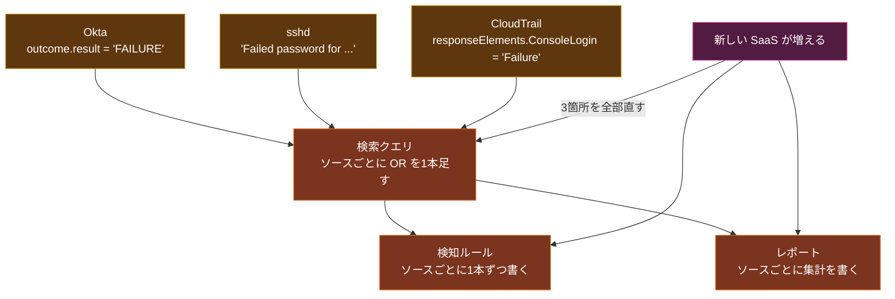
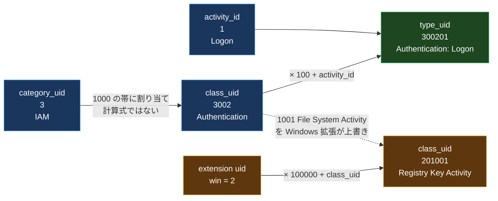
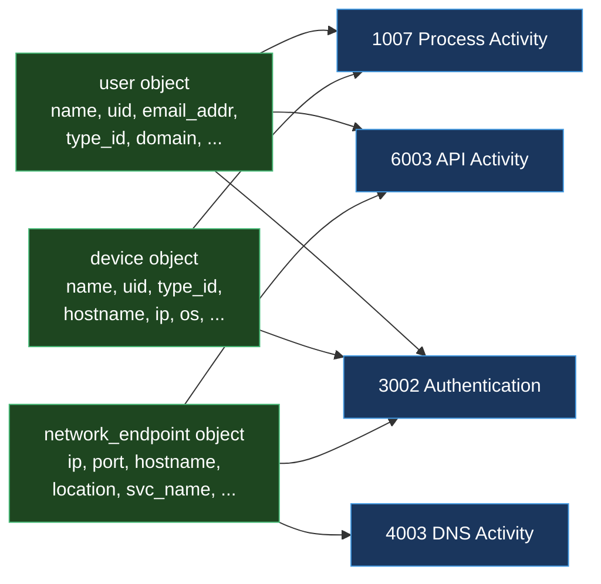
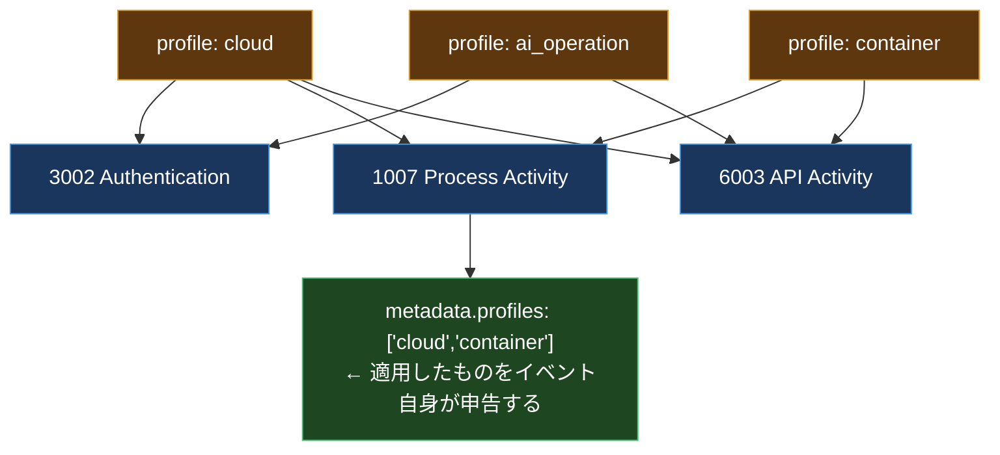
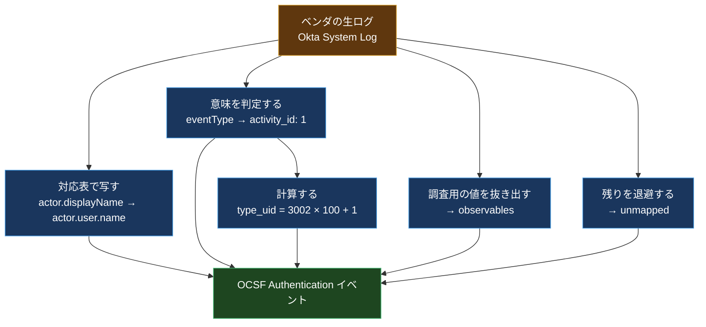

「先週、認証に失敗したアカウントを全部出して」と言われたときの絶望感が、この記事の出発点になっている。

認証は Okta でやっている。サーバには sshd がいる。AWS のコンソールログインは CloudTrail に出る。VPN のログは別の箱にある。Kubernetes の API サーバは監査ログを吐く。

全部「認証の失敗」なのに、書くクエリはこうなる。

```text
(eventType="user.session.start" AND outcome.result="FAILURE")
OR (program="sshd" AND message="Failed password*")
OR (eventName="ConsoleLogin" AND responseElements.ConsoleLogin="Failure")
OR (verb="create" AND objectRef.resource="tokenreviews" AND ...)
OR ...
```

新しい SaaS が入るたびに `OR` が1つ増える。フィールド名も、値の型も、失敗を表す文字列も、全部バラバラ。しかもベンダがログの形式を変えると、黙って壊れる。

この「同じ意味のイベントが、製品ごとに違う形をしている」問題を、業界全体で1つのスキーマに寄せて解こうとしているのが **OCSF (Open Cybersecurity Schema Framework)** だ。

この記事では、OCSF を知らない前提から始めて、スキーマの構造を上から順に分解し、最後に Okta の生ログが実際に OCSF イベントへ変換される様子を公式のマッピング例そのままで追う。スキーマの数値は全部 `schema.ocsf.io` の API から引いたもので、記事執筆時点の最新は **v1.9.0 (2026年8月3日リリース)** になる。

## 前提1: 正規化されていないと、何が壊れるのか

「フィールド名が違うだけでしょ」と思うかもしれない。実際に壊れるのはもっと下のレイヤだ。



問題はクエリが長くなることではなく、**ソースを1つ足すたびに、下流の成果物すべてを直す必要がある**ことだ。検知ルールが200本あれば、200本を見直すことになる。実際にはそこまでやりきれないので、「新しいログソースは既存の検知ルールに乗らない」という状態が常態化する。

正規化とは、この分岐をパイプラインの入口に1回だけ寄せる作業になる。入口で共通の形に変換してしまえば、下流は1つの書き方で済む。

## 前提2: 共通スキーマの試みは前からあった

これは新しい問題ではない。過去の答えを見ておくと、OCSF が何を変えようとしているのかが分かる。

| 名前 | 出自 | 形式 | 限界 |
| --- | --- | --- | --- |
| **CEF** (Common Event Format) | ArcSight | syslog 上のフラットな `key=value` | フィールドが `cs1`, `cs2` のような汎用スロット。意味は運用の口約束 |
| **LEEF** | IBM QRadar | 同上 | 同じ。ベンダ固有 |
| **ASFF** | AWS Security Hub | JSON | AWS の findings 専用。イベント全般をカバーしない |
| **ECS** (Elastic Common Schema) | Elastic | JSON、階層あり | よくできているが単一ベンダ主導。後述 |
| **OCSF** | AWS + Splunk ほか | JSON、階層あり、型と列挙値まで定義 | 後述 |

CEF と LEEF の決定的な弱点は、**意味論がスキーマに入っていない**ことだ。`cs1=admin` と書いてあっても、`cs1` が何を意味するかはスキーマ側に書かれていない。ドキュメントか、担当者の頭の中にある。

ここでよくある誤解を1つ潰しておく。**ECS は OCSF に寄贈されていない。** 2023年に Elastic が ECS を寄贈した先は **OpenTelemetry (CNCF)** で、OTel Semantic Conventions との統合に向かっている。OCSF とは別の系統だ。ECS はいまも独立してバージョンが進んでいる。この2つは「マージした」のではなく、**並走している**。

## OCSF とは何か

- **2022年8月10日、Black Hat USA 2022 で発表**。AWS と Splunk が中心になり、18の企業と組織が名を連ねた
- ゼロから設計されたわけではない。**Symantec (Broadcom) の ICD Schema** が土台になっている
- **2024年11月19日に Linux Foundation のプロジェクト**になった
- ライセンスは Apache 2.0
- Steering Committee と Maintainer によるガバナンス
- 最新は **v1.9.0 (2026年8月3日)**

2番目が地味に効いている。発表時点ですでにベンダのコネクタが書ける完成度だったのは、実運用を経たスキーマを持ち込んだからで、委員会がゼロから設計したものではない。オブジェクトの分け方が妙に実務的なのは、その出自による。

やっていることを一言でいうと、**セキュリティイベントの型定義を JSON で書いて、それをみんなで共有する**。CEF と違って、フィールドの名前・型・取りうる値・必須かどうかまで、機械可読な形で定義されている。

面白いのは、スキーマそのものが GitHub のリポジトリで、Web API としても引ける点だ。ここから先の説明で出てくる数値は全部、こうやって取ってきている。

```bash
curl -s https://schema.ocsf.io/api/version
# {"version":"1.9.0"}
```

## データモデルを上から分解する

OCSF の構造は、大きい方から順にこうなっている。

### 1. Category: 8つの大分類

すべてのイベントは、まず8つのカテゴリのどれかに入る。

```bash
curl -s https://schema.ocsf.io/api/categories
```

| uid | Category | 何が入るか | クラス数 (コア) | 拡張込み |
| --- | --- | --- | --- | --- |
| 1 | System Activity | エンドポイント上で起きること。ファイル、プロセス、カーネル | 12 | 16 |
| 2 | Findings | セキュリティ製品が出した「結論」。検知、脆弱性、コンプライアンス | 8 | 8 |
| 3 | Identity & Access Management | ユーザ、アカウント、セッション、権限 | 8 | 8 |
| 4 | Network Activity | ネットワーク通信とプロトコル | 14 | 14 |
| 5 | Discovery | 資産のインベントリとクエリ結果 | 23 | 26 |
| 6 | Application Activity | アプリケーション層の振る舞い | 8 | 8 |
| 7 | Remediation | 修復の試み | 4 | 4 |
| 8 | Unmanned Systems | ドローンなど | 2 | 2 |

コアと拡張込みで数が違うのは、`schema.ocsf.io` が **既定で Windows / Linux / macOS の拡張を適用した状態を返す**からだ。素の数を見たければ `?extensions=` を空で付ける。

```bash
curl -s "https://schema.ocsf.io/api/categories?extensions=" | jq '.attributes.system.classes | length'
# 12
```

この「ブラウザは既定でいろいろ適用済み」という性質は、後述の Profile でも同じ罠になる。

2 の **Findings** が独立しているのが OCSF の設計で効いているところだと思う。「10.0.0.1 から 443 番に通信した」という**生の観測**と、「これはマルウェアの C2 通信である」という**製品の判断**は、性質がまったく違う。前者は事実で、後者は解釈だ。混ぜると、後で「なぜこれをアラートにしたのか」を追えなくなる。

### 2. Event Class: カテゴリの中の具体的なイベント種別

各カテゴリの下に Event Class がある。`class_uid` は **カテゴリごとに `category_uid * 1000` の帯**に割り当てられている。

ここは正確に書いておきたい。`type_uid` の方は仕様が明示的に計算式を定めているが、`class_uid` の方は違う。スキーマの `class_uid` の説明はこうなっている。

> プロデューサとマッパーは、これをイベントクラス定義の `uid` に設定しなければならない。

つまり **「クラス定義に書いてある値をそのまま使え」としか言っていない**。1000 の帯に並んでいるのは運用上の慣習で、計算して求められるものではない。実際 Discovery には `5001` から `5023` に続いて `5040 Live Evidence Info` がいて、連番にもなっていない。**クラス定義を引くのが唯一の正解**になる。

IAM (category_uid = 3) の中身を見るとこうなる。

| class_uid | Event Class |
| --- | --- |
| 3001 | Account Change |
| 3002 | Authentication |
| 3003 | Authorize Session |
| 3004 | Entity Management |
| 3005 | User Access Management |
| 3006 | Group Management |
| 3007 | User Management |
| 3008 | Role Management |

Network (4) なら 4001 Network Activity, 4002 HTTP Activity, 4003 DNS Activity, 4007 SSH Activity といった具合。冒頭の「認証失敗」は、ソースが Okta だろうと sshd だろうと CloudTrail だろうと、**全部 3002 Authentication** に落ちる。

### 3. Activity と type_uid: クラスの中の「何をしたか」

ここが OCSF の識別子設計でいちばん賢いところ。

各クラスには `activity_id` があって、「そのクラスの中で何が起きたか」を表す。Authentication (3002) ならこうなっている。

| activity_id | Activity |
| --- | --- |
| 0 | Unknown |
| 1 | Logon |
| 2 | Logoff |
| 3 | Authentication Ticket |
| 4 | Service Ticket Request |
| 5 | Service Ticket Renew |
| 6 | Preauth |
| 7 | Account Switch |
| 99 | Other |

そして `type_uid` が、クラスとアクティビティを1つの数値に潰す。仕様の文面はこうだ。

> プロデューサとマッパーは、これを `class_uid * 100 + activity_id` として計算し**なければならない**。スキーマ全体で、イベントクラスとアクティビティの組み合わせを一意に識別する。

図にするとこうなる。



`type_uid` が1つ決まれば、そのイベントの意味と構造が一意に決まる。SIEM 側では `type_uid = 300201` で「あらゆる製品のログオン成功イベント」を横断検索できる。冒頭の `OR` の列が、これ1本になる。

拡張 (Extension) の uid 空間も同じ発想で分けてある。コアリポジトリにある拡張は3つで、`linux` が uid 1、`windows` が uid 2、`macos` が uid 3。Windows 拡張が定義する Registry Key Activity の class_uid は `2 * 100000 + 1001 = 201001` になる。**コアの番号空間と絶対に衝突しない**ように設計されている。

### 4. Base Event: すべてのイベントが持つ共通属性

全クラスは Base Event を継承する。必須属性はこれだけ。

| 属性 | 型 | 意味 |
| --- | --- | --- |
| `time` | timestamp_t | イベントが発生した時刻。**UTC のエポックミリ秒** |
| `class_uid` | integer_t | イベントクラス |
| `category_uid` | integer_t | カテゴリ |
| `activity_id` | integer_t | アクティビティ |
| `type_uid` | long_t | 上記から計算される一意 ID |
| `severity_id` | integer_t | 深刻度 |
| `metadata` | object_t | 出所の情報 |

`time` の定義が丁寧で、仕様にはこう書いてある。「**ソースで実際に活動が起きた時刻**であり、レコードが作成された時刻やシリアライズされた時刻ではない」。取り込み時刻やパイプラインでの処理時刻は `metadata.logged_time` / `metadata.processed_time` に入れる。この区別を最初に強制しておかないと、後でタイムラインを組み立てるときに詰む。

`severity_id` の列挙値も決まっている。

| id | 意味 |
| --- | --- |
| 0 | Unknown |
| 1 | Informational |
| 2 | Low |
| 3 | Medium |
| 4 | High |
| 5 | Critical |
| 6 | Fatal |
| 99 | Other |

各属性には **requirement** という3段階のラベルが付く。`required` (必須)、`recommended` (推奨)、`optional` (任意)。Base Event は required が7個、recommended が12個、optional が34個という配分になっている。「必須は少なく、推奨で品質を上げる」という設計思想が読める。

### 5. Object: 使い回される型

ここが CEF との一番大きな違いになる。OCSF ではフィールドがフラットではなく、**Object という再利用可能な型**で構成されている。



`user` オブジェクトの構造は、Authentication で使われようと Process Activity で使われようと**同じ**。だから「このユーザが関わったイベント」を、クラスをまたいで `actor.user.uid` の1本のクエリで引ける。CEF ならクラスごとに違うスロットに入っていて、こうはいかない。

属性の定義そのものは **Dictionary** (`dictionary.json`) に1箇所だけ書かれていて、各クラスとオブジェクトはそれを参照する。同じ名前のフィールドがスキーマ内で違う意味を持つことがない、という保証がここで効く。

### 6. Profile: クラスをまたぐミックスイン

Profile は「特定の文脈で追加される属性のセット」で、クラスの継承とは直交する。v1.9.0 時点で15個ある。

| Profile | 追加されるもの |
| --- | --- |
| `cloud` | クラウドプロバイダ、アカウント、リージョン |
| `container` | コンテナ、イメージ、オーケストレータ |
| `host` | ホストのデバイス情報 |
| `datetime` | ISO 8601 形式の時刻フィールド |
| `security_control` | 検知製品の判断 |
| `osint` | 脅威インテリジェンスの指標 |
| `network_proxy` / `load_balancer` | 経路上の中間装置 |
| `data_classification` | データの機密区分 |
| `record_integrity` | レコードの暗号学的な証明。v1.9.0 で追加 |
| `ai_operation` | AI モデル / エージェントの情報。v1.8.0 で追加 |
| `trace` | 分散トレースの相関 ID |



重要なのが、**イベント自身が `metadata.profiles` でどのプロファイルを適用したかを申告する**こと。消費側は、そのフィールドを見れば「このイベントに cloud 系の属性が入っているはずだ」と判断できる。属性の有無をいちいち探る必要がない。

なお `schema.ocsf.io` の Web UI と API は、既定で複数のプロファイルを適用した状態を返す。`osint` や `cloud` が required に見えるのはそのためで、生の `events/iam/authentication.json` を読むとクラス固有の required は `user` だけになっている。**スキーマブラウザの表示をそのまま「必須」と読むと間違える**ので、ここは生の JSON を確認したほうがいい。

## 実際に変換してみる: Okta の生ログ

ここまでが構造の話。実物を見る。OCSF の公式リポジトリ `ocsf/examples` に、ベンダごとのマッピング例が入っている。Okta の `user.session.start` を使う。

### 変換前 (Okta System Log)

```json
{
  "actor": {
    "id": "00uttidj01jqL21aM1d6",
    "type": "User",
    "alternateId": "john.doe@example.com",
    "displayName": "John Doe"
  },
  "client": {
    "userAgent": { "rawUserAgent": "Mozilla/5.0 ...", "browser": "CHROME" },
    "device": "Computer",
    "ipAddress": "10.0.0.1",
    "geographicalContext": { "city": "New York", "country": "United States" }
  },
  "device": {
    "id": "guofdhyjex1feOgbN1d9",
    "name": "Mac15,6",
    "os_version": "14.6.0",
    "managed": false,
    "disk_encryption_type": "ALL_INTERNAL_VOLUMES"
  },
  "displayMessage": "User login to Okta",
  "eventType": "user.session.start",
  "published": "2024-08-13T15:58:20.353Z"
}
```

### マッピング表

公式のマッピングは、こういう対応表として書かれている。

| OCSF | Okta の生フィールド |
| --- | --- |
| `actor.user.name` | `actor.displayName` |
| `actor.user.email_addr` | `actor.alternateId` |
| `actor.user.uid` | `actor.id` |
| `actor.session.uid` | `authenticationContext.externalSessionId` |
| `device.uid` | `device.id` |
| `device.name` | `device.name` |
| `message` | `displayMessage` |
| `metadata.event_code` | `eventType` |
| `metadata.uid` | `uuid` |
| `time` | `published` |
| `src_endpoint.ip` | `client.ipAddress` |
| `src_endpoint.location.city` | `client.geographicalContext.city` |
| `http_request.user_agent` | `client.userAgent.rawUserAgent` |

注目してほしいのが、**`eventType` が `metadata.event_code` に行っている**こと。`user.session.start` という Okta 固有の文字列は捨てずに残す。そして「これは Logon である」という判断は `activity_id: 1` として**別に**表現する。ベンダ固有の値と、正規化された意味が両方残る。

### 変換後 (OCSF Authentication)

公式サンプルから主要部分を抜粋する。値はファイルの実物そのままで、`unmapped` と `observables` は後述するので省いている。

```json
{
  "class_uid": 3002,
  "class_name": "Authentication",
  "category_uid": 3,
  "category_name": "Identity & Access Management",
  "activity_id": 1,
  "activity_name": "Logon",
  "type_uid": 300201,
  "type_name": "Authentication: Logon",
  "severity_id": 1,
  "severity": "Informational",
  "status_id": 1,
  "status": "Success",
  "time": 1723564700,
  "time_dt": "2024-08-13T15:58:20.000Z",
  "user": {
    "name": "John Doe",
    "email_addr": "john.doe@example.com",
    "uid": "00uttidj01jqL21aM1d6",
    "type": "User",
    "type_id": 1
  },
  "actor": {
    "user": { "name": "John Doe", "uid": "00uttidj01jqL21aM1d6" },
    "session": { "uid": "idxBager62CSveUkTxvgRtonA" }
  },
  "src_endpoint": {
    "ip": "10.0.0.1",
    "type": "Mobile",
    "os": { "name": "Mac OS X", "type": "macOS", "type_id": 300 },
    "location": { "city": "New York", "country": "United States", "lat": 40.3157 },
    "autonomous_system": { "name": "ASN 0000", "number": 394089 }
  },
  "device": { "name": "Mac15,6", "uid": "guofdhyjex1feOgbN1d9" },
  "metadata": {
    "event_code": "user.sesion.start",
    "product": { "name": "Okta System Log", "vendor_name": "Okta", "version": "0" },
    "profiles": ["datetime", "host"],
    "uid": "dc9fd3c0-598c-11ef-8478-2b7584bf8d5a",
    "version": "1.3.0"
  }
}
```

`type_uid` は `3002 * 100 + 1 = 300201`。仕様の式どおりになっている。

見てほしいのが **`user` と `actor.user` が両方ある**こと。Authentication クラスでクラス固有の必須属性はただ1つ、`user` だった。これは「認証されようとしている主体」で、`actor` は「その操作を実行した主体」になる。今回はセルフサービスのログインなので同じ人だが、管理者が代理でセッションを張った場合は別人になる。**この2つを分けているから「誰が誰にログインさせたか」が表現できる**。

そしてもう1つ。この公式サンプルには、**そのまま真似してはいけない箇所が2つある**。

1. `"time": 1723564700` が **秒**になっている。OCSF の `timestamp_t` の定義は「Epoch からの**ミリ秒**」で、正しくは `1723564700000` 前後になるはずだ。併記されている `time_dt` と突き合わせると秒であることが確認できる
2. `"event_code": "user.sesion.start"` が **`session` の綴りを落としている**。生ログ側は `user.session.start` で正しい

公式のサンプルですらこうなる、というのがマッピング作業の実態をよく表している。`time` の単位は特に事故りやすく、秒とミリ秒を取り違えるとタイムラインが1000倍ずれる。**取り込み時に必ず検証を入れる**べき箇所になる。

### 変換の副産物: observables と unmapped

実際の出力には、あと2つ重要なフィールドが付く。

**`observables`** は、イベントの中に散らばっている「調査で使う値」を1箇所に集めた配列だ。

```json
"observables": [
  { "name": "src_endpoint.ip",         "type": "IP Address",      "type_id": 2,  "value": "10.0.0.1" },
  { "name": "http_request.user_agent", "type": "HTTP User-Agent", "type_id": 16, "value": "Mozilla/5.0 ..." },
  { "name": "actor.user.name",         "type": "User Name",       "type_id": 4,  "value": "John Doe" }
]
```

これが効くのは、脅威ハンティングをするときだ。「この IP アドレスが出てくるイベントを全部出せ」をやりたいとき、IP アドレスはクラスによって `src_endpoint.ip` だったり `dst_endpoint.ip` だったり `device.ip` だったりする。`observables` を舐めれば、**どのクラスのどのフィールドに入っていても1本のクエリで拾える**。`type_id` の種別は v1.9.0 時点で52種類ある。

**`unmapped`** は、OCSF のどの属性にも対応しない生の値を捨てずに置いておく箱だ。

```json
"unmapped": {
  "device": {
    "os_version": "14.6.0",
    "managed": false,
    "disk_encryption_type": "ALL_INTERNAL_VOLUMES",
    "screen_lock_type": "BIOMETRIC"
  },
  "securityContext": { "isProxy": false },
  "transaction": { "id": "ab609228fe84ce59cdcbfa690bgce016" }
}
```

正規化で一番怖いのは「変換で情報が落ちること」で、`unmapped` はその保険になる。標準の枠に収まらなかったものが、少なくとも失われない。

全体の流れを整理するとこうなる。



**単純な写し替えは M1 だけ**で、残りは判断か計算か抽出になっている。マッピングが自動化しきれない理由がここにある。

## スキーマを自分で引く

OCSF のスキーマは全部 API で引けるので、マッピングを書くときは手元から叩くのが早い。

```bash
# バージョン
curl -s https://schema.ocsf.io/api/version

# カテゴリ一覧
curl -s https://schema.ocsf.io/api/categories | jq '.attributes | keys'

# 特定クラスの定義
curl -s https://schema.ocsf.io/api/classes/authentication | jq '.uid, .caption'

# activity_id の取りうる値
curl -s https://schema.ocsf.io/api/classes/authentication \
  | jq '.attributes.activity_id.enum | to_entries[] | "\(.key) \(.value.caption)"'

# 必須属性だけ抜く
curl -s https://schema.ocsf.io/api/classes/authentication \
  | jq -r '.attributes | to_entries[] | select(.value.requirement=="required") | .key'

# オブジェクトの定義
curl -s https://schema.ocsf.io/api/objects/user | jq '.attributes | keys'
```

検証用のツールも公式で用意されている。

| リポジトリ | 言語 | 用途 |
| --- | --- | --- |
| `ocsf/ocsf-validator` | Python | スキーマそのものの妥当性検証 |
| `ocsf/ocsf-lib-py` | Python | OCSF を扱う共通ユーティリティ |
| `ocsf/ocsf-toolkit` | Go | イベントのエンリッチと検証 |
| `ocsf/ocsf-validate-compatibility` | Python | 2バージョン間の後方互換性チェック |
| `ocsf/ocsf-models-java` | Java | スキーマ準拠の POJO |
| `ocsf/ocsf-server` | Elixir | `schema.ocsf.io` そのもの。ローカルで動かせる |

最後の `ocsf-server` は地味に便利で、自社の拡張を書いたときにローカルでスキーマブラウザを立ててレビューできる。

## 現実の話: 誰が使っていて、何がしんどいか

ここからは、導入する前に知っておいたほうがいい部分を書く。

### 使われているところ

一番大きいのが **Amazon Security Lake** で、AWS のログソースを自動で OCSF に変換して S3 に Parquet で置く。対応は具体的にこうなっている。

| ソース | 変換先の Event Class |
| --- | --- |
| CloudTrail Management Events | API Activity / Authentication / Account Change |
| CloudTrail Data Events | API Activity |
| VPC Flow Logs | Network Activity |
| Route 53 Resolver Query Logs | DNS Activity |
| EKS Audit Logs | API Activity |
| AWS WAFv2 | HTTP Activity |
| Security Hub CSPM | Vulnerability / Compliance / Detection Finding |

CloudTrail の管理イベントが**3つのクラスに割れる**のが、OCSF の考え方をよく表している。`ConsoleLogin` は Authentication で、`CreateUser` は Account Change で、それ以外の API 呼び出しは API Activity。生ログでは全部「CloudTrail のイベント」でしかなかったものが、意味で分類される。

ただし、ここに現実的な注意点がある。**Security Lake が出力する `metadata.version` は `1.1.0`** だ。OCSF 本体は v1.9.0 なので、かなり離れている。「OCSF 対応」と書いてある製品が、どのバージョンの OCSF なのかは必ず確認したほうがいい。

### しんどいところ

正直に書くと、OCSF を入れる作業の大半は「マッピングを書いて、保守すること」になる。

**1. マッピングは手作業が残る。** 前掲の変換フロー図のとおり、単純な写し替え以外は判断が要る。Okta の `eventType` は多数あるが、そのどれをどの class と activity に落とすかは人が決めるしかない。`user.session.start` が Authentication の Logon だという対応は、スキーマからは導けない。

**2. 上流が黙って変わる。** CrowdStrike、Okta、Microsoft、Palo Alto。それぞれが独自のリリースサイクルでログ形式を変える。事前告知の義務はどこにもない。マッピングが壊れると検知パイプラインが止まる。

**3. コストが無視できない。** Synqly が2026年に Doug Cahill と行った調査では、複数のセキュリティエンジニアリング責任者が、**統合作業の30から40%がスキーマのマッピングと正規化に費やされている**と回答している。統合ロジックそのものではなく、その手前で消えている。

**4. ベンダの温度差がある。** OCSF は任意の標準で、ネイティブスキーマとして採用するか、エクスポート形式として対応するか、無視するかはベンダの自由だ。同じ調査では、全面的にコミットしているベンダと、自分がアグリゲータになりたいので抵抗しているベンダに割れている、という結果が出ている。

**5. 「OCSF 準拠」でも解釈がずれる。** 同じフィールドを違う意味で使ったり、イベントの粒度が違ったりする。準拠は0か1かではなく、程度の問題になる。

これらを踏まえると、**「OCSF に統一する」ではなく「OCSF に寄せていく」**というのが現実的な目標設定になる。全ソースを一度に変換するのではなく、検知ルールの本数が多いソースから順に寄せて、下流の分岐を減らしていく。

## v1.9.0 で入った AI 周りの話

最新版の内容にも触れておく。ここ2バージョンで、AI エージェントを扱うための語彙が入った。

**`ai_operation` プロファイル** (v1.8.0)。モデル名やトークン数など、AI の操作に固有の属性を追加する。中身は `ai_agent` / `ai_model` / `delegation` / `message_context` の4つ。

**`ai_agent` オブジェクト** (v1.9.0)。定義がはっきりしていて、こう書いてある。

> 委譲された権限のもとでタスクを実行する自律的な AI エージェント。セキュリティセンサ (EDR や DLP など) を表す OCSF の `agent` オブジェクトとも、人間のプリンシパルとも区別される。

`agent` (EDR などのセンサ) と `ai_agent` (自律的に動く AI) を明確に別物として定義しているのがいい。属性には `ai_model`、`charter` (そのエージェントの役割)、`instance_uid` などが入る。

そして **`delegation` オブジェクト**。「誰の権限で動いているか」を表す。エージェントが人間の代理で操作したとき、ログに「エージェント A が、ユーザ B の委譲を受けて、この API を叩いた」と残せる。

もう1つ、AI とは別だが v1.9.0 で面白いのが **`record_integrity` プロファイル**だ。base event に適用されるので、どのクラスでも使える。

中身は `attestation` オブジェクトで、イベントの `fingerprint` とそれに対する `signatures` を持つ。さらに `prev_event` と `chain_uid` があって、**前のイベントの fingerprint を参照する**構造になっている。

```text
event N-1  ─ fingerprint: abc...
                  ▲
event N    ─ prev_event.fingerprint: abc...
           ─ fingerprint: def...
                  ▲
event N+1  ─ prev_event.fingerprint: def...
```

つまり、ログのストリームに**改ざん検知チェーンを張れる**。イベントを1件抜いたり書き換えたりすると、後続の `prev_event` が合わなくなる。監査ログの完全性を、ログ基盤の外側で検証できるようになる。

他に v1.9.0 では `user_management` / `role_management` / `clipboard_activity` / `device_power_state_activity` のクラス、DNS Activity の構造化 (`dns_resource_record` / `dns_section` / `tsig`) などが入っている。

## まとめ

- OCSF はセキュリティイベントの共通スキーマ。2024年11月から Linux Foundation プロジェクト、Apache 2.0、最新は v1.9.0 (2026年8月3日)
- 構造は **Category (8個) → Event Class → Activity** の3階層。`type_uid = class_uid * 100 + activity_id` は仕様が定める計算式だが、`class_uid` の方は計算式ではなくクラス定義に書かれた値。1000 の帯に並んでいるのは慣習
- 公式のサンプルにも `time` の単位ずれと綴りミスがある。取り込み時の検証は必須
- `type_uid` が決まればイベントの意味と構造が一意に決まる。製品をまたいだ横断検索がこれ1本でできる
- **Object** で型を使い回し、**Dictionary** で定義を1箇所に集め、**Profile** でクラス横断の属性セットを足し、**Extension** は `uid * 100000` で番号空間を分ける
- 変換出力には `observables` (調査用の値を集約) と `unmapped` (対応先のない生データを退避) が付く。後者があるので情報が落ちない
- CEF / LEEF との違いは**意味論がスキーマに入っていること**。ECS は OCSF ではなく OpenTelemetry に寄贈されており、別系統として並走している
- しんどいのはマッピングの作成と保守。統合作業の30から40%がここに消えるという調査結果がある。上流のログ形式変更で黙って壊れる
- 「OCSF 対応」を名乗る製品でも準拠バージョンはばらつく。Amazon Security Lake の出力は `1.1.0`

まず手を動かすなら、自分が一番よく使っているログソースを1つ選んで、`curl -s https://schema.ocsf.io/api/classes/<class名>` で必須属性を出して、対応表を10行だけ書いてみるのがいい。10行書くと、「機械的に写せる部分」と「意味を判断しないといけない部分」の比率が体感でわかる。OCSF の導入コストは、ほぼその比率で決まる。

## 参考

- [OCSF 公式サイト](https://ocsf.io/)
- [ocsf/ocsf-schema (GitHub)](https://github.com/ocsf/ocsf-schema)
- [OCSF スキーマブラウザと API](https://schema.ocsf.io/)
- [ocsf/examples: ベンダ別のマッピング例](https://github.com/ocsf/examples)
- [Open Cybersecurity Schema Framework (OCSF) in Security Lake | AWS Docs](https://docs.aws.amazon.com/security-lake/latest/userguide/open-cybersecurity-schema-framework.html)
- [Announcing the ECS and OpenTelemetry Semantic Convention Convergence | OpenTelemetry](https://opentelemetry.io/blog/2023/ecs-otel-semconv-convergence/)
