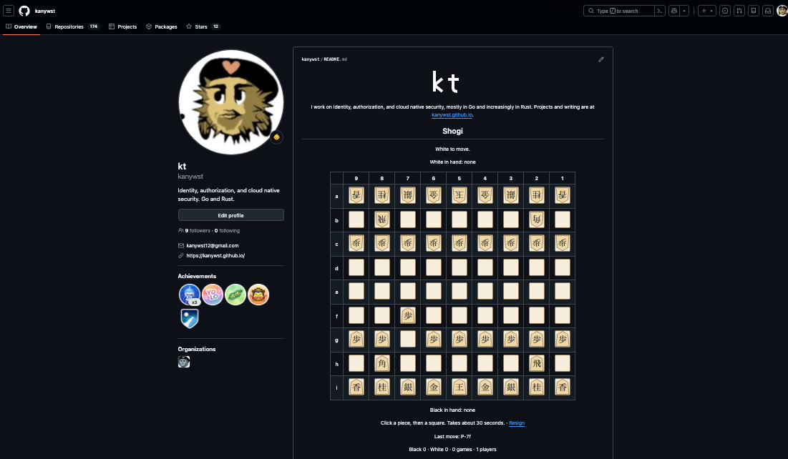
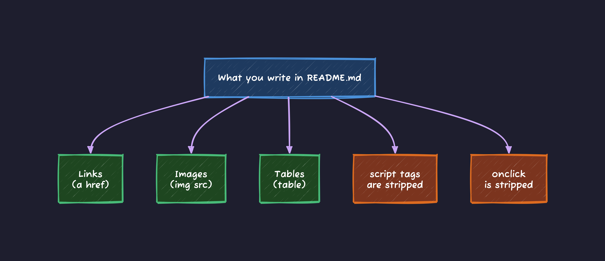
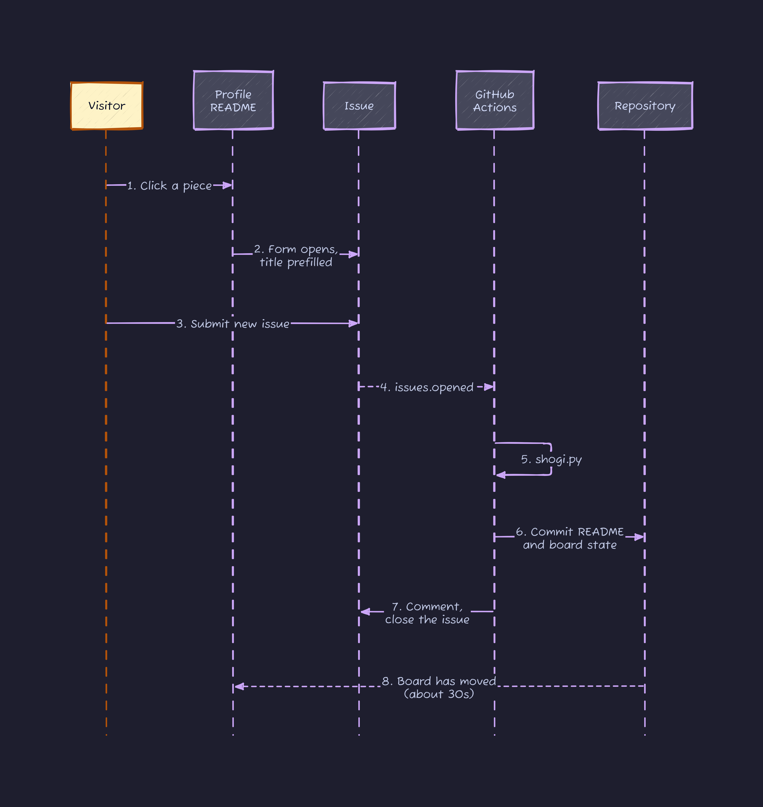
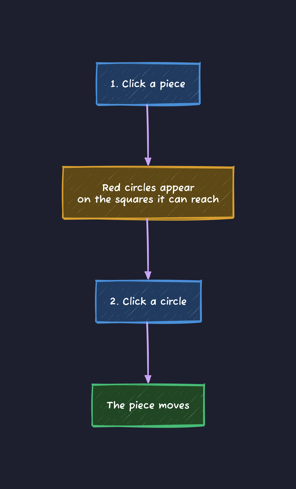

## Introduction

There is a shogi board on my GitHub profile. Click a piece and you play a move.



<https://github.com/kanywst>

Your opponent is not me. It is whoever wanders by next. Someone plays for Black, someone else plays for White, and a game slowly happens between strangers.

This started because I could not decide what to put on my profile README. A skill list, GitHub Stats badges, the snake eating my contribution graph. I have seen all of them, and I look at all of them exactly once. I wanted something a visitor could actually do.

## If you have never played shogi

Two things from the game matter for the rest of this post.

Squares are named by file and rank, so `7g` is one specific square, and `7g7f` means the piece on `7g` moves to `7f`. And unlike chess, a captured piece does not leave the game: it becomes yours, and on a later turn you can drop it back onto almost any empty square instead of moving something. That second rule is what makes the number of possible moves explode, which turns out to decide the whole interface.

## A profile README is just a repository

GitHub has a rule where a repository named after your username gets its `README.md` rendered at the top of your profile page. For me that is `kanywst/kanywst`.

It is an ordinary repository, so GitHub Actions runs in it. If an Action rewrites `README.md` and commits, the profile page changes with it.

```text
kanywst/kanywst (an ordinary repository)
  └─ README.md ──────> rendered at github.com/kanywst
       ▲
       └── GitHub Actions can rewrite it
```

## No JavaScript runs in a README

GitHub sanitizes the README before rendering it. You can check exactly what happens through the markdown API:

```bash
gh api /markdown -f mode=gfm \
  -f text='<div style="color:red" onclick="x()">A</div><script>alert(1)</script>'
```

```html
<div>A</div>&lt;script&gt;alert(1)&lt;/script&gt;
```

The `style` and `onclick` attributes are gone, and the script tag comes back escaped, so it renders as visible text instead of running. "Click this and something happens" is not available in the usual way.

What survives is roughly links, images, and tables.



So the only action a visitor can take is following a link, and the only way to receive input is a URL.

## An Issue can be pre-filled from a URL

GitHub's new-issue page accepts query parameters, so you can open it with the title already typed in.

```text
https://github.com/kanywst/kanywst/issues/new?title=shogi%7Cmv+7g7f
                                              └────────┬────────┘
                              opens the form with "shogi|mv 7g7f" already in it
```

The visitor presses the green "Submit new issue" button. That is the whole interaction. Nothing to type.

Once the issue exists, an `issues.opened` event fires, and that starts the Action. The whole round trip looks like this.



Following one link is one move.

## The board is 81 links

The board is a `<table>` where each square is a `<td>`, and every square holds an image wrapped in a link.

```html
<td><a href="new-issue URL"></a></td>
```

The piece images are not generated. There are 58 static SVGs sitting in `.github/koma/`, and the board state is expressed purely by which files get placed where. White's pieces are Black's pieces rotated 180 degrees, because orientation is the only way to tell the two sides apart on a shogi board.

Depending on the state of a square, the link points at one of three things.

| State of the square | Link target | Meaning |
| --- | --- | --- |
| A square the selected piece can reach | `?title=shogi\|mv 7g7f` | move here |
| A piece belonging to the side to move | `?title=shogi\|sel 7g` | select this piece |
| Anything else | `#shogi` | nothing happens |

Even a dead square needs that third link. If you leave an image unwrapped, GitHub wraps it for you and points it at the image file:

```html
<a target="_blank" rel="noopener noreferrer" href="y.svg"></a>
```

A visitor who taps an empty square would land on a raw SVG with no way back to the profile. Sending them to `#shogi` costs nothing and keeps them on the board.

## Two clicks, not one

The obvious design is one link per legal move, so a single click plays a move. Shogi has too many moves for that. I counted 1125 positions from random games: the median was 40 legal moves and the maximum was 167. Pieces in hand are the reason. Holding one pawn means every empty square is potentially another move.

There are only 81 squares to hang links on, so that does not fit. So the move takes two steps instead.



Now the number of links on screen is either how many pieces you own or how many squares the selected piece can reach, and neither can exceed the number of squares. It ends up feeling like [marcizhu/marcizhu](https://github.com/marcizhu/marcizhu), which does the same thing with chess.

Illegal moves never get a circle, so the rules live entirely in what the board offers you. To check that the move generator was not lying, I counted the legal moves in the starting position and got 30, which is the known value for shogi.

## Red circles alone did not communicate anything

This part I fixed after publishing. Someone looked at the board while a piece was selected and told me the circle made no sense.

They were right. One red circle floats in the middle of the board, and nothing on the board says which piece it belongs to. The real problem was that **the selected piece still looked like an ordinary piece**.

In a normal web app you would put a CSS class on the selected square and be done. Here the sanitizer eats `style`, as the API call earlier showed. The only thing left under my control is which file goes in ``.

So every piece image now has a second version with a red frame around the square. The frame is the same red as the destination circles, so "this piece goes to those circles" connects at a glance.

Adding 28 images to replace one line of CSS is a bad trade everywhere except here.

## Wrapping up

No server, no database. The position lives in a single JSON file committed to the repository, and every move is recorded as a commit named `shogi: move by @someone`.

The part I like is that the players swap out asynchronously. Whoever plays Black and whoever plays White are probably different people who will never meet, and the game continues anyway.

As a thing to put on a profile, I think it says more than a skill list does.

The board is one move in right now. If you pass by, play one.

Let's play shogi.

<https://github.com/kanywst>
