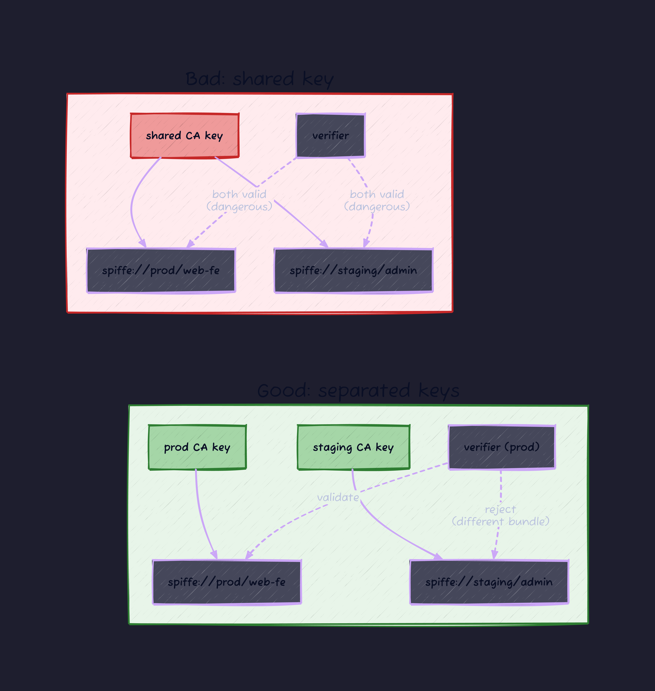

# Introduction

"This is SPIFFE compliant." "Our implementation is SPIFFE-compatible." Read the SPIRE, Istio, or Cilium docs and you bump into these phrases everywhere. But if you actually stop and ask what compliance means, the answer is surprisingly hard to nail down.

- If I run SPIRE, am I SPIFFE compliant?
- If I roll my own, what do I have to ship to call it compliant?
- Does an SVID have to support both X.509 and JWT? Or is one enough?
- Is there an official conformance test you can point at?

A lot of people use the word without checking. I was one of them.

So I cloned the upstream spec repo (`github.com/spiffe/spiffe`) and read every document from top to bottom. What follows are my notes, organized around the question "what does the spec actually require?"

```bash
git clone https://github.com/spiffe/spiffe.git ~/spiffe
ls ~/spiffe/standards/
# JWT-SVID.md
# SPIFFE-ID.md
# SPIFFE.md
# SPIFFE_Federation.md
# SPIFFE_Trust_Domain_and_Bundle.md
# SPIFFE_Workload_API.md
# SPIFFE_Workload_Endpoint.md
# X509-SVID.md
# workloadapi.proto
```

Eight specs total. Read them in order and each one spells out where the hard requirements end and the soft suggestions begin. I'll pull out the load-bearing parts.

---

## 0. Prerequisites

A few terms before we go any further. Skip this section if you've touched SPIFFE/SPIRE before.

### What "workload identity" means

A way to cryptographically prove "who you are" to a workload (a process or container). IP addresses and hostnames can be spoofed. Kubernetes labels can be rewritten. Instead, a trusted **Certificate Authority (CA)** signs a certificate or token that the workload presents, and verifiers check the signature.

To distinguish this from human identity (the account you log into via OAuth), it's increasingly called **Workload Identity** or **Non-Human Identity (NHI)**.

### URI basics (RFC 3986)

We'll be dealing with strings like `spiffe://example.com/payments/web-fe`, so a quick refresher on URI structure.

```text
spiffe://example.com/payments/web-fe
  |        |              |
scheme  authority        path
```

In SPIFFE the scheme is fixed at `spiffe`, the authority is the **Trust Domain**, and everything after that is the **Workload Path**.

### X.509, mTLS, JWT, JWS, JWK

Signed data structures, or representations of keys.

- **X.509**: the certificate format TLS uses. Binary (DER) or PEM encoded.
- **mTLS (mutual TLS)**: both client and server present X.509 certificates and verify each other. Plain TLS only verifies the server.
- **JWT** (RFC 7519): a token made of JSON pieces joined with Base64URL. Common on the web.
- **JWS** (RFC 7515): the structure that signs the JWT payload. **A JWT requires a JWS to exist.** When the SPIFFE spec says "JWS Compact Serialization," it means the normal JWT layout: `header.payload.signature` joined with dots.
- **JWK** (RFC 7517): a JSON representation of a public (or private) key. Looks like `{"kty":"RSA", "n":"...", "e":"AQAB"}`.
- **JWKS (JWK Set)**: a JSON array bundling multiple JWKs. If you've ever fetched `/.well-known/jwks.json` in OAuth/OIDC, you've seen one.
- **Bearer Token**: a token where possession alone grants access. Steal it, use it. JWTs are typically bearer tokens.

The SPIFFE spec stacks a SPIFFE ID on top of these and calls the result an **SVID (SPIFFE Verifiable Identity Document)**:

- X.509 based → **X.509-SVID**
- JWT/JWS based → **JWT-SVID**
- Distribution of trust roots (CA keys) → **SPIFFE Bundle** (a JWKS underneath)

### gRPC and Unix Domain Sockets

- **gRPC**: an RPC framework that pushes Protocol Buffers over HTTP/2.
- **Unix Domain Socket (UDS)**: an inter-process socket on the local host. You reach it by filesystem path (for example `/run/spire/agent.sock`).

The Workload API ships over these two together.

---

## 1. The Shape of SPIFFE: Three Pillars

The SPIFFE spec set, in one sentence:

> **"Hand the workload a `spiffe://...` ID, issue a verifiable document (SVID) that carries it, and serve it through a local API."**

The three pieces (ID, document, API) each get their own spec document.

| Pillar              | Document                            | Role                                                |
| :------------------ | :---------------------------------- | :-------------------------------------------------- |
| 1. SPIFFE ID        | `SPIFFE-ID.md`                      | Defines the workload namespace                      |
| 2. SVID (X.509)     | `X509-SVID.md`                      | How to carry a SPIFFE ID in an X.509 certificate    |
| 2. SVID (JWT)       | `JWT-SVID.md`                       | How to carry a SPIFFE ID in a JWT                   |
| 3. Workload API     | `SPIFFE_Workload_API.md`            | gRPC service that issues SVIDs                      |
| 3. Workload Endpoint| `SPIFFE_Workload_Endpoint.md`       | Conventions for the socket that exposes the API     |
| Extra               | `SPIFFE_Trust_Domain_and_Bundle.md` | How to represent trust roots (CA keys)              |
| Extra               | `SPIFFE_Federation.md`              | How separate Trust Domains link up                  |

You don't actually have to satisfy all of these to call yourself SPIFFE compliant. The next section explains why.

---

## 2. What the Spec Itself Says "Compliant" Means

This one sentence at the end of `SPIFFE-ID.md` Section 1 does a lot of work:

> Conformance with this document is sufficient for the purposes of SPIFFE compliance.

Meet `SPIFFE-ID.md` and you can claim SPIFFE compliance. That's it. The Workload API, the Trust Bundle, the Federation spec, none of them are required by the letter of the spec.

That's the formal floor. In practice:

- An ID by itself is useless without an **SVID** carrying it.
- An SVID is useless without a **Workload API** to deliver it.
- And neither is verifiable across hosts or trust domains without a **Bundle** representing the trust root.

"Practically SPIFFE compliant" means the three core specs plus Bundle, four documents total. If you cross trust domains, add **Federation** to that list.

The rest of this article walks through the MUST requirements of each one.

---

## 3. SPIFFE ID: How You Name Things

### 3.1 Anatomy of the URI

A SPIFFE ID is an RFC 3986 URI with a fixed shape.

```text
spiffe://trust-domain-name/path/segments
```

Pull out everything the spec marks MUST or MUST NOT and you get:

| Requirement                              | Level          | Detail                          |
| :--------------------------------------- | :------------- | :------------------------------ |
| Scheme is fixed at `spiffe`              | MUST           | Case-insensitive                |
| Trust domain name is non-empty           | MUST           | The `host` component            |
| No `userinfo`                            | MUST NOT       | `spiffe://user:pass@td/` is out |
| No `port`                                | MUST NOT       | `spiffe://td:8080/` is out      |
| Trust domain name is lowercase           | MUST           | `Example.com` is out            |
| Trust domain charset is `[a-z0-9.-_]`    | MUST           | Percent-encoding is out         |
| No `query` or `fragment`                 | MUST NOT       | `?key=val` and `#frag` are out  |
| No trailing slash on the path            | MUST NOT       | `spiffe://td/foo/` is out       |
| No `.` or `..` segments                  | MUST NOT       | Relative path tokens forbidden  |
| Whole URI under 2048 bytes               | MUST (SHOULD)  | Full URI length                 |
| Trust domain name under 255 bytes        | MUST           | RFC 3986 host limit             |

### 3.2 Trust Domain Names Are Unregulated

The spec is up front about this:

> Trust domain operators are free to choose any trust domain name they find suitable: there is no centralized authority for regulation or registration of trust domain names.

Unlike DNS, there is no registry. Anyone can call themselves `example.com`.

So what happens when two parties pick the same name?

> When a collision does occur, those trust domains will continue to operate independently but will be unable to federate.

While they stay independent, nothing breaks. The moment they try to federate (link up across trust domains), the two sides hold different keys, so neither can verify the other's certificates. They just fail to connect.

The practical workaround is to use a DNS name you already own. If you're auto-generating, a UUID works.

### 3.3 Path Design

What the path means is up to the implementer. The spec gives three example patterns:

- **Pattern A, identify the service directly**: `spiffe://staging.example.com/payments/mysql`
- **Pattern B, mirror the orchestrator's ID structure**: `spiffe://k8s-west.example.com/ns/staging/sa/default`
- **Pattern C, opaque**: `spiffe://example.com/9eebccd2-12bf-40a6-b262-65fe0487d453` (metadata managed elsewhere)

SPIRE's default on Kubernetes is Pattern B (`/ns/<namespace>/sa/<service-account>`), and that's close to the de facto convention. It maps Kubernetes Pod Identity directly, so the operational view stays legible.

---

## 4. SVID: X.509 Profile Requirements

### 4.1 An X.509-SVID Is Just an X.509 Certificate With a URI SAN

Read `X509-SVID.md` and there are no new fields. **It's a normal X.509 certificate with rules layered on top about how to use the existing ones.**

The core rule is simple: **the Subject Alternative Name extension's URI type holds exactly one SPIFFE ID**. Everything else (`Subject`, `Basic Constraints`, `Key Usage`, `Extended Key Usage`) carries its usual X.509 meaning. **The spec only constrains which values are legal for SPIFFE use.**

### 4.2 Leaf SVID vs Signing SVID

The X.509 field values differ between Leaf and Signing.

| Field                          | Leaf SVID                                | Signing SVID (CA)               |
| :----------------------------- | :--------------------------------------- | :------------------------------ |
| `cA` (Basic Constraints)       | `false` MUST                             | `true` MUST                     |
| `keyCertSign` (Key Usage)      | MUST NOT                                 | MUST                            |
| `cRLSign` (Key Usage)          | MUST NOT                                 | MAY                             |
| `digitalSignature` (Key Usage) | MUST                                     | (not specified)                 |
| SPIFFE ID path                 | Non-root (at least one segment) MUST     | No path (`spiffe://td`) SHOULD  |
| Number of URI SANs             | Exactly one MUST                         | Exactly one MUST                |

A Leaf SVID can sign (mTLS client auth, API request signing) but cannot issue certificates for other parties. Same position as an ordinary client certificate.

### 4.3 Extra Checks at Validation Time

Section 5.2 of `X509-SVID.md` makes it clear that **standard X.509 path validation is not enough**. Using a certificate as an SVID requires these additional checks.


Forget these and you open the door to vulnerabilities like an intermediate CA being used as a leaf certificate. Libraries like `go-spiffe/v2` handle this for you. Only worry about it when writing your own.

---

## 5. SVID: JWT Profile Requirements

### 5.1 A JWT-SVID Is Just a JWS

From Section 1 of `JWT-SVID.md`:

> JWT-SVIDs are standard JWT tokens with a handful of restrictions applied.

A normal JWT with a few extra constraints, nothing more. Format is JWS Compact Serialization (the `header.payload.signature` layout). JWS JSON Serialization is **MUST NOT**.

### 5.2 The Core Restriction: Reject `alg: none`

JWT has a well-known footgun: set `alg` to `none` in the header and the token sails through unverified.

The JWT-SVID spec pins `alg` to one of these nine values.

| `alg` value           | Algorithm               |
| :-------------------- | :---------------------- |
| RS256 / RS384 / RS512 | RSASSA-PKCS1-v1_5 + SHA |
| PS256 / PS384 / PS512 | RSASSA-PSS + SHA        |
| ES256 / ES384 / ES512 | ECDSA + SHA             |

Anything else (especially `none` or the symmetric `HS*` family) **MUST be rejected**. That single rule closes off most of the classic JOSE vulnerability surface.

Required claims:

- `sub`: the SPIFFE ID of the workload.
- `aud`: at least one audience.
- `exp`: expiry.

`kid` is optional in the header but required on the Bundle JWK side so verifiers can pick the right key.

### 5.3 Always Check `aud`

JWT-SVID is a bearer token. Anyone holding it can use it. To soften that blow:

- `aud` MUST be set.
- The receiver MUST check that its own ID is in `aud`.
- Single audience strongly recommended.

The example in Section 7.2 of the spec shows the failure mode:

> if Alice has a token with audiences Bob and Chuck, and transmits that token to Chuck, then Chuck can impersonate Alice by sending the same token to Bob.

Alice issues a token addressed to both Bob and Chuck. Chuck replays it to Bob and impersonates Alice. **One token, one audience. That's the rule.**

---

## 6. Workload API: How SVIDs Get Delivered

### 6.1 gRPC, Local Only

`SPIFFE_Workload_Endpoint.md`, summarized: the Workload API is a gRPC endpoint on a Unix Domain Socket (or localhost TCP) within the same host. In practice, the SPIRE Agent running on each node binds to `/run/spire/agent.sock`, and every container on that host talks to it over gRPC. The Agent handles the conversation with the SPIRE Server (the central CA) over a separate network. The workload itself never reaches the outside.

The MUSTs around transport and accessibility:

| Requirement                                | Detail                                                                                                              |
| :----------------------------------------- | :------------------------------------------------------------------------------------------------------------------ |
| gRPC required                              | Prefer UDS over TCP (SHOULD)                                                                                        |
| No TLS                                     | In fact, MUST NOT require it. At bootstrap the workload has no trust root yet.                                      |
| Confined to one host                       | SHOULD (don't make it reachable from other hosts)                                                                   |
| `workload.spiffe.io: true` metadata        | MUST (SSRF defense)                                                                                                 |
| No authentication handshake                | MUST NOT require one. Caller is identified at the OS layer instead.                                                 |

That last point is unusual. A typical gRPC service authenticates clients via certificates or tokens. The Workload API flips that: the workload doesn't announce itself, the server identifies it via the OS. This identification flow is called **Workload Attestation**. Concretely:

- Fetch the connecting PID from the UDS via `getpeerucred` (or equivalent).
- Inspect the PID's cgroup, or query the Kubernetes API server.
- Conclude "you're the web-fe container in pod foo-bar-1234."
- Issue the SPIFFE ID that container should hold.

### 6.2 Five RPCs Across Two Profiles

The Workload API has two profiles (X.509 and JWT) and five RPCs between them.

| Profile | RPC                | Mode    | What it returns                          |
| :------ | :----------------- | :------ | :--------------------------------------- |
| X.509   | `FetchX509SVID`    | stream  | SVID + Bundle                            |
| X.509   | `FetchX509Bundles` | stream  | Bundles only                             |
| JWT     | `FetchJWTSVID`     | unary   | JWT for a given audience                 |
| JWT     | `FetchJWTBundles`  | stream  | JWKS                                     |
| JWT     | `ValidateJWTSVID`  | unary   | Delegate JWT verification to the server  |

From Section 1 of `SPIFFE_Workload_API.md`:

> Both profiles are mandatory and MUST be supported by SPIFFE implementations. However, operators MAY administratively disable a specific profile in their deployment.

A SPIFFE-compliant Workload API has to implement both X.509 and JWT profiles (the operator is allowed to turn one off in their deployment). This bites in practice. Even popular OSS libraries often bolt JWT on later.

### 6.3 Why It Streams

`FetchX509SVID`, `FetchJWTBundles`, and `FetchX509Bundles` return as gRPC server-side streams so the server can push:

- New certificates during key rotation.
- CRL (revocation list) updates.
- New state without the workload paying reconnect cost.

The client **SHOULD keep the connection open**.


Every message ships the full current state, not a delta (spec sections 4.3 and 4.4). That sidesteps the whole anti-entropy headache of incremental sync.

### 6.4 Discovery: `SPIFFE_ENDPOINT_SOCKET`

How does a client find the Workload API? From spec section 4:

> Clients may be explicitly configured with the socket location, or may utilize the well-known environment variable `SPIFFE_ENDPOINT_SOCKET`. If not explicitly configured, conforming clients MUST fall back to the environment variable.

Without explicit configuration, look at `SPIFFE_ENDPOINT_SOCKET`. The value is URI-formatted.

```bash
# Unix Domain Socket
export SPIFFE_ENDPOINT_SOCKET=unix:///run/spire/agent.sock

# TCP (only on hosts with a specific reason)
export SPIFFE_ENDPOINT_SOCKET=tcp://127.0.0.1:8000
```

Official libraries like `go-spiffe/v2` do this automatically.

---

## 7. Trust Domain and Bundle: Building the Trust Root

### 7.1 A Bundle Is a Keyring Shaped Like a JWKS

`SPIFFE_Trust_Domain_and_Bundle.md` in one line: **SPIFFE Bundle = RFC 7517 JWK Set + SPIFFE-specific metadata**.

JWKS is the same format you've seen as `/.well-known/jwks.json` on Cognito, Auth0, and Google Identity Platform. The SPIFFE Bundle extends it to hold both X.509 CA certificates and JWT signing keys.

```json
{
  "spiffe_sequence": 12035488,
  "spiffe_refresh_hint": 2419200,
  "keys": [
    {
      "kty": "RSA",
      "use": "x509-svid",
      "x5c": ["<base64 DER encoding of X.509 CA cert>"],
      "n": "<base64urlUint-encoded modulus>",
      "e": "AQAB"
    },
    {
      "kty": "RSA",
      "kid": "<JWT key id>",
      "use": "jwt-svid",
      "n": "<base64urlUint-encoded modulus>",
      "e": "AQAB"
    }
  ]
}
```

Two things are unique to a SPIFFE Bundle:

- **`use` parameter**: MUST be either `x509-svid` or `jwt-svid`. Without it the verifier can't tell which kind of SVID the key validates.
- **`spiffe_sequence`**: monotonically increasing counter. Increments every time the Bundle is updated.

### 7.2 Keep Trust Domains Isolated

Section 6.2 of the Bundle spec:

> When a root key is shared across multiple trust domains, it becomes critically important that authentication and authorization implementations carefully check the trust domain name component of an identity.

Don't share keys across trust domains. If you do, verifiers had better check the trust domain name strictly, or an SVID from the wrong trust domain becomes a forgery vector.



One trust domain, one independent set of keys. That's the iron rule of SPIFFE operations.

### 7.3 Key Rotation: Add First, Remove Later

Bundle updates work as "add the new one, then remove the old." The Bundle moves through four states:

| Phase      | Bundle contents | Issuer signs new SVIDs with | Verifier accepts SVIDs signed by |
| :--------- | :-------------- | :-------------------------- | :------------------------------- |
| Initial    | `[K1]`          | K1                          | K1                               |
| Add K2     | `[K1, K2]`      | K1 (still)                  | K1 or K2                         |
| Switch     | `[K1, K2]`      | K2                          | K1 or K2                         |
| Drop K1    | `[K2]`          | K2                          | K2                               |

`spiffe_refresh_hint` (seconds) controls how often the workload re-fetches the Bundle. The spec's example value is 28 days (2419200 seconds), which is far too long if revocation matters. In practice, 5 minutes to 1 hour is the realistic production range.

---

## 8. What Existing Implementations Actually Cover

### 8.1 SPIRE

The reference implementation. Satisfies every item by definition. Workload API streaming, JWT-SVID ValidateJWTSVID delegation, the whole list.

### 8.2 Istio

Istio holds the workload's SVID inside each sidecar (Envoy). The on-the-wire interface to Envoy is **SDS (Secret Discovery Service)**, which is an Envoy upstream API, not Istio-specific. From a SPIFFE-compliance standpoint, the relevant fact is that Istio's istio-agent feeds SVIDs into Envoy via SDS rather than exposing the SPIFFE Workload API to workloads. The payload format is SPIFFE-compatible, but the Workload Endpoint spec is not implemented.

Istio can also be wired to use a SPIRE-backed SDS server. In that setup SPIRE is the CA, and the Workload Endpoint spec becomes implemented through SPIRE.

### 8.3 Cilium

Cilium has two unrelated paths that get conflated under the SPIFFE label, and they need to be kept apart.

**Path 1, SPIRE-backed Mutual Authentication (Beta since v1.14, still Beta in v1.19)**. Cilium auto-deploys a SPIRE Agent on each node and rides on top. Cilium itself doesn't implement the SPIFFE spec directly. It wraps SPIRE. This path is opt-in (`authentication.mutual.spire.enabled=true`) and has been since v1.14.

**Path 2, ztunnel-based transparent mTLS (Beta, added v1.19)**. Cilium picked up the same ztunnel data plane Istio ambient mode uses. Per the Cilium docs, ztunnel's certificates are generated via OpenSSL and stored as Kubernetes Secrets. SPIRE is not in the loop, and the docs do not claim SPIFFE compliance for this mode. Whether the certificates carry SPIFFE IDs in their SANs is an implementation detail I haven't verified, so don't take "Cilium ztunnel is SPIFFE compliant" as a settled claim.

If someone says "Cilium is SPIFFE compliant", ask which feature: the SPIRE-backed mutual auth, or ztunnel.

So when a doc says "Istio is SPIFFE compliant", read it as "the SVID format is compliant, the Workload Endpoint spec is not." Same caution applies to Cilium plus the version question.

---

## 9. 2026 Updates: Recent Spec Movement

Tracking the `spiffe/spiffe` repo, a couple of things have moved since late 2025.

- **`draft-wit-svid` branch, active since late 2025**. A candidate successor to JWT-SVID aimed at integration with IETF's WIMSE (Workload Identity in Multi-System Environments) work. PR #361 ("Introduce WIT-SVID Token Document") landed on the branch 2026-01-21. Two changes worth noting: WIT-SVID makes Proof of Possession via the `cnf` claim mandatory (RFC 7800 confirmation), structurally closing off the bearer-token replay risk of JWT-SVID; and PR #372 (2026-01-26) prohibits the `aud` claim entirely (audience scoping is delegated to the PoP layer). Still an experimental branch, not on main, so I don't count it toward "compliance" yet.
- **PR #381, merged 2026-03-26**. "Strengthen validation language, and clarify leaf SPIFFE ID requirements." Tightens the path requirements and validation language around leaf SPIFFE IDs. Low impact for most implementations, worth a re-read if you wrote your own.

The "what compliance means" I described here tracks the `main` branch as of May 2026. If WIT-SVID gets merged into `main`, sections 4 to 5 grow by one more SVID profile with stricter rules than JWT-SVID.

---

## 10. Running the Checklist: `scc`

Walking sections 3 to 7 by hand gets old after the second time someone hands you an SVID and asks "is this compliant?". I packaged the static slice of the checklist as a single-binary CLI: [`scc`](https://github.com/0-draft/spiffe-compliance-checker) (spiffe-compliance-checker).


Each subcommand reads one artifact and emits one line per MUST / SHOULD clause, with the spec file and section cited inline. Exit code is `1` on any MUST failure, `0` otherwise. SHOULD violations surface as `WARN` and do not change the exit code.

```bash
brew install kanywst/tap/spiffe-compliance-checker
# or: go install github.com/0-draft/spiffe-compliance-checker/cmd/scc@latest

scc id        'spiffe://example.com/payments/web-fe'
scc x509-svid leaf.pem
scc jwt-svid  <token>
scc bundle    bundle.json
```

A failing run reads as a spec walkthrough rather than an opaque error:


What it covers right now: SPIFFE ID syntax, X.509-SVID structural rules (URI SAN, Basic Constraints, Key Usage criticality, EKU), JWT-SVID claims, Trust Bundle JWKS shape including base64 + DER validation of `x5c`. What it does not: live Workload API behaviour, federation endpoint trust, signature verification against a specific bundle. Those need a running Agent and are out of scope for a static checker.

Source, issues, releases: <https://github.com/0-draft/spiffe-compliance-checker>.

---

## Conclusion

SPIFFE compliance has two definitions and you should know which one you're talking about.

- The **spec-defined floor** is SPIFFE-ID plus SVID. That's it.
- The **practical floor** is that plus Workload API plus Trust Bundle. Federation joins the list only if you cross trust domains.

When something claims SPIFFE compliance, ask at what level.

- **Fully compliant (SPIRE)**: meets every spec, interoperable across the board.
- **SVID-compatible (Istio)**: SVID format is compliant, Workload Endpoint is custom.
- **SPIRE-dependent (Cilium SPIRE path)**: bundles a SPIFFE implementation. The rest is its own.
- **Not yet claimable (Cilium ztunnel)**: a separate mTLS path that doesn't go through SPIRE and hasn't been declared SPIFFE compliant by upstream.

Just want to know whether an artifact in front of you is compliant? Run it through `scc` (section 10). Building your own implementation? Walk the MUSTs in sections 3 to 7 one at a time. SVID format alone is feasible from scratch. The Workload API is where the scope explodes. [go-spiffe/v2](https://github.com/spiffe/go-spiffe) and [java-spiffe](https://github.com/spiffe/java-spiffe) are the official libraries. Wrapping them is the saner starting point than reimplementing the gRPC service.

What makes SPIFFE useful is that workload authentication completes inside a vendor-neutral spec. AWS IAM, Google IAM, Kubernetes Service Accounts, none of them have to be in the trust path. Wire SPIFFE in once and cross-environment authentication stops relying on IP allowlists and pre-shared secrets.
