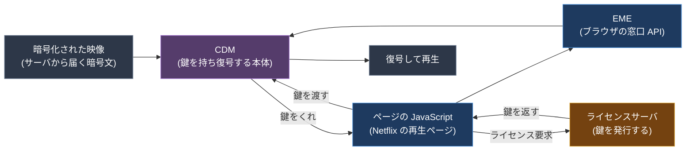
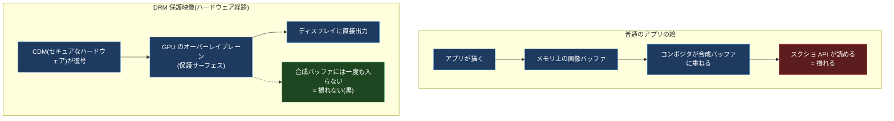
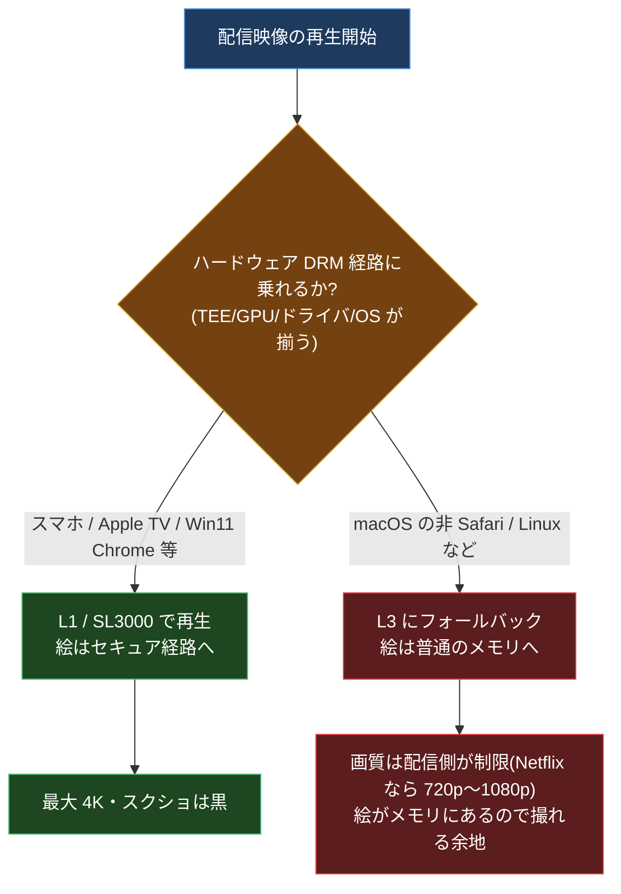
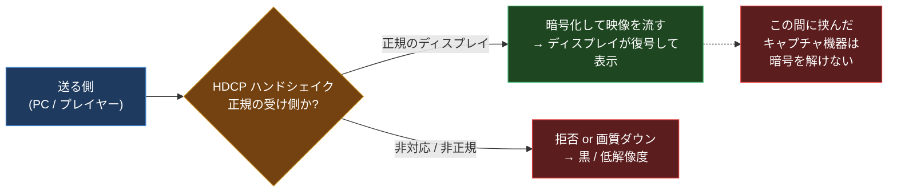
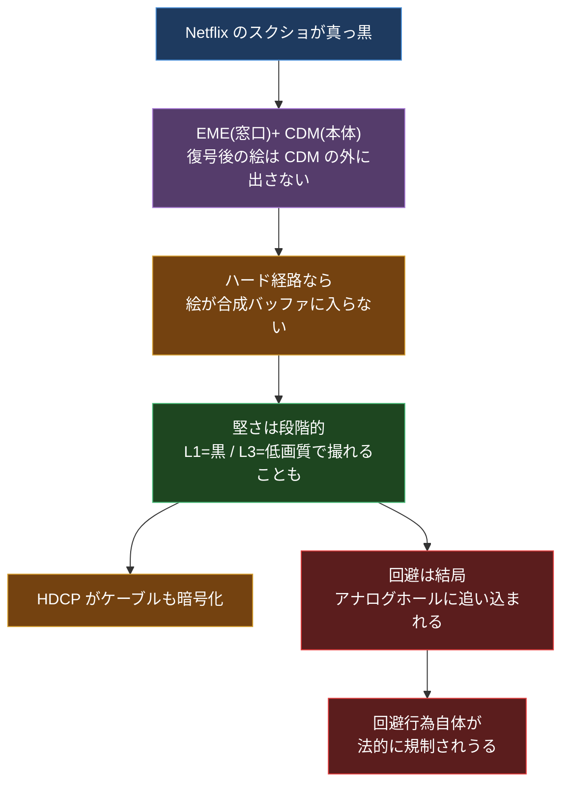

## はじめに

Netflix や Disney+ を再生したまま、スクショを撮ったことがあるだろうか。撮ると、UI(再生バーやタイトル)は普通に写るのに、**動画が出ているはずの長方形だけが真っ黒**になる。録画しても同じ。音は残るのに、絵だけがごっそり抜ける。

最初に不思議なのはここだ。**自分の目には、ちゃんと映像が見えている**。画面には確かに絵が出ている。なのにスクショには乗らない。誰が、どのタイミングで、その長方形だけを黒く塗っているのか。アプリが「キャプチャされたら黒い画像に差し替える」みたいなことをやっているのか? 実は違う。もっと下、**そもそも黒くする以前に「その絵を渡さない」**という構造になっている。

この記事は、その「黒」の正体を、配信の仕組みの一番下まで降りて追うものだ。結論を先に言うと、配信映像の保護は **DRM(Digital Rights Management)** という仕組みで、これは普通のアプリがやる「スクショ防止」とは別格に堅い。なぜ堅いかというと、**復号された映像のピクセルが、そもそも普通のメモリに一度も出てこない**経路を通るからだ。スクショ API が読みにいく場所に、最初から絵が存在しない。だから黒くなる。

そして調べていくと面白い境界が見えてくる。**同じ Netflix でも、スマホアプリは確実に黒いのに、環境によっては(たとえば macOS の Chrome では)撮れてしまうことがある**。しかもこの境界は固定ではなく、ここ数年で動いている。この差と変化がどこから来るのかが、DRM の「堅さの段階」を理解する一番いい入り口になる。

前提(そもそもブラウザはどうやって暗号化された動画を再生しているのか)から積むので、動画や DRM が専門でなくても上から読めば追えるようにする。最後に「じゃあ回避するならどうなるのか」を、技術的な限界と法律の両面から正直に整理する。煽りでも how-to でもなく、**なぜ簡単には破れないのか、そして唯一残る穴は何か**を理解するための記事だ。

> この記事は W3C の EME 仕様、Microsoft PlayReady / Apple FairPlay の公式ドキュメント、HDCP の仕様、各 DRM ベンダーの解説を一次〜準一次情報として裏取りしている。ただし Widevine の正式仕様は Google のパートナー限定で非公開なため、L1/L2/L3 の定義は複数の二次情報の一致で確認している。コミュニティ報告どまり・バージョン依存の挙動には「※報告ベース」と明記する。
>
> なお、これは**アプリのウィンドウ単位の保護(macOS の `NSWindow.sharingType` など)とは別系統の話**だ。そっち(普通のアプリがスクショを防ぐ仕組みと、それが macOS 15 で崩れた話)は別記事「macOS はどうやって『スクショできないウィンドウ』を作っているのか」で扱っている。本記事は配信 DRM の世界に絞る。

---

## 0. 前提: ブラウザはどうやって「暗号化された動画」を再生しているのか

種明かしの前に、道具を 1 つ用意する。**暗号化された配信映像が、復号されて画面に出るまでに、誰が何を持っているか**だ。ここが分かっていないと、後半の「どこで黒くなるか」が全部おまじないに見える。

Netflix の映像は、サーバから**暗号化されたまま**届く。ブラウザにダウンロードされた時点では、ただの暗号文だ。これを再生するには鍵がいる。その鍵のやり取りと復号を仕切るのが、ブラウザに組み込まれた **EME** と **CDM** という 2 つの部品だ。名前が紛らわしいので、最初に役割をはっきり分けておく。

- **EME(Encrypted Media Extensions)**: W3C が標準化した**ブラウザの API**。これ自体は DRM ではない。仕様にもはっきり「これは保護や DRM の仕組みを定義しない。それらと対話するための共通 API を定義するだけだ」と書いてある。要するに**窓口**。
- **CDM(Content Decryption Module)**: 実際に鍵を持ち、復号し、出力ルールを守る**ブラックボックスの部品**。ベンダー製で、ブラウザですら中身を覗けない。これが**本体**。Chrome なら Widevine、Safari なら FairPlay、というふうに、ブラウザごとに積んでいる CDM が違う。

流れはこうだ。

1. ページの JavaScript が「この動画を再生したい」と EME に頼む。
2. CDM が「じゃあ鍵をくれ」というリクエスト(ライセンス要求)を作る。
3. そのリクエストを、ページの JavaScript が**ライセンスサーバ**に送る(通信経路はアプリ側が制御する)。
4. ライセンスサーバが鍵(ライセンス)を返す。
5. CDM がその鍵で暗号文を復号し、映像として再生する。

> この図の色は役割分けのためだけで、意味は無い。**色に意味を持たせるのは次章以降の図から**で、そこでは「緑 = 守られる/黒くなる、赤 = 漏れる/撮れる、青・紫・橙 = ただの処理段」で固定する。

ここで一番大事な事実はこれだ。**鍵と復号後の映像を握っているのは CDM であって、ページの JavaScript ではない。** Netflix のページの JS は「暗号文」と「ライセンス要求のバケツリレー」しか触れない。復号された生の映像フレームは、CDM の中(あるいはもっと下のハードウェア)に閉じていて、ページ側からは取り出せない。

この「**復号後のピクセルは CDM より外に出さない**」という設計が、これから出てくる「黒」の全部の出発点になる。スクショで撮れる場所まで、そもそも生の絵を持ってこさせない、というのが DRM の発想だ。

---

## 1. なぜ「黒」になるのか: 絵が存在しない場所を撮っている

では、その CDM が復号した映像は、どうやって画面に出るのか。ここが核心だ。

普通のアプリの絵は、いったん**メモリ上の画像バッファ**に描かれ、それを OS の合成担当(コンポジタ)が全ウィンドウ分まとめて 1 枚に重ねる。この重ね合わせた結果が置かれる場所を、ここでは**合成バッファ**と呼ぶ。スクショ API が読んでくるのは、この合成バッファだ。普通の絵は必ず合成バッファという「メモリに置かれた状態」を経由するから、撮れる。

ところが、**ハードウェア DRM**(チップの中で復号する堅い方式。何がそれを決めるかは次章で見る)が効いている配信映像は、この経路を通らない。CDM(の下のセキュアなハードウェア)が復号した映像フレームは、**GPU の「オーバーレイプレーン」や「保護サーフェス」と呼ばれる特別な経路**(ディスプレイに直接重ねて出す専用のレイヤだと思えばいい)を通って、ディスプレイのコントローラに直接送られる。合成バッファには**一度も書き込まれない**。

スクショを撮ったときに起きているのはこういうことだ。スクショ API は普通どおり「合成された絵」を読みにいく。でも**その絵には、DRM 映像のピクセルが最初から入っていない**。映像の長方形のところは、データがないので黒(あるいは透明)のまま。あなたの目には見えているのに撮れないのは、**目に見せる経路(オーバーレイ→ディスプレイ)とスクショが読む経路(合成バッファ)が、物理的に分かれている**からだ。

ここで「黒の作り方」には実は**強さの違う 2 系統**があることを押さえておきたい。あとで効いてくる。

| 黒の作り方 | 仕組み | 強さ |
| --- | --- | --- |
| 経路分離(オーバーレイプレーン) | 復号後のピクセルがそもそも合成バッファに入らない。OS 側にコピーが存在しない | **強い**。撮りようがない |
| フラグ除外 | サーフェスは合成経路に存在するが「キャプチャ対象外」と印が付いている。OS が「撮るな」を守る | やや弱い。OS の約束ごと |

前者は「**撮るべき絵がそこに無い**」、後者は「**絵はあるが OS が渡さないと約束している**」。見た目はどちらも黒い長方形で同じだが、堅さが違う。Android の `FLAG_SECURE` などは後者寄り、ハードウェア DRM のオーバーレイ経路は前者だ。世の中の解説はこの 2 つをよく混同するが、**本当に堅いのは前者**であることを覚えておいてほしい。

---

## 2. DRM の「堅さの段階」: Widevine の L1 / L2 / L3

ここまでで「ハードウェアの経路を通れば黒くなる」と言った。逆に言うと、**ハードウェアの経路を通れなければ黒くならない**。そして、その経路を通れるかどうかには段階がある。これを一番よく表しているのが、Google の DRM である **Widevine の 3 段階(L1 / L2 / L3)**だ。

鍵になる概念が **TEE(Trusted Execution Environment / 信頼実行環境)**。これは CPU の中にある「隔離された安全な小部屋」で、ここで動く処理と、ここに置かれたデータ(鍵や復号後のピクセル)には、通常の OS やアプリから手が出せない。スマホのチップにはたいてい載っているが、デスクトップのブラウザからは普通使えない。ここが効いてくる。

| レベル | 復号する場所 | 映像のデコードと描画 | 復号後のピクセルの居場所 |
| --- | --- | --- | --- |
| **L1** | TEE(ハードウェア) | TEE 内 → セキュア経路で画面へ | TEE の外に出ない |
| **L2** | TEE(ハードウェア) | ソフト or 別ハードウェア | 一部が通常メモリに出うる |
| **L3** | 通常のソフトウェア | 全部ソフトウェア(通常メモリ) | **普通のメモリにいる** |

表だけだと味気ないので、それぞれが何者かを補足する。

- **L1**: 復号も映像のデコードも全部 TEE の中でやって、できあがったピクセルはセキュア経路で直接ディスプレイへ。**鍵も復号後の絵も、一度も TEE の外に出ない**。HD や 4K を配信するにはこのレベルが要求される。スマホやスマート TV、Apple TV はこれ。
- **L2**: 復号は TEE だが、デコードは外。中途半端で、実際の消費者向けデバイスではあまり見ない。
- **L3**: TEE を使わず、全部を**ハードニング(難読化)されたソフトウェア**でやる。鍵も復号後のピクセルも**普通のメモリにいる**。デスクトップのブラウザは長らくこれだった(ただし最近は例外が出てきた。次章で扱う)。

ここが分かれ目。**L1 だと黒くなる**(絵がセキュア経路にいて、合成バッファに無いから)。**L3 だと、原理上は絵が普通のメモリにいる**ので、撮れる余地がある。

Microsoft の **PlayReady** も同じ発想で段階を持っている。こっちは公式ドキュメントに明記されている。

| PlayReady | Microsoft の呼び方 | 中身 |
| --- | --- | --- |
| **SL150** | 開発・テスト用 | 秘密情報を一切保護しない。商用コンテンツ不可 |
| **SL2000** | Software-DRM | 秘密をソフトまたはハードで保護。商用コンテンツ向け |
| **SL3000** | Hardware-DRM | プロセッサの TEE で保護。最高画質・最高セキュリティ用 |

SL3000 が、4K / HDR や公開直後の作品を解禁する鍵になる。Windows で 4K の Netflix が動くのはこの PlayReady ハードウェア DRM 経路で、かつては Edge 専用だったが、いまは Windows 11 + 対応 GPU なら Chrome でも通る(この変化は次の章の山場になる)。

Apple の **FairPlay** も思想は同じで、iOS / tvOS では鍵の扱いと復号が **OS カーネルのレベル**で行われる(Apple の FairPlay Streaming の公式ドキュメントは「カーネル上で復号する」と書いている)。その鍵の保護は Apple Silicon の **Secure Enclave** というハードウェアの信頼の起点に根ざしている、というのが一般的な理解だ(※ Apple の FPS ドキュメントは復号の場所を「カーネル」とだけ書き、Secure Enclave という語は明示していない。ここは準一次情報の言い換え)。いずれにせよ Apple のデバイスは最初から高セキュリティ経路として扱われる。

要するに **Widevine も PlayReady も FairPlay も、構造は同じ**だ。「TEE を使えるか(=ハードウェア経路に乗れるか)」で堅さが段階分けされていて、**上の段だけが本当に黒くなる**。

---

## 3. なぜ「デスクトップだと撮れることがある」のか

ここで冒頭の謎、「スマホは確実に黒いのに、PC のブラウザだと撮れることがある」に答えが出る。分かれ目は一言で言うと、**そのとき再生がハードウェア経路に乗れたかどうか**だ。

スマホやスマート TV、Apple TV のチップには本物の TEE が載っていて、配信アプリは最初から L1 / SL3000 / FairPlay のハードウェア経路で再生する。だから絵はセキュア経路にいて、合成バッファに来ない。スクショは黒。ここはブレない。

デスクトップが厄介なのは、**昔は OS がブラウザに TEE を開放していなかった**点だ。そのため Chrome も Firefox も Edge も、配信映像を **Widevine L3**(全部ソフトウェア)で再生するしかなかった。L3 だと復号後のピクセルが**普通のメモリにいる**ので、コンポジタもスクショ API も読める。だから「PC のブラウザだと撮れた」が起きていた。

ただしここで画質に縛りが入る。**L3 には解像度の上限が課される**。これは Widevine のコードが技術的に縛っているのではなく、**スタジオ(配信元)が「この画質を超えるならハードウェア DRM を要求する」とライセンスサーバ側でルールを決めている**からだ。技術的な限界ではなく**ポリシー**である点が肝心。Netflix の場合、ソフトウェア再生の上限は環境ごとに 720p〜1080p のどこかで頭打ちになる(※「480p」とよく書かれるがそれは古い/誤り。ブラウザ・OS ごとの実際の数字は後述の公式マトリクス参照)。

### 2024〜2026 で前提がずれた: Windows の Chrome がハード DRM に乗った

ここが今いちばん大事な更新点だ。**「デスクトップブラウザ = 必ず L3 = 撮れる」は、もう一律には正しくない。** Windows 11 では、対応 GPU・ドライバ・ブラウザのフラグ(`chrome://flags/#enable-hardware-secure-decryption`)・プレイヤー側の設定が揃うと、**デスクトップの Chrome / Edge が PlayReady のハードウェア DRM(SL3000)を交渉して使える**ようになった。ここで乗るのは PlayReady 側であって、**Widevine L1 ではない**点に注意してほしい。Widevine の L1 は端末レベルの認証(スマホや TV のチップに紐づく)が前提で、デスクトップブラウザは今も基本 Widevine は L3 のまま。デスクトップで 4K のセキュア経路を開けるのは PlayReady SL3000 の方だ。かつて 4K の Netflix は Edge 専用だったが、いま Windows の Chrome も 4K 対応として挙がっている。乗れてしまえばデスクトップでも絵はセキュア経路に入り、**スクショは黒くなる**。

これを一番はっきり示すのが、Netflix 自身が公開している対応ブラウザと最大解像度の表だ。

| OS | ブラウザ | 最大解像度 |
| --- | --- | --- |
| Windows | Edge | 4K (2160p) |
| Windows | **Chrome** | **4K (2160p)** |
| Windows | Firefox / Opera | 1080p |
| macOS | Safari | 4K (2160p) |
| macOS | Chrome / Firefox / Opera | 1080p |
| macOS | Edge | 720p |
| Chromebook | Chrome | 4K |
| Linux | Chrome / Firefox / Edge | 720p |

出典: Netflix ヘルプセンターの対応ブラウザ一覧(2026 時点)。表からも読めるとおり、**4K まで出るのはハードウェア DRM が成立する組み合わせだけ**で、Linux や macOS の非 Safari は 720p〜1080p に頭打ち。つまり「どこまで写るか・撮れるか」は OS とブラウザの組み合わせでくっきり段差がある。

「ブラウザのハードウェアアクセラレーションをオフにすると Netflix が撮れる」という民間療法があるのは、これで説明がつく。アクセラレーションを切るとハード経路を諦めて L3 に落ち、絵が普通のメモリに戻ってくるからだ(※この再現はバージョン・GPU ドライバに強く依存する。鵜呑みにしないこと)。

結論はこうだ。**「DRM = 必ず黒」でも「デスクトップ = 必ず撮れる」でもない。** 黒くなるのはハードウェアのセキュア経路に乗ったときだけで、いまやそれはモバイルだけでなく Windows のデスクトップ Chrome にも広がっている。逆に macOS の Chrome や Linux はまだ L3 寄りで、低めの画質なら撮れる余地が残っている。

---

## 4. もう 1 つの関所: HDCP(ケーブルを守る暗号)

ここまではデバイスの**内側**の話だった。だが保護はもう 1 段ある。**ディスプレイにつなぐケーブルの上**だ。これが **HDCP(High-bandwidth Digital Content Protection)**。

考えてみれば当然で、デバイスの中をどんなに固めても、最後は HDMI や DisplayPort のケーブルを通ってディスプレイに映像が流れる。このケーブルの途中に**キャプチャ機器(HDMI キャプチャボード)**を挟めば、画面に出る直前の生の映像を抜けてしまう。HDCP はこれを防ぐために、**ケーブル上の映像を暗号化**する。

仕組みはこうだ。映像を送る側(PC やプレイヤー)と受ける側(モニタや TV)が、つないだ瞬間に**暗号ハンドシェイク**をする。受け側が「正規の、認証されたディスプレイ」であることが確認できて初めて、暗号化された映像が流れ、受け側がそれを復号して表示する。途中に挟まった非正規の機器は、暗号を解けないので何も得られない。

押さえどころ。

- **バージョンがある**。HDCP 1.x は独自暗号(56 ビット鍵)で古い。2.x で標準的な暗号(RSA、AES-128、HMAC-SHA-256)に作り直され、さらに「ローカライゼーション」(応答の遅延をチェックして、インターネット越しの中継を弾く)が入った。**4K / UHD には HDCP 2.2 以上が必須**。2.3(2018)が現行の強化版。
- **非対応ディスプレイだとどうなるか**。配信側が HD / 4K に HDCP を要求しているのに、つないだディスプレイやケーブルが必要なバージョンに対応していないと、**送る側が画質を落とすか、出力自体を拒否する(黒くなる)**。古いモニタや変なアダプタを噛ませると Netflix が真っ黒、というのはこれ。
- **過去に破られている**。2010 年に HDCP 1.x のマスター鍵が公開され、失効の仕組みごと無力化された(Intel は「悪用には専用チップが要る」と主張)。2015 年には HDCP 2.2 を外した 4K の映像が流出する事件があった(HDMI キャプチャの痕跡があった、という記録)。つまり**HDCP は破られた歴史がある**。完璧ではない。
- **HDCP を外す/落とす機器(ストリッパー)は実在する**。HDFury などが販売し、訴訟になった例もある(「strip = 除去」ではなく「downgrade = 画質を落とす」だと争われた、という回避規制上の微妙な区別がある。この回避規制=DMCA については最後の章で触れる)。ここでは存在を述べるだけで、やり方は扱わない。

HDCP のポイントは、**保護の関所がデバイスの外、ケーブルの上にもある**ということ。デバイス内の DRM(Widevine など)と HDCP は別レイヤーで、両方が揃って初めて「画面に出るまで一貫して暗号化されている」状態になる。

---

## 5. プラットフォーム比較(どこが堅いか)

ここまでの要素(ハード経路に乗れるか、HDCP がどう効くか)を組み合わせると、プラットフォームごとの挙動が整理できる。なお、ここからの細かい挙動は**バージョンや GPU ドライバで簡単にひっくり返る**ので、傾向として読んでほしい(個別の再現報告には「※報告ベース」と付ける)。

| 環境 | 典型的な DRM 経路 | スクショ結果 | 堅さ |
| --- | --- | --- | --- |
| スマホ(iOS / Android) | TEE あり(L1 / FairPlay HW) | ほぼ確実に黒 | **堅い** |
| Apple TV / スマート TV | ハードウェア経路 | 黒 | 堅い |
| Safari (macOS) | FairPlay(復号はカーネル + OS の合成担当に統合) | 黒(録画からも除外) | 堅い |
| Chrome / Edge (Windows 11) | ハード DRM に乗れれば PlayReady SL3000(Widevine は L3 のまま) | 乗れたとき黒、L3 落ちなら撮れる余地 | 中〜堅い |
| Chrome / Firefox (macOS) ・ Linux | ほぼ L3(ソフト) | 低めの画質で撮れることも | ゆるい |
| 古いモニタ / 変なアダプタ経由 | HDCP 不成立 | 黒 or 低解像度(再生自体が制限) | 別軸 |

- **モバイルが一番堅い**。スマホには本物の TEE があり、アプリが再生サーフェスを「保護」扱い(Android なら `FLAG_SECURE`)にする。スクショ・録画・最近のアプリのサムネ・ミラーリングまで軒並み黒くなる。最も確実に黒い環境だ。
- **デスクトップは二分化した**。Windows 11 + 対応 GPU の Chrome / Edge はハード DRM に乗れるので黒くなりうるが、macOS の非 Safari と Linux はまだ L3 寄りで、低画質なら撮れる余地が残る。「デスクトップはゆるい」と一括りにできなくなったのが、ここ数年の変化だ。
- **Firefox と Chrome でどっちが撮れる、という固定ルールは無い**。「片方は撮れて片方は黒い」という話はよく出るが、その時に保護経路に乗っているかどうかの違いでしかなく、バージョンや GPU で入れ替わる。「Firefox なら撮れる」式の決めつけは当てにならない(※報告ベース)。
- **流れとしては「OS / コンポジタの層で黒くする」方向に寄っている**。アプリ任せだった保護を下のレイヤーで強制する動きが各所で見られ、全体としては「セキュア経路ならどこで撮ろうと黒」に収束しつつある(※二次情報のトレンド観測で、公式ロードマップではない)。

---

## 6. 「じゃあ回避するなら?」を正直に整理する

「仕組みは分かった。で、回避するとしたらどこを突くことになるのか?」を、**技術的に何が起きるか**という観点で見る。how-to ではなく、**どこも塞がっていて、唯一どこに穴が残るのか**を確認する話だ。

これまで出てきた経路を 1 本につなぐと、攻めどころの候補は暗号文・鍵・合成バッファ・ケーブルの 4 か所、そしてその先にもう 1 つある。

図の ①〜④ が、それぞれなぜ塞がっているか。

1. **暗号文を盗む**: 一番簡単に手に入るが、**鍵がないただの暗号文**なので、それだけでは何も再生できない。意味がない。
2. **鍵を抜く**: 鍵は CDM、L1 なら TEE の中にいる。TEE は OS からも手が出せない隔離領域なので、ソフトウェアからは原理的に取り出せない。L3(デスクトップの一部)では鍵がソフト内にあるが難読化で守られ、しかも仮に抜けても**ライセンスサーバが L3 には低画質の鍵しか渡していない**ので、得られるのは配信側が絞った低画質(720p〜1080p)止まりだ。
3. **合成バッファ(画面の絵)を読む**: 一番「素直」な発想だが、**L1 ではそこに絵が無い**。復号後のピクセルはオーバーレイ経路を通ってディスプレイに直行し、合成バッファには一度も入らない。スクショ API が読む場所に最初からデータが無い。L3 なら絵はメモリにあるが、これも配信側が絞った低画質(720p〜1080p)どまり。
4. **ケーブルを抜く**: HDCP で暗号化されているので、途中のキャプチャ機器は何も得られない。HDCP を外す機器は実在するが、それ自体が回避規制(DMCA など)に触れうる。

どれだけ上を固めても、図の右端に**最後まで残る穴**がある。**アナログホール**だ。

### アナログホール: 原理的に閉じない最後の穴

どんなにデジタルで固めても、**映像は最終的に「光」、音は「空気の振動」になる**。そうしないと人間が見聞きできない。そして光になった瞬間、それを**別のカメラで撮り直す**ことは、どんな DRM でも防げない。これがアナログホール。

HDCP はデジタルのケーブル経路を固めるだけ。TEE は復号後のピクセルをメモリから隠すだけ。だが「ディスプレイに表示された光」と「スピーカーから出た音」までは、どの技術も追いかけられない。画面にカメラを向けて撮り直せば、DRM のかかっていない映像が手に入る。MPAA(米国映画協会)ですら、デジタル保護が破れない場合の最後の抜け道として、この「カメラ撮り(camcording)」を現実の脅威として挙げている。

身も蓋もないが、**保護の強度がいくら上がっても、アナログホールだけは原理的に閉じない**。映像を人間に見せる以上、最後は必ず光に戻すしかないからだ。逆に言うと、DRM の目的は「完全に防ぐ」ことではなく、**「劣化なしの完全なデジタルコピーを面倒にする」**ことにある。カメラ撮りの映像は画質も音質も必ず落ちるし、手間もかかる。デジタルの一発コピーさえ潰せれば、保護としては目的を果たしている、という割り切りだ。

整理すると、回避を考えた末に残るのは次の 3 点になる。正規経路で劣化なしの高画質を抜くのは、L1 が効いている限り原理的に塞がれている。L3 寄りの環境(macOS の非 Safari や Linux)では撮れる余地があるが、得られるのは配信側が絞った低画質(720p〜1080p)どまり。そして唯一原理的に残るアナログホールは、劣化を伴ううえに次章の法律にも関わる。**完全な回避ルートは、設計上わざと残されていない**わけだ。

---

## 7. 法律の話(短く、正確に)

技術の話だけで終えると片手落ちなので、線を引いておく。重要なのは、**DRM の回避は「実際に著作権を侵害したかどうか」と独立して、回避行為そのものが規制されている**国が多い、という点だ。

- **米国 DMCA §1201**: アクセス制御の回避(§1201(a))と、回避ツールの提供(§1201(b))を禁止。特徴は、**実際の著作権侵害がなくても「鍵を破る行為」自体が違法になりうる**こと。フェアユースは回避行為自体の抗弁にはならない。3 年ごとに一時的な例外が指定される(セキュリティ研究などの細い例外がある)。
- **EU**: 著作権指令(InfoSoc 2001/29/EC)が、技術的保護手段の回避を同様に禁止。
- **日本**: 著作権法と不正競争防止法の改正で、技術的保護手段・技術的制限手段の回避や回避ツールの提供を規制している。
- **共通の根っこ**: これらはすべて 1996 年の WIPO 著作権条約(第 11 条)に由来する。だから世界的に似た構造になっている。

これは法的助言ではなく一般的な背景だ。ポイントだけ言うと、**他人の商用コンテンツの DRM を回避する行為は、コピーして配布しなくても、回避した時点で規制対象になりうる**。HDCP ストリッパーの訴訟(前述)が「strip か downgrade か」で争われたのも、この回避規制の線引きの話だった。

逆に、**自分が権利を持つ映像、自作アプリの保護機構の研究、認可されたセキュリティテスト**といった範囲なら問題にならない。仕組みを理解すること自体は、何ら制限されていない。この記事がやっているのもそれだ。

---

## まとめ

上から読んできた流れを 1 枚にする。

要点はこれだけだ。

1. **配信映像の「黒」は、絵を黒く塗っているのではなく、撮れる場所にそもそも絵を置かない構造**。復号後のピクセルは CDM / TEE の中、あるいは GPU のセキュア経路にいて、スクショ API が読む合成バッファには入らない。
2. **EME はただの窓口 API、本体は CDM**。鍵と復号後の映像を握るのは CDM で、ページの JS からは触れない。
3. **DRM の堅さは段階的**(Widevine L1/L2/L3、PlayReady SL150/2000/3000)。TEE が使える上位だけが本当に黒くなる。「DRM = 必ず黒」ではない。
4. **「デスクトップは撮れる」はもう一律ではない**。Windows 11 の Chrome / Edge はハード DRM に乗って黒くなりうる(最大 4K)。一方 macOS の非 Safari や Linux は L3 寄りで、配信側が絞った 720p なら撮れる余地が残る。
5. **HDCP はケーブルの上をもう 1 段暗号化**する。非対応ディスプレイだと黒 / 低解像度になる。過去に破られた歴史もある。
6. **回避は技術的にアナログホール(劣化する撮り直し)に追い込まれ、法的には回避行為自体が規制されうる**。完全なルートは設計上わざと残されていない。
7. **アナログホールだけは原理的に閉じない**。だが DRM の目的は完全阻止ではなく「劣化なしのデジタルコピーを面倒にする」ことなので、それで十分に成立している。

最初の「自分には見えているのに撮れない」という気持ち悪さの正体は、**見せる経路と撮る経路が物理的に分かれている**という一点に尽きる。配信 DRM は、その分離を CDM・TEE・オーバーレイ・HDCP と何段にも重ねて作っている。仕組みを下まで追うと、「黒い長方形」がただの嫌がらせではなく、わりと筋の通った設計だったことが見えてくる。
