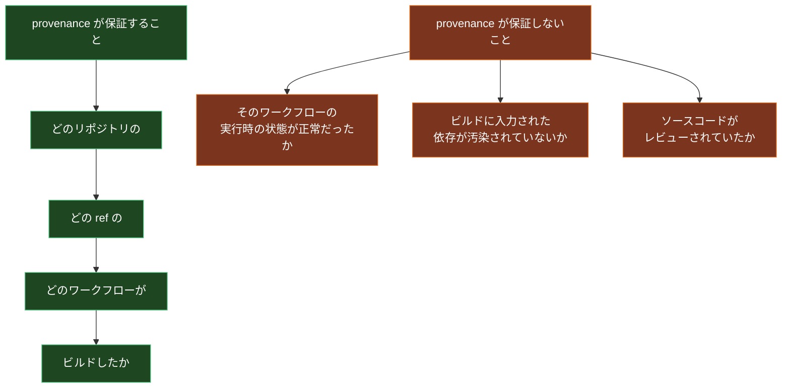
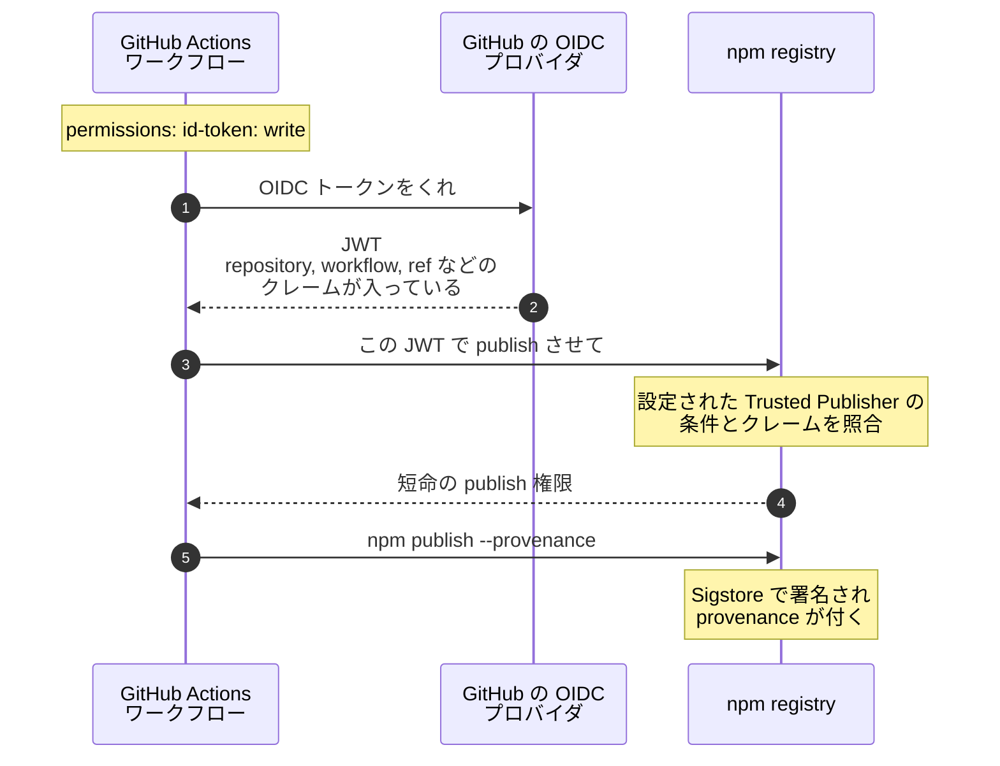
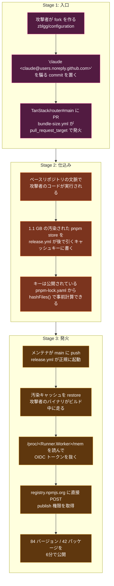
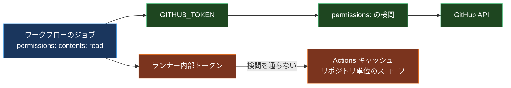
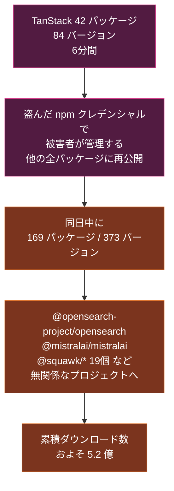

サプライチェーンセキュリティの記事をいくつか書いてきて、結論はだいたい同じところに着地していた。「署名を検証しろ」「provenance を確認しろ」。Sigstore で署名して、SLSA の provenance を付けて、インストール前に検証する。これをやれば、少なくとも「ビルドされていないものが混ざる」事故は防げる。

2026年5月11日、その前提が正面から破られた。

TanStack の npm パッケージ42個、84バージョンが、**有効な SLSA Build Level 3 の provenance を持った状態で** 悪意あるコードを配布した。Sigstore の署名は本物。透明性ログにも正しく載っている。`npm audit signatures` も通る。`cosign verify-attestation` も通る。それでもマルウェアだった。

Palo Alto Networks Unit 42 は、これを「有効な SLSA Build L3 provenance を持つ悪意ある npm パッケージをワームが公開した、初の documented なケース」と呼んでいる。

この記事では、その攻撃を段階ごとに分解する。前提知識として GitHub Actions の trigger の違いと OIDC の仕組みから入るので、CI をあまり触っていない人でも上から読める形にしてある。最後に「じゃあ provenance は何のためにあったのか」を整理する。

## 前提1: provenance は「何を」保証しているのか

まず、攻撃の話に入る前にここを固めておきたい。ここを誤解していると、この事件が何を壊したのか分からなくなる。

**SLSA provenance** は、成果物 (npm パッケージなど) に対して「これは誰が、どのソースから、どのビルド手順で作ったか」を機械可読な形で記録した証明書だ。npm の場合、GitHub Actions が OIDC トークンで身元を証明し、Sigstore がその身元で署名する。

provenance に書かれるのは、たとえばこういう内容になる。

```json
{
  "buildDefinition": {
    "buildType": "https://slsa-framework.github.io/github-actions-buildtypes/workflow/v1",
    "externalParameters": {
      "workflow": {
        "ref": "refs/heads/main",
        "repository": "https://github.com/TanStack/router",
        "path": ".github/workflows/release.yml"
      }
    }
  },
  "runDetails": {
    "builder": { "id": "https://github.com/actions/runner/github-hosted" }
  }
}
```

読み方はこうだ。「このパッケージは TanStack/router の `refs/heads/main` にある `release.yml` によってビルドされた」。

そしてここが肝心なところ。**この記述は、事件の当日も1文字も嘘をついていない。**



攻撃者がやったのは、この右側の穴を通ることだった。**署名を偽造する必要はない。正規のパイプラインに正規の手順でマルウェアを流し込めば、パイプラインが正直に署名してくれる。**

## 前提2: GitHub Actions の `pull_request` と `pull_request_target` の違い

攻撃の起点はここにある。この2つの trigger の違いは、GitHub Actions のセキュリティでもっとも事故が多いポイントだ。

| | `pull_request` | `pull_request_target` |
| --- | --- | --- |
| 実行されるワークフロー定義 | PR のブランチのもの | **ベースブランチのもの** |
| シークレットへのアクセス | fork からは不可 | **可能** |
| `GITHUB_TOKEN` の権限 | fork からは read-only | **書き込み可能** |
| 実行コンテキスト | fork の文脈 | **ベースリポジトリの文脈** |

`pull_request_target` は「fork からの PR でもシークレットを使いたい」ときのために用意されたものだ。たとえば PR にバンドルサイズの差分をコメントしたい、といった用途。

問題は、この trigger を使うワークフローが **PR のコードをチェックアウトして実行してしまう** 場合に起きる。

つまり「ワークフローの定義はベースブランチのもの (信頼できる) だが、そこに書かれた `checkout` が持ってくるコードは fork のもの (信頼できない)」という、ねじれた状態になる。信頼できる文脈で、信頼できないコードが動く。

この形は **Pwn Request** という名前で以前から知られていた。GitHub 自身もドキュメントで警告している。ただ、警告されているのは主に「シークレットが盗まれる」であって、今回突かれたのはそこではなかった。

## 前提3: npm の Trusted Publishing と OIDC

もうひとつの前提。npm の **Trusted Publishing** は、長命の npm トークンを使わずにパッケージを公開する仕組みだ。



長命トークンを持ち歩かなくて済むので、これ自体は明確な改善だ。実際、トークン漏洩型の攻撃にはよく効いている。

ただし、この仕組みには2つの構造的な性質がある。

**1つめ。`id-token: write` を付けた瞬間、そのワークフローの全ステップが publish 可能になる。** OIDC トークンはワークフロー内の任意のステップから要求できる。npm 側は「どのワークフローの、どの ref から来たか」は検証するが、**「そのワークフローの何番目のステップが要求したか」は検証しない**。

**2つめ。Trusted Publisher の設定を「リポジトリ全体」に対して行える。** 本来は「`release.yml` の `main` ブランチからのみ」と絞るべきところを、リポジトリ単位で信頼してしまうと、そのリポジトリのどのワークフローからでも publish できてしまう。

TanStack は2つめを踏んでいた。

## 攻撃の全体像

ここまでの前提を組み合わせると、攻撃の形が見えてくる。3段階に分かれる。



段階ごとに詳しく見ていく。

### Stage 1: `pull_request_target` から中に入る

攻撃者 (TeamPCP と名乗るグループ) は `zblgg/configuration` という fork を作り、そこに悪意あるコミットを置いた。コミットの author は `claude <claude@users.noreply.github.com>` に偽装されていた。GitHub のコミット author はローカルの git config で自由に設定できるので、この偽装自体は誰でもできる。

この fork から `TanStack/router` の main に PR を出す。すると `bundle-size.yml` が `pull_request_target` で発火し、fork の merge ref をチェックアウトして実行した。

この時点で、攻撃者のコードは **ベースリポジトリのランナーコンテキストで動いている**。

### Stage 2: GitHub Actions キャッシュを汚染する

ここが今回いちばん巧妙なところだ。

普通の Pwn Request なら、この段階でシークレットを盗む。でも `bundle-size.yml` の `permissions` はおそらく最小限に絞られていて、盗めるシークレットはなかった。

攻撃者が狙ったのは **キャッシュ** だった。

`actions/cache` は、依存関係のダウンロードを高速化するためにビルド成果物をリポジトリ単位で保存する。キャッシュキーは慣習的にこう書く。

```yaml
- uses: actions/cache@v4
  with:
    path: ~/.pnpm-store
    key: pnpm-${{ hashFiles('**/pnpm-lock.yaml') }}
```

`pnpm-lock.yaml` は **公開されている**。つまり `hashFiles()` の結果は攻撃者にも計算できる。`release.yml` が後で使うキャッシュキーが事前に分かる。

攻撃者は、そのキーに対して 1.1 GB の汚染された pnpm store を書き込んだ。

そして、ここが決定的なポイント。

> キャッシュへの書き込みは、ワークフローの `GITHUB_TOKEN` ではなく **ランナー内部のトークン** を通じて行われる。

つまり **`permissions:` ブロックを最小化してもキャッシュ書き込みは止まらない**。キャッシュはリポジトリレベルで動作していて、ワークフローの権限モデルの外側にあった。

ランナーの中には2種類のトークンがあって、通っている検問が違う。



キャッシュは「信頼境界を越えて共有される可変の状態」だった。fork の PR とメンテナのリリースが、同じキャッシュ空間を共有していた。これが今回の本質だ。

### Stage 3: `/proc` から OIDC トークンを抜く

数日後、メンテナが正規の PR を main にマージする。`release.yml` が起動して、キャッシュを restore する。

汚染された pnpm store の中には、ビルド中に実行されるバイナリが仕込まれていた。それがやったのがこれ。

```text
/proc/<Runner.Worker の PID>/mem を読む
  → OIDC トークンを取り出す
  → registry.npmjs.org に直接 POST
```

GitHub Actions の OIDC トークンは、`id-token: write` が設定されているとき、**必要になったタイミングでランナーのメモリ上に遅延生成される**。環境変数にもファイルにも書かれない。だがプロセスメモリには載る。

Linux では、同じユーザーで動いているプロセスは `/proc/<pid>/mem` を読める。ランナー上で任意コード実行ができれば、Runner.Worker のメモリを読んでトークンを取り出せる。

この手法自体は新しくない。2025年3月の `tj-actions/changed-files` 侵害で初めて文書化され、2026年4月の SAP / Bitwarden の波でも再利用されている。今回はそれをキャッシュ汚染と組み合わせた。

そして、盗まれた OIDC トークンで npm に publish した結果、**Sigstore が正直に署名し、SLSA Build L3 の provenance が付いた**。

provenance には「TanStack/router の refs/heads/main の release.yml がビルドした」と書かれる。実際そうだった。パイプラインの内側が汚染されていただけで。

### 配送: optionalDependencies を使った隠蔽

もうひとつ、検知回避の工夫があった。

普通のマルウェア npm パッケージは `preinstall` / `postinstall` スクリプトを使う。これは検知しやすい。攻撃者はそれを避け、tarball に **`optionalDependencies`** を注入した。

```json
{
  "optionalDependencies": {
    "@tanstack/setup": "github:tanstack/router#79ac49eedf774dd4b0cfa308722bc463cfe5885c"
  }
}
```

指し先は攻撃者の fork にある **orphan commit** (親を持たないコミット) だ。`optionalDependencies` はインストールに失敗しても **静かに無視される**。つまりユーザーのインストールログには何も残らない。だが取得に成功すれば、悪意あるコードがバックグラウンドで実行される。

## 被害の広がり方

これが「ワーム」と呼ばれる理由は、自己増殖するからだ。



1つのメンテナのクレデンシャルが取れると、そのメンテナが権限を持つ全パッケージが次の踏み台になる。npm のメンテナは複数プロジェクトを兼ねていることが多いので、無関係なエコシステムにあっという間に飛び火する。

CVE は **CVE-2026-45321** (GHSA-g7cv-rxg3-hmpx)、Critical。

## SLSA プロジェクト側の反論

2026年5月15日、SLSA のブログに Red Hat の Andrew McNamara による記事が出た。要旨はこうだ。

> 侵害されたパッケージは暗号学的に有効な provenance を持っていた。しかし、そのビルドプラットフォームは実際には SLSA Build L3 の **isolation 要件を満たしていなかった**。要件を満たすプラットフォームであれば、主要な攻撃ベクタは塞がれていた。

SLSA Build L3 が要求する isolation とは、大まかにこういうものだ。

- ビルドが外部の影響を受けずに実行されること
- 別のビルドの状態が現在のビルドに影響しないこと
- ビルド定義とビルド環境が改ざんされないこと

**「別のビルドの状態が現在のビルドに影響しない」** に照らせば、`pull_request_target` のビルドが書いたキャッシュを `release.yml` のビルドが読む構成は、この要件を満たしていない。

つまり「L3 の provenance が付いていた」と「L3 の要件を満たしていた」は別のことだ。provenance は「L3 相当のビルダーが作った」というラベルを貼るが、そのビルダーの設定が実際に isolation を達成しているかは、provenance の検証では分からない。

なお SLSA v1.2 (2025年11月承認) では、この isolation 要件の記述がより明確になっている。同時に **Source track** が実験的ステータスから承認済みに昇格した。「ビルドが信頼できたか」だけでなく「そのソースがレビューと管理を経ていたか」まで見にいく枠組みで、今回のような「ソース側から入られる」攻撃に対する回答の一部になっている。

## では、どう防ぐのか

この事件から導ける対策を、効く順に並べる。

### 1. Trusted Publisher のスコープを絞る

これが最優先。リポジトリ全体ではなく、**ワークフローファイル名 + ブランチ** まで指定する。

```text
悪い: TanStack/router のどのワークフローからでも publish 可
良い: TanStack/router の .github/workflows/release.yml が
      refs/heads/main で動いたときだけ publish 可
```

さらに、そのブランチにブランチ保護をかけて、force push と直接 push を禁止する。TanStack のケースでは、親を持たない orphan commit がワークフローを起動できてしまった。リポジトリ全体を信頼していたからだ。

### 2. `pull_request_target` を棚卸しする

`pull_request_target` を使っていて、かつ PR の head や merge ref をチェックアウトして実行しているワークフローは、すべて Pwn Request だと思っていい。

対処は2つ。

- `pull_request` に変える (fork の文脈で動くので、キャッシュのスコープも分離される)
- 2つに分ける。`pull_request` のジョブで fork の信頼度でビルドし、成果物をアーティファクトに置く。`pull_request_target` (または `workflow_run`) のジョブはそのアーティファクトを **消費するだけ** にする

TanStack が実際にやった対策はこうだった。事後対応の実例として、そのまま参考になる。

- リリースパイプラインの pnpm キャッシュを無効化し、影響を受けた全ワークフローから **キャッシュを完全に削除**
- 組織内の全アクションを **commit SHA でピン留め**。`actions/checkout@v6.0.2` のようなバージョンタグ指定をやめた
- npm と GitHub の両方で **SMS 以外の 2FA を必須化**
- CI から `pull_request_target` を **全廃**
- 全リポジトリを **pnpm 11 に更新**。install-cooldown (公開直後のバージョンを一定期間入れない) の挙動を得るため

さらに予定として、GitHub Actions の静的解析器 **zizmor** の導入、CODEOWNERS でワークフローファイルの変更をコアメンテナに限定、キャッシュの自動化をより保守的な明示的 restore に置き換える、が挙がっている。

### 3. publish を人間のゲートの後ろに置く

- main への push ごとに publish しない。**タグ push だけ** で publish し、そのタグは人間が打つ
- publish ジョブを GitHub Environment で囲み、**required reviewers** を設定する
- ブランチ保護で、author とは別のアカウントによるレビューを必須にする

`id-token: write` を持つワークフローは、実質的に publish 権限そのものだと考えるべきだ。そのワークフローが起動する条件を、可能な限り人間の承認に縛る。

### 4. プラットフォーム側の対策を取り込む

事件の後、GitHub と npm が入れた変更も押さえておきたい。

| 時期 | 変更 |
| --- | --- |
| 2026年5月 | npm の staged publishing。追加承認と 2FA があるまでパッケージをステージング状態に留める |
| 2026年5月20日 | この日以降に作られた Trusted Publisher 設定は、許可するアクションを明示的に選ぶ必要がある。以前は `npm publish` 固定だった |
| **2026年6月18日** | **`actions/checkout` v7**。`pull_request_target` と `workflow_run` の文脈では、fork PR の head をデフォルトでチェックアウトしなくなった。代わりにベースブランチを取る |
| **2026年6月26日** | **信頼度の低い trigger には読み取り専用のキャッシュトークンを発行**。`pull_request_target` からのキャッシュ書き込みが塞がれた |
| 2026年7月20日 | checkout v7 の変更が旧バージョンにバックポートされ強制適用。当初は7月16日予定だった |
| 技術プレビュー | Actions network firewall。ワークフローからの outbound 通信をログして exfiltration を検知 |

この2つ、**checkout v7 とキャッシュの読み取り専用化が、今回の攻撃経路そのものを塞いだ**変更になる。Stage 1 (fork のコードが実行される) と Stage 2 (キャッシュに書き込む) の両方が、デフォルトで成立しなくなった。

ただし checkout v7 の変更には穴が残っている。`run` ブロックの中で `git` や `gh` を使って untrusted な HEAD ref を自分で取ってくるケースは防げない。`issue_comment` も対象外。サードパーティのリポジトリをチェックアウトする場合も止まらない。**フローティングタグ (`actions/checkout@v4` など) を使っていれば自動で新しい挙動になるが、SHA 固定していると手動で上げる必要がある**。ここは自分のリポジトリを確認したほうがいい。

2026年6月のキャッシュ読み取り専用化が、今回の攻撃経路そのものを塞いだ変更になる。ただし、これは GitHub 側の対応であって、自分のリポジトリの Trusted Publisher スコープが広いままなら別の経路が残る。

### 5. 消費側でできること

自分がライブラリの利用者側にいる場合。

- **依存ファイアウォール** を通す。公開されたばかりのバージョンを一定期間隔離して、その間にレビューする
- インストール時の **挙動解析** を入れる。provenance 検証は「どこでビルドされたか」しか見ないので、「何をするか」は別に見る必要がある
- lockfile を必ずコミットし、`npm ci` を使う。バージョン自動更新を CI で無条件にマージしない

## 結局、provenance は何のためにあったのか

「provenance は無意味だった」という結論にはならない。整理するとこうなる。

| 攻撃 | provenance で気づけるか | 理由 |
| --- | --- | --- |
| npm トークンが漏れてローカルから publish | **気づける** | ビルダー ID が CI と一致しない |
| typosquatting で別リポジトリのパッケージが混ざる | **気づける** | ソースリポジトリが違う |
| リリース後に tarball が差し替えられた | **気づける** | ダイジェストが合わない |
| CI パイプラインの内側が汚染された | **気づけない** | ビルダーもソースも ref も本物 |
| ソースに悪意あるコミットが入った | **気づけない** | Build track の対象外。Source track の領域 |
| 依存の1つが既に汚染されていた | **気づけない** | 入力の素性は provenance の範囲外 |

上3つと下3つを分けているのは「攻撃者が正規のビルド経路の外にいるか、中にいるか」だ。外にいる限り provenance は強い。中に入られた瞬間、何も言えなくなる。

provenance が答えているのは「**どこで**ビルドされたか」であって、「**何を**ビルドしたか」でも「そのビルドが**正常な状態で**動いたか」でもない。

そして今回の事件が突きつけたのは、この2つの区別が今まで曖昧に扱われてきた、ということだと思う。自分も「provenance があるから安心」に近い書き方をしたことがある。正確には、こう言うべきだった。

> provenance の検証は **必要条件** であって、十分条件ではない。

`cosign verify` が通ることは、攻撃者がビルドパイプラインを盗んでいないことを意味しない。パイプラインそのものの isolation を、provenance とは別に検証する必要がある。SLSA のレベルは本来それを表すものだったが、「L3 の provenance が付いている」と「L3 の isolation を達成している」の間には、設定次第で開く隙間があった。

明日からできる具体的なアクションを1つだけ挙げるなら、**自分のリポジトリの Trusted Publisher 設定を開いて、スコープがリポジトリ全体になっていないか確認する**こと。5分で終わるし、今回の攻撃の根本原因はそこだった。

## 参考

- [Mini Shai-Hulud Supply Chain Attack CVE-2026-45321 FAQ | Tenable](https://www.tenable.com/blog/mini-shai-hulud-frequently-asked-questions)
- [The npm Threat Landscape: Attack Surface and Mitigations | Unit 42](https://unit42.paloaltonetworks.com/monitoring-npm-supply-chain-attacks/)
- [Postmortem: TanStack npm supply-chain compromise | TanStack Blog](https://tanstack.com/blog/npm-supply-chain-compromise-postmortem)
- [Hardening TanStack After the npm Compromise | TanStack Blog](https://tanstack.com/blog/incident-followup)
- [SLSA Blog](https://slsa.dev/blog)
- [SLSA v1.2 Build requirements](https://slsa.dev/spec/v1.2/build-requirements)
- [Securely using pull_request_target | GitHub Docs](https://docs.github.com/en/actions/reference/security/securely-using-pull_request_target)
- [Trusted publishing for npm packages | npm Docs](https://docs.npmjs.com/trusted-publishers/)
