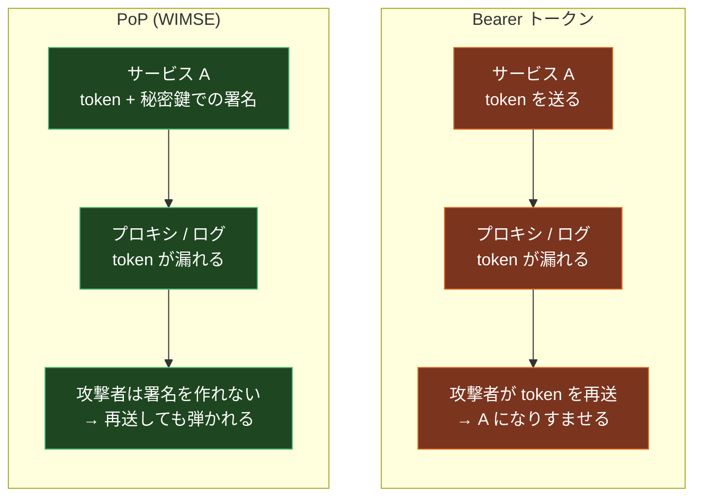
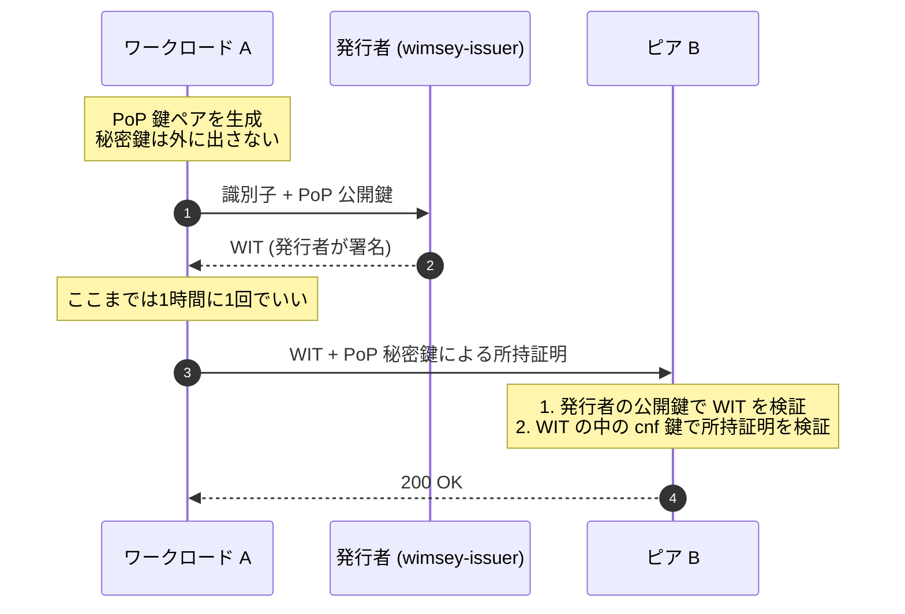
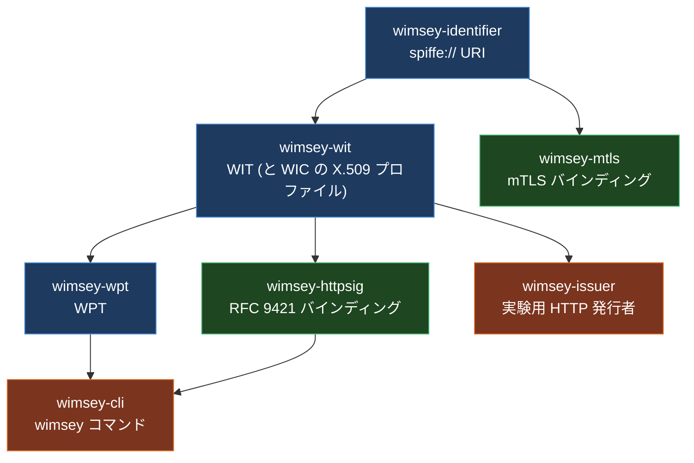
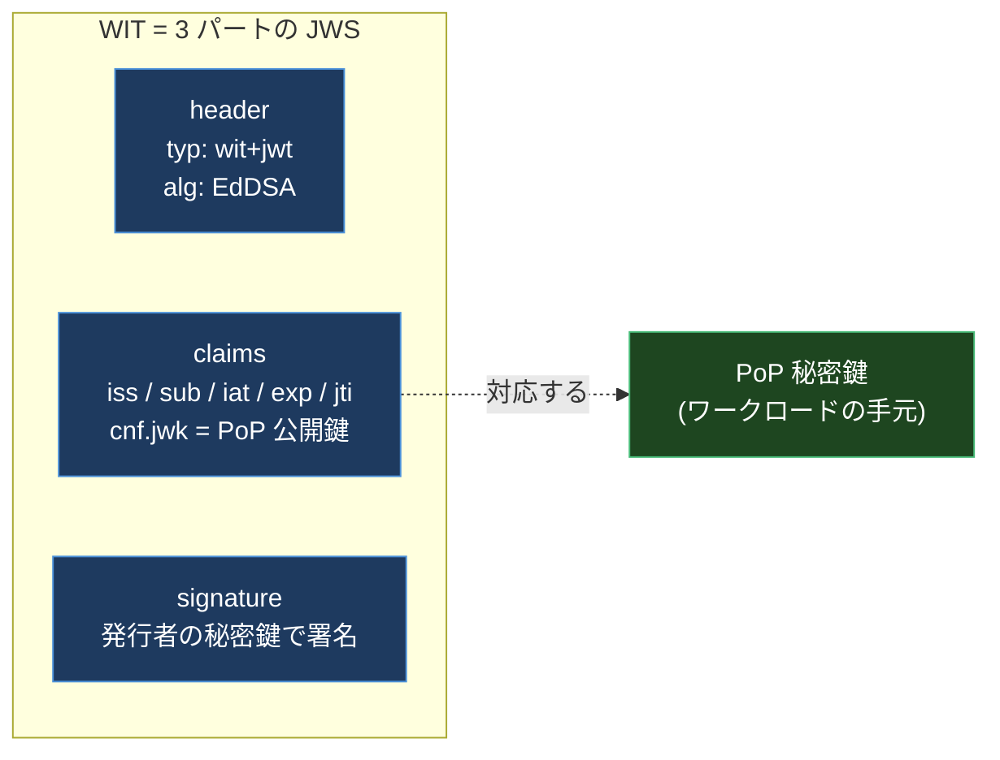
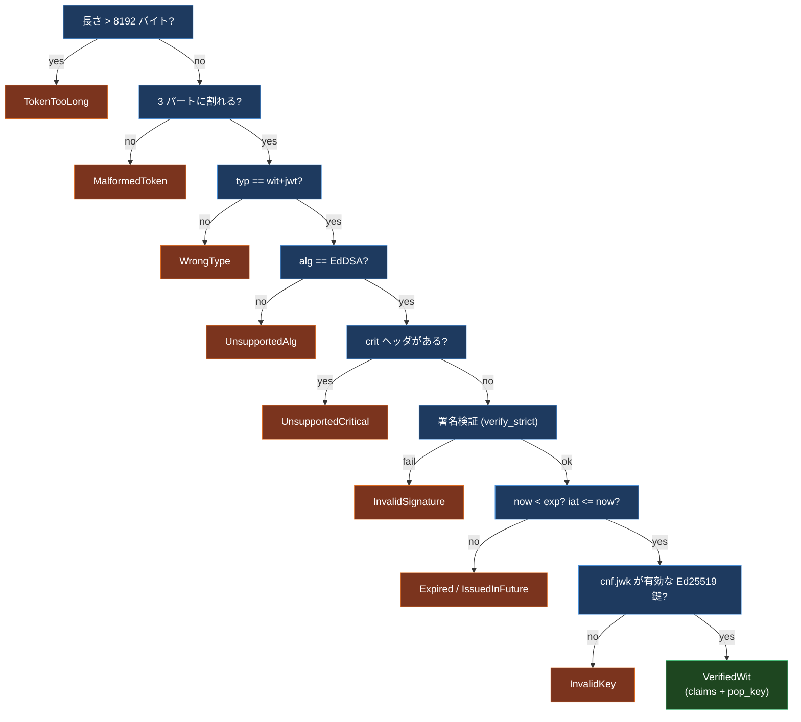
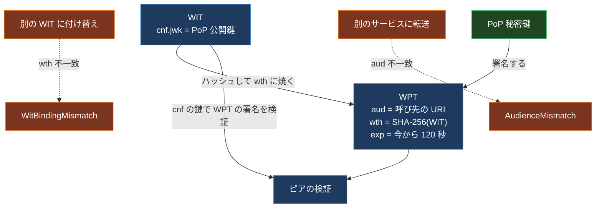
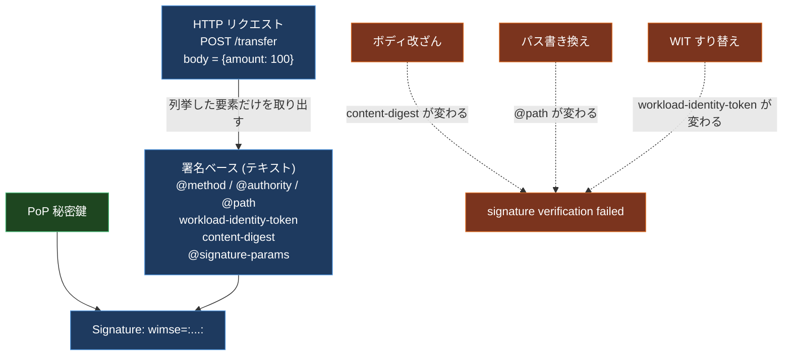
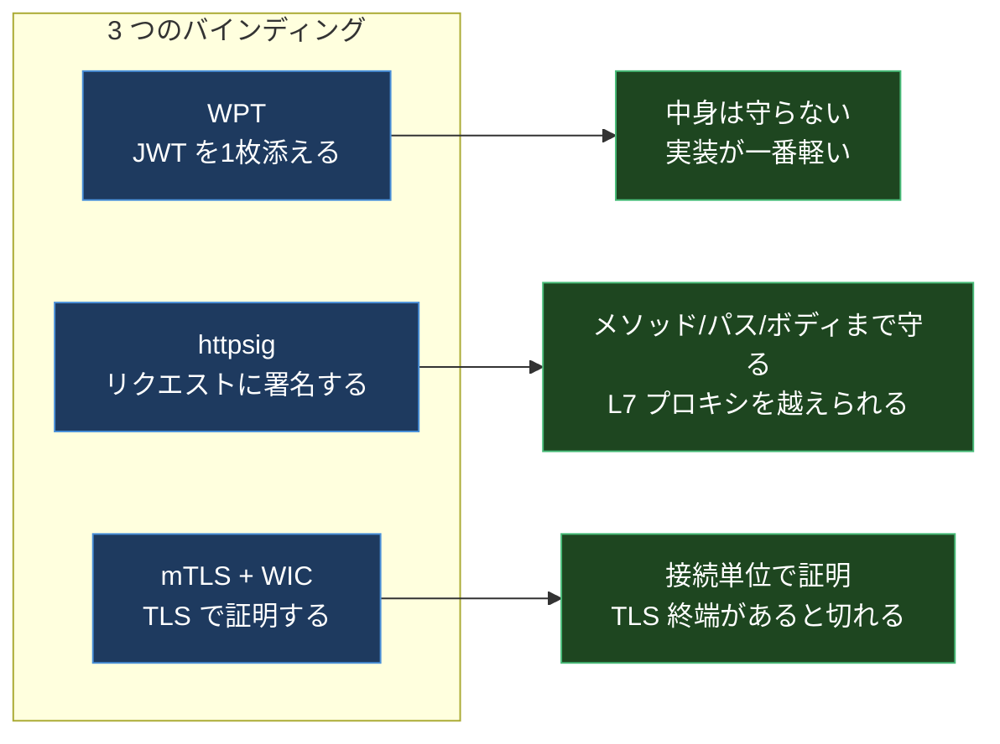
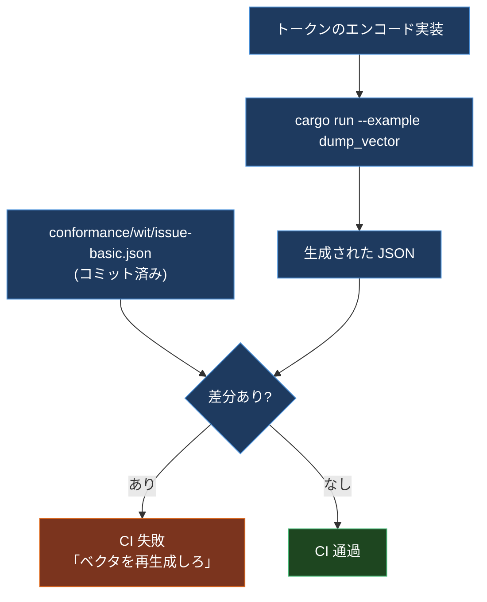

サービス A からサービス B を呼ぶとき、その「A である」ことをどう証明しているだろうか。

自分が見てきた現場のほとんどは、こうだった。

```text
Authorization: Bearer sk_live_9f3a...
```

環境変数に長命のトークンを置いて、ヘッダに載せて投げる。動く。動くんだけど、このトークンは**持っているだけで使える**。ログに出たら終わり。プロキシに抜かれたら終わり。誤って別のサービスに投げてしまったら、投げた先がそれを使って本物の A になりすませる。

この問題、みんなが独自に解いている。AWS は SigV4、Google は署名付き JWT、SPIFFE は X.509-SVID。どれもよくできているが、相互運用はしない。

そこに IETF が **WIMSE** (Workload Identity in Multi System Environments) というワーキンググループを立てて、「ワークロードが自分の身元を証明する方法」を標準化しようとしている。ただ、WG が出すのは仕様書 (Internet-Draft) であって、コードではない。

[wimsey](https://github.com/kanywst/wimsey) は、その仕様を Rust で書き起こしたリファレンス実装。自分が書いた。この記事は、wimsey のコードと実際の実行結果を追いながら、WIMSE が何を解いているのかを上から順に説明していく。

WIMSE も SPIFFE も知らない前提で書くので、「ワークロード ID って何?」のところから読める。

## 前提1: Bearer トークンの何が弱いのか

`Authorization: Bearer <token>` は **bearer** (持参人払い) という名前がすべてを説明している。小切手の持参人払いと同じで、そのトークンを持っている者は誰でも権利を行使できる。トークンとそれを使う主体の間に、何のつながりもない。

対して WIMSE が採るのは **PoP** (Proof of Possession, 所持証明) という考え方。トークンには公開鍵が焼き込まれていて、そのトークンを使うには**対応する秘密鍵を持っていることをリクエストごとに証明**しなければならない。トークンを盗んでも、秘密鍵がなければ何もできない。



漏れる可能性そのものは消せない。消せるのは、漏れたトークンが使えてしまうところ。

## 前提2: WIMSE が定義する2枚のトークン

WIMSE の中心にあるのは2枚のトークンで、役割がきれいに分かれている。

- **WIT** (Workload Identity Token): 「この識別子のワークロードは、この公開鍵を持っている」と**発行者が保証する**書類。有効期間は時間単位。JWT。
- **WPT** (Workload Proof Token): 「その秘密鍵を今この瞬間、私が持っている」ことを**ワークロード自身が証明する**書類。有効期間は分単位。これも JWT。

パスポート (WIT) と、入国審査でその場でやるサイン (WPT) の関係だと思えばいい。パスポートを拾っても、サインを真似できなければ通れない。

全体の流れはこうなる。



WIT の取得 (1 と 2) は数十分に一度でいい。所持証明 (3) は**リクエストごと**。発行者へのラウンドトリップと per-request の証明が分離されているのが、この設計の肝になっている。

## 前提3: ワークロード識別子は SPIFFE ID と同じ形

「ワークロード A」の A の部分、つまり識別子の書式も決まっている。WIMSE の identifier ドラフトは SPIFFE ID 互換の URI を使う。

```text
spiffe://example.org/workload/api
         ^^^^^^^^^^^ ^^^^^^^^^^^^
         trust domain     path
```

wimsey では `wimsey-identifier` クレートがこれを担当している。バリデーションは SPIFFE の制約そのまま。

| 項目 | 制約 |
| --- | --- |
| スキーム | `spiffe://` 固定 |
| trust domain | 空でない、255 バイト以下、`[a-z0-9._-]` のみ |
| path セグメント | 空でない、`[A-Za-z0-9._-]` のみ、`.` と `..` は禁止 |
| 末尾スラッシュ | 禁止 |
| 全体長 | 2048 バイト以下 |

`.` / `..` を禁止しているのは、パス正規化の差を突いた識別子の取り違えを防ぐため。`spiffe://example.org/a/../b` を `/b` と読む実装と `/a/../b` のまま扱う実装が混ざると、認可がずれる。パース時に落とせば、その差は生まれない。

すでに SPIFFE / SPIRE を運用しているなら、識別子はそのまま使える。WIMSE は SPIFFE を置き換えるのではなく、その上のトークン形式と伝送方法を標準化しにいっている。

## wimsey の構成

ここからが実装の話。wimsey は Rust のワークスペースで、仕様の要素1つにつき1クレートという素直な切り方をしている。



各クレートが IETF ドラフトの**特定のリビジョンにピン留め**されているのが特徴で、`SPEC-MAP.md` にその対応表がある。ドラフトは頻繁に改訂されるので、「どの版に対する実装なのか」を曖昧にしないための措置。ピンを上げるのはレビュー付きの変更として扱う。

| ドラフト | リビジョン | クレート |
| --- | --- | --- |
| `draft-ietf-wimse-identifier` | -02 | `wimsey-identifier` |
| `draft-ietf-wimse-workload-creds` | -01 | `wimsey-wit` |
| `draft-ietf-wimse-wpt` | -01 | `wimsey-wpt` |
| `draft-ietf-wimse-http-signature` | -03 | `wimsey-httpsig` |
| `draft-ietf-wimse-mutual-tls` | -01 | `wimsey-mtls` |

インストールは cargo 一発。

```bash
git clone https://github.com/kanywst/wimsey
cd wimsey
cargo install --path crates/cli
```

## WIT を実際に発行して、中身を割る

鍵を2つ作る。発行者の署名鍵と、ワークロードの PoP 鍵。

```bash
wimsey key generate --out issuer.jwk
wimsey key generate --out pop.jwk
```

出てくるのは OKP JWK。

```json
{
  "kty": "OKP",
  "crv": "Ed25519",
  "x": "u2yrjmM_dR8UxHYa8gOc7L-QjU7IYQZGEVo6chgB6NA",
  "d": "oLVpruS4poayFHwCjll09g0lDlGeUK-pMqv3KnAWiYg"
}
```

`x` が公開鍵、`d` が秘密鍵。署名アルゴリズムは Ed25519 (JOSE 的には `EdDSA`) だけをサポートしている。理由は後で書くが、一言で言うと**決定的だから**。

WIT を発行する。

```bash
wimsey wit issue \
  --issuer-key issuer.jwk \
  --cnf-key pop.jwk \
  --sub spiffe://example.org/api \
  --iss https://issuer.example > wit.txt
```

`--cnf-key` に渡した鍵の**公開鍵側だけ**が WIT に埋め込まれる。秘密鍵はワークロードの手元に残る。

出てきたトークンを `wimsey wit inspect` で割ると、こうなっている (実行結果そのまま)。

```json
{
  "header": {
    "alg": "EdDSA",
    "typ": "wit+jwt"
  },
  "claims": {
    "iss": "https://issuer.example",
    "sub": "spiffe://example.org/api",
    "iat": 1783693617,
    "exp": 1783697217,
    "jti": "eb0e5beae859f81961d0ac87d23fa0ff",
    "cnf": {
      "jwk": {
        "kty": "OKP",
        "crv": "Ed25519",
        "x": "TQ53CE7EZxPNvEregjQc5iyqiQVMHerG0r0Gc4lM03E"
      }
    }
  }
}
```

読むべきところは3か所。

1. `typ` が `wit+jwt`。普通の JWT と取り違えられないよう、型が固定されている。wimsey は `application/wit+jwt` という media type 綴りすら受け付けない。
2. `sub` がさっきの `spiffe://` 識別子。ここが「誰か」。
3. `cnf` (confirmation) に PoP 公開鍵が入っている。ここが「その誰かが持っている鍵」。

つまり WIT は **識別子と公開鍵を発行者の署名で結びつけただけの紙**。それ以上のことはしない。



検証は発行者の公開鍵で行う。

```bash
wimsey wit verify --issuer-jwk issuer.jwk --token-file wit.txt
```

別の鍵で検証すると、当然落ちる。

```text
$ wimsey key generate --out other.jwk
$ wimsey wit verify --issuer-jwk other.jwk --token-file wit.txt
error: signature verification failed
```

### 検証は「閉じる方向」に倒す

`crates/wit/src/token.rs` の `verify` は、この順に落とす。



地味だが効く判断がいくつか入っている。

- **長さチェックが最初**。認証されていないデータを base64 デコードする前にサイズを切る。8 KB を超える WIT は中身を見ずに捨てる。
- **`crit` ヘッダがあったら無条件で落とす**。JOSE の `crit` は「このヘッダを理解できないなら受理するな」という意味。wimsey は critical 拡張を1つも知らないので、あれば必ず失敗する。「知らないから無視する」は JOSE 実装のバグの温床。
- **`alg` は `EdDSA` 一択**。`none` も RS256 も存在しないので、有名なアルゴリズム混同攻撃の入り口が閉じている。
- 署名検証は ed25519-dalek の `verify_strict`。低位数の公開鍵を弾く、厳しい方の API を使っている。
- `exp` は「`now < exp`」であって `<=` ではない。RFC 7519 の文言に合わせてある。`now == exp` はテストで期限切れとして明示的に検証している。

そして返り値の `VerifiedWit` には `pop_key` が入っている。**WIT の検証に成功した瞬間、次に何の鍵で所持証明を検証すべきかが手に入る**。この受け渡しが WIMSE の連結点。

## 所持証明 その1: WPT

ここからが per-request の話。WPT を作る。

```bash
wimsey wpt new \
  --pop-key pop.jwk \
  --wit "$(cat wit.txt)" \
  --aud https://service.example/transfer > wpt.txt
```

中身のクレームは4つだけ (`ath` は任意)。

```json
{
  "aud": "https://service.example/transfer",
  "exp": 1783693737,
  "jti": "9f8df3d0bc20a3f9fd43369c0d1f418a",
  "wth": "pBmVMH1SBrwH9d2XC6YnJBjY6Amks2xZVDSmiMb7Zi4"
}
```

デフォルト TTL は 120 秒。短い。

`wth` が要。これは **WIT の文字列そのものの SHA-256 を base64url したもの** (WIT thumbprint)。実装は身も蓋もなくこれ。

```rust
pub fn wit_thumbprint(wit: &str) -> String {
    URL_SAFE_NO_PAD.encode(Sha256::digest(wit.as_bytes()))
}
```

検証側は、受け取った WIT からもう一度 `wth` を計算し直して突き合わせる。だから **WPT を別の WIT にくっつけて再利用することができない**。同じように `aud` はリクエスト先の URI なので、**別のサービスに転送することもできない**。



検証してみる。

```bash
wimsey wpt verify \
  --issuer-jwk issuer.jwk \
  --wit "$(cat wit.txt)" \
  --aud https://service.example/transfer \
  --proof "$(cat wpt.txt)"
```

```json
{
  "sub": "spiffe://example.org/api",
  "wpt": {
    "aud": "https://service.example/transfer",
    "exp": 1783693737,
    "jti": "9f8df3d0bc20a3f9fd43369c0d1f418a",
    "wth": "pBmVMH1SBrwH9d2XC6YnJBjY6Amks2xZVDSmiMb7Zi4"
  }
}
```

`sub` が返ってきている。これが「呼んできたのは誰か」の答え。ここまで来て初めて認可の判断ができる。

audience を1文字変えるだけで落ちる。

```text
$ wimsey wpt verify --issuer-jwk issuer.jwk --wit "$(cat wit.txt)" \
    --aud https://evil.example/transfer --proof "$(cat wpt.txt)"
error: audience mismatch
```

### API が「間違った使い方」を防いでいる

`wimsey-wpt` の `Validation` はこうなっている。

```rust
pub struct Validation<'a> {
    pub now: u64,
    pub leeway: u64,
    pub audience: &'a str,
    pub wit: &'a str,
    pub access_token: Option<&'a str>,
    pub max_lifetime: Option<u64>,
}
```

`audience` と `wit` が `Option` ではなく**必須フィールド**なのが効いている。WPT は「特定の WIT に対して」「特定の相手に対して」しか意味を持たないので、それを省略できる API にしていない。デフォルトで安全側に倒れる。

追加で2つ、実運用向けのつまみがある。

- `max_lifetime`: 「`exp - now` がこれを超える WPT は拒否する」。発行者が寛容すぎる TTL を付けてきても、検証側で再送ウィンドウを絞れる。
- `access_token` / `ath`: OAuth アクセストークンを併用する場合、その SHA-256 を `ath` に焼いて紐づける。アクセストークンがあるのに `ath` がない、あるいはその逆は**両方とも拒否**する。片方だけ設定して素通りするパターンを潰してある。

なお、`jti` の重複検知 (再送検知) は wimsey ではやっていない。ドキュメントに明記されている通り、これは**ステートレスなプリミティブ**で、120 秒のウィンドウ内での単回使用の担保は呼び出し側の責務。ライブラリが勝手に状態を持たないという線引き。

## 所持証明 その2: RFC 9421 の HTTP 署名

WPT は「リクエストとは独立した証明書」で、リクエストのボディやパスは守らない。守りたいなら、リクエストそのものに署名すればいい。それが RFC 9421 (HTTP Message Signatures) のバインディング。

```bash
wimsey httpsig sign \
  --pop-key pop.jwk \
  --wit "$(cat wit.txt)" \
  --method POST --authority service.example --path /transfer \
  --body-file body.json \
  --keyid issuer-key-1
```

出てくるのは2つのヘッダ。

```text
Signature-Input: wimse=("@method" "@authority" "@path" "workload-identity-token" "content-digest");created=1783693753;keyid="issuer-key-1";alg="ed25519"
Signature: wimse=:4FCCr2OaBA/f10bfa8+TnVuDBwsAnBVPK/zgFCZ4VqvNpHcsvsrxYktuUotN0squzxFV4sVHOlISth3Euv0lCg==:
```

RFC 9421 は「リクエストのどの部分を署名対象にしたか」を明示的に列挙する。それが `("@method" "@authority" ...)` の部分。この列挙から**署名ベース**という文字列を組み立てて、それに署名する。

wimsey が実際に組む署名ベースはこうなる (`body.json` が `{"amount":100}` の場合)。

```text
"@method": POST
"@authority": service.example
"@path": /transfer
"workload-identity-token": eyJ0eXAiOiJ3aXQrand0Iiw...
"content-digest": sha-256=:TUu+Wcaq0iRCzeGZpqil8DRAX814+1qBwk7ySd4cRfE=:
"@signature-params": ("@method" "@authority" "@path" "workload-identity-token" "content-digest");created=1783693753;keyid="issuer-key-1";alg="ed25519"
```

つまりメソッド、ホスト、パス、WIT、そしてボディのハッシュがすべて署名の中に入る。



実際に壊してみる。まず正常系。

```text
$ wimsey httpsig verify --issuer-jwk issuer.jwk --wit "$(cat wit.txt)" \
    --method POST --authority service.example --path /transfer \
    --body-file body.json --signature-input "$SI" --signature "$SG"
{
  "label": "wimse",
  "sub": "spiffe://example.org/api"
}
```

ボディの金額を `100` から `1000000` に書き換える。

```text
$ wimsey httpsig verify ... --body-file body_tampered.json ...
error: signature verification failed
```

パスを `/transfer` から `/admin` に変える。

```text
$ wimsey httpsig verify ... --path /admin ...
error: signature verification failed
```

WPT では守れなかったところが守れている。

### 「署名されている」だけでは足りない

ここに罠がある。RFC 9421 の検証に成功しただけでは、「**何かの**要素の集合が、この鍵で署名された」ことしか分からない。攻撃者が `("@method")` だけをカバーした署名を作って送りつけたら、署名検証自体は通ってしまう。

なので `wimsey-httpsig` の `VerifyConfig` には `required_components` があり、CLI は「必ずカバーされていなければならない要素」を強制する。

```rust
fn mandatory_components(has_query: bool, has_body: bool, has_wit: bool) -> Vec<Component> {
    let mut components = vec![Component::Method, Component::Authority, Component::Path];
    if has_query { components.push(Component::Query); }
    if has_wit { components.push(Component::header("workload-identity-token")); }
    if has_body { components.push(Component::header("content-digest")); }
    components
}
```

`--cover` で対象を上書きできるが、この必須集合を下回ることはできない (`ensure_covers` が弾く)。

さらに細かいところで、2つの実装判断がある。

**受け取ったパラメータ文字列をそのまま使う**。署名ベースの最終行は `Signature-Input` から受け取った文字列を再シリアライズせず、**受信したバイト列をそのまま**使っている。パースして組み立て直すと、空白や引用符の差で1バイトずれて相互運用が壊れるため。ただし、そのまま使う以上インジェクションは自前で塞ぐ必要があるので、CR / LF が混ざっていたら即座に落とす (署名ベースに偽の行を注入されないように)。

**同名ヘッダの結合値を見る**。RFC 9421 は同名ヘッダをカンマで結合してから署名対象にする。なので `Workload-Identity-Token` を2つ送りつけて「1つ目だけ検証させ、2つ目を後段に使わせる」というスマグリングが成立しうる。CLI は結合後の値と `--wit` の値が一致することを確認してから先に進む。

```rust
let covered_wit = request.component_value(&Component::header("workload-identity-token"))?;
if covered_wit != wit {
    return Err("the supplied Workload-Identity-Token header does not match --wit".into());
}
```

このあたりは、仕様書を読んだだけでは書けない。RFC 9421 のワークサンプルに対して署名ベースをバイト単位で突き合わせるテストが入っているのは、そういう理由。

## 所持証明 その3: mTLS と WIC

3つめのバインディングは mTLS。ここでは所持証明が TLS ハンドシェイクそのものになる。JWT は出てこない。

WIT の代わりに使うのが **WIC** (Workload Identity Certificate)。中身は「URI SAN に `spiffe://...` を持つ X.509 クライアント証明書」で、SPIFFE の X509-SVID と同じ形。



`wimsey-mtls` の `verify` には、はっきりした線引きがある。

> `verify` は**直接渡された CA だけ**を検証する。チェーンの構築は呼び出し側の仕事。rustls への配線も呼び出し側。

つまりこのクレートは「WIC の形が正しいか」「その CA の署名が付いているか」「有効期間内か」「URI SAN がちょうど1つあるか」だけを見る。中間 CA を辿るとか、失効を確認するといった、環境に依存する部分には手を出さない。ライブラリとして正しい態度だと思う。

使い分けは、雑に言えばこう。

| 条件 | 選ぶもの |
| --- | --- |
| TLS を終端する L7 プロキシ / API GW を経由する | httpsig |
| ボディの完全性まで守りたい | httpsig |
| ワークロード間が直結していて、TLS を張れる | mTLS + WIC |
| gRPC など、接続単位の認証で足りる | mTLS + WIC |
| 実装コストを最小にしたい / 既存の JWT 経路に載せたい | WPT |

## 設計の背骨: 決定性と時刻の注入

wimsey の実装で一番きつく縛っているのが、この2つ。

**すべての署名が Ed25519** なので、同じ鍵と同じクレームからは**バイト単位で同じトークン**が出る。ECDSA だと署名のたびに乱数が入るのでこうはならない。テストにも `is_deterministic` が入っている。

```rust
#[test]
fn is_deterministic() {
    let key = SigningKey::from_bytes(&[1u8; 32]);
    let claims = sample_claims();
    let a = issue(&claims, Some("k"), &key).unwrap();
    let b = issue(&claims, Some("k"), &key).unwrap();
    assert_eq!(a, b);
}
```

**時刻は引数で渡す**。`Validation { now: u64, ... }` であって、検証ロジックの中で `SystemTime::now()` を呼ぶ場所は1つもない。だから「期限切れの1秒前」「ちょうど `exp`」といったテストが、実行するたびに同じ結果になる。

この2つが揃うと、**適合性ベクタ** (conformance vector) が書けるようになる。

## 適合性ベクタ: 他人の実装と答え合わせをする

`conformance/` の下に、こういう JSON が置いてある。

```json
{
  "description": "WIT issuance with EdDSA (Ed25519), draft-ietf-wimse-workload-creds-01",
  "issuer_signing_key_seed_b64u": "AQEBAQEBAQEBAQEBAQEBAQEBAQEBAQEBAQEBAQEBAQE",
  "verify_now": 1700000000,
  "claims": { "iss": "https://issuer.example", "sub": "spiffe://example.org/workload/api", "...": "..." },
  "token": "eyJ0eXAiOiJ3aXQrand0IiwiYWxnIjoiRWREU0EiLCJraWQiOiJpc3N1ZXIta2V5LTEifQ...."
}
```

「この鍵と、このクレームと、この時刻から出るトークンは、このバイト列である」という主張。Go でも Java でも、WIMSE を実装した人はこれを入力に取って、同じ `token` が出るかを確かめられる。

そして wimsey 自身の CI は、このベクタの**鮮度**をゲートしている。



エンコードを1バイトでも変えると CI が落ちる。「気づかないうちに相互運用性を壊す」ができない構造になっている。仕様のリファレンス実装としては、ここが一番大事なところだと思っている。

現時点でテストは 94 本、すべて green。

```text
$ cargo test --workspace --all-targets
...
total passed: 94
```

## 発行者を動かしてみる

最後に `wimsey-issuer`。WIT を HTTP で配る実験用のサーバ。

```bash
WIMSEY_ISSUER_KEY="<issuer.jwk の d>" \
WIMSEY_ISSUER_ISS=https://issuer.example \
WIMSEY_ISSUER_KID=issuer-key-1 \
cargo run -p wimsey-issuer
```

起動すると、まず警告が出る。

```text
WARN wimsey_issuer: this issuer performs no workload attestation and will issue a WIT for
any requested subject; experimental use only
```

**このサーバは誰が来ても、頼まれた `sub` の WIT を発行する**。ワークロードの真正性検証 (attestation) を一切していない。そこは SPIRE の仕事で、wimsey-issuer は「WIT の形と発行フローを試すためのもの」というスコープに切ってある。デフォルトの listen アドレスも `0.0.0.0` ではなく `127.0.0.1`。

エンドポイントは3つ。まず `/jwks` で発行者の公開鍵を配る。

```text
$ curl -s http://127.0.0.1:8099/jwks
{"keys":[{"crv":"Ed25519","kid":"issuer-key-1","kty":"OKP","x":"u2yrjmM_dR8UxHYa8gOc7L-QjU7IYQZGEVo6chgB6NA"}]}
```

`content-type: application/jwk-set+json` と `cache-control: public, max-age=3600` が付いてくる。JWKS は静的なので、レスポンスのバイト列は起動時に1回だけ組み立てて使い回している。

`POST /wit` で発行。

```text
$ curl -s -X POST http://127.0.0.1:8099/wit -H 'content-type: application/json' \
    -d '{"sub":"spiffe://example.org/api","cnf_jwk":{...},"ttl":600}'
{"wit":"eyJ0eXAiOiJ3aXQrand0IiwiYWxnIjoiRWREU0EiLCJraWQiOiJpc3N1ZXIta2V5LTEifQ..."}
```

返ってきた WIT は、`/jwks` の鍵でそのまま検証できる。

```text
$ wimsey wit verify --issuer-jwk issuer.jwk --token-file wit_from_issuer.txt
OK
```

壊れた入力はきちんと 400 で返る。

```text
$ curl ... -d '{"sub":"https://example.org/api", ...}'
{"error":"invalid sub: identifier must start with `spiffe://`"}

$ curl ... -d '{"sub":"spiffe://example.org/api", ..., "ttl":99999}'
{"error":"requested ttl 99999s exceeds the maximum of 3600s"}
```

TTL は「クライアントが要求できる上限 = サーバのデフォルト」という設計。クライアントが短くするのは自由だが、長くはできない。

## ここから先

wimsey はまだ pre-alpha。対象のドラフトが RFC になっていない以上、`SPEC-MAP.md` のピンは今後動くし、それに合わせてトークンのバイト列も変わりうる。本番のトラフィックを載せる段階ではない。

ロードマップに残っているのは Phase 5 と Phase 6。前者は他言語実装との相互運用を CI で回すところ (Go の実装に `conformance/` のベクタを食わせて突き合わせたい)、後者は中立な組織への移管と CNCF Sandbox の申請。発行者への SPIFFE Workload API シムも、SPIRE と共存させるためにここに入っている。

## まとめ

WIMSE は「ワークロードが自分の身元を証明する方法」を IETF で標準化しようとしている。SPIFFE を置き換えるのではなく、その上に載るトークン形式と伝送方法を揃えにいく取り組みだ。

中心にあるのは、識別子と PoP 公開鍵を発行者の署名で結んだ **WIT** と、その鍵の所持をリクエストごとに示す3つの手段 (**WPT** / **HTTP 署名** / **mTLS**)。盗まれたトークンが使えなくなるのは、`cnf` の公開鍵に対応する秘密鍵がなければ証明を作れないからで、`wth` と `aud` がその証明の使い回しと転送を封じている。

[wimsey](https://github.com/kanywst/wimsey) は、それを Rust で書き起こしたリファレンス実装。Ed25519 の決定性と時刻の注入によって、他実装と突き合わせられる適合性ベクタを CI で守っている。

`cargo install --path crates/cli` して `wimsey wit issue` を1回叩けば、この記事に書いたことは全部手元で再現できる。そのあとでドラフトを読むと、たぶん見え方が変わる。

issue も PR も歓迎。特に、他言語で WIMSE を実装している人には `conformance/` のベクタを試してほしい。答えが合わなければ、それはどちらかのバグなので。
