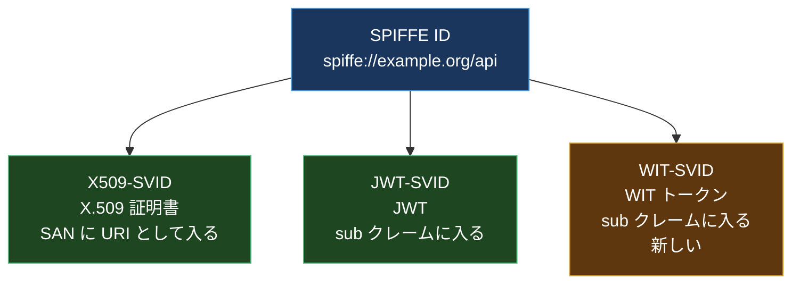
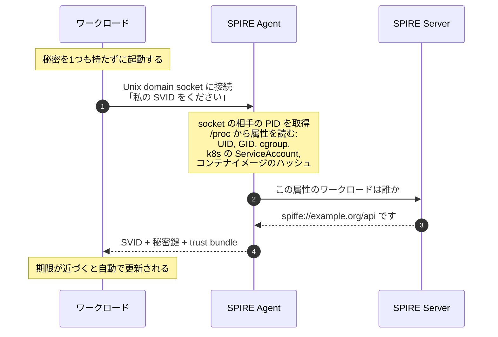
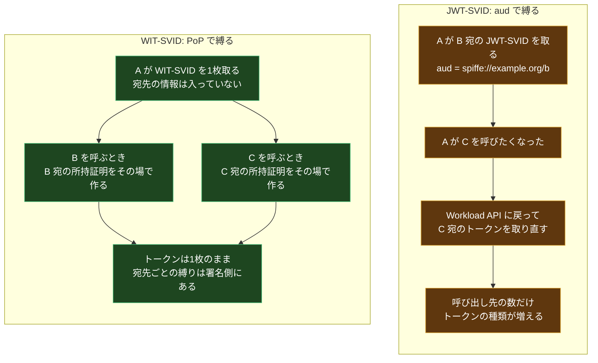
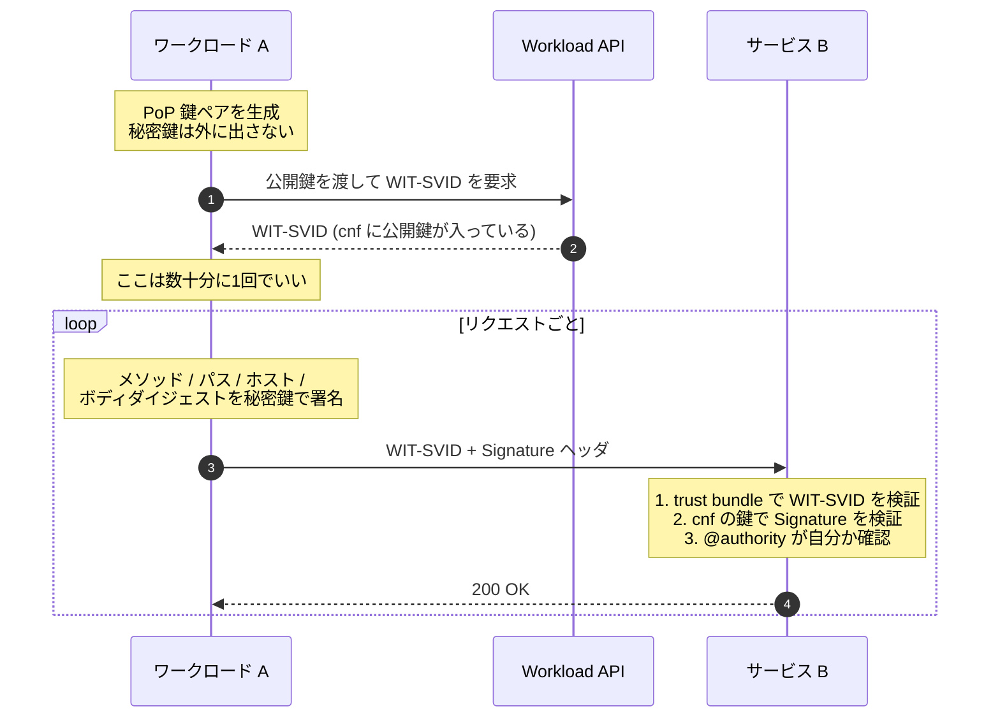

SPIFFE を使っていて、JWT-SVID のところだけずっと落ち着かなかった。

X.509-SVID は良い。mTLS でハンドシェイクするので、証明書を盗んでも秘密鍵がなければ使えない。ワークロードの identity が TLS のコネクションそのものに縛られている。

JWT-SVID はそうではない。ただの JWT で、`Authorization: Bearer <jwt>` に載せて送る。つまり **そのトークンを持っている者は誰でも使える**。ログに出たら終わり。プロキシに抜かれたら終わり。SPIFFE のドキュメントも「JWT-SVID は X.509-SVID が使えない場合の代替であり、有効期間を短くせよ」と書いている。短くしてごまかす、という設計だ。

2026年、この落ち着かなさに対する構造的な答えが SPIFFE の仕様セットに入った。**WIT-SVID** だ。

X.509-SVID、JWT-SVID に続く3枚目の SVID で、IETF の WIMSE ワーキンググループが定義した Workload Identity Token (WIT) を SPIFFE のプロファイルとして取り込んだもの。**所持証明が必須で、bearer としての提示が禁止されている。**

そして仕様を読んでいて、いちばん面白かったのがこれ。

> `aud` (Audience) クレームは WIT-SVID に含めては **ならない**。

JWT で `aud` を禁止する。最初に読んだとき「え?」と思った。この記事では、そこに至る設計を順に追う。SPIFFE を知らない前提から書く。

## 前提1: SPIFFE と SVID とは何か

まず土台から。

**SPIFFE** (Secure Production Identity Framework for Everyone) は、ワークロード (プロセス、コンテナ、VM) に identity を配るための標準だ。CNCF の Graduated プロジェクト。

解こうとしている問題はシンプルで、「サービス A がサービス B を呼ぶとき、A であることをどう証明するか」。従来の答えは環境変数に置いた長命の API キーだったが、これには問題がある。

- 持っているだけで使える
- 誰かが最初にそれを配らないといけない (ブートストラップ問題)
- 誰にも見られていないことを保証できない
- ローテートが手作業になる

SPIFFE の答えは2つの要素からなる。

**1. SPIFFE ID**: ワークロードの識別子。URI の形をしている。

```text
spiffe://example.org/ns/prod/sa/api-server
         ^^^^^^^^^^^ ^^^^^^^^^^^^^^^^^^^^^
         trust domain         path
```

**2. SVID** (SPIFFE Verifiable Identity Document): その SPIFFE ID を暗号学的に証明する書類。

ここで重要なのが、SVID は **1つの文書形式ではない** ということ。SPIFFE は「SVID の情報を既存の文書形式にどうエンコードして検証するか」を定義していて、そのエンコード先が複数ある。



ワークロードはこれを **Workload API** から取る。ここが SPIFFE のいちばん賢い部分だ。



ワークロードは **何の秘密も持たずに起動する**。Agent が OS の情報からワークロードの正体を判定する。これを **attestation** と呼ぶ。ブートストラップ問題がここで解ける。

## 前提2: JWT-SVID の何が弱いのか

X.509-SVID と JWT-SVID の使い分けは、こう説明されている。

- **X.509-SVID**: mTLS が使える場面。これが基本
- **JWT-SVID**: L7 のロードバランサや API ゲートウェイが TLS を終端してしまうなど、mTLS がエンドツーエンドで張れない場面

現実には後者が多い。ALB があり、Ingress があり、CDN がある。エンドツーエンドの mTLS が張れる環境のほうが珍しい。

そして JWT-SVID は **bearer トークン** だ。


同じ経路を通っても、残るものが違う。X509-SVID は秘密鍵が TLS のハンドシェイクから出てこないので、経路上に「再利用可能なもの」が落ちない。JWT-SVID はトークンそのものが権利なので、経路上のどこかに残った時点で負ける。

これに対する JWT-SVID の防御策は2つある。

**1. `aud` で受け手を絞る。** JWT-SVID には `aud` クレームが必須で、送り先の SPIFFE ID を入れる。受け手は「自分宛でないトークン」を拒否する。だから A が B 用に取った JWT-SVID を、B が横流しして C に使うことはできない。

**2. 有効期間を極端に短くする。** 秒から分のオーダー。盗まれても使える時間を減らす。

この2つの組み合わせは、悪くはない。でも構造的な限界がある。

- `aud` で絞れるのは「誰に対して使えるか」だけ。**その `aud` の相手が悪意を持っていたら防げない**。B は A から受け取ったトークンを、有効期間内なら何度でも B 自身に対して再生できる
- 呼び出し先が増えるたびに、`aud` を変えた別のトークンを取り直す必要がある。Workload API へのラウンドトリップが増える
- 有効期間を短くすると、その分だけ取得の頻度が上がる
- 結局「盗まれたら負ける」という性質は残っている。窓を狭めているだけ

**盗まれても使えないようにする** という方向の答えが要る。それが所持証明 (Proof of Possession, PoP) だ。

## 前提3: IETF WIMSE と Workload Identity Token

ここで IETF の話が入ってくる。

**WIMSE** (Workload Identity in Multi System Environments) は、2024年3月に IETF が設立したワーキンググループだ。SPIFFE が仕様として定めているものと、業界が実際に必要としているもののギャップを埋めることを目的にしている。参加しているのは AWS, Google, Microsoft, HashiCorp, Okta, Ping, CyberArk/Venafi など。

WG が採択したドラフトは2026年8月時点で6本。数は多くないが、役割分担がきれいに割れている。

| ドラフト                          | 版と日付        | 中身                              |
| --------------------------------- | --------------- | --------------------------------- |
| `draft-ietf-wimse-arch`           | 08 / 2026-07-06 | 全体アーキテクチャ                |
| `draft-ietf-wimse-identifier`     | 03 / 2026-07-06 | ワークロード識別子                |
| `draft-ietf-wimse-workload-creds` | 02 / 2026-07-02 | クレデンシャル (WIT の定義はここ) |
| `draft-ietf-wimse-wpt`            | 01 / 2026-03-02 | Workload Proof Token              |
| `draft-ietf-wimse-http-signature` | 06 / 2026-08-04 | HTTP 署名によるワークロード間認証 |
| `draft-ietf-wimse-mutual-tls`     | 02 / 2026-07-06 | mTLS によるワークロード認証       |

これとは別に `draft-ietf-wimse-workload-identity-practices` が IESG の審議に入っていて、Informational RFC として出る見込みになっている。

古い記事だと `draft-ietf-wimse-s2s-protocol` という1本のドラフトが出てくるが、**これは現在存在しない**。クレデンシャル定義とバインディング方法 (HTTP 署名 / mTLS) に分割された。この記事を書く過程で自分もその古い名前で理解していたので、datatracker で確認するまで気づかなかった。

中心になるのが **WIT** (Workload Identity Token) だ。

WIT は「SPIFFE の JWT-SVID をわずかに拡張したもの」と説明される。決定的な違いは1つ。

> WIT には **公開鍵が含まれていて、対応する秘密鍵はワークロードが保持している**。これによりサービス呼び出しが送信者に暗号学的に束縛される。

JWT に公開鍵を埋める仕組みは、既に RFC 7800 (Proof-of-Possession Key Semantics for JWTs) が定めている。`cnf` (confirmation) クレームだ。

```json
{
  "sub": "spiffe://example.org/api",
  "exp": 1786800000,
  "cnf": {
    "jwk": {
      "kty": "EC",
      "crv": "P-256",
      "alg": "ES256",
      "x": "...",
      "y": "..."
    }
  }
}
```

これは「この identity のワークロードは、この公開鍵を持っている」という発行者の保証書だ。パスポートに例えるなら、パスポートに署名見本が印刷されている状態。

そして受け手は、このトークンを受け取っただけでは通さない。**その場で秘密鍵による署名を作らせて、`cnf` の公開鍵で検証する**。入国審査でサインを書かせるのと同じ。

## WIT-SVID: SPIFFE が3枚目の SVID を持った

SPIFFE の SIG-Spec は、この WIT を SPIFFE のプロファイルとして取り込む作業を進めてきた。IETF 側のドラフトが固まってくるのに合わせて、SPIFFE 側が **WIT-SVID** として拾い上げた形になる。

現在の仕様の安定性レベルは **Incubating**。開発中で、確定前にコミュニティのフィードバックを必要とする段階だ。

仕様の中身を読んでいく。

### ヘッダ

| パラメータ | 要件                                     |
| ---------- | ---------------------------------------- |
| `alg`      | **MUST**。RS256, ES256, PS256 などに限定 |
| `typ`      | **MUST**。値は `wit+jwt`                 |
| `kid`      | **MUST**。発行鍵を一意に識別する         |

`typ` が `wit+jwt` に固定されているのは、トークン混同攻撃 (別の目的で発行された JWT を WIT として食わせる) を防ぐための定石だ。

`kid` が **MUST** なのが JWT-SVID との違いになる。JWT-SVID では `kid` は任意で、検証側は trust bundle の鍵を総当たりで試すこともできた。WIT-SVID では鍵を列挙せずに選択できることを要求している。実装上の現実的な要求だ。

### クレーム

**必須のもの。**

| クレーム | 要件     | 内容                                                                                                                   |
| -------- | -------- | ---------------------------------------------------------------------------------------------------------------------- |
| `sub`    | **MUST** | ワークロードの SPIFFE ID。`spiffe://example.org/service`                                                               |
| `cnf`    | **MUST** | RFC 7800 の確認クレーム。ワークロードの公開鍵。`cnf.jwk.alg` は ES256, RS256, PS256 などに限定                         |
| `exp`    | **MUST** | 有効期限。検証側はこれが無いトークン、期限切れのトークンを拒否しなければならない。数秒から数分のクロックスキューは許容 |

`cnf` について仕様は明確にこう書いている。

> 検証側は、`cnf` に含まれる鍵ペアの適切な所持証明なしに WIT-SVID を受理しては **ならない**。

つまり **PoP は任意ではなく必須**。`cnf` が無いトークンは拒否する。`cnf` があっても所持証明が無ければ拒否する。

**任意のもの。**

| クレーム | 要件 | 備考                                                           |
| -------- | ---- | -------------------------------------------------------------- |
| `jti`    | MAY  | 監査証跡と個別のトークン識別のため                             |
| `nbf`    | MAY  | 未来の有効期間                                                 |
| `iat`    | MAY  | 診断用                                                         |
| `iss`    | MAY  | ただし **OpenID Connect Discovery と互換な値にすべきではない** |

`iss` の但し書きが面白い。WIT-SVID を OIDC の ID トークンと取り違えて処理されることを避けたいのだと読める。SPIFFE の trust bundle は OIDC Discovery とは別の経路で配られるので、OIDC 互換の issuer を名乗る意味がない。

**そして禁止されているもの。**

| クレーム | 要件         |
| -------- | ------------ |
| `aud`    | **MUST NOT** |

### なぜ `aud` を禁止したのか

ここが最初に引っかかったところだ。JWT-SVID では `aud` が **必須** だったのに、WIT-SVID では **禁止** されている。真逆になっている。

仕様の説明はこうだ。

> スコープの制限は、トークンそのものではなく所持証明のメカニズムに属する。

考えてみると筋が通っている。



宛先を縛る責務が、**トークンの中身から所持証明のレイヤに移った**。

これが効いてくるのは、次の3点だ。

**1. トークンの取得回数が減る。** JWT-SVID は宛先ごとに別のトークンが要るので、10個のサービスを呼ぶワークロードは10種類のトークンを管理する。WIT-SVID は1枚で済む。

**2. 有効期間を伸ばせる。** 仕様は WIT-SVID の有効期間について「JWT-SVID (秒から分) に比べて長め (分から時間) を許容する」としている。理由は明快で、**所持証明があるので再生を防ぐのに短命性を頼る必要がない**。発行者へのラウンドトリップが減る。

**3. `aud` を残すと混乱する。** `aud` があると、実装者は「`aud` を検証すれば安全」と考えてしまう。WIT-SVID の安全性は完全に PoP に依存しているので、そこに別の防御手段を並べると、片方だけ実装される事故が起きる。`MUST NOT` にすることで、PoP を実装する以外の逃げ道を消している。

`aud` の禁止は、2026年1月26日の PR #372 で入った変更だ。

### 提示の仕方の制約

クレームの制約と同じくらい強いのが、**どう送るか** の制約だ。

> - WIT-SVID を **bearer トークンとして提示してはならない**
> - HTTP の **`Authorization` ヘッダを使って提示してはならない**
> - 提示は鍵ペアの所持証明に **束縛されていなければならない**

2つめが強烈だ。`Authorization: Bearer` はもちろん、`Authorization: WIT <token>` のような独自スキームすら禁止している。

理由は運用的なものだと読める。`Authorization` ヘッダは、既存のミドルウェア、プロキシ、ライブラリ、ログ基盤が「bearer トークンとして」扱うことに慣れきっている。そこに WIT-SVID を載せると、どこかの層が bearer として転送 / キャッシュ / ログ出力してしまう。ヘッダを変えることで、**既存の bearer 処理の経路に絶対に乗らない** ことを保証している。

### 3つの SVID の比較

まとめるとこうなる。

|                         | X509-SVID          | JWT-SVID                | WIT-SVID                 |
| ----------------------- | ------------------ | ----------------------- | ------------------------ |
| 文書形式                | X.509 証明書       | JWT                     | JWT (`typ: wit+jwt`)     |
| SPIFFE ID の位置        | SAN の URI         | `sub`                   | `sub`                    |
| 所持証明                | TLS ハンドシェイク | **なし (bearer)**       | **必須 (`cnf`)**         |
| `aud`                   | 該当なし           | **必須**                | **禁止**                 |
| 宛先の縛り方            | TLS コネクション   | `aud` クレーム          | 所持証明の署名           |
| 想定有効期間            | 時間から日         | **秒から分**            | **分から時間**           |
| 送り方                  | TLS レイヤ         | `Authorization: Bearer` | **`Authorization` 禁止** |
| L7 プロキシ越し         | 難しい             | 得意                    | 得意                     |
| Workload API での必須性 | **必須**           | **必須**                | **任意**                 |
| 仕様の安定性            | Stable             | Stable                  | **Incubating**           |

最後の2行が現在地を示している。

## 所持証明は具体的にどう作るのか

「所持証明」と言われても、実際に何を送るのかがイメージできないと使えない。WIMSE が定義しているバインディング方法は主に2つある。

### 方法1: HTTP Message Signatures (RFC 9421)

HTTP リクエストの一部 (メソッド、パス、ホスト、特定のヘッダ、ボディのダイジェスト) をまとめて署名し、`Signature` / `Signature-Input` ヘッダに載せる。

```text
POST /api/orders HTTP/1.1
Host: b.example.org
Workload-Identity-Token: eyJ0eXAiOiJ3aXQranN0Ii...
Content-Digest: sha-256=:X48E9qOokqqrvdts8nOJRJN3OWDUoyWxBf7kbu9DBPE=:
Signature-Input: wit=("@method" "@path" "@authority" \
  "content-digest" "workload-identity-token");created=1786800000
Signature: wit=:MEUCIQDx8...:
```

受け手がやること。

1. `Workload-Identity-Token` ヘッダから WIT-SVID を取り出す
2. trust bundle の鍵 (`kid` で選択) で WIT-SVID の署名を検証する
3. `cnf.jwk` から公開鍵を取り出す
4. その公開鍵で `Signature` を検証する
5. `created` が古すぎないか、`@authority` が自分か、を確認する

`@authority` が署名の対象に入っているので、**B 向けに作られた署名を C に転送しても通らない**。これが `aud` の代わりに宛先を縛っている実体だ。ボディのダイジェストも署名対象に入るので、中身の改ざんも検出できる。



**発行者へのラウンドトリップ (数十分に1回) と、リクエストごとの証明が分離されている** のがこの設計の肝になっている。

### 方法2: mTLS バインディング

mTLS が張れる環境では、TLS のクライアント証明書の鍵と `cnf` の鍵を一致させる方法もある。TLS の Exporter を使って、WIT-SVID をそのコネクションに束縛する。

こちらは「mTLS が張れるなら X509-SVID でいいのでは」という疑問が湧くが、**identity の伝播** の文脈で意味が出る。A → B → C という呼び出しで、B が C に対して「これは A から来たリクエストだ」を渡したいとき、A の WIT-SVID を B が転送する。所持証明があるので、B は A になりすませない。この形は WIMSE のクレデンシャル交換のドラフトが扱っている領域だ。

## 現在地: どこまで使えるのか

「仕様が出たばかりで実装はまだ」と書きかけたが、SPIRE のリポジトリを見たら違った。**実装はすでにかなり進んでいる。**

サーバ側から順に landed している。

| 時期       | PR                                                 | 内容                                                     |
| ---------- | -------------------------------------------------- | -------------------------------------------------------- |
| 2025-11-18 | [#6399](https://github.com/spiffe/spire/pull/6399) | WIT-SVID の RPC をダミー実装で用意                       |
| 2025-12-28 | [#6468](https://github.com/spiffe/spire/pull/6468) | WIT 署名鍵の生成とローテーション                         |
| 2026-02-18 | [#6517](https://github.com/spiffe/spire/pull/6517) | **WIT-SVID の発行 (minting) をサポート**                 |
| 2026-05-01 | [#6857](https://github.com/spiffe/spire/pull/6857) | `iss` クレームのサポート。v1.15.0 に入った               |
| 2026-08-07 | [#7132](https://github.com/spiffe/spire/pull/7132) | `svid.v1` クライアントが WIT-SVID を組み立てられるように |
| 2026-08-14 | [#7134](https://github.com/spiffe/spire/pull/7134) | WIT-SVID 鍵のマーシャリング                              |

つまり **SPIRE Server は WIT-SVID を発行できる**。鍵のローテーションも動く。最後の PR はこの記事を書いている前日にマージされている。

一方で、ワークロードが実際に受け取る口はまだ開いていない。Workload API のインタフェース実装 ([#7034](https://github.com/spiffe/spire/pull/7034)) は2026年7月にクローズされていて、`spire-agent api fetch` にも `x509` と `jwt` しかない。**発行はできるが、ワークロードが取りに行けない**という状態だ。

まとめるとこうなる。

| 項目                        | 状態                                                                    |
| --------------------------- | ----------------------------------------------------------------------- |
| SPIFFE 仕様                 | **Incubating**                                                          |
| Workload API のプロファイル | 定義済みだが **任意 (MAY)**。X509 / JWT は必須 (MUST)                   |
| SPIRE Server の発行機能     | **実装済み**                                                            |
| Workload API 経由の取得     | **未実装**。PR はクローズ、作業継続中                                   |
| IETF WIMSE                  | 採択済み6本。`http-signature` が draft-06 (2026-08-04) で最も動きが速い |

作業全体は [spiffe org の Project 28](https://github.com/orgs/spiffe/projects/28/) で追跡されている。新しい SVID 型を SPIRE / go-spiffe / java-spiffe すべてに入れるのは大仕事だ、というのが SPIRE メンテナ側の見立てで、issue の議論もそこから始まっている。

RFC 化の時期については、アーキテクチャ文書が2026から2027年、スタック全体が揃うのは2027から2028年、という見立てが業界側から出ている。これはあくまで外部アナリストの予測で、IETF が公式に日程を出しているわけではない。

**2026年時点での現実的な方針** はこうなる。

- 本番のワークロード identity には引き続き X509-SVID / JWT-SVID を使う
- WIT-SVID は「もう動きはじめている標準」として扱う。実装が止まっているわけではないので、半年単位で見直す価値がある
- いま設計するシステムでは **JWT-SVID を bearer として使っている箇所を把握しておく**。そこが将来の移行対象になる

## なぜこの合流が重要なのか

ワークロード identity の問題は、これまで各社が独自に解いてきた。AWS は SigV4、Google は署名付き JWT、SPIFFE は X.509-SVID。どれもよくできているが、相互運用はしない。トラストドメインをまたぐたびに変換のグルーコードを書くことになる。

WIT-SVID の意味は、その変換先が1つに寄りはじめたことにある。IETF が標準を作り、CNCF Graduated の SPIFFE がそのサブプロファイルとして実装する。この2つが別々の答えを出さなかった、というのがこの話の一番大きい部分だと思っている。

もうひとつ、設計として面白いのは **`aud` を捨てた判断** だ。JWT で `aud` を必須にするのは20年来の定石で、それを `MUST NOT` にするのは相当な決断になる。だが「宛先を縛るのは所持証明の仕事だ」と決めた以上、`aud` を残すのは責務の二重化でしかない。実装者に「`aud` を見ておけば安全」という逃げ道を与えないために消した、と読める。

標準ができることと、実装が追いつくことの間にはいつも距離がある。ただ今回は、SPIRE 側の PR が月に何本もマージされている。距離は縮まりつつある。

## まとめ

- **WIT-SVID** は SPIFFE の3枚目の SVID。IETF WIMSE の Workload Identity Token を SPIFFE のプロファイルとして取り込んだもの
- `cnf` (RFC 7800) が必須で、**所持証明なしに受理してはならない**。JWT-SVID の bearer 問題を構造的に閉じる
- `aud` は **禁止**。宛先を縛る責務がトークンから所持証明のレイヤに移った。結果としてトークンは1枚で済み、有効期間も伸ばせる
- `Authorization` ヘッダでの提示も禁止。既存の bearer 処理の経路に乗らないことを保証している
- 提示方法は RFC 9421 (HTTP Message Signatures) か mTLS バインディング。宛先と本文が署名対象に入るので転送できない
- 仕様は **Incubating**、Workload API プロファイルは **任意**。ただし SPIRE Server の発行機能はすでに実装済みで、ワークロードが取りに行く口だけがまだ開いていない
- 2026年の方針は「X509-SVID / JWT-SVID を本番で使いつつ、半年単位で WIT-SVID の進捗を見る」。JWT-SVID を bearer で使っている箇所は今のうちに把握しておく

自分の環境で `spire-agent api fetch jwt` を叩いている箇所を探して、そこが将来 WIT-SVID に置き換わる候補だと思っておくといい。いま JWT-SVID の `aud` を宛先ごとに取り直しているコードが、いずれ「トークン1枚 + リクエストごとの署名」に変わる。

## 参考

- [WIT-SVID | SPIFFE](https://spiffe.io/docs/latest/spiffe-specs/wit-svid/)
- [SPIFFE Workload API](https://spiffe.io/docs/latest/spiffe-specs/spiffe_workload_api/)
- [JWT-SVID | SPIFFE](https://spiffe.io/docs/latest/spiffe-specs/jwt-svid/)
- [WIT-SVID support in SPIRE · Issue #6326 · spiffe/spire](https://github.com/spiffe/spire/issues/6326)
- [WIT-SVID 実装の追跡プロジェクト (spiffe org Project 28)](https://github.com/orgs/spiffe/projects/28/)
- [WIMSE WG documents | IETF Datatracker](https://datatracker.ietf.org/wg/wimse/documents/)
- [draft-ietf-wimse-http-signature](https://datatracker.ietf.org/doc/draft-ietf-wimse-http-signature/)
- [RFC 7800: Proof-of-Possession Key Semantics for JWTs](https://datatracker.ietf.org/doc/html/rfc7800)
- [RFC 9421: HTTP Message Signatures](https://datatracker.ietf.org/doc/html/rfc9421)
