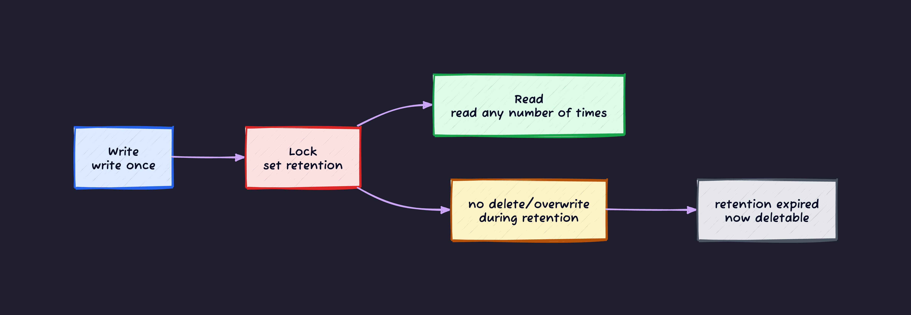
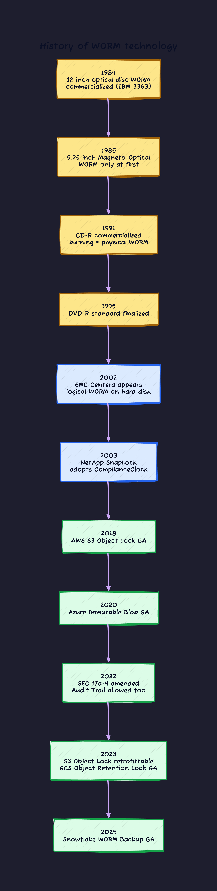
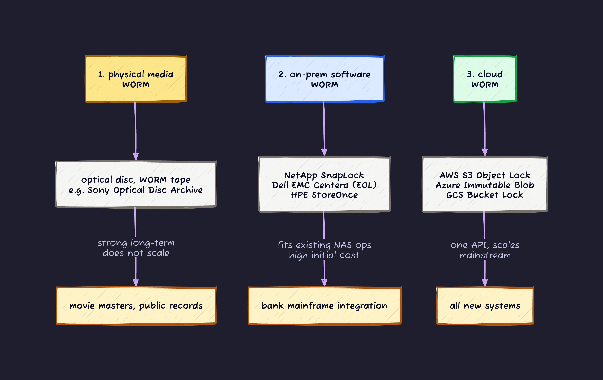
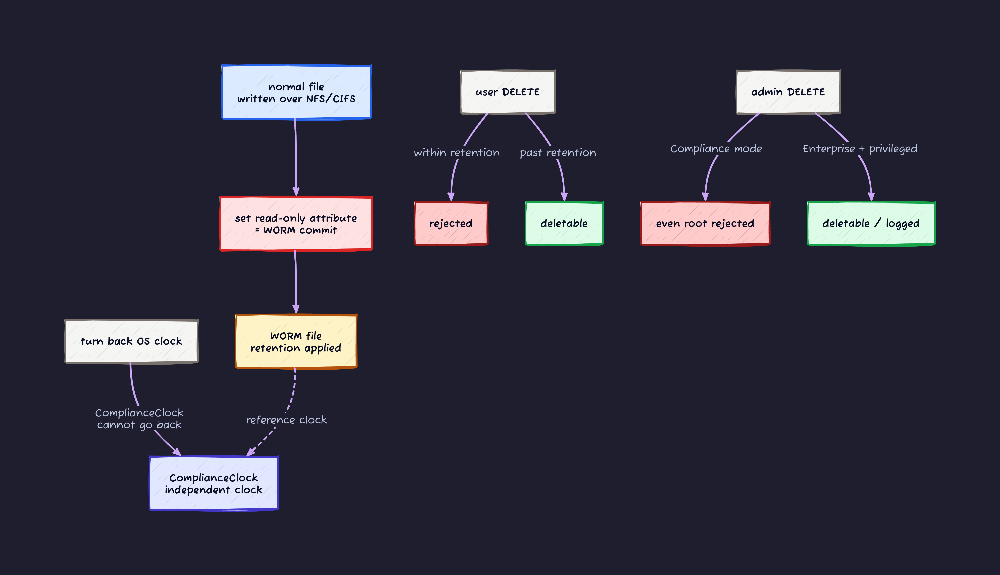
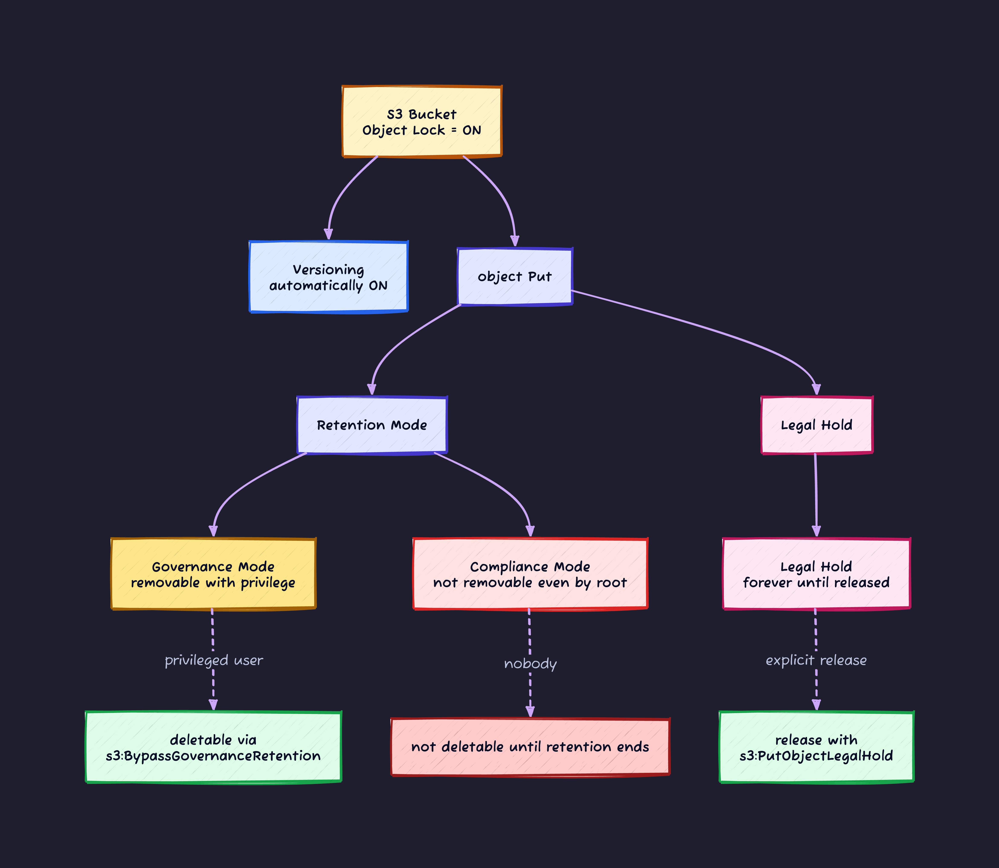
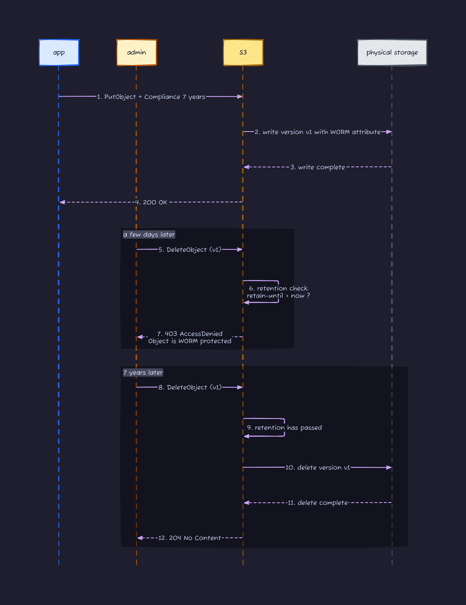
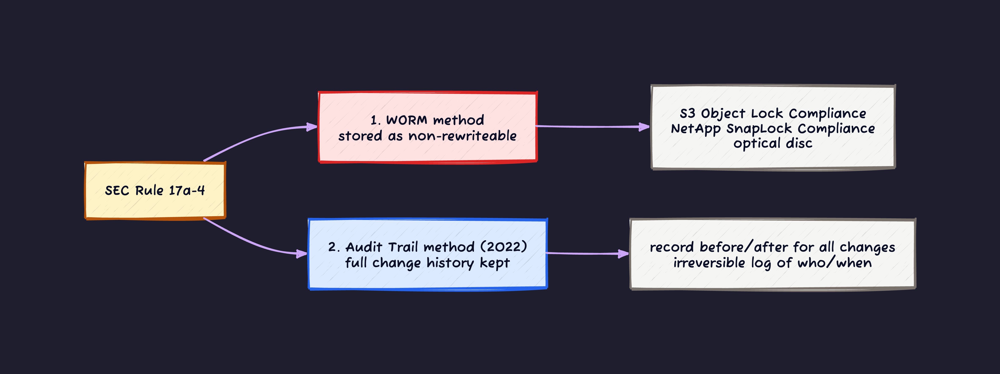
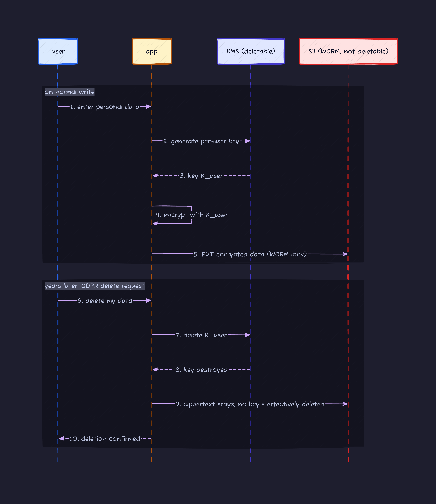
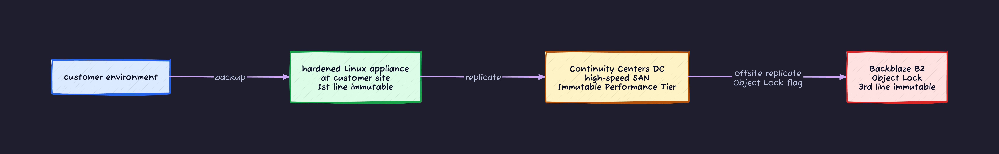

## Introduction

"Data can be deleted." It looks obvious, but it is actually a **fatal default from a legal and ransomware perspective**.

- When an auditor asks for 7 years of email, the moment a single person can type `DELETE`, evidentiary value collapses
- When ransomware encrypts your backups too, recovery is impossible and you end up paying the ransom
- When someone suspects "that trade record was tampered with, wasn't it?", you lose in court unless you can show that tampering is technically impossible

The answer to all of these is **WORM (Write Once Read Many)**. A storage mode where once you write data, **nobody** can delete or rewrite it during the prescribed period. Not the root admin, not the attacker, not the operations team at the service provider.

This article dissects "undeletable storage" in the following order.

1. What WORM is (definition)
2. History of WORM (from optical discs to cloud)
3. The 3 worlds that need WORM (regulation / ransomware / insider threat)
4. The 3 ways to implement WORM (physical / on-prem / cloud)
5. The main event of cloud WORM: dissecting S3 Object Lock
6. Side-by-side comparison: AWS / Azure / GCP / on-prem NetApp
7. Why regulators demand WORM (SEC 17a-4 and the 2022 amendment)
8. The clash with GDPR "right to be forgotten" and how to solve it
9. Famous companies and actual fine cases
10. Design pitfalls and how to avoid them

It is long, but read top to bottom and you will see what WORM is, why it is needed, how to build it, and how to use it as one connected story.

---

## 1. What WORM is

WORM stands for **Write Once Read Many**. It refers to a storage mode in which data, once written, **cannot be rewritten or deleted** until a defined retention period has elapsed.



The definition has three cores.

- **Write Once**: the object **cannot be overwritten** with new content from the start of protection until the retention expires
- **Read Many**: reads are unlimited, by anyone (who is authorized)
- **Retention**: configurable "until when can it not be deleted". Specified in days, or indefinite (Legal Hold)

The key thing to remember: in modern implementations, WORM is **not a property of the whole storage but a flag attached to an object**. Inside one bucket it is normal to have object A locked for 7 years and object B not locked at all.

### "Once" strictly means "that version"

In modern implementations like S3 Object Lock, WORM applies at the **version level**. A new PUT to the same key (path) is written as a **new version**, and the old version remains untouched. So it is "appending to history", not "overwriting content".

This is an important premise for the GDPR "right to be forgotten" conflict discussion later (Section 8).

---

## 2. History of WORM: why it has existed since the 1980s

WORM is not a new concept. It is a technology that **has existed at the physical media level since the 1980s**, moved up to the software layer, and finally became a cloud API.



### Physical WORM era (1984 to 2000)

The first WORM implementations were physically un-rewritable at the media itself.

- **Optical disc WORM**: a laser physically burns pits into the recording layer (ablative). Burnt pits cannot be undone
- **Magneto-Optical (MO)**: the first MO drives in 1985 were **WORM only**. They ran a verification pass after writing, so writing took 3x as long as reading, but reliability was extremely high
- **CD-R / DVD-R**: consumer-grade WORM popular in the 1990s. Burning legal documents, medical images, and broadcaster master tapes onto discs and locking them in a safe was the standard workflow

WORM in this era was complete once you "**put the media in a safe**". A simple guarantee model: tampering is impossible unless an attacker physically reaches the safe.

### Software WORM era (2002 to 2017)

The problem was that optical discs do not scale to TB-class data retention. So the idea emerged: "**provide WORM properties in software on top of ordinary hard disks**".

The representatives were **EMC Centera** (2002) and **NetApp SnapLock** (2003). They put logic at the OS / firmware level on top of a normal HDD array that "rejects delete / overwrite during the retention period".

This solved the scale problem but raised a new issue: **"what if you turn the OS clock back?"**

NetApp killed this with a solution called **ComplianceClock** (detailed in Section 4). An internal hardware-based clock that is independent of the OS clock and only moves forward, used as the basis for retention. This makes the "turn the clock back to expire retention" attack impossible.

### Cloud WORM era (2018 onward)

Since AWS released **S3 Object Lock** in 2018, WORM has become a standard feature of cloud object storage. Azure and GCP followed, and now if you are cloud-native you can get regulation-grade WORM by just "**creating one bucket and flipping a flag**".

Unlike physical media it scales to TB instantly, and replication handles redundancy. The "put media in a safe" workflow of optical discs is now only seen at regional banks, municipalities, and old hospitals.

---

## 3. The 3 worlds that need WORM

Many people think "we are not a regulated industry, so we do not need WORM", but in modern times there are **2 reasons besides regulation** that demand WORM.

| #   | Reason         | What to protect                          | Attack / failure scenario                                            | Main industries                         |
| --- | -------------- | ---------------------------------------- | -------------------------------------------------------------------- | --------------------------------------- |
| ①   | Regulation     | Trade / communication records (5 to 30y) | Legal violation, huge fines, suspension order                        | Securities, banking, healthcare, pharma |
| ②   | Ransomware     | Backups themselves                       | Attacker takes admin rights and encrypts backups along with the rest | All industries (exploded after 2020)    |
| ③   | Insider threat | Audit logs, auth logs, operation history | Admin or DBA deletes logs to hide evidence of wrongdoing             | SOC, SaaS operators, finance in general |

### ① Regulation

Historically this is where WORM was born. The US **SEC Rule 17a-4** is the representative: it requires securities firms to retain trade records in a "**non-rewriteable, non-erasable**" form. Equivalents exist in Japan (FIEA), the EU (MiFID II), healthcare (HIPAA), and pharma (FDA 21 CFR Part 11).

### ② Ransomware

This is the biggest reason WORM use exploded after 2020. Ransomware attackers have established a playbook of **going for the backups first**. Once backups are gone, paying the ransom is the only option.

If "the backup storage is on WORM", attackers cannot delete backups even after taking admin. In fact, backup products like Veeam / Rubrik / Commvault / Cohesity integrate with S3 Object Lock and Azure Immutable Blob and market a feature called "**Immutable Backup**".

### ③ Insider threat

Use audit logs, trade history, and security events for **making sure admins themselves cannot delete them**. For example, if DB access logs flow into WORM storage, a DBA cannot "go delete the logs" after doing something bad.

Especially **SOC (Security Operation Center) logs** and **FIDO / authentication logs** as evidence stores are becoming best practice to flow into WORM.

---

## 4. The 3 ways to implement WORM

From here, the "how to build it" story. In modern times, WORM can be implemented at three large layers.



### ① Physical media WORM

Optical discs or WORM tape. Sony Optical Disc Archive and HPE LTO WORM tapes are the representatives.

- **Pros**: pull the media and put it in a safe and it truly cannot be written (air gap). 50 to 100 year retention track records
- **Cons**: beyond TB-scale you need robotic libraries; cost and ops get heavy. Reading needs a dedicated drive; if you retain longer than the drive lifetime, you need to preserve the drive too
- **Where it is used**: movie studio masters, national archives, broadcaster archives, medical imaging (legal 30-year retention)

### ② On-prem software WORM

Provides WORM at the filesystem or OS level on top of normal HDD / SSD arrays.

The representatives are **NetApp SnapLock** (still active), **Dell EMC Centera** (EOL in 2019, replaced by a tool called CTA), **HPE StoreOnce**, and **Hitachi HCP**.

Taking NetApp SnapLock as an example, internally it works like this.



Key points.

- **WORM commit**: the moment a normal file gets the "read-only attribute" set, SnapLock promotes it to WORM file status. The retention date is recorded at the same time
- **ComplianceClock**: the core of SnapLock. A dedicated clock that **is not affected by `ntpdate` on the OS turning the clock back**. A hardware-based one-way clock initialized once, used as the basis for retention. This makes the "turn the clock back to expire retention" attack impossible
- **Two modes**: Compliance (not deletable even by root) and Enterprise (deletable with privileged delete, but logged)

On-prem WORM is firmly rooted in old banks and hospitals. The reason is simple: it **integrates easily with existing mainframe / NAS operations**, and **"the data lives in our own rack" is easy to explain to auditors**.

### ③ Cloud WORM

The main event since 2018. Starting with AWS S3 Object Lock, almost all major object storage services support WORM: Azure, GCP, Backblaze B2, Wasabi, Cloudflare R2.

We dig deeper in the next section.

---

## 5. The main event of cloud WORM: dissecting S3 Object Lock

S3 Object Lock went GA in November 2018. It is the de facto standard for WORM features, and Azure / GCP designed their APIs with it in mind.

### Big picture



There are three elements.

- **Retention Mode**: period-based (`Days` or `Years`). Two modes: Governance (loose) and Compliance (strict)
- **Legal Hold**: no period; locked indefinitely until explicitly released
- **Both can apply at the same time**: if the normal retention has expired but Legal Hold is on, it still cannot be deleted

### Governance vs Compliance: get this wrong and you have an incident

The difference between them is "**whether even the root user can delete or not**".

| Item                                               | Governance                                   | Compliance                                                               |
| -------------------------------------------------- | -------------------------------------------- | ------------------------------------------------------------------------ |
| Normal user delete                                 | ❌ no                                         | ❌ no                                                                     |
| Privileged delete (`s3:BypassGovernanceRetention`) | ✅ yes                                        | ❌ no                                                                     |
| Root user delete                                   | ✅ yes (effectively)                          | ❌ no                                                                     |
| Shortening retention period                        | yes with privilege                           | ❌ absolutely no (extend only)                                            |
| Changing retention mode                            | can upgrade to Compliance with privilege     | ❌ absolutely no                                                          |
| Only way to release                                | release with privilege                       | **close the entire AWS account** (may still survive retention even then) |
| Use case                                           | "accident prevention", test, internal policy | regulatory requirements like SEC 17a-4                                   |

**Once you put it in Compliance mode, even AWS Support cannot release it**. If you set 7 years, it absolutely stays for 7 years. Use Compliance in a test environment by mistake and the bucket fills with undeletable test data while billing climbs. Compliance is for production regulatory compliance only.

### API: actually applying the lock

The lock is specified by HTTP headers on PUT.

```bash
aws s3api put-object \
  --bucket my-immutable-records \
  --key 2026/q1/trades.csv \
  --body trades.csv \
  --object-lock-mode COMPLIANCE \
  --object-lock-retain-until-date "2033-05-17T00:00:00Z"
```

The essence is what gets sent under the hood.

```http
PUT /2026/q1/trades.csv HTTP/1.1
Host: my-immutable-records.s3.amazonaws.com
x-amz-object-lock-mode: COMPLIANCE
x-amz-object-lock-retain-until-date: 2033-05-17T00:00:00Z
Content-MD5: <base64-md5>
Content-Length: 12345
```

Key points:

- **If you specify `x-amz-object-lock-mode`, `x-amz-object-lock-retain-until-date` is required**. One alone is not allowed
- **`Content-MD5` header is required**: a PUT with object-lock related headers forces MD5 verification. This is to prevent "tampering during PUT"
- **Dates are ISO 8601 (UTC, millisecond precision)**

### Object Lock operation sequence

Following the actual flow of "lock → delete attempt → retention expires → delete" as a sequence.



On the S3 server side, a check of `retain-until-date > current time` runs, and if true it **rejects at the HTTP layer**. Even if a DELETE flies due to an app bug or admin mistake, it never reaches the storage layer.

### Three gotchas when using Object Lock

1. **Versioning is a prerequisite**: to enable Object Lock you need S3 Versioning ON first. Easy if you flip both on at bucket creation, but watch the order when retrofitting an existing bucket (self-service retrofit on existing buckets became possible in November 2023; details in Section 10)
2. **Re-PUT to the same key becomes a new version**: a version that has the lock applied is not removed even by Lifecycle. With Object Lock + Versioning, old versions pile up, so always use `NoncurrentVersionExpiration` in Lifecycle together
3. **Legal Hold uses different IAM Actions**: controlled by `s3:PutObjectLegalHold` / `s3:GetObjectLegalHold`. Manage who can apply or remove Legal Hold under a separate policy from retention

---

## 6. Cloud WORM comparison: AWS / Azure / GCP / on-prem

All three major clouds have WORM features, but the API and terminology differ. Side-by-side comparison.

| Item                         | AWS S3 Object Lock                      | Azure Immutable Blob             | GCS Bucket Lock                         | NetApp SnapLock        |
| ---------------------------- | --------------------------------------- | -------------------------------- | --------------------------------------- | ---------------------- |
| Granularity                  | Object (Version)                        | Container / Version              | Bucket / Object                         | Volume + File          |
| Period unit                  | Days / Years                            | Days                             | Seconds                                 | Days / Years           |
| "Not deletable by root" mode | Compliance                              | Locked Policy                    | Locked Retention Policy                 | Compliance Mode        |
| "Loose" mode                 | Governance                              | Unlocked Policy                  | Unlocked Policy                         | Enterprise Mode        |
| Legal Hold                   | yes                                     | yes                              | yes (Object Hold)                       | yes (Event-Based Hold) |
| Auto-delete after period     | via Lifecycle                           | via Lifecycle                    | via Lifecycle                           | configurable           |
| Regulatory attestations      | SEC 17a-4, FINRA 4511, CFTC 1.31, HIPAA | SEC 17a-4, FINRA 4511, CFTC 1.31 | SEC 17a-4, FINRA, CFTC                  | SEC 17a-4 (longest)    |
| Clock tampering defense      | AWS internal clock (root cannot touch)  | Azure internal clock             | GCP internal clock                      | **ComplianceClock**    |
| First GA                     | Nov 2018                                | 2020                             | 2018 (Bucket Lock) / 2023 (Object Hold) | 2003                   |

The notable fact here is "**cloud WORMs all converged to a similar shape**". S3 Object Lock effectively became the reference implementation.

### Azure peculiarity: Container vs Version

Azure has **two scopes**.

- **Container-level WORM**: WORM policy applied to the entire container. All blobs in the same container share the same retention
- **Version-level WORM**: WORM applied to individual blob versions. Feels almost identical to S3 Object Lock

Recommend Version-level for new designs. Container-level is an older design with less operational flexibility.

### GCP Bucket Lock has a brutal "no going back"

GCS **Retention Policy + Bucket Lock**, once locked, permanently disables the following:

- **Shortening** retention period
- **Deleting** retention policy
- Releasing the bucket retention setting

Extension is allowed. The bucket itself cannot be deleted unless all contents have completed retention and the bucket is empty. **"Oops, my bad" does not work at all**, so always test it in dev / staging before production.

---

## 7. Why regulators demand WORM

Worth understanding "why are the requirements this strict".

### SEC Rule 17a-4: the original

SEC Rule 17a-4 requires US **broker-dealers (securities firms)** to retain trade records and communications (including email and chat) in a "**non-rewriteable, non-erasable form**".

Established in 1997. Originally written assuming paper and microfilm, when electronic records came in, it was interpreted as "if storing electronically, in **WORM format**" and operated that way ever since.

Why so strict? The answer is simple: **lying in securities transactions has huge instant upside**.

- Delete an insider trading evidence email → escape civil sanctions
- Rewrite a customer explanation → win the lawsuit
- Tamper with trade timestamps → push losses onto the customer

If these become technically possible, trust in the whole market collapses. So the logic is to mandate "technically impossible" mechanisms.

### 2022 amendment: the WORM-only era ended

For years 17a-4 allowed only WORM, but **on October 12, 2022 the SEC adopted an amendment** (Effective January 3, 2023; broker-dealer compliance deadline May 3, 2023) adding an alternative called "Audit Trail".



This is a fairly big change: now you can meet the requirement with modern cloud-native designs (for example, streaming DB CDC logs into a separate WORM store). That said, "the most obviously sufficient option is still WORM", so conservative operations continue to choose WORM.

### Other regulations

| Regulation            | Industry                | Role of WORM                                            |
| --------------------- | ----------------------- | ------------------------------------------------------- |
| FINRA Rule 4511       | US securities           | extends 17a-4 to all FINRA member firms                 |
| CFTC Rule 1.31(c)-(d) | US commodities futures  | retain trade records in WORM form                       |
| HIPAA                 | US healthcare           | prevent tampering of PHI (Protected Health Information) |
| FDA 21 CFR Part 11    | US pharma / medical dev | authenticity of electronic records and signatures       |
| FIEA                  | Japan finance           | "store in tamper-proof method for 7 years"              |
| MiFID II              | EU finance              | retain communications 5 years, prevent tampering        |
| GDPR Art. 32          | EU all industries       | integrity assurance (WORM is one concrete option)       |

---

## 8. Clash with GDPR: "right to be forgotten" vs "WORM"

Unavoidable when talking about WORM: the relationship with **GDPR Article 17 (right to be forgotten)**.

The problem is simple.

- GDPR: when a user requests, **delete** their personal data
- WORM: the moment a record containing personal data lands, it **cannot be deleted** during retention

Looks irreconcilable. In fact, this was a long-running headache for cloud WORM design.

### Solution 1: Crypto-Shredding (destroy the encryption key)

The most widespread solution.



Key points:

- The data itself **remains in the WORM S3 still encrypted** (not deleted)
- Generate a separate encryption key per user (envelope encryption)
- When a deletion request comes, **just delete the key**. Data can no longer be decrypted = effectively deleted

This satisfies both "WORM immutability" and "GDPR right to delete". Easy to assemble with AWS KMS plus S3 Object Lock.

### Solution 2: Off-chain / Hybrid

A solution from the blockchain context. Put **only the hash or reference** in WORM storage, and put the actual content in normal storage. When a deletion request comes, delete the content. The hash remains in WORM, so "data of this kind existed at this time" can be proven, but the content itself cannot be reconstructed.

Useful for audit contexts where it is sufficient to prove "data existed at that timestamp".

---

## 9. Famous companies and real cases

Now the reality. What happens without WORM, and how companies that have it use it.

### Case ①: FINRA fines 12 major firms 14.4M USD (2016)

**December 21, 2016**, FINRA fined 12 firms a total of **14.4 million USD**. The reason was that they **"failed to store hundreds of millions of electronic records in WORM format"**. One of the largest WORM-violation fine cases ever.

The top 4 breakdown.

| Rank | Fine  | Firm                                                                |
| ---- | ----- | ------------------------------------------------------------------- |
| 1    | $4.0M | Wells Fargo Securities + Wells Fargo Prime Services (combined)      |
| 2    | $3.5M | RBC Capital Markets + RBC Capital Markets Arbitrage S.A. (combined) |
| 3    | $2.0M | RBS Securities, Inc.                                                |
| 4    | $1.5M | Wells Fargo Advisors + Advisors Financial Network + First Clearing  |
| rest | 3.4M  | 8 firms including PNC Capital Markets ($0.5M)                       |

After this incident, US major securities firms **audited existing systems for WORM compliance all at once**, and migration to cloud WORM accelerated. The general retrospective: the post-fine regulatory remediation cost and reputational risk were far larger than the fine itself.

### Case ②: Continuity Centers ransomware defense (2020)

**Continuity Centers** is a disaster recovery specialist DRaaS provider. In 2020, against the surge of ransomware, they adopted **Veeam + Backblaze B2 Cloud Storage Object Lock**.

The configuration is simple.



CEO Gregory Tellone's comment captures the essence: "Attackers try to **wipe the customer's data center and backups in one go**. Immutability is another line of defense."

A notable point: setup completed **within an hour** of Backblaze's Object Lock announcement. A symbolic case of the era when cloud WORM setup is one API call.

### Case ③: Hospital + Veeam + StoneFly DR365V

A US public hospital with tens of thousands of patients adopted the following to meet HIPAA's long-term medical record retention requirement plus ransomware defense.

- 20 VMware VMs + TB-scale medical records
- Backup product: Veeam
- Storage destination: **StoneFly DR365V air-gap + WORM volume + S3 Object Lockdown**

Three layers of immutability, with tamper-proof copies in local, cloud, and offline.

### Case ④: Snowflake GA's WORM Backup in 2025

The data warehouse **Snowflake** **made WORM Backup generally available in December 2025**. In addition to Time Travel, you can use external S3 / Azure Blob as a retention-lock-capable WORM store to take tamper-proof backups.

As Snowflake usage in financial institutions grew, Snowflake itself moved to the side of providing WORM features to meet SEC 17a-4 / FINRA 4511. A clear trend of platform vendors building WORM in as a "standard feature".

### Case ⑤: Broadcasters / archives (optical disc is still alive)

Even in the cloud era, there is a domain where **optical disc WORM is still alive for long-term archive**.

- Sony's **Optical Disc Archive (ODA)** is the representative. A cartridge bundles multiple dedicated Blu-ray discs; capacity varies by generation from 1.5 TB to 5.5 TB. **The vendor claims 100-year retention**
- Adopted for master storage in broadcasting, video production, and medical imaging
- The decisive properties: "**no power needed once the media is removed**" and "**not subject to the convenience of firmware or cloud providers**"

Even when cloud WORM is one API call away, the reality is that "**no operator guarantees access for 100 years**" (no cloud provider signs a 100-year contract), so for ultra-long-term retention, optical disc or LTO tape WORM is still chosen.

---

## 10. Design pitfalls and how to avoid them

We have seen the mechanics and usage of WORM, so let me close with the landmines easy to step on in implementation.

### Pitfall ①: using Compliance mode lightly

If you use `Compliance` mode in dev / staging / learning buckets, the bucket keeps **bloating with undeletable data while billing climbs**.

Mitigations:

- For verification, always use **Governance mode** or **short retention (1 day)**
- Before production, set an IAM policy / SCP (Service Control Policy) at the organization level that Denies PUT in Compliance mode except for specific IAM Roles

### Pitfall ②: combined with versioning, capacity explodes

Once you enable S3 Object Lock, Versioning is forced ON. If you design with frequent PUTs to the same key, all old versions stay under WORM and cannot be removed.

Mitigations:

- Set **Lifecycle `NoncurrentVersionExpiration`** to delete old versions after retention
- Make it an operational rule that **immutable buckets are "PUT once, never overwrite"** (use date-suffixed keys)

### Pitfall ③: deleting the KMS encryption key

If you encrypted WORM objects with SSE-KMS and delete the KMS Key, you land in **data remains, but cannot decrypt** hell.

Mitigations:

- Operate KMS Keys for WORM buckets as **never delete** (even with `PendingWindowInDays` set to the longest 30 days, operational mistakes happen)
- SCP at the organization level that Denies Key deletion
- If using Multi-Region Keys, consistent management across both regions

### Pitfall ④: Legal Hold release permission held by everyone

If retention is strict but `s3:PutObjectLegalHold` (release permission) is granted to all IAM Roles, Legal Hold is effectively meaningless.

Mitigations:

- Grant Legal Hold `Put` / `Delete` permission **only to a dedicated IAM Role for legal / compliance**
- Log every `PutObjectLegalHold` API call in CloudTrail and stream into SIEM

### Pitfall ⑤: acting on old knowledge that "Object Lock can only be enabled at bucket creation"

For a long time, "**Object Lock can only be turned ON at bucket creation**" was a constraint. There may still be old project plans in your org that gave up with "cannot change anymore" and migrated to a new bucket.

But the **November 20, 2023 update** made it possible to **enable Object Lock self-service on existing buckets** from the console / API. You do not even need to contact AWS Support. To apply retention to existing objects, **S3 Batch Operations** can apply in bulk to billions of objects.

But two caveats:

- **S3 Versioning must be ON before enabling** (Versioning is a prerequisite)
- **Once Object Lock is enabled, it cannot be disabled**. Versioning can no longer be Suspended either. No going back, so do not enable "just to try"

---

## Conclusion

WORM is a feature that looks simple on the surface as "data cannot be deleted", but to actually realize it requires the **physical layer / OS layer / firmware layer / app layer / legal layer** to all click together.

The takeaways:

- **WORM is an old concept that has existed since the 1980s**. The implementation evolved from physical media to software to cloud
- Modern cloud WORM is effectively referenced against **S3 Object Lock**. Azure / GCP provide almost equivalent features
- **Compliance mode = not deletable even by root**, **Governance mode = removable with privilege**. Use Compliance for regulatory production, Governance for internal policy or accident prevention
- WORM demand comes from three sources: **regulation / ransomware defense / insider threat**. Even non-regulated industries should WORM-ify backups
- **NetApp SnapLock's ComplianceClock** is a historic device to defend against clock tampering. In the cloud it is transparently solved internally
- **Conflict with GDPR's right to delete is practically resolved by Crypto-Shredding (destroying the encryption key)**
- The classic three design pitfalls: "do not use Compliance lightly", "watch out for version explosion", "do not delete KMS keys"

Next time you design a backup system, always ask first: "**Is this destination immutable?**". That is the most basic line of defense against both ransomware and audit.

## References

- [SEC Rule 17a-4 / amendment notice](https://www.sec.gov/investment/amendments-electronic-recordkeeping-requirements-broker-dealers)
- [AWS S3 Object Lock official documentation](https://docs.aws.amazon.com/AmazonS3/latest/userguide/object-lock.html)
- [Azure Immutable Storage Overview](https://learn.microsoft.com/en-us/azure/storage/blobs/immutable-storage-overview)
- [GCS Bucket Lock official documentation](https://docs.cloud.google.com/storage/docs/bucket-lock)
- [NetApp SnapLock TR-4526](https://www.netapp.com/media/6158-tr4526.pdf)
- [FINRA Fines 12 Firms a Total of $14.4 Million (2016)](https://www.finra.org/media-center/news-releases/2016/finra-fines-12-firms-total-144-million-failing-protect-records)
- [Continuity Centers + Backblaze Case Study](https://www.backblaze.com/cloud-storage/case-studies/continuity-centers)
- [Snowflake WORM Backups GA (2025-12)](https://docs.snowflake.com/en/release-notes/2025/other/2025-12-10-worm-backups)
