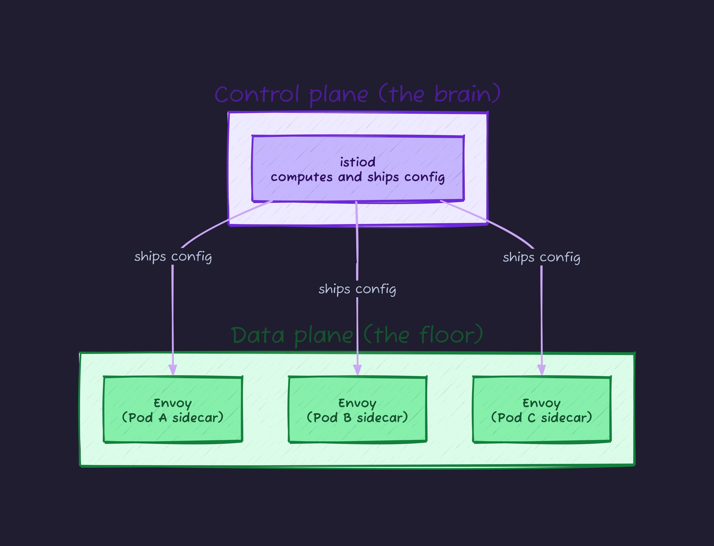
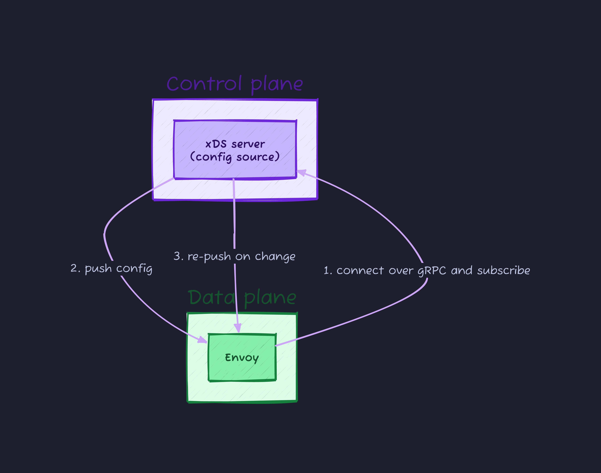
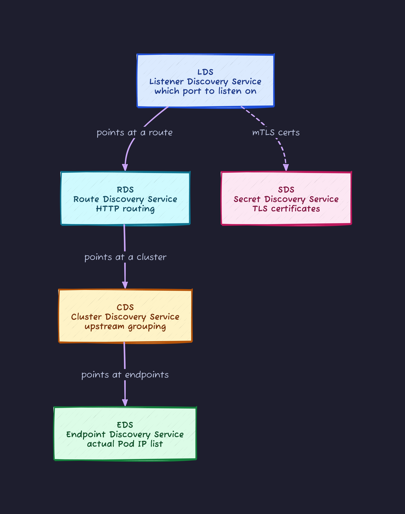
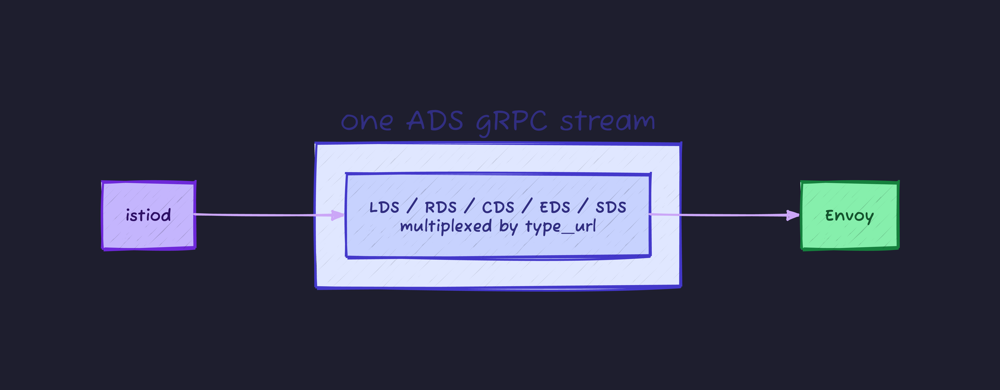
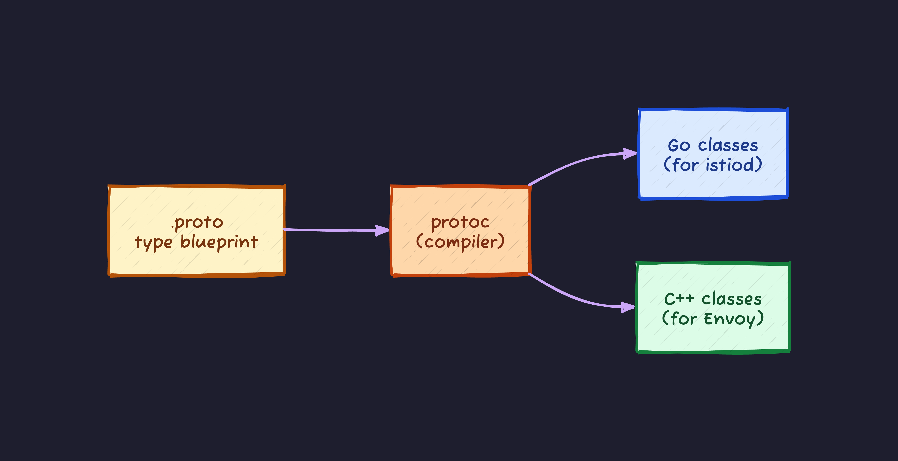
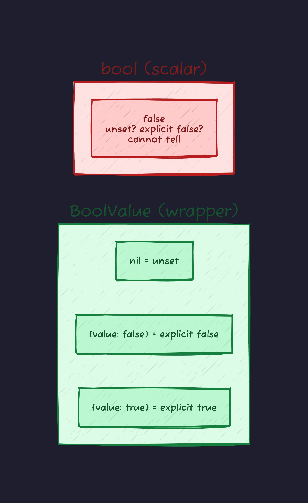
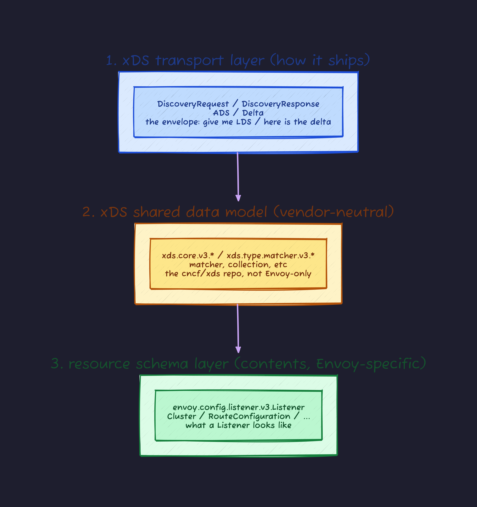
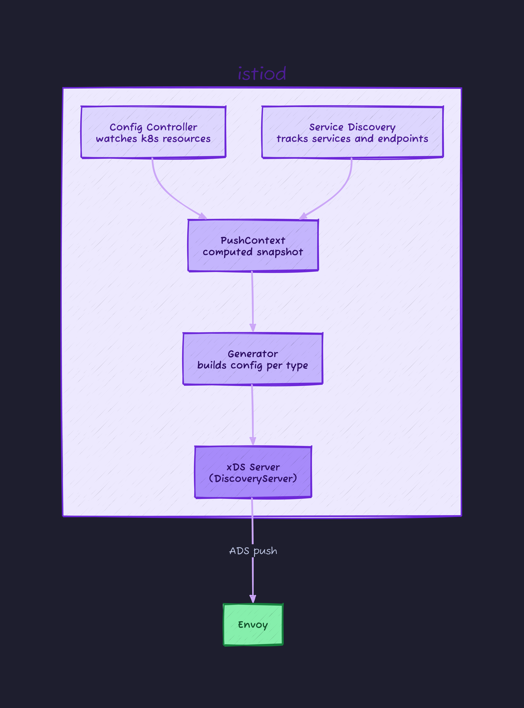
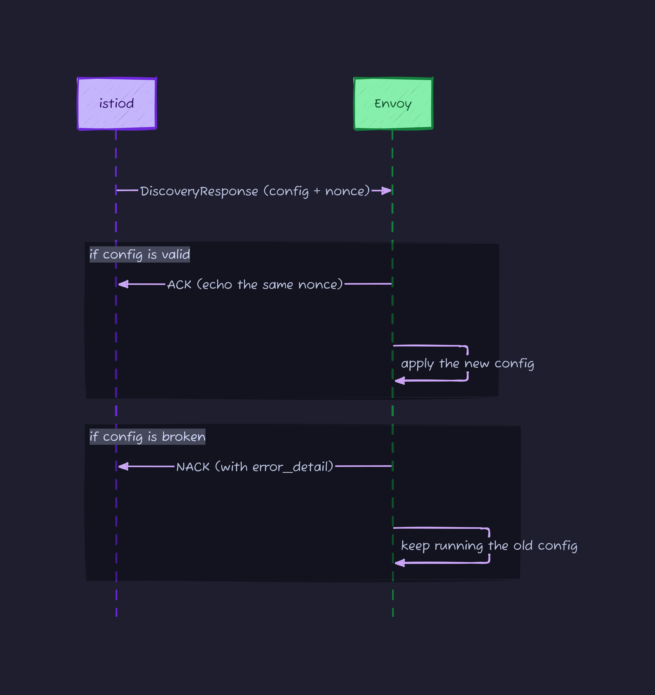
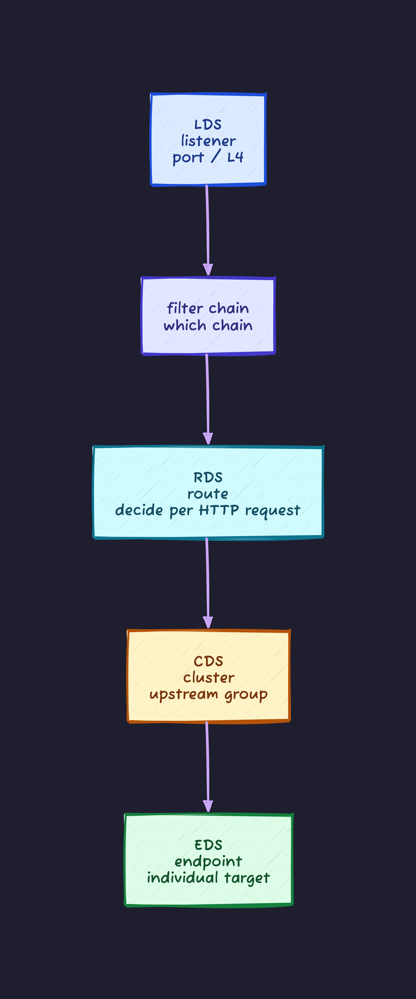

## The thing I had wrong for years

When I started with Istio, one mental model stuck and it was wrong. I knew `istiod` pushed "config" to the Envoy sidecars. Edit a `VirtualService`, routing changes with no restart. It looked like magic.

The picture in my head was this: istiod generates Envoy YAML, ships that YAML to Envoy, and Envoy loads it. Half right, half wrong, and the wrong half is the interesting one. **istiod does not send YAML. It sends protobuf, a binary format, over a gRPC stream.** YAML only shows up at the human-facing edges.

This post follows the payload from the top down. Words like `xDS`, `protobuf`, `gRPC`, `Any`, and `type_url` show up along the way, and each one gets explained where it lands. At the end I stand up Istio locally on kind and pull the actual bytes off the wire to look at them.

By the time you finish, one sentence should feel obvious: the control plane ships Envoy-schema protobuf messages over xDS.

## Cast of characters

Jumping straight into xDS is a good way to get lost, so first the players. A service mesh has two layers.



Here is who is who.

| Term          | What it is                                              | Concrete example here         |
| ------------- | ------------------------------------------------------- | ----------------------------- |
| Data plane    | The layer that actually moves traffic                   | The Envoy sidecar in each Pod |
| Control plane | The layer that tells the data plane how to behave       | istiod                        |
| Envoy         | A programmable proxy that receives and forwards packets | The sidecar itself            |
| sidecar       | A helper container that rides along with the app Pod    | Holds Envoy                   |
| istiod        | Istio's control plane binary (single process)           | The source of config          |

The key point: **Envoy does not know what to do on its own**. Which port to listen on, where to forward, who to trust, all of it comes from the control plane. The mechanism for "telling it" is xDS.

## What problem this even solves

Why ship config at all? Picture running Envoy on a static file and the answer falls out.

Envoy originally boots from a single YAML file (`envoy.yaml`). You write "listen on 8080, forward to the `reviews` service" and it runs. Fine while things are small.

The trouble starts in a moving environment like Kubernetes. Pods come and go by the second. Their forwarding IPs are not stable. Routing rules change on every deploy. mTLS certificates (the certs that let services authenticate each other in both directions) rotate on a schedule. Doing all of that by rewriting YAML and restarting Envoy means dropping connections on every restart, and you never keep up with the churn.

So the idea: receive config through an API instead of a file. When something changes, the control plane streams the delta in, and Envoy never restarts. That mechanism is xDS.

## What xDS is

xDS stands for "**x** Discovery Service". The `x` is a wildcard that later becomes a letter like `L` (Listener) or `C` (Cluster). Mentally expand it to "the family of APIs that ship config to Envoy".

The mechanism is plain: **Envoy dials the control plane over gRPC and receives config**. For now, treat gRPC as "a way to exchange messages over HTTP/2" (its real shape shows up later with protobuf). Config is not pushed at Envoy out of nowhere; Envoy asks for it.



The natural next question: who is the "xDS server" in Istio terms?

| Role                                           | In Istio                                                     |
| ---------------------------------------------- | ------------------------------------------------------------ |
| Control plane process                          | istiod (single binary)                                       |
| The piece inside it that serves xDS            | Pilot (a subsystem of istiod; `DiscoveryServer` in the code) |
| The side that receives config (the xDS client) | Each Pod's Envoy sidecar                                     |

Since Istio 1.5 (2020) istiod is a "modular monolith": Pilot, Citadel, and Galley, once separate processes, were folded into one binary. The part that serves xDS is **Pilot**. So "what part of the control plane serves xDS?" answers as "the xDS server (discovery server)" in general, or "istiod's Pilot" in Istio.

## xDS comes in five flavors

xDS is not one API. It splits by the kind of thing being shipped. Five do the heavy lifting, and they compose inside Envoy to serve a single request.



Read top to bottom and you see one request being resolved.

| Kind | What it ships                                 | Analogy                                         |
| ---- | --------------------------------------------- | ----------------------------------------------- |
| LDS  | Listeners (the address and port to accept on) | The front door                                  |
| RDS  | Routes (where each path or host goes)         | The reception map                               |
| CDS  | Clusters (the group of upstream targets)      | The destination department                      |
| EDS  | Endpoints (the real Pod IPs and ports)        | The home addresses of people in that department |
| SDS  | Secrets (TLS certs and keys)                  | The ID card                                     |

EDS updates the most often, because the set of endpoints changes every time a Pod scales.

### ADS: one stream to carry them all

A fair question: with five types, does Envoy open five connections to istiod? Usually no. Istio uses **ADS (Aggregated Discovery Service)** to bundle all of them onto **a single gRPC stream**.

The reason is ordering. If you tell Envoy about a new cluster (CDS) before its endpoints (EDS), there is a brief window where a config references something that is not there yet, and traffic can drop. One stream lets istiod control the order of delivery.



"How does one stream keep five types apart?" That is what `type_url` is for. Its real shape arrives with protobuf below. For now it is just a per-type label.

## The misconception worth killing

I kept saying "ship config". Back to the wrong mental model from the top.

For a long time I assumed istiod generated Envoy YAML and sent it. `istioctl proxy-config` spits out JSON, Envoy config is "YAML", so of course that is what flows. Right?

**Wrong.** What istiod sends over gRPC is neither YAML nor JSON. It is **protobuf**, a binary format.

YAML shows up in exactly two places. One is when a human hand-writes `envoy.yaml` (the bootstrap config at startup). The other is when protobuf gets rendered back into something readable (`istioctl proxy-config ... -o yaml` and friends). Nowhere on the delivery path does YAML or JSON appear.

To get why, you need to know what protobuf is, which is where this goes next.

## What protobuf is

protobuf is short for Protocol Buffers. It is a Google format, and in one line it is **a language-neutral serialization format, plus a schema language, for packing structs into bytes and back**.

### Serialization, briefly

An object (a struct) in memory cannot go on the wire as is. You convert it to a form that can travel (a byte string). That is serialization. The receiver does the reverse (deserialization) to get the struct back.

JSON, YAML, and XML aim at the same thing. Here is the difference.

| Format   | Kind   | Human-readable | Size  | Parse speed | Schema   |
| -------- | ------ | -------------- | ----- | ----------- | -------- |
| JSON     | text   | yes            | large | slow        | optional |
| YAML     | text   | yes            | large | slow        | optional |
| protobuf | binary | no             | small | fast        | required |

protobuf is unreadable to humans but small and fast, which suits machine-to-machine traffic. When a control plane ships config to thousands of Envoys at high frequency, that difference earns its keep.

### You write the schema first (.proto)

protobuf's defining trait is "define the type first". You write the type in a `.proto` file. A small example:

```proto
message Listener {
  string name = 1;
  Address address = 2;
  repeated FilterChain filter_chains = 3;
}
```

How to read it:

- `message` defines a struct (a class). It is one type.
- Each line is the triple `type name = number;`.
- `= 1`, `= 2` are **field numbers (tags)**. On the wire the field is identified by this number, not by its name. That keeps it small, and a number, once chosen, must never change.
- `repeated` is an array. `filter_chains` can hold many.

Run this `.proto` through the `protoc` compiler and it generates classes in each language.



This is the payoff. **istiod (Go) and Envoy (C++) compile the same `.proto`.** They share the exact same type, so bytes packed by one deserialize straight into the other's class. No intermediate text like YAML is needed.

### How gRPC fits

To close the loop: **gRPC is an RPC framework that carries protobuf**. The messages gRPC exchanges are defined in protobuf. xDS is "stream protobuf over a bidirectional gRPC connection", so protobuf and gRPC always show up together.

### Any and type_url get special treatment

If you read xDS, you cannot avoid `google.protobuf.Any`. A normal field has a fixed type, but `Any` is **a box whose contents type is decided at runtime**.

```proto
message Filter {
  string name = 1;
  google.protobuf.Any typed_config = 2;
}
```

An `Any` looks like this inside:

```text
{
  type_url: "type.googleapis.com/envoy....Router"
  value:    < bytes of a serialized Router >
}
```

`type_url` declares "this is a Router", and `value` holds that type packed into bytes. Envoy reads `type_url` and concludes "then deserialize this as Router".

The reason this exists: filters and plugins are open-ended. The Listener `.proto` cannot enumerate every type in advance, so it keeps a "type decided at runtime" box. The `type_url` from the ADS section is exactly this mechanism, telling the stream "the type flowing right now is X".

## Reading the real listener.proto

That was the setup. Now the real thing. I pulled Envoy's `listener.proto` from upstream. It runs 450 lines, so I will pick out the syntax highlights with their actual line numbers.

The header first.

```proto
syntax = "proto3";                              // line 1: protobuf version
package envoy.config.listener.v3;               // line 3: namespace
import "envoy/config/core/v3/address.proto";    // line 6: import an Envoy type
import "google/protobuf/wrappers.proto";        // line 16: import a Google standard type
import "xds/type/matcher/v3/matcher.proto";     // line 19: import an xds.* type
option go_package = ".../listener/v3;listenerv3";  // line 30: Go package on generation
```

An important fact is already visible. The imported types fall into **three families**: `envoy/*`, `google/protobuf/*`, and `xds/*`. The difference matters later, so keep it in the back of your mind. The `listenerv3` alias in `go_package` is the package name of the generated Go code, which is where the `listenerv3.Listener{}` I used earlier comes from.

Now the body. An excerpt from `message Listener`.

```proto
// [#next-free-field: 39]            // line 64: next free field number is 39
message Listener {
  enum DrainType {                   // line 68: an enum nested inside the message
    DEFAULT = 0;                     // line 71: proto3 enums must start at 0
    MODIFY_ONLY = 1;
  }

  reserved 14, 23;                   // line 140: numbers 14 and 23 are retired, never reuse

  string name = 1;                   // line 145
  core.v3.Address address = 2;       // line 157: type from another package
  repeated FilterChain filter_chains = 3;        // line 176: array
  google.protobuf.BoolValue use_original_dst = 4; // line 207: a wrapper type

  oneof listener_specifier {         // line 416: only one of these may be set
    InternalListenerConfig internal_listener = 27;
  }
}
```

Three things that look strange on first read.

### reserved (retired numbers)

`reserved 14, 23;` (line 140) seals off field numbers that were used in the past. The field number is the on-wire identifier, so if a client from back when 14 held a different type is still around, reusing 14 makes that old client misread the bytes. So the number is reserved and never used again. The weight of a number here is nothing like a JSON key name.

### Wrapper types (the one that matters most)

`google.protobuf.BoolValue use_original_dst = 4;` (line 207). Why `BoolValue` instead of `bool`?

A proto3 scalar (`bool`, `int32`, and so on) **cannot tell "unset" from "the zero value"**. `bool` defaults to `false`, so "explicitly false" and "never set" are indistinguishable.

Envoy config has many fields that need all three states (true / false / unset). The fix is to wrap `bool` in a message, `BoolValue`. **A message can express presence**, so you get the distinction.



`UInt32Value` and `Duration` follow the same logic. When you hit an `XxxValue` in Envoy `.proto`, it is a field that needs to tell all three states apart.

### oneof (mutually exclusive)

`oneof listener_specifier` (line 416) means **exactly one** of its fields is set. You cannot hold two at once. It expresses "A or B, not both" at the schema level.

## The xDS proto and the Envoy proto are not the same

Back to the imports splitting into three families. This is the structure I most want to land. "Is the xDS proto different from the Envoy proto?" Yes, **and it splits into three layers**.



As a table.

| Layer             | What                                                         | Where defined                | Envoy-only                        |
| ----------------- | ------------------------------------------------------------ | ---------------------------- | --------------------------------- |
| Transport         | The subscribe and deliver envelope (the xDS protocol itself) | `envoy/service/discovery/v3` | Spec is general, defined in envoy |
| Shared data model | Base types like matcher                                      | `xds.*` (cncf/xds)           | No, vendor-neutral                |
| Resource schema   | The contents of Listener, Cluster, etc                       | `envoy.config.*` (envoy)     | Yes, Envoy-specific               |

The history makes it click. xDS types all used to live in Envoy's repo under `envoy.api.v2.*` (the `previous_message_type = "envoy.api.v2.Listener"` inside `listener.proto` is the fossil of that). Then there was a push to make xDS a general API usable beyond Envoy, because gRPC itself wants to speak xDS without a proxy ("proxyless gRPC"). The shared parts were carved out into `cncf/xds` (formerly UDPA, the Universal Data Plane API). The `xds/core/v3` and `xds/type/matcher/v3` imports are that.

But **the shape of resource bodies like Listener and Cluster is still defined by Envoy**, because what the data plane can interpret is Envoy's call to make.

So the precise statement:

> xDS is "the delivery protocol" plus "vendor-neutral base types". The contents of Listener and Cluster are Envoy's proto. What istiod ships is "the xDS transport envelope, stuffed with Envoy-schema resources".

What ties ① and ③ together is `type_url`. The envelope `DiscoveryResponse` (layer ①) holds an `Any`, and its `type_url` points at `type.googleapis.com/envoy.config.listener.v3.Listener` (layer ③). ① is the envelope, ③ is the letter inside.

## When does the protobuf get filled in

An important distinction. The `.proto`, and the Go/C++ classes generated from it, are **types only, with zero bytes of data**. So when does the content get filled in?

At runtime, while istiod is running. On a timeline, building the type and filling the data are clearly separate.


Inside istiod, information read from Kubernetes gets poured into the empty types. The code looks roughly like this.

```go
lis := &listenerv3.Listener{}            // new up the type (still empty)
lis.Name = "0.0.0.0_8080"                // fill a value
lis.Address = buildAddress(svc)          // fill from the Service
lis.FilterChains = buildChains(vs, eps)  // fill from VirtualService and Endpoints

bytes, _ := proto.Marshal(lis)           // turn it into bytes here
stream.Send(resp)                        // send to Envoy
```

Phase by phase, the data state changes like this.

| Phase           | When                        | What happens                        | Data state                |
| --------------- | --------------------------- | ----------------------------------- | ------------------------- |
| Definition      | When you write the `.proto` | Decide the type's shape             | No data (blueprint)       |
| Code generation | Build time (protoc)         | Turn the type into language classes | No data (empty classes)   |
| Filling         | While istiod runs           | Pour Kubernetes info into the type  | Values present            |
| Sending         | On each fill                | Marshal and push                    | Becomes bytes on the wire |

### What goes on inside istiod

A bit deeper. istiod has several subsystems, and filling the config happens through their interplay.



istiod reads 20-plus resource types (VirtualService, Service, and the rest) and aggregates them into an internal snapshot called `PushContext`. Then a per-type `Generator` (`RouteGenerator` and friends) builds config tailored to the Envoy that connected.

The interesting part: **generation depends on which Envoy connected**. istiod does not translate inputs to xDS mechanically. It looks at the client's labels and computes "the set of policies that apply to this proxy" before building config. The cost of that flexibility is that config translation eats most of istiod's resources. When istiod pins a CPU on a large mesh, this generation step is usually why.

### What triggers a fill

Two main triggers.

1. **When Envoy connects and subscribes**: Envoy boots, opens a gRPC stream to istiod, and sends a `DiscoveryRequest` ("give me LDS"). istiod fills the latest snapshot into the type and returns it.
2. **When config changes**: someone runs `kubectl apply`, a Pod scales and endpoints change, and so on. istiod's watch fires, and it recomputes and pushes to the affected Envoys.

It does not fire blindly. istiod batches changes for a moment (debounce) and only sends the kinds that changed. Endpoints only? Just EDS. A VirtualService? RDS and maybe CDS, and so on.

There are also two delivery styles: "State of the World (SotW)", which sends everything, and "Delta (Incremental) xDS", which sends only the diff. **Delta became the default in Istio 1.22**, because at scale SotW means re-sending every resource each time, which is heavy on the network and the control plane.

## What Envoy does with it

Switch to Envoy's side. When Envoy receives the protobuf bytes, it does not convert them to YAML. It deserializes the bytes straight into the matching type (a C++ class) it already holds, and that becomes the live `listener` or `cluster`.

istiod turns a Go object into bytes; Envoy turns bytes back into a C++ object. Neither side ever touches a text form (YAML or JSON). The JSON you see in `istioctl proxy-config` is Envoy rendering the binary into something readable for debugging, not the engine running on JSON.

### ACK/NACK rejects broken config

Delivery is not fire and forget. Envoy validates what it receives and replies ACK if it applied, NACK if it could not.



The `nonce` is an identifier stamped on each delivery, used to match a reply to the response it answers. On a NACK, Envoy drops the new config and keeps running the old one. That makes it a safety net: pushing broken config does not instantly kill traffic. A NACK in istiod's logs usually means the generated config is invalid for the Envoy version that sidecar runs.

## Applying it: which layer does metadata go in

You now know what flows. The question that always comes up in real design is: when you want to inject some metadata (this Pod is v2, this path needs stronger auth, and so on), which of LDS/RDS/CDS/EDS is the right place? There is a clear rule for this, and each layer has things only it can express.

### The two questions

Envoy processes one request from upstream to downstream in this order.



Where metadata goes is decided by asking, in order:

1. **What does this metadata vary by?** Per port means LDS, per service means CDS, per path or header means RDS, per Pod means EDS. The smallest grain at which it differs is the layer.
2. **Who reads it, and when?** Place it at the layer where the consuming filter or load balancer runs, or upstream of it, or it cannot be read.

### What only each layer can express

"Only" is not a figure of speech here. It means structurally there is nowhere else to put it.

| Layer | Where it goes (proto)                         | What only this layer can express                                                                                                        |
| ----- | --------------------------------------------- | --------------------------------------------------------------------------------------------------------------------------------------- |
| LDS   | `Listener.metadata` / FilterChain             | Whether a filter is installed at all. Later layers can only override what this installs. L4 decisions like SNI and original destination |
| RDS   | `Route.metadata` / `typed_per_filter_config`  | Decisions based on HTTP request attributes (path, header). Per-path filter overrides (rate limit, ext_authz) live only here             |
| CDS   | `Cluster.metadata` / `lb_subset_config`       | The subset "key definition", load balancing policy, circuit breakers, upstream TLS                                                      |
| EDS   | `LbEndpoint.metadata` / `LocalityLbEndpoints` | Per-target values (version=v2 and such), locality/zone, per-endpoint weight and health                                                  |

Concrete "physically nowhere else" cases:

- **A value that differs per Pod** (this Pod is v2, this one is in Zone-A) attaches only to an endpoint. EDS is the only home.
- **Behavior per HTTP path** (only `/admin` gets stronger auth) can only see the request at the route, so it is RDS-only.
- **Whether a filter exists at all** is decided at LDS (the filter chain). Trying to override a filter via RDS `typed_per_filter_config` that LDS never installed is "overriding a filter that is not there", and it does nothing.

### How the wrong layer breaks

This is the most common trap in practice. Pick the wrong layer and you get "config applies but does nothing".

- Put a per-endpoint value on the Cluster (CDS) and it becomes shared across all Pods, so the per-Pod distinction vanishes.
- Put `typed_per_filter_config` on a route but never install that filter in the LDS filter chain, and it is silently ignored (sometimes without even a NACK).
- Put a subset match on RDS but leave `subset_selectors` undefined on CDS, or leave that key off the EDS endpoint metadata, and nothing matches, so you get a 503.

### Worked example: canary by version (three layers split the job)

"Split `reviews` into v1/v2/v3 by version label, and send a slice of traffic to v2." This one feature decomposes across three layers, each doing the part only it can.

```text
CDS (Cluster.lb_subset_config):
    subset_selectors: [{ keys: ["version"] }]      # declare: build subsets by version

EDS (LbEndpoint.metadata):
    10.244.0.11 -> {"envoy.lb": {"version": "v1"}}  # tag each Pod with its label value
    10.244.0.20 -> {"envoy.lb": {"version": "v2"}}

RDS (Route.route.metadata_match):
    { "envoy.lb": {"version": "v2"} }              # select: route to the v2 subset
```

In Istio terms, each layer maps like this.

| What you write in Istio                 | The xDS it generates   | The job it does                            |
| --------------------------------------- | ---------------------- | ------------------------------------------ |
| `DestinationRule.subsets` (version key) | CDS `subset_selectors` | Declares the "split by version" structure  |
| The Pod's `version: v2` label           | EDS endpoint metadata  | Tags each target with the value            |
| The `VirtualService` route              | RDS `metadata_match`   | Selects the destination subset per request |

The point: one concern, version, decomposes by grain into three layers. The value differs per Pod so it is EDS, "split by version" is a property of the whole Cluster so it is CDS, and the actual selection happens at request time so it is RDS. **Routing one concern to the right layer by its grain is what designing with xDS is.**

### Quick reference: where does it go

| What you want to inject                        | Layer | proto field                                   |
| ---------------------------------------------- | ----- | --------------------------------------------- |
| Per-Pod tags, zone, weight                     | EDS   | `LbEndpoint.metadata` / `LocalityLbEndpoints` |
| Service-wide LB policy, subset definition, TLS | CDS   | `Cluster.metadata` / `lb_subset_config`       |
| Per-path or per-header filter behavior         | RDS   | `Route.typed_per_filter_config` / `metadata`  |
| Port, filter setup, L4 decisions               | LDS   | `Listener.metadata` / FilterChain             |

## Hands-on: pull a raw DiscoveryResponse

I have been saying "protobuf flows" in words. Now confirm it with your own eyes. Stand up Kubernetes on kind, install Istio, and pull the actual bytes istiod ships, then decode them with `protoc`.

You need `docker`, `kind`, `istioctl`, `kubectl`, `grpcurl`, and `protoc`. On a Mac, `brew install kind grpcurl protobuf` plus `istioctl` from the official instructions.

### Step 1: stand up the cluster and Istio

```bash
# create the kind cluster
kind create cluster --name xds-demo

# install Istio, minimal profile
istioctl install --set profile=demo -y

# deploy a sample app (Bookinfo) with sidecar injection
kubectl label namespace default istio-injection=enabled
kubectl apply -f samples/bookinfo/platform/kube/bookinfo.yaml

# wait for the Pods to come up
kubectl wait --for=condition=ready pod --all --timeout=180s
```

### Step 2: the human-facing view with istioctl

Start with ordinary debugging. See what Listeners istiod generated for a given Envoy. Every output from here on is the real thing, captured by running these steps.

```bash
# grab the productpage Pod name
POD=$(kubectl get pod -l app=productpage -o jsonpath='{.items[0].metadata.name}')

# the Listener list for that Envoy
istioctl proxy-config listeners "$POD"
```

It comes out as a readable table (excerpt).

```text
ADDRESSES      PORT   MATCH                                   DESTINATION
10.96.0.10     53     ALL                                     Cluster: outbound|53||kube-dns.kube-system.svc...
0.0.0.0        80     Trans: raw_buffer; App: http/1.1,h2c    Route: 80
10.96.0.1      443    ALL                                     Cluster: outbound|443||kubernetes.default.svc...
10.96.151.152  443    ALL                                     Cluster: outbound|443||istiod.istio-system.svc...
0.0.0.0        9080   Trans: raw_buffer; App: http/1.1,h2c    Route: 9080
0.0.0.0        9080   ALL                                     PassthroughCluster
```

Add `-o yaml` to see the protobuf dumped into a YAML view. Remember that this YAML is a readable rendering of the protobuf, not what went over the wire.

```bash
istioctl proxy-config listeners "$POD" -o yaml | head -50
```

### Step 3: see the type_url in the open

Next, pull the config dump from Envoy's admin endpoint and list the `@type` values.

```bash
# port-forward Envoy's admin API
kubectl port-forward "$POD" 15000:15000 &

# list the @type values (the type_url) inside config_dump
curl -s localhost:15000/config_dump | jq -r '.configs[]."@type"' | sort -u
```

The real output:

```text
type.googleapis.com/envoy.admin.v3.BootstrapConfigDump
type.googleapis.com/envoy.admin.v3.ClustersConfigDump
type.googleapis.com/envoy.admin.v3.ListenersConfigDump
type.googleapis.com/envoy.admin.v3.RoutesConfigDump
type.googleapis.com/envoy.admin.v3.ScopedRoutesConfigDump
type.googleapis.com/envoy.admin.v3.SecretsConfigDump
```

That `type.googleapis.com/...` is `type_url`. It is the protobuf `Any` declaring "what type is inside this", and you can see Listener, Cluster, Route, and Secret each carrying a different `type_url`.

### Step 4: pull a raw DiscoveryResponse from istiod

This is the part the setup was for. istiod also speaks xDS on port `15010` (plaintext), so you can hit the ADS stream directly with `grpcurl` and pull a raw `DiscoveryResponse`. You pretend to be Envoy and ask for Listeners.

```bash
# borrow the node ID from the real Envoy bootstrap
NODEID=$(istioctl proxy-config bootstrap "$POD" -o json | jq -r '.bootstrap.node.id')

# port-forward istiod's xDS port
kubectl -n istio-system port-forward deploy/istiod 15010:15010 &

# ask ADS for Listeners and inspect the structure of the envelope that comes back
grpcurl -plaintext -max-time 8 -d @ localhost:15010 \
  envoy.service.discovery.v3.AggregatedDiscoveryService/StreamAggregatedResources <<EOF \
  | jq '{typeUrl, nonce, count: (.resources|length), first_type: .resources[0]."@type", first_name: .resources[0].name}'
{"node":{"id":"$NODEID"},"typeUrl":"type.googleapis.com/envoy.config.listener.v3.Listener"}
EOF
```

The real thing that came back (`grpcurl` renders the protobuf as JSON):

```text
NODEID = sidecar~10.244.0.11~productpage-v1-xxxxx.default~default.svc.cluster.local

{
  "typeUrl": "type.googleapis.com/envoy.config.listener.v3.Listener",
  "nonce": "2026-06-09T14:23:1...",
  "count": 18,
  "first_type": "type.googleapis.com/envoy.config.listener.v3.Listener",
  "first_name": "10.96.174.178_15021"
}
```

This is the envelope, the `DiscoveryResponse`, in the flesh. `typeUrl` declares "the stream is carrying Listener type right now", `nonce` is the identifier for matching ACK/NACK, and `resources` holds 18 entries, each wrapped in an `Any` whose `@type` points at Listener. The earlier "stuff Envoy-schema resources into the transport envelope" is right there in the open.

### Step 5: see field numbers with protoc --decode_raw

Last, confirm by hand that protobuf "identifies fields by number". `grpcurl` formats to JSON, so here I build a tiny proto that mirrors only the first fields of `listener.proto`, encode it, and feed the raw bytes to `protoc --decode_raw`.

```bash
# a minimal proto with the same field numbers as listener.proto
cat > mini.proto <<'PROTO'
syntax = "proto3";
message SocketAddress { string address = 1; uint32 port_value = 2; }
message Address { SocketAddress socket_address = 1; }
message Listener { string name = 1; Address address = 2; }
PROTO

# fill values and encode to binary
cat > listener.txtpb <<'TXT'
name: "0.0.0.0_9080"
address { socket_address { address: "0.0.0.0" port_value: 9080 } }
TXT
protoc --encode=Listener mini.proto < listener.txtpb > listener.bin

# decode the raw bytes with no type info
protoc --decode_raw < listener.bin
```

The real output. No field names, just **the field numbers as keys**.

```text
1: "0.0.0.0_9080"
2 {
  1 {
    1: "0.0.0.0"
    2: 9080
  }
}
```

`1:` is the Listener `name`, `2 {` is `address`, the `1 {` inside is `socket_address`, and `2: 9080` is the port. Recall the proto: `string name = 1;`, `core.v3.Address address = 2;`, and `port_value = 2` on `SocketAddress`. Those numbers show up in the decode exactly. **That is the hard proof that what flows is not YAML but protobuf packed by field number.**

### Step 6: tear down

```bash
kind delete cluster --name xds-demo
```

A script that reproduces this hands-on end to end lives at `articles/assets/xds-protobuf-deep-dive/run.sh`.

## Wrap-up

Long road, so a retrace from the top.

- A service mesh has a **control plane (istiod)** and a **data plane (Envoy)**. Envoy does not know what to do on its own and gets config from the control plane.
- Shipping config over an API instead of a file is **xDS**. In Istio, **Pilot** inside istiod serves it, and each Envoy sidecar receives it.
- The contents come in **LDS/RDS/CDS/EDS/SDS**, bundled onto one stream by **ADS**.
- What flows is **protobuf, not YAML**. YAML lives only at the human-writing edge and the debug view.
- protobuf means **defining the type in `.proto` first**, then generating language classes with protoc. The `.proto` is type only; **the data is filled in at runtime by istiod**.
- xDS is three layers. The **delivery (transport)**, the **vendor-neutral base types (cncf/xds)**, and the **Envoy-specific resource schema** are distinct, and `type_url` ties the envelope to the contents.
- Where metadata goes is set by **the grain it varies by** and **who reads it**. Per Pod is EDS, per service is CDS, per path is RDS, per port is LDS. Routing one concern to the right layer by grain is the essence of designing with xDS.
- Finally, decoding the raw bytes on kind shows the field numbers from `listener.proto` appearing verbatim, confirming with your own eyes that protobuf is what flows.

"The control plane ships Envoy-schema protobuf messages over xDS." If that sentence lands, the post did its job. Next time you reach for `istioctl proxy-config` during an Istio incident, you can see what is happening behind it.

## References

- [xDS REST and gRPC protocol (Envoy documentation)](https://www.envoyproxy.io/docs/envoy/latest/api-docs/xds_protocol)
- [xDS configuration API overview (Envoy documentation)](https://www.envoyproxy.io/docs/envoy/latest/intro/arch_overview/operations/dynamic_configuration)
- [Common discovery API components, discovery.proto (Envoy documentation)](https://www.envoyproxy.io/docs/envoy/latest/api-v3/service/discovery/v3/discovery.proto)
- [istio/architecture/networking/pilot.md](https://github.com/istio/istio/blob/master/architecture/networking/pilot.md)
- [Istio Delta xDS Now on by Default: What's New in Istio 1.22](https://tetrate.io/blog/istio-service-mesh-delta-xds)
- [cncf/xds repository](https://github.com/cncf/xds)
- [Protocol Buffers documentation](https://protobuf.dev/)
