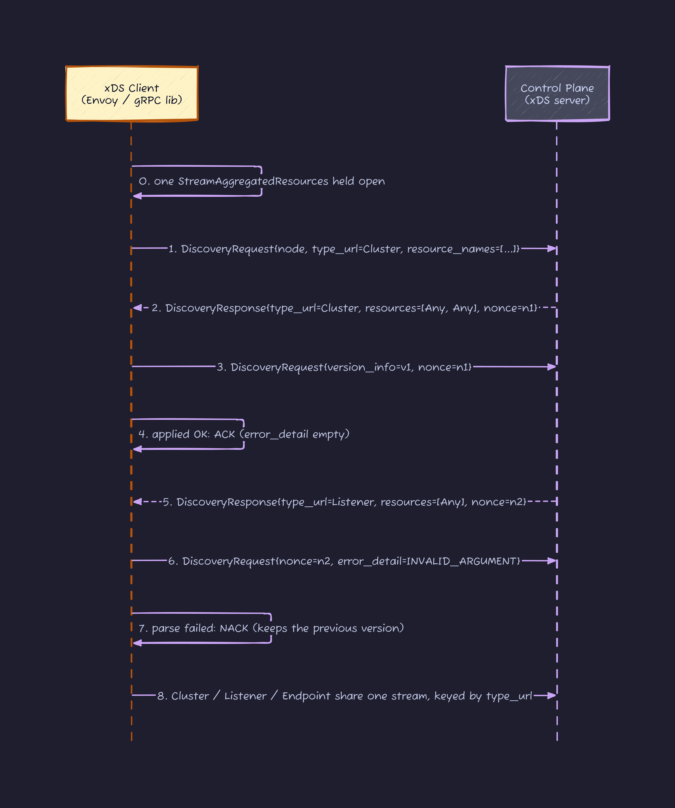
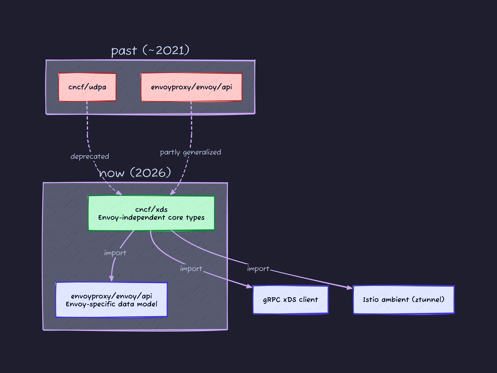
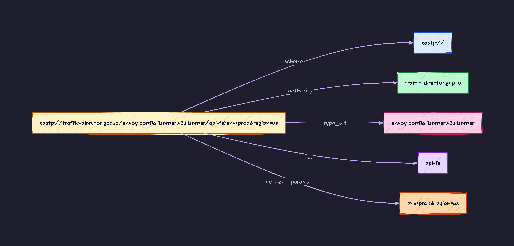
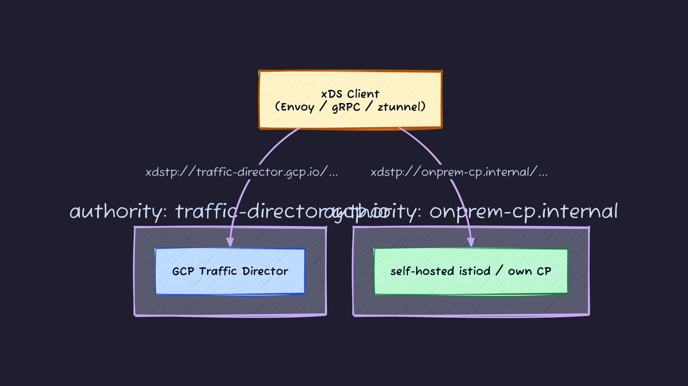
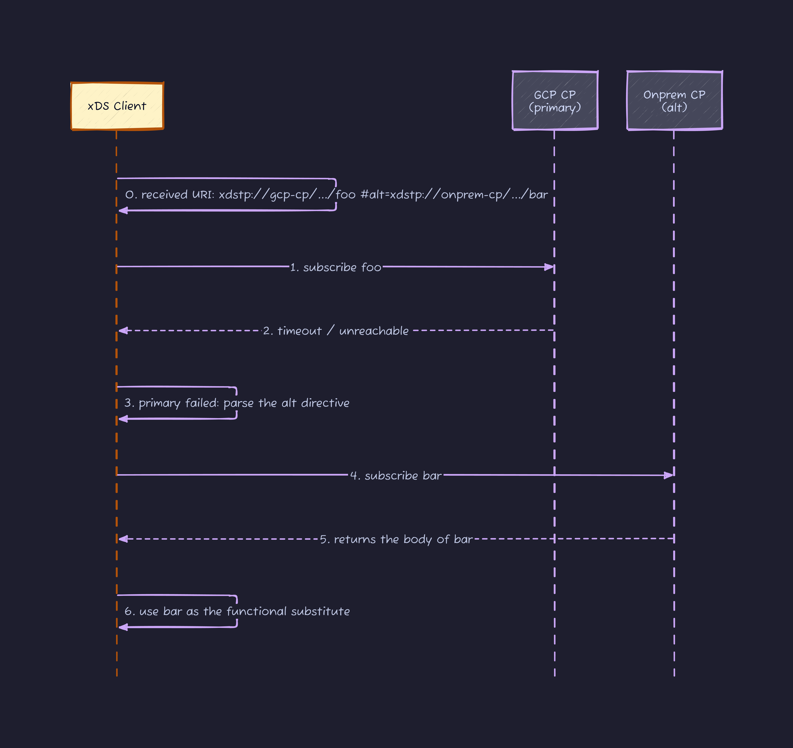
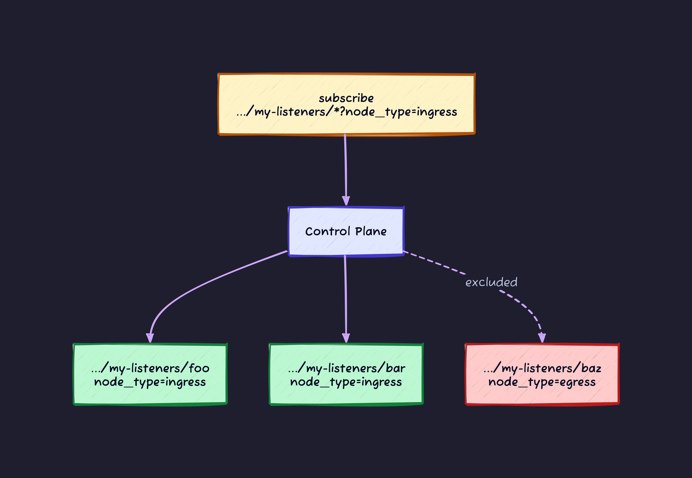
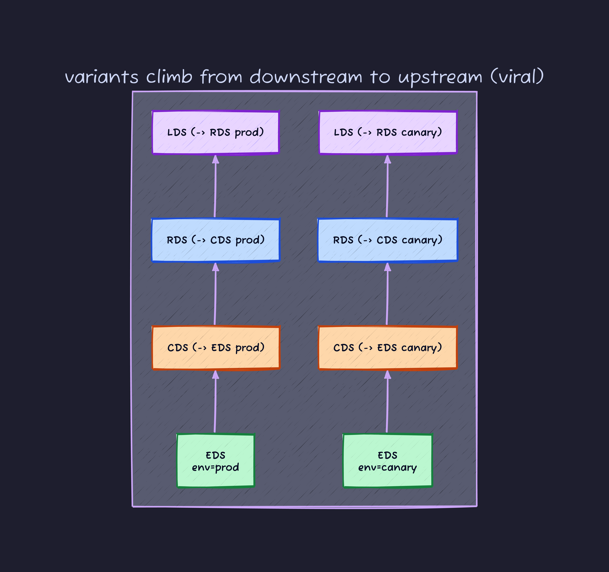
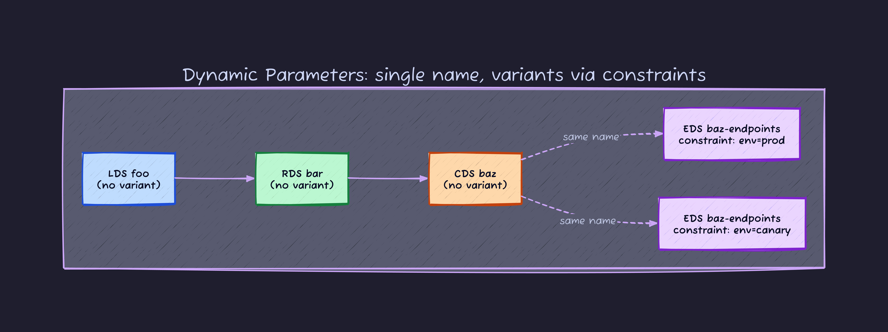
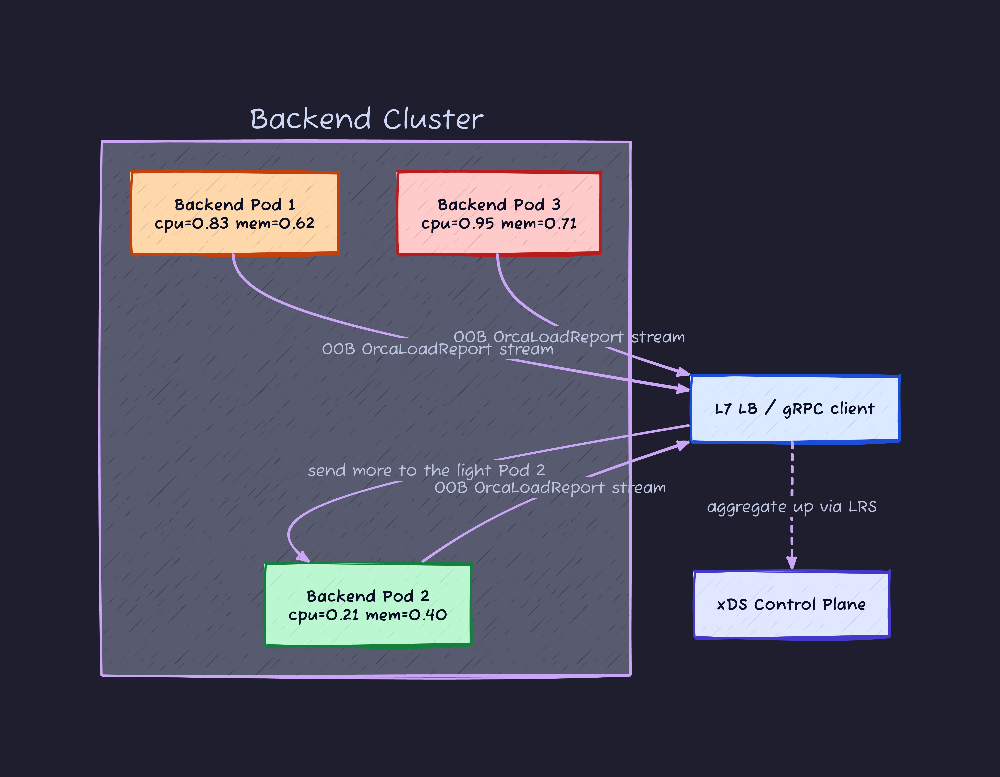
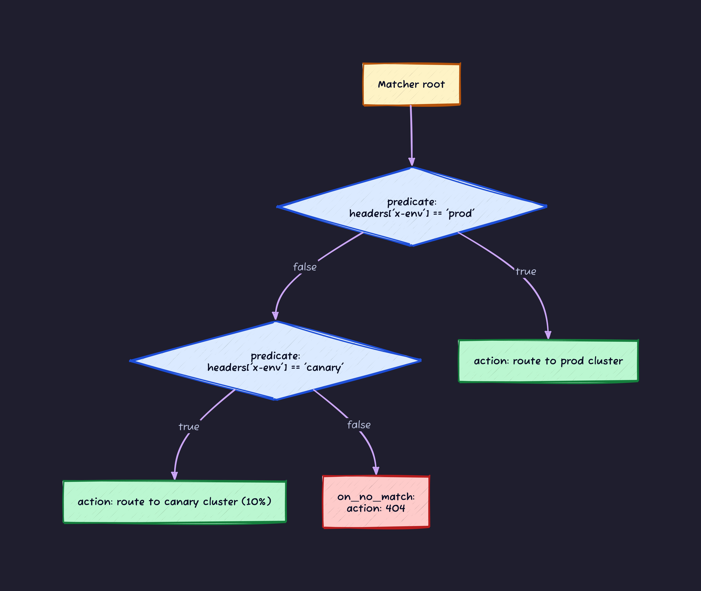

## Introduction

In [xDS Deep Dive: Dissecting the "Nervous System" of the Service Mesh](https://dev.to/kanywst/xds-deep-dive-dissecting-the-nervous-system-of-the-service-mesh-3m5i) I dug into the dependency chain of `LDS / RDS / CDS / EDS / SDS`, the robustness of `ACK/NACK`, why `ADS` exists, and the evolution from `SotW` to `Delta`. In short, it was about **how Envoy consumes xDS**.

But there was one line I tossed off at the very end:

> xDS isn't Envoy-only anymore. The CNCF xDS API Working Group is standardizing it as the "Universal Data Plane API".

I waved at that and never came back to it. This time I take it seriously, and I change my stance from Part 1. Part 1 read xDS from the **consuming side: how Envoy eats it**. This one is about the **producing side: how you design what gets shipped over xDS, and how**.

Why frame it that way? Because every decision you face when designing xDS resources (what to name them, how to split them, how to express variants, which CP owns them) is already spelled out in the `github.com/cncf/xds` protos and the xRFC documents. `xdstp://`, Authority, Dynamic Parameters: read straight, they look like feature descriptions. Read through a designer's eyes, they're **levers, each one saying "here is where you choose, and how"**. I'll re-read them one by one as design choices.

And I won't stop at theory. At the end I use `go-control-plane` to **build a Listener → Route → Cluster graph by hand and serve it**, then confirm in the output that what I designed actually lands on the wire. I cloned the protos locally too, so I'll keep the definitions open beside me.

```bash
git clone https://github.com/cncf/xds ~/xds
ls ~/xds/xds/core/v3/
# authority.proto       collection_entry.proto  context_params.proto
# extension.proto       resource.proto          resource_locator.proto
# resource_name.proto   cidr.proto              ...
```

The protos sitting in there are the proxy-neutral core: types that don't depend on Envoy at all.

### Vocabulary to keep handy

I'm writing this assuming you've read Part 1, but here's a quick glossary of terms that come up a lot. Come back here when you get stuck.

| Term                          | Role                                                                                   |
| ----------------------------- | -------------------------------------------------------------------------------------- |
| `LDS / RDS / CDS / EDS / SDS` | The five core xDS services. Linked by reference: Listener → Route → Cluster → Endpoint |
| `ADS`                         | Multiplexes the above onto a single gRPC stream. Required when ordering matters        |
| `Node`                        | The identity + metadata a client sends to the server at the start of the stream        |
| `SotW` / `Delta`              | Two modes: send every resource each time, or send only the diff                        |
| `ACK / NACK`                  | How a client reports whether it could apply the config, via `version_info` and `nonce` |
| `LRS`                         | A xDS-family service where the client reports endpoint load back to the CP             |

## 0. The premise: xDS is nothing but "protobuf flowing over a gRPC stream"

In Part 1 I explained `LDS / RDS / CDS / EDS`, but it hit me that I never once showed **the shape of the xDS interface itself**. If that hasn't clicked, everything that follows (`xdstp://`, ORCA, all of it) floats in the air. So let me drop down a level and look at the xDS transport plainly.

### xDS is a single gRPC service

There's no standalone "xDS protocol". **xDS is one gRPC service definition.** The ADS from Part 1 is, concretely, this proto in envoy's `service/discovery/v3`:

```proto
// envoy/service/discovery/v3/ads.proto
service AggregatedDiscoveryService {
  rpc StreamAggregatedResources(stream DiscoveryRequest)
      returns (stream DiscoveryResponse);

  rpc DeltaAggregatedResources(stream DeltaDiscoveryRequest)
      returns (stream DeltaDiscoveryResponse);
}
```

A bidirectional streaming RPC, `stream ... returns (stream ...)`, and that's it. The client (the proxy) holds a single stream open to the CP, pushes `DiscoveryRequest` upstream and receives `DiscoveryResponse` downstream, forever. LDS, CDS, EDS aren't "different protocols": they're **just messages with different `type_url` flowing over the same stream**. Even `SotW` / `Delta` from Part 1 are nothing more than two dialects on this one stream.



The crux is that **there's only one stream**. You don't open a connection per type; a single bidirectional stream, multiplexed by `type_url`, carries Clusters, Listeners, Endpoints, and both ACKs and NACKs all mixed together. Exactly which fields express that `ACK` / `NACK` becomes clear the moment you open up the messages.

### Why is it all protobuf

"Why is the config protobuf instead of YAML or JSON" answers itself once you're here. **Because xDS is gRPC.** gRPC's IDL is protobuf, and you can only define a service's arguments and return values as protobuf messages. `DiscoveryRequest` / `DiscoveryResponse` being protobuf isn't even a choice; it's a consequence of deciding to use gRPC. The resource bodies (Listener, Cluster) ride inside these messages, so they have to be protobuf too.

Look inside the request / response and you'll see the entire behavior of xDS collapses into the fields of these two messages.

```proto
// upstream: client -> CP
message DiscoveryRequest {
  string version_info = 1;            // the version I'm currently ACKing
  Node node = 2;                      // my identity, sent at the start of the stream
  repeated string resource_names = 3; // "give me these"
  string type_url = 4;                // which kind (Listener? Cluster?)
  string response_nonce = 5;          // which response this replies to
  google.rpc.Status error_detail = 6; // the reason, when this is a NACK
}

// downstream: CP -> client
message DiscoveryResponse {
  string version_info = 1;
  repeated google.protobuf.Any resources = 2; // <- resource bodies are Any
  string type_url = 4;
  string nonce = 5;
}
```

In Part 1 I wrote "`ACK/NACK` is returned via `version_info` and `nonce`". Well, those `version_info` / `nonce` / `error_detail` are literally fields on this message. An `ACK` is a `DiscoveryRequest` with `error_detail` empty; a `NACK` is a `DiscoveryRequest` with `error_detail` set. That's all.

### The core: resource bodies are wrapped in `google.protobuf.Any`

The field that matters most is the type of `resources`: `repeated google.protobuf.Any`. `Any` is a pair of "a `type_url` string + serialized bytes", **a box that can wrap any protobuf message regardless of type**. So xDS isn't "the protocol that carries Listeners" or "the protocol that carries Clusters". It's **a type-neutral config bus that names the type via `type_url` and wraps the body in `Any`**.

This "type-neutral box" property is exactly where **Universal Data Plane** starts. If the box doesn't care about the type, then standardizing just the "name" and "type" you ship opens the door to a world that isn't Envoy-specific. What `cncf/xds` is trying to do is precisely this: universalize `resource_names` and `type_url`.

### What is an "xDS client", really

Now the thing the phrase "xDS client" points to is clear. It's **a state machine living inside the proxy (Envoy itself, or the gRPC library) that manages this bidirectional stream**. What it does:

1. Holds a single `StreamAggregatedResources` stream to the CP (the one that holds is the client; the one that waits, the CP, is the server)
2. Names itself by sending `Node` at the start, and subscribes to the `resource_names` it wants via `DiscoveryRequest`
3. Routes the incoming `DiscoveryResponse` `Any` by `type_url`, unpacks it, and bakes it into internal config
4. If it applied, `ACK` via `version_info` + `nonce`; if it broke, `NACK` with `error_detail`
5. Keeps a local cache of "which resource at which version I currently hold"

In §3 I actually poke at grpc-go's `internal/xds/bootstrap`, and that turns out to be the config that decides **which CP this xDS client opens a stream to at startup**. And every feature of `cncf/xds` this article reads (`xdstp://`, Authority, Dynamic Parameters, ORCA) is, almost entirely, about **expanding the vocabulary of "what this client subscribes to and how the CP answers"**. In fact, the TP1 `ResourceLocator` and the TP3 `ResourceError` that show up later **already exist as fields** on the latest `DiscoveryRequest` / `DiscoveryResponse` (`resource_locators` / `resource_errors`). That's proof the standard is already descending onto the wire.

### A map for reading this as a designer

For a designer, what you ship is ultimately just the proto you stuff into that `Any` and the name you attach to it. So design boils down to deciding **"which proto, named how, at what granularity, served from which CP"**. The chapters that follow knock out those decision points one at a time.

| Chapter | Design decision                                    | Lever                                   |
| ------- | -------------------------------------------------- | --------------------------------------- |
| §2      | What name do you give a resource                   | `xdstp://` URI / id / context_params    |
| §3      | How many CPs, and where you draw the boundary      | Authority / federation                  |
| §4      | Whether to bake references and failover into names | Resource Locator (`alt=` / `entry=`)    |
| §5      | Subscribe one at a time, or ship in bundles        | singleton / collection / glob           |
| §6      | Bake variants into the name, or keep them out      | Context Parameters / Dynamic Parameters |
| §7      | What granularity to pick for errors and resources  | TP3 Resource Error / NACK blast radius  |
| §8      | Whether to wire telemetry into the design          | ORCA / LRS                              |
| §9      | Where to hold matching, declaratively              | Unified Matcher / CEL                   |
| §11     | Actually build and ship all of the above           | go-control-plane snapshot               |

Each chapter ends with a **"design call"**: the options, the criterion for choosing, and how it breaks when you get it wrong, condensed onto one card. The goal is for this to work not just as reading but as a checklist when you design your own mesh.

## 1. Why does `cncf/xds` exist in the first place

Envoy has long had a mountain of protos at `envoyproxy/envoy/api`: that place where `envoy.config.listener.v3.Listener`, `envoy.config.cluster.v3.Cluster`, and friends live. So a natural question is: don't we already have those, why a separate repo?

The answer is one line in the README:

```text
We will evolve the xDS APIs to support additional clients, for example
data plane proxies beyond Envoy, proxyless service mesh libraries,
hardware load balancers, mobile clients and beyond.
```

As long as xDS lives inside the Envoy repo, the `envoy.config.*` namespace tags along forever. When gRPC Proxyless speaks xDS, when Cilium ztunnel speaks xDS, when a load balancer speaks xDS, everyone ends up importing `envoy.config.*`.

Structurally that makes it **"everyone else eats Envoy's leftovers"**, and the standardization story doesn't hold up. So the WG has been incrementally carving the Envoy-independent parts out into `cncf/xds`.

While we're here: there's also an old repo `cncf/udpa`, but it's retired. `udpa/README.md` says it bluntly:

```text
THESE PROTOS ARE DEPRECATED
We are no longer using the "UDPA" name, and we are moving away from the
protos in this tree. Users should prefer the corresponding protos in
the xds tree instead.
```

So when we talk xDS from here on, you can ignore `udpa`. Just look at `cncf/xds`.



That's the preamble. The real subject is **reading what's inside `cncf/xds`**. A quick roll call of what lives there:

| Component                    | What it is                                                                   | xRFC          |
| ---------------------------- | ---------------------------------------------------------------------------- | ------------- |
| `xdstp://` URI / Authority   | A universal namespace stamped on every resource                              | TP1           |
| Context Parameters           | Embed a resource "variant" into the URI                                      | TP1           |
| Resource Locator + directive | `alt=` (failover), `entry=` (inline reference)                               | TP1           |
| Glob Collections             | Wildcard subscription of the form `xdstp://.../foo/*`                        | TP1           |
| Dynamic Parameters           | Express variants without putting them in the name (no name pollution)        | TP2           |
| Resource Error               | Return per-resource errors without tearing down the stream                   | TP3           |
| ORCA                         | A separate-family service carrying load metrics backend -> client            | (xds.service) |
| Unified Matcher API          | A shared matching tree across all extensions                                 | (xds.type)    |
| CelExpression                | A type letting matchers and extensions call CEL (Common Expression Language) | (xds.type)    |

I'll knock these out top to bottom.

## 2. Why resource names had to become URIs

Here's the real start. **Unless I first explain why `xdstp://` was born**, the reason for the following chapters (Authority, Context Parameters, Resource Locator) won't land at all.

### What a legacy xDS resource name actually was

I touched on this in Part 1, but an xDS resource used to be identified by three things:

1. **Resource name**: an arbitrary opaque string. e.g. `foo`
2. **type URL**: the resource's proto type. e.g. `envoy.config.endpoint.v3.ClusterLoadAssignment`
3. **the `Node` message**: identity info about the node (locality, metadata, etc.), sent once at the start of the stream

The problem: control-plane implementations started looking at `Node` metadata and **returning different bodies for the same name `foo`**. That spawns a nasty side effect.

### What breaks: caching

At medium scale and up, you want to drop a **cache layer** in the middle of xDS. Classic examples are `xds-relay` (a relay / caching server for xDS published by the Envoy project) or a setup like `Envoy Mobile`, which embeds Envoy in the mobile app's own process (one client per device, O(millions) scale). Once your client count crosses a threshold, the CP can't keep up without a relay.

But the moment `Node` gets tangled into the cache key, it's over.


A single key `foo` doesn't say whose `foo` it is. Mix `Node` into the cache key and you get a separate entry per Envoy, which defeats the cache entirely. That's the starting point for TP1.

### The answer: cram the needed context into the name itself

The `xdstp://` URI format is this, written verbatim in the comment of `xds/core/v3/resource_name.proto`:

```text
xdstp://{authority}/{type_url}/{id}?{context_params}
```



The point is that **this one URI uniquely determines the resource**. Without consulting `Node` metadata, you can pin down `foo` as "whose, for what, in which state". The relay can do a cache lookup on the URI alone without peeking at `Node`, so for the first time caching means something.

In proto, it looks like this:

```proto
// xds/core/v3/resource_name.proto
message ResourceName {
  string id = 1;                    // "api-fe"
  string authority = 2;             // "traffic-director.gcp.io"
  string resource_type = 3;         // "envoy.config.listener.v3.Listener"
  ContextParams context = 4;        // {env: prod, region: us}
}

// xds/core/v3/context_params.proto
message ContextParams {
  map<string, string> params = 1;
}
```

`context` takes arbitrary key-values. By convention the `xds.resource.*` prefix is reserved; for example `xds.resource.listening_address` (e.g. `"10.1.1.3:8080"`) is defined for Listeners.

By here, the new worldview lands: **an xDS resource name is not a plain string, it's a URI.**

**Design call: what goes where in the name**

Because the URI has four slots (authority / type / id / context_params), as a designer you decide every time which piece of info goes in which slot. The guidance:

- **id**: only **the stable identity** of the resource. A logical name like `api-fe`. Do not put variable axes like `env` or `version` here. Change the id and it's a different resource.
- **context_params**: the axes where **the body changes per client or environment** (`env`, `region`). This becomes the cache key and triggers the viral effect below, so don't overload it (§6).
- **authority**: **which CP owns** the resource (§3).
- **How it breaks**: fold an environment into the id like `api-fe-prod` and names proliferate per environment, and the upstream references (`RDS → CDS`) split per environment too. Keep "id immutable, variation in context_params" and you confine that proliferation to one place.

## 3. Authority and federation

The first thing in the URI path is `authority`, and that's meaningful.

### One client speaking to multiple control planes

Legacy xDS implicitly assumed **one control plane per client**. `ConfigSource` was basically a single source. But reality isn't a single source:

- You want a CPaaS (Control Plane as a Service) as primary, with your own on-prem CP as failover
- Multi-cloud, with separate CPs on the AWS and GCP sides while Envoy runs across clusters
- Pull only specific resource types from a different CP managed by a different team

By building `Authority` into the URI, TP1 lets you put a mapping of "authority name -> physical CP address" into the client's bootstrap. For gRPC this exists for real as the `authorities` map in the bootstrap JSON. Here's the actual format grpc-go can parse:

```json
{
  "xds_servers": [ ... ],
  "client_default_listener_resource_name_template":
    "xdstp://traffic-director.gcp.io/envoy.config.listener.v3.Listener/%s",
  "authorities": {
    "traffic-director.gcp.io": {
      "xds_servers": [{
        "server_uri": "trafficdirector.googleapis.com:443",
        "channel_creds": [{"type": "google_default"}],
        "server_features": ["xds_v3"]
      }]
    },
    "onprem-cp.internal": {
      "xds_servers": [{
        "server_uri": "istiod.mesh.svc:15010",
        "channel_creds": [{"type": "insecure"}],
        "server_features": ["xds_v3"]
      }]
    }
  }
}
```

Now writing `xdstp://traffic-director.gcp.io/...` in a resource URI sends the query to the former, and `xdstp://onprem-cp.internal/...` to the latter. One Envoy / gRPC client can **speak to multiple CPs at once, keyed on a "logical authority"**.



That's the seed of **xDS federation**. In the gRPC world the client-side bootstrap spec is nailed down in the `A47-xds-federation` proposal. Look inside grpc-go's `internal/xds/bootstrap` and the `Authorities` field is already implemented, structured to hold a list of `ServerConfig` per authority.

### Run it to check: feed it to the bootstrap parser

"It's implemented" sounds like a cop-out in words, so I fed the bootstrap above to grpc-go's real parser (`internal/xds/bootstrap`). It does three things only: (1) parse the bootstrap and look up authority -> CP address, (2) watch the legacy logical target `xds:///api-fe` expand into `xdstp://` via `client_default_listener_resource_name_template`, (3) parse the resulting URI back apart with `ParseName()`.

```go
cfg, _ := bootstrap.NewConfigFromContents([]byte(bs)) // bs = the JSON above
for name, a := range cfg.Authorities() {
    fmt.Printf("%-24s -> %s\n", name, a.XDSServers[0].ServerURI())
}
// xds:///api-fe expands into an xdstp:// name via the template
fmt.Println(bootstrap.PopulateResourceTemplate(
    cfg.ClientDefaultListenerResourceNameTemplate(), "api-fe"))
// parse the resulting URI back apart
n := xdsresource.ParseName(
    "xdstp://onprem-cp.internal/envoy.config.listener.v3.Listener/api-fe?env=prod")
fmt.Printf("authority=%q type=%q id=%q ctx=%v\n", n.Authority, n.Type, n.ID, n.ContextParams)
```

Clone `grpc-go`, run this (confirmed on `grpc-go 0f3086d` / `go1.26.4`), and the actual output is:

```text
== parsed authorities ==
  traffic-director.gcp.io  -> trafficdirector.googleapis.com:443
  onprem-cp.internal       -> istiod.mesh.svc:15010

== xds:///api-fe expands via client_default template ==
  xds:///api-fe  =>  xdstp://traffic-director.gcp.io/envoy.config.listener.v3.Listener/api-fe

== ParseName() splits an xdstp URI back into parts ==
  scheme="xdstp" authority="onprem-cp.internal"
  type="envoy.config.listener.v3.Listener" id="api-fe" ctx=map[env:prod]
```

The payoff is from line 3 on. **A perfectly ordinary target `xds:///api-fe` turns, internally, into an authority-qualified URI `xdstp://traffic-director.gcp.io/.../api-fe`**. And `ParseName()` cleanly splits that URI into `authority / type / id / context_params` (note `?env=prod` getting picked up as `ctx=map[env:prod]`). In §2 I wrote "a resource name isn't a string, it's a URI", and this is that being literally true at the code level.

**Design call: how many CPs, and where to cut the authority boundary**

Authority isn't a physical CP address; it's **the logical boundary of "who owns this set of resources"**. So you draw the line along the org chart and trust boundaries.

- **When to split**: (1) different managing team, (2) different trust boundary (your own CP vs a vendor CP), (3) you want fault isolation (escape to your own CP when CPaaS is down), (4) different lifecycle (config that changes constantly vs config that almost never does)
- **When not to split**: merely a different physical DC or region. That should be a context_param (`region=us`); splitting the authority for it is overkill
- **How it breaks**: split too much and the bootstrap bloats while cross-authority resource references multiply, complicating operations. Split too little and a single CP becomes the SPOF / scaling ceiling. "Split only where ownership splits" is the sweet spot

## 4. Resource Locator: failover and inline references

By looks alone `xdstp://` resembles a URL so closely it's easy to miss, but the `fragment` (after `#`) hides an extension with real teeth: **directives**.

```text
xdstp://{authority}/{type_url}/{id}?{context_params}{#directive,*}
```

In proto that's `ResourceLocator`:

```proto
// xds/core/v3/resource_locator.proto
message ResourceLocator {
  Scheme scheme = 1;          // XDSTP / HTTP / FILE
  string id = 2;
  string authority = 3;
  string resource_type = 4;
  oneof context_param_specifier {
    ContextParams exact_context = 5;
  }
  repeated Directive directives = 6;

  message Directive {
    oneof directive {
      ResourceLocator alt = 1;   // failover target
      string entry = 2;          // inline reference
    }
  }
}
```

Let me kill one confusing naming collision here. This `ResourceLocator` / `ResourceName` is from **`xds.core.v3`** (cncf/xds): the core type that defines "the grammar of a name". Separately, the `ResourceLocator` carrying `dynamic_parameters` and the `ResourceName` carrying `dynamic_parameter_constraints` that show up in §0 and §6 are the same-named messages on the **`envoy.service.discovery.v3`** side: a different thing, for transport (subscribe / deliver). Same names, different layers (one is "the type of the name itself", the other "the type of the discovery message that carries that name"). This chapter is reading the former, the core type.

### `alt=`: failover

The `alt` directive is an instruction meaning **"if you can't fetch this resource, try the alternate URI"**.

```text
xdstp://gcp-cp/envoy.config.endpoint.v3.ClusterLoadAssignment/foo#alt=xdstp://onprem-cp/envoy.config.endpoint.v3.ClusterLoadAssignment/bar
```

"If the GCP-side CP is unreachable, fall back to the on-prem CP" becomes something **you can write in a single string**. The client only needs both authorities registered in its bootstrap.



### `entry=`: inline reference

When a List collection (below) inline-expands several resources, this is the fragment to **reference one specific entry inside the collection by name**.

```text
xdstp://some-authority/envoy.config.listeners.v3.ListenerCollection/foo#entry=bar
```

This means "the item named `bar` inside collection `foo`". After you pull the whole collection, you can reuse its insides as URIs again, a recursive usage that's allowed.

**Design call: whether to bake failover and references into the name**

A directive is a tool for "declaratively baking behavior into the name". Handy, but bake too much in and it stiffens up.

- **Use `alt=`**: for failover where the alternate is **statically determined** (primary CP -> backup CP). No client-side logic; the intent fits in one URI
- **Use `entry=`**: when you want to reference and reuse an entry inside a collection by name after fetching it
- **How it breaks**: if "where to fail over to" changes dynamically and you bake it into the name with `alt=`, the resource name changes on every switch and stiffens. Keep dynamic decisions in the client / LB, and bake only static things into the name

## 5. Collections and glob: formalizing bulk subscription

This one quietly pays off. As I wrote in Part 1, in old xDS **only LDS / CDS were special**: empty `resource_names` meant the implicit rule "wildcard = give me everything". RDS / EDS / SDS, meanwhile, were explicit-subscription. That **mix of special-casing and implicit rules** had become technical debt.

TP1 cleaned this up by **making collections (sets) a first-class concept**.

### List collection

Separate from a singleton URI that references one resource, a collection URI exists.

```text
# singleton (one resource)
xdstp://auth/envoy.config.listeners.v3.Listener/api-fe

# list collection (a set of resources)
xdstp://auth/envoy.config.listeners.v3.ListenerCollection/my-listeners
```

The server can answer in two ways:

1. **Return a list of Locators**: "the bodies are at other URIs, come fetch them yourself"
2. **Embed bodies via InlineEntry**: "I want to save round-trips, so here are the bodies too"

The proto is `CollectionEntry`:

```proto
// xds/core/v3/collection_entry.proto
message CollectionEntry {
  oneof resource_specifier {
    ResourceLocator locator = 1;     // 1. points to another URI
    InlineEntry inline_entry = 2;    // 2. hands you the body right here
  }
}
```

### Glob collection: formalizing the wildcard

When you want to subscribe to "everything matching a given prefix", use a **glob**.

```text
xdstp://auth/envoy.config.listeners.v3.Listener/my-listeners/*?node_type=ingress
```

The trailing `/*` is the glob. You can send this as a subscription, and the server returns every matching resource. A context parameter like `node_type=ingress` narrows it further.



This kills the LDS / CDS "empty string = wildcard" black magic. Everything closes over structured URIs.

**Design call: subscribe one at a time, or ship in bundles**

How you present resources to the client is your call.

- **singleton (explicit subscribe)**: when the client **knows the names it needs in advance**. Simplest when the count is bounded and relationships are static
- **list collection**: when the server wants to manage "this set". Send bodies via `inline_entry` to **save round-trips**, or return only `locator` for **lazy fetch**. Use this when set members change often
- **glob (`/*`)**: when the client **doesn't know the individual names / they're dynamically added and removed** (e.g. all ingresses). Narrow with `?node_type=ingress`
- **How it breaks**: a too-broad glob ships unneeded resources and eats bandwidth and memory. Conversely, making everything a singleton makes the subscription list a chore, requiring client-side subscription updates every time you add a resource

## 6. Context Parameters and Dynamic Parameters: how to express "variants"

Things get a bit more advanced here. How do you answer the demand: **"same resource named `foo`, but I want a different body per client"**?

### The Context Parameters (TP1) way

As we saw, you put it in the URI's query string.

```text
xdstp://auth/RouteConfiguration/foo?env=prod&version=v1
xdstp://auth/RouteConfiguration/foo?env=canary&version=v1
xdstp://auth/RouteConfiguration/foo?env=prod&version=v2
```

These are treated as **completely separate resources**. Different cache key, different subscription.

But this approach has a fatal weakness, which the TP2 document articulates well: the phenomenon of **virality**.

The xDS reference graph runs top-down, `LDS → RDS → CDS → EDS`. Variants spread **in the opposite direction**. If EDS has two variants `env=prod` and `env=canary`, the CDS that references it splits into two, each pointing at one variant's URI. Once CDS splits into two, the RDS pointing at it needs two as well. And the LDS above that, two. In other words, **"an EDS variant climbs up the dependency graph and swaps out the upstream resources wholesale"**. The diagram below is for a single `env` axis (green -> orange -> blue -> purple is the upstream direction).



On top of that, context parameters are exact-match only, so adding axes causes a combinatorial blowup. Let me count it concretely. Just wanting `env={prod,canary,test}` x `version={v1,v2,v3}`, two axes of three values each, gives `3 x 3 = 9` variants. And because it's viral, those 9 spread across every layer of the dependency graph.

| Layer        | Count the CP holds under TP1 (context params) | Breakdown             |
| ------------ | --------------------------------------------- | --------------------- |
| EDS          | 9                                             | `env x version`       |
| CDS (-> EDS) | 9                                             | one per EDS variant   |
| RDS (-> CDS) | 9                                             | spread upstream       |
| LDS (-> RDS) | 9                                             | spread further up     |
| **Total**    | **36**                                        | logically one service |

Logically it's "one service with an env and version axis", yet as xDS resources it's 36. Wanting to add one EDS option spreads the same variant across every layer, CDS / RDS / LDS. That's the weakness of TP1.

### The Dynamic Parameters (TP2) way

TP2 flips this. **It evicts "the info used to select a variant" from the resource name and into a separate field that only the transport layer sees.**

```proto
// envoy/service/discovery/v3/discovery.proto (real; also generated in go-control-plane)
message DynamicParameterConstraints {
  message SingleConstraint {
    string key = 1;
    oneof constraint_type {
      string value = 2;        // exact value match
      Exists exists = 3;       // key-existence check
    }
  }

  oneof type {
    SingleConstraint constraint = 1;
    ConstraintList or_constraints = 2;
    ConstraintList and_constraints = 3;
    DynamicParameterConstraints not_constraints = 4;
  }
}
```

On the wire the flow splits in two directions. The client puts `dynamic_parameters` (`map<string, string>`) on the subscribing `ResourceLocator` to say "these are the parameters I hold". The server puts `dynamic_parameter_constraints` on the returned `ResourceName` to say "this resource is for clients satisfying this constraint". The important part is that this constraint is **not part of the resource's id (the URI string)**. The EDS a CDS points at stays a single name, yet the EDS side can serve out the `env=prod` variant and the `env=canary` variant separately.



So what happens to that "36"? Under Dynamic Parameters the **resource names stay the four `LDS / RDS / CDS / EDS`**, and the `env` / `version` axes exist only as constraints attached to EDS. Variants don't pollute the namespace, so the upstream viral spread stops. The constraint's expressive power is `value` exact-match, `Exists` (key existence), and AND / OR / NOT combinations, so you can express exactly the variants you actually need via constraints. And a **caching xDS proxy** only needs to look at the constraint to remember multiple variants, without touching the data-model graph.

That said, while the proto type has landed in envoy, TP2's own `Implementation` section is still `TBD (Will probably be implemented in gRPC before Envoy)`. The type exists, but the behavior that actually serves out variants is, like TP3, expected to come to gRPC first, and is still ahead of us.

**Design call: bake variants into the name, or keep them out (the chapter's crux)**

This is the single biggest design fork in this article. Which one you pick changes how things break when variants grow.

- **Pick Context Parameters**: when variant axes are **few** and the upstream viral spread is tolerable. A simple, exact-match-only mechanism that **works today on both Envoy and gRPC**. Clean cache keys too. For a small-to-medium single `env` axis, this is plenty
- **Plan for Dynamic Parameters**: when variant axes are **many** and `axes x values x layers` combinatorially blows up. It doesn't pollute the name, so virality stops. But it needs constraint-evaluation logic, and **the behavior is currently unimplemented** (gRPC expected first). You can't deploy it today, but you can choose to not pollute your name design now, on the premise of moving there later
- **A numeric criterion**: as counted in §6, two axes of three values each (`env x version`) balloons early to 36 resources. **The moment "the variant count looks like it'll hit double digits" is the danger signal for a context_params-only approach.** At that point, defend "don't bake variants into the id" and deliberately keep the variant count down until dynamic parameters catch up in implementation
- **How it breaks**: carelessly grow context_params and the entire reference graph splits per variant and cache efficiency collapses. Conversely, deploy dynamic parameters today "because it's new" and there's no serving side to implement it, so it simply doesn't work

## 7. TP3: returning per-resource errors without tearing down the stream

Unglamorous, but it bites once you operate this stuff.

In legacy xDS there was effectively one way to say "can't fetch this resource": **tear down the whole stream with a non-OK status**. That's way too blunt. One NOT_FOUND out of 100 resources stops the other 99 updates too.

Worse, the SotW protocol had no way to even express "the resource doesn't exist"; the client had to wait for a **15-second does-not-exist timer** to fire. This is a spec hole (also documented in [Envoy's official docs](https://www.envoyproxy.io/docs/envoy/latest/api-docs/xds_protocol)).

TP3 solves it by adding a `resource_errors` field to `DiscoveryResponse`.

```proto
message ResourceError {
  ResourceName resource_name = 1;
  google.rpc.Status error_detail = 2;
}

message DiscoveryResponse {
  // ...existing fields elided...
  repeated ResourceError resource_errors = N;
}
```

The client branches on the status code:

| status code                            | client behavior                                     |
| -------------------------------------- | --------------------------------------------------- |
| `UNAVAILABLE` / `INTERNAL` / `UNKNOWN` | treat as transient. Keep using the last good config |
| `NOT_FOUND` / `PERMISSION_DENIED`      | treat as a data error. Free to drop the cache       |
| anything else                          | undefined. SHOULD treat the same as transient       |

The benefit comes down to two things:

- **No tearing down the stream**. With `subscribe [foo, bar, baz]`, if only `baz` goes NOT_FOUND, the `foo` and `bar` updates keep running on the same stream
- **SotW can express does-not-exist instantly**. No waiting on the 15-second timer

The TP3 text says `This will probably be implemented in gRPC before Envoy.`, so gRPC lands first and Envoy follows.

**Design call: what granularity to pick for resources (the NACK blast radius)**

TP3 is about "error granularity", but what a designer actually controls is **the "resource granularity" upstream of it**. The more you cram into one resource, the wider the collateral damage when it NACKs.

- **Make it fat (all vhosts in one big Route)**: easy to manage, but one invalid spot **NACKs the whole resource**, halting updates for unrelated paths too. Before TP3, this was even a full stream teardown
- **Split it fine (per-vhost / per-service)**: small NACK blast radius. Carve the fragile, high-churn parts into separate resources and a NACK there leaves the rest running
- **TP3 presence changes your tolerance**: if the delivery target is gRPC (TP3 first), per-resource errors shrink the collateral, so you can stomach a bit of fatness. If it's Envoy-heavy without TP3 yet, **design granularity finer to physically shrink the collateral of an error**
- **How it breaks**: a giant resource invites "one typo fully outages it". Over-splitting invites a blowup in subscription count and reference-graph complexity. Split fine only where "change frequency x blast impact" is high

## 8. ORCA: the moment xDS outgrew "shipping config"

The lineage changes here. So far it's been "how to ship resources". ORCA is a protocol for **carrying load info from the backend to the client / LB**, and it lives in `xds/service/orca/v3/orca.proto`.

### Why it's needed

For an LB to route smartly, it wants to know whether a backend is "heavy or light right now": CPU usage, memory, a custom business cost metric, whatever. If each backend can hand this to the client / LB periodically or per-response, you get smarter load balancing.

### Two modes

ORCA has two delivery styles, laid out in [grpc.io's Custom Backend Metrics guide](https://grpc.io/docs/guides/custom-backend-metrics/).

| Mode                    | When it sends                            | Best for                          |
| ----------------------- | ---------------------------------------- | --------------------------------- |
| **Per-query (in-band)** | rides the trailer at RPC end             | short unary RPCs                  |
| **OOB (Out-of-Band)**   | pushed periodically on a separate stream | streaming RPCs, works at zero QPS |

The OOB service definition is just this:

```proto
// xds/service/orca/v3/orca.proto
service OpenRcaService {
  rpc StreamCoreMetrics(OrcaLoadReportRequest)
      returns (stream xds.data.orca.v3.OrcaLoadReport);
}

message OrcaLoadReportRequest {
  google.protobuf.Duration report_interval = 1;
  repeated string request_cost_names = 2;
}
```

When the client asks "give me metrics every 2 seconds", the backend server-streams load reports forever.



The body of `xds.data.orca.v3.OrcaLoadReport` carries cpu / memory / utilization plus an app-specific `request_cost` map you can add freely. Look at the proto directly and these are all the fields:

```proto
// xds/data/orca/v3/orca_load_report.proto
message OrcaLoadReport {
  double cpu_utilization = 1;
  double mem_utilization = 2;
  map<string, double> request_cost = 4;     // per-RPC cost
  map<string, double> utilization = 5;      // arbitrary 0..1 metrics
  double rps_fractional = 6;
  double eps = 7;                            // errors per second
  map<string, double> named_metrics = 8;    // app-defined metrics
  double application_utilization = 9;
}
```

You can put any app-specific unit on `named_metrics`, like "this RPC occupied a GPU for 1.2 sec".

### Run it to check: hit the OOB stream directly

grpc-go's `examples/features/orca` is itself an OOB server. The server is a demo that just toggles CPU usage between `0.5` and `0.9` every two seconds. Against it I wrote a ~30-line client that hits `StreamCoreMetrics` directly with `report_interval=2s`.

```go
cli := orcav3.NewOpenRcaServiceClient(cc)
stream, _ := cli.StreamCoreMetrics(ctx, &orcav3.OrcaLoadReportRequest{
    ReportInterval: durationpb.New(2 * time.Second), // "give it to me every 2s"
})
for {
    rep, err := stream.Recv()
    if err != nil {
        return
    }
    log.Printf("OrcaLoadReport: cpu=%.2f mem=%.2f", rep.GetCpuUtilization(), rep.GetMemUtilization())
}
```

Start the server (`go run server/main.go`), point this client at it, and it really keeps flowing (`grpc-go 0f3086d` / `go1.26.4`):

```text
19:13:18 OrcaLoadReport: cpu=0.90 mem=0.00
19:13:21 OrcaLoadReport: cpu=0.50 mem=0.00
19:13:24 OrcaLoadReport: cpu=0.50 mem=0.00
19:13:27 OrcaLoadReport: cpu=0.90 mem=0.00
```

Call `Recv()` once and the backend sends an `OrcaLoadReport` at roughly 2-second intervals until you hang up. You can see the server-side CPU toggle (`0.9` / `0.5`) showing up at the client as-is. Opposite to the pull model of xDS fetching config, **here the backend pushes load at you**. That's why I said up front this has a different flavor from "shipping config".

### Combining with LRS

The gRPC `A64-lrs-custom-metrics` proposal formalizes **sending client-aggregated ORCA metrics back to the control plane via LRS (Load Reporting Service)**. LRS is a bidirectional reporting service in the xDS family, originally a mechanism for the client to report "how many RPS I sent to which endpoint" back to the CP. A64 put custom metrics onto that payload.

So in the direction `Backend → Client → Control Plane`, metrics flow end-to-end within the xDS context. The CP gains a global view of "which backend is heavy overall" and can reflect it into the weights of the EDS it ships next. The point is **it doesn't close inside Envoy's world alone**: the picture is identical for gRPC Proxyless. xDS, which was supposed to be a config-shipping protocol, is reaching out to swallow the telemetry uplink too.

**Design call: whether to wire load info into the design**

If you want to decide EDS weights (the weighted cluster in §11) "smartly", you need to include in your design how the load info that feeds it is gathered.

- **per-query (in-band)**: when short unary RPCs dominate. Rides the trailer, no extra stream needed
- **OOB (`StreamCoreMetrics`)**: steady-state monitoring. Works at zero QPS, so you can observe even idle long-tail backends
- **aggregate up to the CP via LRS**: when you want to decide weights globally on the CP side. `A64` lets custom metrics ride too
- **How it breaks**: gather no telemetry at all and the CP can only ship static weights, causing the "spray evenly onto a genuinely heavy backend" accident. If you're talking about load balancing, the ORCA/LRS path is part of the design

## 9. Unified Matcher API: a shared matching tree across all extensions

Now the data-model side.

Historically Envoy's filters each had **their own matching machinery**: HTTP header match, RBAC principal match, access-log filter, access tags, external authorization. Each had its own proto and its own match logic. `xds.type.matcher.v3.Matcher` unifies that.

### Structure

It's expressed as a tree. Pulling just the essentials of the proto:

```proto
// xds/type/matcher/v3/matcher.proto
message Matcher {
  message OnMatch {
    oneof on_match {
      Matcher matcher = 1;                      // a nested matcher
      core.v3.TypedExtensionConfig action = 2;  // the action to run
    }
  }

  // ...field matcher list / exact match tree ...
  OnMatch on_no_match = N;
}
```

Inside `Matcher` there's a `MatcherList` (each entry is predicate + on_match) and a `MatcherTree` (a fast exact-match branch); reach a leaf and the `action` runs. `on_no_match` branches to the default when nothing hit.

### Embedding CEL

The standout is being able to call **CEL (Common Expression Language)** inside a predicate. The type for that is `xds.type.v3.CelExpression`, and you can write things like:

```text
request.headers['x-env'] == 'prod'
```

This directly drives a branch. Under Envoy's Unified Matcher, CEL matchers became usable in Access Log, RBAC, and external authorization, and CEL itself is a language Google has run for years in policy evaluation for internal IAM and the like, so this isn't some unproven toy being shoved into Envoy.



Why is this nice? The big operational win is **"reusing the same matching language across filters"**. The access-log filter and the RBAC policy can be written in the same DSL, so an operator only keeps one mental model. A declarative match language that closes inside the proto is unglamorous but effective.

**Design call: where and how to hold matching, declaratively**

Do you write match conditions for routing, authorization, and logging separately per filter, or unify them across the board?

- **Lean on Unified Matcher + CEL**: when multiple filters (RBAC / access log / external authz) want to **reuse the same condition expression**. Write one CEL like `request.headers['x-env'] == 'prod'` and share it
- **Stay with per-filter matching**: when it's a simple single-filter condition not worth bringing CEL in for
- **How it breaks**: write match conditions in separate DSLs per filter and the same "prod only" condition ends up subtly different everywhere, splitting the operator's mental model and breeding mistakes. Centralize cross-cutting conditions in Unified Matcher as the single source of truth

## 10. Putting it together: the world gRPC Proxyless sees

The pieces introduced above are exactly what gRPC's Proxyless xDS **assembles and uses on the client side**.

- The `authorities` map in the bootstrap file identifies multiple CPs (`A47-xds-federation`)
- An existing `xds:///my-service` target URI expands internally into an xdstp-form Listener name, but only when the bootstrap's `client_default_listener_resource_name_template` is set to `xdstp://` form (if the template contains `%s`, the service authority is embedded at that position)
- Load can be pulled directly from the backend via ORCA (`A51-custom-backend-metrics`)
- The aggregate can be returned to the control plane via LRS (`A64-lrs-custom-metrics`)

So a good chunk of the cncf/xds components dissected in the previous chapters is already at the point of **running inside the gRPC library without any sidecar**.


The "Proxyless gRPC" I introduced at the end of Part 1 runs as the result of assembling, on the client side, the pieces we've read here. It doesn't have Envoy's L7 extension points (Wasm, HTTP filter chains, etc.) so the coverage differs, but the standards-track features of xDS are landing on the gRPC side at a pace that keeps step with Envoy.

## 11. Designing as the shipper: actually writing a control plane

I've lined up the design levers. Now let's not leave it on paper, and run it. The brief is one worked example: design **"ship the `api` service as prod 90% / canary 10%"** as xDS resources, and serve it from a real control plane.

### Design: build the resource graph as proto objects

In §3 I raised "do you design from JSON?", but a production CP doesn't route through JSON. What go-control-plane's snapshot cache takes is `proto.Message` itself (`types.Resource = proto.Message`), and the designer `new`s proto structs directly in Go. The canary split is expressed via an **RDS weighted cluster**, splitting prod / canary into separate Clusters.

```go
// the designer builds the resource graph here (excerpt)
func designCluster(name, host string) *cluster.Cluster {
    return &cluster.Cluster{
        Name:                 name,
        ConnectTimeout:       durationpb.New(2 * time.Second),
        ClusterDiscoveryType: &cluster.Cluster_Type{Type: cluster.Cluster_LOGICAL_DNS},
        LbPolicy:             cluster.Cluster_ROUND_ROBIN,
        LoadAssignment:       /* endpoint host:8080 */,
    }
}

// prod 90% / canary 10% weighted route
func designRoute(routeName, prod, canary string) *route.RouteConfiguration {
    return &route.RouteConfiguration{
        Name: routeName,
        VirtualHosts: []*route.VirtualHost{{
            Name: "api", Domains: []string{"*"},
            Routes: []*route.Route{{
                Match: &route.RouteMatch{PathSpecifier: &route.RouteMatch_Prefix{Prefix: "/"}},
                Action: &route.Route_Route{Route: &route.RouteAction{
                    ClusterSpecifier: &route.RouteAction_WeightedClusters{WeightedClusters: &route.WeightedCluster{
                        Clusters: []*route.WeightedCluster_ClusterWeight{
                            {Name: prod, Weight: wrapperspb.UInt32(90)},
                            {Name: canary, Weight: wrapperspb.UInt32(10)},
                        },
                    }},
                }},
            }},
        }},
    }
}
```

Stuff the built graph into a snapshot and serve it as an ADS server. This is the one line that "puts what you designed onto the wire".

```go
snap, _ := cachev3.NewSnapshot("v1", map[resourcev3.Type][]types.Resource{
    resourcev3.ClusterType: {designCluster("api-prod", "prod.api.svc"),
                             designCluster("api-canary", "canary.api.svc")},
    resourcev3.RouteType:   {designRoute("api-route", "api-prod", "api-canary")},
})
cache := cachev3.NewSnapshotCache(false, cachev3.IDHash{}, nil)
cache.SetSnapshot(context.Background(), "edge-proxy-1", snap)

srv := serverv3.NewServer(context.Background(), cache, nil)
discovery.RegisterAggregatedDiscoveryServiceServer(grpcServer, srv) // grow an ADS endpoint
```

### Confirm: did what I designed actually land on the wire

Pull it back from the serving side with a raw ADS client (just open `StreamAggregatedResources` and send `DiscoveryRequest{TypeUrl: ClusterType}`). The actual output (`go-control-plane v0.14.0` / `envoy v1.37.0` / `go1.26.4`):

```text
== CDS (type_url=type.googleapis.com/envoy.config.cluster.v3.Cluster, version=v1, 2 resources) ==
  cluster api-prod     lb=ROUND_ROBIN endpoint=prod.api.svc
  cluster api-canary   lb=ROUND_ROBIN endpoint=canary.api.svc
== RDS (type_url=type.googleapis.com/envoy.config.route.v3.RouteConfiguration, version=v1, 1 resources) ==
  route   api-route    -> api-prod weight=90
  route   api-route    -> api-canary weight=10
```

The two Clusters I designed, `api-prod` / `api-canary`, and the `90 / 10` weighted route, came back on the wire as-is, `type_url` and all. The **`resources []Any` from §0 contains exactly the proto structs I just `new`d**. Design -> snapshot -> ADS -> fetch closes inside one Go program.

Here every thread laid since §0 gets pulled together: what I shipped was a proto stuffed in `Any` (§0), with an id `api-prod` attached (§2), served to one node `edge-proxy-1` (the authority/node of §3), with the canary variant **expressed not by baking it into the name but as an RDS weight** (the §6 practice of "don't put variants in the id"). All the design levers show up in these 30 lines.

### A few things change if the target is gRPC Proxyless

If you ship the same canary design to a **gRPC Proxyless client instead of Envoy**, the skeleton of the resource graph (`LDS → RDS → CDS → EDS`) is the same, but three things change. It comes down to who you are shipping to: the client side from §10 has its own constraints.

- **The Listener is built as an API listener, not a socket**. The Listener I built in §11 above was a socket listener with an `address` (Envoy actually binds a port). gRPC has no port to bind, so you have to ship an **API listener** with an `HttpConnectionManager` stuffed directly into the `Listener.api_listener` field. grpc-go's `unmarshal_lds.go` literally branches on `if lis.GetApiListener() != nil` to decide client-side, and hand it a socket listener and it won't treat it as a client one. The designer ends up branching how the Listener is built on "whether the target is proxyless"
- **The extension set is a subset. Build it rich and it NACKs**. The HTTP filters gRPC interprets are roughly `router` / `fault` / `rbac` / `ext_proc`; there's no Wasm or Envoy-specific filter. And gRPC **doesn't silently ignore unknown / unsupported fields, it rejects them** (e.g. it bounces a nonzero `xff_num_trusted_hops`). Ship a Listener you padded out for Envoy straight to proxyless and it NACKs. Narrow "the set of extensions you may use" per target at design time
- **Custom LB is specified via the Cluster's `load_balancing_policy`**. In §11 I hard-coded `LbPolicy: ROUND_ROBIN` on the Cluster, but for fancier load balancing on proxyless you put an `envoy.extensions.load_balancing_policies.*` proto (`ring_hash`, `wrr_locality`, `client_side_weighted_round_robin`, etc.) on the Cluster's `load_balancing_policy`. grpc-go converts it into an internal balancer tree via `xdslbregistry`. Pick `client_side_weighted_round_robin` to feed it the §8 ORCA metrics, and that's where **ORCA design and LB design connect**

So designing "what you ship" **branches on the target (Envoy or proxyless)**. Same canary, but a socket Listener + filter chain for Envoy, an API listener + limited filters + an LB-policy proto for proxyless. Even if cncf/xds provides a type-neutral box, you still have to design the box's contents to fit the receiver's capabilities.

## Conclusion

Part 1 was about learning to read xDS. This one was about being able to design what you ship over xDS. To close, here's every chapter's "design call" folded onto one card. The intent is: when you design your own mesh, run down this table top to bottom and you can decide "which lever to throw, and how", with nothing missed.

| Design lever           | Options                                 | Criterion for this side                                              | How it breaks when you throw it wrong                          |
| ---------------------- | --------------------------------------- | -------------------------------------------------------------------- | -------------------------------------------------------------- |
| Name (§2)              | id / context_params / authority         | id is the immutable logical name, variable axes go in context_params | bake env into id and names proliferate, references split       |
| CP boundary (§3)       | split authority / don't                 | split only where ownership / trust / fault isolation splits          | over-split=bloated bootstrap / under-split=SPOF                |
| Failover (§4)          | bake into name via `alt=` / client-side | use `alt=` declaratively when the alternate is static                | bake a dynamic switch into the name and it stiffens            |
| Subscription unit (§5) | singleton / collection / glob           | know the name=singleton, dynamic churn=glob                          | glob too broad=wasted bandwidth / too fine=chore subscriptions |
| Variant (§6)           | context_params / dynamic_params         | few axes=context, hits double digits=plan for dynamic                | grow context too far=36 blowup / dynamic is unimplemented      |
| Granularity (§7)       | fat / fine                              | split fine only where change frequency / blast impact is high        | a giant resource fully outages on one typo                     |
| Telemetry (§8)         | ORCA in-band / OOB / LRS aggregate      | short unary=in-band, steady monitoring=OOB                           | gather none and load balancing goes blind                      |
| Matching (§9)          | per-filter / Unified Matcher + CEL      | use Unified when you want the same DSL across the board              | scattered DSLs split the operator's mental model               |

Behind this table is the one fact from §0: **xDS is a type-neutral bus that can carry anything via `type_url` + `Any`, and design is deciding the proto and the name you stuff into that box.** Each xRFC of `cncf/xds` is the history of how that "naming and shipping" gets standardized.

xDS, which was supposed to be a "config shipper", is morphing into **a unified gRPC API family for remote-controlling a fleet of proxies**: federation via Authority, cache-friendly variants via Dynamic Parameters, bidirectional telemetry via ORCA / LRS, a declarative match language via Unified Matcher and CEL. The model "xDS = Envoy's config protocol" is too narrow as of 2026. And as §11 showed, that design and delivery is something you can pull into your own hands in **30 lines of Go**. Read the `cncf/xds` protos and xRFCs as design levers, and the rest is just assembly.

## References

- [CNCF xDS API Repository](https://github.com/cncf/xds)
- [TP1: xdstp:// structured resource naming, caching and federation support](https://github.com/cncf/xds/blob/main/proposals/TP1-xds-transport-next.md)
- [TP2: Dynamically Generated Cacheable xDS Resources](https://github.com/cncf/xds/blob/main/proposals/TP2-dynamically-generated-cacheable-xds-resources.md)
- [TP3: xds-error-propagation](https://github.com/cncf/xds/blob/main/proposals/TP3-xds-error-propagation.md)
- [A47: xDS Federation (gRPC proposal)](https://github.com/grpc/proposal/blob/master/A47-xds-federation.md)
- [A51: Custom Backend Metrics (gRPC proposal)](https://github.com/grpc/proposal/blob/master/A51-custom-backend-metrics.md)
- [A64: LRS Custom Metrics (gRPC proposal)](https://github.com/grpc/proposal/blob/master/A64-lrs-custom-metrics.md)
- [Envoy xDS REST and gRPC Protocol](https://www.envoyproxy.io/docs/envoy/latest/api-docs/xds_protocol)
- [Envoy Unified Matcher API](https://www.envoyproxy.io/docs/envoy/latest/api-v3/config/common/matcher/v3/matcher.proto)
- [Custom Backend Metrics (grpc.io)](https://grpc.io/docs/guides/custom-backend-metrics/)
- [envoyproxy/go-control-plane (xDS server / snapshot cache)](https://github.com/envoyproxy/go-control-plane)
